[ ] deflect is being paid automatically. 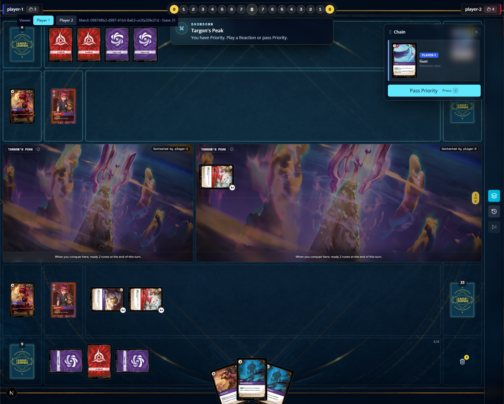
[ ] Choose spell from trash should use a different UI. 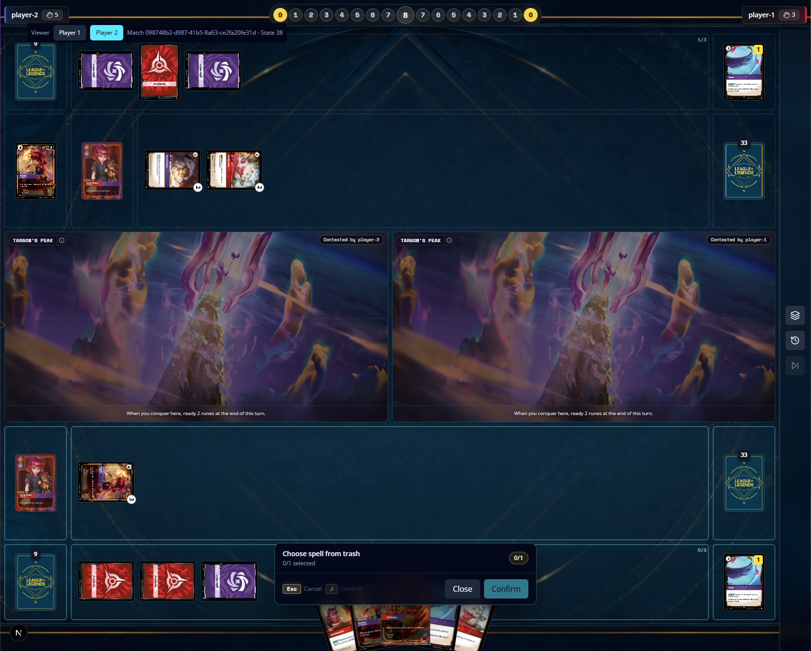
[ ] Dark child ability should happen at the same timing as targon's peak. 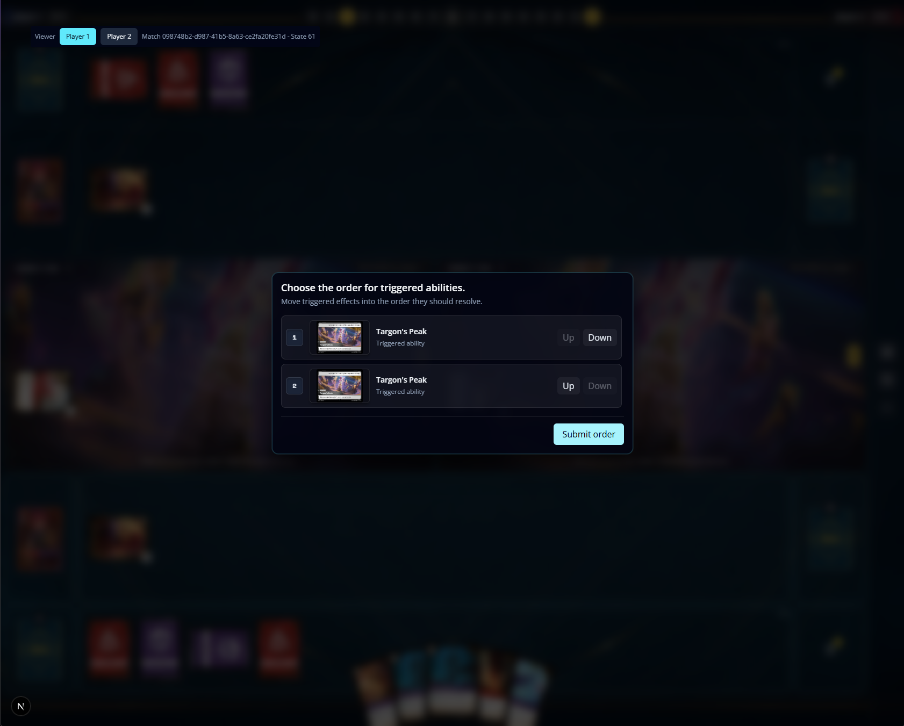
[ ] the vision Keyword needs to show the top card and then the player chooses to keep it there or not. 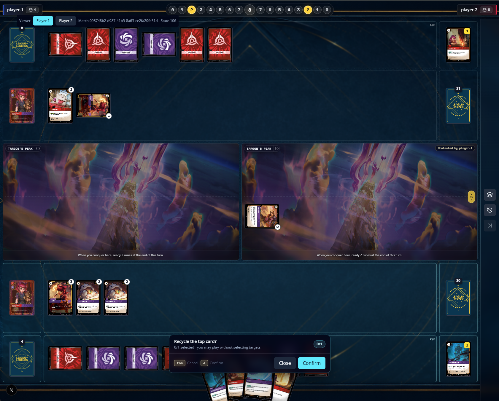
[ ] Firestorm card is not playable, on the card catalog the card is implemented like this: 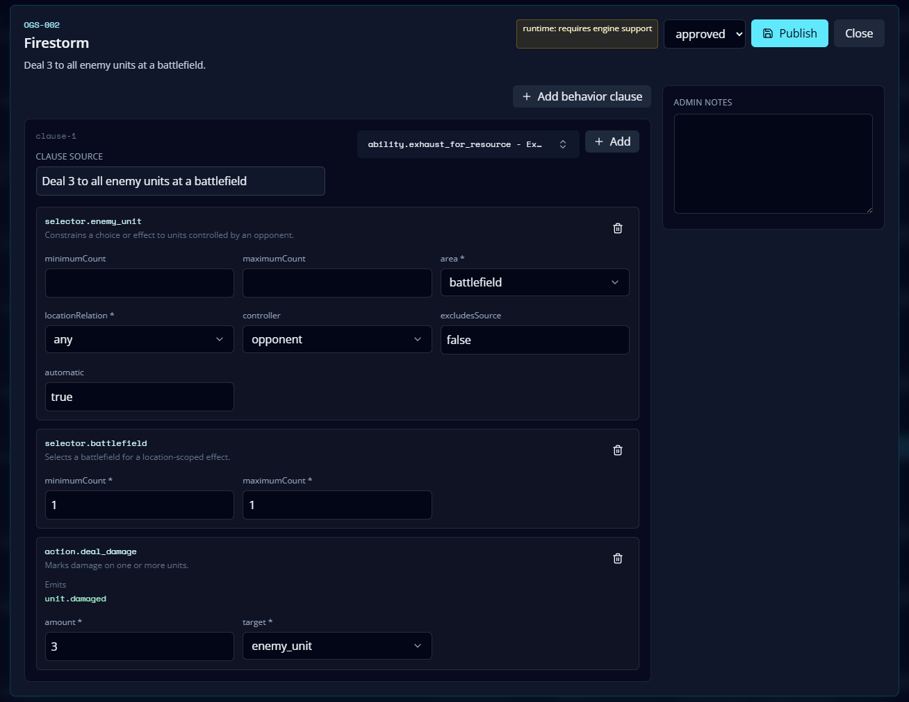. on the game this is what is being shown: 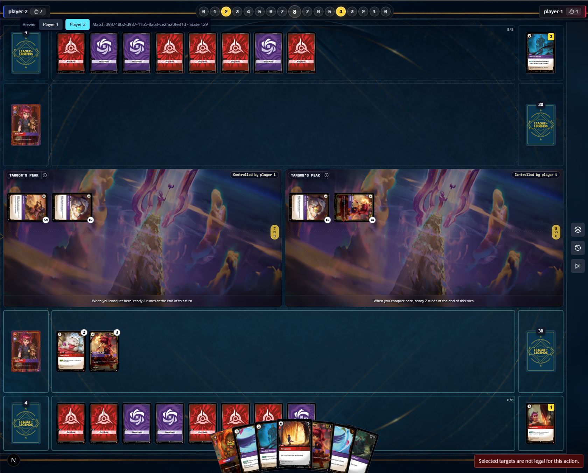 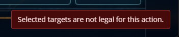
[ ] choose a card from hand to discard is not possible right now. 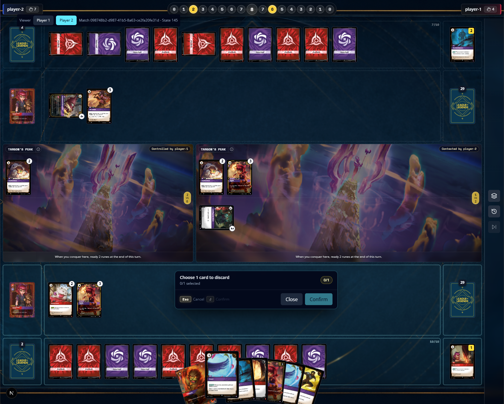
[ ] Mystic Poro do not trigger vision keyword on play. 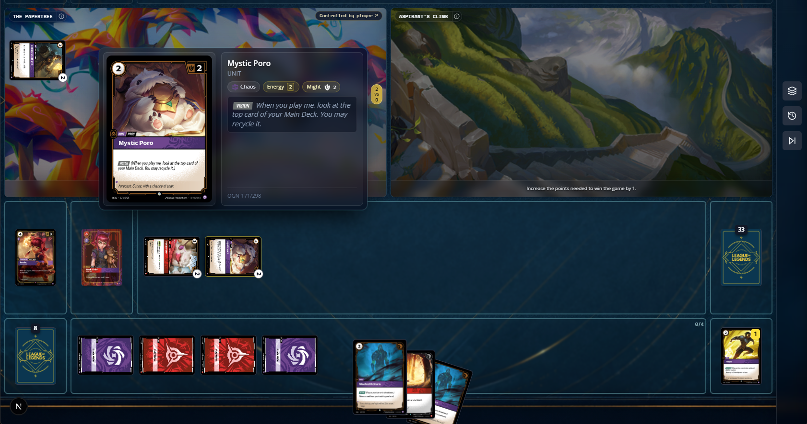
[ ] Annie, Fiery increase spell damage is not working. 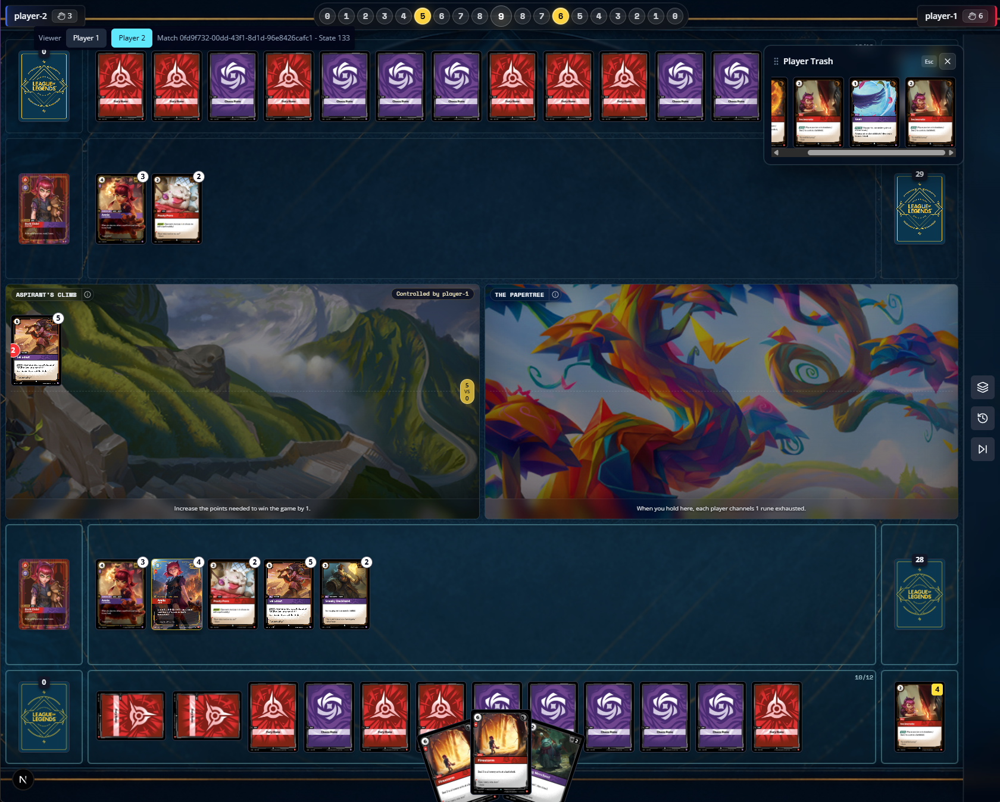
[ ] Tibbers trigger ability is not working as it should, its asking for select targets, where no targets should be selected. 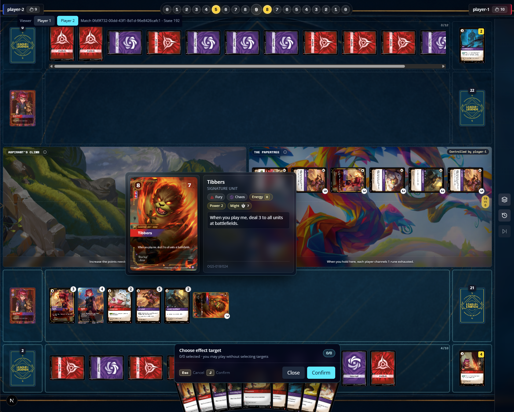
