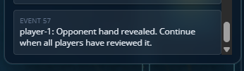
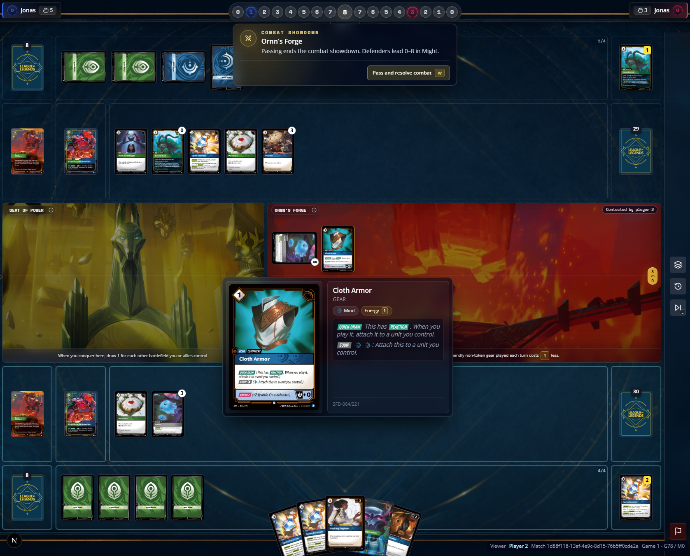
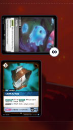
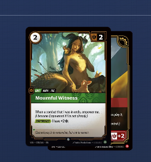
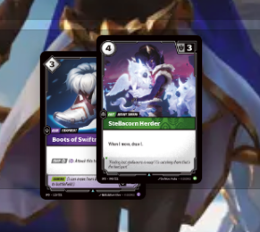
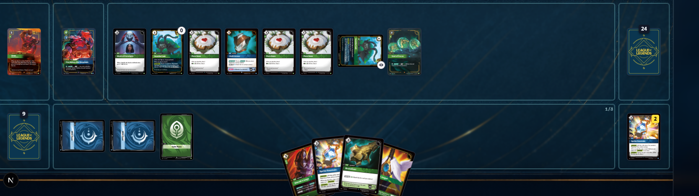
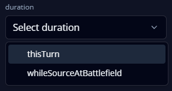

[x] after hidden update I'm seeing versioned v1, v2 explain why this is necessary, for me I do not need backward compability for this feature, what was made before this being implemented needs to be get rid off
[x] modify_might already have a minimum, do we need a condition minimum as well? 
[x] cards as ravenbloom student needs to listen to game events, on this case it needs to listen to play action, we need a plan to implement and validate what play means on cases like this. 
[x] Singularity show two selector behaviors, on the first one is showing count 2, and on the second one is should up_to, maybe we need the selector to be connected in a different way, maybe choice is a primitive and that connects with the card for additional game effect, please check Blade Dancer and Irelia, Fervent, both of them from SFD, that are cards that take in consideration choices
[x] for Aspirant's Climb we need a modify primitive that allows us to change, game definitions or cards text/behaviors, my ideia is that any number atritibute in the game has its base value, what is written on the card, but the game state projection of it pass by a modifier chain where other effects can alter, that type of modification could be increase, reduce, multiply, set value. let's anchor this on the card corpus, validating the data/sets/*.json files for cards that can validate or challenge this approach. my idea is that if a card, or game part have a value it can be modified through this primitive, cal we call it like this? I've made a implementation simliar to this in C:\wplace\hextech, check it as well as reference only, do not treat is as truth, help me validate this hypothesis.
[x] targon's peak is another card that require listen to game events, our primitive and game state changes needs to emit events that tells to whoever is listening to them that an event happened, on the catalog we assume that this behavior is happening, and the game engine will tell us when a game event happened, for instance, from the ABCD turn setup, each step of the turn will emit a event and the listeners can capture that. another good example of this is when a card move to a BF, this will trigger an event as well, we are not implementing showdown for now but its a good example either way. our primitives should emit those events as well. may at this point a event emmit api/service need to be built, but help me validate that.   
[x] Lux crownguard is a example why we should not tie behavior directly to a card, if we ignore the fact that runes can add power, the behavior of Lux and exhausting a rune for energy is the same, so, in that manner is accurate to assume that exhausting for energy and recycling for power should be separated behaviors that a rune card have, that way we could assing the same exhaust to energy behavior on lux. another good example that leads us on that direction is the way is Chem-Baroness the way it changes the gold token might be a good validation of direction, help me validate this. 
[ ] cards with approved behavior should be store within the database called catalog, on this repo there's a already built transpiler of text to element that enhiches the card text to display on the screen, we need a card catalog entry to respect this. current cardBehaviorValidations: 
{
  "_id": "OGN-085",
  "adminNotes": "",
  "cardCode": "OGN-085",
  "clauses": [
    {
      "id": "clause-1",
      "sourceText": "[Action] (Play on your turn or in showdowns.)Deal 6 to a unit at a battlefield",
      "normalizedText": "[Action] (Play on your turn or in showdowns.)Deal 6 to a unit at a battlefield",
      "assignments": [
        {
          "primitiveId": "timing.action",
          "family": "timing",
          "sourceText": "[Action] (Play on your turn or in showdowns.)Deal 6 to a unit at a battlefield",
          "parameters": {},
          "confidence": "high"
        },
        {
          "primitiveId": "selector.unit",
          "family": "selector",
          "sourceText": "[Action] (Play on your turn or in showdowns.)Deal 6 to a unit at a battlefield",
          "parameters": {
            "scope": "any",
            "minimumCount": 1,
            "maximumCount": 1,
            "area": "battlefield",
            "locationRelation": "any",
            "excludesSource": false
          },
          "confidence": "medium"
        },
        {
          "primitiveId": "action.deal_damage",
          "family": "action",
          "sourceText": "[Action] (Play on your turn or in showdowns.)Deal 6 to a unit at a battlefield",
          "parameters": {
            "amount": 6,
            "target": "unit"
          },
          "confidence": "high"
        }
      ],
      "unsupportedReason": null
    }
  ],
  "createdAt": "2026-06-22T09:11:49.773Z",
  "id": "OGN-085",
  "name": "Falling Comet",
  "publicCode": "OGN-085/298",
  "setCode": "OGN",
  "sourceText": "[Action] (Play on your turn or in showdowns.)Deal 6 to a unit at a battlefield.",
  "sourceTextHash": "afcbc852ac0e6c47ae06381757894edd8912618f748f6b1ea31ad308113d8c08",
  "status": "approved",
  "type": "Spell",
  "updatedAt": "2026-06-22T09:11:49.773Z"
}
there is a mix of real card metadata with the behavior that we are applying to that card, this seems off, we need to work on a better separation and card catalog shape.
[ ] the "Clause Source" inside card catalog could use the same card text to element transpiler and show it here, if that feature is not a service/internal API it should become one
[ ] action.deal_damage have targets that are too wide, only units on board can be delt damage, so the options for target should not include equipment for instance and others
[ ] the Aspirant's Climb clause have a duration that is not set, in this case is important to notice that a battlefield is possible to be removed from play, so this might need something like while is on the board or something 
