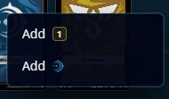
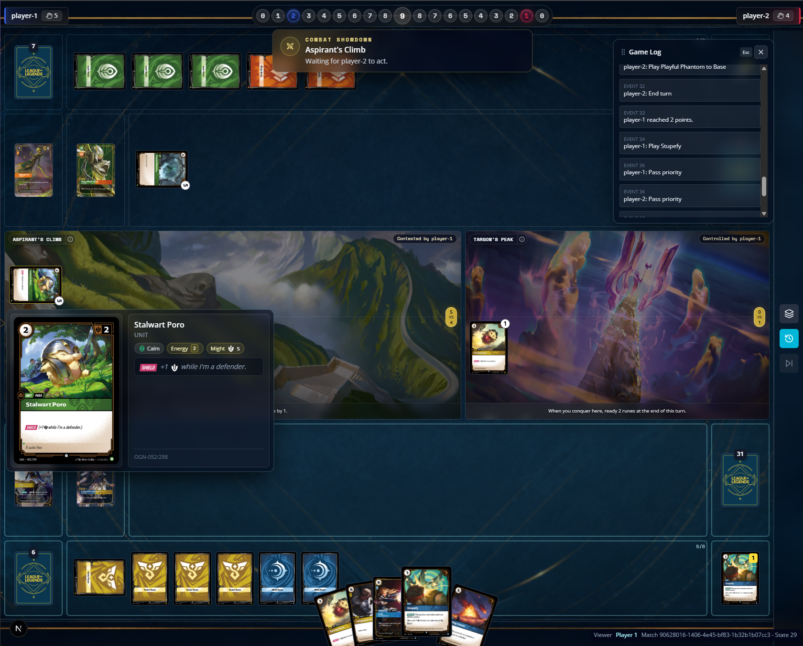
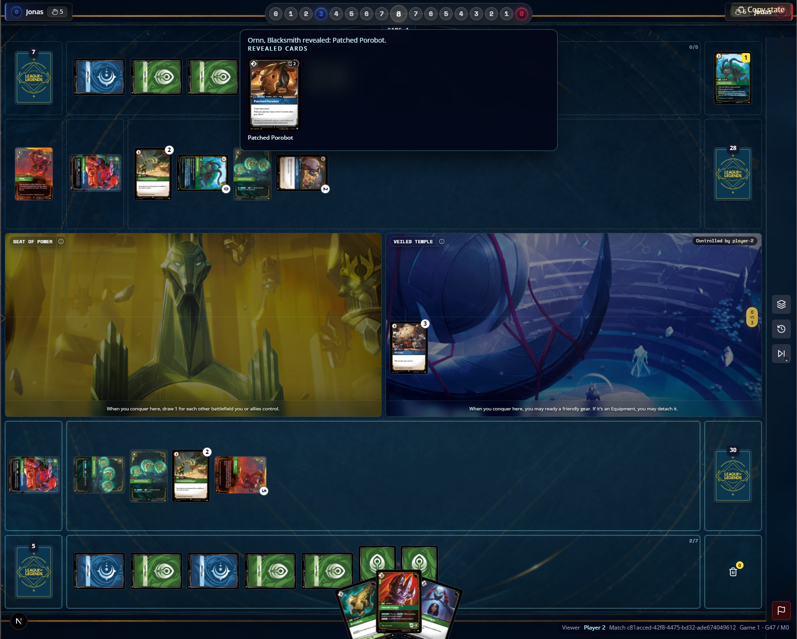
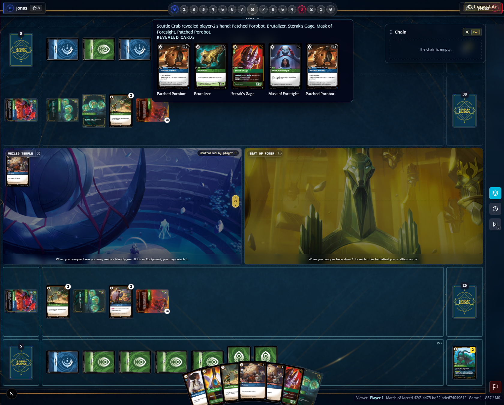
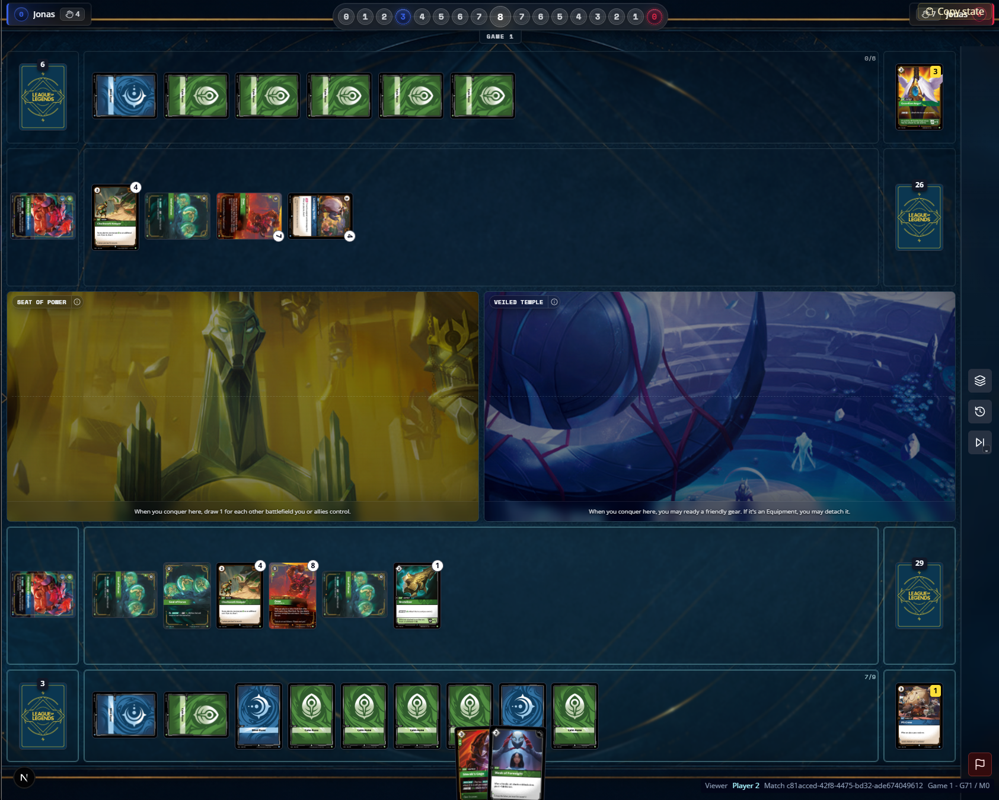
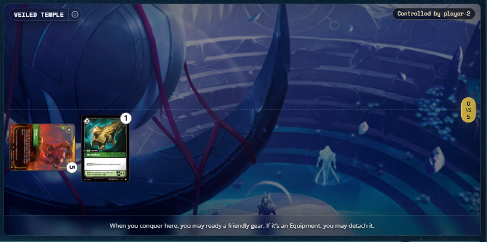
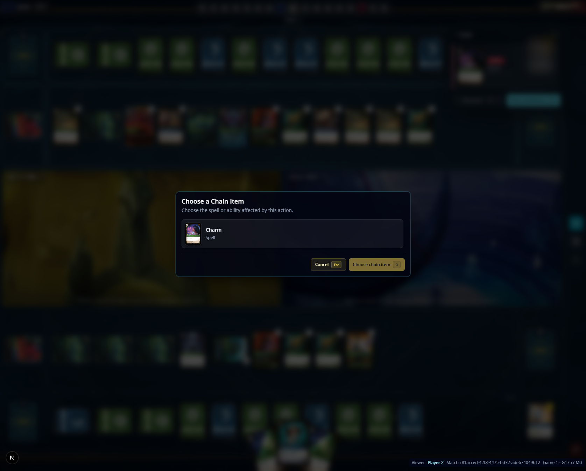
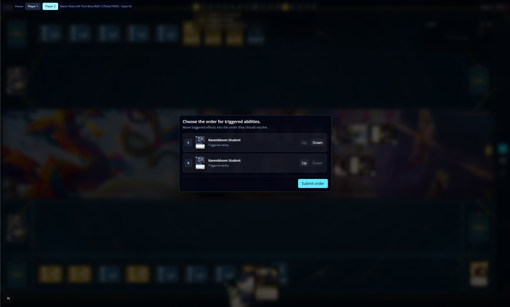
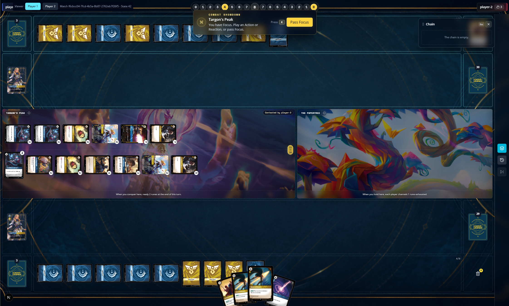

[x] Targon's peak fix was implemented wrongly the play that should benefits from the effect of it is the player that did conquer it, currently even thou the same player comquered both of them the game is making each player chooses 2 runes to ready, when it should make the player that conquered both of them untap 2 runes, 2 different times.
[x] when there is something on the chain the context menu for the runes is broken. [alt text](image-35.png)
[x] after add energy fix, the menu lost the add energy and power helper. runes menu should have 3 options, add energy, add power & add energy and power. 
[x] as in chain the latest player passing focus/priority will be resolving the shadown or chain, it is better if the combat showdown prompt state that passing focus the combat will resolve and who is winning this combat. 
[x] Spells that are action and target units at battlefields are sometimes showing not Playable. 
[x] eager apprentice in BF is reducing any card cost when it should only reduce the spells cost.
[x] Assault Keyword is not adding might to the attacking unit. 
[x] Tank Keyword is not working, units with tank should be assigned damage first. 
[x] units can be played to battlefields controlled by owner as well, currently is only possible to play units to base. 
[x] when a player is choosing the order of triggered abilities, the other player is frozen on pass focus showdown, it should show a message that opponent is choosing triggered order abilities.  
