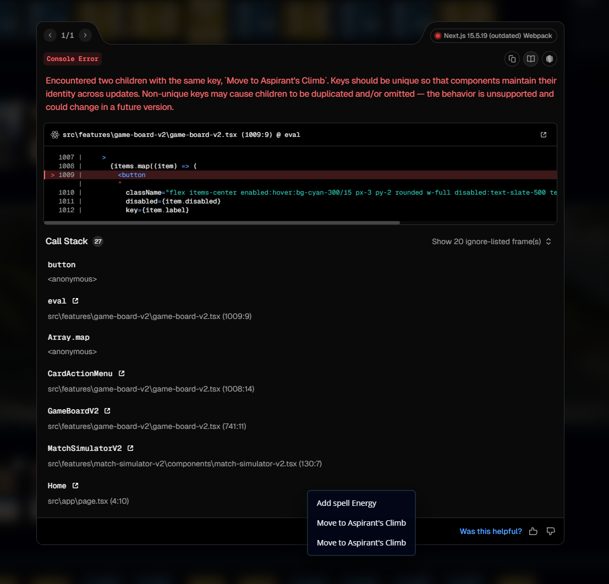
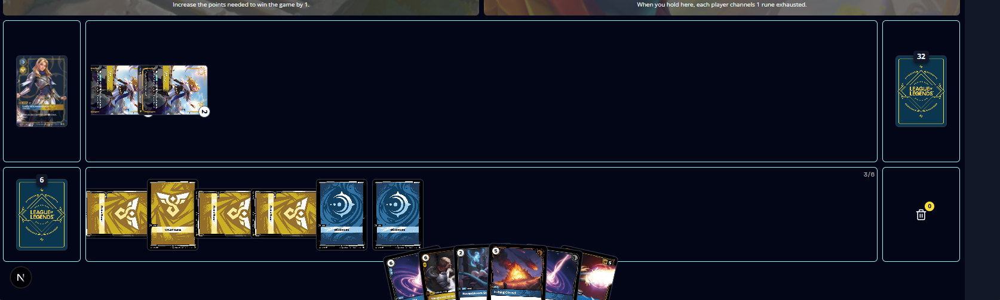
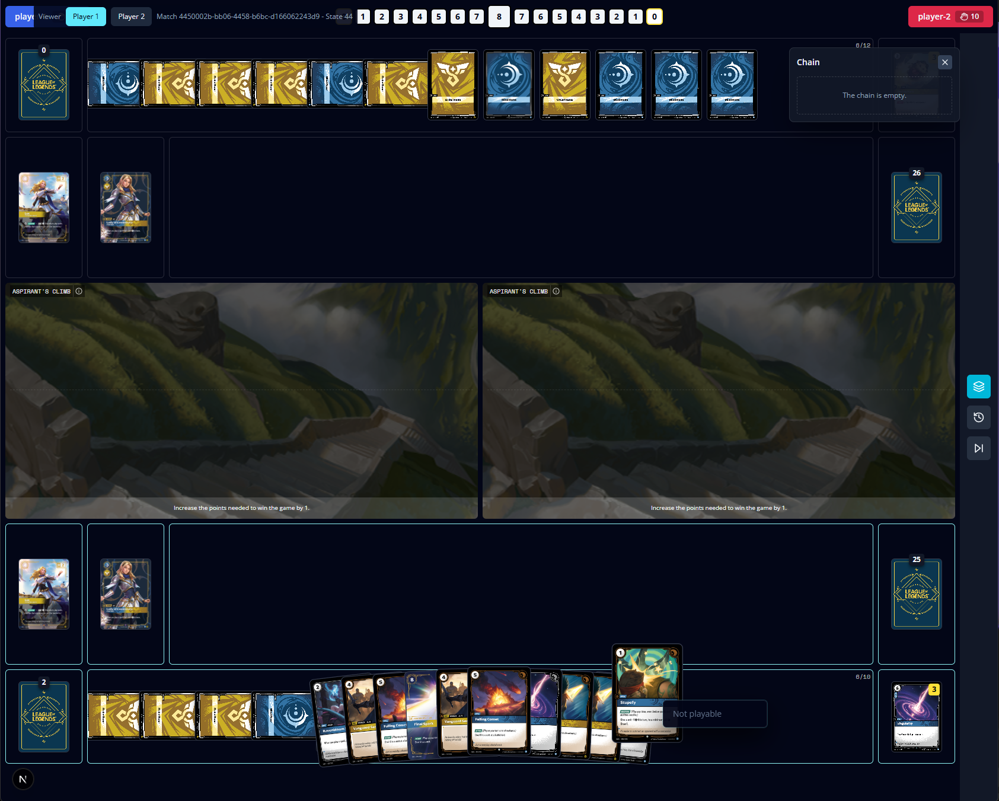

[ ] at selecting Lux to pay for energy, Im seeing this error: 
[ ] the issue above might be connected to a non-uniquness of objects in game projection, after playing the second Lux both of them became tapped 
[ ] hover target is not as in legacy implementation, there we have a highlight state passed to the card tile that helps differentiate what is the target of the spell/ability
[ ] the select a target message is show but is not really selecting a target
[ ] on legacy simulator cards without a target cannot be played, but on the new version the projection has options for cards being played without viable targets 
[ ] units in base have the option to move to battlefield, altough the game engine freezes afterwards, we should remove moving into a battlefield until showdown is implemented
