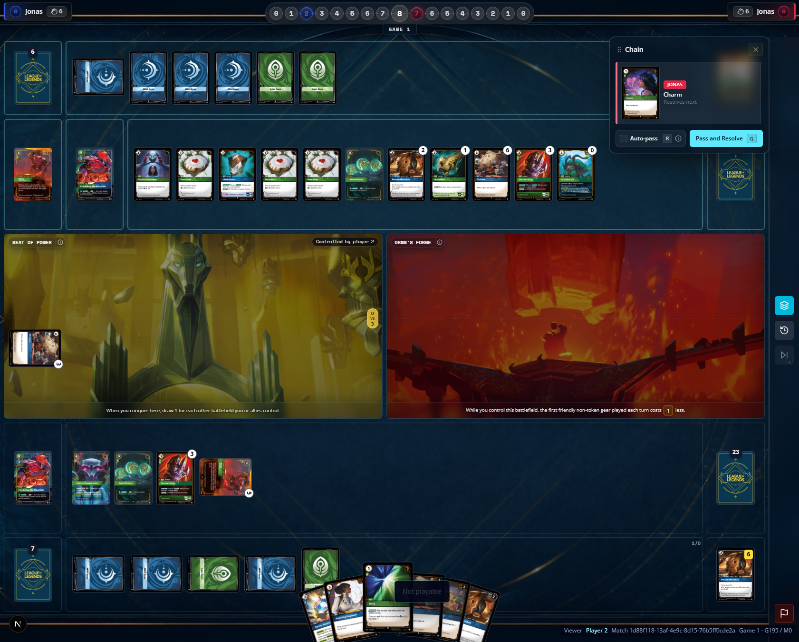
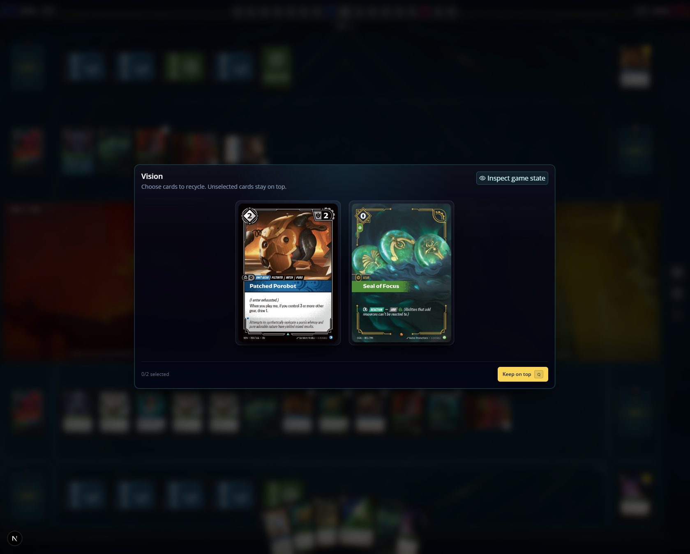
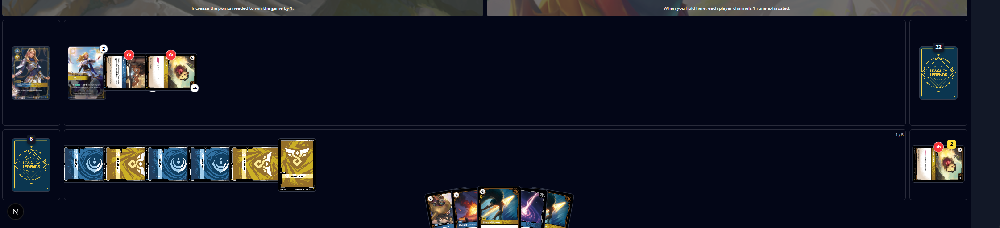
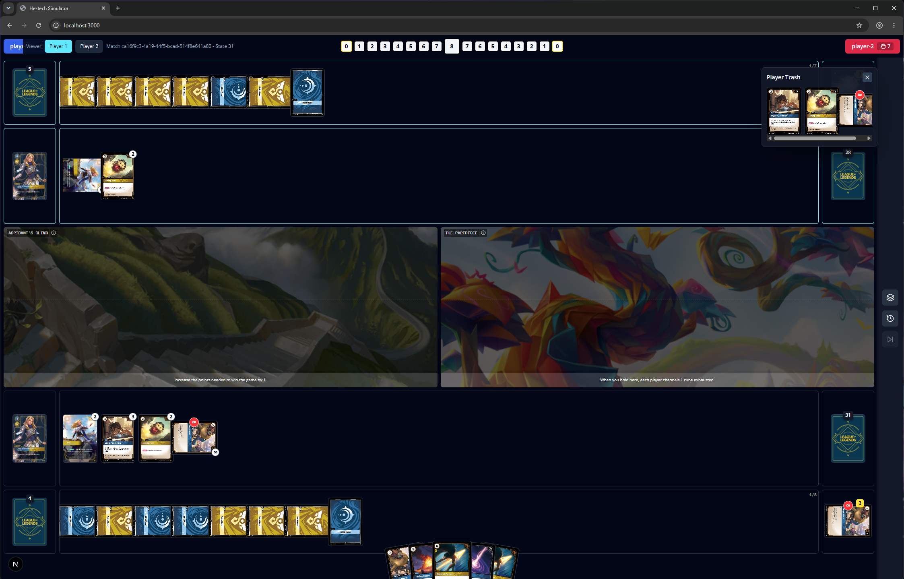
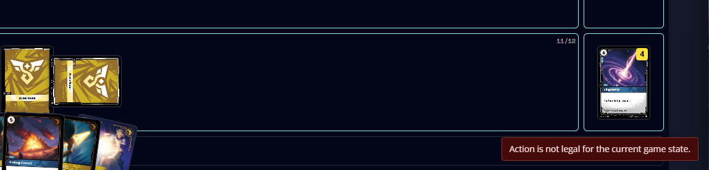
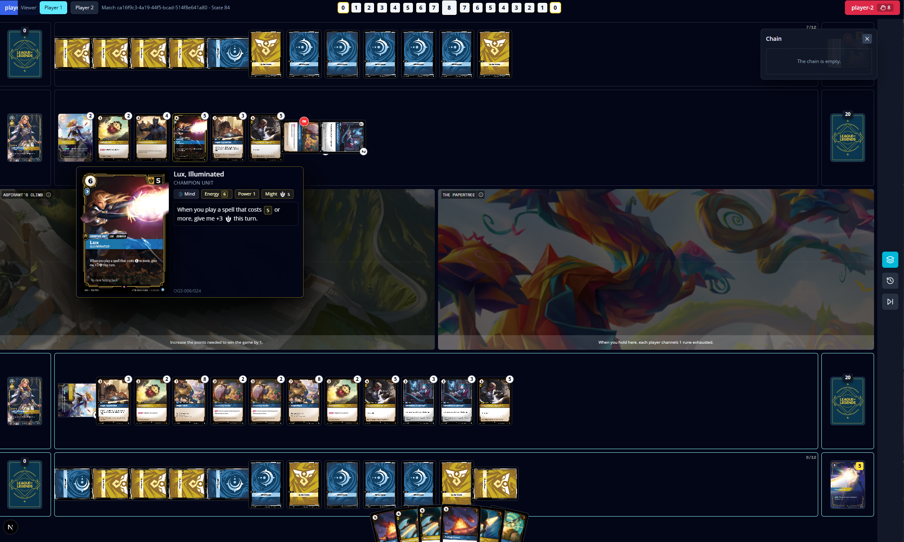

[x] playing units using autopayment is using other sources of energy different from runes to pay for it, in the actual game, Lux can add energy to pay for spells, but is possible to pay for units using autopayment
[x] autopayment should select runes from the left to the right, currently the selection seems random. 
[x] spells that requires targets should not be playable when there is not valid targets on the gameboard. currently is possible to try to play stupefy even though there's no units on board. 
[ ] having two lux's on board trigger an error on selecting one of them to activate ability. 
[ ] spells that deals damage to unit are resolving, marking units with damage but the units are not being sent to the trash. 
[ ] looks like the card objects are being duplicated, going to the trash and kept on table. current card status, exhausted, is being caried away when the card move zones, leaving the board should reset exhaust status from cards. 
[ ] spells with legal targets are being show as if no target was avaliable. 
[ ] runes should have two possible actions, exhaust for energy and recycle for power, current gameboard only allow you to add energy, clicking on runes should show three options, add energy, add power [domain], add energy and power. 
[ ] Lux, Illuminated is not gaining power after playing a 5 plus cost spell, I played a Final spark, the trigger went into chain but no power was gain. 
