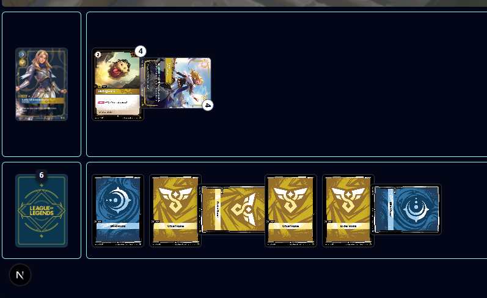
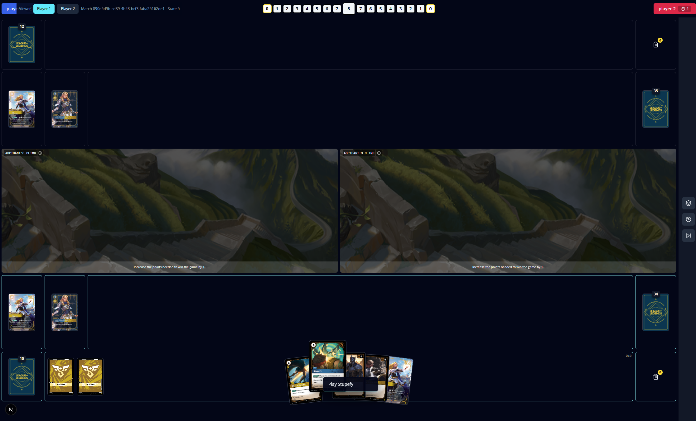

[x] playing units using autopayment is using other sources of energy different from runes to pay for it, in the actual game, Lux can add energy to pay for spells, but is possible to pay for units using autopayment
[ ] autopayment should select runes from the left to the right, currently the selection seems random. 
[ ] spells that requires targets should not be playable when there is not valid targets on the gameboard. currently is possible to try to play stupefy even though there's no units on board. 
