Resolution control: see [resolution-ledger.md](resolution-ledger.md). This file remains the original manual-test evidence.

[] The Areana's Greatest trigger should happen on the Beggining Phase, from the ABCD start of the turn setup, currently it's triggering at end of the turn. it is also triggering for both players even if only one of them have the BF. 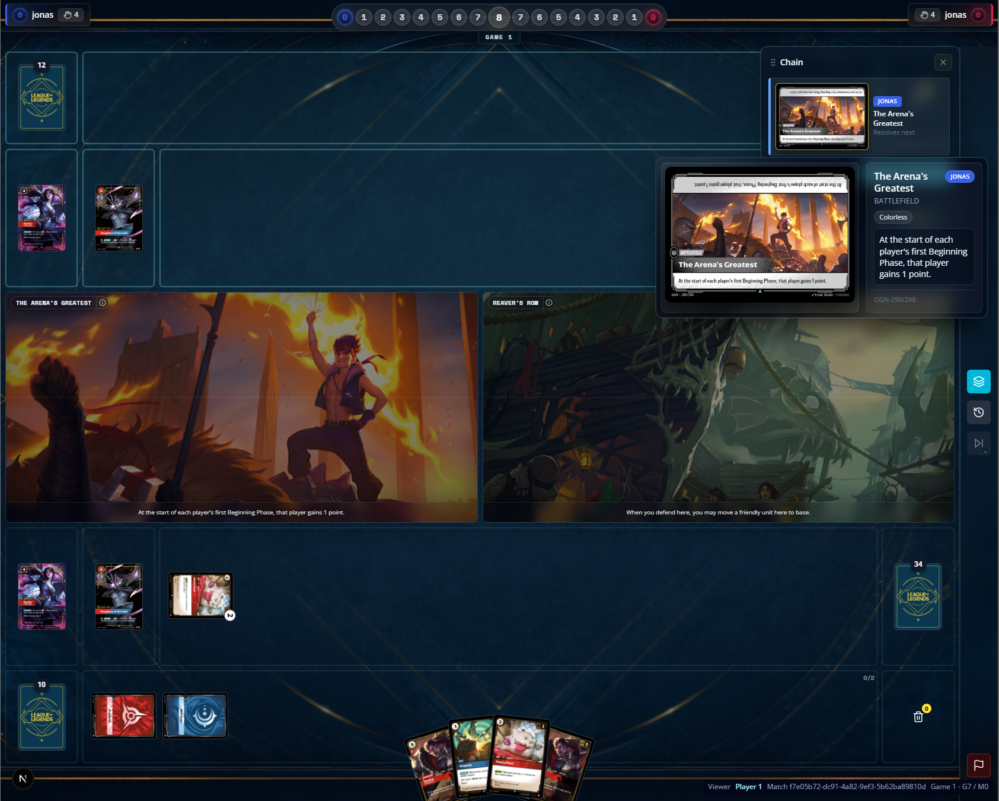
[ ] in the middle of payment for Void Seeker on a unit that has deflect, the pass focus option was enabled. 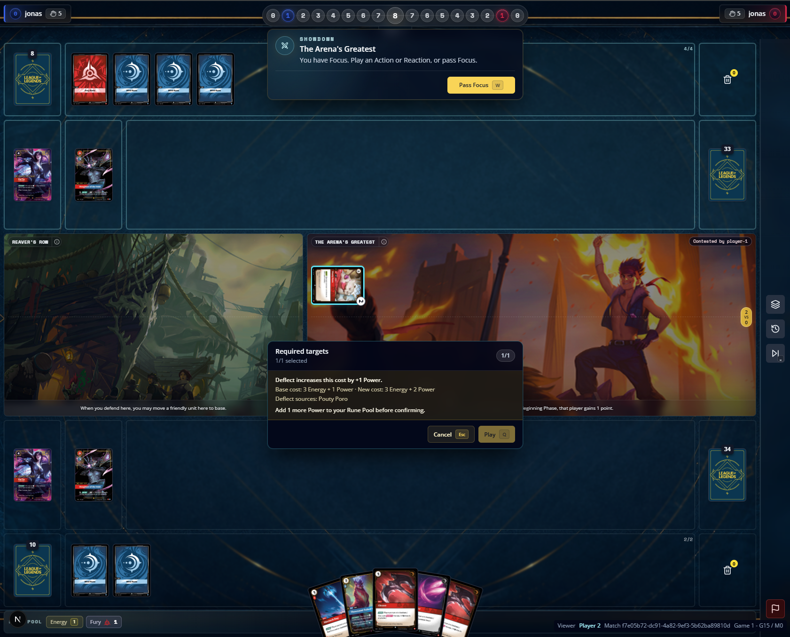
[ ] the image associated on "Daughter of the Void" was not the cannonical one, the simplest and smallest, no letters no start, number on the set is the cannonical one. 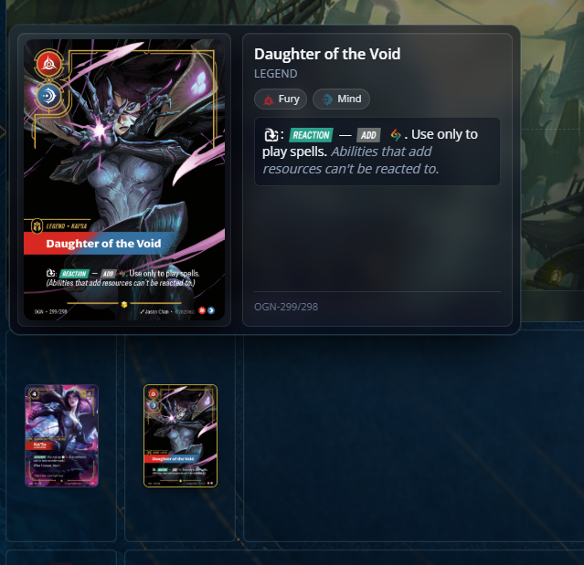
[ ] Daughter of the Void has not add resources ability on her.
[ ] Text, keyword, status are added to units, after using cleave on poro it is not possible to confirm what is there. the preview window should show a history of unit changes not only regarding might, but keyword and texts added as well. 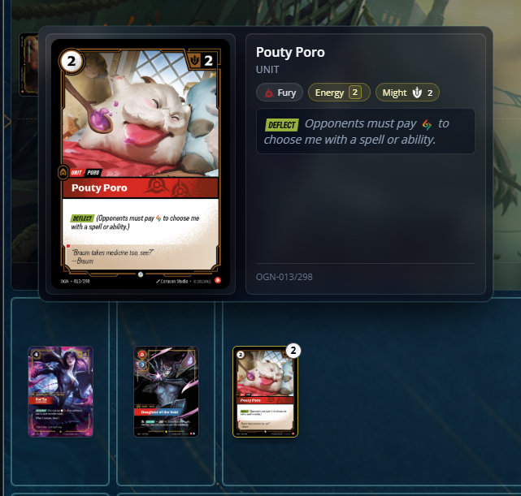
[ ] Reaver's row is on of the "you may" abilities, so the player will chose to return the unit base or not. currently if I press close, the game gets stuck, is not possible to not return a unit. 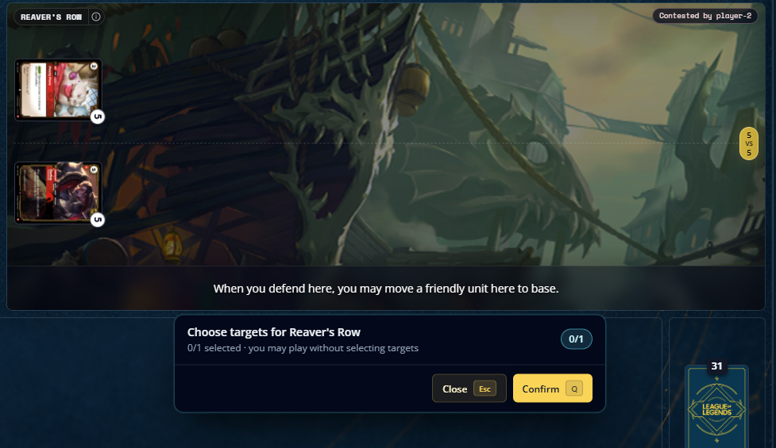
[ ] after Reaver's row ability went into chain and resolved, the defender got the focus, and this is wrong, the attacker should the first focus.
[ ] we need to make the naming of accelerate better, "Play accelerated <card name> to <location>" would fit better this. 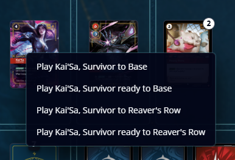
[ ] Watchful Sentry Deathknell trigger do not work, nothing went to chain, it was placed on the trash only. the trigger showed to the chain with a kill/damage spell, but not as result of a combat.  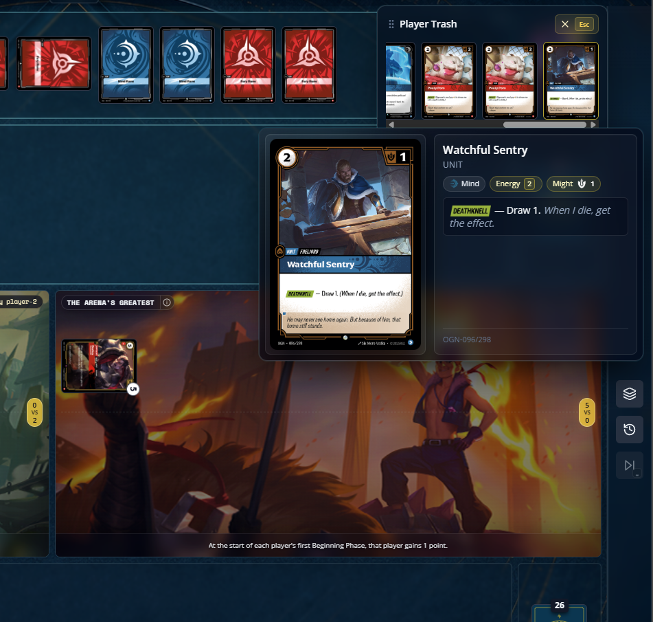
[ ] Reaver's row seems to be triggering one for each unit on the BF. this error was on the console "intercept-console-error.js:57 Encountered two children with the same key, `trigger:111:f7e05b72-dc91-4a82-9ef3-5b62ba89810d:player-2:copy:battlefield:OGN-285:1:clause-1`. Keys should be unique so that components maintain their identity across updates. Non-unique keys may cause children to be duplicated and/or omitted — the behavior is unsupported and could change in a future version." 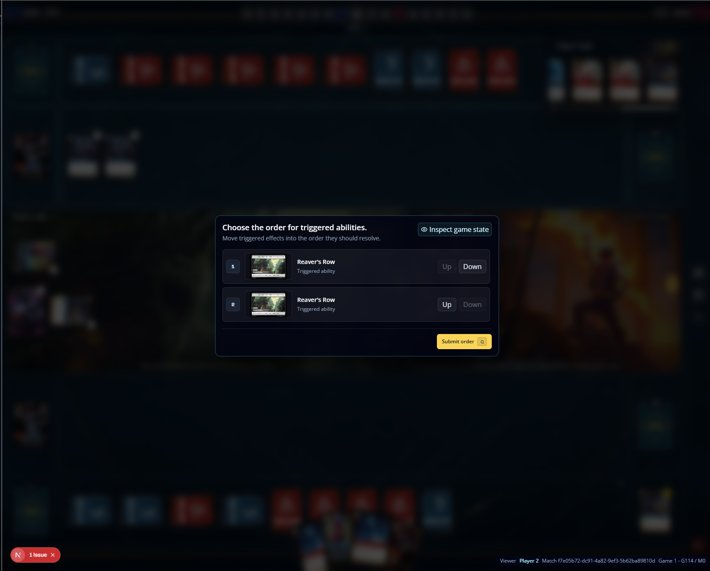 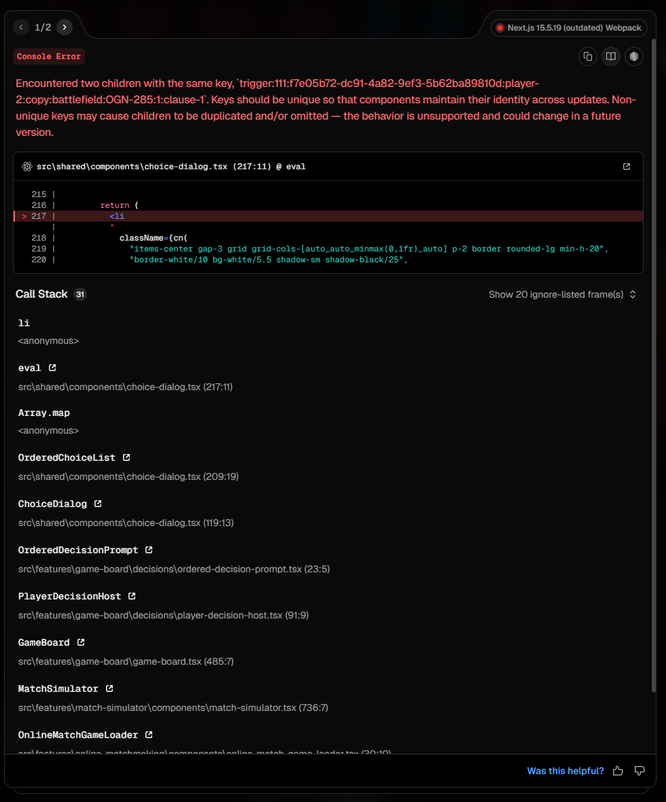
[ ] legion do not works. playing a legion card as the first on the turn works. 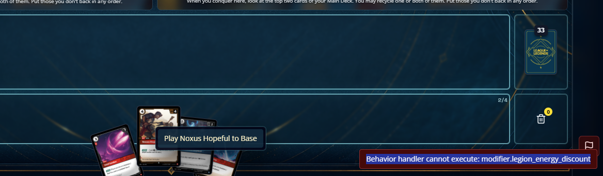
[ ] we need a different setup for previewing battlefields. 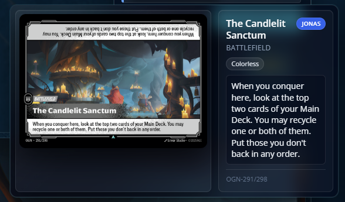
[ ] The Candlelit Sanctum should be able to allow change the cards order from the top of the deck, currently you can only leave as it is or recycle.
[ ] The Candlelit Sanctum error on recycle cards, 
endpoint: /api/matches/f7e05b72-dc91-4a82-9ef3-5b62ba89810d/intents, 
payload: {
    "playerToken": "n5WiL5ZLfNLSFduQY7LLVhmUyCjQZDIq",
    "stateVersion": 15,
    "intent": {
        "type": "game.performAction",
        "payload": {
            "actionId": "game:15:action:submitChoice:_",
            "selectedIds": [
                "f7e05b72-dc91-4a82-9ef3-5b62ba89810d:player-1:copy:mainDeck:OGN-116:2",
                "f7e05b72-dc91-4a82-9ef3-5b62ba89810d:player-1:copy:mainDeck:OGN-029:3"
            ],
            "allocations": [],
            "tokenPlacements": []
        }
    }
}
response: {
    "accepted": false,
    "error": {
        "code": "action_rejected",
        "message": "Selected targets are not legal for this action."
    }
}
[ ] falling star & icathian rain - trying to play  did not ask for targets, just went direclty onto chain. at resolution is asking for one target. it asked for one target twice, it makes me feel that maybe this applying reflexive triggers, please confirm this, if so we could have our first card errata issue. another issue, choosing a deflect unit did not asked for power payment to play it. 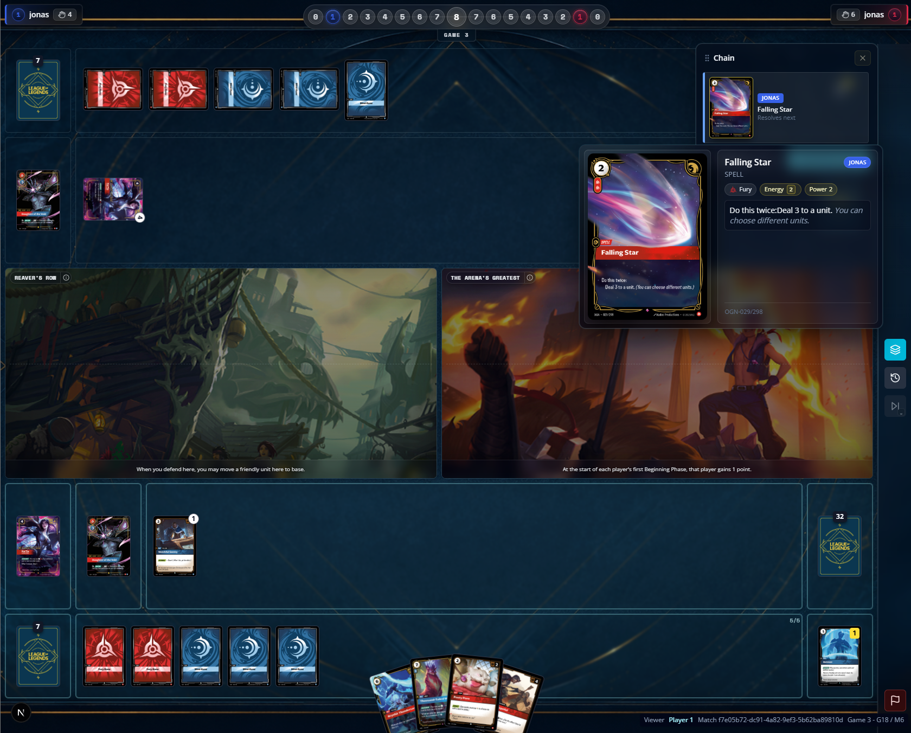 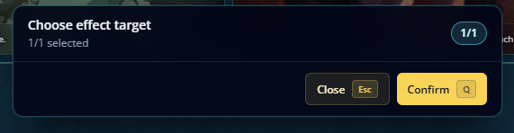
[ ] Time warp was in to places at same time. trash and banished. 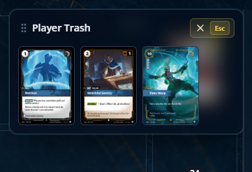 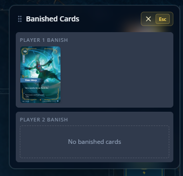
[ ] Darius was not readied after playing a second unit, with spells it works. 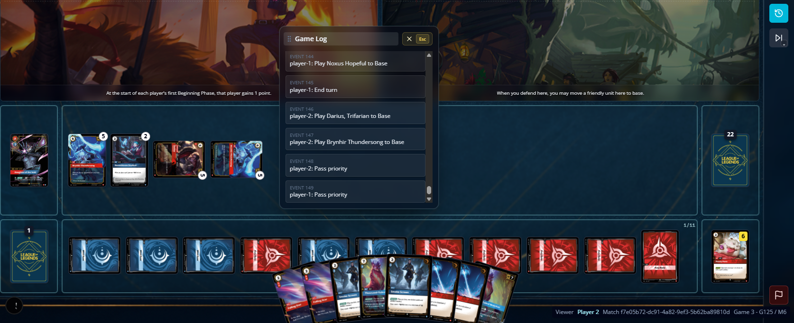
[ ] Dr. Mundo, expert - is possible to select none cards from the trash, you are obligated to resolve the most possible, so if there's none cards in trash no user choice prompt should show, there is one more, the choice prompt should show and player is obligated to select the maximum he can, 1, 2 or 3.
---new issues
[ ] sideboarding got an error when both players try to submit at the same time. 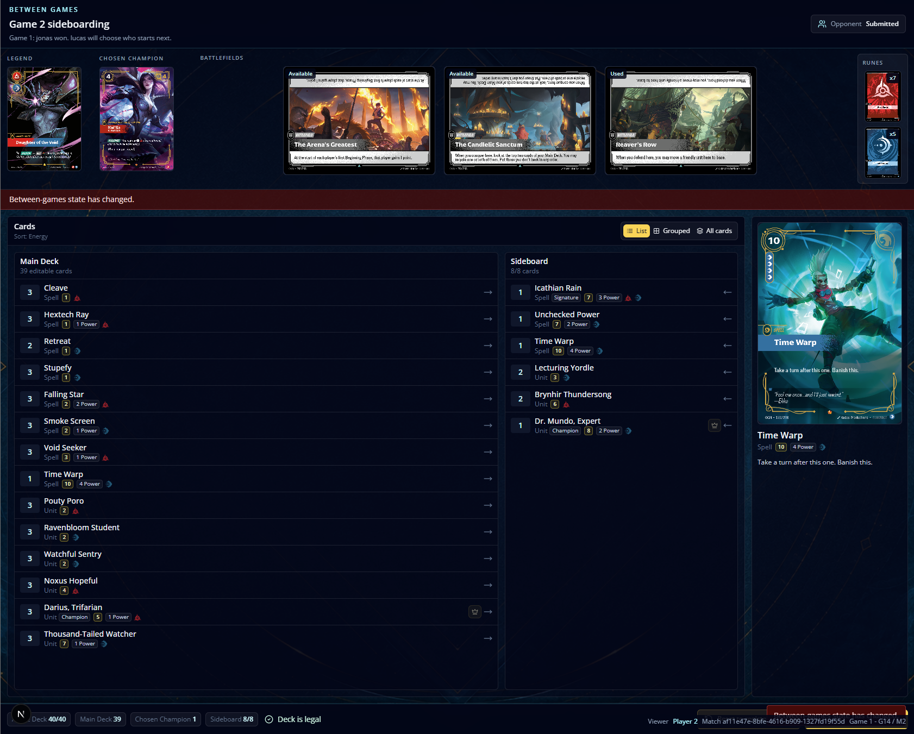
