- Dune Drake behavior seems off, in simpler terms the cards has a might increase that is conditional, right now it has action.ready_cards on it, not quite sure if is the right approach. 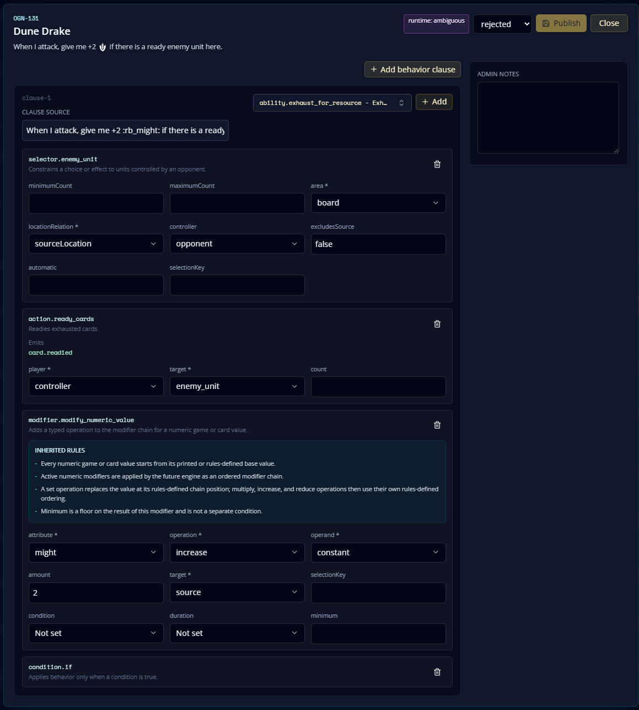
  - Resolved: model as `trigger.attack` plus `condition.unit_presence` for at least one ready enemy unit at the source location, then `modifier.modify_numeric_value` gives the source +2 Might this turn. No `action.ready_cards`.
- First Mate can not ready himself, I can't see anything on the behavior that says so. 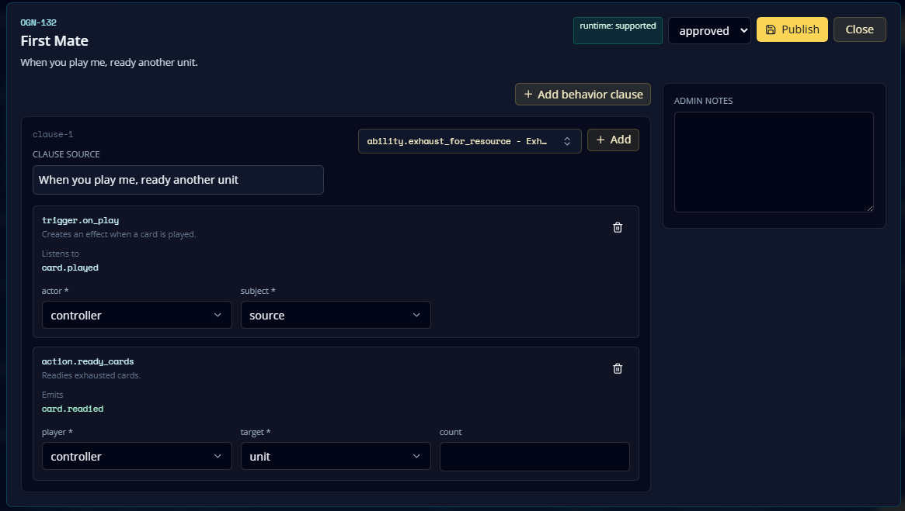
  - Resolved: model "another unit" with `selector.friendly_unit` / `excludesSource: true`, then ready the selected unit.
- Noxian Drummer create a token at movement destination, if it is in base moving to a BF the token will be automatically placed on the BF, if it is on a BF going base, the token is automatically placed on base, if it gains ganking and move from one BF to another, the token will be automatically placed on the other BF.
  - Resolved: card text says "When I move to a battlefield." Moving to base should not trigger token placement. Model this as a move trigger that only matches battlefield destinations.
- Might of Demacia - Starter seems off, "conquer any BF" and "conquer this BF" are different things, for instance if for some reason a card could add a BF to the game, it will be possible to trigger "conquer any BF" 2, 3 times. this card should listen to an emmited event. 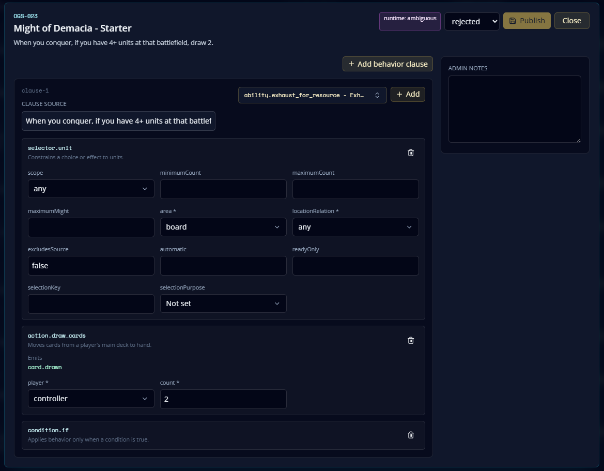
  - Resolved: model as `trigger.conquer`, which listens to emitted `battlefield.conquered` events, plus `condition.unit_presence` at the event battlefield. It does not poll all battlefields.

  - trifarian war camp was not parsed. 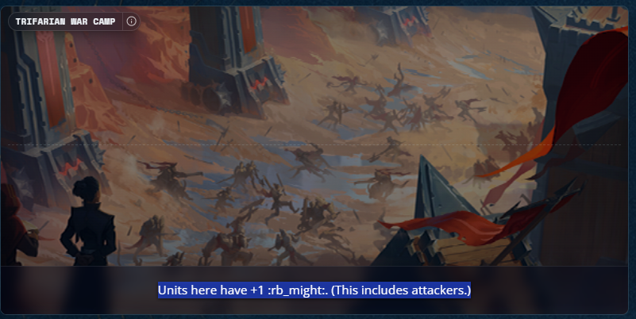
    - Resolved for new matches after canonical repair: primitive discovery recognizes static group numeric modifiers like "Units here have +1 :rb_might:" as an automatic source-location unit modifier, and `catalog:repair-garen-m1` republishes the corrected canonical model.
    - Expected model: `modifier.modify_numeric_value` with `target: "unit"`, `locationRelation: "sourceLocation"`, `duration: "whileSourceAtBattlefield"`, and no interactive target prompt.
  - tokens do not have associated images. 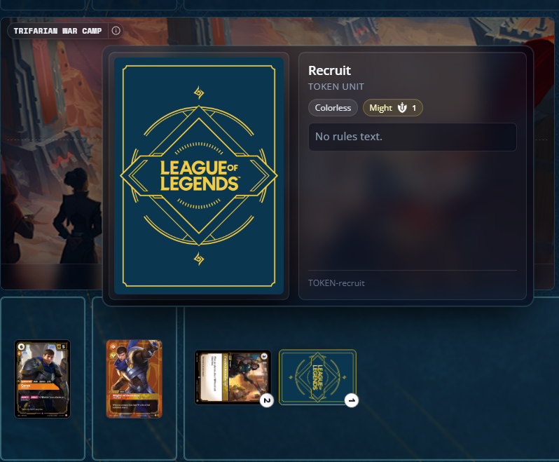
    - Resolved in code: generated Recruit and Sprite gameplay token definitions now include token image URLs.
  - trifarian war camp do not add might to units there. 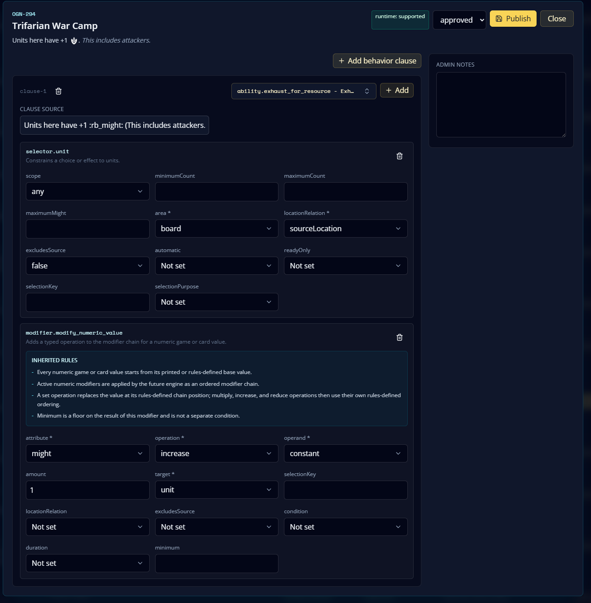 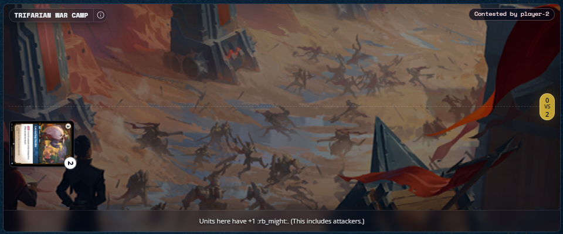
    - Resolved for new matches after canonical repair: continuous modifiers sourced by battlefield cards are active while the battlefield card is on board, and source-location unit modifiers apply to units at that battlefield.
    - Resolved in code: tokens recompute Might after they are placed, so a Recruit created at Trifarian War Camp immediately receives the battlefield's +1 Might instead of waiting for a later state transition.
  - crackshot corsair is not playable. 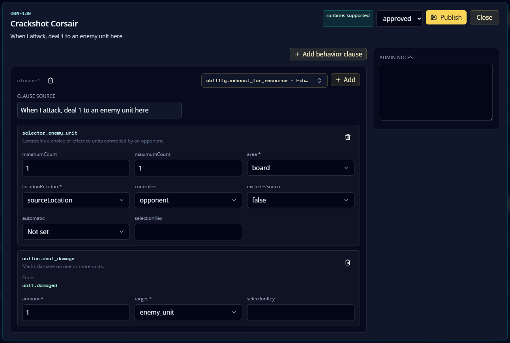 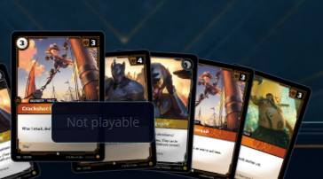
    - Resolved for new matches after canonical repair: the persisted canonical model was missing `trigger.attack`, so its enemy-unit selector was incorrectly treated as a play target. `catalog:repair-garen-m1` republishes this as `trigger.attack` plus `selector.enemy_unit` plus `action.deal_damage`.
  - Recruit the Vanguard is not resolving on the chain. post request returns 400, with this:
    {
    "accepted": false,
    "error": {
    "code": "action_rejected",
    "message": "Token placement count does not match token count."
    }
    }

  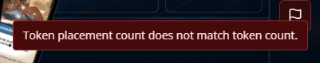
    - Resolved in code: token placement counts reset when a new token placement decision is shown, preventing stale placement payloads from submitting the wrong count.
    - Resolved in code: token placement effects now consume the placement destinations selected for that effect binding, so earlier locked targets/selectors cannot make the server think the placement count differs from the token count.
  - Noxian drummer can not set the token on the destination BF, this error shows: Token destination is not controlled by the player. post request with code 400 returns this response: {
    "accepted": false,
    "error": {
    "code": "action_rejected",
    "message": "Token destination is not controlled by the player."
    }
    }
    - Resolved in code: fixed-location token creation can place the token at the source battlefield even if that battlefield is not controlled by the player. Controlled-destination validation still applies to explicit Recruit the Vanguard placement choices.

- Garen, Commander is non playable. 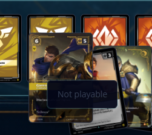 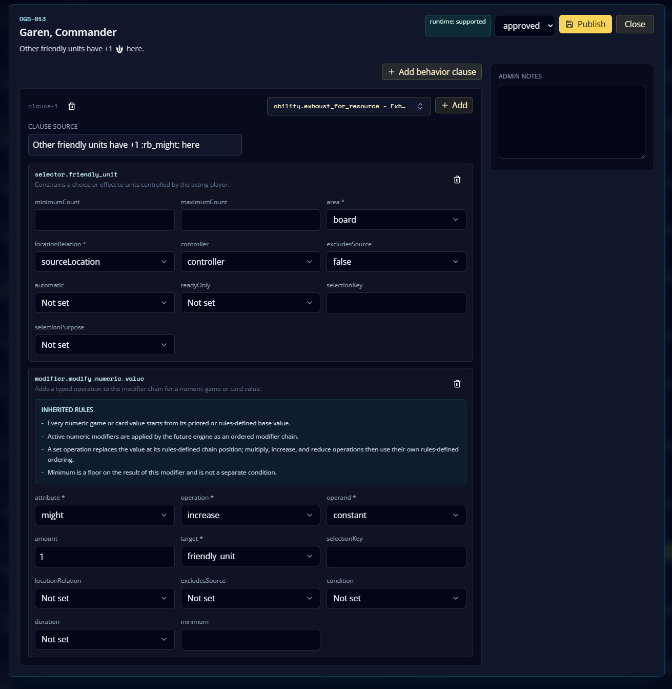
  - Resolved for new matches after canonical repair: the persisted canonical model had an interactive selector for passive text. `catalog:repair-garen-m1` republishes this as a continuous source-location friendly-unit Might modifier with `excludesSource: true`.
- Decisive Strike is asking for targets and it should not. 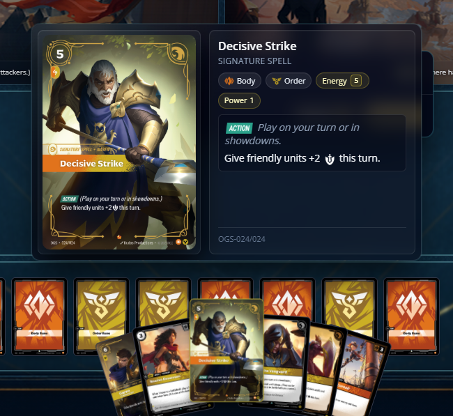 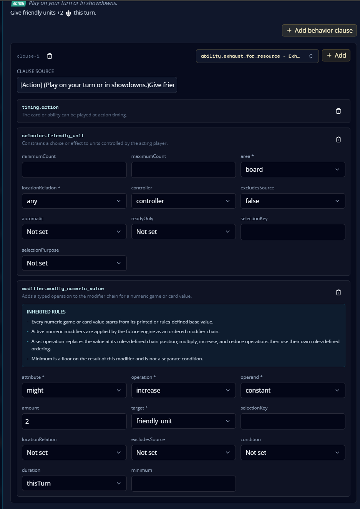
  - Resolved for new matches after canonical repair: group numeric modifiers can resolve without interactive targets. Expected model is an automatic friendly-unit group modifier for +2 Might this turn, not a player-selected target prompt.
- after dune drake attack, a trigger goes into chain, after players pass priority the showdown initiative should back to attacker, but the defender got it. traveling merchant is another card with attack trigger, i was worried about regression, but it is working as expected, what makes me think that maybe they are no using the same on attack trigger behavior? 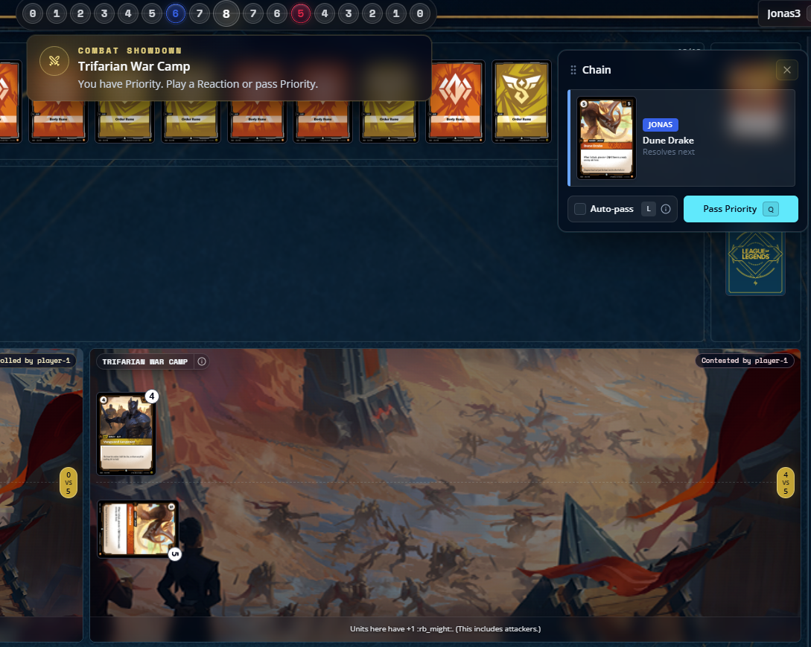 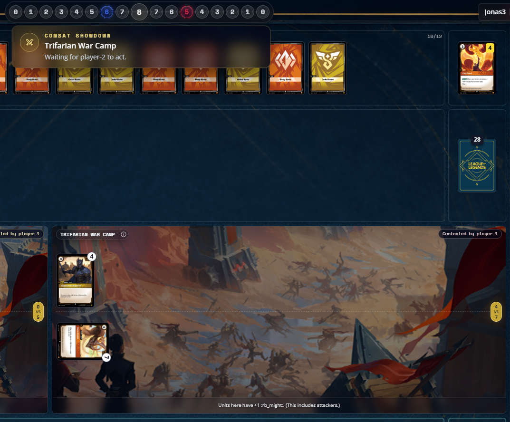
  - Resolved in code: when a triggered item resolves during showdown and empties the chain, showdown focus returns to the trigger controller.
- Crackshot Corsair targets are chosen too late when several attack triggers fire together.
  - Resolved in code: combat now batches all attacker attack events together before trigger queue processing. Simultaneous triggered abilities lock required targets before the trigger-order prompt is shown. Targetless triggers stay in the same batch, then the order prompt appears after target selection.
- Confront should make tokens played by token effects enter ready.
  - Resolved in code: generated tokens now respect active `modifier.enter_ready` effects after they are placed.
- Recruit the Vanguard was still failing on `Pass priority`.
  - Resolved in code: one-clause spells now resolve through the effect-resolution frame when they leave the chain. This lets `action.play_token` pause for token placement instead of executing with an empty destination list.

Sanity check from DB on 2026-07-10:
- Match `a97f0977-6ff6-44d5-a104-91a8e8135433` and its deck snapshots had the expected approved models for Crackshot Corsair, Noxian Drummer, Trifarian War Camp, Recruit the Vanguard, and Decisive Strike. The observed failures were runtime flow bugs, not stale snapshot models.
- The event log for match `a97f0977-6ff6-44d5-a104-91a8e8135433` showed separate `Choose targets for Crackshot Corsair` actions at versions 82 and 83 before the runtime batching fix.
- DB sync commands were run after this pass: `catalog:sync-behaviors`, `catalog:repair-garen-m1`, and `catalog:sync-decks`.
- Match `256fd50f-be10-4653-97d8-3bd6859100da` at state 56 was not in combat yet. It had one Noxian Drummer `unit.moved` trigger on the chain, no showdown, no combat, and no queued attack triggers. Simulating forward from that exact state shows combat starts after both players pass the move trigger, then Crackshot target choices happen before a trigger-order prompt containing both Crackshot attack triggers.
- Match `256fd50f-be10-4653-97d8-3bd6859100da` at state 63 showed one Crackshot trigger remaining and a 2-Might Recruit missing after the first Crackshot resolved. Root cause: effect resolution duplicated locked selector targets in `selectedIds`, so `action.deal_damage` applied 1 damage twice to the same target. Resolved in code by de-duplicating selected ids when building effect contexts. Damage now increments object version, so later locked targets can be invalidated after damage changes the target.
- Match `1c2eb33a-6080-4f76-9da9-fda61ace451a` at state 74 showed Recruit the Vanguard failing when token placements split 2 to base and 2 to Trifarian War Camp. Root cause: the Crackshot de-dupe fix also de-duped repeated token-placement destination ids. Resolved in code by de-duping only locked card selections while preserving repeated effect-binding selections used by token placement counts.
- Token placement prompt text now renders through `CardRulesText`, so resource markup like `:rb_might:` displays as the Might icon.

Current validation note: old matches can be discarded. Retest only with fresh matches created after restarting the dev server if it was already running.
