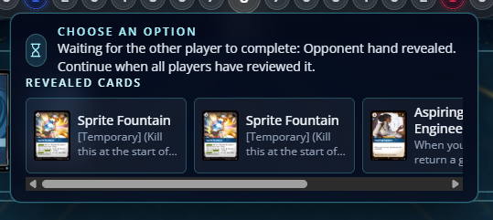

- poro snax auto payment did not used orn legend ability
- Orn Legend do not have the tap for power ability
- copy game state button facility is gone from UI
- charm play pattern is wrong, player have to make two choices, one for the enemy target unit and another for location, where that unit should move to, currently the unit is moving to base, tested with a unit at a BF. the chain card/effect placement should take in consideration that locations were not targets until now, so the current implementation where targets are shown on the chain ui need to be reviewed to be able to show locations as well
- Tokens have abilities as well, in sprite cases it has temporary, so the card preview should show the text on the token card as well 
- Scuttle Crab ability on deathknell is working but the UI for it is just wrong. currenlty we are showing list of cards with small/unreadable thumbnails, not only that the UI suggest a horizontal scroll, but is not possible to scroll to see other cards. the submit button was hidden to the right, after selecting continue was only able to leave that screen after using the hotkey "Q". the game stops for a informational only view, the game should not ask for players to continue afeter seing cards, show the cards in a temporary view and display showed card names in log as public information, for instance "Player A revealed cards x, y, z". in another axis of this issue whenever the choice is based on cards, we do not should write the cards oracle/text box on the UI, only showing the card is enough, showing the card image is better than writting the text, by a far distance. that was a project/architecture definition that I was expecting to be durable on this project, we need to enforce that.   
- unit might calculation seems off when equipments are attached to units. 
- we need to work on card tiles card snaping together, they need to stay together phisically. image-8 & image-9 are examples, benchmark of other simulators, on my preference the equipment might should be visible so the bottom/equipment card displacement should be down and to right. 
- auto-payment made wrong choices for this payment from seal, it should ask player to pay for seal manually, I think this is a regression since we fixed that in the past. what happened is that auto-payment recycled a rune that was ready, and no energy was added to the pool, it means that player lost one energy for the turn. paying for equipment cost have the same issue as well. 
- quickdraw seems to be working wrongly, the current behavior at trying to play the card, player selects a unit, and after payment the equip becomes attached to the unit. I believe that this is the wrong flow, the equipment should enter the board and a user prompt asking in witch unit that equipmenet should be attached to is prompted, after that both player trade priority, on the resolution only, the equipment gets attached. equiping a card is following the right approach, after prompt for equiping players see on the chain the pendent item.  
- when "Mask of Foresight" is on the board, after current player attacks a BF the trigger from the mask goes into chain, after players trade priority, the showdown focus should back to the attacking player, however the defender player has the first priority, this is wrong. this seems a regression as well, since we fixed this early when for instance "Traveling Merchant" was implemented, its movement triggers before starting showdown, the same wrong focus sequencing was happing and that was fixed before. 
- Patched Porobot entering the board is not triggering Pit Crew, porobot is the first riftbound card with two super types, unit and gear, on the card preview window I can see that only unit is being showed, I believe that this might be the issue here. Orn, Blacksmith ability is able to understand that porobot is a gear 
- conquering a BF when the player has one missing point from vitory do not grant player victory, in that scenario he can only win the game by conquering all BF's at the same turn, or holding. when a conquer occur in that scenario, the non-pointing is rewarded by drawing a card, this was working before, but its not working now. 
- Orn, Blacksmith trigger behavior is wrong, the window shows 4 cards as expected and ask to player recycle from 0 to 4 cards, when selecting more than one card the prompt payload is getting refused by the server, when selecting only one the payload is accepted and the revealed card screen is being shown. this behavior should be reused from a card like Stacked Deck for instance, where you look 3 cards from the top of the deck and select one of those, the rest is recycle, the only difference here is the constraint of only be able to select a gear, maybe the Stacked Deck prompt selection should be expandaded for constraint player choices to card types for instance, important to notice that effects like this can fail to find, for example is the for cards of the top of the library are units no gear can be selected then. on further investigation this is worse, the vision is only showing the cards that are able to be selected, in this case, all 4 top cards should be shown and the ones that are not selectable should be gray out, disabled for selection. looking into top deck cards are valiable information for players, and we can't remove that. 
- we need beter UX for when some effects increases card costs, players are unaware when cost is increased until the play the card. on this scenario maybe disabling the auto-payment cost could be a good idea.
- Defy card is Not Playable even when there's a spell on the chain. Defy counters spells, on that case the target for it is a spell on the chain, this is brand new behavior, never used before. 
