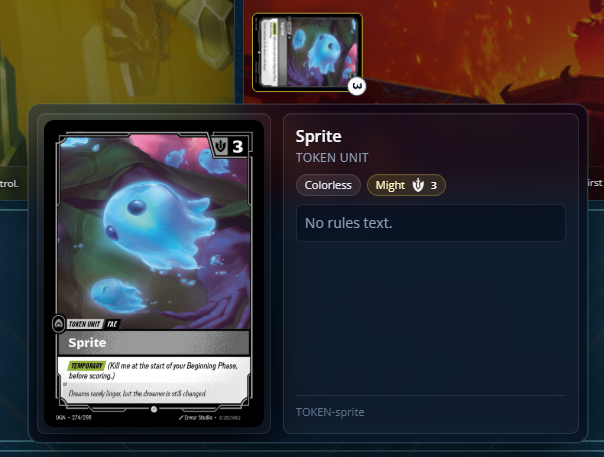
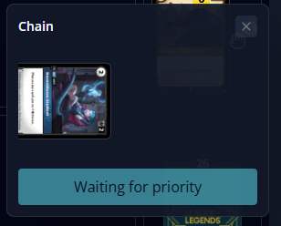

[x] remove aid window
[x] validate if after a player add a card to the chain he keeps the priority or not
[x] trash should show only the latest card added there on the pile, players can see entire trash after clicking it
[x] hover to show bigger version of the card is not working in trash and on chain
[x] we need a modal/dialog like to prompt user a choice, this would be used by selecting starting player, select battlefied, select order of triggered effects
[x] choosen champion zone is only shown when there's a card there, same coded behavior as in banished cards
[ ] on the zone area of runes, there's a counter for exhausted and ready runes, wire this to the real game state projection
[ ] we need a card highlight feature, that way when hovering on items on the stack we can highloght cards that are the target of the effects/spells
[ ] bug: Lux ability is able to be used even when the player has no priority
[ ] Lux ability is a reaction and should be possible to add energy when owner has priority, right now its no possible to use it when there is a spell on chain
[ ] chain items should wait for triggering order are choosen to only after that appears on the chain 
[ ] opponent trash looks strange when there is cards in trash
[ ] base units should wrap down when comes to a limit of width 
[ ] Chain events are reacting to the state of the card in battlefield, the units appears rotated on the chain 
