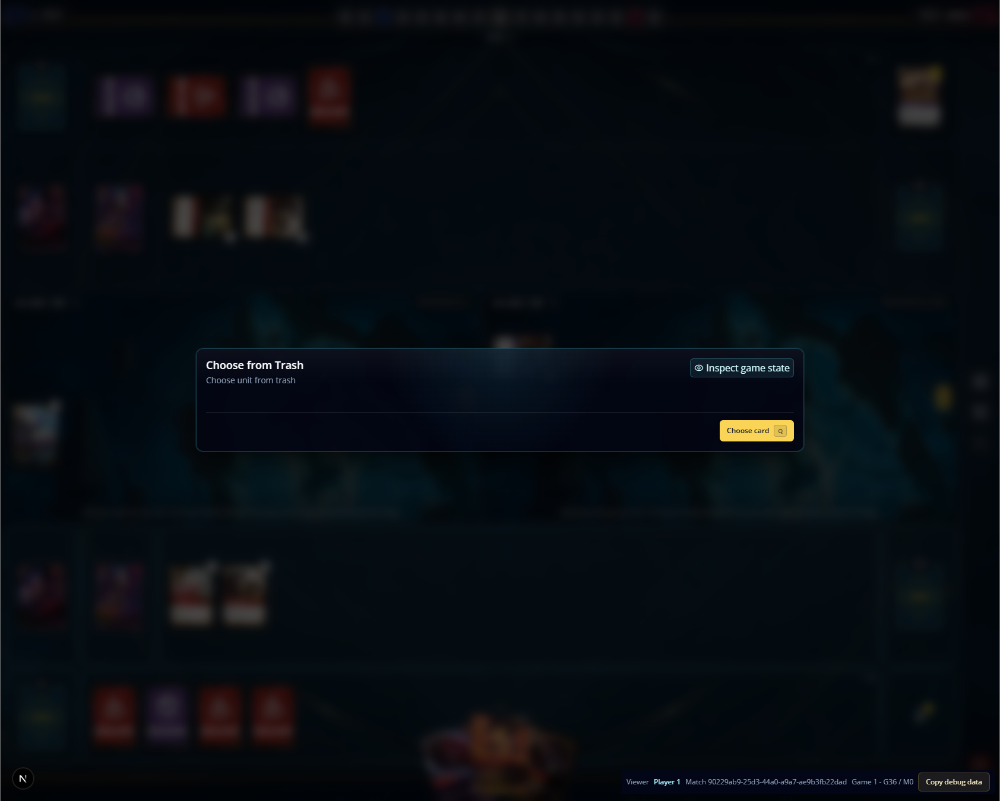

Hallowed Tomb is asking to choose from trash even if there's no card there.

expected: player holds on Hallowed Tomb, trigger goes into stack, if the choosen champion is there, prompt the choice for the player, if not, effect leaves the chain without prompt
current: player holds on Hallowed Tomb, trigger goes into stack, prompt the choice for the player, no selectable choosen champion is there and the prompt is just empty.

 

Implementation status: fixed in the shared deferred-selector resolution path and
ready for manual validation. An empty legal set now records an empty selection,
skips the impossible return instruction, and completes without opening a
choice. A legal Chosen Champion still opens the normal optional selection.
