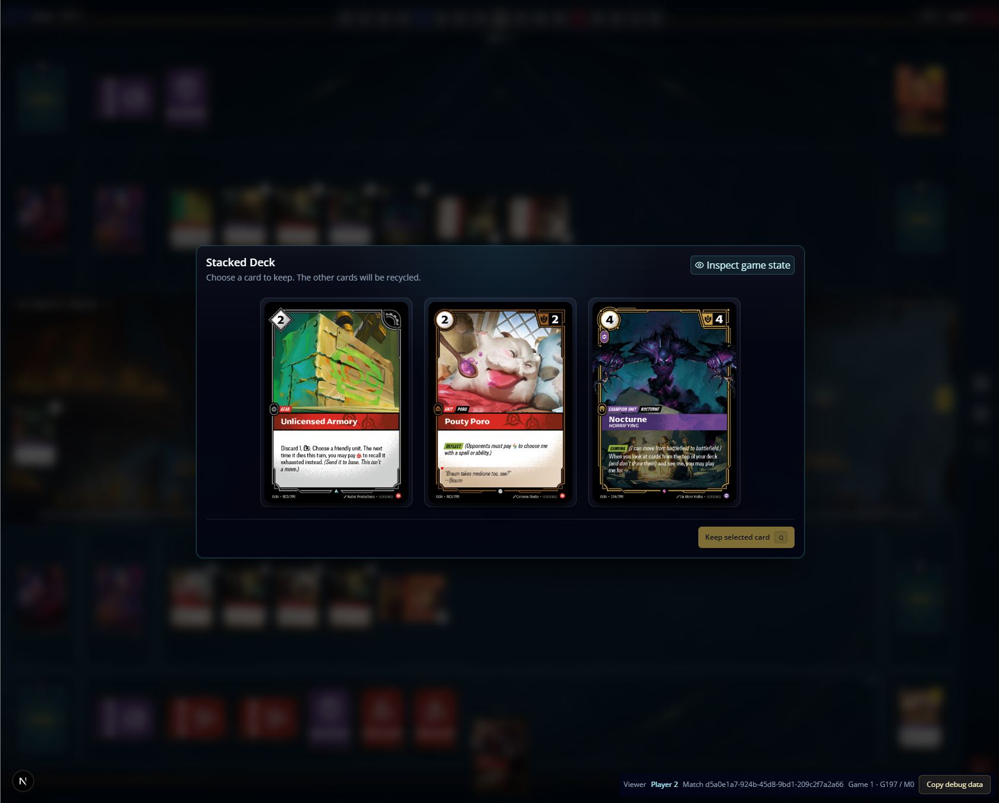

nocturne work as expected, however the flow is clunky, two question, and no resources selection, we should use the same payment as we are using for Immortal Phoenix, Flame Chomper, etc... Please validate this against the rules and fix.

before: {
  "format": "hextech-gameplay-debug-bundle",
  "formatVersion": 1,
  "capturedAt": "2026-07-22T14:26:57.163Z",
  "instructions": "Give this entire JSON value to Codex with the observed behavior and the expected behavior.",
  "context": {
    "matchId": "d5a0e1a7-924b-45d8-9bd1-209c2f7a2a66",
    "gameId": "d5a0e1a7-924b-45d8-9bd1-209c2f7a2a66:game:1",
    "gameNumber": 1,
    "gameStateVersion": 197,
    "matchStateVersion": 0,
    "viewerPlayerId": "player-2"
  },
  "match": {
    "id": "d5a0e1a7-924b-45d8-9bd1-209c2f7a2a66",
    "format": "riftbound-1v1-match",
    "status": "playing",
    "stateVersion": 0,
    "createdAt": "2026-07-22T14:05:46.059Z",
    "updatedAt": "2026-07-22T14:05:46.059Z",
    "currentGameId": "d5a0e1a7-924b-45d8-9bd1-209c2f7a2a66:game:1",
    "gameIds": [
      "d5a0e1a7-924b-45d8-9bd1-209c2f7a2a66:game:1"
    ],
    "completedGames": [],
    "betweenGames": null,
    "completion": null,
    "seats": [
      {
        "playerId": "player-1",
        "seat": "player-1",
        "displayName": "lucas",
        "registeredDeckSnapshotId": "d5a0e1a7-924b-45d8-9bd1-209c2f7a2a66:deck:player-1",
        "allowCrossDomainCards": false,
        "currentDeckConfiguration": {
          "chosenChampionRegisteredCardId": "d5a0e1a7-924b-45d8-9bd1-209c2f7a2a66:player-1:copy:champion:OGN-202:1",
          "mainDeckRegisteredCardIds": [
            "d5a0e1a7-924b-45d8-9bd1-209c2f7a2a66:player-1:copy:mainDeck:OGN-006:1",
            "d5a0e1a7-924b-45d8-9bd1-209c2f7a2a66:player-1:copy:mainDeck:OGN-006:2",
            "d5a0e1a7-924b-45d8-9bd1-209c2f7a2a66:player-1:copy:mainDeck:OGN-006:3",
            "d5a0e1a7-924b-45d8-9bd1-209c2f7a2a66:player-1:copy:mainDeck:OGN-009:1",
            "d5a0e1a7-924b-45d8-9bd1-209c2f7a2a66:player-1:copy:mainDeck:OGN-009:2",
            "d5a0e1a7-924b-45d8-9bd1-209c2f7a2a66:player-1:copy:mainDeck:OGN-009:3",
            "d5a0e1a7-924b-45d8-9bd1-209c2f7a2a66:player-1:copy:mainDeck:OGN-012:1",
            "d5a0e1a7-924b-45d8-9bd1-209c2f7a2a66:player-1:copy:mainDeck:OGN-012:2",
            "d5a0e1a7-924b-45d8-9bd1-209c2f7a2a66:player-1:copy:mainDeck:OGN-012:3",
            "d5a0e1a7-924b-45d8-9bd1-209c2f7a2a66:player-1:copy:mainDeck:OGN-013:1",
            "d5a0e1a7-924b-45d8-9bd1-209c2f7a2a66:player-1:copy:mainDeck:OGN-013:2",
            "d5a0e1a7-924b-45d8-9bd1-209c2f7a2a66:player-1:copy:mainDeck:OGN-013:3",
            "d5a0e1a7-924b-45d8-9bd1-209c2f7a2a66:player-1:copy:mainDeck:OGN-199:1",
            "d5a0e1a7-924b-45d8-9bd1-209c2f7a2a66:player-1:copy:mainDeck:OGN-199:2",
            "d5a0e1a7-924b-45d8-9bd1-209c2f7a2a66:player-1:copy:mainDeck:OGN-199:3",
            "d5a0e1a7-924b-45d8-9bd1-209c2f7a2a66:player-1:copy:mainDeck:OGN-176:1",
            "d5a0e1a7-924b-45d8-9bd1-209c2f7a2a66:player-1:copy:mainDeck:OGN-176:2",
            "d5a0e1a7-924b-45d8-9bd1-209c2f7a2a66:player-1:copy:mainDeck:OGN-176:3",
            "d5a0e1a7-924b-45d8-9bd1-209c2f7a2a66:player-1:copy:mainDeck:OGN-183:1",
            "d5a0e1a7-924b-45d8-9bd1-209c2f7a2a66:player-1:copy:mainDeck:OGN-183:2",
            "d5a0e1a7-924b-45d8-9bd1-209c2f7a2a66:player-1:copy:mainDeck:OGN-183:3",
            "d5a0e1a7-924b-45d8-9bd1-209c2f7a2a66:player-1:copy:mainDeck:OGN-185:1",
            "d5a0e1a7-924b-45d8-9bd1-209c2f7a2a66:player-1:copy:mainDeck:OGN-185:2",
            "d5a0e1a7-924b-45d8-9bd1-209c2f7a2a66:player-1:copy:mainDeck:OGN-185:3",
            "d5a0e1a7-924b-45d8-9bd1-209c2f7a2a66:player-1:copy:mainDeck:OGN-029:1",
            "d5a0e1a7-924b-45d8-9bd1-209c2f7a2a66:player-1:copy:mainDeck:OGN-029:2",
            "d5a0e1a7-924b-45d8-9bd1-209c2f7a2a66:player-1:copy:mainDeck:OGN-023:1",
            "d5a0e1a7-924b-45d8-9bd1-209c2f7a2a66:player-1:copy:mainDeck:OGN-023:2",
            "d5a0e1a7-924b-45d8-9bd1-209c2f7a2a66:player-1:copy:mainDeck:OGN-037:1",
            "d5a0e1a7-924b-45d8-9bd1-209c2f7a2a66:player-1:copy:mainDeck:OGN-037:2",
            "d5a0e1a7-924b-45d8-9bd1-209c2f7a2a66:player-1:copy:mainDeck:OGN-252:1",
            "d5a0e1a7-924b-45d8-9bd1-209c2f7a2a66:player-1:copy:mainDeck:OGN-252:2",
            "d5a0e1a7-924b-45d8-9bd1-209c2f7a2a66:player-1:copy:mainDeck:OGN-194:1",
            "d5a0e1a7-924b-45d8-9bd1-209c2f7a2a66:player-1:copy:mainDeck:OGN-194:2",
            "d5a0e1a7-924b-45d8-9bd1-209c2f7a2a66:player-1:copy:mainDeck:OGN-194:3",
            "d5a0e1a7-924b-45d8-9bd1-209c2f7a2a66:player-1:copy:mainDeck:OGN-027:1",
            "d5a0e1a7-924b-45d8-9bd1-209c2f7a2a66:player-1:copy:mainDeck:OGN-027:2",
            "d5a0e1a7-924b-45d8-9bd1-209c2f7a2a66:player-1:copy:mainDeck:OGN-035:1",
            "d5a0e1a7-924b-45d8-9bd1-209c2f7a2a66:player-1:copy:mainDeck:OGN-035:2"
          ],
          "sideboardRegisteredCardIds": [
            "d5a0e1a7-924b-45d8-9bd1-209c2f7a2a66:player-1:copy:sideboard:OGN-169:1",
            "d5a0e1a7-924b-45d8-9bd1-209c2f7a2a66:player-1:copy:sideboard:OGN-169:2",
            "d5a0e1a7-924b-45d8-9bd1-209c2f7a2a66:player-1:copy:sideboard:OGN-169:3",
            "d5a0e1a7-924b-45d8-9bd1-209c2f7a2a66:player-1:copy:sideboard:OGN-004:1",
            "d5a0e1a7-924b-45d8-9bd1-209c2f7a2a66:player-1:copy:sideboard:OGN-004:2",
            "d5a0e1a7-924b-45d8-9bd1-209c2f7a2a66:player-1:copy:sideboard:OGS-011:1",
            "d5a0e1a7-924b-45d8-9bd1-209c2f7a2a66:player-1:copy:sideboard:OGS-011:2",
            "d5a0e1a7-924b-45d8-9bd1-209c2f7a2a66:player-1:copy:sideboard:OGN-027:1"
          ]
        }
      },
      {
        "playerId": "player-2",
        "seat": "player-2",
        "displayName": "lucas",
        "registeredDeckSnapshotId": "d5a0e1a7-924b-45d8-9bd1-209c2f7a2a66:deck:player-2",
        "allowCrossDomainCards": false,
        "currentDeckConfiguration": {
          "chosenChampionRegisteredCardId": "d5a0e1a7-924b-45d8-9bd1-209c2f7a2a66:player-2:copy:champion:OGN-202:1",
          "mainDeckRegisteredCardIds": [
            "d5a0e1a7-924b-45d8-9bd1-209c2f7a2a66:player-2:copy:mainDeck:OGN-006:1",
            "d5a0e1a7-924b-45d8-9bd1-209c2f7a2a66:player-2:copy:mainDeck:OGN-006:2",
            "d5a0e1a7-924b-45d8-9bd1-209c2f7a2a66:player-2:copy:mainDeck:OGN-006:3",
            "d5a0e1a7-924b-45d8-9bd1-209c2f7a2a66:player-2:copy:mainDeck:OGN-009:1",
            "d5a0e1a7-924b-45d8-9bd1-209c2f7a2a66:player-2:copy:mainDeck:OGN-009:2",
            "d5a0e1a7-924b-45d8-9bd1-209c2f7a2a66:player-2:copy:mainDeck:OGN-009:3",
            "d5a0e1a7-924b-45d8-9bd1-209c2f7a2a66:player-2:copy:mainDeck:OGN-012:1",
            "d5a0e1a7-924b-45d8-9bd1-209c2f7a2a66:player-2:copy:mainDeck:OGN-012:2",
            "d5a0e1a7-924b-45d8-9bd1-209c2f7a2a66:player-2:copy:mainDeck:OGN-012:3",
            "d5a0e1a7-924b-45d8-9bd1-209c2f7a2a66:player-2:copy:mainDeck:OGN-013:1",
            "d5a0e1a7-924b-45d8-9bd1-209c2f7a2a66:player-2:copy:mainDeck:OGN-013:2",
            "d5a0e1a7-924b-45d8-9bd1-209c2f7a2a66:player-2:copy:mainDeck:OGN-013:3",
            "d5a0e1a7-924b-45d8-9bd1-209c2f7a2a66:player-2:copy:mainDeck:OGN-199:1",
            "d5a0e1a7-924b-45d8-9bd1-209c2f7a2a66:player-2:copy:mainDeck:OGN-199:2",
            "d5a0e1a7-924b-45d8-9bd1-209c2f7a2a66:player-2:copy:mainDeck:OGN-199:3",
            "d5a0e1a7-924b-45d8-9bd1-209c2f7a2a66:player-2:copy:mainDeck:OGN-176:1",
            "d5a0e1a7-924b-45d8-9bd1-209c2f7a2a66:player-2:copy:mainDeck:OGN-176:2",
            "d5a0e1a7-924b-45d8-9bd1-209c2f7a2a66:player-2:copy:mainDeck:OGN-176:3",
            "d5a0e1a7-924b-45d8-9bd1-209c2f7a2a66:player-2:copy:mainDeck:OGN-183:1",
            "d5a0e1a7-924b-45d8-9bd1-209c2f7a2a66:player-2:copy:mainDeck:OGN-183:2",
            "d5a0e1a7-924b-45d8-9bd1-209c2f7a2a66:player-2:copy:mainDeck:OGN-183:3",
            "d5a0e1a7-924b-45d8-9bd1-209c2f7a2a66:player-2:copy:mainDeck:OGN-185:1",
            "d5a0e1a7-924b-45d8-9bd1-209c2f7a2a66:player-2:copy:mainDeck:OGN-185:2",
            "d5a0e1a7-924b-45d8-9bd1-209c2f7a2a66:player-2:copy:mainDeck:OGN-185:3",
            "d5a0e1a7-924b-45d8-9bd1-209c2f7a2a66:player-2:copy:mainDeck:OGN-029:1",
            "d5a0e1a7-924b-45d8-9bd1-209c2f7a2a66:player-2:copy:mainDeck:OGN-029:2",
            "d5a0e1a7-924b-45d8-9bd1-209c2f7a2a66:player-2:copy:mainDeck:OGN-023:1",
            "d5a0e1a7-924b-45d8-9bd1-209c2f7a2a66:player-2:copy:mainDeck:OGN-023:2",
            "d5a0e1a7-924b-45d8-9bd1-209c2f7a2a66:player-2:copy:mainDeck:OGN-037:1",
            "d5a0e1a7-924b-45d8-9bd1-209c2f7a2a66:player-2:copy:mainDeck:OGN-037:2",
            "d5a0e1a7-924b-45d8-9bd1-209c2f7a2a66:player-2:copy:mainDeck:OGN-252:1",
            "d5a0e1a7-924b-45d8-9bd1-209c2f7a2a66:player-2:copy:mainDeck:OGN-252:2",
            "d5a0e1a7-924b-45d8-9bd1-209c2f7a2a66:player-2:copy:mainDeck:OGN-194:1",
            "d5a0e1a7-924b-45d8-9bd1-209c2f7a2a66:player-2:copy:mainDeck:OGN-194:2",
            "d5a0e1a7-924b-45d8-9bd1-209c2f7a2a66:player-2:copy:mainDeck:OGN-194:3",
            "d5a0e1a7-924b-45d8-9bd1-209c2f7a2a66:player-2:copy:mainDeck:OGN-027:1",
            "d5a0e1a7-924b-45d8-9bd1-209c2f7a2a66:player-2:copy:mainDeck:OGN-027:2",
            "d5a0e1a7-924b-45d8-9bd1-209c2f7a2a66:player-2:copy:mainDeck:OGN-035:1",
            "d5a0e1a7-924b-45d8-9bd1-209c2f7a2a66:player-2:copy:mainDeck:OGN-035:2"
          ],
          "sideboardRegisteredCardIds": [
            "d5a0e1a7-924b-45d8-9bd1-209c2f7a2a66:player-2:copy:sideboard:OGN-169:1",
            "d5a0e1a7-924b-45d8-9bd1-209c2f7a2a66:player-2:copy:sideboard:OGN-169:2",
            "d5a0e1a7-924b-45d8-9bd1-209c2f7a2a66:player-2:copy:sideboard:OGN-169:3",
            "d5a0e1a7-924b-45d8-9bd1-209c2f7a2a66:player-2:copy:sideboard:OGN-004:1",
            "d5a0e1a7-924b-45d8-9bd1-209c2f7a2a66:player-2:copy:sideboard:OGN-004:2",
            "d5a0e1a7-924b-45d8-9bd1-209c2f7a2a66:player-2:copy:sideboard:OGS-011:1",
            "d5a0e1a7-924b-45d8-9bd1-209c2f7a2a66:player-2:copy:sideboard:OGS-011:2",
            "d5a0e1a7-924b-45d8-9bd1-209c2f7a2a66:player-2:copy:sideboard:OGN-027:1"
          ]
        }
      }
    ]
  },
  "game": {
    "id": "d5a0e1a7-924b-45d8-9bd1-209c2f7a2a66:game:1",
    "createdAt": "2026-07-22T14:05:46.059Z",
    "updatedAt": "2026-07-22T14:26:13.400Z",
    "matchId": "d5a0e1a7-924b-45d8-9bd1-209c2f7a2a66",
    "gameNumber": 1,
    "stateVersion": 197,
    "status": "in_progress",
    "winnerPlayerId": null,
    "completionReason": null,
    "state": {
      "setup": {
        "playerIds": [
          "player-1",
          "player-2"
        ],
        "startingPlayerChooserId": "player-2",
        "startingPlayerId": "player-1",
        "battlefieldPools": {
          "player-1": [
            "d5a0e1a7-924b-45d8-9bd1-209c2f7a2a66:player-1:copy:battlefield:OGN-290:1",
            "d5a0e1a7-924b-45d8-9bd1-209c2f7a2a66:player-1:copy:battlefield:OGN-291:1",
            "d5a0e1a7-924b-45d8-9bd1-209c2f7a2a66:player-1:copy:battlefield:OGN-281:1"
          ],
          "player-2": [
            "d5a0e1a7-924b-45d8-9bd1-209c2f7a2a66:player-2:copy:battlefield:OGN-290:1",
            "d5a0e1a7-924b-45d8-9bd1-209c2f7a2a66:player-2:copy:battlefield:OGN-291:1",
            "d5a0e1a7-924b-45d8-9bd1-209c2f7a2a66:player-2:copy:battlefield:OGN-281:1"
          ]
        },
        "battlefieldChoices": {
          "player-1": {
            "status": "revealed",
            "cardInstanceId": "d5a0e1a7-924b-45d8-9bd1-209c2f7a2a66:player-1:copy:battlefield:OGN-291:1"
          },
          "player-2": {
            "status": "revealed",
            "cardInstanceId": "d5a0e1a7-924b-45d8-9bd1-209c2f7a2a66:player-2:copy:battlefield:OGN-291:1"
          }
        },
        "mulligans": {
          "player-1": {
            "status": "locked",
            "selectedCardInstanceIds": [
              "d5a0e1a7-924b-45d8-9bd1-209c2f7a2a66:player-1:copy:mainDeck:OGN-012:2",
              "d5a0e1a7-924b-45d8-9bd1-209c2f7a2a66:player-1:copy:mainDeck:OGN-194:3"
            ]
          },
          "player-2": {
            "status": "locked",
            "selectedCardInstanceIds": [
              "d5a0e1a7-924b-45d8-9bd1-209c2f7a2a66:player-2:copy:mainDeck:OGN-176:2",
              "d5a0e1a7-924b-45d8-9bd1-209c2f7a2a66:player-2:copy:mainDeck:OGN-027:2"
            ]
          }
        }
      },
      "players": {
        "player-1": {
          "playerId": "player-1",
          "points": 4,
          "scoredBattlefieldIdsThisTurn": [
            "d5a0e1a7-924b-45d8-9bd1-209c2f7a2a66:player-1:copy:battlefield:OGN-291:1"
          ],
          "energy": 0,
          "conditionalEnergy": 0,
          "power": {},
          "zones": {
            "legend": "d5a0e1a7-924b-45d8-9bd1-209c2f7a2a66:player-1:copy:legend:OGN-251:1",
            "champion": "d5a0e1a7-924b-45d8-9bd1-209c2f7a2a66:player-1:copy:champion:OGN-202:1",
            "mainDeck": [
              "d5a0e1a7-924b-45d8-9bd1-209c2f7a2a66:player-1:copy:mainDeck:OGN-185:1",
              "d5a0e1a7-924b-45d8-9bd1-209c2f7a2a66:player-1:copy:mainDeck:OGN-013:3",
              "d5a0e1a7-924b-45d8-9bd1-209c2f7a2a66:player-1:copy:mainDeck:OGN-199:3",
              "d5a0e1a7-924b-45d8-9bd1-209c2f7a2a66:player-1:copy:mainDeck:OGN-027:1",
              "d5a0e1a7-924b-45d8-9bd1-209c2f7a2a66:player-1:copy:mainDeck:OGN-252:2",
              "d5a0e1a7-924b-45d8-9bd1-209c2f7a2a66:player-1:copy:mainDeck:OGN-029:2",
              "d5a0e1a7-924b-45d8-9bd1-209c2f7a2a66:player-1:copy:mainDeck:OGN-194:1",
              "d5a0e1a7-924b-45d8-9bd1-209c2f7a2a66:player-1:copy:mainDeck:OGN-183:2",
              "d5a0e1a7-924b-45d8-9bd1-209c2f7a2a66:player-1:copy:mainDeck:OGN-012:3",
              "d5a0e1a7-924b-45d8-9bd1-209c2f7a2a66:player-1:copy:mainDeck:OGN-012:2",
              "d5a0e1a7-924b-45d8-9bd1-209c2f7a2a66:player-1:copy:mainDeck:OGN-194:3",
              "d5a0e1a7-924b-45d8-9bd1-209c2f7a2a66:player-1:copy:mainDeck:OGN-176:2",
              "d5a0e1a7-924b-45d8-9bd1-209c2f7a2a66:player-1:copy:mainDeck:OGN-176:3",
              "d5a0e1a7-924b-45d8-9bd1-209c2f7a2a66:player-1:copy:mainDeck:OGN-023:2",
              "d5a0e1a7-924b-45d8-9bd1-209c2f7a2a66:player-1:copy:mainDeck:OGN-006:2",
              "d5a0e1a7-924b-45d8-9bd1-209c2f7a2a66:player-1:copy:mainDeck:OGN-013:1",
              "d5a0e1a7-924b-45d8-9bd1-209c2f7a2a66:player-1:copy:mainDeck:OGN-009:3",
              "d5a0e1a7-924b-45d8-9bd1-209c2f7a2a66:player-1:copy:mainDeck:OGN-252:1",
              "d5a0e1a7-924b-45d8-9bd1-209c2f7a2a66:player-1:copy:mainDeck:OGN-027:2",
              "d5a0e1a7-924b-45d8-9bd1-209c2f7a2a66:player-1:copy:mainDeck:OGN-009:1"
            ],
            "runeDeck": [
              "d5a0e1a7-924b-45d8-9bd1-209c2f7a2a66:player-1:copy:runeDeck:OGN-166:2",
              "d5a0e1a7-924b-45d8-9bd1-209c2f7a2a66:player-1:copy:runeDeck:OGN-007:2",
              "d5a0e1a7-924b-45d8-9bd1-209c2f7a2a66:player-1:copy:runeDeck:OGN-007:6",
              "d5a0e1a7-924b-45d8-9bd1-209c2f7a2a66:player-1:copy:runeDeck:OGN-007:8",
              "d5a0e1a7-924b-45d8-9bd1-209c2f7a2a66:player-1:copy:runeDeck:OGN-007:5",
              "d5a0e1a7-924b-45d8-9bd1-209c2f7a2a66:player-1:copy:runeDeck:OGN-007:7",
              "d5a0e1a7-924b-45d8-9bd1-209c2f7a2a66:player-1:copy:runeDeck:OGN-007:1",
              "d5a0e1a7-924b-45d8-9bd1-209c2f7a2a66:player-1:copy:runeDeck:OGN-007:3",
              "d5a0e1a7-924b-45d8-9bd1-209c2f7a2a66:player-1:copy:runeDeck:OGN-166:4",
              "d5a0e1a7-924b-45d8-9bd1-209c2f7a2a66:player-1:copy:runeDeck:OGN-007:4"
            ],
            "hand": [
              "d5a0e1a7-924b-45d8-9bd1-209c2f7a2a66:player-1:copy:mainDeck:OGN-035:1"
            ],
            "trash": [
              "d5a0e1a7-924b-45d8-9bd1-209c2f7a2a66:player-1:copy:mainDeck:OGN-183:1",
              "d5a0e1a7-924b-45d8-9bd1-209c2f7a2a66:player-1:copy:mainDeck:OGN-183:3",
              "d5a0e1a7-924b-45d8-9bd1-209c2f7a2a66:player-1:copy:mainDeck:OGN-035:2",
              "d5a0e1a7-924b-45d8-9bd1-209c2f7a2a66:player-1:copy:mainDeck:OGN-029:1",
              "d5a0e1a7-924b-45d8-9bd1-209c2f7a2a66:player-1:copy:mainDeck:OGN-013:2",
              "d5a0e1a7-924b-45d8-9bd1-209c2f7a2a66:player-1:copy:mainDeck:OGN-199:2",
              "d5a0e1a7-924b-45d8-9bd1-209c2f7a2a66:player-1:copy:mainDeck:OGN-009:2",
              "d5a0e1a7-924b-45d8-9bd1-209c2f7a2a66:player-1:copy:mainDeck:OGN-199:1",
              "d5a0e1a7-924b-45d8-9bd1-209c2f7a2a66:player-1:copy:mainDeck:OGN-037:2",
              "d5a0e1a7-924b-45d8-9bd1-209c2f7a2a66:player-1:copy:mainDeck:OGN-037:1"
            ],
            "banishment": [],
            "base": [
              "d5a0e1a7-924b-45d8-9bd1-209c2f7a2a66:player-1:copy:mainDeck:OGN-023:1",
              "d5a0e1a7-924b-45d8-9bd1-209c2f7a2a66:player-1:copy:mainDeck:OGN-176:1",
              "d5a0e1a7-924b-45d8-9bd1-209c2f7a2a66:player-1:copy:mainDeck:OGN-006:1",
              "d5a0e1a7-924b-45d8-9bd1-209c2f7a2a66:player-1:copy:mainDeck:OGN-185:2",
              "d5a0e1a7-924b-45d8-9bd1-209c2f7a2a66:player-1:copy:mainDeck:OGN-194:2",
              "d5a0e1a7-924b-45d8-9bd1-209c2f7a2a66:player-1:copy:runeDeck:OGN-166:1",
              "d5a0e1a7-924b-45d8-9bd1-209c2f7a2a66:player-1:copy:runeDeck:OGN-166:3",
              "d5a0e1a7-924b-45d8-9bd1-209c2f7a2a66:player-1:copy:mainDeck:OGN-006:3",
              "d5a0e1a7-924b-45d8-9bd1-209c2f7a2a66:player-1:copy:mainDeck:OGN-012:1"
            ]
          },
          "conqueredBattlefieldIdsThisTurn": [
            "d5a0e1a7-924b-45d8-9bd1-209c2f7a2a66:player-1:copy:battlefield:OGN-291:1"
          ],
          "hasTakenBeginningPhase": true,
          "playedCardIdsThisTurn": [],
          "playedMainDeckCardIdsThisTurn": [],
          "legionSatisfiedCardIdsThisTurn": [],
          "chosenModesThisTurn": {},
          "triggerMemoryKeysThisTurn": []
        },
        "player-2": {
          "playerId": "player-2",
          "points": 4,
          "scoredBattlefieldIdsThisTurn": [
            "d5a0e1a7-924b-45d8-9bd1-209c2f7a2a66:player-2:copy:battlefield:OGN-291:1"
          ],
          "energy": 0,
          "conditionalEnergy": 0,
          "power": {
            "Fury": 0
          },
          "zones": {
            "legend": "d5a0e1a7-924b-45d8-9bd1-209c2f7a2a66:player-2:copy:legend:OGN-251:1",
            "champion": "d5a0e1a7-924b-45d8-9bd1-209c2f7a2a66:player-2:copy:champion:OGN-202:1",
            "mainDeck": [
              "d5a0e1a7-924b-45d8-9bd1-209c2f7a2a66:player-2:copy:mainDeck:OGN-023:1",
              "d5a0e1a7-924b-45d8-9bd1-209c2f7a2a66:player-2:copy:mainDeck:OGN-013:1",
              "d5a0e1a7-924b-45d8-9bd1-209c2f7a2a66:player-2:copy:mainDeck:OGN-194:2",
              "d5a0e1a7-924b-45d8-9bd1-209c2f7a2a66:player-2:copy:mainDeck:OGN-023:2",
              "d5a0e1a7-924b-45d8-9bd1-209c2f7a2a66:player-2:copy:mainDeck:OGN-183:3",
              "d5a0e1a7-924b-45d8-9bd1-209c2f7a2a66:player-2:copy:mainDeck:OGN-185:2",
              "d5a0e1a7-924b-45d8-9bd1-209c2f7a2a66:player-2:copy:mainDeck:OGN-029:1",
              "d5a0e1a7-924b-45d8-9bd1-209c2f7a2a66:player-2:copy:mainDeck:OGN-176:3",
              "d5a0e1a7-924b-45d8-9bd1-209c2f7a2a66:player-2:copy:mainDeck:OGN-199:1",
              "d5a0e1a7-924b-45d8-9bd1-209c2f7a2a66:player-2:copy:mainDeck:OGN-009:2",
              "d5a0e1a7-924b-45d8-9bd1-209c2f7a2a66:player-2:copy:mainDeck:OGN-194:1",
              "d5a0e1a7-924b-45d8-9bd1-209c2f7a2a66:player-2:copy:mainDeck:OGN-006:2",
              "d5a0e1a7-924b-45d8-9bd1-209c2f7a2a66:player-2:copy:mainDeck:OGN-194:3",
              "d5a0e1a7-924b-45d8-9bd1-209c2f7a2a66:player-2:copy:mainDeck:OGN-199:3",
              "d5a0e1a7-924b-45d8-9bd1-209c2f7a2a66:player-2:copy:mainDeck:OGN-035:1",
              "d5a0e1a7-924b-45d8-9bd1-209c2f7a2a66:player-2:copy:mainDeck:OGN-012:2",
              "d5a0e1a7-924b-45d8-9bd1-209c2f7a2a66:player-2:copy:mainDeck:OGN-009:3",
              "d5a0e1a7-924b-45d8-9bd1-209c2f7a2a66:player-2:copy:mainDeck:OGN-176:2",
              "d5a0e1a7-924b-45d8-9bd1-209c2f7a2a66:player-2:copy:mainDeck:OGN-027:2",
              "d5a0e1a7-924b-45d8-9bd1-209c2f7a2a66:player-2:copy:mainDeck:OGN-029:2",
              "d5a0e1a7-924b-45d8-9bd1-209c2f7a2a66:player-2:copy:mainDeck:OGN-012:1",
              "d5a0e1a7-924b-45d8-9bd1-209c2f7a2a66:player-2:copy:mainDeck:OGN-035:2",
              "d5a0e1a7-924b-45d8-9bd1-209c2f7a2a66:player-2:copy:mainDeck:OGN-009:1",
              "d5a0e1a7-924b-45d8-9bd1-209c2f7a2a66:player-2:copy:mainDeck:OGN-176:1",
              "d5a0e1a7-924b-45d8-9bd1-209c2f7a2a66:player-2:copy:mainDeck:OGN-037:2"
            ],
            "runeDeck": [
              "d5a0e1a7-924b-45d8-9bd1-209c2f7a2a66:player-2:copy:runeDeck:OGN-166:4",
              "d5a0e1a7-924b-45d8-9bd1-209c2f7a2a66:player-2:copy:runeDeck:OGN-007:1",
              "d5a0e1a7-924b-45d8-9bd1-209c2f7a2a66:player-2:copy:runeDeck:OGN-007:6",
              "d5a0e1a7-924b-45d8-9bd1-209c2f7a2a66:player-2:copy:runeDeck:OGN-007:5",
              "d5a0e1a7-924b-45d8-9bd1-209c2f7a2a66:player-2:copy:runeDeck:OGN-166:2",
              "d5a0e1a7-924b-45d8-9bd1-209c2f7a2a66:player-2:copy:runeDeck:OGN-007:3"
            ],
            "hand": [
              "d5a0e1a7-924b-45d8-9bd1-209c2f7a2a66:player-2:copy:mainDeck:OGN-027:1"
            ],
            "trash": [
              "d5a0e1a7-924b-45d8-9bd1-209c2f7a2a66:player-2:copy:mainDeck:OGN-199:2",
              "d5a0e1a7-924b-45d8-9bd1-209c2f7a2a66:player-2:copy:mainDeck:OGN-013:2",
              "d5a0e1a7-924b-45d8-9bd1-209c2f7a2a66:player-2:copy:mainDeck:OGN-185:3",
              "d5a0e1a7-924b-45d8-9bd1-209c2f7a2a66:player-2:copy:mainDeck:OGN-183:2",
              "d5a0e1a7-924b-45d8-9bd1-209c2f7a2a66:player-2:copy:mainDeck:OGN-252:1",
              "d5a0e1a7-924b-45d8-9bd1-209c2f7a2a66:player-2:copy:mainDeck:OGN-252:2",
              "d5a0e1a7-924b-45d8-9bd1-209c2f7a2a66:player-2:copy:mainDeck:OGN-183:1"
            ],
            "banishment": [],
            "base": [
              "d5a0e1a7-924b-45d8-9bd1-209c2f7a2a66:player-2:copy:runeDeck:OGN-166:3",
              "d5a0e1a7-924b-45d8-9bd1-209c2f7a2a66:player-2:copy:mainDeck:OGN-013:3",
              "d5a0e1a7-924b-45d8-9bd1-209c2f7a2a66:player-2:copy:runeDeck:OGN-007:4",
              "d5a0e1a7-924b-45d8-9bd1-209c2f7a2a66:player-2:copy:mainDeck:OGN-006:3",
              "d5a0e1a7-924b-45d8-9bd1-209c2f7a2a66:player-2:copy:mainDeck:OGN-012:3",
              "d5a0e1a7-924b-45d8-9bd1-209c2f7a2a66:player-2:copy:runeDeck:OGN-007:8",
              "d5a0e1a7-924b-45d8-9bd1-209c2f7a2a66:player-2:copy:runeDeck:OGN-166:1",
              "d5a0e1a7-924b-45d8-9bd1-209c2f7a2a66:player-2:copy:mainDeck:OGN-006:1",
              "d5a0e1a7-924b-45d8-9bd1-209c2f7a2a66:player-2:copy:runeDeck:OGN-007:2",
              "d5a0e1a7-924b-45d8-9bd1-209c2f7a2a66:player-2:copy:runeDeck:OGN-007:7",
              "d5a0e1a7-924b-45d8-9bd1-209c2f7a2a66:player-2:copy:mainDeck:OGN-037:1"
            ]
          },
          "playedCardIdsThisTurn": [
            "d5a0e1a7-924b-45d8-9bd1-209c2f7a2a66:player-2:copy:mainDeck:OGN-252:2",
            "d5a0e1a7-924b-45d8-9bd1-209c2f7a2a66:player-2:copy:mainDeck:OGN-037:1",
            "d5a0e1a7-924b-45d8-9bd1-209c2f7a2a66:player-2:copy:mainDeck:OGN-183:1"
          ],
          "playedMainDeckCardIdsThisTurn": [],
          "legionSatisfiedCardIdsThisTurn": [
            "d5a0e1a7-924b-45d8-9bd1-209c2f7a2a66:player-2:copy:mainDeck:OGN-037:1",
            "d5a0e1a7-924b-45d8-9bd1-209c2f7a2a66:player-2:copy:mainDeck:OGN-183:1"
          ],
          "chosenModesThisTurn": {},
          "triggerMemoryKeysThisTurn": [],
          "conqueredBattlefieldIdsThisTurn": [],
          "hasTakenBeginningPhase": true
        }
      },
      "battlefields": [
        {
          "battlefieldId": "d5a0e1a7-924b-45d8-9bd1-209c2f7a2a66:player-1:copy:battlefield:OGN-291:1",
          "cardInstanceId": "d5a0e1a7-924b-45d8-9bd1-209c2f7a2a66:player-1:copy:battlefield:OGN-291:1",
          "selectedByPlayerId": "player-1",
          "controllerPlayerId": "player-1",
          "contestedByPlayerId": null,
          "units": [
            "d5a0e1a7-924b-45d8-9bd1-209c2f7a2a66:player-1:copy:mainDeck:OGN-185:3"
          ]
        },
        {
          "battlefieldId": "d5a0e1a7-924b-45d8-9bd1-209c2f7a2a66:player-2:copy:battlefield:OGN-291:1",
          "cardInstanceId": "d5a0e1a7-924b-45d8-9bd1-209c2f7a2a66:player-2:copy:battlefield:OGN-291:1",
          "selectedByPlayerId": "player-2",
          "controllerPlayerId": "player-2",
          "contestedByPlayerId": null,
          "units": [
            "d5a0e1a7-924b-45d8-9bd1-209c2f7a2a66:player-2:copy:mainDeck:OGN-185:1"
          ],
          "facedownCards": [],
          "facedownCardInstanceId": null,
          "facedownControllerPlayerId": null,
          "hiddenAtTurnNumber": null
        }
      ],
      "cardStates": {
        "d5a0e1a7-924b-45d8-9bd1-209c2f7a2a66:player-1:copy:legend:OGN-251:1": {
          "exhausted": false,
          "damage": 0,
          "computedMight": null,
          "objectVersion": 0,
          "stunned": false,
          "lethalSuppressedDamage": null,
          "lethalSuppressedMight": null,
          "combatRole": null
        },
        "d5a0e1a7-924b-45d8-9bd1-209c2f7a2a66:player-1:copy:champion:OGN-202:1": {
          "exhausted": false,
          "damage": 0,
          "computedMight": 5,
          "objectVersion": 0,
          "stunned": false,
          "lethalSuppressedDamage": null,
          "lethalSuppressedMight": null,
          "combatRole": null
        },
        "d5a0e1a7-924b-45d8-9bd1-209c2f7a2a66:player-1:copy:mainDeck:OGN-006:1": {
          "exhausted": false,
          "damage": 0,
          "computedMight": 3,
          "objectVersion": 2,
          "stunned": false,
          "lethalSuppressedDamage": null,
          "lethalSuppressedMight": null,
          "combatRole": null
        },
        "d5a0e1a7-924b-45d8-9bd1-209c2f7a2a66:player-1:copy:mainDeck:OGN-006:2": {
          "exhausted": false,
          "damage": 0,
          "computedMight": 3,
          "objectVersion": 0,
          "stunned": false,
          "lethalSuppressedDamage": null,
          "lethalSuppressedMight": null,
          "combatRole": null
        },
        "d5a0e1a7-924b-45d8-9bd1-209c2f7a2a66:player-1:copy:mainDeck:OGN-006:3": {
          "exhausted": true,
          "damage": 0,
          "computedMight": 3,
          "objectVersion": 2,
          "stunned": false,
          "lethalSuppressedDamage": null,
          "lethalSuppressedMight": null,
          "combatRole": null
        },
        "d5a0e1a7-924b-45d8-9bd1-209c2f7a2a66:player-1:copy:mainDeck:OGN-009:1": {
          "exhausted": false,
          "damage": 0,
          "computedMight": null,
          "objectVersion": 0,
          "stunned": false,
          "lethalSuppressedDamage": null,
          "lethalSuppressedMight": null,
          "combatRole": null
        },
        "d5a0e1a7-924b-45d8-9bd1-209c2f7a2a66:player-1:copy:mainDeck:OGN-009:2": {
          "exhausted": false,
          "damage": 0,
          "computedMight": null,
          "objectVersion": 0,
          "stunned": false,
          "lethalSuppressedDamage": null,
          "lethalSuppressedMight": null,
          "combatRole": null
        },
        "d5a0e1a7-924b-45d8-9bd1-209c2f7a2a66:player-1:copy:mainDeck:OGN-009:3": {
          "exhausted": false,
          "damage": 0,
          "computedMight": null,
          "objectVersion": 0,
          "stunned": false,
          "lethalSuppressedDamage": null,
          "lethalSuppressedMight": null,
          "combatRole": null
        },
        "d5a0e1a7-924b-45d8-9bd1-209c2f7a2a66:player-1:copy:mainDeck:OGN-012:1": {
          "exhausted": true,
          "damage": 0,
          "computedMight": 4,
          "objectVersion": 0,
          "stunned": false,
          "lethalSuppressedDamage": null,
          "lethalSuppressedMight": null,
          "combatRole": null
        },
        "d5a0e1a7-924b-45d8-9bd1-209c2f7a2a66:player-1:copy:mainDeck:OGN-012:2": {
          "exhausted": false,
          "damage": 0,
          "computedMight": 4,
          "objectVersion": 0,
          "stunned": false,
          "lethalSuppressedDamage": null,
          "lethalSuppressedMight": null,
          "combatRole": null
        },
        "d5a0e1a7-924b-45d8-9bd1-209c2f7a2a66:player-1:copy:mainDeck:OGN-012:3": {
          "exhausted": false,
          "damage": 0,
          "computedMight": 4,
          "objectVersion": 0,
          "stunned": false,
          "lethalSuppressedDamage": null,
          "lethalSuppressedMight": null,
          "combatRole": null
        },
        "d5a0e1a7-924b-45d8-9bd1-209c2f7a2a66:player-1:copy:mainDeck:OGN-013:1": {
          "exhausted": false,
          "damage": 0,
          "computedMight": 2,
          "objectVersion": 0,
          "stunned": false,
          "lethalSuppressedDamage": null,
          "lethalSuppressedMight": null,
          "combatRole": null
        },
        "d5a0e1a7-924b-45d8-9bd1-209c2f7a2a66:player-1:copy:mainDeck:OGN-013:2": {
          "exhausted": false,
          "damage": 0,
          "computedMight": 2,
          "objectVersion": 1,
          "stunned": false,
          "lethalSuppressedDamage": null,
          "lethalSuppressedMight": null,
          "combatRole": null
        },
        "d5a0e1a7-924b-45d8-9bd1-209c2f7a2a66:player-1:copy:mainDeck:OGN-013:3": {
          "exhausted": false,
          "damage": 0,
          "computedMight": 2,
          "objectVersion": 0,
          "stunned": false,
          "lethalSuppressedDamage": null,
          "lethalSuppressedMight": null,
          "combatRole": null
        },
        "d5a0e1a7-924b-45d8-9bd1-209c2f7a2a66:player-1:copy:mainDeck:OGN-199:1": {
          "exhausted": false,
          "damage": 0,
          "computedMight": 2,
          "objectVersion": 0,
          "stunned": false,
          "lethalSuppressedDamage": null,
          "lethalSuppressedMight": null,
          "combatRole": null
        },
        "d5a0e1a7-924b-45d8-9bd1-209c2f7a2a66:player-1:copy:mainDeck:OGN-199:2": {
          "exhausted": false,
          "damage": 0,
          "computedMight": 2,
          "objectVersion": 2,
          "stunned": false,
          "lethalSuppressedDamage": null,
          "lethalSuppressedMight": null,
          "combatRole": null,
          "buffed": false
        },
        "d5a0e1a7-924b-45d8-9bd1-209c2f7a2a66:player-1:copy:mainDeck:OGN-199:3": {
          "exhausted": false,
          "damage": 0,
          "computedMight": 2,
          "objectVersion": 0,
          "stunned": false,
          "lethalSuppressedDamage": null,
          "lethalSuppressedMight": null,
          "combatRole": null
        },
        "d5a0e1a7-924b-45d8-9bd1-209c2f7a2a66:player-1:copy:mainDeck:OGN-176:1": {
          "exhausted": false,
          "damage": 0,
          "computedMight": 2,
          "objectVersion": 0,
          "stunned": false,
          "lethalSuppressedDamage": null,
          "lethalSuppressedMight": null,
          "combatRole": null
        },
        "d5a0e1a7-924b-45d8-9bd1-209c2f7a2a66:player-1:copy:mainDeck:OGN-176:2": {
          "exhausted": false,
          "damage": 0,
          "computedMight": 2,
          "objectVersion": 0,
          "stunned": false,
          "lethalSuppressedDamage": null,
          "lethalSuppressedMight": null,
          "combatRole": null
        },
        "d5a0e1a7-924b-45d8-9bd1-209c2f7a2a66:player-1:copy:mainDeck:OGN-176:3": {
          "exhausted": false,
          "damage": 0,
          "computedMight": 2,
          "objectVersion": 0,
          "stunned": false,
          "lethalSuppressedDamage": null,
          "lethalSuppressedMight": null,
          "combatRole": null
        },
        "d5a0e1a7-924b-45d8-9bd1-209c2f7a2a66:player-1:copy:mainDeck:OGN-183:1": {
          "exhausted": false,
          "damage": 0,
          "computedMight": null,
          "objectVersion": 0,
          "stunned": false,
          "lethalSuppressedDamage": null,
          "lethalSuppressedMight": null,
          "combatRole": null
        },
        "d5a0e1a7-924b-45d8-9bd1-209c2f7a2a66:player-1:copy:mainDeck:OGN-183:2": {
          "exhausted": false,
          "damage": 0,
          "computedMight": null,
          "objectVersion": 0,
          "stunned": false,
          "lethalSuppressedDamage": null,
          "lethalSuppressedMight": null,
          "combatRole": null
        },
        "d5a0e1a7-924b-45d8-9bd1-209c2f7a2a66:player-1:copy:mainDeck:OGN-183:3": {
          "exhausted": false,
          "damage": 0,
          "computedMight": null,
          "objectVersion": 0,
          "stunned": false,
          "lethalSuppressedDamage": null,
          "lethalSuppressedMight": null,
          "combatRole": null
        },
        "d5a0e1a7-924b-45d8-9bd1-209c2f7a2a66:player-1:copy:mainDeck:OGN-185:1": {
          "exhausted": false,
          "damage": 0,
          "computedMight": 2,
          "objectVersion": 0,
          "stunned": false,
          "lethalSuppressedDamage": null,
          "lethalSuppressedMight": null,
          "combatRole": null
        },
        "d5a0e1a7-924b-45d8-9bd1-209c2f7a2a66:player-1:copy:mainDeck:OGN-185:2": {
          "exhausted": false,
          "damage": 0,
          "computedMight": 2,
          "objectVersion": 2,
          "stunned": false,
          "lethalSuppressedDamage": null,
          "lethalSuppressedMight": null,
          "combatRole": null,
          "buffed": false
        },
        "d5a0e1a7-924b-45d8-9bd1-209c2f7a2a66:player-1:copy:mainDeck:OGN-185:3": {
          "exhausted": true,
          "damage": 0,
          "computedMight": 2,
          "objectVersion": 0,
          "stunned": false,
          "lethalSuppressedDamage": null,
          "lethalSuppressedMight": null,
          "combatRole": null
        },
        "d5a0e1a7-924b-45d8-9bd1-209c2f7a2a66:player-1:copy:mainDeck:OGN-029:1": {
          "exhausted": false,
          "damage": 0,
          "computedMight": null,
          "objectVersion": 1,
          "stunned": false,
          "lethalSuppressedDamage": null,
          "lethalSuppressedMight": null,
          "combatRole": null
        },
        "d5a0e1a7-924b-45d8-9bd1-209c2f7a2a66:player-1:copy:mainDeck:OGN-029:2": {
          "exhausted": false,
          "damage": 0,
          "computedMight": null,
          "objectVersion": 0,
          "stunned": false,
          "lethalSuppressedDamage": null,
          "lethalSuppressedMight": null,
          "combatRole": null
        },
        "d5a0e1a7-924b-45d8-9bd1-209c2f7a2a66:player-1:copy:mainDeck:OGN-023:1": {
          "exhausted": false,
          "damage": 0,
          "computedMight": null,
          "objectVersion": 0,
          "stunned": false,
          "lethalSuppressedDamage": null,
          "lethalSuppressedMight": null,
          "combatRole": null
        },
        "d5a0e1a7-924b-45d8-9bd1-209c2f7a2a66:player-1:copy:mainDeck:OGN-023:2": {
          "exhausted": false,
          "damage": 0,
          "computedMight": null,
          "objectVersion": 0,
          "stunned": false,
          "lethalSuppressedDamage": null,
          "lethalSuppressedMight": null,
          "combatRole": null
        },
        "d5a0e1a7-924b-45d8-9bd1-209c2f7a2a66:player-1:copy:mainDeck:OGN-037:1": {
          "exhausted": false,
          "damage": 0,
          "computedMight": 3,
          "objectVersion": 4,
          "stunned": false,
          "lethalSuppressedDamage": null,
          "lethalSuppressedMight": null,
          "combatRole": null,
          "buffed": false
        },
        "d5a0e1a7-924b-45d8-9bd1-209c2f7a2a66:player-1:copy:mainDeck:OGN-037:2": {
          "exhausted": false,
          "damage": 0,
          "computedMight": 3,
          "objectVersion": 3,
          "stunned": false,
          "lethalSuppressedDamage": null,
          "lethalSuppressedMight": null,
          "combatRole": null,
          "buffed": false
        },
        "d5a0e1a7-924b-45d8-9bd1-209c2f7a2a66:player-1:copy:mainDeck:OGN-252:1": {
          "exhausted": false,
          "damage": 0,
          "computedMight": null,
          "objectVersion": 0,
          "stunned": false,
          "lethalSuppressedDamage": null,
          "lethalSuppressedMight": null,
          "combatRole": null
        },
        "d5a0e1a7-924b-45d8-9bd1-209c2f7a2a66:player-1:copy:mainDeck:OGN-252:2": {
          "exhausted": false,
          "damage": 0,
          "computedMight": null,
          "objectVersion": 0,
          "stunned": false,
          "lethalSuppressedDamage": null,
          "lethalSuppressedMight": null,
          "combatRole": null
        },
        "d5a0e1a7-924b-45d8-9bd1-209c2f7a2a66:player-1:copy:mainDeck:OGN-194:1": {
          "exhausted": false,
          "damage": 0,
          "computedMight": 4,
          "objectVersion": 0,
          "stunned": false,
          "lethalSuppressedDamage": null,
          "lethalSuppressedMight": null,
          "combatRole": null
        },
        "d5a0e1a7-924b-45d8-9bd1-209c2f7a2a66:player-1:copy:mainDeck:OGN-194:2": {
          "exhausted": false,
          "damage": 0,
          "computedMight": 4,
          "objectVersion": 0,
          "stunned": false,
          "lethalSuppressedDamage": null,
          "lethalSuppressedMight": null,
          "combatRole": null
        },
        "d5a0e1a7-924b-45d8-9bd1-209c2f7a2a66:player-1:copy:mainDeck:OGN-194:3": {
          "exhausted": false,
          "damage": 0,
          "computedMight": 4,
          "objectVersion": 0,
          "stunned": false,
          "lethalSuppressedDamage": null,
          "lethalSuppressedMight": null,
          "combatRole": null
        },
        "d5a0e1a7-924b-45d8-9bd1-209c2f7a2a66:player-1:copy:mainDeck:OGN-027:1": {
          "exhausted": false,
          "damage": 0,
          "computedMight": 5,
          "objectVersion": 0,
          "stunned": false,
          "lethalSuppressedDamage": null,
          "lethalSuppressedMight": null,
          "combatRole": null
        },
        "d5a0e1a7-924b-45d8-9bd1-209c2f7a2a66:player-1:copy:mainDeck:OGN-027:2": {
          "exhausted": false,
          "damage": 0,
          "computedMight": 5,
          "objectVersion": 0,
          "stunned": false,
          "lethalSuppressedDamage": null,
          "lethalSuppressedMight": null,
          "combatRole": null
        },
        "d5a0e1a7-924b-45d8-9bd1-209c2f7a2a66:player-1:copy:mainDeck:OGN-035:1": {
          "exhausted": false,
          "damage": 0,
          "computedMight": 2,
          "objectVersion": 0,
          "stunned": false,
          "lethalSuppressedDamage": null,
          "lethalSuppressedMight": null,
          "combatRole": null
        },
        "d5a0e1a7-924b-45d8-9bd1-209c2f7a2a66:player-1:copy:mainDeck:OGN-035:2": {
          "exhausted": false,
          "damage": 0,
          "computedMight": 2,
          "objectVersion": 1,
          "stunned": false,
          "lethalSuppressedDamage": null,
          "lethalSuppressedMight": null,
          "combatRole": null
        },
        "d5a0e1a7-924b-45d8-9bd1-209c2f7a2a66:player-1:copy:battlefield:OGN-290:1": {
          "exhausted": false,
          "damage": 0,
          "computedMight": null,
          "objectVersion": 0,
          "stunned": false,
          "lethalSuppressedDamage": null,
          "lethalSuppressedMight": null,
          "combatRole": null
        },
        "d5a0e1a7-924b-45d8-9bd1-209c2f7a2a66:player-1:copy:battlefield:OGN-291:1": {
          "exhausted": false,
          "damage": 0,
          "computedMight": null,
          "objectVersion": 0,
          "stunned": false,
          "lethalSuppressedDamage": null,
          "lethalSuppressedMight": null,
          "combatRole": null
        },
        "d5a0e1a7-924b-45d8-9bd1-209c2f7a2a66:player-1:copy:battlefield:OGN-281:1": {
          "exhausted": false,
          "damage": 0,
          "computedMight": null,
          "objectVersion": 0,
          "stunned": false,
          "lethalSuppressedDamage": null,
          "lethalSuppressedMight": null,
          "combatRole": null
        },
        "d5a0e1a7-924b-45d8-9bd1-209c2f7a2a66:player-1:copy:runeDeck:OGN-007:1": {
          "exhausted": false,
          "damage": 0,
          "computedMight": null,
          "objectVersion": 1,
          "stunned": false,
          "lethalSuppressedDamage": null,
          "lethalSuppressedMight": null,
          "combatRole": null,
          "buffed": false
        },
        "d5a0e1a7-924b-45d8-9bd1-209c2f7a2a66:player-1:copy:runeDeck:OGN-007:2": {
          "exhausted": false,
          "damage": 0,
          "computedMight": null,
          "objectVersion": 0,
          "stunned": false,
          "lethalSuppressedDamage": null,
          "lethalSuppressedMight": null,
          "combatRole": null
        },
        "d5a0e1a7-924b-45d8-9bd1-209c2f7a2a66:player-1:copy:runeDeck:OGN-007:3": {
          "exhausted": false,
          "damage": 0,
          "computedMight": null,
          "objectVersion": 1,
          "stunned": false,
          "lethalSuppressedDamage": null,
          "lethalSuppressedMight": null,
          "combatRole": null,
          "buffed": false
        },
        "d5a0e1a7-924b-45d8-9bd1-209c2f7a2a66:player-1:copy:runeDeck:OGN-007:4": {
          "exhausted": false,
          "damage": 0,
          "computedMight": null,
          "objectVersion": 1,
          "stunned": false,
          "lethalSuppressedDamage": null,
          "lethalSuppressedMight": null,
          "combatRole": null,
          "buffed": false
        },
        "d5a0e1a7-924b-45d8-9bd1-209c2f7a2a66:player-1:copy:runeDeck:OGN-007:5": {
          "exhausted": false,
          "damage": 0,
          "computedMight": null,
          "objectVersion": 0,
          "stunned": false,
          "lethalSuppressedDamage": null,
          "lethalSuppressedMight": null,
          "combatRole": null
        },
        "d5a0e1a7-924b-45d8-9bd1-209c2f7a2a66:player-1:copy:runeDeck:OGN-007:6": {
          "exhausted": false,
          "damage": 0,
          "computedMight": null,
          "objectVersion": 1,
          "stunned": false,
          "lethalSuppressedDamage": null,
          "lethalSuppressedMight": null,
          "buffed": false,
          "combatRole": null
        },
        "d5a0e1a7-924b-45d8-9bd1-209c2f7a2a66:player-1:copy:runeDeck:OGN-007:7": {
          "exhausted": false,
          "damage": 0,
          "computedMight": null,
          "objectVersion": 1,
          "stunned": false,
          "lethalSuppressedDamage": null,
          "lethalSuppressedMight": null,
          "combatRole": null,
          "buffed": false
        },
        "d5a0e1a7-924b-45d8-9bd1-209c2f7a2a66:player-1:copy:runeDeck:OGN-007:8": {
          "exhausted": false,
          "damage": 0,
          "computedMight": null,
          "objectVersion": 1,
          "stunned": false,
          "lethalSuppressedDamage": null,
          "lethalSuppressedMight": null,
          "combatRole": null,
          "buffed": false
        },
        "d5a0e1a7-924b-45d8-9bd1-209c2f7a2a66:player-1:copy:runeDeck:OGN-166:1": {
          "exhausted": true,
          "damage": 0,
          "computedMight": null,
          "objectVersion": 0,
          "stunned": false,
          "lethalSuppressedDamage": null,
          "lethalSuppressedMight": null,
          "combatRole": null
        },
        "d5a0e1a7-924b-45d8-9bd1-209c2f7a2a66:player-1:copy:runeDeck:OGN-166:2": {
          "exhausted": false,
          "damage": 0,
          "computedMight": null,
          "objectVersion": 0,
          "stunned": false,
          "lethalSuppressedDamage": null,
          "lethalSuppressedMight": null,
          "combatRole": null
        },
        "d5a0e1a7-924b-45d8-9bd1-209c2f7a2a66:player-1:copy:runeDeck:OGN-166:3": {
          "exhausted": false,
          "damage": 0,
          "computedMight": null,
          "objectVersion": 0,
          "stunned": false,
          "lethalSuppressedDamage": null,
          "lethalSuppressedMight": null,
          "combatRole": null
        },
        "d5a0e1a7-924b-45d8-9bd1-209c2f7a2a66:player-1:copy:runeDeck:OGN-166:4": {
          "exhausted": false,
          "damage": 0,
          "computedMight": null,
          "objectVersion": 0,
          "stunned": false,
          "lethalSuppressedDamage": null,
          "lethalSuppressedMight": null,
          "combatRole": null
        },
        "d5a0e1a7-924b-45d8-9bd1-209c2f7a2a66:player-2:copy:legend:OGN-251:1": {
          "exhausted": false,
          "damage": 0,
          "computedMight": null,
          "objectVersion": 0,
          "stunned": false,
          "lethalSuppressedDamage": null,
          "lethalSuppressedMight": null,
          "combatRole": null
        },
        "d5a0e1a7-924b-45d8-9bd1-209c2f7a2a66:player-2:copy:champion:OGN-202:1": {
          "exhausted": false,
          "damage": 0,
          "computedMight": 5,
          "objectVersion": 0,
          "stunned": false,
          "lethalSuppressedDamage": null,
          "lethalSuppressedMight": null,
          "combatRole": null
        },
        "d5a0e1a7-924b-45d8-9bd1-209c2f7a2a66:player-2:copy:mainDeck:OGN-006:1": {
          "exhausted": false,
          "damage": 0,
          "computedMight": 3,
          "objectVersion": 2,
          "stunned": false,
          "lethalSuppressedDamage": null,
          "lethalSuppressedMight": null,
          "combatRole": null
        },
        "d5a0e1a7-924b-45d8-9bd1-209c2f7a2a66:player-2:copy:mainDeck:OGN-006:2": {
          "exhausted": false,
          "damage": 0,
          "computedMight": 3,
          "objectVersion": 0,
          "stunned": false,
          "lethalSuppressedDamage": null,
          "lethalSuppressedMight": null,
          "combatRole": null
        },
        "d5a0e1a7-924b-45d8-9bd1-209c2f7a2a66:player-2:copy:mainDeck:OGN-006:3": {
          "exhausted": false,
          "damage": 0,
          "computedMight": 3,
          "objectVersion": 2,
          "stunned": false,
          "lethalSuppressedDamage": null,
          "lethalSuppressedMight": null,
          "combatRole": null
        },
        "d5a0e1a7-924b-45d8-9bd1-209c2f7a2a66:player-2:copy:mainDeck:OGN-009:1": {
          "exhausted": false,
          "damage": 0,
          "computedMight": null,
          "objectVersion": 0,
          "stunned": false,
          "lethalSuppressedDamage": null,
          "lethalSuppressedMight": null,
          "combatRole": null
        },
        "d5a0e1a7-924b-45d8-9bd1-209c2f7a2a66:player-2:copy:mainDeck:OGN-009:2": {
          "exhausted": false,
          "damage": 0,
          "computedMight": null,
          "objectVersion": 0,
          "stunned": false,
          "lethalSuppressedDamage": null,
          "lethalSuppressedMight": null,
          "combatRole": null
        },
        "d5a0e1a7-924b-45d8-9bd1-209c2f7a2a66:player-2:copy:mainDeck:OGN-009:3": {
          "exhausted": false,
          "damage": 0,
          "computedMight": null,
          "objectVersion": 0,
          "stunned": false,
          "lethalSuppressedDamage": null,
          "lethalSuppressedMight": null,
          "combatRole": null
        },
        "d5a0e1a7-924b-45d8-9bd1-209c2f7a2a66:player-2:copy:mainDeck:OGN-012:1": {
          "exhausted": false,
          "damage": 0,
          "computedMight": 4,
          "objectVersion": 0,
          "stunned": false,
          "lethalSuppressedDamage": null,
          "lethalSuppressedMight": null,
          "combatRole": null
        },
        "d5a0e1a7-924b-45d8-9bd1-209c2f7a2a66:player-2:copy:mainDeck:OGN-012:2": {
          "exhausted": false,
          "damage": 0,
          "computedMight": 4,
          "objectVersion": 0,
          "stunned": false,
          "lethalSuppressedDamage": null,
          "lethalSuppressedMight": null,
          "combatRole": null
        },
        "d5a0e1a7-924b-45d8-9bd1-209c2f7a2a66:player-2:copy:mainDeck:OGN-012:3": {
          "exhausted": false,
          "damage": 0,
          "computedMight": 4,
          "objectVersion": 0,
          "stunned": false,
          "lethalSuppressedDamage": null,
          "lethalSuppressedMight": null,
          "combatRole": null
        },
        "d5a0e1a7-924b-45d8-9bd1-209c2f7a2a66:player-2:copy:mainDeck:OGN-013:1": {
          "exhausted": false,
          "damage": 0,
          "computedMight": 2,
          "objectVersion": 0,
          "stunned": false,
          "lethalSuppressedDamage": null,
          "lethalSuppressedMight": null,
          "combatRole": null
        },
        "d5a0e1a7-924b-45d8-9bd1-209c2f7a2a66:player-2:copy:mainDeck:OGN-013:2": {
          "exhausted": false,
          "damage": 0,
          "computedMight": 2,
          "objectVersion": 1,
          "stunned": false,
          "lethalSuppressedDamage": null,
          "lethalSuppressedMight": null,
          "combatRole": null
        },
        "d5a0e1a7-924b-45d8-9bd1-209c2f7a2a66:player-2:copy:mainDeck:OGN-013:3": {
          "exhausted": false,
          "damage": 0,
          "computedMight": 2,
          "objectVersion": 0,
          "stunned": false,
          "lethalSuppressedDamage": null,
          "lethalSuppressedMight": null,
          "combatRole": null
        },
        "d5a0e1a7-924b-45d8-9bd1-209c2f7a2a66:player-2:copy:mainDeck:OGN-199:1": {
          "exhausted": false,
          "damage": 0,
          "computedMight": 2,
          "objectVersion": 0,
          "stunned": false,
          "lethalSuppressedDamage": null,
          "lethalSuppressedMight": null,
          "combatRole": null
        },
        "d5a0e1a7-924b-45d8-9bd1-209c2f7a2a66:player-2:copy:mainDeck:OGN-199:2": {
          "exhausted": false,
          "damage": 0,
          "computedMight": 2,
          "objectVersion": 1,
          "stunned": false,
          "lethalSuppressedDamage": null,
          "lethalSuppressedMight": null,
          "combatRole": null,
          "buffed": false
        },
        "d5a0e1a7-924b-45d8-9bd1-209c2f7a2a66:player-2:copy:mainDeck:OGN-199:3": {
          "exhausted": false,
          "damage": 0,
          "computedMight": 2,
          "objectVersion": 0,
          "stunned": false,
          "lethalSuppressedDamage": null,
          "lethalSuppressedMight": null,
          "combatRole": null
        },
        "d5a0e1a7-924b-45d8-9bd1-209c2f7a2a66:player-2:copy:mainDeck:OGN-176:1": {
          "exhausted": false,
          "damage": 0,
          "computedMight": 2,
          "objectVersion": 0,
          "stunned": false,
          "lethalSuppressedDamage": null,
          "lethalSuppressedMight": null,
          "combatRole": null
        },
        "d5a0e1a7-924b-45d8-9bd1-209c2f7a2a66:player-2:copy:mainDeck:OGN-176:2": {
          "exhausted": false,
          "damage": 0,
          "computedMight": 2,
          "objectVersion": 0,
          "stunned": false,
          "lethalSuppressedDamage": null,
          "lethalSuppressedMight": null,
          "combatRole": null
        },
        "d5a0e1a7-924b-45d8-9bd1-209c2f7a2a66:player-2:copy:mainDeck:OGN-176:3": {
          "exhausted": false,
          "damage": 0,
          "computedMight": 2,
          "objectVersion": 0,
          "stunned": false,
          "lethalSuppressedDamage": null,
          "lethalSuppressedMight": null,
          "combatRole": null
        },
        "d5a0e1a7-924b-45d8-9bd1-209c2f7a2a66:player-2:copy:mainDeck:OGN-183:1": {
          "exhausted": false,
          "damage": 0,
          "computedMight": null,
          "objectVersion": 0,
          "stunned": false,
          "lethalSuppressedDamage": null,
          "lethalSuppressedMight": null,
          "combatRole": null
        },
        "d5a0e1a7-924b-45d8-9bd1-209c2f7a2a66:player-2:copy:mainDeck:OGN-183:2": {
          "exhausted": false,
          "damage": 0,
          "computedMight": null,
          "objectVersion": 0,
          "stunned": false,
          "lethalSuppressedDamage": null,
          "lethalSuppressedMight": null,
          "combatRole": null
        },
        "d5a0e1a7-924b-45d8-9bd1-209c2f7a2a66:player-2:copy:mainDeck:OGN-183:3": {
          "exhausted": false,
          "damage": 0,
          "computedMight": null,
          "objectVersion": 0,
          "stunned": false,
          "lethalSuppressedDamage": null,
          "lethalSuppressedMight": null,
          "combatRole": null
        },
        "d5a0e1a7-924b-45d8-9bd1-209c2f7a2a66:player-2:copy:mainDeck:OGN-185:1": {
          "exhausted": false,
          "damage": 0,
          "computedMight": 2,
          "objectVersion": 0,
          "stunned": false,
          "lethalSuppressedDamage": null,
          "lethalSuppressedMight": null,
          "combatRole": null
        },
        "d5a0e1a7-924b-45d8-9bd1-209c2f7a2a66:player-2:copy:mainDeck:OGN-185:2": {
          "exhausted": false,
          "damage": 0,
          "computedMight": 2,
          "objectVersion": 0,
          "stunned": false,
          "lethalSuppressedDamage": null,
          "lethalSuppressedMight": null,
          "combatRole": null
        },
        "d5a0e1a7-924b-45d8-9bd1-209c2f7a2a66:player-2:copy:mainDeck:OGN-185:3": {
          "exhausted": false,
          "damage": 0,
          "computedMight": 2,
          "objectVersion": 1,
          "stunned": false,
          "lethalSuppressedDamage": null,
          "lethalSuppressedMight": null,
          "combatRole": null,
          "buffed": false
        },
        "d5a0e1a7-924b-45d8-9bd1-209c2f7a2a66:player-2:copy:mainDeck:OGN-029:1": {
          "exhausted": false,
          "damage": 0,
          "computedMight": null,
          "objectVersion": 0,
          "stunned": false,
          "lethalSuppressedDamage": null,
          "lethalSuppressedMight": null,
          "combatRole": null
        },
        "d5a0e1a7-924b-45d8-9bd1-209c2f7a2a66:player-2:copy:mainDeck:OGN-029:2": {
          "exhausted": false,
          "damage": 0,
          "computedMight": null,
          "objectVersion": 0,
          "stunned": false,
          "lethalSuppressedDamage": null,
          "lethalSuppressedMight": null,
          "combatRole": null
        },
        "d5a0e1a7-924b-45d8-9bd1-209c2f7a2a66:player-2:copy:mainDeck:OGN-023:1": {
          "exhausted": false,
          "damage": 0,
          "computedMight": null,
          "objectVersion": 0,
          "stunned": false,
          "lethalSuppressedDamage": null,
          "lethalSuppressedMight": null,
          "combatRole": null
        },
        "d5a0e1a7-924b-45d8-9bd1-209c2f7a2a66:player-2:copy:mainDeck:OGN-023:2": {
          "exhausted": false,
          "damage": 0,
          "computedMight": null,
          "objectVersion": 0,
          "stunned": false,
          "lethalSuppressedDamage": null,
          "lethalSuppressedMight": null,
          "combatRole": null
        },
        "d5a0e1a7-924b-45d8-9bd1-209c2f7a2a66:player-2:copy:mainDeck:OGN-037:1": {
          "exhausted": true,
          "damage": 0,
          "computedMight": 3,
          "objectVersion": 2,
          "stunned": false,
          "lethalSuppressedDamage": null,
          "lethalSuppressedMight": null,
          "combatRole": null
        },
        "d5a0e1a7-924b-45d8-9bd1-209c2f7a2a66:player-2:copy:mainDeck:OGN-037:2": {
          "exhausted": false,
          "damage": 0,
          "computedMight": 3,
          "objectVersion": 0,
          "stunned": false,
          "lethalSuppressedDamage": null,
          "lethalSuppressedMight": null,
          "combatRole": null
        },
        "d5a0e1a7-924b-45d8-9bd1-209c2f7a2a66:player-2:copy:mainDeck:OGN-252:1": {
          "exhausted": false,
          "damage": 0,
          "computedMight": null,
          "objectVersion": 4,
          "stunned": false,
          "lethalSuppressedDamage": null,
          "lethalSuppressedMight": null,
          "combatRole": null,
          "buffed": false
        },
        "d5a0e1a7-924b-45d8-9bd1-209c2f7a2a66:player-2:copy:mainDeck:OGN-252:2": {
          "exhausted": false,
          "damage": 0,
          "computedMight": null,
          "objectVersion": 6,
          "stunned": false,
          "lethalSuppressedDamage": null,
          "lethalSuppressedMight": null,
          "buffed": false,
          "combatRole": null
        },
        "d5a0e1a7-924b-45d8-9bd1-209c2f7a2a66:player-2:copy:mainDeck:OGN-194:1": {
          "exhausted": false,
          "damage": 0,
          "computedMight": 4,
          "objectVersion": 0,
          "stunned": false,
          "lethalSuppressedDamage": null,
          "lethalSuppressedMight": null,
          "combatRole": null
        },
        "d5a0e1a7-924b-45d8-9bd1-209c2f7a2a66:player-2:copy:mainDeck:OGN-194:2": {
          "exhausted": false,
          "damage": 0,
          "computedMight": 4,
          "objectVersion": 0,
          "stunned": false,
          "lethalSuppressedDamage": null,
          "lethalSuppressedMight": null,
          "combatRole": null
        },
        "d5a0e1a7-924b-45d8-9bd1-209c2f7a2a66:player-2:copy:mainDeck:OGN-194:3": {
          "exhausted": false,
          "damage": 0,
          "computedMight": 4,
          "objectVersion": 0,
          "stunned": false,
          "lethalSuppressedDamage": null,
          "lethalSuppressedMight": null,
          "combatRole": null
        },
        "d5a0e1a7-924b-45d8-9bd1-209c2f7a2a66:player-2:copy:mainDeck:OGN-027:1": {
          "exhausted": false,
          "damage": 0,
          "computedMight": 5,
          "objectVersion": 0,
          "stunned": false,
          "lethalSuppressedDamage": null,
          "lethalSuppressedMight": null,
          "combatRole": null
        },
        "d5a0e1a7-924b-45d8-9bd1-209c2f7a2a66:player-2:copy:mainDeck:OGN-027:2": {
          "exhausted": false,
          "damage": 0,
          "computedMight": 5,
          "objectVersion": 0,
          "stunned": false,
          "lethalSuppressedDamage": null,
          "lethalSuppressedMight": null,
          "combatRole": null
        },
        "d5a0e1a7-924b-45d8-9bd1-209c2f7a2a66:player-2:copy:mainDeck:OGN-035:1": {
          "exhausted": false,
          "damage": 0,
          "computedMight": 2,
          "objectVersion": 0,
          "stunned": false,
          "lethalSuppressedDamage": null,
          "lethalSuppressedMight": null,
          "combatRole": null
        },
        "d5a0e1a7-924b-45d8-9bd1-209c2f7a2a66:player-2:copy:mainDeck:OGN-035:2": {
          "exhausted": false,
          "damage": 0,
          "computedMight": 2,
          "objectVersion": 0,
          "stunned": false,
          "lethalSuppressedDamage": null,
          "lethalSuppressedMight": null,
          "combatRole": null
        },
        "d5a0e1a7-924b-45d8-9bd1-209c2f7a2a66:player-2:copy:battlefield:OGN-290:1": {
          "exhausted": false,
          "damage": 0,
          "computedMight": null,
          "objectVersion": 0,
          "stunned": false,
          "lethalSuppressedDamage": null,
          "lethalSuppressedMight": null,
          "combatRole": null
        },
        "d5a0e1a7-924b-45d8-9bd1-209c2f7a2a66:player-2:copy:battlefield:OGN-291:1": {
          "exhausted": false,
          "damage": 0,
          "computedMight": null,
          "objectVersion": 0,
          "stunned": false,
          "lethalSuppressedDamage": null,
          "lethalSuppressedMight": null,
          "combatRole": null
        },
        "d5a0e1a7-924b-45d8-9bd1-209c2f7a2a66:player-2:copy:battlefield:OGN-281:1": {
          "exhausted": false,
          "damage": 0,
          "computedMight": null,
          "objectVersion": 0,
          "stunned": false,
          "lethalSuppressedDamage": null,
          "lethalSuppressedMight": null,
          "combatRole": null
        },
        "d5a0e1a7-924b-45d8-9bd1-209c2f7a2a66:player-2:copy:runeDeck:OGN-007:1": {
          "exhausted": false,
          "damage": 0,
          "computedMight": null,
          "objectVersion": 1,
          "stunned": false,
          "lethalSuppressedDamage": null,
          "lethalSuppressedMight": null,
          "combatRole": null,
          "buffed": false
        },
        "d5a0e1a7-924b-45d8-9bd1-209c2f7a2a66:player-2:copy:runeDeck:OGN-007:2": {
          "exhausted": false,
          "damage": 0,
          "computedMight": null,
          "objectVersion": 0,
          "stunned": false,
          "lethalSuppressedDamage": null,
          "lethalSuppressedMight": null,
          "combatRole": null
        },
        "d5a0e1a7-924b-45d8-9bd1-209c2f7a2a66:player-2:copy:runeDeck:OGN-007:3": {
          "exhausted": false,
          "damage": 0,
          "computedMight": null,
          "objectVersion": 1,
          "stunned": false,
          "lethalSuppressedDamage": null,
          "lethalSuppressedMight": null,
          "combatRole": null,
          "buffed": false
        },
        "d5a0e1a7-924b-45d8-9bd1-209c2f7a2a66:player-2:copy:runeDeck:OGN-007:4": {
          "exhausted": true,
          "damage": 0,
          "computedMight": null,
          "objectVersion": 0,
          "stunned": false,
          "lethalSuppressedDamage": null,
          "lethalSuppressedMight": null,
          "combatRole": null
        },
        "d5a0e1a7-924b-45d8-9bd1-209c2f7a2a66:player-2:copy:runeDeck:OGN-007:5": {
          "exhausted": false,
          "damage": 0,
          "computedMight": null,
          "objectVersion": 1,
          "stunned": false,
          "lethalSuppressedDamage": null,
          "lethalSuppressedMight": null,
          "combatRole": null,
          "buffed": false
        },
        "d5a0e1a7-924b-45d8-9bd1-209c2f7a2a66:player-2:copy:runeDeck:OGN-007:6": {
          "exhausted": false,
          "damage": 0,
          "computedMight": null,
          "objectVersion": 0,
          "stunned": false,
          "lethalSuppressedDamage": null,
          "lethalSuppressedMight": null,
          "combatRole": null
        },
        "d5a0e1a7-924b-45d8-9bd1-209c2f7a2a66:player-2:copy:runeDeck:OGN-007:7": {
          "exhausted": false,
          "damage": 0,
          "computedMight": null,
          "objectVersion": 0,
          "stunned": false,
          "lethalSuppressedDamage": null,
          "lethalSuppressedMight": null,
          "combatRole": null
        },
        "d5a0e1a7-924b-45d8-9bd1-209c2f7a2a66:player-2:copy:runeDeck:OGN-007:8": {
          "exhausted": true,
          "damage": 0,
          "computedMight": null,
          "objectVersion": 0,
          "stunned": false,
          "lethalSuppressedDamage": null,
          "lethalSuppressedMight": null,
          "combatRole": null
        },
        "d5a0e1a7-924b-45d8-9bd1-209c2f7a2a66:player-2:copy:runeDeck:OGN-166:1": {
          "exhausted": false,
          "damage": 0,
          "computedMight": null,
          "objectVersion": 0,
          "stunned": false,
          "lethalSuppressedDamage": null,
          "lethalSuppressedMight": null,
          "combatRole": null
        },
        "d5a0e1a7-924b-45d8-9bd1-209c2f7a2a66:player-2:copy:runeDeck:OGN-166:2": {
          "exhausted": false,
          "damage": 0,
          "computedMight": null,
          "objectVersion": 0,
          "stunned": false,
          "lethalSuppressedDamage": null,
          "lethalSuppressedMight": null,
          "combatRole": null
        },
        "d5a0e1a7-924b-45d8-9bd1-209c2f7a2a66:player-2:copy:runeDeck:OGN-166:3": {
          "exhausted": true,
          "damage": 0,
          "computedMight": null,
          "objectVersion": 0,
          "stunned": false,
          "lethalSuppressedDamage": null,
          "lethalSuppressedMight": null,
          "combatRole": null
        },
        "d5a0e1a7-924b-45d8-9bd1-209c2f7a2a66:player-2:copy:runeDeck:OGN-166:4": {
          "exhausted": false,
          "damage": 0,
          "computedMight": null,
          "objectVersion": 0,
          "stunned": false,
          "lethalSuppressedDamage": null,
          "lethalSuppressedMight": null,
          "combatRole": null
        }
      },
      "turnHistory": {
        "discardedCardIdsByPlayerId": {},
        "diedCardIdsByPlayerId": {
          "player-1": [
            "d5a0e1a7-924b-45d8-9bd1-209c2f7a2a66:player-1:copy:mainDeck:OGN-037:1"
          ]
        },
        "movedCardIdsByPlayerId": {},
        "readiedCardIdsByPlayerId": {
          "player-2": [
            "d5a0e1a7-924b-45d8-9bd1-209c2f7a2a66:player-2:copy:runeDeck:OGN-166:2",
            "d5a0e1a7-924b-45d8-9bd1-209c2f7a2a66:player-2:copy:runeDeck:OGN-166:3",
            "d5a0e1a7-924b-45d8-9bd1-209c2f7a2a66:player-2:copy:runeDeck:OGN-007:3",
            "d5a0e1a7-924b-45d8-9bd1-209c2f7a2a66:player-2:copy:mainDeck:OGN-006:1",
            "d5a0e1a7-924b-45d8-9bd1-209c2f7a2a66:player-2:copy:mainDeck:OGN-185:1"
          ]
        },
        "recycledCardIdsByPlayerId": {}
      },
      "createdCardInstances": [],
      "createdCardDefinitions": [],
      "turn": {
        "turnNumber": 10,
        "activePlayerId": "player-2",
        "phase": "action"
      },
      "chain": null,
      "showdown": null,
      "combat": null,
      "modifiers": [],
      "ongoingEffects": [],
      "delayedEffects": [],
      "effectResolutions": [
        {
          "id": "resolution:196:d5a0e1a7-924b-45d8-9bd1-209c2f7a2a66:player-2:copy:mainDeck:OGN-183:1:clause-1:0",
          "controllerPlayerId": "player-2",
          "sourceCardInstanceId": "d5a0e1a7-924b-45d8-9bd1-209c2f7a2a66:player-2:copy:mainDeck:OGN-183:1",
          "clauseId": "clause-1",
          "nextEffectIndex": 1,
          "delayedEffectId": null,
          "endingPlayerId": null,
          "activatedBehaviorId": null,
          "initialSelectedIds": [],
          "targetsLocked": true,
          "lockedSelectionsByBinding": {},
          "targetObjectVersions": {},
          "selectionsByBinding": {
            "clause-1:effects:1": [
              "d5a0e1a7-924b-45d8-9bd1-209c2f7a2a66:player-2:copy:mainDeck:OGN-023:1",
              "d5a0e1a7-924b-45d8-9bd1-209c2f7a2a66:player-2:copy:mainDeck:OGN-013:1",
              "d5a0e1a7-924b-45d8-9bd1-209c2f7a2a66:player-2:copy:mainDeck:OGN-194:2"
            ]
          },
          "effectOutcomes": {},
          "behaviorEvent": {
            "type": "card.played",
            "actorPlayerId": "player-2",
            "subjectCardInstanceId": "d5a0e1a7-924b-45d8-9bd1-209c2f7a2a66:player-2:copy:mainDeck:OGN-183:1",
            "values": {
              "eventSubject.printedEnergyCost": 1,
              "eventSubject.effectiveEnergyCost": 1,
              "eventSubject.wasHidden": false
            }
          }
        }
      ],
      "pendingChoice": {
        "id": "choice:resolution:196:d5a0e1a7-924b-45d8-9bd1-209c2f7a2a66:player-2:copy:mainDeck:OGN-183:1:clause-1:0:2",
        "playerId": "player-2",
        "type": "effectSelection",
        "resolutionId": "resolution:196:d5a0e1a7-924b-45d8-9bd1-209c2f7a2a66:player-2:copy:mainDeck:OGN-183:1:clause-1:0",
        "bindingKey": "clause-1:effects:2",
        "prompt": "Choose a looked-at card to put into your hand.",
        "title": "Stacked Deck",
        "optionKind": "card",
        "sourceZone": "mainDeck",
        "presentation": "vision",
        "visionAction": "keep",
        "legalCardIds": [
          "d5a0e1a7-924b-45d8-9bd1-209c2f7a2a66:player-2:copy:mainDeck:OGN-023:1",
          "d5a0e1a7-924b-45d8-9bd1-209c2f7a2a66:player-2:copy:mainDeck:OGN-013:1",
          "d5a0e1a7-924b-45d8-9bd1-209c2f7a2a66:player-2:copy:mainDeck:OGN-194:2"
        ],
        "minimum": 1,
        "maximum": 1
      },
      "queuedTriggerChoices": [],
      "queuedDeathReplacements": [],
      "queuedChainItems": [
        {
          "id": "trigger:196:d5a0e1a7-924b-45d8-9bd1-209c2f7a2a66:player-2:copy:mainDeck:OGN-194:2:look-reveal-banish-play:card.lookedAt:player-2:d5a0e1a7-924b-45d8-9bd1-209c2f7a2a66:player-2:copy:mainDeck:OGN-194:2",
          "kind": "trigger",
          "label": "Nocturne, Horrifying",
          "controllerPlayerId": "player-2",
          "sourceCardInstanceId": "d5a0e1a7-924b-45d8-9bd1-209c2f7a2a66:player-2:copy:mainDeck:OGN-194:2",
          "targetCardInstanceIds": [],
          "targetObjectVersions": {},
          "lockedSelectionsByBinding": {},
          "behaviorClauseId": "look-reveal-banish-play",
          "activatedBehaviorId": null,
          "behaviorEvent": {
            "type": "card.lookedAt",
            "actorPlayerId": "player-2",
            "subjectCardInstanceId": "d5a0e1a7-924b-45d8-9bd1-209c2f7a2a66:player-2:copy:mainDeck:OGN-194:2",
            "values": {}
          }
        }
      ],
      "queuedBehaviorEvents": []
    }
  },
  "decks": [
    {
      "id": "d5a0e1a7-924b-45d8-9bd1-209c2f7a2a66:deck:player-1",
      "createdAt": "2026-07-22T14:05:46.059Z",
      "updatedAt": "2026-07-22T14:05:46.059Z",
      "matchId": "d5a0e1a7-924b-45d8-9bd1-209c2f7a2a66",
      "playerId": "player-1",
      "snapshot": {
        "sourceText": "Legend:\n1 Jinx, Loose Cannon\n\nChampion:\n1 Jinx, Rebel\n\nMainDeck:\n3 Flame Chompers\n3 Hextech Ray\n3 Noxus Hopeful\n3 Pouty Poro\n3 Tideturner\n3 Sneaky Deckhand\n3 Stacked Deck\n3 Traveling Merchant\n2 Falling Star\n2 Unlicensed Armory\n2 Immortal Phoenix\n2 Super Mega Death Rocket!\n3 Nocturne, Horrifying\n2 Darius, Trifarian\n2 Vayne, Hunter\n\nBattlefields:\n1 The Arena's Greatest\n1 The Candlelit Sanctum\n1 Hallowed Tomb\n\nRunes:\n8 Fury Rune\n4 Chaos Rune\n\nSideboard:\n3 Gust\n2 Cleave\n2 Flash\n1 Darius, Trifarian",
        "catalogDigest": "59eff124ba07bc1e3210f1c089ee6ef2773bf7de5a32618c280d824101d038f5",
        "entries": [
          {
            "section": "Legend",
            "quantity": 1,
            "cardCode": "OGN-251"
          },
          {
            "section": "Champion",
            "quantity": 1,
            "cardCode": "OGN-202"
          },
          {
            "section": "MainDeck",
            "quantity": 3,
            "cardCode": "OGN-006"
          },
          {
            "section": "MainDeck",
            "quantity": 3,
            "cardCode": "OGN-009"
          },
          {
            "section": "MainDeck",
            "quantity": 3,
            "cardCode": "OGN-012"
          },
          {
            "section": "MainDeck",
            "quantity": 3,
            "cardCode": "OGN-013"
          },
          {
            "section": "MainDeck",
            "quantity": 3,
            "cardCode": "OGN-199"
          },
          {
            "section": "MainDeck",
            "quantity": 3,
            "cardCode": "OGN-176"
          },
          {
            "section": "MainDeck",
            "quantity": 3,
            "cardCode": "OGN-183"
          },
          {
            "section": "MainDeck",
            "quantity": 3,
            "cardCode": "OGN-185"
          },
          {
            "section": "MainDeck",
            "quantity": 2,
            "cardCode": "OGN-029"
          },
          {
            "section": "MainDeck",
            "quantity": 2,
            "cardCode": "OGN-023"
          },
          {
            "section": "MainDeck",
            "quantity": 2,
            "cardCode": "OGN-037"
          },
          {
            "section": "MainDeck",
            "quantity": 2,
            "cardCode": "OGN-252"
          },
          {
            "section": "MainDeck",
            "quantity": 3,
            "cardCode": "OGN-194"
          },
          {
            "section": "MainDeck",
            "quantity": 2,
            "cardCode": "OGN-027"
          },
          {
            "section": "MainDeck",
            "quantity": 2,
            "cardCode": "OGN-035"
          },
          {
            "section": "Battlefields",
            "quantity": 1,
            "cardCode": "OGN-290"
          },
          {
            "section": "Battlefields",
            "quantity": 1,
            "cardCode": "OGN-291"
          },
          {
            "section": "Battlefields",
            "quantity": 1,
            "cardCode": "OGN-281"
          },
          {
            "section": "Runes",
            "quantity": 8,
            "cardCode": "OGN-007"
          },
          {
            "section": "Runes",
            "quantity": 4,
            "cardCode": "OGN-166"
          },
          {
            "section": "Sideboard",
            "quantity": 3,
            "cardCode": "OGN-169"
          },
          {
            "section": "Sideboard",
            "quantity": 2,
            "cardCode": "OGN-004"
          },
          {
            "section": "Sideboard",
            "quantity": 2,
            "cardCode": "OGS-011"
          },
          {
            "section": "Sideboard",
            "quantity": 1,
            "cardCode": "OGN-027"
          }
        ],
        "cards": [
          {
            "cardCode": "OGN-251",
            "sourceTextHash": "5af723795d74f77abe321bcbe942f95be517d3a0fa4fb0177cf0148596c826bf",
            "card": {
              "id": "6af58403-13a3-4ffd-9b26-efa1a5ad7be3",
              "name": "Loose Cannon",
              "riftbound_id": "ogn-251-298",
              "public_code": "OGN-251/298",
              "collector_number": 251,
              "attributes": {
                "energy": null,
                "might": null,
                "power": null
              },
              "classification": {
                "type": "Legend",
                "supertype": null,
                "rarity": "Rare",
                "domain": [
                  "Fury",
                  "Chaos"
                ]
              },
              "text": {
                "rich": "
At start of your Beginning Phase, draw 1 if you have one or fewer cards in your hand.
",
                "plain": "At start of your Beginning Phase, draw 1 if you have one or fewer cards in your hand."
              },
              "set": {
                "set_id": "OGN",
                "label": "Origins"
              },
              "media": {
                "image_url": "https://cmsassets.rgpub.io/sanity/images/dsfx7636/game_data_live/f57c14381b126e9f5a7b5bc4913151cb24c14fc3-744x1039.png",
                "artist": "Sugar Free",
                "accessibility_text": "Riftbound Legend: Loose Cannon. At start of your Beginning Phase, draw 1 if you have one or fewer cards in your hand."
              },
              "tags": [
                "Jinx"
              ],
              "metadata": {
                "clean_name": "Loose Cannon",
                "alternate_art": false,
                "overnumbered": false,
                "signature": false
              }
            },
            "behaviorModel": {
              "playTimings": [],
              "clauses": [
                {
                  "id": "low-hand-beginning",
                  "sequence": 0,
                  "sourceText": "At start of your Beginning Phase, draw 1 if you have one or fewer cards in your hand.",
                  "normalizedText": "At start of your Beginning Phase, draw 1 if you have one or fewer cards in your hand.",
                  "abilities": [],
                  "triggers": [
                    {
                      "behaviorId": "trigger.beginning",
                      "parameters": {
                        "player": "controller"
                      },
                      "confidence": "high",
                      "order": 0
                    }
                  ],
                  "conditions": [
                    {
                      "behaviorId": "condition.state",
                      "parameters": {
                        "subject": "controller",
                        "property": "handCount",
                        "operator": "lessThanOrEqual",
                        "comparisonValue": 1
                      },
                      "confidence": "high",
                      "order": 1
                    }
                  ],
                  "selectors": [],
                  "choices": [],
                  "costs": [],
                  "timings": [],
                  "effects": [
                    {
                      "behaviorId": "action.draw_cards",
                      "parameters": {
                        "player": "controller",
                        "count": 1
                      },
                      "confidence": "high",
                      "order": 2
                    }
                  ],
                  "keywords": []
                }
              ]
            }
          },
          {
            "cardCode": "OGN-202",
            "sourceTextHash": "42155669845ce00ca8b6fb1912f27b0095df51a74783924d025c67a20bee4812",
            "card": {
              "id": "21f898e1-93b5-411a-8734-3d8cd30c7a24",
              "name": "Jinx, Rebel",
              "riftbound_id": "ogn-202-298",
              "public_code": "OGN-202/298",
              "collector_number": 202,
              "attributes": {
                "energy": 5,
                "might": 5,
                "power": 1
              },
              "classification": {
                "type": "Unit",
                "supertype": "Champion",
                "rarity": "Epic",
                "domain": [
                  "Chaos"
                ]
              },
              "text": {
                "rich": "
When you discard one or more cards, ready me and give me +1 :rb_might: this turn.
",
                "plain": "When you discard one or more cards, ready me and give me +1 :rb_might: this turn."
              },
              "set": {
                "set_id": "OGN",
                "label": "Origins"
              },
              "media": {
                "image_url": "https://cmsassets.rgpub.io/sanity/images/dsfx7636/game_data_live/a7fe105f40df66525be51bd18e25506945a7b027-744x1039.png",
                "artist": "Kudos Productions",
                "accessibility_text": "Riftbound Unit: Jinx, Rebel. When you discard one or more cards, ready me and give me +1 [S] this turn."
              },
              "tags": [
                "Jinx",
                "Zaun"
              ],
              "metadata": {
                "clean_name": "Jinx Rebel",
                "alternate_art": false,
                "overnumbered": false,
                "signature": false
              }
            },
            "behaviorModel": {
              "playTimings": [],
              "clauses": [
                {
                  "id": "friendly-discarded",
                  "sequence": 0,
                  "sourceText": "When you discard one or more cards, ready me and give me +1 :rb_might: this turn.",
                  "normalizedText": "When you discard one or more cards, ready me and give me +1 :rb_might: this turn.",
                  "abilities": [],
                  "triggers": [
                    {
                      "behaviorId": "trigger.event",
                      "parameters": {
                        "eventType": "card.discarded",
                        "subject": "friendly_card"
                      },
                      "confidence": "high",
                      "order": 0
                    }
                  ],
                  "conditions": [],
                  "selectors": [],
                  "choices": [],
                  "costs": [],
                  "timings": [],
                  "effects": [
                    {
                      "behaviorId": "action.ready_cards",
                      "parameters": {
                        "player": "controller",
                        "target": "source"
                      },
                      "confidence": "high",
                      "order": 1
                    },
                    {
                      "behaviorId": "modifier.modify_numeric_value",
                      "parameters": {
                        "attribute": "might",
                        "operation": "increase",
                        "operand": "constant",
                        "amount": 1,
                        "target": "source",
                        "duration": "thisTurn"
                      },
                      "confidence": "high",
                      "order": 2
                    }
                  ],
                  "keywords": []
                }
              ]
            }
          },
          {
            "cardCode": "OGN-006",
            "sourceTextHash": "3f95eedc0d5193e0c11956d9e5d2d5d96c63c10b84c3d27c35acca914a3c85b2",
            "card": {
              "id": "e813aca1-2464-484a-8bcd-31ccd9933d31",
              "name": "Flame Chompers",
              "riftbound_id": "ogn-006-298",
              "public_code": "OGN-006/298",
              "collector_number": 6,
              "attributes": {
                "energy": 3,
                "might": 3,
                "power": null
              },
              "classification": {
                "type": "Unit",
                "supertype": null,
                "rarity": "Common",
                "domain": [
                  "Fury"
                ]
              },
              "text": {
                "rich": "
When you discard me, you may pay :rb_rune_fury: to play me.
",
                "plain": "When you discard me, you may pay :rb_rune_fury: to play me."
              },
              "set": {
                "set_id": "OGN",
                "label": "Origins"
              },
              "media": {
                "image_url": "https://cmsassets.rgpub.io/sanity/images/dsfx7636/game_data_live/1f6f5ebd18e5daac30d62626fddd785c4b457c2b-744x1039.png",
                "artist": "Six More Vodka",
                "accessibility_text": "Riftbound Unit: Flame Chompers. When you discard me, you may pay [C] to play me."
              },
              "tags": [
                "Zaun"
              ],
              "metadata": {
                "clean_name": "Flame Chompers",
                "alternate_art": false,
                "overnumbered": false,
                "signature": false
              }
            },
            "behaviorModel": {
              "playTimings": [],
              "clauses": [
                {
                  "id": "trash-trigger-source",
                  "sequence": 0,
                  "sourceText": "This card's discard trigger is active in your Trash.",
                  "normalizedText": "This card's discard trigger is active in your Trash.",
                  "abilities": [],
                  "triggers": [],
                  "conditions": [],
                  "selectors": [],
                  "choices": [],
                  "costs": [],
                  "timings": [],
                  "effects": [
                    {
                      "behaviorId": "modifier.active_in_zone",
                      "parameters": {
                        "zone": "trash"
                      },
                      "confidence": "high",
                      "order": 0
                    }
                  ],
                  "keywords": []
                },
                {
                  "id": "discard-replay",
                  "sequence": 1,
                  "sourceText": "When you discard me, you may pay [Fury] to play me.",
                  "normalizedText": "When you discard me, you may pay [Fury] to play me.",
                  "abilities": [],
                  "triggers": [
                    {
                      "behaviorId": "trigger.event",
                      "parameters": {
                        "eventType": "card.discarded",
                        "subject": "source"
                      },
                      "confidence": "high",
                      "order": 0
                    }
                  ],
                  "conditions": [],
                  "selectors": [],
                  "choices": [],
                  "costs": [],
                  "timings": [],
                  "effects": [
                    {
                      "behaviorId": "action.pay_optional_resource",
                      "parameters": {
                        "resource": "power",
                        "domain": "Fury",
                        "amount": 1,
                        "selectionKey": "pay",
                        "prompt": "Pay [Fury] to play Flame Chompers?"
                      },
                      "confidence": "high",
                      "order": 1
                    },
                    {
                      "behaviorId": "action.play_selected_card",
                      "parameters": {
                        "source": "self",
                        "costMode": "ignoreAll",
                        "selectionKey": "destination",
                        "requiresChoiceKey": "pay",
                        "requiresChoiceValue": "accept"
                      },
                      "confidence": "high",
                      "order": 2
                    }
                  ],
                  "keywords": []
                }
              ]
            }
          },
          {
            "cardCode": "OGN-009",
            "sourceTextHash": "377f69729cb770dabfd92eaf54e82f577a67b3d55d639258bb0bf9c9d45a48e8",
            "card": {
              "id": "eaf60358-88ea-4947-b629-e7bf53bfc2ee",
              "name": "Hextech Ray",
              "riftbound_id": "ogn-009-298",
              "public_code": "OGN-009/298",
              "collector_number": 9,
              "attributes": {
                "energy": 1,
                "might": null,
                "power": 1
              },
              "classification": {
                "type": "Spell",
                "supertype": null,
                "rarity": "Common",
                "domain": [
                  "Fury"
                ]
              },
              "text": {
                "rich": "
[Action] <em>(Play on your turn or in showdowns.)</em> Deal 3 to a unit at a battlefield.
",
                "plain": "[Action] (Play on your turn or in showdowns.)Deal 3 to a unit at a battlefield."
              },
              "set": {
                "set_id": "OGN",
                "label": "Origins"
              },
              "media": {
                "image_url": "https://cmsassets.rgpub.io/sanity/images/dsfx7636/game_data_live/1e7d12693822c38377ddc8f15db23e2f9b6d560a-744x1039.png",
                "artist": "League of Legends",
                "accessibility_text": "Riftbound Spell: Hextech Ray. [Action] (Play on your turn or in showdowns.)\nDeal 3 to a unit at a battlefield."
              },
              "tags": [],
              "metadata": {
                "clean_name": "Hextech Ray",
                "alternate_art": false,
                "overnumbered": false,
                "signature": false
              }
            },
            "behaviorModel": {
              "playTimings": [
                {
                  "behaviorId": "timing.action",
                  "parameters": {},
                  "confidence": "high",
                  "order": 0
                }
              ],
              "clauses": [
                {
                  "id": "clause-1",
                  "sequence": 0,
                  "sourceText": "[Action] (Play on your turn or in showdowns.)Deal 3 to a unit at a battlefield.",
                  "normalizedText": "[Action] (Play on your turn or in showdowns.)Deal 3 to a unit at a battlefield.",
                  "abilities": [],
                  "triggers": [],
                  "conditions": [],
                  "selectors": [
                    {
                      "behaviorId": "selector.unit",
                      "parameters": {
                        "scope": "any",
                        "minimumCount": 1,
                        "maximumCount": 1,
                        "area": "battlefield",
                        "locationRelation": "any",
                        "excludesSource": false
                      },
                      "confidence": "high",
                      "order": 1
                    }
                  ],
                  "choices": [],
                  "costs": [],
                  "timings": [],
                  "effects": [
                    {
                      "behaviorId": "action.deal_damage",
                      "parameters": {
                        "amount": 3,
                        "target": "unit"
                      },
                      "confidence": "high",
                      "order": 2
                    }
                  ],
                  "keywords": []
                }
              ]
            }
          },
          {
            "cardCode": "OGN-012",
            "sourceTextHash": "ff85ca292e9c9c3b9aa3b9708e0155b4c22e78a2c50c59189d2727268cdaa208",
            "card": {
              "id": "eacd25f8-102e-458e-924d-6c9ae55e0e6b",
              "name": "Noxus Hopeful",
              "riftbound_id": "ogn-012-298",
              "public_code": "OGN-012/298",
              "collector_number": 12,
              "attributes": {
                "energy": 4,
                "might": 4,
                "power": null
              },
              "classification": {
                "type": "Unit",
                "supertype": null,
                "rarity": "Common",
                "domain": [
                  "Fury"
                ]
              },
              "text": {
                "rich": "
[Legion] — I cost :rb_energy_2: less._ (Get the effect if you've played another card this turn.)_
",
                "plain": "[Legion] — I cost :rb_energy_2: less._ (Get the effect if you've played another card this turn.)_"
              },
              "set": {
                "set_id": "OGN",
                "label": "Origins"
              },
              "media": {
                "image_url": "https://cmsassets.rgpub.io/sanity/images/dsfx7636/game_data_live/c3bb6f4cb58feeb50e396d12ec9865c5434025af-744x1039.png",
                "artist": "Six More Vodka",
                "accessibility_text": "Riftbound Unit: Noxus Hopeful. [Legion] — I cost [2] less. (Get the effect if you've played another card this turn.)"
              },
              "tags": [
                "Trifarian",
                "Noxus"
              ],
              "metadata": {
                "clean_name": "Noxus Hopeful",
                "alternate_art": false,
                "overnumbered": false,
                "signature": false
              }
            },
            "behaviorModel": {
              "playTimings": [],
              "clauses": [
                {
                  "id": "clause-1",
                  "sequence": 0,
                  "sourceText": "[Legion] — I cost :rb_energy_2: less. (Get the effect if you've played another card this turn.)",
                  "normalizedText": "[Legion] — I cost :rb_energy_2: less. (Get the effect if you've played another card this turn.)",
                  "abilities": [],
                  "triggers": [],
                  "conditions": [],
                  "selectors": [],
                  "choices": [],
                  "costs": [],
                  "timings": [],
                  "effects": [
                    {
                      "behaviorId": "modifier.legion_energy_discount",
                      "parameters": {
                        "amount": 2
                      },
                      "confidence": "high",
                      "order": 1
                    }
                  ],
                  "keywords": [
                    {
                      "behaviorId": "keyword.legion",
                      "parameters": {},
                      "confidence": "high",
                      "order": 0
                    }
                  ]
                }
              ]
            }
          },
          {
            "cardCode": "OGN-013",
            "sourceTextHash": "701afa540248b3c1404a796e763e641e8e8c5e0d08758f0f3d9d99e8940b1b44",
            "card": {
              "id": "e271e31c-b0d4-4d1c-82c7-349054a7f568",
              "name": "Pouty Poro",
              "riftbound_id": "ogn-013-298",
              "public_code": "OGN-013/298",
              "collector_number": 13,
              "attributes": {
                "energy": 2,
                "might": 2,
                "power": null
              },
              "classification": {
                "type": "Unit",
                "supertype": null,
                "rarity": "Common",
                "domain": [
                  "Fury"
                ]
              },
              "text": {
                "rich": "
[Deflect] <em>(Opponents must pay :rb_rune_rainbow: to choose me with a spell or ability.)</em>
",
                "plain": "[Deflect] (Opponents must pay :rb_rune_rainbow: to choose me with a spell or ability.)"
              },
              "set": {
                "set_id": "OGN",
                "label": "Origins"
              },
              "media": {
                "image_url": "https://cmsassets.rgpub.io/sanity/images/dsfx7636/game_data_live/d541bf3bcb5aa3ad0d48d87f5753569b72ac426f-744x1039.png",
                "artist": "Caravan Studio",
                "accessibility_text": "Riftbound Unit: Pouty Poro. [Deflect] (Opponents must pay [A] to choose me with a spell or ability.)"
              },
              "tags": [
                "Poro"
              ],
              "metadata": {
                "clean_name": "Pouty Poro",
                "alternate_art": false,
                "overnumbered": false,
                "signature": false
              }
            },
            "behaviorModel": {
              "playTimings": [],
              "clauses": [
                {
                  "id": "clause-1",
                  "sequence": 0,
                  "sourceText": "[Deflect] (Opponents must pay :rb_rune_rainbow: to choose me with a spell or ability.)",
                  "normalizedText": "[Deflect] (Opponents must pay :rb_rune_rainbow: to choose me with a spell or ability.)",
                  "abilities": [],
                  "triggers": [],
                  "conditions": [],
                  "selectors": [],
                  "choices": [],
                  "costs": [],
                  "timings": [],
                  "effects": [],
                  "keywords": [
                    {
                      "behaviorId": "keyword.deflect",
                      "parameters": {
                        "amount": 1
                      },
                      "confidence": "high",
                      "order": 0
                    }
                  ]
                }
              ]
            }
          },
          {
            "cardCode": "OGN-199",
            "sourceTextHash": "ab5c93e7966b27d3540c9a8937b54b037ffcf64ba74a7b905afef4423997669b",
            "card": {
              "id": "683dfdad-89e6-49f3-b471-64b8bd87f6dc",
              "name": "Tideturner",
              "riftbound_id": "ogn-199-298",
              "public_code": "OGN-199/298",
              "collector_number": 199,
              "attributes": {
                "energy": 2,
                "might": 2,
                "power": null
              },
              "classification": {
                "type": "Unit",
                "supertype": null,
                "rarity": "Rare",
                "domain": [
                  "Chaos"
                ]
              },
              "text": {
                "rich": "
[Hidden] <em>(Hide now for :rb_rune_rainbow: to react with later for :rb_energy_0:.)</em> When you play me, you may choose a unit you control. Move me to its location and it to my original location.
",
                "plain": "[Hidden] (Hide now for [A] to react with later for [0].)\nWhen you play me, you may choose a unit you control at another location. Move me to its location and it to my original location."
              },
              "set": {
                "set_id": "OGN",
                "label": "Origins"
              },
              "media": {
                "image_url": "https://cmsassets.rgpub.io/sanity/images/dsfx7636/game_data_live/bad355dba8b32d1fba33dc3924cad6a34b61b5af-744x1039.png",
                "artist": "Kudos Productions",
                "accessibility_text": "Riftbound Unit: Tideturner. [Hidden] (Hide now for [A] to react with later for [0].)\nWhen you play me, you may choose a unit you control. Move me to its location and it to my original location."
              },
              "tags": [
                "Bilgewater"
              ],
              "metadata": {
                "clean_name": "Tideturner",
                "alternate_art": false,
                "overnumbered": false,
                "signature": false
              }
            },
            "behaviorModel": {
              "playTimings": [],
              "clauses": [
                {
                  "id": "hidden",
                  "sequence": 0,
                  "sourceText": "Hidden",
                  "normalizedText": "Hidden",
                  "abilities": [],
                  "triggers": [],
                  "conditions": [],
                  "selectors": [],
                  "choices": [],
                  "costs": [],
                  "timings": [],
                  "effects": [],
                  "keywords": [
                    {
                      "behaviorId": "keyword.hidden",
                      "parameters": {},
                      "confidence": "high",
                      "order": 0
                    }
                  ]
                },
                {
                  "id": "atomic-swap",
                  "sequence": 1,
                  "sourceText": "When you play me, you may choose a Unit you control at another location. Move me to its location and it to my original location.",
                  "normalizedText": "When you play me, you may choose a Unit you control at another location. Move me to its location and it to my original location.",
                  "abilities": [],
                  "triggers": [
                    {
                      "behaviorId": "trigger.on_play",
                      "parameters": {
                        "actor": "controller",
                        "subject": "source"
                      },
                      "confidence": "high",
                      "order": 0
                    }
                  ],
                  "conditions": [],
                  "selectors": [
                    {
                      "behaviorId": "selector.friendly_unit",
                      "parameters": {
                        "area": "board",
                        "locationRelation": "differentFromReferenceLocation",
                        "excludesSource": true,
                        "minimumCount": 0,
                        "maximumCount": 1,
                        "selectionKey": "swap",
                        "deferred": true
                      },
                      "confidence": "high",
                      "order": 1
                    }
                  ],
                  "choices": [],
                  "costs": [],
                  "timings": [],
                  "effects": [
                    {
                      "behaviorId": "action.swap_unit_locations",
                      "parameters": {
                        "selectionKey": "swap"
                      },
                      "confidence": "high",
                      "order": 2
                    }
                  ],
                  "keywords": []
                }
              ]
            }
          },
          {
            "cardCode": "OGN-176",
            "sourceTextHash": "0ede37d423d7644a27f9a96adcab757937c526df5400d0de4c873a31acdbebe6",
            "card": {
              "id": "5e45d768-f74f-45bc-bc92-bf7e759171a9",
              "name": "Sneaky Deckhand",
              "riftbound_id": "ogn-176-298",
              "public_code": "OGN-176/298",
              "collector_number": 176,
              "attributes": {
                "energy": 3,
                "might": 2,
                "power": null
              },
              "classification": {
                "type": "Unit",
                "supertype": null,
                "rarity": "Common",
                "domain": [
                  "Chaos"
                ]
              },
              "text": {
                "rich": "
You may play me to an open battlefield.
",
                "plain": "You may play me to an open battlefield."
              },
              "set": {
                "set_id": "OGN",
                "label": "Origins"
              },
              "media": {
                "image_url": "https://cmsassets.rgpub.io/sanity/images/dsfx7636/game_data_live/6f95b6aac293d8e477192281df47d8466da502bf-744x1039.png",
                "artist": "Dao Trong Le",
                "accessibility_text": "Riftbound Unit: Sneaky Deckhand. You may play me to an open battlefield."
              },
              "tags": [
                "Pirate",
                "Bilgewater"
              ],
              "metadata": {
                "clean_name": "Sneaky Deckhand",
                "alternate_art": false,
                "overnumbered": false,
                "signature": false
              }
            },
            "behaviorModel": {
              "playTimings": [],
              "clauses": [
                {
                  "id": "clause-1",
                  "sequence": 0,
                  "sourceText": "You may play me to an open battlefield",
                  "normalizedText": "You may play me to an open battlefield",
                  "abilities": [],
                  "triggers": [],
                  "conditions": [],
                  "selectors": [],
                  "choices": [],
                  "costs": [],
                  "timings": [],
                  "effects": [
                    {
                      "behaviorId": "modifier.play_unit_destination",
                      "parameters": {
                        "destination": "openBattlefield",
                        "scope": "self"
                      },
                      "confidence": "high",
                      "order": 0
                    }
                  ],
                  "keywords": []
                }
              ]
            }
          },
          {
            "cardCode": "OGN-183",
            "sourceTextHash": "9457a2cab210db4766c09cac5055a5239d0429d0f15d0fc04c590b0db457b3bb",
            "card": {
              "id": "9350edcc-fe4f-4126-956b-21cff7f41c3a",
              "name": "Stacked Deck",
              "riftbound_id": "ogn-183-298",
              "public_code": "OGN-183/298",
              "collector_number": 183,
              "attributes": {
                "energy": 1,
                "might": null,
                "power": null
              },
              "classification": {
                "type": "Spell",
                "supertype": null,
                "rarity": "Uncommon",
                "domain": [
                  "Chaos"
                ]
              },
              "text": {
                "rich": "
[Action] <em>(Play on your turn or in showdowns.)</em> Look at the top 3 cards of your Main Deck. Put 1 into your hand and recycle the rest.
",
                "plain": "[Action] (Play on your turn or in showdowns.)Look at the top 3 cards of your Main Deck. Put 1 into your hand and recycle the rest."
              },
              "set": {
                "set_id": "OGN",
                "label": "Origins"
              },
              "media": {
                "image_url": "https://cmsassets.rgpub.io/sanity/images/dsfx7636/game_data_live/fdcb22cb620a4c1c37920d6b744edb615647cbd4-744x1039.png",
                "artist": "Kudos Productions",
                "accessibility_text": "Riftbound Spell: Stacked Deck. [Action] (Play on your turn or in showdowns.)\nLook at the top 3 cards of your Main Deck. Put 1 into your hand and recycle the rest."
              },
              "tags": [],
              "metadata": {
                "clean_name": "Stacked Deck",
                "alternate_art": false,
                "overnumbered": false,
                "signature": false
              }
            },
            "behaviorModel": {
              "playTimings": [
                {
                  "behaviorId": "timing.action",
                  "parameters": {},
                  "confidence": "high",
                  "order": 0
                }
              ],
              "clauses": [
                {
                  "id": "clause-1",
                  "sequence": 0,
                  "sourceText": "[Action] Look at the top 3 cards of your Main Deck. Put 1 into your hand and recycle the rest.",
                  "normalizedText": "[Action] Look at the top 3 cards of your Main Deck. Put 1 into your hand and recycle the rest.",
                  "abilities": [],
                  "triggers": [],
                  "conditions": [],
                  "selectors": [],
                  "choices": [],
                  "costs": [],
                  "timings": [],
                  "effects": [
                    {
                      "behaviorId": "action.look",
                      "parameters": {
                        "count": 3,
                        "selectionKey": "lookedCards"
                      },
                      "confidence": "high",
                      "order": 1
                    },
                    {
                      "behaviorId": "action.take_to_hand",
                      "parameters": {
                        "sourceSelectionKey": "lookedCards",
                        "count": 1,
                        "selectionKey": "cardToHand"
                      },
                      "confidence": "high",
                      "order": 2
                    },
                    {
                      "behaviorId": "action.recycle_top_cards",
                      "parameters": {
                        "count": 3,
                        "sourceSelectionKey": "lookedCards",
                        "selectionKey": "recycledCards",
                        "recycleAllRemaining": true
                      },
                      "confidence": "high",
                      "order": 3
                    }
                  ],
                  "keywords": []
                }
              ]
            }
          },
          {
            "cardCode": "OGN-185",
            "sourceTextHash": "92d985e197c3e79ba7d4a59d586f8d1dc11a9db596c3d96e9e7ad4e31ee4c9f2",
            "card": {
              "id": "2211dbc9-49dd-4d1a-92f1-322c7b66a5be",
              "name": "Traveling Merchant",
              "riftbound_id": "ogn-185-298",
              "public_code": "OGN-185/298",
              "collector_number": 185,
              "attributes": {
                "energy": 2,
                "might": 2,
                "power": null
              },
              "classification": {
                "type": "Unit",
                "supertype": null,
                "rarity": "Uncommon",
                "domain": [
                  "Chaos"
                ]
              },
              "text": {
                "rich": "
When I move, discard 1, then draw 1.
",
                "plain": "When I move, discard 1, then draw 1."
              },
              "set": {
                "set_id": "OGN",
                "label": "Origins"
              },
              "media": {
                "image_url": "https://cmsassets.rgpub.io/sanity/images/dsfx7636/game_data_live/b7dbebe2bf5691391c8e4146e478b8bd2ac40aef-744x1039.png",
                "artist": "Six More Vodka",
                "accessibility_text": "Riftbound Unit: Traveling Merchant. When I move, discard 1, then draw 1."
              },
              "tags": [
                "Bilgewater"
              ],
              "metadata": {
                "clean_name": "Traveling Merchant",
                "alternate_art": false,
                "overnumbered": false,
                "signature": false
              }
            },
            "behaviorModel": {
              "playTimings": [],
              "clauses": [
                {
                  "id": "clause-1",
                  "sequence": 0,
                  "sourceText": "When I move, discard 1, then draw 1",
                  "normalizedText": "When I move, discard 1, then draw 1",
                  "abilities": [],
                  "triggers": [
                    {
                      "behaviorId": "trigger.on_move",
                      "parameters": {
                        "subject": "source"
                      },
                      "confidence": "medium",
                      "order": 0
                    }
                  ],
                  "conditions": [],
                  "selectors": [],
                  "choices": [],
                  "costs": [],
                  "timings": [],
                  "effects": [
                    {
                      "behaviorId": "action.discard_cards",
                      "parameters": {
                        "player": "controller",
                        "count": 1
                      },
                      "confidence": "high",
                      "order": 1
                    },
                    {
                      "behaviorId": "action.draw_cards",
                      "parameters": {
                        "player": "controller",
                        "count": 1
                      },
                      "confidence": "high",
                      "order": 2
                    }
                  ],
                  "keywords": []
                }
              ]
            }
          },
          {
            "cardCode": "OGN-029",
            "sourceTextHash": "2052e0387b442d1652431700be12d32e1d979bb6042cb968985c83f4e13ae38e",
            "card": {
              "id": "3cbb577b-7a8e-41e1-9ab2-b3a2a00da64f",
              "name": "Falling Star",
              "riftbound_id": "ogn-029-298",
              "public_code": "OGN-029/298",
              "collector_number": 29,
              "attributes": {
                "energy": 2,
                "might": null,
                "power": 2
              },
              "classification": {
                "type": "Spell",
                "supertype": null,
                "rarity": "Rare",
                "domain": [
                  "Fury"
                ]
              },
              "text": {
                "rich": "
Do this twice: Deal 3 to a unit. <em>(You can choose different units.)</em>
",
                "plain": "Deal 3 to a unit.\nDeal 3 to a unit."
              },
              "set": {
                "set_id": "OGN",
                "label": "Origins"
              },
              "media": {
                "image_url": "https://cmsassets.rgpub.io/sanity/images/dsfx7636/game_data_live/9cf2d2e59e1bf839cdf5c2a77e95f5d1e871788f-744x1039.png",
                "artist": "Kudos Productions",
                "accessibility_text": "Riftbound Spell: Falling Star. Do this twice:\nDeal 3 to a unit. (You can choose different units.)"
              },
              "tags": [],
              "metadata": {
                "clean_name": "Falling Star",
                "alternate_art": false,
                "overnumbered": false,
                "signature": false
              }
            },
            "behaviorModel": {
              "playTimings": [],
              "clauses": [
                {
                  "id": "clause-1",
                  "sequence": 0,
                  "sourceText": "Do this twice:Deal 3 to a unit. (You can choose different units.)",
                  "normalizedText": "Do this twice:Deal 3 to a unit. (You can choose different units.)",
                  "abilities": [],
                  "triggers": [],
                  "conditions": [],
                  "selectors": [
                    {
                      "behaviorId": "selector.unit",
                      "parameters": {
                        "scope": "any",
                        "area": "board",
                        "locationRelation": "any",
                        "minimumCount": 1,
                        "maximumCount": 1,
                        "selectionKey": "firstTarget"
                      },
                      "confidence": "high",
                      "order": 0
                    },
                    {
                      "behaviorId": "selector.unit",
                      "parameters": {
                        "scope": "any",
                        "area": "board",
                        "locationRelation": "any",
                        "minimumCount": 1,
                        "maximumCount": 1,
                        "selectionKey": "secondTarget"
                      },
                      "confidence": "high",
                      "order": 1
                    }
                  ],
                  "choices": [],
                  "costs": [],
                  "timings": [],
                  "effects": [
                    {
                      "behaviorId": "action.deal_damage",
                      "parameters": {
                        "amount": 3,
                        "target": "unit",
                        "selectionKey": "firstTarget"
                      },
                      "confidence": "high",
                      "order": 2
                    },
                    {
                      "behaviorId": "action.deal_damage",
                      "parameters": {
                        "amount": 3,
                        "target": "unit",
                        "selectionKey": "secondTarget"
                      },
                      "confidence": "high",
                      "order": 3
                    }
                  ],
                  "keywords": []
                }
              ]
            }
          },
          {
            "cardCode": "OGN-023",
            "sourceTextHash": "a6d9bf30d9b4d289f504289de6133bed7a3252fa5a9d0ee942110596b9fd4364",
            "card": {
              "id": "0dc13d87-9a1c-478e-b390-ad6cd5103d4a",
              "name": "Unlicensed Armory",
              "riftbound_id": "ogn-023-298",
              "public_code": "OGN-023/298",
              "collector_number": 23,
              "attributes": {
                "energy": 2,
                "might": null,
                "power": null
              },
              "classification": {
                "type": "Gear",
                "supertype": null,
                "rarity": "Uncommon",
                "domain": [
                  "Fury"
                ]
              },
              "text": {
                "rich": "
Discard 1, :rb_exhaust:: Choose a friendly unit. The next time it dies this turn, you may pay :rb_rune_fury: to recall it exhausted instead. <em>(Send it to base. This isn't a move.)</em>
",
                "plain": "Discard 1, [E]: Choose a friendly unit. The next time it would die this turn, you may pay [Fury] to heal it, exhaust it, and recall it instead. (Send it to base. This isn't a move.)"
              },
              "set": {
                "set_id": "OGN",
                "label": "Origins"
              },
              "media": {
                "image_url": "https://cmsassets.rgpub.io/sanity/images/dsfx7636/game_data_live/1a80bedd893d9024fc90f108da36b4fd1d496ad6-744x1039.png",
                "artist": "Kudos Productions",
                "accessibility_text": "Riftbound Gear: Unlicensed Armory. Discard 1, [T]: Choose a friendly unit. The next time it dies this turn, you may pay [C] to recall it exhausted instead. (Send it to base. This isn't a move.)"
              },
              "tags": [],
              "metadata": {
                "clean_name": "Unlicensed Armory",
                "alternate_art": false,
                "overnumbered": false,
                "signature": false
              }
            },
            "behaviorModel": {
              "playTimings": [],
              "clauses": [
                {
                  "id": "armory-protection",
                  "sequence": 0,
                  "sourceText": "Discard 1 and exhaust me: Choose a friendly Unit. The next time it would die this turn, you may pay [Fury] to heal it, exhaust it, and recall it instead.",
                  "normalizedText": "Discard 1 and exhaust me: Choose a friendly Unit. The next time it would die this turn, you may pay [Fury] to heal it, exhaust it, and recall it instead.",
                  "abilities": [
                    {
                      "behaviorId": "ability.activate",
                      "parameters": {},
                      "confidence": "high",
                      "order": 0
                    }
                  ],
                  "triggers": [],
                  "conditions": [],
                  "selectors": [
                    {
                      "behaviorId": "selector.friendly_unit",
                      "parameters": {
                        "area": "board",
                        "locationRelation": "any",
                        "minimumCount": 1,
                        "maximumCount": 1,
                        "selectionKey": "protected"
                      },
                      "confidence": "high",
                      "order": 2
                    },
                    {
                      "behaviorId": "selector.card",
                      "parameters": {
                        "zone": "hand",
                        "cardType": "any",
                        "owner": "controller",
                        "minimumCount": 1,
                        "maximumCount": 1,
                        "selectionKey": "discard"
                      },
                      "confidence": "high",
                      "order": 3
                    }
                  ],
                  "choices": [],
                  "costs": [
                    {
                      "behaviorId": "cost.exhaust_source",
                      "parameters": {},
                      "confidence": "high",
                      "order": 4
                    },
                    {
                      "behaviorId": "cost.discard_cards",
                      "parameters": {
                        "count": 1,
                        "selectionKey": "discard"
                      },
                      "confidence": "high",
                      "order": 5
                    }
                  ],
                  "timings": [
                    {
                      "behaviorId": "timing.action",
                      "parameters": {},
                      "confidence": "high",
                      "order": 1
                    }
                  ],
                  "effects": [
                    {
                      "behaviorId": "replacement.optional_recall_on_death",
                      "parameters": {
                        "selectionKey": "protected",
                        "target": "selectedUnit",
                        "resource": "power",
                        "domain": "Fury",
                        "amount": 1,
                        "duration": "thisTurn"
                      },
                      "confidence": "high",
                      "order": 6
                    }
                  ],
                  "keywords": []
                }
              ]
            }
          },
          {
            "cardCode": "OGN-037",
            "sourceTextHash": "d949fdf3a03167e13354f84771b2cd2aa8de7bdfeaf7b0c62af3b4e0378d02fb",
            "card": {
              "id": "1a37df2d-5092-42b6-93be-58df6c677654",
              "name": "Immortal Phoenix",
              "riftbound_id": "ogn-037-298",
              "public_code": "OGN-037/298",
              "collector_number": 37,
              "attributes": {
                "energy": 3,
                "might": 3,
                "power": 1
              },
              "classification": {
                "type": "Unit",
                "supertype": null,
                "rarity": "Epic",
                "domain": [
                  "Fury"
                ]
              },
              "text": {
                "rich": "
[Assault 2] <em>(+2 :rb_might: while I'm an attacker.)</em> When you kill a unit with a spell, you may pay :rb_energy_1::rb_rune_fury: to play me from your trash.
",
                "plain": "[Assault 2] (+2 :rb_might: while I'm an attacker.)When you kill a unit with a spell, you may pay :rb_energy_1::rb_rune_fury: to play me from your trash."
              },
              "set": {
                "set_id": "OGN",
                "label": "Origins"
              },
              "media": {
                "image_url": "https://cmsassets.rgpub.io/sanity/images/dsfx7636/game_data_live/7b623ae985bf5f362b6d8d4a17e9b8146aeae3c3-744x1039.png",
                "artist": "Kudos Productions",
                "accessibility_text": "Riftbound Unit: Immortal Phoenix. [Assault 2] (+2 [S] while I'm an attacker.)\nWhen you kill a unit with a spell, you may pay [1][C] to play me from your trash."
              },
              "tags": [
                "Spirit"
              ],
              "metadata": {
                "clean_name": "Immortal Phoenix",
                "alternate_art": false,
                "overnumbered": false,
                "signature": false
              }
            },
            "behaviorModel": {
              "playTimings": [],
              "clauses": [
                {
                  "id": "assault",
                  "sequence": 0,
                  "sourceText": "Assault 2",
                  "normalizedText": "Assault 2",
                  "abilities": [],
                  "triggers": [],
                  "conditions": [],
                  "selectors": [],
                  "choices": [],
                  "costs": [],
                  "timings": [],
                  "effects": [],
                  "keywords": [
                    {
                      "behaviorId": "keyword.assault",
                      "parameters": {
                        "amount": 2
                      },
                      "confidence": "high",
                      "order": 0
                    }
                  ]
                },
                {
                  "id": "trash-trigger-source",
                  "sequence": 1,
                  "sourceText": "This card's kill trigger is active in your Trash.",
                  "normalizedText": "This card's kill trigger is active in your Trash.",
                  "abilities": [],
                  "triggers": [],
                  "conditions": [],
                  "selectors": [],
                  "choices": [],
                  "costs": [],
                  "timings": [],
                  "effects": [
                    {
                      "behaviorId": "modifier.active_in_zone",
                      "parameters": {
                        "zone": "trash"
                      },
                      "confidence": "high",
                      "order": 0
                    }
                  ],
                  "keywords": []
                },
                {
                  "id": "spell-kill-replay",
                  "sequence": 2,
                  "sourceText": "When you kill a Unit with a spell, you may pay [Fury] to play me from your Trash.",
                  "normalizedText": "When you kill a Unit with a spell, you may pay [Fury] to play me from your Trash.",
                  "abilities": [],
                  "triggers": [
                    {
                      "behaviorId": "trigger.on_kill",
                      "parameters": {
                        "method": "spell"
                      },
                      "confidence": "high",
                      "order": 0
                    }
                  ],
                  "conditions": [],
                  "selectors": [],
                  "choices": [],
                  "costs": [],
                  "timings": [],
                  "effects": [
                    {
                      "behaviorId": "action.pay_optional_resource",
                      "parameters": {
                        "resource": "power",
                        "domain": "Fury",
                        "amount": 1,
                        "selectionKey": "pay",
                        "prompt": "Pay [Fury] to play Immortal Phoenix?"
                      },
                      "confidence": "high",
                      "order": 1
                    },
                    {
                      "behaviorId": "action.play_selected_card",
                      "parameters": {
                        "source": "self",
                        "costMode": "ignoreAll",
                        "selectionKey": "destination",
                        "requiresChoiceKey": "pay",
                        "requiresChoiceValue": "accept"
                      },
                      "confidence": "high",
                      "order": 2
                    }
                  ],
                  "keywords": []
                }
              ]
            }
          },
          {
            "cardCode": "OGN-252",
            "sourceTextHash": "45dc11ef1455a16e20243b78e0c0ef6d496287a514b420c780fdab2ded478d51",
            "card": {
              "id": "dea7a8db-aace-4ace-bfbf-918c00a50867",
              "name": "Super Mega Death Rocket!",
              "riftbound_id": "ogn-252-298",
              "public_code": "OGN-252/298",
              "collector_number": 252,
              "attributes": {
                "energy": 4,
                "might": null,
                "power": 1
              },
              "classification": {
                "type": "Spell",
                "supertype": "Signature",
                "rarity": "Epic",
                "domain": [
                  "Fury",
                  "Chaos"
                ]
              },
              "text": {
                "rich": "
Deal 5 to a unit. When you conquer, you may discard 1 to return this from your trash to your hand.
",
                "plain": "Deal 5 to a unit.When you conquer, you may discard 1 to return this from your trash to your hand."
              },
              "set": {
                "set_id": "OGN",
                "label": "Origins"
              },
              "media": {
                "image_url": "https://cmsassets.rgpub.io/sanity/images/dsfx7636/game_data_live/95d6fd4d7944e759cfe7ee5e208fa329b719333b-744x1039.png",
                "artist": "Kudos Productions",
                "accessibility_text": "Riftbound Spell: Super Mega Death Rocket!. Deal 5 to a unit.\nWhen you conquer, you may discard 1 to return this from your trash to your hand."
              },
              "tags": [
                "Jinx"
              ],
              "metadata": {
                "clean_name": "Super Mega Death Rocket",
                "alternate_art": false,
                "overnumbered": false,
                "signature": false
              }
            },
            "behaviorModel": {
              "playTimings": [
                {
                  "behaviorId": "timing.action",
                  "parameters": {},
                  "confidence": "high",
                  "order": 0
                }
              ],
              "clauses": [
                {
                  "id": "spell-damage",
                  "sequence": 0,
                  "sourceText": "Deal 5 to a Unit.",
                  "normalizedText": "Deal 5 to a Unit.",
                  "abilities": [],
                  "triggers": [],
                  "conditions": [],
                  "selectors": [
                    {
                      "behaviorId": "selector.unit",
                      "parameters": {
                        "area": "board",
                        "locationRelation": "any",
                        "minimumCount": 1,
                        "maximumCount": 1,
                        "selectionKey": "target"
                      },
                      "confidence": "high",
                      "order": 1
                    }
                  ],
                  "choices": [],
                  "costs": [],
                  "timings": [],
                  "effects": [
                    {
                      "behaviorId": "action.deal_damage",
                      "parameters": {
                        "target": "unit",
                        "selectionKey": "target",
                        "amount": 5
                      },
                      "confidence": "high",
                      "order": 2
                    }
                  ],
                  "keywords": []
                },
                {
                  "id": "trash-trigger-source",
                  "sequence": 1,
                  "sourceText": "This card's conquer trigger is active in your Trash.",
                  "normalizedText": "This card's conquer trigger is active in your Trash.",
                  "abilities": [],
                  "triggers": [],
                  "conditions": [],
                  "selectors": [],
                  "choices": [],
                  "costs": [],
                  "timings": [],
                  "effects": [
                    {
                      "behaviorId": "modifier.active_in_zone",
                      "parameters": {
                        "zone": "trash"
                      },
                      "confidence": "high",
                      "order": 0
                    }
                  ],
                  "keywords": []
                },
                {
                  "id": "conquer-discard-return",
                  "sequence": 2,
                  "sourceText": "When you conquer, you may discard 1 to return me from your Trash to your hand.",
                  "normalizedText": "When you conquer, you may discard 1 to return me from your Trash to your hand.",
                  "abilities": [],
                  "triggers": [
                    {
                      "behaviorId": "trigger.conquer",
                      "parameters": {},
                      "confidence": "high",
                      "order": 0
                    }
                  ],
                  "conditions": [],
                  "selectors": [
                    {
                      "behaviorId": "selector.card",
                      "parameters": {
                        "zone": "hand",
                        "cardType": "any",
                        "owner": "controller",
                        "minimumCount": 1,
                        "maximumCount": 1,
                        "selectionKey": "discard",
                        "deferred": true,
                        "requiresChoiceKey": "return",
                        "requiresChoiceValue": "accept"
                      },
                      "confidence": "high",
                      "order": 2
                    }
                  ],
                  "choices": [
                    {
                      "behaviorId": "choice.optional",
                      "parameters": {
                        "player": "controller",
                        "selectionKey": "return",
                        "prompt": "Discard a card to return Super Mega Death Rocket?"
                      },
                      "confidence": "high",
                      "order": 1
                    }
                  ],
                  "costs": [],
                  "timings": [],
                  "effects": [
                    {
                      "behaviorId": "action.discard_cards",
                      "parameters": {
                        "player": "controller",
                        "count": 1,
                        "selectionKey": "discard",
                        "requiresChoiceKey": "return",
                        "requiresChoiceValue": "accept"
                      },
                      "confidence": "high",
                      "order": 3
                    },
                    {
                      "behaviorId": "action.return_to_hand",
                      "parameters": {
                        "target": "source",
                        "requiresChoiceKey": "return",
                        "requiresChoiceValue": "accept"
                      },
                      "confidence": "high",
                      "order": 4
                    }
                  ],
                  "keywords": []
                }
              ]
            }
          },
          {
            "cardCode": "OGN-194",
            "sourceTextHash": "3c65fcd9337e9df64024b2859a71d24c8f94aeaf14bad00c92ce07cb0e9bc3a7",
            "card": {
              "id": "d109b951-fbf5-41e9-b7b8-7403b2701a97",
              "name": "Nocturne, Horrifying",
              "riftbound_id": "ogn-194-298",
              "public_code": "OGN-194/298",
              "collector_number": 194,
              "attributes": {
                "energy": 4,
                "might": 4,
                "power": 1
              },
              "classification": {
                "type": "Unit",
                "supertype": "Champion",
                "rarity": "Rare",
                "domain": [
                  "Chaos"
                ]
              },
              "text": {
                "rich": "
[Ganking] <em>(I can move from battlefield to battlefield.)</em> When you look at cards from the top of your deck <em>(and don't draw them)</em> and see me, you may play me for :rb_rune_rainbow:.
",
                "plain": "[Ganking] (I can move from battlefield to battlefield.)\nAs you look at or reveal me from the top of your deck, you may banish me. If you do, you may play me for [A]."
              },
              "set": {
                "set_id": "OGN",
                "label": "Origins"
              },
              "media": {
                "image_url": "https://cmsassets.rgpub.io/sanity/images/dsfx7636/game_data_live/19a751364bc6eb5297596e8733d0d30a1111ac78-744x1039.png",
                "artist": "Six More Vodka",
                "accessibility_text": "Riftbound Unit: Nocturne, Horrifying. [Ganking] (I can move from battlefield to battlefield.)\nWhen you look at cards from the top of your deck (and don't draw them) and see me, you may play me for [A]."
              },
              "tags": [
                "Nocturne"
              ],
              "metadata": {
                "clean_name": "Nocturne Horrifying",
                "alternate_art": false,
                "overnumbered": false,
                "signature": false
              }
            },
            "behaviorModel": {
              "playTimings": [],
              "clauses": [
                {
                  "id": "top-deck-trigger-source",
                  "sequence": 0,
                  "sourceText": "This card's look or reveal trigger is active as the matching Main Deck event subject.",
                  "normalizedText": "This card's look or reveal trigger is active as the matching Main Deck event subject.",
                  "abilities": [],
                  "triggers": [],
                  "conditions": [],
                  "selectors": [],
                  "choices": [],
                  "costs": [],
                  "timings": [],
                  "effects": [
                    {
                      "behaviorId": "modifier.active_in_zone",
                      "parameters": {
                        "zone": "mainDeck"
                      },
                      "confidence": "high",
                      "order": 0
                    }
                  ],
                  "keywords": []
                },
                {
                  "id": "look-reveal-banish-play",
                  "sequence": 1,
                  "sourceText": "As you look at or reveal me from the top of your Main Deck, you may banish me. If you do, you may play me for [Any].",
                  "normalizedText": "As you look at or reveal me from the top of your Main Deck, you may banish me. If you do, you may play me for [Any].",
                  "abilities": [],
                  "triggers": [
                    {
                      "behaviorId": "trigger.look_or_reveal_source",
                      "parameters": {},
                      "confidence": "high",
                      "order": 0
                    }
                  ],
                  "conditions": [],
                  "selectors": [],
                  "choices": [
                    {
                      "behaviorId": "choice.optional",
                      "parameters": {
                        "player": "controller",
                        "selectionKey": "banish",
                        "prompt": "Banish Nocturne?"
                      },
                      "confidence": "high",
                      "order": 1
                    },
                    {
                      "behaviorId": "choice.optional",
                      "parameters": {
                        "player": "controller",
                        "selectionKey": "play",
                        "prompt": "Play Nocturne for [Any]?",
                        "requiresChoiceKey": "banish",
                        "requiresChoiceValue": "accept"
                      },
                      "confidence": "high",
                      "order": 2
                    }
                  ],
                  "costs": [],
                  "timings": [],
                  "effects": [
                    {
                      "behaviorId": "action.banish_card",
                      "parameters": {
                        "target": "source",
                        "requiresChoiceKey": "banish",
                        "requiresChoiceValue": "accept"
                      },
                      "confidence": "high",
                      "order": 3
                    },
                    {
                      "behaviorId": "action.play_selected_card",
                      "parameters": {
                        "source": "self",
                        "costMode": "oneAnyPower",
                        "selectionKey": "destination",
                        "requiresChoiceKey": "play",
                        "requiresChoiceValue": "accept"
                      },
                      "confidence": "high",
                      "order": 4
                    }
                  ],
                  "keywords": []
                }
              ]
            }
          },
          {
            "cardCode": "OGN-027",
            "sourceTextHash": "4e33bd25d0aea9578f6574070bba74598e3844748d6af738638c3d16e5caaa21",
            "card": {
              "id": "5429a388-f243-48d1-a1a6-400ee08cef36",
              "name": "Darius, Trifarian",
              "riftbound_id": "ogn-027-298",
              "public_code": "OGN-027/298",
              "collector_number": 27,
              "attributes": {
                "energy": 5,
                "might": 5,
                "power": 1
              },
              "classification": {
                "type": "Unit",
                "supertype": "Champion",
                "rarity": "Rare",
                "domain": [
                  "Fury"
                ]
              },
              "text": {
                "rich": "
When you play your second card in a turn, give me +2 :rb_might: this turn and ready me.
",
                "plain": "When you play your second card in a turn, give me +2 :rb_might: this turn and ready me."
              },
              "set": {
                "set_id": "OGN",
                "label": "Origins"
              },
              "media": {
                "image_url": "https://cmsassets.rgpub.io/sanity/images/dsfx7636/game_data_live/bf7a4900fd2296972c1305a4707c23860bb0522e-744x1039.png",
                "artist": "League Splash Team",
                "accessibility_text": "Riftbound Unit: Darius, Trifarian. When you play your second card in a turn, give me +2 [S] this turn and ready me."
              },
              "tags": [
                "Trifarian",
                "Darius",
                "Noxus"
              ],
              "metadata": {
                "clean_name": "Darius Trifarian",
                "alternate_art": false,
                "overnumbered": false,
                "signature": false
              }
            },
            "behaviorModel": {
              "playTimings": [],
              "clauses": [
                {
                  "id": "clause-1",
                  "sequence": 0,
                  "sourceText": "When you play your second card in a turn, give me +2 :rb_might: this turn and ready me.",
                  "normalizedText": "When you play your second card in a turn, give me +2 :rb_might: this turn and ready me.",
                  "abilities": [],
                  "triggers": [
                    {
                      "behaviorId": "trigger.second_card_played",
                      "parameters": {},
                      "confidence": "high",
                      "order": 0
                    }
                  ],
                  "conditions": [],
                  "selectors": [],
                  "choices": [],
                  "costs": [],
                  "timings": [],
                  "effects": [
                    {
                      "behaviorId": "modifier.modify_numeric_value",
                      "parameters": {
                        "attribute": "might",
                        "operation": "increase",
                        "operand": "constant",
                        "amount": 2,
                        "target": "source",
                        "duration": "thisTurn"
                      },
                      "confidence": "high",
                      "order": 1
                    },
                    {
                      "behaviorId": "action.ready_cards",
                      "parameters": {
                        "player": "controller",
                        "target": "source",
                        "count": 1
                      },
                      "confidence": "high",
                      "order": 2
                    }
                  ],
                  "keywords": []
                }
              ]
            }
          },
          {
            "cardCode": "OGN-035",
            "sourceTextHash": "a9e4a70822c8cddfd728397ea1782fa939e80b423c015bde439ce4b62964c625",
            "card": {
              "id": "20567d45-ca8c-44c0-ab60-7d09f53dd867",
              "name": "Vayne, Hunter",
              "riftbound_id": "ogn-035-298",
              "public_code": "OGN-035/298",
              "collector_number": 35,
              "attributes": {
                "energy": 4,
                "might": 2,
                "power": 1
              },
              "classification": {
                "type": "Unit",
                "supertype": "Champion",
                "rarity": "Rare",
                "domain": [
                  "Fury"
                ]
              },
              "text": {
                "rich": "
[Assault 3]_ (+3 :rb_might: while I'm an attacker.)_ If an opponent controls a battlefield, I enter ready. When I conquer, you may pay :rb_energy_1: to return me to my owner's hand.
",
                "plain": "[Assault 3]_ (+3 :rb_might: while I'm an attacker.)_If an opponent controls a battlefield, I enter ready.When I conquer, you may pay :rb_energy_1: to return me to my owner's hand."
              },
              "set": {
                "set_id": "OGN",
                "label": "Origins"
              },
              "media": {
                "image_url": "https://cmsassets.rgpub.io/sanity/images/dsfx7636/game_data_live/b38a22e6f4bfaa8589f32754a7466fe5214e81b5-744x1039.png",
                "artist": "Kudos Productions",
                "accessibility_text": "Riftbound Unit: Vayne, Hunter. [Assault 3] (+3 [S] while I'm an attacker.)\nIf an opponent controls a battlefield, I enter ready.\nWhen I conquer, you may pay [1] to return me to my owner's hand."
              },
              "tags": [
                "Vayne",
                "Demacia"
              ],
              "metadata": {
                "clean_name": "Vayne Hunter",
                "alternate_art": false,
                "overnumbered": false,
                "signature": false
              }
            },
            "behaviorModel": {
              "playTimings": [],
              "clauses": [
                {
                  "id": "assault",
                  "sequence": 0,
                  "sourceText": "Assault 3",
                  "normalizedText": "Assault 3",
                  "abilities": [],
                  "triggers": [],
                  "conditions": [],
                  "selectors": [],
                  "choices": [],
                  "costs": [],
                  "timings": [],
                  "effects": [],
                  "keywords": [
                    {
                      "behaviorId": "keyword.assault",
                      "parameters": {
                        "amount": 3
                      },
                      "confidence": "high",
                      "order": 0
                    }
                  ]
                },
                {
                  "id": "conditional-entry-ready",
                  "sequence": 1,
                  "sourceText": "If your opponent controls a battlefield, I enter ready.",
                  "normalizedText": "If your opponent controls a battlefield, I enter ready.",
                  "abilities": [],
                  "triggers": [],
                  "conditions": [
                    {
                      "behaviorId": "condition.state",
                      "parameters": {
                        "subject": "opponent",
                        "property": "controlledBattlefieldCount",
                        "operator": "greaterThanOrEqual",
                        "comparisonValue": 1
                      },
                      "confidence": "high",
                      "order": 0
                    }
                  ],
                  "selectors": [],
                  "choices": [],
                  "costs": [],
                  "timings": [],
                  "effects": [
                    {
                      "behaviorId": "modifier.enter_ready",
                      "parameters": {
                        "target": "source"
                      },
                      "confidence": "high",
                      "order": 1
                    }
                  ],
                  "keywords": []
                },
                {
                  "id": "paid-conquer-recall",
                  "sequence": 2,
                  "sourceText": "When you conquer, you may pay 1 Energy to return me to your hand.",
                  "normalizedText": "When you conquer, you may pay 1 Energy to return me to your hand.",
                  "abilities": [],
                  "triggers": [
                    {
                      "behaviorId": "trigger.conquer_source",
                      "parameters": {},
                      "confidence": "high",
                      "order": 0
                    }
                  ],
                  "conditions": [],
                  "selectors": [],
                  "choices": [],
                  "costs": [],
                  "timings": [],
                  "effects": [
                    {
                      "behaviorId": "action.pay_optional_resource",
                      "parameters": {
                        "resource": "energy",
                        "amount": 1,
                        "selectionKey": "pay",
                        "prompt": "Pay 1 Energy to return Vayne to your hand?"
                      },
                      "confidence": "high",
                      "order": 1
                    },
                    {
                      "behaviorId": "action.return_to_hand",
                      "parameters": {
                        "target": "source",
                        "requiresChoiceKey": "pay",
                        "requiresChoiceValue": "accept"
                      },
                      "confidence": "high",
                      "order": 2
                    }
                  ],
                  "keywords": []
                }
              ]
            }
          },
          {
            "cardCode": "OGN-290",
            "sourceTextHash": "2f85005f0310809bbdab61d6c7f2e6f1f0e1484e78bca561e8efae0751a40fb1",
            "card": {
              "id": "2a971fc8-9167-48f0-8acb-148fa3f755ca",
              "name": "The Arena's Greatest",
              "riftbound_id": "ogn-290-298",
              "public_code": "OGN-290/298",
              "collector_number": 290,
              "attributes": {
                "energy": null,
                "might": null,
                "power": null
              },
              "classification": {
                "type": "Battlefield",
                "supertype": null,
                "rarity": "Uncommon",
                "domain": [
                  "Colorless"
                ]
              },
              "text": {
                "rich": "
At the start of each player's first Beginning Phase, that player gains 1 point.
",
                "plain": "At the start of each player's first Beginning Phase, that player gains 1 point."
              },
              "set": {
                "set_id": "OGN",
                "label": "Origins"
              },
              "media": {
                "image_url": "https://cmsassets.rgpub.io/sanity/images/dsfx7636/game_data_live/2afd8bdfdd42b1595af0746a6c6b92879ac770d6-1038x744.png",
                "artist": "Envar Studio",
                "accessibility_text": "Riftbound Battlefield: The Arena's Greatest. At the start of each player's first Beginning Phase, that player gains 1 point."
              },
              "tags": [],
              "metadata": {
                "clean_name": "The Arenas Greatest",
                "alternate_art": false,
                "overnumbered": false,
                "signature": false
              }
            },
            "behaviorModel": {
              "playTimings": [],
              "clauses": [
                {
                  "id": "clause-1",
                  "sequence": 0,
                  "sourceText": "At the start of each player's first Beginning Phase, that player gains 1 point.",
                  "normalizedText": "At the start of each player's first Beginning Phase, that player gains 1 point.",
                  "abilities": [],
                  "triggers": [
                    {
                      "behaviorId": "trigger.first_beginning",
                      "parameters": {},
                      "confidence": "high",
                      "order": 0
                    }
                  ],
                  "conditions": [],
                  "selectors": [],
                  "choices": [],
                  "costs": [],
                  "timings": [],
                  "effects": [
                    {
                      "behaviorId": "action.gain_points",
                      "parameters": {},
                      "confidence": "high",
                      "order": 1
                    }
                  ],
                  "keywords": []
                }
              ]
            }
          },
          {
            "cardCode": "OGN-291",
            "sourceTextHash": "7b1bb219baa8f0a39de2fbbb9478cc610959608dd326390cb92e23ca52c8260c",
            "card": {
              "id": "8ffa553a-f05a-4878-970c-b89f677589f9",
              "name": "The Candlelit Sanctum",
              "riftbound_id": "ogn-291-298",
              "public_code": "OGN-291/298",
              "collector_number": 291,
              "attributes": {
                "energy": null,
                "might": null,
                "power": null
              },
              "classification": {
                "type": "Battlefield",
                "supertype": null,
                "rarity": "Uncommon",
                "domain": [
                  "Colorless"
                ]
              },
              "text": {
                "rich": "
When you conquer here, look at the top two cards of your Main Deck. You may recycle one or both of them. Put those you don't back in any order.
",
                "plain": "When you conquer here, look at the top two cards of your Main Deck. You may recycle one or both of them. Put those you don't back in any order."
              },
              "set": {
                "set_id": "OGN",
                "label": "Origins"
              },
              "media": {
                "image_url": "https://cmsassets.rgpub.io/sanity/images/dsfx7636/game_data_live/f14fe78f2b7f3909eadb07bce24bd582e190653d-1038x744.png",
                "artist": "Envar Studio",
                "accessibility_text": "Riftbound Battlefield: The Candlelit Sanctum. When you conquer here, look at the top two cards of your Main Deck. You may recycle one or both of them. Put those you don't back in any order."
              },
              "tags": [],
              "metadata": {
                "clean_name": "The Candlelit Sanctum",
                "alternate_art": false,
                "overnumbered": false,
                "signature": false
              }
            },
            "behaviorModel": {
              "playTimings": [],
              "clauses": [
                {
                  "id": "clause-1",
                  "sequence": 0,
                  "sourceText": "When you conquer here, look at the top two cards of your Main Deck. You may recycle one or both of them. Put those you don't back in any order.",
                  "normalizedText": "When you conquer here, look at the top two cards of your Main Deck. You may recycle one or both of them. Put those you don't back in any order.",
                  "abilities": [],
                  "triggers": [
                    {
                      "behaviorId": "trigger.conquer_battlefield",
                      "parameters": {},
                      "confidence": "high",
                      "order": 0
                    }
                  ],
                  "conditions": [],
                  "selectors": [],
                  "choices": [],
                  "costs": [],
                  "timings": [],
                  "effects": [
                    {
                      "behaviorId": "action.look",
                      "parameters": {
                        "count": 2,
                        "selectionKey": "lookedCards"
                      },
                      "confidence": "high",
                      "order": 1
                    },
                    {
                      "behaviorId": "action.recycle_top_cards",
                      "parameters": {
                        "count": 2,
                        "sourceSelectionKey": "lookedCards",
                        "selectionKey": "recycledCards"
                      },
                      "confidence": "high",
                      "order": 2
                    },
                    {
                      "behaviorId": "action.order_top_cards",
                      "parameters": {
                        "count": 2,
                        "sourceSelectionKey": "lookedCards",
                        "recycledSelectionKey": "recycledCards"
                      },
                      "confidence": "high",
                      "order": 3
                    }
                  ],
                  "keywords": []
                }
              ]
            }
          },
          {
            "cardCode": "OGN-281",
            "sourceTextHash": "9209ca871e76e051d87ff2e2a65f4997b6fb27cc19c37d492616ec6e0a327ecf",
            "card": {
              "id": "634e9ff3-f5c8-4ad1-bebb-90e7dd7c269d",
              "name": "Hallowed Tomb",
              "riftbound_id": "ogn-281-298",
              "public_code": "OGN-281/298",
              "collector_number": 281,
              "attributes": {
                "energy": null,
                "might": null,
                "power": null
              },
              "classification": {
                "type": "Battlefield",
                "supertype": null,
                "rarity": "Uncommon",
                "domain": [
                  "Colorless"
                ]
              },
              "text": {
                "rich": "
When you hold here, you may return your Chosen Champion from your trash to your Champion Zone if it is empty.
",
                "plain": "When you hold here, you may return your Chosen Champion from your trash to your Champion Zone if it is empty."
              },
              "set": {
                "set_id": "OGN",
                "label": "Origins"
              },
              "media": {
                "image_url": "https://cmsassets.rgpub.io/sanity/images/dsfx7636/game_data_live/2f29ea42fb3e1c8ce05d2e82f2a2fe0d45851953-1038x744.png",
                "artist": "Kudos Productions",
                "accessibility_text": "Riftbound Battlefield: Hallowed Tomb. When you hold here, you may return your Chosen Champion from your trash to your Champion Zone if it is empty."
              },
              "tags": [],
              "metadata": {
                "clean_name": "Hallowed Tomb",
                "alternate_art": false,
                "overnumbered": false,
                "signature": false
              }
            },
            "behaviorModel": {
              "playTimings": [],
              "clauses": [
                {
                  "id": "chosen-champion-return",
                  "sequence": 0,
                  "sourceText": "When you hold here, you may return your Chosen Champion from your Trash to your empty Champion Zone.",
                  "normalizedText": "When you hold here, you may return your Chosen Champion from your Trash to your empty Champion Zone.",
                  "abilities": [],
                  "triggers": [
                    {
                      "behaviorId": "trigger.hold_battlefield",
                      "parameters": {},
                      "confidence": "high",
                      "order": 0
                    }
                  ],
                  "conditions": [],
                  "selectors": [
                    {
                      "behaviorId": "selector.card",
                      "parameters": {
                        "zone": "trash",
                        "cardType": "Unit",
                        "owner": "controller",
                        "minimumCount": 0,
                        "maximumCount": 1,
                        "selectionKey": "champion",
                        "deferred": true,
                        "chosenChampionOnly": true,
                        "requiresEmptyChampionZone": true
                      },
                      "confidence": "high",
                      "order": 1
                    }
                  ],
                  "choices": [],
                  "costs": [],
                  "timings": [],
                  "effects": [
                    {
                      "behaviorId": "action.return_to_champion_zone",
                      "parameters": {
                        "selectionKey": "champion"
                      },
                      "confidence": "high",
                      "order": 2
                    }
                  ],
                  "keywords": []
                }
              ]
            }
          },
          {
            "cardCode": "OGN-007",
            "sourceTextHash": "e3b0c44298fc1c149afbf4c8996fb92427ae41e4649b934ca495991b7852b855",
            "card": {
              "id": "06935be6-6be6-431a-9a5e-b8f039e42d8b",
              "name": "Fury Rune",
              "riftbound_id": "ogn-007-298",
              "public_code": "OGN-007/298",
              "collector_number": 7,
              "attributes": {
                "energy": null,
                "might": null,
                "power": null
              },
              "classification": {
                "type": "Rune",
                "supertype": "Basic",
                "rarity": "Common",
                "domain": [
                  "Fury"
                ]
              },
              "text": {
                "rich": "",
                "plain": ""
              },
              "set": {
                "set_id": "OGN",
                "label": "Origins"
              },
              "media": {
                "image_url": "https://cmsassets.rgpub.io/sanity/images/dsfx7636/game_data_live/12bcd0cde5d9ff4640e82945001e9fef863530f1-744x1039.png",
                "artist": "Greg Ghielmetti & Leah Chen",
                "accessibility_text": "Riftbound Rune: Fury Rune."
              },
              "tags": [],
              "metadata": {
                "clean_name": "Fury Rune",
                "alternate_art": false,
                "overnumbered": false,
                "signature": false
              }
            },
            "behaviorModel": {
              "playTimings": [],
              "clauses": [
                {
                  "id": "intrinsic-exhaust-for-energy",
                  "sequence": 0,
                  "sourceText": "Basic Rune intrinsic abilities (Core Rules 157.2)",
                  "normalizedText": "Basic Rune intrinsic abilities (Core Rules 157.2)",
                  "abilities": [
                    {
                      "behaviorId": "ability.exhaust_for_resource",
                      "parameters": {
                        "resourceType": "energy",
                        "amountSource": "constant",
                        "amount": 1,
                        "usage": "unrestricted",
                        "domain": "fury"
                      },
                      "confidence": "high",
                      "order": 0
                    }
                  ],
                  "triggers": [],
                  "conditions": [],
                  "selectors": [],
                  "choices": [],
                  "costs": [],
                  "timings": [],
                  "effects": [],
                  "keywords": []
                },
                {
                  "id": "intrinsic-recycle-for-power",
                  "sequence": 1,
                  "sourceText": "Basic Rune intrinsic abilities (Core Rules 157.2)",
                  "normalizedText": "Basic Rune intrinsic abilities (Core Rules 157.2)",
                  "abilities": [
                    {
                      "behaviorId": "ability.recycle_for_power",
                      "parameters": {
                        "amount": 1,
                        "domain": "sourceDomain",
                        "usage": "unrestricted"
                      },
                      "confidence": "high",
                      "order": 0
                    }
                  ],
                  "triggers": [],
                  "conditions": [],
                  "selectors": [],
                  "choices": [],
                  "costs": [],
                  "timings": [],
                  "effects": [],
                  "keywords": []
                }
              ]
            }
          },
          {
            "cardCode": "OGN-166",
            "sourceTextHash": "e3b0c44298fc1c149afbf4c8996fb92427ae41e4649b934ca495991b7852b855",
            "card": {
              "id": "349e01b0-ded7-4798-98e1-cdb5032bbc67",
              "name": "Chaos Rune",
              "riftbound_id": "ogn-166-298",
              "public_code": "OGN-166/298",
              "collector_number": 166,
              "attributes": {
                "energy": null,
                "might": null,
                "power": null
              },
              "classification": {
                "type": "Rune",
                "supertype": "Basic",
                "rarity": "Common",
                "domain": [
                  "Chaos"
                ]
              },
              "text": {
                "rich": "",
                "plain": ""
              },
              "set": {
                "set_id": "OGN",
                "label": "Origins"
              },
              "media": {
                "image_url": "https://cmsassets.rgpub.io/sanity/images/dsfx7636/game_data_live/daf23b0deaa5e1a5a5d310b59e9ad25d1bd70363-744x1039.png",
                "artist": "Greg Ghielmetti & Leah Chen",
                "accessibility_text": "Riftbound Rune: Chaos Rune."
              },
              "tags": [],
              "metadata": {
                "clean_name": "Chaos Rune",
                "alternate_art": false,
                "overnumbered": false,
                "signature": false
              }
            },
            "behaviorModel": {
              "playTimings": [],
              "clauses": [
                {
                  "id": "intrinsic-exhaust-for-energy",
                  "sequence": 0,
                  "sourceText": "Basic Rune intrinsic abilities (Core Rules 157.2)",
                  "normalizedText": "Basic Rune intrinsic abilities (Core Rules 157.2)",
                  "abilities": [
                    {
                      "behaviorId": "ability.exhaust_for_resource",
                      "parameters": {
                        "resourceType": "energy",
                        "amountSource": "constant",
                        "amount": 1,
                        "usage": "unrestricted",
                        "domain": "chaos"
                      },
                      "confidence": "high",
                      "order": 0
                    }
                  ],
                  "triggers": [],
                  "conditions": [],
                  "selectors": [],
                  "choices": [],
                  "costs": [],
                  "timings": [],
                  "effects": [],
                  "keywords": []
                },
                {
                  "id": "intrinsic-recycle-for-power",
                  "sequence": 1,
                  "sourceText": "Basic Rune intrinsic abilities (Core Rules 157.2)",
                  "normalizedText": "Basic Rune intrinsic abilities (Core Rules 157.2)",
                  "abilities": [
                    {
                      "behaviorId": "ability.recycle_for_power",
                      "parameters": {
                        "amount": 1,
                        "domain": "sourceDomain",
                        "usage": "unrestricted"
                      },
                      "confidence": "high",
                      "order": 0
                    }
                  ],
                  "triggers": [],
                  "conditions": [],
                  "selectors": [],
                  "choices": [],
                  "costs": [],
                  "timings": [],
                  "effects": [],
                  "keywords": []
                }
              ]
            }
          },
          {
            "cardCode": "OGN-169",
            "sourceTextHash": "9523e4c354e3d14fd874342a05a91ba279d68a1dd204ce5a82e22474852c275c",
            "card": {
              "id": "20630191-10af-40ab-96db-d602503db05c",
              "name": "Gust",
              "riftbound_id": "ogn-169-298",
              "public_code": "OGN-169/298",
              "collector_number": 169,
              "attributes": {
                "energy": 1,
                "might": null,
                "power": null
              },
              "classification": {
                "type": "Spell",
                "supertype": null,
                "rarity": "Common",
                "domain": [
                  "Chaos"
                ]
              },
              "text": {
                "rich": "
[Reaction] <em>(Play any time, even before spells and abilities resolve.)</em> Return a unit at a battlefield with 3 :rb_might: or less to its owner's hand.
",
                "plain": "[Reaction] (Play any time, even before spells and abilities resolve.)Return a unit at a battlefield with 3 :rb_might: or less to its owner's hand."
              },
              "set": {
                "set_id": "OGN",
                "label": "Origins"
              },
              "media": {
                "image_url": "https://cmsassets.rgpub.io/sanity/images/dsfx7636/game_data_live/dfd3b161ab76ba0c5d503384f1289b3395434b10-744x1039.png",
                "artist": "Kudos Productions",
                "accessibility_text": "Riftbound Spell: Gust. [Reaction] (Play any time, even before spells and abilities resolve.)\nReturn a unit at a battlefield with 3 [S] or less to its owner's hand."
              },
              "tags": [],
              "metadata": {
                "clean_name": "Gust",
                "alternate_art": false,
                "overnumbered": false,
                "signature": false
              }
            },
            "behaviorModel": {
              "playTimings": [
                {
                  "behaviorId": "timing.reaction",
                  "parameters": {},
                  "confidence": "high",
                  "order": 0
                }
              ],
              "clauses": [
                {
                  "id": "clause-1",
                  "sequence": 0,
                  "sourceText": "[Reaction] (Play any time, even before spells and abilities resolve.)Return a unit at a battlefield with 3 :rb_might: or less to its owner's hand",
                  "normalizedText": "[Reaction] (Play any time, even before spells and abilities resolve.)Return a unit at a battlefield with 3 :rb_might: or less to its owner's hand",
                  "abilities": [],
                  "triggers": [],
                  "conditions": [],
                  "selectors": [
                    {
                      "behaviorId": "selector.unit",
                      "parameters": {
                        "scope": "any",
                        "minimumCount": 1,
                        "maximumCount": 1,
                        "area": "battlefield",
                        "locationRelation": "any",
                        "excludesSource": false,
                        "maximumMight": 3
                      },
                      "confidence": "medium",
                      "order": 1
                    }
                  ],
                  "choices": [],
                  "costs": [],
                  "timings": [],
                  "effects": [
                    {
                      "behaviorId": "action.return_to_hand",
                      "parameters": {
                        "target": "unit"
                      },
                      "confidence": "high",
                      "order": 2
                    }
                  ],
                  "keywords": []
                }
              ]
            }
          },
          {
            "cardCode": "OGN-004",
            "sourceTextHash": "5b574d135817af6dcefcc9256da0edc102aec080fb4d1f9661de90c32f702504",
            "card": {
              "id": "7beb6a8e-7c1d-433f-ba5f-325a31e3f528",
              "name": "Cleave",
              "riftbound_id": "ogn-004-298",
              "public_code": "OGN-004/298",
              "collector_number": 4,
              "attributes": {
                "energy": 1,
                "might": null,
                "power": null
              },
              "classification": {
                "type": "Spell",
                "supertype": null,
                "rarity": "Common",
                "domain": [
                  "Fury"
                ]
              },
              "text": {
                "rich": "
[Action] <em>(Play on your turn or in showdowns.)</em> Give a unit [Assault 3] this turn. <em>(+3 :rb_might: while it's an attacker.)</em>
",
                "plain": "[Action] (Play on your turn or in showdowns.)Give a unit [Assault 3] this turn. (+3 :rb_might: while it's an attacker.)"
              },
              "set": {
                "set_id": "OGN",
                "label": "Origins"
              },
              "media": {
                "image_url": "https://cmsassets.rgpub.io/sanity/images/dsfx7636/game_data_live/95d476a1e88ff547fb846149619177bc7e3cea9f-744x1039.png",
                "artist": "Kudos Productions",
                "accessibility_text": "Riftbound Spell: Cleave. [Action] (Play on your turn or in showdowns.)\nGive a unit [Assault 3] this turn. (+3 [S] while it's an attacker.)"
              },
              "tags": [],
              "metadata": {
                "clean_name": "Cleave",
                "alternate_art": false,
                "overnumbered": false,
                "signature": false
              }
            },
            "behaviorModel": {
              "playTimings": [
                {
                  "behaviorId": "timing.action",
                  "parameters": {},
                  "confidence": "high",
                  "order": 0
                }
              ],
              "clauses": [
                {
                  "id": "clause-1",
                  "sequence": 0,
                  "sourceText": "[Action] (Play on your turn or in showdowns.)Give a unit [Assault 3] this turn. (+3 :rb_might: while it's an attacker.)",
                  "normalizedText": "[Action] (Play on your turn or in showdowns.)Give a unit [Assault 3] this turn. (+3 :rb_might: while it's an attacker.)",
                  "abilities": [],
                  "triggers": [],
                  "conditions": [],
                  "selectors": [
                    {
                      "behaviorId": "selector.unit",
                      "parameters": {
                        "scope": "any",
                        "area": "board",
                        "locationRelation": "any",
                        "minimumCount": 1,
                        "maximumCount": 1,
                        "selectionKey": "targetUnit"
                      },
                      "confidence": "high",
                      "order": 1
                    }
                  ],
                  "choices": [],
                  "costs": [],
                  "timings": [],
                  "effects": [
                    {
                      "behaviorId": "modifier.grant_keyword",
                      "parameters": {
                        "keywordId": "keyword.assault",
                        "amount": 3,
                        "target": "unit",
                        "selectionKey": "targetUnit",
                        "duration": "thisTurn"
                      },
                      "confidence": "high",
                      "order": 2
                    }
                  ],
                  "keywords": []
                }
              ]
            }
          },
          {
            "cardCode": "OGS-011",
            "sourceTextHash": "4e7eeb0d11428f1128fe93f6e560a0d358e01e9cfbbe10acc06dd3d7d314be71",
            "card": {
              "id": "93f1e74f-35fc-49e2-a997-a8fe23e832b9",
              "name": "Flash",
              "riftbound_id": "ogs-011-024",
              "public_code": "OGS-011/024",
              "collector_number": 11,
              "attributes": {
                "energy": 2,
                "might": null,
                "power": null
              },
              "classification": {
                "type": "Spell",
                "supertype": null,
                "rarity": "Common",
                "domain": [
                  "Chaos"
                ]
              },
              "text": {
                "rich": "
[Reaction] <em>(Play any time, even before spells and abilities resolve.)</em> Move up to 2 friendly units to base.
",
                "plain": "[Reaction] (Play any time, even before spells and abilities resolve.)Move up to 2 friendly units to base."
              },
              "set": {
                "set_id": "OGS",
                "label": "Proving Grounds"
              },
              "media": {
                "image_url": "https://cmsassets.rgpub.io/sanity/images/dsfx7636/game_data_live/4d9cc1c13b75933e509e642213f13359350cd3f9-744x1039.png",
                "artist": "Sugar Free",
                "accessibility_text": "Riftbound Spell: Flash. [Reaction] (Play any time, even before spells and abilities resolve.)\nMove up to 2 friendly units to base."
              },
              "tags": [],
              "metadata": {
                "clean_name": "Flash",
                "alternate_art": false,
                "overnumbered": false,
                "signature": false
              }
            },
            "behaviorModel": {
              "playTimings": [
                {
                  "behaviorId": "timing.reaction",
                  "parameters": {},
                  "confidence": "high",
                  "order": 0
                }
              ],
              "clauses": [
                {
                  "id": "clause-1",
                  "sequence": 0,
                  "sourceText": "[Reaction] (Play any time, even before spells and abilities resolve.)Move up to 2 friendly units to base",
                  "normalizedText": "[Reaction] (Play any time, even before spells and abilities resolve.)Move up to 2 friendly units to base",
                  "abilities": [],
                  "triggers": [],
                  "conditions": [],
                  "selectors": [
                    {
                      "behaviorId": "selector.friendly_unit",
                      "parameters": {
                        "minimumCount": 0,
                        "maximumCount": 2,
                        "area": "board",
                        "locationRelation": "any",
                        "controller": "controller",
                        "excludesSource": false
                      },
                      "confidence": "high",
                      "order": 1
                    }
                  ],
                  "choices": [],
                  "costs": [],
                  "timings": [],
                  "effects": [
                    {
                      "behaviorId": "action.move_unit",
                      "parameters": {
                        "destination": "base",
                        "count": 2
                      },
                      "confidence": "medium",
                      "order": 2
                    }
                  ],
                  "keywords": []
                }
              ]
            }
          }
        ]
      },
      "instances": [
        {
          "instanceId": "d5a0e1a7-924b-45d8-9bd1-209c2f7a2a66:player-1:copy:legend:OGN-251:1",
          "registeredCardId": "d5a0e1a7-924b-45d8-9bd1-209c2f7a2a66:player-1:copy:legend:OGN-251:1",
          "ownerPlayerId": "player-1",
          "source": "legend",
          "cardCode": "OGN-251"
        },
        {
          "instanceId": "d5a0e1a7-924b-45d8-9bd1-209c2f7a2a66:player-1:copy:champion:OGN-202:1",
          "registeredCardId": "d5a0e1a7-924b-45d8-9bd1-209c2f7a2a66:player-1:copy:champion:OGN-202:1",
          "ownerPlayerId": "player-1",
          "source": "champion",
          "cardCode": "OGN-202"
        },
        {
          "instanceId": "d5a0e1a7-924b-45d8-9bd1-209c2f7a2a66:player-1:copy:mainDeck:OGN-006:1",
          "registeredCardId": "d5a0e1a7-924b-45d8-9bd1-209c2f7a2a66:player-1:copy:mainDeck:OGN-006:1",
          "ownerPlayerId": "player-1",
          "source": "mainDeck",
          "cardCode": "OGN-006"
        },
        {
          "instanceId": "d5a0e1a7-924b-45d8-9bd1-209c2f7a2a66:player-1:copy:mainDeck:OGN-006:2",
          "registeredCardId": "d5a0e1a7-924b-45d8-9bd1-209c2f7a2a66:player-1:copy:mainDeck:OGN-006:2",
          "ownerPlayerId": "player-1",
          "source": "mainDeck",
          "cardCode": "OGN-006"
        },
        {
          "instanceId": "d5a0e1a7-924b-45d8-9bd1-209c2f7a2a66:player-1:copy:mainDeck:OGN-006:3",
          "registeredCardId": "d5a0e1a7-924b-45d8-9bd1-209c2f7a2a66:player-1:copy:mainDeck:OGN-006:3",
          "ownerPlayerId": "player-1",
          "source": "mainDeck",
          "cardCode": "OGN-006"
        },
        {
          "instanceId": "d5a0e1a7-924b-45d8-9bd1-209c2f7a2a66:player-1:copy:mainDeck:OGN-009:1",
          "registeredCardId": "d5a0e1a7-924b-45d8-9bd1-209c2f7a2a66:player-1:copy:mainDeck:OGN-009:1",
          "ownerPlayerId": "player-1",
          "source": "mainDeck",
          "cardCode": "OGN-009"
        },
        {
          "instanceId": "d5a0e1a7-924b-45d8-9bd1-209c2f7a2a66:player-1:copy:mainDeck:OGN-009:2",
          "registeredCardId": "d5a0e1a7-924b-45d8-9bd1-209c2f7a2a66:player-1:copy:mainDeck:OGN-009:2",
          "ownerPlayerId": "player-1",
          "source": "mainDeck",
          "cardCode": "OGN-009"
        },
        {
          "instanceId": "d5a0e1a7-924b-45d8-9bd1-209c2f7a2a66:player-1:copy:mainDeck:OGN-009:3",
          "registeredCardId": "d5a0e1a7-924b-45d8-9bd1-209c2f7a2a66:player-1:copy:mainDeck:OGN-009:3",
          "ownerPlayerId": "player-1",
          "source": "mainDeck",
          "cardCode": "OGN-009"
        },
        {
          "instanceId": "d5a0e1a7-924b-45d8-9bd1-209c2f7a2a66:player-1:copy:mainDeck:OGN-012:1",
          "registeredCardId": "d5a0e1a7-924b-45d8-9bd1-209c2f7a2a66:player-1:copy:mainDeck:OGN-012:1",
          "ownerPlayerId": "player-1",
          "source": "mainDeck",
          "cardCode": "OGN-012"
        },
        {
          "instanceId": "d5a0e1a7-924b-45d8-9bd1-209c2f7a2a66:player-1:copy:mainDeck:OGN-012:2",
          "registeredCardId": "d5a0e1a7-924b-45d8-9bd1-209c2f7a2a66:player-1:copy:mainDeck:OGN-012:2",
          "ownerPlayerId": "player-1",
          "source": "mainDeck",
          "cardCode": "OGN-012"
        },
        {
          "instanceId": "d5a0e1a7-924b-45d8-9bd1-209c2f7a2a66:player-1:copy:mainDeck:OGN-012:3",
          "registeredCardId": "d5a0e1a7-924b-45d8-9bd1-209c2f7a2a66:player-1:copy:mainDeck:OGN-012:3",
          "ownerPlayerId": "player-1",
          "source": "mainDeck",
          "cardCode": "OGN-012"
        },
        {
          "instanceId": "d5a0e1a7-924b-45d8-9bd1-209c2f7a2a66:player-1:copy:mainDeck:OGN-013:1",
          "registeredCardId": "d5a0e1a7-924b-45d8-9bd1-209c2f7a2a66:player-1:copy:mainDeck:OGN-013:1",
          "ownerPlayerId": "player-1",
          "source": "mainDeck",
          "cardCode": "OGN-013"
        },
        {
          "instanceId": "d5a0e1a7-924b-45d8-9bd1-209c2f7a2a66:player-1:copy:mainDeck:OGN-013:2",
          "registeredCardId": "d5a0e1a7-924b-45d8-9bd1-209c2f7a2a66:player-1:copy:mainDeck:OGN-013:2",
          "ownerPlayerId": "player-1",
          "source": "mainDeck",
          "cardCode": "OGN-013"
        },
        {
          "instanceId": "d5a0e1a7-924b-45d8-9bd1-209c2f7a2a66:player-1:copy:mainDeck:OGN-013:3",
          "registeredCardId": "d5a0e1a7-924b-45d8-9bd1-209c2f7a2a66:player-1:copy:mainDeck:OGN-013:3",
          "ownerPlayerId": "player-1",
          "source": "mainDeck",
          "cardCode": "OGN-013"
        },
        {
          "instanceId": "d5a0e1a7-924b-45d8-9bd1-209c2f7a2a66:player-1:copy:mainDeck:OGN-199:1",
          "registeredCardId": "d5a0e1a7-924b-45d8-9bd1-209c2f7a2a66:player-1:copy:mainDeck:OGN-199:1",
          "ownerPlayerId": "player-1",
          "source": "mainDeck",
          "cardCode": "OGN-199"
        },
        {
          "instanceId": "d5a0e1a7-924b-45d8-9bd1-209c2f7a2a66:player-1:copy:mainDeck:OGN-199:2",
          "registeredCardId": "d5a0e1a7-924b-45d8-9bd1-209c2f7a2a66:player-1:copy:mainDeck:OGN-199:2",
          "ownerPlayerId": "player-1",
          "source": "mainDeck",
          "cardCode": "OGN-199"
        },
        {
          "instanceId": "d5a0e1a7-924b-45d8-9bd1-209c2f7a2a66:player-1:copy:mainDeck:OGN-199:3",
          "registeredCardId": "d5a0e1a7-924b-45d8-9bd1-209c2f7a2a66:player-1:copy:mainDeck:OGN-199:3",
          "ownerPlayerId": "player-1",
          "source": "mainDeck",
          "cardCode": "OGN-199"
        },
        {
          "instanceId": "d5a0e1a7-924b-45d8-9bd1-209c2f7a2a66:player-1:copy:mainDeck:OGN-176:1",
          "registeredCardId": "d5a0e1a7-924b-45d8-9bd1-209c2f7a2a66:player-1:copy:mainDeck:OGN-176:1",
          "ownerPlayerId": "player-1",
          "source": "mainDeck",
          "cardCode": "OGN-176"
        },
        {
          "instanceId": "d5a0e1a7-924b-45d8-9bd1-209c2f7a2a66:player-1:copy:mainDeck:OGN-176:2",
          "registeredCardId": "d5a0e1a7-924b-45d8-9bd1-209c2f7a2a66:player-1:copy:mainDeck:OGN-176:2",
          "ownerPlayerId": "player-1",
          "source": "mainDeck",
          "cardCode": "OGN-176"
        },
        {
          "instanceId": "d5a0e1a7-924b-45d8-9bd1-209c2f7a2a66:player-1:copy:mainDeck:OGN-176:3",
          "registeredCardId": "d5a0e1a7-924b-45d8-9bd1-209c2f7a2a66:player-1:copy:mainDeck:OGN-176:3",
          "ownerPlayerId": "player-1",
          "source": "mainDeck",
          "cardCode": "OGN-176"
        },
        {
          "instanceId": "d5a0e1a7-924b-45d8-9bd1-209c2f7a2a66:player-1:copy:mainDeck:OGN-183:1",
          "registeredCardId": "d5a0e1a7-924b-45d8-9bd1-209c2f7a2a66:player-1:copy:mainDeck:OGN-183:1",
          "ownerPlayerId": "player-1",
          "source": "mainDeck",
          "cardCode": "OGN-183"
        },
        {
          "instanceId": "d5a0e1a7-924b-45d8-9bd1-209c2f7a2a66:player-1:copy:mainDeck:OGN-183:2",
          "registeredCardId": "d5a0e1a7-924b-45d8-9bd1-209c2f7a2a66:player-1:copy:mainDeck:OGN-183:2",
          "ownerPlayerId": "player-1",
          "source": "mainDeck",
          "cardCode": "OGN-183"
        },
        {
          "instanceId": "d5a0e1a7-924b-45d8-9bd1-209c2f7a2a66:player-1:copy:mainDeck:OGN-183:3",
          "registeredCardId": "d5a0e1a7-924b-45d8-9bd1-209c2f7a2a66:player-1:copy:mainDeck:OGN-183:3",
          "ownerPlayerId": "player-1",
          "source": "mainDeck",
          "cardCode": "OGN-183"
        },
        {
          "instanceId": "d5a0e1a7-924b-45d8-9bd1-209c2f7a2a66:player-1:copy:mainDeck:OGN-185:1",
          "registeredCardId": "d5a0e1a7-924b-45d8-9bd1-209c2f7a2a66:player-1:copy:mainDeck:OGN-185:1",
          "ownerPlayerId": "player-1",
          "source": "mainDeck",
          "cardCode": "OGN-185"
        },
        {
          "instanceId": "d5a0e1a7-924b-45d8-9bd1-209c2f7a2a66:player-1:copy:mainDeck:OGN-185:2",
          "registeredCardId": "d5a0e1a7-924b-45d8-9bd1-209c2f7a2a66:player-1:copy:mainDeck:OGN-185:2",
          "ownerPlayerId": "player-1",
          "source": "mainDeck",
          "cardCode": "OGN-185"
        },
        {
          "instanceId": "d5a0e1a7-924b-45d8-9bd1-209c2f7a2a66:player-1:copy:mainDeck:OGN-185:3",
          "registeredCardId": "d5a0e1a7-924b-45d8-9bd1-209c2f7a2a66:player-1:copy:mainDeck:OGN-185:3",
          "ownerPlayerId": "player-1",
          "source": "mainDeck",
          "cardCode": "OGN-185"
        },
        {
          "instanceId": "d5a0e1a7-924b-45d8-9bd1-209c2f7a2a66:player-1:copy:mainDeck:OGN-029:1",
          "registeredCardId": "d5a0e1a7-924b-45d8-9bd1-209c2f7a2a66:player-1:copy:mainDeck:OGN-029:1",
          "ownerPlayerId": "player-1",
          "source": "mainDeck",
          "cardCode": "OGN-029"
        },
        {
          "instanceId": "d5a0e1a7-924b-45d8-9bd1-209c2f7a2a66:player-1:copy:mainDeck:OGN-029:2",
          "registeredCardId": "d5a0e1a7-924b-45d8-9bd1-209c2f7a2a66:player-1:copy:mainDeck:OGN-029:2",
          "ownerPlayerId": "player-1",
          "source": "mainDeck",
          "cardCode": "OGN-029"
        },
        {
          "instanceId": "d5a0e1a7-924b-45d8-9bd1-209c2f7a2a66:player-1:copy:mainDeck:OGN-023:1",
          "registeredCardId": "d5a0e1a7-924b-45d8-9bd1-209c2f7a2a66:player-1:copy:mainDeck:OGN-023:1",
          "ownerPlayerId": "player-1",
          "source": "mainDeck",
          "cardCode": "OGN-023"
        },
        {
          "instanceId": "d5a0e1a7-924b-45d8-9bd1-209c2f7a2a66:player-1:copy:mainDeck:OGN-023:2",
          "registeredCardId": "d5a0e1a7-924b-45d8-9bd1-209c2f7a2a66:player-1:copy:mainDeck:OGN-023:2",
          "ownerPlayerId": "player-1",
          "source": "mainDeck",
          "cardCode": "OGN-023"
        },
        {
          "instanceId": "d5a0e1a7-924b-45d8-9bd1-209c2f7a2a66:player-1:copy:mainDeck:OGN-037:1",
          "registeredCardId": "d5a0e1a7-924b-45d8-9bd1-209c2f7a2a66:player-1:copy:mainDeck:OGN-037:1",
          "ownerPlayerId": "player-1",
          "source": "mainDeck",
          "cardCode": "OGN-037"
        },
        {
          "instanceId": "d5a0e1a7-924b-45d8-9bd1-209c2f7a2a66:player-1:copy:mainDeck:OGN-037:2",
          "registeredCardId": "d5a0e1a7-924b-45d8-9bd1-209c2f7a2a66:player-1:copy:mainDeck:OGN-037:2",
          "ownerPlayerId": "player-1",
          "source": "mainDeck",
          "cardCode": "OGN-037"
        },
        {
          "instanceId": "d5a0e1a7-924b-45d8-9bd1-209c2f7a2a66:player-1:copy:mainDeck:OGN-252:1",
          "registeredCardId": "d5a0e1a7-924b-45d8-9bd1-209c2f7a2a66:player-1:copy:mainDeck:OGN-252:1",
          "ownerPlayerId": "player-1",
          "source": "mainDeck",
          "cardCode": "OGN-252"
        },
        {
          "instanceId": "d5a0e1a7-924b-45d8-9bd1-209c2f7a2a66:player-1:copy:mainDeck:OGN-252:2",
          "registeredCardId": "d5a0e1a7-924b-45d8-9bd1-209c2f7a2a66:player-1:copy:mainDeck:OGN-252:2",
          "ownerPlayerId": "player-1",
          "source": "mainDeck",
          "cardCode": "OGN-252"
        },
        {
          "instanceId": "d5a0e1a7-924b-45d8-9bd1-209c2f7a2a66:player-1:copy:mainDeck:OGN-194:1",
          "registeredCardId": "d5a0e1a7-924b-45d8-9bd1-209c2f7a2a66:player-1:copy:mainDeck:OGN-194:1",
          "ownerPlayerId": "player-1",
          "source": "mainDeck",
          "cardCode": "OGN-194"
        },
        {
          "instanceId": "d5a0e1a7-924b-45d8-9bd1-209c2f7a2a66:player-1:copy:mainDeck:OGN-194:2",
          "registeredCardId": "d5a0e1a7-924b-45d8-9bd1-209c2f7a2a66:player-1:copy:mainDeck:OGN-194:2",
          "ownerPlayerId": "player-1",
          "source": "mainDeck",
          "cardCode": "OGN-194"
        },
        {
          "instanceId": "d5a0e1a7-924b-45d8-9bd1-209c2f7a2a66:player-1:copy:mainDeck:OGN-194:3",
          "registeredCardId": "d5a0e1a7-924b-45d8-9bd1-209c2f7a2a66:player-1:copy:mainDeck:OGN-194:3",
          "ownerPlayerId": "player-1",
          "source": "mainDeck",
          "cardCode": "OGN-194"
        },
        {
          "instanceId": "d5a0e1a7-924b-45d8-9bd1-209c2f7a2a66:player-1:copy:mainDeck:OGN-027:1",
          "registeredCardId": "d5a0e1a7-924b-45d8-9bd1-209c2f7a2a66:player-1:copy:mainDeck:OGN-027:1",
          "ownerPlayerId": "player-1",
          "source": "mainDeck",
          "cardCode": "OGN-027"
        },
        {
          "instanceId": "d5a0e1a7-924b-45d8-9bd1-209c2f7a2a66:player-1:copy:mainDeck:OGN-027:2",
          "registeredCardId": "d5a0e1a7-924b-45d8-9bd1-209c2f7a2a66:player-1:copy:mainDeck:OGN-027:2",
          "ownerPlayerId": "player-1",
          "source": "mainDeck",
          "cardCode": "OGN-027"
        },
        {
          "instanceId": "d5a0e1a7-924b-45d8-9bd1-209c2f7a2a66:player-1:copy:mainDeck:OGN-035:1",
          "registeredCardId": "d5a0e1a7-924b-45d8-9bd1-209c2f7a2a66:player-1:copy:mainDeck:OGN-035:1",
          "ownerPlayerId": "player-1",
          "source": "mainDeck",
          "cardCode": "OGN-035"
        },
        {
          "instanceId": "d5a0e1a7-924b-45d8-9bd1-209c2f7a2a66:player-1:copy:mainDeck:OGN-035:2",
          "registeredCardId": "d5a0e1a7-924b-45d8-9bd1-209c2f7a2a66:player-1:copy:mainDeck:OGN-035:2",
          "ownerPlayerId": "player-1",
          "source": "mainDeck",
          "cardCode": "OGN-035"
        },
        {
          "instanceId": "d5a0e1a7-924b-45d8-9bd1-209c2f7a2a66:player-1:copy:battlefield:OGN-290:1",
          "registeredCardId": "d5a0e1a7-924b-45d8-9bd1-209c2f7a2a66:player-1:copy:battlefield:OGN-290:1",
          "ownerPlayerId": "player-1",
          "source": "battlefield",
          "cardCode": "OGN-290"
        },
        {
          "instanceId": "d5a0e1a7-924b-45d8-9bd1-209c2f7a2a66:player-1:copy:battlefield:OGN-291:1",
          "registeredCardId": "d5a0e1a7-924b-45d8-9bd1-209c2f7a2a66:player-1:copy:battlefield:OGN-291:1",
          "ownerPlayerId": "player-1",
          "source": "battlefield",
          "cardCode": "OGN-291"
        },
        {
          "instanceId": "d5a0e1a7-924b-45d8-9bd1-209c2f7a2a66:player-1:copy:battlefield:OGN-281:1",
          "registeredCardId": "d5a0e1a7-924b-45d8-9bd1-209c2f7a2a66:player-1:copy:battlefield:OGN-281:1",
          "ownerPlayerId": "player-1",
          "source": "battlefield",
          "cardCode": "OGN-281"
        },
        {
          "instanceId": "d5a0e1a7-924b-45d8-9bd1-209c2f7a2a66:player-1:copy:runeDeck:OGN-007:1",
          "registeredCardId": "d5a0e1a7-924b-45d8-9bd1-209c2f7a2a66:player-1:copy:runeDeck:OGN-007:1",
          "ownerPlayerId": "player-1",
          "source": "runeDeck",
          "cardCode": "OGN-007"
        },
        {
          "instanceId": "d5a0e1a7-924b-45d8-9bd1-209c2f7a2a66:player-1:copy:runeDeck:OGN-007:2",
          "registeredCardId": "d5a0e1a7-924b-45d8-9bd1-209c2f7a2a66:player-1:copy:runeDeck:OGN-007:2",
          "ownerPlayerId": "player-1",
          "source": "runeDeck",
          "cardCode": "OGN-007"
        },
        {
          "instanceId": "d5a0e1a7-924b-45d8-9bd1-209c2f7a2a66:player-1:copy:runeDeck:OGN-007:3",
          "registeredCardId": "d5a0e1a7-924b-45d8-9bd1-209c2f7a2a66:player-1:copy:runeDeck:OGN-007:3",
          "ownerPlayerId": "player-1",
          "source": "runeDeck",
          "cardCode": "OGN-007"
        },
        {
          "instanceId": "d5a0e1a7-924b-45d8-9bd1-209c2f7a2a66:player-1:copy:runeDeck:OGN-007:4",
          "registeredCardId": "d5a0e1a7-924b-45d8-9bd1-209c2f7a2a66:player-1:copy:runeDeck:OGN-007:4",
          "ownerPlayerId": "player-1",
          "source": "runeDeck",
          "cardCode": "OGN-007"
        },
        {
          "instanceId": "d5a0e1a7-924b-45d8-9bd1-209c2f7a2a66:player-1:copy:runeDeck:OGN-007:5",
          "registeredCardId": "d5a0e1a7-924b-45d8-9bd1-209c2f7a2a66:player-1:copy:runeDeck:OGN-007:5",
          "ownerPlayerId": "player-1",
          "source": "runeDeck",
          "cardCode": "OGN-007"
        },
        {
          "instanceId": "d5a0e1a7-924b-45d8-9bd1-209c2f7a2a66:player-1:copy:runeDeck:OGN-007:6",
          "registeredCardId": "d5a0e1a7-924b-45d8-9bd1-209c2f7a2a66:player-1:copy:runeDeck:OGN-007:6",
          "ownerPlayerId": "player-1",
          "source": "runeDeck",
          "cardCode": "OGN-007"
        },
        {
          "instanceId": "d5a0e1a7-924b-45d8-9bd1-209c2f7a2a66:player-1:copy:runeDeck:OGN-007:7",
          "registeredCardId": "d5a0e1a7-924b-45d8-9bd1-209c2f7a2a66:player-1:copy:runeDeck:OGN-007:7",
          "ownerPlayerId": "player-1",
          "source": "runeDeck",
          "cardCode": "OGN-007"
        },
        {
          "instanceId": "d5a0e1a7-924b-45d8-9bd1-209c2f7a2a66:player-1:copy:runeDeck:OGN-007:8",
          "registeredCardId": "d5a0e1a7-924b-45d8-9bd1-209c2f7a2a66:player-1:copy:runeDeck:OGN-007:8",
          "ownerPlayerId": "player-1",
          "source": "runeDeck",
          "cardCode": "OGN-007"
        },
        {
          "instanceId": "d5a0e1a7-924b-45d8-9bd1-209c2f7a2a66:player-1:copy:runeDeck:OGN-166:1",
          "registeredCardId": "d5a0e1a7-924b-45d8-9bd1-209c2f7a2a66:player-1:copy:runeDeck:OGN-166:1",
          "ownerPlayerId": "player-1",
          "source": "runeDeck",
          "cardCode": "OGN-166"
        },
        {
          "instanceId": "d5a0e1a7-924b-45d8-9bd1-209c2f7a2a66:player-1:copy:runeDeck:OGN-166:2",
          "registeredCardId": "d5a0e1a7-924b-45d8-9bd1-209c2f7a2a66:player-1:copy:runeDeck:OGN-166:2",
          "ownerPlayerId": "player-1",
          "source": "runeDeck",
          "cardCode": "OGN-166"
        },
        {
          "instanceId": "d5a0e1a7-924b-45d8-9bd1-209c2f7a2a66:player-1:copy:runeDeck:OGN-166:3",
          "registeredCardId": "d5a0e1a7-924b-45d8-9bd1-209c2f7a2a66:player-1:copy:runeDeck:OGN-166:3",
          "ownerPlayerId": "player-1",
          "source": "runeDeck",
          "cardCode": "OGN-166"
        },
        {
          "instanceId": "d5a0e1a7-924b-45d8-9bd1-209c2f7a2a66:player-1:copy:runeDeck:OGN-166:4",
          "registeredCardId": "d5a0e1a7-924b-45d8-9bd1-209c2f7a2a66:player-1:copy:runeDeck:OGN-166:4",
          "ownerPlayerId": "player-1",
          "source": "runeDeck",
          "cardCode": "OGN-166"
        },
        {
          "instanceId": "d5a0e1a7-924b-45d8-9bd1-209c2f7a2a66:player-1:copy:sideboard:OGN-169:1",
          "registeredCardId": "d5a0e1a7-924b-45d8-9bd1-209c2f7a2a66:player-1:copy:sideboard:OGN-169:1",
          "ownerPlayerId": "player-1",
          "source": "sideboard",
          "cardCode": "OGN-169"
        },
        {
          "instanceId": "d5a0e1a7-924b-45d8-9bd1-209c2f7a2a66:player-1:copy:sideboard:OGN-169:2",
          "registeredCardId": "d5a0e1a7-924b-45d8-9bd1-209c2f7a2a66:player-1:copy:sideboard:OGN-169:2",
          "ownerPlayerId": "player-1",
          "source": "sideboard",
          "cardCode": "OGN-169"
        },
        {
          "instanceId": "d5a0e1a7-924b-45d8-9bd1-209c2f7a2a66:player-1:copy:sideboard:OGN-169:3",
          "registeredCardId": "d5a0e1a7-924b-45d8-9bd1-209c2f7a2a66:player-1:copy:sideboard:OGN-169:3",
          "ownerPlayerId": "player-1",
          "source": "sideboard",
          "cardCode": "OGN-169"
        },
        {
          "instanceId": "d5a0e1a7-924b-45d8-9bd1-209c2f7a2a66:player-1:copy:sideboard:OGN-004:1",
          "registeredCardId": "d5a0e1a7-924b-45d8-9bd1-209c2f7a2a66:player-1:copy:sideboard:OGN-004:1",
          "ownerPlayerId": "player-1",
          "source": "sideboard",
          "cardCode": "OGN-004"
        },
        {
          "instanceId": "d5a0e1a7-924b-45d8-9bd1-209c2f7a2a66:player-1:copy:sideboard:OGN-004:2",
          "registeredCardId": "d5a0e1a7-924b-45d8-9bd1-209c2f7a2a66:player-1:copy:sideboard:OGN-004:2",
          "ownerPlayerId": "player-1",
          "source": "sideboard",
          "cardCode": "OGN-004"
        },
        {
          "instanceId": "d5a0e1a7-924b-45d8-9bd1-209c2f7a2a66:player-1:copy:sideboard:OGS-011:1",
          "registeredCardId": "d5a0e1a7-924b-45d8-9bd1-209c2f7a2a66:player-1:copy:sideboard:OGS-011:1",
          "ownerPlayerId": "player-1",
          "source": "sideboard",
          "cardCode": "OGS-011"
        },
        {
          "instanceId": "d5a0e1a7-924b-45d8-9bd1-209c2f7a2a66:player-1:copy:sideboard:OGS-011:2",
          "registeredCardId": "d5a0e1a7-924b-45d8-9bd1-209c2f7a2a66:player-1:copy:sideboard:OGS-011:2",
          "ownerPlayerId": "player-1",
          "source": "sideboard",
          "cardCode": "OGS-011"
        },
        {
          "instanceId": "d5a0e1a7-924b-45d8-9bd1-209c2f7a2a66:player-1:copy:sideboard:OGN-027:1",
          "registeredCardId": "d5a0e1a7-924b-45d8-9bd1-209c2f7a2a66:player-1:copy:sideboard:OGN-027:1",
          "ownerPlayerId": "player-1",
          "source": "sideboard",
          "cardCode": "OGN-027"
        }
      ]
    },
    {
      "id": "d5a0e1a7-924b-45d8-9bd1-209c2f7a2a66:deck:player-2",
      "createdAt": "2026-07-22T14:05:46.059Z",
      "updatedAt": "2026-07-22T14:05:46.059Z",
      "matchId": "d5a0e1a7-924b-45d8-9bd1-209c2f7a2a66",
      "playerId": "player-2",
      "snapshot": {
        "sourceText": "Legend:\n1 Jinx, Loose Cannon\n\nChampion:\n1 Jinx, Rebel\n\nMainDeck:\n3 Flame Chompers\n3 Hextech Ray\n3 Noxus Hopeful\n3 Pouty Poro\n3 Tideturner\n3 Sneaky Deckhand\n3 Stacked Deck\n3 Traveling Merchant\n2 Falling Star\n2 Unlicensed Armory\n2 Immortal Phoenix\n2 Super Mega Death Rocket!\n3 Nocturne, Horrifying\n2 Darius, Trifarian\n2 Vayne, Hunter\n\nBattlefields:\n1 The Arena's Greatest\n1 The Candlelit Sanctum\n1 Hallowed Tomb\n\nRunes:\n8 Fury Rune\n4 Chaos Rune\n\nSideboard:\n3 Gust\n2 Cleave\n2 Flash\n1 Darius, Trifarian",
        "catalogDigest": "59eff124ba07bc1e3210f1c089ee6ef2773bf7de5a32618c280d824101d038f5",
        "entries": [
          {
            "section": "Legend",
            "quantity": 1,
            "cardCode": "OGN-251"
          },
          {
            "section": "Champion",
            "quantity": 1,
            "cardCode": "OGN-202"
          },
          {
            "section": "MainDeck",
            "quantity": 3,
            "cardCode": "OGN-006"
          },
          {
            "section": "MainDeck",
            "quantity": 3,
            "cardCode": "OGN-009"
          },
          {
            "section": "MainDeck",
            "quantity": 3,
            "cardCode": "OGN-012"
          },
          {
            "section": "MainDeck",
            "quantity": 3,
            "cardCode": "OGN-013"
          },
          {
            "section": "MainDeck",
            "quantity": 3,
            "cardCode": "OGN-199"
          },
          {
            "section": "MainDeck",
            "quantity": 3,
            "cardCode": "OGN-176"
          },
          {
            "section": "MainDeck",
            "quantity": 3,
            "cardCode": "OGN-183"
          },
          {
            "section": "MainDeck",
            "quantity": 3,
            "cardCode": "OGN-185"
          },
          {
            "section": "MainDeck",
            "quantity": 2,
            "cardCode": "OGN-029"
          },
          {
            "section": "MainDeck",
            "quantity": 2,
            "cardCode": "OGN-023"
          },
          {
            "section": "MainDeck",
            "quantity": 2,
            "cardCode": "OGN-037"
          },
          {
            "section": "MainDeck",
            "quantity": 2,
            "cardCode": "OGN-252"
          },
          {
            "section": "MainDeck",
            "quantity": 3,
            "cardCode": "OGN-194"
          },
          {
            "section": "MainDeck",
            "quantity": 2,
            "cardCode": "OGN-027"
          },
          {
            "section": "MainDeck",
            "quantity": 2,
            "cardCode": "OGN-035"
          },
          {
            "section": "Battlefields",
            "quantity": 1,
            "cardCode": "OGN-290"
          },
          {
            "section": "Battlefields",
            "quantity": 1,
            "cardCode": "OGN-291"
          },
          {
            "section": "Battlefields",
            "quantity": 1,
            "cardCode": "OGN-281"
          },
          {
            "section": "Runes",
            "quantity": 8,
            "cardCode": "OGN-007"
          },
          {
            "section": "Runes",
            "quantity": 4,
            "cardCode": "OGN-166"
          },
          {
            "section": "Sideboard",
            "quantity": 3,
            "cardCode": "OGN-169"
          },
          {
            "section": "Sideboard",
            "quantity": 2,
            "cardCode": "OGN-004"
          },
          {
            "section": "Sideboard",
            "quantity": 2,
            "cardCode": "OGS-011"
          },
          {
            "section": "Sideboard",
            "quantity": 1,
            "cardCode": "OGN-027"
          }
        ],
        "cards": [
          {
            "cardCode": "OGN-251",
            "sourceTextHash": "5af723795d74f77abe321bcbe942f95be517d3a0fa4fb0177cf0148596c826bf",
            "card": {
              "id": "6af58403-13a3-4ffd-9b26-efa1a5ad7be3",
              "name": "Loose Cannon",
              "riftbound_id": "ogn-251-298",
              "public_code": "OGN-251/298",
              "collector_number": 251,
              "attributes": {
                "energy": null,
                "might": null,
                "power": null
              },
              "classification": {
                "type": "Legend",
                "supertype": null,
                "rarity": "Rare",
                "domain": [
                  "Fury",
                  "Chaos"
                ]
              },
              "text": {
                "rich": "
At start of your Beginning Phase, draw 1 if you have one or fewer cards in your hand.
",
                "plain": "At start of your Beginning Phase, draw 1 if you have one or fewer cards in your hand."
              },
              "set": {
                "set_id": "OGN",
                "label": "Origins"
              },
              "media": {
                "image_url": "https://cmsassets.rgpub.io/sanity/images/dsfx7636/game_data_live/f57c14381b126e9f5a7b5bc4913151cb24c14fc3-744x1039.png",
                "artist": "Sugar Free",
                "accessibility_text": "Riftbound Legend: Loose Cannon. At start of your Beginning Phase, draw 1 if you have one or fewer cards in your hand."
              },
              "tags": [
                "Jinx"
              ],
              "metadata": {
                "clean_name": "Loose Cannon",
                "alternate_art": false,
                "overnumbered": false,
                "signature": false
              }
            },
            "behaviorModel": {
              "playTimings": [],
              "clauses": [
                {
                  "id": "low-hand-beginning",
                  "sequence": 0,
                  "sourceText": "At start of your Beginning Phase, draw 1 if you have one or fewer cards in your hand.",
                  "normalizedText": "At start of your Beginning Phase, draw 1 if you have one or fewer cards in your hand.",
                  "abilities": [],
                  "triggers": [
                    {
                      "behaviorId": "trigger.beginning",
                      "parameters": {
                        "player": "controller"
                      },
                      "confidence": "high",
                      "order": 0
                    }
                  ],
                  "conditions": [
                    {
                      "behaviorId": "condition.state",
                      "parameters": {
                        "subject": "controller",
                        "property": "handCount",
                        "operator": "lessThanOrEqual",
                        "comparisonValue": 1
                      },
                      "confidence": "high",
                      "order": 1
                    }
                  ],
                  "selectors": [],
                  "choices": [],
                  "costs": [],
                  "timings": [],
                  "effects": [
                    {
                      "behaviorId": "action.draw_cards",
                      "parameters": {
                        "player": "controller",
                        "count": 1
                      },
                      "confidence": "high",
                      "order": 2
                    }
                  ],
                  "keywords": []
                }
              ]
            }
          },
          {
            "cardCode": "OGN-202",
            "sourceTextHash": "42155669845ce00ca8b6fb1912f27b0095df51a74783924d025c67a20bee4812",
            "card": {
              "id": "21f898e1-93b5-411a-8734-3d8cd30c7a24",
              "name": "Jinx, Rebel",
              "riftbound_id": "ogn-202-298",
              "public_code": "OGN-202/298",
              "collector_number": 202,
              "attributes": {
                "energy": 5,
                "might": 5,
                "power": 1
              },
              "classification": {
                "type": "Unit",
                "supertype": "Champion",
                "rarity": "Epic",
                "domain": [
                  "Chaos"
                ]
              },
              "text": {
                "rich": "
When you discard one or more cards, ready me and give me +1 :rb_might: this turn.
",
                "plain": "When you discard one or more cards, ready me and give me +1 :rb_might: this turn."
              },
              "set": {
                "set_id": "OGN",
                "label": "Origins"
              },
              "media": {
                "image_url": "https://cmsassets.rgpub.io/sanity/images/dsfx7636/game_data_live/a7fe105f40df66525be51bd18e25506945a7b027-744x1039.png",
                "artist": "Kudos Productions",
                "accessibility_text": "Riftbound Unit: Jinx, Rebel. When you discard one or more cards, ready me and give me +1 [S] this turn."
              },
              "tags": [
                "Jinx",
                "Zaun"
              ],
              "metadata": {
                "clean_name": "Jinx Rebel",
                "alternate_art": false,
                "overnumbered": false,
                "signature": false
              }
            },
            "behaviorModel": {
              "playTimings": [],
              "clauses": [
                {
                  "id": "friendly-discarded",
                  "sequence": 0,
                  "sourceText": "When you discard one or more cards, ready me and give me +1 :rb_might: this turn.",
                  "normalizedText": "When you discard one or more cards, ready me and give me +1 :rb_might: this turn.",
                  "abilities": [],
                  "triggers": [
                    {
                      "behaviorId": "trigger.event",
                      "parameters": {
                        "eventType": "card.discarded",
                        "subject": "friendly_card"
                      },
                      "confidence": "high",
                      "order": 0
                    }
                  ],
                  "conditions": [],
                  "selectors": [],
                  "choices": [],
                  "costs": [],
                  "timings": [],
                  "effects": [
                    {
                      "behaviorId": "action.ready_cards",
                      "parameters": {
                        "player": "controller",
                        "target": "source"
                      },
                      "confidence": "high",
                      "order": 1
                    },
                    {
                      "behaviorId": "modifier.modify_numeric_value",
                      "parameters": {
                        "attribute": "might",
                        "operation": "increase",
                        "operand": "constant",
                        "amount": 1,
                        "target": "source",
                        "duration": "thisTurn"
                      },
                      "confidence": "high",
                      "order": 2
                    }
                  ],
                  "keywords": []
                }
              ]
            }
          },
          {
            "cardCode": "OGN-006",
            "sourceTextHash": "3f95eedc0d5193e0c11956d9e5d2d5d96c63c10b84c3d27c35acca914a3c85b2",
            "card": {
              "id": "e813aca1-2464-484a-8bcd-31ccd9933d31",
              "name": "Flame Chompers",
              "riftbound_id": "ogn-006-298",
              "public_code": "OGN-006/298",
              "collector_number": 6,
              "attributes": {
                "energy": 3,
                "might": 3,
                "power": null
              },
              "classification": {
                "type": "Unit",
                "supertype": null,
                "rarity": "Common",
                "domain": [
                  "Fury"
                ]
              },
              "text": {
                "rich": "
When you discard me, you may pay :rb_rune_fury: to play me.
",
                "plain": "When you discard me, you may pay :rb_rune_fury: to play me."
              },
              "set": {
                "set_id": "OGN",
                "label": "Origins"
              },
              "media": {
                "image_url": "https://cmsassets.rgpub.io/sanity/images/dsfx7636/game_data_live/1f6f5ebd18e5daac30d62626fddd785c4b457c2b-744x1039.png",
                "artist": "Six More Vodka",
                "accessibility_text": "Riftbound Unit: Flame Chompers. When you discard me, you may pay [C] to play me."
              },
              "tags": [
                "Zaun"
              ],
              "metadata": {
                "clean_name": "Flame Chompers",
                "alternate_art": false,
                "overnumbered": false,
                "signature": false
              }
            },
            "behaviorModel": {
              "playTimings": [],
              "clauses": [
                {
                  "id": "trash-trigger-source",
                  "sequence": 0,
                  "sourceText": "This card's discard trigger is active in your Trash.",
                  "normalizedText": "This card's discard trigger is active in your Trash.",
                  "abilities": [],
                  "triggers": [],
                  "conditions": [],
                  "selectors": [],
                  "choices": [],
                  "costs": [],
                  "timings": [],
                  "effects": [
                    {
                      "behaviorId": "modifier.active_in_zone",
                      "parameters": {
                        "zone": "trash"
                      },
                      "confidence": "high",
                      "order": 0
                    }
                  ],
                  "keywords": []
                },
                {
                  "id": "discard-replay",
                  "sequence": 1,
                  "sourceText": "When you discard me, you may pay [Fury] to play me.",
                  "normalizedText": "When you discard me, you may pay [Fury] to play me.",
                  "abilities": [],
                  "triggers": [
                    {
                      "behaviorId": "trigger.event",
                      "parameters": {
                        "eventType": "card.discarded",
                        "subject": "source"
                      },
                      "confidence": "high",
                      "order": 0
                    }
                  ],
                  "conditions": [],
                  "selectors": [],
                  "choices": [],
                  "costs": [],
                  "timings": [],
                  "effects": [
                    {
                      "behaviorId": "action.pay_optional_resource",
                      "parameters": {
                        "resource": "power",
                        "domain": "Fury",
                        "amount": 1,
                        "selectionKey": "pay",
                        "prompt": "Pay [Fury] to play Flame Chompers?"
                      },
                      "confidence": "high",
                      "order": 1
                    },
                    {
                      "behaviorId": "action.play_selected_card",
                      "parameters": {
                        "source": "self",
                        "costMode": "ignoreAll",
                        "selectionKey": "destination",
                        "requiresChoiceKey": "pay",
                        "requiresChoiceValue": "accept"
                      },
                      "confidence": "high",
                      "order": 2
                    }
                  ],
                  "keywords": []
                }
              ]
            }
          },
          {
            "cardCode": "OGN-009",
            "sourceTextHash": "377f69729cb770dabfd92eaf54e82f577a67b3d55d639258bb0bf9c9d45a48e8",
            "card": {
              "id": "eaf60358-88ea-4947-b629-e7bf53bfc2ee",
              "name": "Hextech Ray",
              "riftbound_id": "ogn-009-298",
              "public_code": "OGN-009/298",
              "collector_number": 9,
              "attributes": {
                "energy": 1,
                "might": null,
                "power": 1
              },
              "classification": {
                "type": "Spell",
                "supertype": null,
                "rarity": "Common",
                "domain": [
                  "Fury"
                ]
              },
              "text": {
                "rich": "
[Action] <em>(Play on your turn or in showdowns.)</em> Deal 3 to a unit at a battlefield.
",
                "plain": "[Action] (Play on your turn or in showdowns.)Deal 3 to a unit at a battlefield."
              },
              "set": {
                "set_id": "OGN",
                "label": "Origins"
              },
              "media": {
                "image_url": "https://cmsassets.rgpub.io/sanity/images/dsfx7636/game_data_live/1e7d12693822c38377ddc8f15db23e2f9b6d560a-744x1039.png",
                "artist": "League of Legends",
                "accessibility_text": "Riftbound Spell: Hextech Ray. [Action] (Play on your turn or in showdowns.)\nDeal 3 to a unit at a battlefield."
              },
              "tags": [],
              "metadata": {
                "clean_name": "Hextech Ray",
                "alternate_art": false,
                "overnumbered": false,
                "signature": false
              }
            },
            "behaviorModel": {
              "playTimings": [
                {
                  "behaviorId": "timing.action",
                  "parameters": {},
                  "confidence": "high",
                  "order": 0
                }
              ],
              "clauses": [
                {
                  "id": "clause-1",
                  "sequence": 0,
                  "sourceText": "[Action] (Play on your turn or in showdowns.)Deal 3 to a unit at a battlefield.",
                  "normalizedText": "[Action] (Play on your turn or in showdowns.)Deal 3 to a unit at a battlefield.",
                  "abilities": [],
                  "triggers": [],
                  "conditions": [],
                  "selectors": [
                    {
                      "behaviorId": "selector.unit",
                      "parameters": {
                        "scope": "any",
                        "minimumCount": 1,
                        "maximumCount": 1,
                        "area": "battlefield",
                        "locationRelation": "any",
                        "excludesSource": false
                      },
                      "confidence": "high",
                      "order": 1
                    }
                  ],
                  "choices": [],
                  "costs": [],
                  "timings": [],
                  "effects": [
                    {
                      "behaviorId": "action.deal_damage",
                      "parameters": {
                        "amount": 3,
                        "target": "unit"
                      },
                      "confidence": "high",
                      "order": 2
                    }
                  ],
                  "keywords": []
                }
              ]
            }
          },
          {
            "cardCode": "OGN-012",
            "sourceTextHash": "ff85ca292e9c9c3b9aa3b9708e0155b4c22e78a2c50c59189d2727268cdaa208",
            "card": {
              "id": "eacd25f8-102e-458e-924d-6c9ae55e0e6b",
              "name": "Noxus Hopeful",
              "riftbound_id": "ogn-012-298",
              "public_code": "OGN-012/298",
              "collector_number": 12,
              "attributes": {
                "energy": 4,
                "might": 4,
                "power": null
              },
              "classification": {
                "type": "Unit",
                "supertype": null,
                "rarity": "Common",
                "domain": [
                  "Fury"
                ]
              },
              "text": {
                "rich": "
[Legion] — I cost :rb_energy_2: less._ (Get the effect if you've played another card this turn.)_
",
                "plain": "[Legion] — I cost :rb_energy_2: less._ (Get the effect if you've played another card this turn.)_"
              },
              "set": {
                "set_id": "OGN",
                "label": "Origins"
              },
              "media": {
                "image_url": "https://cmsassets.rgpub.io/sanity/images/dsfx7636/game_data_live/c3bb6f4cb58feeb50e396d12ec9865c5434025af-744x1039.png",
                "artist": "Six More Vodka",
                "accessibility_text": "Riftbound Unit: Noxus Hopeful. [Legion] — I cost [2] less. (Get the effect if you've played another card this turn.)"
              },
              "tags": [
                "Trifarian",
                "Noxus"
              ],
              "metadata": {
                "clean_name": "Noxus Hopeful",
                "alternate_art": false,
                "overnumbered": false,
                "signature": false
              }
            },
            "behaviorModel": {
              "playTimings": [],
              "clauses": [
                {
                  "id": "clause-1",
                  "sequence": 0,
                  "sourceText": "[Legion] — I cost :rb_energy_2: less. (Get the effect if you've played another card this turn.)",
                  "normalizedText": "[Legion] — I cost :rb_energy_2: less. (Get the effect if you've played another card this turn.)",
                  "abilities": [],
                  "triggers": [],
                  "conditions": [],
                  "selectors": [],
                  "choices": [],
                  "costs": [],
                  "timings": [],
                  "effects": [
                    {
                      "behaviorId": "modifier.legion_energy_discount",
                      "parameters": {
                        "amount": 2
                      },
                      "confidence": "high",
                      "order": 1
                    }
                  ],
                  "keywords": [
                    {
                      "behaviorId": "keyword.legion",
                      "parameters": {},
                      "confidence": "high",
                      "order": 0
                    }
                  ]
                }
              ]
            }
          },
          {
            "cardCode": "OGN-013",
            "sourceTextHash": "701afa540248b3c1404a796e763e641e8e8c5e0d08758f0f3d9d99e8940b1b44",
            "card": {
              "id": "e271e31c-b0d4-4d1c-82c7-349054a7f568",
              "name": "Pouty Poro",
              "riftbound_id": "ogn-013-298",
              "public_code": "OGN-013/298",
              "collector_number": 13,
              "attributes": {
                "energy": 2,
                "might": 2,
                "power": null
              },
              "classification": {
                "type": "Unit",
                "supertype": null,
                "rarity": "Common",
                "domain": [
                  "Fury"
                ]
              },
              "text": {
                "rich": "
[Deflect] <em>(Opponents must pay :rb_rune_rainbow: to choose me with a spell or ability.)</em>
",
                "plain": "[Deflect] (Opponents must pay :rb_rune_rainbow: to choose me with a spell or ability.)"
              },
              "set": {
                "set_id": "OGN",
                "label": "Origins"
              },
              "media": {
                "image_url": "https://cmsassets.rgpub.io/sanity/images/dsfx7636/game_data_live/d541bf3bcb5aa3ad0d48d87f5753569b72ac426f-744x1039.png",
                "artist": "Caravan Studio",
                "accessibility_text": "Riftbound Unit: Pouty Poro. [Deflect] (Opponents must pay [A] to choose me with a spell or ability.)"
              },
              "tags": [
                "Poro"
              ],
              "metadata": {
                "clean_name": "Pouty Poro",
                "alternate_art": false,
                "overnumbered": false,
                "signature": false
              }
            },
            "behaviorModel": {
              "playTimings": [],
              "clauses": [
                {
                  "id": "clause-1",
                  "sequence": 0,
                  "sourceText": "[Deflect] (Opponents must pay :rb_rune_rainbow: to choose me with a spell or ability.)",
                  "normalizedText": "[Deflect] (Opponents must pay :rb_rune_rainbow: to choose me with a spell or ability.)",
                  "abilities": [],
                  "triggers": [],
                  "conditions": [],
                  "selectors": [],
                  "choices": [],
                  "costs": [],
                  "timings": [],
                  "effects": [],
                  "keywords": [
                    {
                      "behaviorId": "keyword.deflect",
                      "parameters": {
                        "amount": 1
                      },
                      "confidence": "high",
                      "order": 0
                    }
                  ]
                }
              ]
            }
          },
          {
            "cardCode": "OGN-199",
            "sourceTextHash": "ab5c93e7966b27d3540c9a8937b54b037ffcf64ba74a7b905afef4423997669b",
            "card": {
              "id": "683dfdad-89e6-49f3-b471-64b8bd87f6dc",
              "name": "Tideturner",
              "riftbound_id": "ogn-199-298",
              "public_code": "OGN-199/298",
              "collector_number": 199,
              "attributes": {
                "energy": 2,
                "might": 2,
                "power": null
              },
              "classification": {
                "type": "Unit",
                "supertype": null,
                "rarity": "Rare",
                "domain": [
                  "Chaos"
                ]
              },
              "text": {
                "rich": "
[Hidden] <em>(Hide now for :rb_rune_rainbow: to react with later for :rb_energy_0:.)</em> When you play me, you may choose a unit you control. Move me to its location and it to my original location.
",
                "plain": "[Hidden] (Hide now for [A] to react with later for [0].)\nWhen you play me, you may choose a unit you control at another location. Move me to its location and it to my original location."
              },
              "set": {
                "set_id": "OGN",
                "label": "Origins"
              },
              "media": {
                "image_url": "https://cmsassets.rgpub.io/sanity/images/dsfx7636/game_data_live/bad355dba8b32d1fba33dc3924cad6a34b61b5af-744x1039.png",
                "artist": "Kudos Productions",
                "accessibility_text": "Riftbound Unit: Tideturner. [Hidden] (Hide now for [A] to react with later for [0].)\nWhen you play me, you may choose a unit you control. Move me to its location and it to my original location."
              },
              "tags": [
                "Bilgewater"
              ],
              "metadata": {
                "clean_name": "Tideturner",
                "alternate_art": false,
                "overnumbered": false,
                "signature": false
              }
            },
            "behaviorModel": {
              "playTimings": [],
              "clauses": [
                {
                  "id": "hidden",
                  "sequence": 0,
                  "sourceText": "Hidden",
                  "normalizedText": "Hidden",
                  "abilities": [],
                  "triggers": [],
                  "conditions": [],
                  "selectors": [],
                  "choices": [],
                  "costs": [],
                  "timings": [],
                  "effects": [],
                  "keywords": [
                    {
                      "behaviorId": "keyword.hidden",
                      "parameters": {},
                      "confidence": "high",
                      "order": 0
                    }
                  ]
                },
                {
                  "id": "atomic-swap",
                  "sequence": 1,
                  "sourceText": "When you play me, you may choose a Unit you control at another location. Move me to its location and it to my original location.",
                  "normalizedText": "When you play me, you may choose a Unit you control at another location. Move me to its location and it to my original location.",
                  "abilities": [],
                  "triggers": [
                    {
                      "behaviorId": "trigger.on_play",
                      "parameters": {
                        "actor": "controller",
                        "subject": "source"
                      },
                      "confidence": "high",
                      "order": 0
                    }
                  ],
                  "conditions": [],
                  "selectors": [
                    {
                      "behaviorId": "selector.friendly_unit",
                      "parameters": {
                        "area": "board",
                        "locationRelation": "differentFromReferenceLocation",
                        "excludesSource": true,
                        "minimumCount": 0,
                        "maximumCount": 1,
                        "selectionKey": "swap",
                        "deferred": true
                      },
                      "confidence": "high",
                      "order": 1
                    }
                  ],
                  "choices": [],
                  "costs": [],
                  "timings": [],
                  "effects": [
                    {
                      "behaviorId": "action.swap_unit_locations",
                      "parameters": {
                        "selectionKey": "swap"
                      },
                      "confidence": "high",
                      "order": 2
                    }
                  ],
                  "keywords": []
                }
              ]
            }
          },
          {
            "cardCode": "OGN-176",
            "sourceTextHash": "0ede37d423d7644a27f9a96adcab757937c526df5400d0de4c873a31acdbebe6",
            "card": {
              "id": "5e45d768-f74f-45bc-bc92-bf7e759171a9",
              "name": "Sneaky Deckhand",
              "riftbound_id": "ogn-176-298",
              "public_code": "OGN-176/298",
              "collector_number": 176,
              "attributes": {
                "energy": 3,
                "might": 2,
                "power": null
              },
              "classification": {
                "type": "Unit",
                "supertype": null,
                "rarity": "Common",
                "domain": [
                  "Chaos"
                ]
              },
              "text": {
                "rich": "
You may play me to an open battlefield.
",
                "plain": "You may play me to an open battlefield."
              },
              "set": {
                "set_id": "OGN",
                "label": "Origins"
              },
              "media": {
                "image_url": "https://cmsassets.rgpub.io/sanity/images/dsfx7636/game_data_live/6f95b6aac293d8e477192281df47d8466da502bf-744x1039.png",
                "artist": "Dao Trong Le",
                "accessibility_text": "Riftbound Unit: Sneaky Deckhand. You may play me to an open battlefield."
              },
              "tags": [
                "Pirate",
                "Bilgewater"
              ],
              "metadata": {
                "clean_name": "Sneaky Deckhand",
                "alternate_art": false,
                "overnumbered": false,
                "signature": false
              }
            },
            "behaviorModel": {
              "playTimings": [],
              "clauses": [
                {
                  "id": "clause-1",
                  "sequence": 0,
                  "sourceText": "You may play me to an open battlefield",
                  "normalizedText": "You may play me to an open battlefield",
                  "abilities": [],
                  "triggers": [],
                  "conditions": [],
                  "selectors": [],
                  "choices": [],
                  "costs": [],
                  "timings": [],
                  "effects": [
                    {
                      "behaviorId": "modifier.play_unit_destination",
                      "parameters": {
                        "destination": "openBattlefield",
                        "scope": "self"
                      },
                      "confidence": "high",
                      "order": 0
                    }
                  ],
                  "keywords": []
                }
              ]
            }
          },
          {
            "cardCode": "OGN-183",
            "sourceTextHash": "9457a2cab210db4766c09cac5055a5239d0429d0f15d0fc04c590b0db457b3bb",
            "card": {
              "id": "9350edcc-fe4f-4126-956b-21cff7f41c3a",
              "name": "Stacked Deck",
              "riftbound_id": "ogn-183-298",
              "public_code": "OGN-183/298",
              "collector_number": 183,
              "attributes": {
                "energy": 1,
                "might": null,
                "power": null
              },
              "classification": {
                "type": "Spell",
                "supertype": null,
                "rarity": "Uncommon",
                "domain": [
                  "Chaos"
                ]
              },
              "text": {
                "rich": "
[Action] <em>(Play on your turn or in showdowns.)</em> Look at the top 3 cards of your Main Deck. Put 1 into your hand and recycle the rest.
",
                "plain": "[Action] (Play on your turn or in showdowns.)Look at the top 3 cards of your Main Deck. Put 1 into your hand and recycle the rest."
              },
              "set": {
                "set_id": "OGN",
                "label": "Origins"
              },
              "media": {
                "image_url": "https://cmsassets.rgpub.io/sanity/images/dsfx7636/game_data_live/fdcb22cb620a4c1c37920d6b744edb615647cbd4-744x1039.png",
                "artist": "Kudos Productions",
                "accessibility_text": "Riftbound Spell: Stacked Deck. [Action] (Play on your turn or in showdowns.)\nLook at the top 3 cards of your Main Deck. Put 1 into your hand and recycle the rest."
              },
              "tags": [],
              "metadata": {
                "clean_name": "Stacked Deck",
                "alternate_art": false,
                "overnumbered": false,
                "signature": false
              }
            },
            "behaviorModel": {
              "playTimings": [
                {
                  "behaviorId": "timing.action",
                  "parameters": {},
                  "confidence": "high",
                  "order": 0
                }
              ],
              "clauses": [
                {
                  "id": "clause-1",
                  "sequence": 0,
                  "sourceText": "[Action] Look at the top 3 cards of your Main Deck. Put 1 into your hand and recycle the rest.",
                  "normalizedText": "[Action] Look at the top 3 cards of your Main Deck. Put 1 into your hand and recycle the rest.",
                  "abilities": [],
                  "triggers": [],
                  "conditions": [],
                  "selectors": [],
                  "choices": [],
                  "costs": [],
                  "timings": [],
                  "effects": [
                    {
                      "behaviorId": "action.look",
                      "parameters": {
                        "count": 3,
                        "selectionKey": "lookedCards"
                      },
                      "confidence": "high",
                      "order": 1
                    },
                    {
                      "behaviorId": "action.take_to_hand",
                      "parameters": {
                        "sourceSelectionKey": "lookedCards",
                        "count": 1,
                        "selectionKey": "cardToHand"
                      },
                      "confidence": "high",
                      "order": 2
                    },
                    {
                      "behaviorId": "action.recycle_top_cards",
                      "parameters": {
                        "count": 3,
                        "sourceSelectionKey": "lookedCards",
                        "selectionKey": "recycledCards",
                        "recycleAllRemaining": true
                      },
                      "confidence": "high",
                      "order": 3
                    }
                  ],
                  "keywords": []
                }
              ]
            }
          },
          {
            "cardCode": "OGN-185",
            "sourceTextHash": "92d985e197c3e79ba7d4a59d586f8d1dc11a9db596c3d96e9e7ad4e31ee4c9f2",
            "card": {
              "id": "2211dbc9-49dd-4d1a-92f1-322c7b66a5be",
              "name": "Traveling Merchant",
              "riftbound_id": "ogn-185-298",
              "public_code": "OGN-185/298",
              "collector_number": 185,
              "attributes": {
                "energy": 2,
                "might": 2,
                "power": null
              },
              "classification": {
                "type": "Unit",
                "supertype": null,
                "rarity": "Uncommon",
                "domain": [
                  "Chaos"
                ]
              },
              "text": {
                "rich": "
When I move, discard 1, then draw 1.
",
                "plain": "When I move, discard 1, then draw 1."
              },
              "set": {
                "set_id": "OGN",
                "label": "Origins"
              },
              "media": {
                "image_url": "https://cmsassets.rgpub.io/sanity/images/dsfx7636/game_data_live/b7dbebe2bf5691391c8e4146e478b8bd2ac40aef-744x1039.png",
                "artist": "Six More Vodka",
                "accessibility_text": "Riftbound Unit: Traveling Merchant. When I move, discard 1, then draw 1."
              },
              "tags": [
                "Bilgewater"
              ],
              "metadata": {
                "clean_name": "Traveling Merchant",
                "alternate_art": false,
                "overnumbered": false,
                "signature": false
              }
            },
            "behaviorModel": {
              "playTimings": [],
              "clauses": [
                {
                  "id": "clause-1",
                  "sequence": 0,
                  "sourceText": "When I move, discard 1, then draw 1",
                  "normalizedText": "When I move, discard 1, then draw 1",
                  "abilities": [],
                  "triggers": [
                    {
                      "behaviorId": "trigger.on_move",
                      "parameters": {
                        "subject": "source"
                      },
                      "confidence": "medium",
                      "order": 0
                    }
                  ],
                  "conditions": [],
                  "selectors": [],
                  "choices": [],
                  "costs": [],
                  "timings": [],
                  "effects": [
                    {
                      "behaviorId": "action.discard_cards",
                      "parameters": {
                        "player": "controller",
                        "count": 1
                      },
                      "confidence": "high",
                      "order": 1
                    },
                    {
                      "behaviorId": "action.draw_cards",
                      "parameters": {
                        "player": "controller",
                        "count": 1
                      },
                      "confidence": "high",
                      "order": 2
                    }
                  ],
                  "keywords": []
                }
              ]
            }
          },
          {
            "cardCode": "OGN-029",
            "sourceTextHash": "2052e0387b442d1652431700be12d32e1d979bb6042cb968985c83f4e13ae38e",
            "card": {
              "id": "3cbb577b-7a8e-41e1-9ab2-b3a2a00da64f",
              "name": "Falling Star",
              "riftbound_id": "ogn-029-298",
              "public_code": "OGN-029/298",
              "collector_number": 29,
              "attributes": {
                "energy": 2,
                "might": null,
                "power": 2
              },
              "classification": {
                "type": "Spell",
                "supertype": null,
                "rarity": "Rare",
                "domain": [
                  "Fury"
                ]
              },
              "text": {
                "rich": "
Do this twice: Deal 3 to a unit. <em>(You can choose different units.)</em>
",
                "plain": "Deal 3 to a unit.\nDeal 3 to a unit."
              },
              "set": {
                "set_id": "OGN",
                "label": "Origins"
              },
              "media": {
                "image_url": "https://cmsassets.rgpub.io/sanity/images/dsfx7636/game_data_live/9cf2d2e59e1bf839cdf5c2a77e95f5d1e871788f-744x1039.png",
                "artist": "Kudos Productions",
                "accessibility_text": "Riftbound Spell: Falling Star. Do this twice:\nDeal 3 to a unit. (You can choose different units.)"
              },
              "tags": [],
              "metadata": {
                "clean_name": "Falling Star",
                "alternate_art": false,
                "overnumbered": false,
                "signature": false
              }
            },
            "behaviorModel": {
              "playTimings": [],
              "clauses": [
                {
                  "id": "clause-1",
                  "sequence": 0,
                  "sourceText": "Do this twice:Deal 3 to a unit. (You can choose different units.)",
                  "normalizedText": "Do this twice:Deal 3 to a unit. (You can choose different units.)",
                  "abilities": [],
                  "triggers": [],
                  "conditions": [],
                  "selectors": [
                    {
                      "behaviorId": "selector.unit",
                      "parameters": {
                        "scope": "any",
                        "area": "board",
                        "locationRelation": "any",
                        "minimumCount": 1,
                        "maximumCount": 1,
                        "selectionKey": "firstTarget"
                      },
                      "confidence": "high",
                      "order": 0
                    },
                    {
                      "behaviorId": "selector.unit",
                      "parameters": {
                        "scope": "any",
                        "area": "board",
                        "locationRelation": "any",
                        "minimumCount": 1,
                        "maximumCount": 1,
                        "selectionKey": "secondTarget"
                      },
                      "confidence": "high",
                      "order": 1
                    }
                  ],
                  "choices": [],
                  "costs": [],
                  "timings": [],
                  "effects": [
                    {
                      "behaviorId": "action.deal_damage",
                      "parameters": {
                        "amount": 3,
                        "target": "unit",
                        "selectionKey": "firstTarget"
                      },
                      "confidence": "high",
                      "order": 2
                    },
                    {
                      "behaviorId": "action.deal_damage",
                      "parameters": {
                        "amount": 3,
                        "target": "unit",
                        "selectionKey": "secondTarget"
                      },
                      "confidence": "high",
                      "order": 3
                    }
                  ],
                  "keywords": []
                }
              ]
            }
          },
          {
            "cardCode": "OGN-023",
            "sourceTextHash": "a6d9bf30d9b4d289f504289de6133bed7a3252fa5a9d0ee942110596b9fd4364",
            "card": {
              "id": "0dc13d87-9a1c-478e-b390-ad6cd5103d4a",
              "name": "Unlicensed Armory",
              "riftbound_id": "ogn-023-298",
              "public_code": "OGN-023/298",
              "collector_number": 23,
              "attributes": {
                "energy": 2,
                "might": null,
                "power": null
              },
              "classification": {
                "type": "Gear",
                "supertype": null,
                "rarity": "Uncommon",
                "domain": [
                  "Fury"
                ]
              },
              "text": {
                "rich": "
Discard 1, :rb_exhaust:: Choose a friendly unit. The next time it dies this turn, you may pay :rb_rune_fury: to recall it exhausted instead. <em>(Send it to base. This isn't a move.)</em>
",
                "plain": "Discard 1, [E]: Choose a friendly unit. The next time it would die this turn, you may pay [Fury] to heal it, exhaust it, and recall it instead. (Send it to base. This isn't a move.)"
              },
              "set": {
                "set_id": "OGN",
                "label": "Origins"
              },
              "media": {
                "image_url": "https://cmsassets.rgpub.io/sanity/images/dsfx7636/game_data_live/1a80bedd893d9024fc90f108da36b4fd1d496ad6-744x1039.png",
                "artist": "Kudos Productions",
                "accessibility_text": "Riftbound Gear: Unlicensed Armory. Discard 1, [T]: Choose a friendly unit. The next time it dies this turn, you may pay [C] to recall it exhausted instead. (Send it to base. This isn't a move.)"
              },
              "tags": [],
              "metadata": {
                "clean_name": "Unlicensed Armory",
                "alternate_art": false,
                "overnumbered": false,
                "signature": false
              }
            },
            "behaviorModel": {
              "playTimings": [],
              "clauses": [
                {
                  "id": "armory-protection",
                  "sequence": 0,
                  "sourceText": "Discard 1 and exhaust me: Choose a friendly Unit. The next time it would die this turn, you may pay [Fury] to heal it, exhaust it, and recall it instead.",
                  "normalizedText": "Discard 1 and exhaust me: Choose a friendly Unit. The next time it would die this turn, you may pay [Fury] to heal it, exhaust it, and recall it instead.",
                  "abilities": [
                    {
                      "behaviorId": "ability.activate",
                      "parameters": {},
                      "confidence": "high",
                      "order": 0
                    }
                  ],
                  "triggers": [],
                  "conditions": [],
                  "selectors": [
                    {
                      "behaviorId": "selector.friendly_unit",
                      "parameters": {
                        "area": "board",
                        "locationRelation": "any",
                        "minimumCount": 1,
                        "maximumCount": 1,
                        "selectionKey": "protected"
                      },
                      "confidence": "high",
                      "order": 2
                    },
                    {
                      "behaviorId": "selector.card",
                      "parameters": {
                        "zone": "hand",
                        "cardType": "any",
                        "owner": "controller",
                        "minimumCount": 1,
                        "maximumCount": 1,
                        "selectionKey": "discard"
                      },
                      "confidence": "high",
                      "order": 3
                    }
                  ],
                  "choices": [],
                  "costs": [
                    {
                      "behaviorId": "cost.exhaust_source",
                      "parameters": {},
                      "confidence": "high",
                      "order": 4
                    },
                    {
                      "behaviorId": "cost.discard_cards",
                      "parameters": {
                        "count": 1,
                        "selectionKey": "discard"
                      },
                      "confidence": "high",
                      "order": 5
                    }
                  ],
                  "timings": [
                    {
                      "behaviorId": "timing.action",
                      "parameters": {},
                      "confidence": "high",
                      "order": 1
                    }
                  ],
                  "effects": [
                    {
                      "behaviorId": "replacement.optional_recall_on_death",
                      "parameters": {
                        "selectionKey": "protected",
                        "target": "selectedUnit",
                        "resource": "power",
                        "domain": "Fury",
                        "amount": 1,
                        "duration": "thisTurn"
                      },
                      "confidence": "high",
                      "order": 6
                    }
                  ],
                  "keywords": []
                }
              ]
            }
          },
          {
            "cardCode": "OGN-037",
            "sourceTextHash": "d949fdf3a03167e13354f84771b2cd2aa8de7bdfeaf7b0c62af3b4e0378d02fb",
            "card": {
              "id": "1a37df2d-5092-42b6-93be-58df6c677654",
              "name": "Immortal Phoenix",
              "riftbound_id": "ogn-037-298",
              "public_code": "OGN-037/298",
              "collector_number": 37,
              "attributes": {
                "energy": 3,
                "might": 3,
                "power": 1
              },
              "classification": {
                "type": "Unit",
                "supertype": null,
                "rarity": "Epic",
                "domain": [
                  "Fury"
                ]
              },
              "text": {
                "rich": "
[Assault 2] <em>(+2 :rb_might: while I'm an attacker.)</em> When you kill a unit with a spell, you may pay :rb_energy_1::rb_rune_fury: to play me from your trash.
",
                "plain": "[Assault 2] (+2 :rb_might: while I'm an attacker.)When you kill a unit with a spell, you may pay :rb_energy_1::rb_rune_fury: to play me from your trash."
              },
              "set": {
                "set_id": "OGN",
                "label": "Origins"
              },
              "media": {
                "image_url": "https://cmsassets.rgpub.io/sanity/images/dsfx7636/game_data_live/7b623ae985bf5f362b6d8d4a17e9b8146aeae3c3-744x1039.png",
                "artist": "Kudos Productions",
                "accessibility_text": "Riftbound Unit: Immortal Phoenix. [Assault 2] (+2 [S] while I'm an attacker.)\nWhen you kill a unit with a spell, you may pay [1][C] to play me from your trash."
              },
              "tags": [
                "Spirit"
              ],
              "metadata": {
                "clean_name": "Immortal Phoenix",
                "alternate_art": false,
                "overnumbered": false,
                "signature": false
              }
            },
            "behaviorModel": {
              "playTimings": [],
              "clauses": [
                {
                  "id": "assault",
                  "sequence": 0,
                  "sourceText": "Assault 2",
                  "normalizedText": "Assault 2",
                  "abilities": [],
                  "triggers": [],
                  "conditions": [],
                  "selectors": [],
                  "choices": [],
                  "costs": [],
                  "timings": [],
                  "effects": [],
                  "keywords": [
                    {
                      "behaviorId": "keyword.assault",
                      "parameters": {
                        "amount": 2
                      },
                      "confidence": "high",
                      "order": 0
                    }
                  ]
                },
                {
                  "id": "trash-trigger-source",
                  "sequence": 1,
                  "sourceText": "This card's kill trigger is active in your Trash.",
                  "normalizedText": "This card's kill trigger is active in your Trash.",
                  "abilities": [],
                  "triggers": [],
                  "conditions": [],
                  "selectors": [],
                  "choices": [],
                  "costs": [],
                  "timings": [],
                  "effects": [
                    {
                      "behaviorId": "modifier.active_in_zone",
                      "parameters": {
                        "zone": "trash"
                      },
                      "confidence": "high",
                      "order": 0
                    }
                  ],
                  "keywords": []
                },
                {
                  "id": "spell-kill-replay",
                  "sequence": 2,
                  "sourceText": "When you kill a Unit with a spell, you may pay [Fury] to play me from your Trash.",
                  "normalizedText": "When you kill a Unit with a spell, you may pay [Fury] to play me from your Trash.",
                  "abilities": [],
                  "triggers": [
                    {
                      "behaviorId": "trigger.on_kill",
                      "parameters": {
                        "method": "spell"
                      },
                      "confidence": "high",
                      "order": 0
                    }
                  ],
                  "conditions": [],
                  "selectors": [],
                  "choices": [],
                  "costs": [],
                  "timings": [],
                  "effects": [
                    {
                      "behaviorId": "action.pay_optional_resource",
                      "parameters": {
                        "resource": "power",
                        "domain": "Fury",
                        "amount": 1,
                        "selectionKey": "pay",
                        "prompt": "Pay [Fury] to play Immortal Phoenix?"
                      },
                      "confidence": "high",
                      "order": 1
                    },
                    {
                      "behaviorId": "action.play_selected_card",
                      "parameters": {
                        "source": "self",
                        "costMode": "ignoreAll",
                        "selectionKey": "destination",
                        "requiresChoiceKey": "pay",
                        "requiresChoiceValue": "accept"
                      },
                      "confidence": "high",
                      "order": 2
                    }
                  ],
                  "keywords": []
                }
              ]
            }
          },
          {
            "cardCode": "OGN-252",
            "sourceTextHash": "45dc11ef1455a16e20243b78e0c0ef6d496287a514b420c780fdab2ded478d51",
            "card": {
              "id": "dea7a8db-aace-4ace-bfbf-918c00a50867",
              "name": "Super Mega Death Rocket!",
              "riftbound_id": "ogn-252-298",
              "public_code": "OGN-252/298",
              "collector_number": 252,
              "attributes": {
                "energy": 4,
                "might": null,
                "power": 1
              },
              "classification": {
                "type": "Spell",
                "supertype": "Signature",
                "rarity": "Epic",
                "domain": [
                  "Fury",
                  "Chaos"
                ]
              },
              "text": {
                "rich": "
Deal 5 to a unit. When you conquer, you may discard 1 to return this from your trash to your hand.
",
                "plain": "Deal 5 to a unit.When you conquer, you may discard 1 to return this from your trash to your hand."
              },
              "set": {
                "set_id": "OGN",
                "label": "Origins"
              },
              "media": {
                "image_url": "https://cmsassets.rgpub.io/sanity/images/dsfx7636/game_data_live/95d6fd4d7944e759cfe7ee5e208fa329b719333b-744x1039.png",
                "artist": "Kudos Productions",
                "accessibility_text": "Riftbound Spell: Super Mega Death Rocket!. Deal 5 to a unit.\nWhen you conquer, you may discard 1 to return this from your trash to your hand."
              },
              "tags": [
                "Jinx"
              ],
              "metadata": {
                "clean_name": "Super Mega Death Rocket",
                "alternate_art": false,
                "overnumbered": false,
                "signature": false
              }
            },
            "behaviorModel": {
              "playTimings": [
                {
                  "behaviorId": "timing.action",
                  "parameters": {},
                  "confidence": "high",
                  "order": 0
                }
              ],
              "clauses": [
                {
                  "id": "spell-damage",
                  "sequence": 0,
                  "sourceText": "Deal 5 to a Unit.",
                  "normalizedText": "Deal 5 to a Unit.",
                  "abilities": [],
                  "triggers": [],
                  "conditions": [],
                  "selectors": [
                    {
                      "behaviorId": "selector.unit",
                      "parameters": {
                        "area": "board",
                        "locationRelation": "any",
                        "minimumCount": 1,
                        "maximumCount": 1,
                        "selectionKey": "target"
                      },
                      "confidence": "high",
                      "order": 1
                    }
                  ],
                  "choices": [],
                  "costs": [],
                  "timings": [],
                  "effects": [
                    {
                      "behaviorId": "action.deal_damage",
                      "parameters": {
                        "target": "unit",
                        "selectionKey": "target",
                        "amount": 5
                      },
                      "confidence": "high",
                      "order": 2
                    }
                  ],
                  "keywords": []
                },
                {
                  "id": "trash-trigger-source",
                  "sequence": 1,
                  "sourceText": "This card's conquer trigger is active in your Trash.",
                  "normalizedText": "This card's conquer trigger is active in your Trash.",
                  "abilities": [],
                  "triggers": [],
                  "conditions": [],
                  "selectors": [],
                  "choices": [],
                  "costs": [],
                  "timings": [],
                  "effects": [
                    {
                      "behaviorId": "modifier.active_in_zone",
                      "parameters": {
                        "zone": "trash"
                      },
                      "confidence": "high",
                      "order": 0
                    }
                  ],
                  "keywords": []
                },
                {
                  "id": "conquer-discard-return",
                  "sequence": 2,
                  "sourceText": "When you conquer, you may discard 1 to return me from your Trash to your hand.",
                  "normalizedText": "When you conquer, you may discard 1 to return me from your Trash to your hand.",
                  "abilities": [],
                  "triggers": [
                    {
                      "behaviorId": "trigger.conquer",
                      "parameters": {},
                      "confidence": "high",
                      "order": 0
                    }
                  ],
                  "conditions": [],
                  "selectors": [
                    {
                      "behaviorId": "selector.card",
                      "parameters": {
                        "zone": "hand",
                        "cardType": "any",
                        "owner": "controller",
                        "minimumCount": 1,
                        "maximumCount": 1,
                        "selectionKey": "discard",
                        "deferred": true,
                        "requiresChoiceKey": "return",
                        "requiresChoiceValue": "accept"
                      },
                      "confidence": "high",
                      "order": 2
                    }
                  ],
                  "choices": [
                    {
                      "behaviorId": "choice.optional",
                      "parameters": {
                        "player": "controller",
                        "selectionKey": "return",
                        "prompt": "Discard a card to return Super Mega Death Rocket?"
                      },
                      "confidence": "high",
                      "order": 1
                    }
                  ],
                  "costs": [],
                  "timings": [],
                  "effects": [
                    {
                      "behaviorId": "action.discard_cards",
                      "parameters": {
                        "player": "controller",
                        "count": 1,
                        "selectionKey": "discard",
                        "requiresChoiceKey": "return",
                        "requiresChoiceValue": "accept"
                      },
                      "confidence": "high",
                      "order": 3
                    },
                    {
                      "behaviorId": "action.return_to_hand",
                      "parameters": {
                        "target": "source",
                        "requiresChoiceKey": "return",
                        "requiresChoiceValue": "accept"
                      },
                      "confidence": "high",
                      "order": 4
                    }
                  ],
                  "keywords": []
                }
              ]
            }
          },
          {
            "cardCode": "OGN-194",
            "sourceTextHash": "3c65fcd9337e9df64024b2859a71d24c8f94aeaf14bad00c92ce07cb0e9bc3a7",
            "card": {
              "id": "d109b951-fbf5-41e9-b7b8-7403b2701a97",
              "name": "Nocturne, Horrifying",
              "riftbound_id": "ogn-194-298",
              "public_code": "OGN-194/298",
              "collector_number": 194,
              "attributes": {
                "energy": 4,
                "might": 4,
                "power": 1
              },
              "classification": {
                "type": "Unit",
                "supertype": "Champion",
                "rarity": "Rare",
                "domain": [
                  "Chaos"
                ]
              },
              "text": {
                "rich": "
[Ganking] <em>(I can move from battlefield to battlefield.)</em> When you look at cards from the top of your deck <em>(and don't draw them)</em> and see me, you may play me for :rb_rune_rainbow:.
",
                "plain": "[Ganking] (I can move from battlefield to battlefield.)\nAs you look at or reveal me from the top of your deck, you may banish me. If you do, you may play me for [A]."
              },
              "set": {
                "set_id": "OGN",
                "label": "Origins"
              },
              "media": {
                "image_url": "https://cmsassets.rgpub.io/sanity/images/dsfx7636/game_data_live/19a751364bc6eb5297596e8733d0d30a1111ac78-744x1039.png",
                "artist": "Six More Vodka",
                "accessibility_text": "Riftbound Unit: Nocturne, Horrifying. [Ganking] (I can move from battlefield to battlefield.)\nWhen you look at cards from the top of your deck (and don't draw them) and see me, you may play me for [A]."
              },
              "tags": [
                "Nocturne"
              ],
              "metadata": {
                "clean_name": "Nocturne Horrifying",
                "alternate_art": false,
                "overnumbered": false,
                "signature": false
              }
            },
            "behaviorModel": {
              "playTimings": [],
              "clauses": [
                {
                  "id": "top-deck-trigger-source",
                  "sequence": 0,
                  "sourceText": "This card's look or reveal trigger is active as the matching Main Deck event subject.",
                  "normalizedText": "This card's look or reveal trigger is active as the matching Main Deck event subject.",
                  "abilities": [],
                  "triggers": [],
                  "conditions": [],
                  "selectors": [],
                  "choices": [],
                  "costs": [],
                  "timings": [],
                  "effects": [
                    {
                      "behaviorId": "modifier.active_in_zone",
                      "parameters": {
                        "zone": "mainDeck"
                      },
                      "confidence": "high",
                      "order": 0
                    }
                  ],
                  "keywords": []
                },
                {
                  "id": "look-reveal-banish-play",
                  "sequence": 1,
                  "sourceText": "As you look at or reveal me from the top of your Main Deck, you may banish me. If you do, you may play me for [Any].",
                  "normalizedText": "As you look at or reveal me from the top of your Main Deck, you may banish me. If you do, you may play me for [Any].",
                  "abilities": [],
                  "triggers": [
                    {
                      "behaviorId": "trigger.look_or_reveal_source",
                      "parameters": {},
                      "confidence": "high",
                      "order": 0
                    }
                  ],
                  "conditions": [],
                  "selectors": [],
                  "choices": [
                    {
                      "behaviorId": "choice.optional",
                      "parameters": {
                        "player": "controller",
                        "selectionKey": "banish",
                        "prompt": "Banish Nocturne?"
                      },
                      "confidence": "high",
                      "order": 1
                    },
                    {
                      "behaviorId": "choice.optional",
                      "parameters": {
                        "player": "controller",
                        "selectionKey": "play",
                        "prompt": "Play Nocturne for [Any]?",
                        "requiresChoiceKey": "banish",
                        "requiresChoiceValue": "accept"
                      },
                      "confidence": "high",
                      "order": 2
                    }
                  ],
                  "costs": [],
                  "timings": [],
                  "effects": [
                    {
                      "behaviorId": "action.banish_card",
                      "parameters": {
                        "target": "source",
                        "requiresChoiceKey": "banish",
                        "requiresChoiceValue": "accept"
                      },
                      "confidence": "high",
                      "order": 3
                    },
                    {
                      "behaviorId": "action.play_selected_card",
                      "parameters": {
                        "source": "self",
                        "costMode": "oneAnyPower",
                        "selectionKey": "destination",
                        "requiresChoiceKey": "play",
                        "requiresChoiceValue": "accept"
                      },
                      "confidence": "high",
                      "order": 4
                    }
                  ],
                  "keywords": []
                }
              ]
            }
          },
          {
            "cardCode": "OGN-027",
            "sourceTextHash": "4e33bd25d0aea9578f6574070bba74598e3844748d6af738638c3d16e5caaa21",
            "card": {
              "id": "5429a388-f243-48d1-a1a6-400ee08cef36",
              "name": "Darius, Trifarian",
              "riftbound_id": "ogn-027-298",
              "public_code": "OGN-027/298",
              "collector_number": 27,
              "attributes": {
                "energy": 5,
                "might": 5,
                "power": 1
              },
              "classification": {
                "type": "Unit",
                "supertype": "Champion",
                "rarity": "Rare",
                "domain": [
                  "Fury"
                ]
              },
              "text": {
                "rich": "
When you play your second card in a turn, give me +2 :rb_might: this turn and ready me.
",
                "plain": "When you play your second card in a turn, give me +2 :rb_might: this turn and ready me."
              },
              "set": {
                "set_id": "OGN",
                "label": "Origins"
              },
              "media": {
                "image_url": "https://cmsassets.rgpub.io/sanity/images/dsfx7636/game_data_live/bf7a4900fd2296972c1305a4707c23860bb0522e-744x1039.png",
                "artist": "League Splash Team",
                "accessibility_text": "Riftbound Unit: Darius, Trifarian. When you play your second card in a turn, give me +2 [S] this turn and ready me."
              },
              "tags": [
                "Trifarian",
                "Darius",
                "Noxus"
              ],
              "metadata": {
                "clean_name": "Darius Trifarian",
                "alternate_art": false,
                "overnumbered": false,
                "signature": false
              }
            },
            "behaviorModel": {
              "playTimings": [],
              "clauses": [
                {
                  "id": "clause-1",
                  "sequence": 0,
                  "sourceText": "When you play your second card in a turn, give me +2 :rb_might: this turn and ready me.",
                  "normalizedText": "When you play your second card in a turn, give me +2 :rb_might: this turn and ready me.",
                  "abilities": [],
                  "triggers": [
                    {
                      "behaviorId": "trigger.second_card_played",
                      "parameters": {},
                      "confidence": "high",
                      "order": 0
                    }
                  ],
                  "conditions": [],
                  "selectors": [],
                  "choices": [],
                  "costs": [],
                  "timings": [],
                  "effects": [
                    {
                      "behaviorId": "modifier.modify_numeric_value",
                      "parameters": {
                        "attribute": "might",
                        "operation": "increase",
                        "operand": "constant",
                        "amount": 2,
                        "target": "source",
                        "duration": "thisTurn"
                      },
                      "confidence": "high",
                      "order": 1
                    },
                    {
                      "behaviorId": "action.ready_cards",
                      "parameters": {
                        "player": "controller",
                        "target": "source",
                        "count": 1
                      },
                      "confidence": "high",
                      "order": 2
                    }
                  ],
                  "keywords": []
                }
              ]
            }
          },
          {
            "cardCode": "OGN-035",
            "sourceTextHash": "a9e4a70822c8cddfd728397ea1782fa939e80b423c015bde439ce4b62964c625",
            "card": {
              "id": "20567d45-ca8c-44c0-ab60-7d09f53dd867",
              "name": "Vayne, Hunter",
              "riftbound_id": "ogn-035-298",
              "public_code": "OGN-035/298",
              "collector_number": 35,
              "attributes": {
                "energy": 4,
                "might": 2,
                "power": 1
              },
              "classification": {
                "type": "Unit",
                "supertype": "Champion",
                "rarity": "Rare",
                "domain": [
                  "Fury"
                ]
              },
              "text": {
                "rich": "
[Assault 3]_ (+3 :rb_might: while I'm an attacker.)_ If an opponent controls a battlefield, I enter ready. When I conquer, you may pay :rb_energy_1: to return me to my owner's hand.
",
                "plain": "[Assault 3]_ (+3 :rb_might: while I'm an attacker.)_If an opponent controls a battlefield, I enter ready.When I conquer, you may pay :rb_energy_1: to return me to my owner's hand."
              },
              "set": {
                "set_id": "OGN",
                "label": "Origins"
              },
              "media": {
                "image_url": "https://cmsassets.rgpub.io/sanity/images/dsfx7636/game_data_live/b38a22e6f4bfaa8589f32754a7466fe5214e81b5-744x1039.png",
                "artist": "Kudos Productions",
                "accessibility_text": "Riftbound Unit: Vayne, Hunter. [Assault 3] (+3 [S] while I'm an attacker.)\nIf an opponent controls a battlefield, I enter ready.\nWhen I conquer, you may pay [1] to return me to my owner's hand."
              },
              "tags": [
                "Vayne",
                "Demacia"
              ],
              "metadata": {
                "clean_name": "Vayne Hunter",
                "alternate_art": false,
                "overnumbered": false,
                "signature": false
              }
            },
            "behaviorModel": {
              "playTimings": [],
              "clauses": [
                {
                  "id": "assault",
                  "sequence": 0,
                  "sourceText": "Assault 3",
                  "normalizedText": "Assault 3",
                  "abilities": [],
                  "triggers": [],
                  "conditions": [],
                  "selectors": [],
                  "choices": [],
                  "costs": [],
                  "timings": [],
                  "effects": [],
                  "keywords": [
                    {
                      "behaviorId": "keyword.assault",
                      "parameters": {
                        "amount": 3
                      },
                      "confidence": "high",
                      "order": 0
                    }
                  ]
                },
                {
                  "id": "conditional-entry-ready",
                  "sequence": 1,
                  "sourceText": "If your opponent controls a battlefield, I enter ready.",
                  "normalizedText": "If your opponent controls a battlefield, I enter ready.",
                  "abilities": [],
                  "triggers": [],
                  "conditions": [
                    {
                      "behaviorId": "condition.state",
                      "parameters": {
                        "subject": "opponent",
                        "property": "controlledBattlefieldCount",
                        "operator": "greaterThanOrEqual",
                        "comparisonValue": 1
                      },
                      "confidence": "high",
                      "order": 0
                    }
                  ],
                  "selectors": [],
                  "choices": [],
                  "costs": [],
                  "timings": [],
                  "effects": [
                    {
                      "behaviorId": "modifier.enter_ready",
                      "parameters": {
                        "target": "source"
                      },
                      "confidence": "high",
                      "order": 1
                    }
                  ],
                  "keywords": []
                },
                {
                  "id": "paid-conquer-recall",
                  "sequence": 2,
                  "sourceText": "When you conquer, you may pay 1 Energy to return me to your hand.",
                  "normalizedText": "When you conquer, you may pay 1 Energy to return me to your hand.",
                  "abilities": [],
                  "triggers": [
                    {
                      "behaviorId": "trigger.conquer_source",
                      "parameters": {},
                      "confidence": "high",
                      "order": 0
                    }
                  ],
                  "conditions": [],
                  "selectors": [],
                  "choices": [],
                  "costs": [],
                  "timings": [],
                  "effects": [
                    {
                      "behaviorId": "action.pay_optional_resource",
                      "parameters": {
                        "resource": "energy",
                        "amount": 1,
                        "selectionKey": "pay",
                        "prompt": "Pay 1 Energy to return Vayne to your hand?"
                      },
                      "confidence": "high",
                      "order": 1
                    },
                    {
                      "behaviorId": "action.return_to_hand",
                      "parameters": {
                        "target": "source",
                        "requiresChoiceKey": "pay",
                        "requiresChoiceValue": "accept"
                      },
                      "confidence": "high",
                      "order": 2
                    }
                  ],
                  "keywords": []
                }
              ]
            }
          },
          {
            "cardCode": "OGN-290",
            "sourceTextHash": "2f85005f0310809bbdab61d6c7f2e6f1f0e1484e78bca561e8efae0751a40fb1",
            "card": {
              "id": "2a971fc8-9167-48f0-8acb-148fa3f755ca",
              "name": "The Arena's Greatest",
              "riftbound_id": "ogn-290-298",
              "public_code": "OGN-290/298",
              "collector_number": 290,
              "attributes": {
                "energy": null,
                "might": null,
                "power": null
              },
              "classification": {
                "type": "Battlefield",
                "supertype": null,
                "rarity": "Uncommon",
                "domain": [
                  "Colorless"
                ]
              },
              "text": {
                "rich": "
At the start of each player's first Beginning Phase, that player gains 1 point.
",
                "plain": "At the start of each player's first Beginning Phase, that player gains 1 point."
              },
              "set": {
                "set_id": "OGN",
                "label": "Origins"
              },
              "media": {
                "image_url": "https://cmsassets.rgpub.io/sanity/images/dsfx7636/game_data_live/2afd8bdfdd42b1595af0746a6c6b92879ac770d6-1038x744.png",
                "artist": "Envar Studio",
                "accessibility_text": "Riftbound Battlefield: The Arena's Greatest. At the start of each player's first Beginning Phase, that player gains 1 point."
              },
              "tags": [],
              "metadata": {
                "clean_name": "The Arenas Greatest",
                "alternate_art": false,
                "overnumbered": false,
                "signature": false
              }
            },
            "behaviorModel": {
              "playTimings": [],
              "clauses": [
                {
                  "id": "clause-1",
                  "sequence": 0,
                  "sourceText": "At the start of each player's first Beginning Phase, that player gains 1 point.",
                  "normalizedText": "At the start of each player's first Beginning Phase, that player gains 1 point.",
                  "abilities": [],
                  "triggers": [
                    {
                      "behaviorId": "trigger.first_beginning",
                      "parameters": {},
                      "confidence": "high",
                      "order": 0
                    }
                  ],
                  "conditions": [],
                  "selectors": [],
                  "choices": [],
                  "costs": [],
                  "timings": [],
                  "effects": [
                    {
                      "behaviorId": "action.gain_points",
                      "parameters": {},
                      "confidence": "high",
                      "order": 1
                    }
                  ],
                  "keywords": []
                }
              ]
            }
          },
          {
            "cardCode": "OGN-291",
            "sourceTextHash": "7b1bb219baa8f0a39de2fbbb9478cc610959608dd326390cb92e23ca52c8260c",
            "card": {
              "id": "8ffa553a-f05a-4878-970c-b89f677589f9",
              "name": "The Candlelit Sanctum",
              "riftbound_id": "ogn-291-298",
              "public_code": "OGN-291/298",
              "collector_number": 291,
              "attributes": {
                "energy": null,
                "might": null,
                "power": null
              },
              "classification": {
                "type": "Battlefield",
                "supertype": null,
                "rarity": "Uncommon",
                "domain": [
                  "Colorless"
                ]
              },
              "text": {
                "rich": "
When you conquer here, look at the top two cards of your Main Deck. You may recycle one or both of them. Put those you don't back in any order.
",
                "plain": "When you conquer here, look at the top two cards of your Main Deck. You may recycle one or both of them. Put those you don't back in any order."
              },
              "set": {
                "set_id": "OGN",
                "label": "Origins"
              },
              "media": {
                "image_url": "https://cmsassets.rgpub.io/sanity/images/dsfx7636/game_data_live/f14fe78f2b7f3909eadb07bce24bd582e190653d-1038x744.png",
                "artist": "Envar Studio",
                "accessibility_text": "Riftbound Battlefield: The Candlelit Sanctum. When you conquer here, look at the top two cards of your Main Deck. You may recycle one or both of them. Put those you don't back in any order."
              },
              "tags": [],
              "metadata": {
                "clean_name": "The Candlelit Sanctum",
                "alternate_art": false,
                "overnumbered": false,
                "signature": false
              }
            },
            "behaviorModel": {
              "playTimings": [],
              "clauses": [
                {
                  "id": "clause-1",
                  "sequence": 0,
                  "sourceText": "When you conquer here, look at the top two cards of your Main Deck. You may recycle one or both of them. Put those you don't back in any order.",
                  "normalizedText": "When you conquer here, look at the top two cards of your Main Deck. You may recycle one or both of them. Put those you don't back in any order.",
                  "abilities": [],
                  "triggers": [
                    {
                      "behaviorId": "trigger.conquer_battlefield",
                      "parameters": {},
                      "confidence": "high",
                      "order": 0
                    }
                  ],
                  "conditions": [],
                  "selectors": [],
                  "choices": [],
                  "costs": [],
                  "timings": [],
                  "effects": [
                    {
                      "behaviorId": "action.look",
                      "parameters": {
                        "count": 2,
                        "selectionKey": "lookedCards"
                      },
                      "confidence": "high",
                      "order": 1
                    },
                    {
                      "behaviorId": "action.recycle_top_cards",
                      "parameters": {
                        "count": 2,
                        "sourceSelectionKey": "lookedCards",
                        "selectionKey": "recycledCards"
                      },
                      "confidence": "high",
                      "order": 2
                    },
                    {
                      "behaviorId": "action.order_top_cards",
                      "parameters": {
                        "count": 2,
                        "sourceSelectionKey": "lookedCards",
                        "recycledSelectionKey": "recycledCards"
                      },
                      "confidence": "high",
                      "order": 3
                    }
                  ],
                  "keywords": []
                }
              ]
            }
          },
          {
            "cardCode": "OGN-281",
            "sourceTextHash": "9209ca871e76e051d87ff2e2a65f4997b6fb27cc19c37d492616ec6e0a327ecf",
            "card": {
              "id": "634e9ff3-f5c8-4ad1-bebb-90e7dd7c269d",
              "name": "Hallowed Tomb",
              "riftbound_id": "ogn-281-298",
              "public_code": "OGN-281/298",
              "collector_number": 281,
              "attributes": {
                "energy": null,
                "might": null,
                "power": null
              },
              "classification": {
                "type": "Battlefield",
                "supertype": null,
                "rarity": "Uncommon",
                "domain": [
                  "Colorless"
                ]
              },
              "text": {
                "rich": "
When you hold here, you may return your Chosen Champion from your trash to your Champion Zone if it is empty.
",
                "plain": "When you hold here, you may return your Chosen Champion from your trash to your Champion Zone if it is empty."
              },
              "set": {
                "set_id": "OGN",
                "label": "Origins"
              },
              "media": {
                "image_url": "https://cmsassets.rgpub.io/sanity/images/dsfx7636/game_data_live/2f29ea42fb3e1c8ce05d2e82f2a2fe0d45851953-1038x744.png",
                "artist": "Kudos Productions",
                "accessibility_text": "Riftbound Battlefield: Hallowed Tomb. When you hold here, you may return your Chosen Champion from your trash to your Champion Zone if it is empty."
              },
              "tags": [],
              "metadata": {
                "clean_name": "Hallowed Tomb",
                "alternate_art": false,
                "overnumbered": false,
                "signature": false
              }
            },
            "behaviorModel": {
              "playTimings": [],
              "clauses": [
                {
                  "id": "chosen-champion-return",
                  "sequence": 0,
                  "sourceText": "When you hold here, you may return your Chosen Champion from your Trash to your empty Champion Zone.",
                  "normalizedText": "When you hold here, you may return your Chosen Champion from your Trash to your empty Champion Zone.",
                  "abilities": [],
                  "triggers": [
                    {
                      "behaviorId": "trigger.hold_battlefield",
                      "parameters": {},
                      "confidence": "high",
                      "order": 0
                    }
                  ],
                  "conditions": [],
                  "selectors": [
                    {
                      "behaviorId": "selector.card",
                      "parameters": {
                        "zone": "trash",
                        "cardType": "Unit",
                        "owner": "controller",
                        "minimumCount": 0,
                        "maximumCount": 1,
                        "selectionKey": "champion",
                        "deferred": true,
                        "chosenChampionOnly": true,
                        "requiresEmptyChampionZone": true
                      },
                      "confidence": "high",
                      "order": 1
                    }
                  ],
                  "choices": [],
                  "costs": [],
                  "timings": [],
                  "effects": [
                    {
                      "behaviorId": "action.return_to_champion_zone",
                      "parameters": {
                        "selectionKey": "champion"
                      },
                      "confidence": "high",
                      "order": 2
                    }
                  ],
                  "keywords": []
                }
              ]
            }
          },
          {
            "cardCode": "OGN-007",
            "sourceTextHash": "e3b0c44298fc1c149afbf4c8996fb92427ae41e4649b934ca495991b7852b855",
            "card": {
              "id": "06935be6-6be6-431a-9a5e-b8f039e42d8b",
              "name": "Fury Rune",
              "riftbound_id": "ogn-007-298",
              "public_code": "OGN-007/298",
              "collector_number": 7,
              "attributes": {
                "energy": null,
                "might": null,
                "power": null
              },
              "classification": {
                "type": "Rune",
                "supertype": "Basic",
                "rarity": "Common",
                "domain": [
                  "Fury"
                ]
              },
              "text": {
                "rich": "",
                "plain": ""
              },
              "set": {
                "set_id": "OGN",
                "label": "Origins"
              },
              "media": {
                "image_url": "https://cmsassets.rgpub.io/sanity/images/dsfx7636/game_data_live/12bcd0cde5d9ff4640e82945001e9fef863530f1-744x1039.png",
                "artist": "Greg Ghielmetti & Leah Chen",
                "accessibility_text": "Riftbound Rune: Fury Rune."
              },
              "tags": [],
              "metadata": {
                "clean_name": "Fury Rune",
                "alternate_art": false,
                "overnumbered": false,
                "signature": false
              }
            },
            "behaviorModel": {
              "playTimings": [],
              "clauses": [
                {
                  "id": "intrinsic-exhaust-for-energy",
                  "sequence": 0,
                  "sourceText": "Basic Rune intrinsic abilities (Core Rules 157.2)",
                  "normalizedText": "Basic Rune intrinsic abilities (Core Rules 157.2)",
                  "abilities": [
                    {
                      "behaviorId": "ability.exhaust_for_resource",
                      "parameters": {
                        "resourceType": "energy",
                        "amountSource": "constant",
                        "amount": 1,
                        "usage": "unrestricted",
                        "domain": "fury"
                      },
                      "confidence": "high",
                      "order": 0
                    }
                  ],
                  "triggers": [],
                  "conditions": [],
                  "selectors": [],
                  "choices": [],
                  "costs": [],
                  "timings": [],
                  "effects": [],
                  "keywords": []
                },
                {
                  "id": "intrinsic-recycle-for-power",
                  "sequence": 1,
                  "sourceText": "Basic Rune intrinsic abilities (Core Rules 157.2)",
                  "normalizedText": "Basic Rune intrinsic abilities (Core Rules 157.2)",
                  "abilities": [
                    {
                      "behaviorId": "ability.recycle_for_power",
                      "parameters": {
                        "amount": 1,
                        "domain": "sourceDomain",
                        "usage": "unrestricted"
                      },
                      "confidence": "high",
                      "order": 0
                    }
                  ],
                  "triggers": [],
                  "conditions": [],
                  "selectors": [],
                  "choices": [],
                  "costs": [],
                  "timings": [],
                  "effects": [],
                  "keywords": []
                }
              ]
            }
          },
          {
            "cardCode": "OGN-166",
            "sourceTextHash": "e3b0c44298fc1c149afbf4c8996fb92427ae41e4649b934ca495991b7852b855",
            "card": {
              "id": "349e01b0-ded7-4798-98e1-cdb5032bbc67",
              "name": "Chaos Rune",
              "riftbound_id": "ogn-166-298",
              "public_code": "OGN-166/298",
              "collector_number": 166,
              "attributes": {
                "energy": null,
                "might": null,
                "power": null
              },
              "classification": {
                "type": "Rune",
                "supertype": "Basic",
                "rarity": "Common",
                "domain": [
                  "Chaos"
                ]
              },
              "text": {
                "rich": "",
                "plain": ""
              },
              "set": {
                "set_id": "OGN",
                "label": "Origins"
              },
              "media": {
                "image_url": "https://cmsassets.rgpub.io/sanity/images/dsfx7636/game_data_live/daf23b0deaa5e1a5a5d310b59e9ad25d1bd70363-744x1039.png",
                "artist": "Greg Ghielmetti & Leah Chen",
                "accessibility_text": "Riftbound Rune: Chaos Rune."
              },
              "tags": [],
              "metadata": {
                "clean_name": "Chaos Rune",
                "alternate_art": false,
                "overnumbered": false,
                "signature": false
              }
            },
            "behaviorModel": {
              "playTimings": [],
              "clauses": [
                {
                  "id": "intrinsic-exhaust-for-energy",
                  "sequence": 0,
                  "sourceText": "Basic Rune intrinsic abilities (Core Rules 157.2)",
                  "normalizedText": "Basic Rune intrinsic abilities (Core Rules 157.2)",
                  "abilities": [
                    {
                      "behaviorId": "ability.exhaust_for_resource",
                      "parameters": {
                        "resourceType": "energy",
                        "amountSource": "constant",
                        "amount": 1,
                        "usage": "unrestricted",
                        "domain": "chaos"
                      },
                      "confidence": "high",
                      "order": 0
                    }
                  ],
                  "triggers": [],
                  "conditions": [],
                  "selectors": [],
                  "choices": [],
                  "costs": [],
                  "timings": [],
                  "effects": [],
                  "keywords": []
                },
                {
                  "id": "intrinsic-recycle-for-power",
                  "sequence": 1,
                  "sourceText": "Basic Rune intrinsic abilities (Core Rules 157.2)",
                  "normalizedText": "Basic Rune intrinsic abilities (Core Rules 157.2)",
                  "abilities": [
                    {
                      "behaviorId": "ability.recycle_for_power",
                      "parameters": {
                        "amount": 1,
                        "domain": "sourceDomain",
                        "usage": "unrestricted"
                      },
                      "confidence": "high",
                      "order": 0
                    }
                  ],
                  "triggers": [],
                  "conditions": [],
                  "selectors": [],
                  "choices": [],
                  "costs": [],
                  "timings": [],
                  "effects": [],
                  "keywords": []
                }
              ]
            }
          },
          {
            "cardCode": "OGN-169",
            "sourceTextHash": "9523e4c354e3d14fd874342a05a91ba279d68a1dd204ce5a82e22474852c275c",
            "card": {
              "id": "20630191-10af-40ab-96db-d602503db05c",
              "name": "Gust",
              "riftbound_id": "ogn-169-298",
              "public_code": "OGN-169/298",
              "collector_number": 169,
              "attributes": {
                "energy": 1,
                "might": null,
                "power": null
              },
              "classification": {
                "type": "Spell",
                "supertype": null,
                "rarity": "Common",
                "domain": [
                  "Chaos"
                ]
              },
              "text": {
                "rich": "
[Reaction] <em>(Play any time, even before spells and abilities resolve.)</em> Return a unit at a battlefield with 3 :rb_might: or less to its owner's hand.
",
                "plain": "[Reaction] (Play any time, even before spells and abilities resolve.)Return a unit at a battlefield with 3 :rb_might: or less to its owner's hand."
              },
              "set": {
                "set_id": "OGN",
                "label": "Origins"
              },
              "media": {
                "image_url": "https://cmsassets.rgpub.io/sanity/images/dsfx7636/game_data_live/dfd3b161ab76ba0c5d503384f1289b3395434b10-744x1039.png",
                "artist": "Kudos Productions",
                "accessibility_text": "Riftbound Spell: Gust. [Reaction] (Play any time, even before spells and abilities resolve.)\nReturn a unit at a battlefield with 3 [S] or less to its owner's hand."
              },
              "tags": [],
              "metadata": {
                "clean_name": "Gust",
                "alternate_art": false,
                "overnumbered": false,
                "signature": false
              }
            },
            "behaviorModel": {
              "playTimings": [
                {
                  "behaviorId": "timing.reaction",
                  "parameters": {},
                  "confidence": "high",
                  "order": 0
                }
              ],
              "clauses": [
                {
                  "id": "clause-1",
                  "sequence": 0,
                  "sourceText": "[Reaction] (Play any time, even before spells and abilities resolve.)Return a unit at a battlefield with 3 :rb_might: or less to its owner's hand",
                  "normalizedText": "[Reaction] (Play any time, even before spells and abilities resolve.)Return a unit at a battlefield with 3 :rb_might: or less to its owner's hand",
                  "abilities": [],
                  "triggers": [],
                  "conditions": [],
                  "selectors": [
                    {
                      "behaviorId": "selector.unit",
                      "parameters": {
                        "scope": "any",
                        "minimumCount": 1,
                        "maximumCount": 1,
                        "area": "battlefield",
                        "locationRelation": "any",
                        "excludesSource": false,
                        "maximumMight": 3
                      },
                      "confidence": "medium",
                      "order": 1
                    }
                  ],
                  "choices": [],
                  "costs": [],
                  "timings": [],
                  "effects": [
                    {
                      "behaviorId": "action.return_to_hand",
                      "parameters": {
                        "target": "unit"
                      },
                      "confidence": "high",
                      "order": 2
                    }
                  ],
                  "keywords": []
                }
              ]
            }
          },
          {
            "cardCode": "OGN-004",
            "sourceTextHash": "5b574d135817af6dcefcc9256da0edc102aec080fb4d1f9661de90c32f702504",
            "card": {
              "id": "7beb6a8e-7c1d-433f-ba5f-325a31e3f528",
              "name": "Cleave",
              "riftbound_id": "ogn-004-298",
              "public_code": "OGN-004/298",
              "collector_number": 4,
              "attributes": {
                "energy": 1,
                "might": null,
                "power": null
              },
              "classification": {
                "type": "Spell",
                "supertype": null,
                "rarity": "Common",
                "domain": [
                  "Fury"
                ]
              },
              "text": {
                "rich": "
[Action] <em>(Play on your turn or in showdowns.)</em> Give a unit [Assault 3] this turn. <em>(+3 :rb_might: while it's an attacker.)</em>
",
                "plain": "[Action] (Play on your turn or in showdowns.)Give a unit [Assault 3] this turn. (+3 :rb_might: while it's an attacker.)"
              },
              "set": {
                "set_id": "OGN",
                "label": "Origins"
              },
              "media": {
                "image_url": "https://cmsassets.rgpub.io/sanity/images/dsfx7636/game_data_live/95d476a1e88ff547fb846149619177bc7e3cea9f-744x1039.png",
                "artist": "Kudos Productions",
                "accessibility_text": "Riftbound Spell: Cleave. [Action] (Play on your turn or in showdowns.)\nGive a unit [Assault 3] this turn. (+3 [S] while it's an attacker.)"
              },
              "tags": [],
              "metadata": {
                "clean_name": "Cleave",
                "alternate_art": false,
                "overnumbered": false,
                "signature": false
              }
            },
            "behaviorModel": {
              "playTimings": [
                {
                  "behaviorId": "timing.action",
                  "parameters": {},
                  "confidence": "high",
                  "order": 0
                }
              ],
              "clauses": [
                {
                  "id": "clause-1",
                  "sequence": 0,
                  "sourceText": "[Action] (Play on your turn or in showdowns.)Give a unit [Assault 3] this turn. (+3 :rb_might: while it's an attacker.)",
                  "normalizedText": "[Action] (Play on your turn or in showdowns.)Give a unit [Assault 3] this turn. (+3 :rb_might: while it's an attacker.)",
                  "abilities": [],
                  "triggers": [],
                  "conditions": [],
                  "selectors": [
                    {
                      "behaviorId": "selector.unit",
                      "parameters": {
                        "scope": "any",
                        "area": "board",
                        "locationRelation": "any",
                        "minimumCount": 1,
                        "maximumCount": 1,
                        "selectionKey": "targetUnit"
                      },
                      "confidence": "high",
                      "order": 1
                    }
                  ],
                  "choices": [],
                  "costs": [],
                  "timings": [],
                  "effects": [
                    {
                      "behaviorId": "modifier.grant_keyword",
                      "parameters": {
                        "keywordId": "keyword.assault",
                        "amount": 3,
                        "target": "unit",
                        "selectionKey": "targetUnit",
                        "duration": "thisTurn"
                      },
                      "confidence": "high",
                      "order": 2
                    }
                  ],
                  "keywords": []
                }
              ]
            }
          },
          {
            "cardCode": "OGS-011",
            "sourceTextHash": "4e7eeb0d11428f1128fe93f6e560a0d358e01e9cfbbe10acc06dd3d7d314be71",
            "card": {
              "id": "93f1e74f-35fc-49e2-a997-a8fe23e832b9",
              "name": "Flash",
              "riftbound_id": "ogs-011-024",
              "public_code": "OGS-011/024",
              "collector_number": 11,
              "attributes": {
                "energy": 2,
                "might": null,
                "power": null
              },
              "classification": {
                "type": "Spell",
                "supertype": null,
                "rarity": "Common",
                "domain": [
                  "Chaos"
                ]
              },
              "text": {
                "rich": "
[Reaction] <em>(Play any time, even before spells and abilities resolve.)</em> Move up to 2 friendly units to base.
",
                "plain": "[Reaction] (Play any time, even before spells and abilities resolve.)Move up to 2 friendly units to base."
              },
              "set": {
                "set_id": "OGS",
                "label": "Proving Grounds"
              },
              "media": {
                "image_url": "https://cmsassets.rgpub.io/sanity/images/dsfx7636/game_data_live/4d9cc1c13b75933e509e642213f13359350cd3f9-744x1039.png",
                "artist": "Sugar Free",
                "accessibility_text": "Riftbound Spell: Flash. [Reaction] (Play any time, even before spells and abilities resolve.)\nMove up to 2 friendly units to base."
              },
              "tags": [],
              "metadata": {
                "clean_name": "Flash",
                "alternate_art": false,
                "overnumbered": false,
                "signature": false
              }
            },
            "behaviorModel": {
              "playTimings": [
                {
                  "behaviorId": "timing.reaction",
                  "parameters": {},
                  "confidence": "high",
                  "order": 0
                }
              ],
              "clauses": [
                {
                  "id": "clause-1",
                  "sequence": 0,
                  "sourceText": "[Reaction] (Play any time, even before spells and abilities resolve.)Move up to 2 friendly units to base",
                  "normalizedText": "[Reaction] (Play any time, even before spells and abilities resolve.)Move up to 2 friendly units to base",
                  "abilities": [],
                  "triggers": [],
                  "conditions": [],
                  "selectors": [
                    {
                      "behaviorId": "selector.friendly_unit",
                      "parameters": {
                        "minimumCount": 0,
                        "maximumCount": 2,
                        "area": "board",
                        "locationRelation": "any",
                        "controller": "controller",
                        "excludesSource": false
                      },
                      "confidence": "high",
                      "order": 1
                    }
                  ],
                  "choices": [],
                  "costs": [],
                  "timings": [],
                  "effects": [
                    {
                      "behaviorId": "action.move_unit",
                      "parameters": {
                        "destination": "base",
                        "count": 2
                      },
                      "confidence": "medium",
                      "order": 2
                    }
                  ],
                  "keywords": []
                }
              ]
            }
          }
        ]
      },
      "instances": [
        {
          "instanceId": "d5a0e1a7-924b-45d8-9bd1-209c2f7a2a66:player-2:copy:legend:OGN-251:1",
          "registeredCardId": "d5a0e1a7-924b-45d8-9bd1-209c2f7a2a66:player-2:copy:legend:OGN-251:1",
          "ownerPlayerId": "player-2",
          "source": "legend",
          "cardCode": "OGN-251"
        },
        {
          "instanceId": "d5a0e1a7-924b-45d8-9bd1-209c2f7a2a66:player-2:copy:champion:OGN-202:1",
          "registeredCardId": "d5a0e1a7-924b-45d8-9bd1-209c2f7a2a66:player-2:copy:champion:OGN-202:1",
          "ownerPlayerId": "player-2",
          "source": "champion",
          "cardCode": "OGN-202"
        },
        {
          "instanceId": "d5a0e1a7-924b-45d8-9bd1-209c2f7a2a66:player-2:copy:mainDeck:OGN-006:1",
          "registeredCardId": "d5a0e1a7-924b-45d8-9bd1-209c2f7a2a66:player-2:copy:mainDeck:OGN-006:1",
          "ownerPlayerId": "player-2",
          "source": "mainDeck",
          "cardCode": "OGN-006"
        },
        {
          "instanceId": "d5a0e1a7-924b-45d8-9bd1-209c2f7a2a66:player-2:copy:mainDeck:OGN-006:2",
          "registeredCardId": "d5a0e1a7-924b-45d8-9bd1-209c2f7a2a66:player-2:copy:mainDeck:OGN-006:2",
          "ownerPlayerId": "player-2",
          "source": "mainDeck",
          "cardCode": "OGN-006"
        },
        {
          "instanceId": "d5a0e1a7-924b-45d8-9bd1-209c2f7a2a66:player-2:copy:mainDeck:OGN-006:3",
          "registeredCardId": "d5a0e1a7-924b-45d8-9bd1-209c2f7a2a66:player-2:copy:mainDeck:OGN-006:3",
          "ownerPlayerId": "player-2",
          "source": "mainDeck",
          "cardCode": "OGN-006"
        },
        {
          "instanceId": "d5a0e1a7-924b-45d8-9bd1-209c2f7a2a66:player-2:copy:mainDeck:OGN-009:1",
          "registeredCardId": "d5a0e1a7-924b-45d8-9bd1-209c2f7a2a66:player-2:copy:mainDeck:OGN-009:1",
          "ownerPlayerId": "player-2",
          "source": "mainDeck",
          "cardCode": "OGN-009"
        },
        {
          "instanceId": "d5a0e1a7-924b-45d8-9bd1-209c2f7a2a66:player-2:copy:mainDeck:OGN-009:2",
          "registeredCardId": "d5a0e1a7-924b-45d8-9bd1-209c2f7a2a66:player-2:copy:mainDeck:OGN-009:2",
          "ownerPlayerId": "player-2",
          "source": "mainDeck",
          "cardCode": "OGN-009"
        },
        {
          "instanceId": "d5a0e1a7-924b-45d8-9bd1-209c2f7a2a66:player-2:copy:mainDeck:OGN-009:3",
          "registeredCardId": "d5a0e1a7-924b-45d8-9bd1-209c2f7a2a66:player-2:copy:mainDeck:OGN-009:3",
          "ownerPlayerId": "player-2",
          "source": "mainDeck",
          "cardCode": "OGN-009"
        },
        {
          "instanceId": "d5a0e1a7-924b-45d8-9bd1-209c2f7a2a66:player-2:copy:mainDeck:OGN-012:1",
          "registeredCardId": "d5a0e1a7-924b-45d8-9bd1-209c2f7a2a66:player-2:copy:mainDeck:OGN-012:1",
          "ownerPlayerId": "player-2",
          "source": "mainDeck",
          "cardCode": "OGN-012"
        },
        {
          "instanceId": "d5a0e1a7-924b-45d8-9bd1-209c2f7a2a66:player-2:copy:mainDeck:OGN-012:2",
          "registeredCardId": "d5a0e1a7-924b-45d8-9bd1-209c2f7a2a66:player-2:copy:mainDeck:OGN-012:2",
          "ownerPlayerId": "player-2",
          "source": "mainDeck",
          "cardCode": "OGN-012"
        },
        {
          "instanceId": "d5a0e1a7-924b-45d8-9bd1-209c2f7a2a66:player-2:copy:mainDeck:OGN-012:3",
          "registeredCardId": "d5a0e1a7-924b-45d8-9bd1-209c2f7a2a66:player-2:copy:mainDeck:OGN-012:3",
          "ownerPlayerId": "player-2",
          "source": "mainDeck",
          "cardCode": "OGN-012"
        },
        {
          "instanceId": "d5a0e1a7-924b-45d8-9bd1-209c2f7a2a66:player-2:copy:mainDeck:OGN-013:1",
          "registeredCardId": "d5a0e1a7-924b-45d8-9bd1-209c2f7a2a66:player-2:copy:mainDeck:OGN-013:1",
          "ownerPlayerId": "player-2",
          "source": "mainDeck",
          "cardCode": "OGN-013"
        },
        {
          "instanceId": "d5a0e1a7-924b-45d8-9bd1-209c2f7a2a66:player-2:copy:mainDeck:OGN-013:2",
          "registeredCardId": "d5a0e1a7-924b-45d8-9bd1-209c2f7a2a66:player-2:copy:mainDeck:OGN-013:2",
          "ownerPlayerId": "player-2",
          "source": "mainDeck",
          "cardCode": "OGN-013"
        },
        {
          "instanceId": "d5a0e1a7-924b-45d8-9bd1-209c2f7a2a66:player-2:copy:mainDeck:OGN-013:3",
          "registeredCardId": "d5a0e1a7-924b-45d8-9bd1-209c2f7a2a66:player-2:copy:mainDeck:OGN-013:3",
          "ownerPlayerId": "player-2",
          "source": "mainDeck",
          "cardCode": "OGN-013"
        },
        {
          "instanceId": "d5a0e1a7-924b-45d8-9bd1-209c2f7a2a66:player-2:copy:mainDeck:OGN-199:1",
          "registeredCardId": "d5a0e1a7-924b-45d8-9bd1-209c2f7a2a66:player-2:copy:mainDeck:OGN-199:1",
          "ownerPlayerId": "player-2",
          "source": "mainDeck",
          "cardCode": "OGN-199"
        },
        {
          "instanceId": "d5a0e1a7-924b-45d8-9bd1-209c2f7a2a66:player-2:copy:mainDeck:OGN-199:2",
          "registeredCardId": "d5a0e1a7-924b-45d8-9bd1-209c2f7a2a66:player-2:copy:mainDeck:OGN-199:2",
          "ownerPlayerId": "player-2",
          "source": "mainDeck",
          "cardCode": "OGN-199"
        },
        {
          "instanceId": "d5a0e1a7-924b-45d8-9bd1-209c2f7a2a66:player-2:copy:mainDeck:OGN-199:3",
          "registeredCardId": "d5a0e1a7-924b-45d8-9bd1-209c2f7a2a66:player-2:copy:mainDeck:OGN-199:3",
          "ownerPlayerId": "player-2",
          "source": "mainDeck",
          "cardCode": "OGN-199"
        },
        {
          "instanceId": "d5a0e1a7-924b-45d8-9bd1-209c2f7a2a66:player-2:copy:mainDeck:OGN-176:1",
          "registeredCardId": "d5a0e1a7-924b-45d8-9bd1-209c2f7a2a66:player-2:copy:mainDeck:OGN-176:1",
          "ownerPlayerId": "player-2",
          "source": "mainDeck",
          "cardCode": "OGN-176"
        },
        {
          "instanceId": "d5a0e1a7-924b-45d8-9bd1-209c2f7a2a66:player-2:copy:mainDeck:OGN-176:2",
          "registeredCardId": "d5a0e1a7-924b-45d8-9bd1-209c2f7a2a66:player-2:copy:mainDeck:OGN-176:2",
          "ownerPlayerId": "player-2",
          "source": "mainDeck",
          "cardCode": "OGN-176"
        },
        {
          "instanceId": "d5a0e1a7-924b-45d8-9bd1-209c2f7a2a66:player-2:copy:mainDeck:OGN-176:3",
          "registeredCardId": "d5a0e1a7-924b-45d8-9bd1-209c2f7a2a66:player-2:copy:mainDeck:OGN-176:3",
          "ownerPlayerId": "player-2",
          "source": "mainDeck",
          "cardCode": "OGN-176"
        },
        {
          "instanceId": "d5a0e1a7-924b-45d8-9bd1-209c2f7a2a66:player-2:copy:mainDeck:OGN-183:1",
          "registeredCardId": "d5a0e1a7-924b-45d8-9bd1-209c2f7a2a66:player-2:copy:mainDeck:OGN-183:1",
          "ownerPlayerId": "player-2",
          "source": "mainDeck",
          "cardCode": "OGN-183"
        },
        {
          "instanceId": "d5a0e1a7-924b-45d8-9bd1-209c2f7a2a66:player-2:copy:mainDeck:OGN-183:2",
          "registeredCardId": "d5a0e1a7-924b-45d8-9bd1-209c2f7a2a66:player-2:copy:mainDeck:OGN-183:2",
          "ownerPlayerId": "player-2",
          "source": "mainDeck",
          "cardCode": "OGN-183"
        },
        {
          "instanceId": "d5a0e1a7-924b-45d8-9bd1-209c2f7a2a66:player-2:copy:mainDeck:OGN-183:3",
          "registeredCardId": "d5a0e1a7-924b-45d8-9bd1-209c2f7a2a66:player-2:copy:mainDeck:OGN-183:3",
          "ownerPlayerId": "player-2",
          "source": "mainDeck",
          "cardCode": "OGN-183"
        },
        {
          "instanceId": "d5a0e1a7-924b-45d8-9bd1-209c2f7a2a66:player-2:copy:mainDeck:OGN-185:1",
          "registeredCardId": "d5a0e1a7-924b-45d8-9bd1-209c2f7a2a66:player-2:copy:mainDeck:OGN-185:1",
          "ownerPlayerId": "player-2",
          "source": "mainDeck",
          "cardCode": "OGN-185"
        },
        {
          "instanceId": "d5a0e1a7-924b-45d8-9bd1-209c2f7a2a66:player-2:copy:mainDeck:OGN-185:2",
          "registeredCardId": "d5a0e1a7-924b-45d8-9bd1-209c2f7a2a66:player-2:copy:mainDeck:OGN-185:2",
          "ownerPlayerId": "player-2",
          "source": "mainDeck",
          "cardCode": "OGN-185"
        },
        {
          "instanceId": "d5a0e1a7-924b-45d8-9bd1-209c2f7a2a66:player-2:copy:mainDeck:OGN-185:3",
          "registeredCardId": "d5a0e1a7-924b-45d8-9bd1-209c2f7a2a66:player-2:copy:mainDeck:OGN-185:3",
          "ownerPlayerId": "player-2",
          "source": "mainDeck",
          "cardCode": "OGN-185"
        },
        {
          "instanceId": "d5a0e1a7-924b-45d8-9bd1-209c2f7a2a66:player-2:copy:mainDeck:OGN-029:1",
          "registeredCardId": "d5a0e1a7-924b-45d8-9bd1-209c2f7a2a66:player-2:copy:mainDeck:OGN-029:1",
          "ownerPlayerId": "player-2",
          "source": "mainDeck",
          "cardCode": "OGN-029"
        },
        {
          "instanceId": "d5a0e1a7-924b-45d8-9bd1-209c2f7a2a66:player-2:copy:mainDeck:OGN-029:2",
          "registeredCardId": "d5a0e1a7-924b-45d8-9bd1-209c2f7a2a66:player-2:copy:mainDeck:OGN-029:2",
          "ownerPlayerId": "player-2",
          "source": "mainDeck",
          "cardCode": "OGN-029"
        },
        {
          "instanceId": "d5a0e1a7-924b-45d8-9bd1-209c2f7a2a66:player-2:copy:mainDeck:OGN-023:1",
          "registeredCardId": "d5a0e1a7-924b-45d8-9bd1-209c2f7a2a66:player-2:copy:mainDeck:OGN-023:1",
          "ownerPlayerId": "player-2",
          "source": "mainDeck",
          "cardCode": "OGN-023"
        },
        {
          "instanceId": "d5a0e1a7-924b-45d8-9bd1-209c2f7a2a66:player-2:copy:mainDeck:OGN-023:2",
          "registeredCardId": "d5a0e1a7-924b-45d8-9bd1-209c2f7a2a66:player-2:copy:mainDeck:OGN-023:2",
          "ownerPlayerId": "player-2",
          "source": "mainDeck",
          "cardCode": "OGN-023"
        },
        {
          "instanceId": "d5a0e1a7-924b-45d8-9bd1-209c2f7a2a66:player-2:copy:mainDeck:OGN-037:1",
          "registeredCardId": "d5a0e1a7-924b-45d8-9bd1-209c2f7a2a66:player-2:copy:mainDeck:OGN-037:1",
          "ownerPlayerId": "player-2",
          "source": "mainDeck",
          "cardCode": "OGN-037"
        },
        {
          "instanceId": "d5a0e1a7-924b-45d8-9bd1-209c2f7a2a66:player-2:copy:mainDeck:OGN-037:2",
          "registeredCardId": "d5a0e1a7-924b-45d8-9bd1-209c2f7a2a66:player-2:copy:mainDeck:OGN-037:2",
          "ownerPlayerId": "player-2",
          "source": "mainDeck",
          "cardCode": "OGN-037"
        },
        {
          "instanceId": "d5a0e1a7-924b-45d8-9bd1-209c2f7a2a66:player-2:copy:mainDeck:OGN-252:1",
          "registeredCardId": "d5a0e1a7-924b-45d8-9bd1-209c2f7a2a66:player-2:copy:mainDeck:OGN-252:1",
          "ownerPlayerId": "player-2",
          "source": "mainDeck",
          "cardCode": "OGN-252"
        },
        {
          "instanceId": "d5a0e1a7-924b-45d8-9bd1-209c2f7a2a66:player-2:copy:mainDeck:OGN-252:2",
          "registeredCardId": "d5a0e1a7-924b-45d8-9bd1-209c2f7a2a66:player-2:copy:mainDeck:OGN-252:2",
          "ownerPlayerId": "player-2",
          "source": "mainDeck",
          "cardCode": "OGN-252"
        },
        {
          "instanceId": "d5a0e1a7-924b-45d8-9bd1-209c2f7a2a66:player-2:copy:mainDeck:OGN-194:1",
          "registeredCardId": "d5a0e1a7-924b-45d8-9bd1-209c2f7a2a66:player-2:copy:mainDeck:OGN-194:1",
          "ownerPlayerId": "player-2",
          "source": "mainDeck",
          "cardCode": "OGN-194"
        },
        {
          "instanceId": "d5a0e1a7-924b-45d8-9bd1-209c2f7a2a66:player-2:copy:mainDeck:OGN-194:2",
          "registeredCardId": "d5a0e1a7-924b-45d8-9bd1-209c2f7a2a66:player-2:copy:mainDeck:OGN-194:2",
          "ownerPlayerId": "player-2",
          "source": "mainDeck",
          "cardCode": "OGN-194"
        },
        {
          "instanceId": "d5a0e1a7-924b-45d8-9bd1-209c2f7a2a66:player-2:copy:mainDeck:OGN-194:3",
          "registeredCardId": "d5a0e1a7-924b-45d8-9bd1-209c2f7a2a66:player-2:copy:mainDeck:OGN-194:3",
          "ownerPlayerId": "player-2",
          "source": "mainDeck",
          "cardCode": "OGN-194"
        },
        {
          "instanceId": "d5a0e1a7-924b-45d8-9bd1-209c2f7a2a66:player-2:copy:mainDeck:OGN-027:1",
          "registeredCardId": "d5a0e1a7-924b-45d8-9bd1-209c2f7a2a66:player-2:copy:mainDeck:OGN-027:1",
          "ownerPlayerId": "player-2",
          "source": "mainDeck",
          "cardCode": "OGN-027"
        },
        {
          "instanceId": "d5a0e1a7-924b-45d8-9bd1-209c2f7a2a66:player-2:copy:mainDeck:OGN-027:2",
          "registeredCardId": "d5a0e1a7-924b-45d8-9bd1-209c2f7a2a66:player-2:copy:mainDeck:OGN-027:2",
          "ownerPlayerId": "player-2",
          "source": "mainDeck",
          "cardCode": "OGN-027"
        },
        {
          "instanceId": "d5a0e1a7-924b-45d8-9bd1-209c2f7a2a66:player-2:copy:mainDeck:OGN-035:1",
          "registeredCardId": "d5a0e1a7-924b-45d8-9bd1-209c2f7a2a66:player-2:copy:mainDeck:OGN-035:1",
          "ownerPlayerId": "player-2",
          "source": "mainDeck",
          "cardCode": "OGN-035"
        },
        {
          "instanceId": "d5a0e1a7-924b-45d8-9bd1-209c2f7a2a66:player-2:copy:mainDeck:OGN-035:2",
          "registeredCardId": "d5a0e1a7-924b-45d8-9bd1-209c2f7a2a66:player-2:copy:mainDeck:OGN-035:2",
          "ownerPlayerId": "player-2",
          "source": "mainDeck",
          "cardCode": "OGN-035"
        },
        {
          "instanceId": "d5a0e1a7-924b-45d8-9bd1-209c2f7a2a66:player-2:copy:battlefield:OGN-290:1",
          "registeredCardId": "d5a0e1a7-924b-45d8-9bd1-209c2f7a2a66:player-2:copy:battlefield:OGN-290:1",
          "ownerPlayerId": "player-2",
          "source": "battlefield",
          "cardCode": "OGN-290"
        },
        {
          "instanceId": "d5a0e1a7-924b-45d8-9bd1-209c2f7a2a66:player-2:copy:battlefield:OGN-291:1",
          "registeredCardId": "d5a0e1a7-924b-45d8-9bd1-209c2f7a2a66:player-2:copy:battlefield:OGN-291:1",
          "ownerPlayerId": "player-2",
          "source": "battlefield",
          "cardCode": "OGN-291"
        },
        {
          "instanceId": "d5a0e1a7-924b-45d8-9bd1-209c2f7a2a66:player-2:copy:battlefield:OGN-281:1",
          "registeredCardId": "d5a0e1a7-924b-45d8-9bd1-209c2f7a2a66:player-2:copy:battlefield:OGN-281:1",
          "ownerPlayerId": "player-2",
          "source": "battlefield",
          "cardCode": "OGN-281"
        },
        {
          "instanceId": "d5a0e1a7-924b-45d8-9bd1-209c2f7a2a66:player-2:copy:runeDeck:OGN-007:1",
          "registeredCardId": "d5a0e1a7-924b-45d8-9bd1-209c2f7a2a66:player-2:copy:runeDeck:OGN-007:1",
          "ownerPlayerId": "player-2",
          "source": "runeDeck",
          "cardCode": "OGN-007"
        },
        {
          "instanceId": "d5a0e1a7-924b-45d8-9bd1-209c2f7a2a66:player-2:copy:runeDeck:OGN-007:2",
          "registeredCardId": "d5a0e1a7-924b-45d8-9bd1-209c2f7a2a66:player-2:copy:runeDeck:OGN-007:2",
          "ownerPlayerId": "player-2",
          "source": "runeDeck",
          "cardCode": "OGN-007"
        },
        {
          "instanceId": "d5a0e1a7-924b-45d8-9bd1-209c2f7a2a66:player-2:copy:runeDeck:OGN-007:3",
          "registeredCardId": "d5a0e1a7-924b-45d8-9bd1-209c2f7a2a66:player-2:copy:runeDeck:OGN-007:3",
          "ownerPlayerId": "player-2",
          "source": "runeDeck",
          "cardCode": "OGN-007"
        },
        {
          "instanceId": "d5a0e1a7-924b-45d8-9bd1-209c2f7a2a66:player-2:copy:runeDeck:OGN-007:4",
          "registeredCardId": "d5a0e1a7-924b-45d8-9bd1-209c2f7a2a66:player-2:copy:runeDeck:OGN-007:4",
          "ownerPlayerId": "player-2",
          "source": "runeDeck",
          "cardCode": "OGN-007"
        },
        {
          "instanceId": "d5a0e1a7-924b-45d8-9bd1-209c2f7a2a66:player-2:copy:runeDeck:OGN-007:5",
          "registeredCardId": "d5a0e1a7-924b-45d8-9bd1-209c2f7a2a66:player-2:copy:runeDeck:OGN-007:5",
          "ownerPlayerId": "player-2",
          "source": "runeDeck",
          "cardCode": "OGN-007"
        },
        {
          "instanceId": "d5a0e1a7-924b-45d8-9bd1-209c2f7a2a66:player-2:copy:runeDeck:OGN-007:6",
          "registeredCardId": "d5a0e1a7-924b-45d8-9bd1-209c2f7a2a66:player-2:copy:runeDeck:OGN-007:6",
          "ownerPlayerId": "player-2",
          "source": "runeDeck",
          "cardCode": "OGN-007"
        },
        {
          "instanceId": "d5a0e1a7-924b-45d8-9bd1-209c2f7a2a66:player-2:copy:runeDeck:OGN-007:7",
          "registeredCardId": "d5a0e1a7-924b-45d8-9bd1-209c2f7a2a66:player-2:copy:runeDeck:OGN-007:7",
          "ownerPlayerId": "player-2",
          "source": "runeDeck",
          "cardCode": "OGN-007"
        },
        {
          "instanceId": "d5a0e1a7-924b-45d8-9bd1-209c2f7a2a66:player-2:copy:runeDeck:OGN-007:8",
          "registeredCardId": "d5a0e1a7-924b-45d8-9bd1-209c2f7a2a66:player-2:copy:runeDeck:OGN-007:8",
          "ownerPlayerId": "player-2",
          "source": "runeDeck",
          "cardCode": "OGN-007"
        },
        {
          "instanceId": "d5a0e1a7-924b-45d8-9bd1-209c2f7a2a66:player-2:copy:runeDeck:OGN-166:1",
          "registeredCardId": "d5a0e1a7-924b-45d8-9bd1-209c2f7a2a66:player-2:copy:runeDeck:OGN-166:1",
          "ownerPlayerId": "player-2",
          "source": "runeDeck",
          "cardCode": "OGN-166"
        },
        {
          "instanceId": "d5a0e1a7-924b-45d8-9bd1-209c2f7a2a66:player-2:copy:runeDeck:OGN-166:2",
          "registeredCardId": "d5a0e1a7-924b-45d8-9bd1-209c2f7a2a66:player-2:copy:runeDeck:OGN-166:2",
          "ownerPlayerId": "player-2",
          "source": "runeDeck",
          "cardCode": "OGN-166"
        },
        {
          "instanceId": "d5a0e1a7-924b-45d8-9bd1-209c2f7a2a66:player-2:copy:runeDeck:OGN-166:3",
          "registeredCardId": "d5a0e1a7-924b-45d8-9bd1-209c2f7a2a66:player-2:copy:runeDeck:OGN-166:3",
          "ownerPlayerId": "player-2",
          "source": "runeDeck",
          "cardCode": "OGN-166"
        },
        {
          "instanceId": "d5a0e1a7-924b-45d8-9bd1-209c2f7a2a66:player-2:copy:runeDeck:OGN-166:4",
          "registeredCardId": "d5a0e1a7-924b-45d8-9bd1-209c2f7a2a66:player-2:copy:runeDeck:OGN-166:4",
          "ownerPlayerId": "player-2",
          "source": "runeDeck",
          "cardCode": "OGN-166"
        },
        {
          "instanceId": "d5a0e1a7-924b-45d8-9bd1-209c2f7a2a66:player-2:copy:sideboard:OGN-169:1",
          "registeredCardId": "d5a0e1a7-924b-45d8-9bd1-209c2f7a2a66:player-2:copy:sideboard:OGN-169:1",
          "ownerPlayerId": "player-2",
          "source": "sideboard",
          "cardCode": "OGN-169"
        },
        {
          "instanceId": "d5a0e1a7-924b-45d8-9bd1-209c2f7a2a66:player-2:copy:sideboard:OGN-169:2",
          "registeredCardId": "d5a0e1a7-924b-45d8-9bd1-209c2f7a2a66:player-2:copy:sideboard:OGN-169:2",
          "ownerPlayerId": "player-2",
          "source": "sideboard",
          "cardCode": "OGN-169"
        },
        {
          "instanceId": "d5a0e1a7-924b-45d8-9bd1-209c2f7a2a66:player-2:copy:sideboard:OGN-169:3",
          "registeredCardId": "d5a0e1a7-924b-45d8-9bd1-209c2f7a2a66:player-2:copy:sideboard:OGN-169:3",
          "ownerPlayerId": "player-2",
          "source": "sideboard",
          "cardCode": "OGN-169"
        },
        {
          "instanceId": "d5a0e1a7-924b-45d8-9bd1-209c2f7a2a66:player-2:copy:sideboard:OGN-004:1",
          "registeredCardId": "d5a0e1a7-924b-45d8-9bd1-209c2f7a2a66:player-2:copy:sideboard:OGN-004:1",
          "ownerPlayerId": "player-2",
          "source": "sideboard",
          "cardCode": "OGN-004"
        },
        {
          "instanceId": "d5a0e1a7-924b-45d8-9bd1-209c2f7a2a66:player-2:copy:sideboard:OGN-004:2",
          "registeredCardId": "d5a0e1a7-924b-45d8-9bd1-209c2f7a2a66:player-2:copy:sideboard:OGN-004:2",
          "ownerPlayerId": "player-2",
          "source": "sideboard",
          "cardCode": "OGN-004"
        },
        {
          "instanceId": "d5a0e1a7-924b-45d8-9bd1-209c2f7a2a66:player-2:copy:sideboard:OGS-011:1",
          "registeredCardId": "d5a0e1a7-924b-45d8-9bd1-209c2f7a2a66:player-2:copy:sideboard:OGS-011:1",
          "ownerPlayerId": "player-2",
          "source": "sideboard",
          "cardCode": "OGS-011"
        },
        {
          "instanceId": "d5a0e1a7-924b-45d8-9bd1-209c2f7a2a66:player-2:copy:sideboard:OGS-011:2",
          "registeredCardId": "d5a0e1a7-924b-45d8-9bd1-209c2f7a2a66:player-2:copy:sideboard:OGS-011:2",
          "ownerPlayerId": "player-2",
          "source": "sideboard",
          "cardCode": "OGS-011"
        },
        {
          "instanceId": "d5a0e1a7-924b-45d8-9bd1-209c2f7a2a66:player-2:copy:sideboard:OGN-027:1",
          "registeredCardId": "d5a0e1a7-924b-45d8-9bd1-209c2f7a2a66:player-2:copy:sideboard:OGN-027:1",
          "ownerPlayerId": "player-2",
          "source": "sideboard",
          "cardCode": "OGN-027"
        }
      ]
    }
  ],
  "events": [
    {
      "id": "d5a0e1a7-924b-45d8-9bd1-209c2f7a2a66:game:1:event:1:0",
      "createdAt": "2026-07-22T14:05:53.282Z",
      "updatedAt": "2026-07-22T14:05:53.282Z",
      "matchId": "d5a0e1a7-924b-45d8-9bd1-209c2f7a2a66",
      "gameId": "d5a0e1a7-924b-45d8-9bd1-209c2f7a2a66:game:1",
      "sequence": 100,
      "actionVersion": 1,
      "eventIndex": 0,
      "actorPlayerId": "player-1",
      "type": "game.action.lockBattlefield",
      "message": "player-1: Choose battlefield",
      "payload": {
        "actionId": "game:0:setup:lockBattlefield:d5a0e1a7-924b-45d8-9bd1-209c2f7a2a66:player-1:copy:battlefield:OGN-291:1"
      }
    },
    {
      "id": "d5a0e1a7-924b-45d8-9bd1-209c2f7a2a66:game:1:event:2:0",
      "createdAt": "2026-07-22T14:05:53.455Z",
      "updatedAt": "2026-07-22T14:05:53.455Z",
      "matchId": "d5a0e1a7-924b-45d8-9bd1-209c2f7a2a66",
      "gameId": "d5a0e1a7-924b-45d8-9bd1-209c2f7a2a66:game:1",
      "sequence": 200,
      "actionVersion": 2,
      "eventIndex": 0,
      "actorPlayerId": "player-2",
      "type": "game.action.lockBattlefield",
      "message": "player-2: Choose battlefield",
      "payload": {
        "actionId": "game:1:setup:lockBattlefield:d5a0e1a7-924b-45d8-9bd1-209c2f7a2a66:player-2:copy:battlefield:OGN-291:1"
      }
    },
    {
      "id": "d5a0e1a7-924b-45d8-9bd1-209c2f7a2a66:game:1:event:3:0",
      "createdAt": "2026-07-22T14:05:55.421Z",
      "updatedAt": "2026-07-22T14:05:55.421Z",
      "matchId": "d5a0e1a7-924b-45d8-9bd1-209c2f7a2a66",
      "gameId": "d5a0e1a7-924b-45d8-9bd1-209c2f7a2a66:game:1",
      "sequence": 300,
      "actionVersion": 3,
      "eventIndex": 0,
      "actorPlayerId": "player-2",
      "type": "game.action.chooseStartingPlayer",
      "message": "player-2: Choose starting player",
      "payload": {
        "actionId": "game:2:setup:chooseStartingPlayer"
      }
    },
    {
      "id": "d5a0e1a7-924b-45d8-9bd1-209c2f7a2a66:game:1:event:4:0",
      "createdAt": "2026-07-22T14:06:01.378Z",
      "updatedAt": "2026-07-22T14:06:01.378Z",
      "matchId": "d5a0e1a7-924b-45d8-9bd1-209c2f7a2a66",
      "gameId": "d5a0e1a7-924b-45d8-9bd1-209c2f7a2a66:game:1",
      "sequence": 400,
      "actionVersion": 4,
      "eventIndex": 0,
      "actorPlayerId": "player-2",
      "type": "game.action.commitMulligan",
      "message": "player-2: Keep opening hand",
      "payload": {
        "actionId": "game:3:setup:commitMulligan"
      }
    },
    {
      "id": "d5a0e1a7-924b-45d8-9bd1-209c2f7a2a66:game:1:event:5:0",
      "createdAt": "2026-07-22T14:06:04.578Z",
      "updatedAt": "2026-07-22T14:06:04.578Z",
      "matchId": "d5a0e1a7-924b-45d8-9bd1-209c2f7a2a66",
      "gameId": "d5a0e1a7-924b-45d8-9bd1-209c2f7a2a66:game:1",
      "sequence": 500,
      "actionVersion": 5,
      "eventIndex": 0,
      "actorPlayerId": "player-1",
      "type": "game.action.commitMulligan",
      "message": "player-1: Keep opening hand",
      "payload": {
        "actionId": "game:4:setup:commitMulligan"
      }
    },
    {
      "id": "d5a0e1a7-924b-45d8-9bd1-209c2f7a2a66:game:1:event:6:0",
      "createdAt": "2026-07-22T14:06:07.470Z",
      "updatedAt": "2026-07-22T14:06:07.470Z",
      "matchId": "d5a0e1a7-924b-45d8-9bd1-209c2f7a2a66",
      "gameId": "d5a0e1a7-924b-45d8-9bd1-209c2f7a2a66:game:1",
      "sequence": 600,
      "actionVersion": 6,
      "eventIndex": 0,
      "actorPlayerId": "player-1",
      "type": "game.action.accepted",
      "message": "player-1: Play Traveling Merchant to Base",
      "payload": {
        "actionId": "game:5:action:play:d5a0e1a7-924b-45d8-9bd1-209c2f7a2a66%3Aplayer-1%3Acopy%3AmainDeck%3AOGN-185%3A3:base"
      }
    },
    {
      "id": "d5a0e1a7-924b-45d8-9bd1-209c2f7a2a66:game:1:event:7:0",
      "createdAt": "2026-07-22T14:06:08.336Z",
      "updatedAt": "2026-07-22T14:06:08.336Z",
      "matchId": "d5a0e1a7-924b-45d8-9bd1-209c2f7a2a66",
      "gameId": "d5a0e1a7-924b-45d8-9bd1-209c2f7a2a66:game:1",
      "sequence": 700,
      "actionVersion": 7,
      "eventIndex": 0,
      "actorPlayerId": "player-1",
      "type": "game.action.accepted",
      "message": "player-1: End turn",
      "payload": {
        "actionId": "game:6:action:endTurn:_"
      }
    },
    {
      "id": "d5a0e1a7-924b-45d8-9bd1-209c2f7a2a66:game:1:event:8:0",
      "createdAt": "2026-07-22T14:06:17.959Z",
      "updatedAt": "2026-07-22T14:06:17.959Z",
      "matchId": "d5a0e1a7-924b-45d8-9bd1-209c2f7a2a66",
      "gameId": "d5a0e1a7-924b-45d8-9bd1-209c2f7a2a66:game:1",
      "sequence": 800,
      "actionVersion": 8,
      "eventIndex": 0,
      "actorPlayerId": "player-2",
      "type": "game.action.accepted",
      "message": "player-2: Play Traveling Merchant to Base",
      "payload": {
        "actionId": "game:7:action:play:d5a0e1a7-924b-45d8-9bd1-209c2f7a2a66%3Aplayer-2%3Acopy%3AmainDeck%3AOGN-185%3A3:base"
      }
    },
    {
      "id": "d5a0e1a7-924b-45d8-9bd1-209c2f7a2a66:game:1:event:9:0",
      "createdAt": "2026-07-22T14:06:21.358Z",
      "updatedAt": "2026-07-22T14:06:21.358Z",
      "matchId": "d5a0e1a7-924b-45d8-9bd1-209c2f7a2a66",
      "gameId": "d5a0e1a7-924b-45d8-9bd1-209c2f7a2a66:game:1",
      "sequence": 900,
      "actionVersion": 9,
      "eventIndex": 0,
      "actorPlayerId": "player-2",
      "type": "game.action.accepted",
      "message": "player-2: End turn",
      "payload": {
        "actionId": "game:8:action:endTurn:_"
      }
    },
    {
      "id": "d5a0e1a7-924b-45d8-9bd1-209c2f7a2a66:game:1:event:10:0",
      "createdAt": "2026-07-22T14:06:27.717Z",
      "updatedAt": "2026-07-22T14:06:27.717Z",
      "matchId": "d5a0e1a7-924b-45d8-9bd1-209c2f7a2a66",
      "gameId": "d5a0e1a7-924b-45d8-9bd1-209c2f7a2a66:game:1",
      "sequence": 1000,
      "actionVersion": 10,
      "eventIndex": 0,
      "actorPlayerId": "player-1",
      "type": "game.action.accepted",
      "message": "player-1: Move units to The Candlelit Sanctum",
      "payload": {
        "actionId": "game:9:action:moveMany:_:d5a0e1a7-924b-45d8-9bd1-209c2f7a2a66%3Aplayer-1%3Acopy%3Abattlefield%3AOGN-291%3A1"
      }
    },
    {
      "id": "d5a0e1a7-924b-45d8-9bd1-209c2f7a2a66:game:1:event:11:0",
      "createdAt": "2026-07-22T14:06:28.636Z",
      "updatedAt": "2026-07-22T14:06:28.636Z",
      "matchId": "d5a0e1a7-924b-45d8-9bd1-209c2f7a2a66",
      "gameId": "d5a0e1a7-924b-45d8-9bd1-209c2f7a2a66:game:1",
      "sequence": 1100,
      "actionVersion": 11,
      "eventIndex": 0,
      "actorPlayerId": "player-1",
      "type": "game.action.accepted",
      "message": "player-1: Pass priority",
      "payload": {
        "actionId": "game:10:action:pass:_"
      }
    },
    {
      "id": "d5a0e1a7-924b-45d8-9bd1-209c2f7a2a66:game:1:event:12:0",
      "createdAt": "2026-07-22T14:06:30.292Z",
      "updatedAt": "2026-07-22T14:06:30.292Z",
      "matchId": "d5a0e1a7-924b-45d8-9bd1-209c2f7a2a66",
      "gameId": "d5a0e1a7-924b-45d8-9bd1-209c2f7a2a66:game:1",
      "sequence": 1200,
      "actionVersion": 12,
      "eventIndex": 0,
      "actorPlayerId": "player-2",
      "type": "game.action.accepted",
      "message": "player-2: Pass priority",
      "payload": {
        "actionId": "game:11:action:pass:_"
      }
    },
    {
      "id": "d5a0e1a7-924b-45d8-9bd1-209c2f7a2a66:game:1:event:13:0",
      "createdAt": "2026-07-22T14:06:33.295Z",
      "updatedAt": "2026-07-22T14:06:33.295Z",
      "matchId": "d5a0e1a7-924b-45d8-9bd1-209c2f7a2a66",
      "gameId": "d5a0e1a7-924b-45d8-9bd1-209c2f7a2a66:game:1",
      "sequence": 1300,
      "actionVersion": 13,
      "eventIndex": 0,
      "actorPlayerId": "player-1",
      "type": "game.action.accepted",
      "message": "player-1: Choose 1 card to discard",
      "payload": {
        "actionId": "game:12:action:submitChoice:_"
      }
    },
    {
      "id": "d5a0e1a7-924b-45d8-9bd1-209c2f7a2a66:game:1:event:13:1",
      "createdAt": "2026-07-22T14:06:33.295Z",
      "updatedAt": "2026-07-22T14:06:33.295Z",
      "matchId": "d5a0e1a7-924b-45d8-9bd1-209c2f7a2a66",
      "gameId": "d5a0e1a7-924b-45d8-9bd1-209c2f7a2a66:game:1",
      "sequence": 1301,
      "actionVersion": 13,
      "eventIndex": 1,
      "actorPlayerId": "player-1",
      "type": "showdown.started",
      "message": "Showdown started.",
      "payload": {
        "battlefieldId": "d5a0e1a7-924b-45d8-9bd1-209c2f7a2a66:player-1:copy:battlefield:OGN-291:1",
        "kind": "nonCombat"
      }
    },
    {
      "id": "d5a0e1a7-924b-45d8-9bd1-209c2f7a2a66:game:1:event:14:0",
      "createdAt": "2026-07-22T14:06:34.482Z",
      "updatedAt": "2026-07-22T14:06:34.482Z",
      "matchId": "d5a0e1a7-924b-45d8-9bd1-209c2f7a2a66",
      "gameId": "d5a0e1a7-924b-45d8-9bd1-209c2f7a2a66:game:1",
      "sequence": 1400,
      "actionVersion": 14,
      "eventIndex": 0,
      "actorPlayerId": "player-1",
      "type": "game.action.accepted",
      "message": "player-1: Pass focus",
      "payload": {
        "actionId": "game:13:action:pass:_"
      }
    },
    {
      "id": "d5a0e1a7-924b-45d8-9bd1-209c2f7a2a66:game:1:event:15:0",
      "createdAt": "2026-07-22T14:06:35.306Z",
      "updatedAt": "2026-07-22T14:06:35.306Z",
      "matchId": "d5a0e1a7-924b-45d8-9bd1-209c2f7a2a66",
      "gameId": "d5a0e1a7-924b-45d8-9bd1-209c2f7a2a66:game:1",
      "sequence": 1500,
      "actionVersion": 15,
      "eventIndex": 0,
      "actorPlayerId": "player-2",
      "type": "game.action.accepted",
      "message": "player-2: Pass focus",
      "payload": {
        "actionId": "game:14:action:pass:_"
      }
    },
    {
      "id": "d5a0e1a7-924b-45d8-9bd1-209c2f7a2a66:game:1:event:15:1",
      "createdAt": "2026-07-22T14:06:35.306Z",
      "updatedAt": "2026-07-22T14:06:35.306Z",
      "matchId": "d5a0e1a7-924b-45d8-9bd1-209c2f7a2a66",
      "gameId": "d5a0e1a7-924b-45d8-9bd1-209c2f7a2a66:game:1",
      "sequence": 1501,
      "actionVersion": 15,
      "eventIndex": 1,
      "actorPlayerId": null,
      "type": "showdown.ended",
      "message": "Showdown ended.",
      "payload": {
        "battlefieldId": "d5a0e1a7-924b-45d8-9bd1-209c2f7a2a66:player-1:copy:battlefield:OGN-291:1"
      }
    },
    {
      "id": "d5a0e1a7-924b-45d8-9bd1-209c2f7a2a66:game:1:event:15:2",
      "createdAt": "2026-07-22T14:06:35.306Z",
      "updatedAt": "2026-07-22T14:06:35.306Z",
      "matchId": "d5a0e1a7-924b-45d8-9bd1-209c2f7a2a66",
      "gameId": "d5a0e1a7-924b-45d8-9bd1-209c2f7a2a66:game:1",
      "sequence": 1502,
      "actionVersion": 15,
      "eventIndex": 2,
      "actorPlayerId": "player-1",
      "type": "battlefield.controlChanged",
      "message": "player-1 gained control of a battlefield.",
      "payload": {
        "battlefieldId": "d5a0e1a7-924b-45d8-9bd1-209c2f7a2a66:player-1:copy:battlefield:OGN-291:1",
        "controllerPlayerId": "player-1"
      }
    },
    {
      "id": "d5a0e1a7-924b-45d8-9bd1-209c2f7a2a66:game:1:event:15:3",
      "createdAt": "2026-07-22T14:06:35.306Z",
      "updatedAt": "2026-07-22T14:06:35.306Z",
      "matchId": "d5a0e1a7-924b-45d8-9bd1-209c2f7a2a66",
      "gameId": "d5a0e1a7-924b-45d8-9bd1-209c2f7a2a66:game:1",
      "sequence": 1503,
      "actionVersion": 15,
      "eventIndex": 3,
      "actorPlayerId": "player-1",
      "type": "player.scored",
      "message": "player-1 reached 1 point.",
      "payload": {
        "playerId": "player-1",
        "points": 1
      }
    },
    {
      "id": "d5a0e1a7-924b-45d8-9bd1-209c2f7a2a66:game:1:event:16:0",
      "createdAt": "2026-07-22T14:06:40.625Z",
      "updatedAt": "2026-07-22T14:06:40.625Z",
      "matchId": "d5a0e1a7-924b-45d8-9bd1-209c2f7a2a66",
      "gameId": "d5a0e1a7-924b-45d8-9bd1-209c2f7a2a66:game:1",
      "sequence": 1600,
      "actionVersion": 16,
      "eventIndex": 0,
      "actorPlayerId": "player-1",
      "type": "game.action.accepted",
      "message": "player-1: Pass priority",
      "payload": {
        "actionId": "game:15:action:pass:_"
      }
    },
    {
      "id": "d5a0e1a7-924b-45d8-9bd1-209c2f7a2a66:game:1:event:17:0",
      "createdAt": "2026-07-22T14:06:40.954Z",
      "updatedAt": "2026-07-22T14:06:40.954Z",
      "matchId": "d5a0e1a7-924b-45d8-9bd1-209c2f7a2a66",
      "gameId": "d5a0e1a7-924b-45d8-9bd1-209c2f7a2a66:game:1",
      "sequence": 1700,
      "actionVersion": 17,
      "eventIndex": 0,
      "actorPlayerId": "player-2",
      "type": "game.action.accepted",
      "message": "player-2: Pass priority",
      "payload": {
        "actionId": "game:16:action:pass:_"
      }
    },
    {
      "id": "d5a0e1a7-924b-45d8-9bd1-209c2f7a2a66:game:1:event:18:0",
      "createdAt": "2026-07-22T14:06:45.986Z",
      "updatedAt": "2026-07-22T14:06:45.986Z",
      "matchId": "d5a0e1a7-924b-45d8-9bd1-209c2f7a2a66",
      "gameId": "d5a0e1a7-924b-45d8-9bd1-209c2f7a2a66:game:1",
      "sequence": 1800,
      "actionVersion": 18,
      "eventIndex": 0,
      "actorPlayerId": "player-1",
      "type": "game.action.accepted",
      "message": "player-1: Choose any looked-at cards to recycle.",
      "payload": {
        "actionId": "game:17:action:submitChoice:_"
      }
    },
    {
      "id": "d5a0e1a7-924b-45d8-9bd1-209c2f7a2a66:game:1:event:19:0",
      "createdAt": "2026-07-22T14:06:48.743Z",
      "updatedAt": "2026-07-22T14:06:48.743Z",
      "matchId": "d5a0e1a7-924b-45d8-9bd1-209c2f7a2a66",
      "gameId": "d5a0e1a7-924b-45d8-9bd1-209c2f7a2a66:game:1",
      "sequence": 1900,
      "actionVersion": 19,
      "eventIndex": 0,
      "actorPlayerId": "player-1",
      "type": "game.action.accepted",
      "message": "player-1: Play Traveling Merchant to Base",
      "payload": {
        "actionId": "game:18:action:play:d5a0e1a7-924b-45d8-9bd1-209c2f7a2a66%3Aplayer-1%3Acopy%3AmainDeck%3AOGN-185%3A2:base"
      }
    },
    {
      "id": "d5a0e1a7-924b-45d8-9bd1-209c2f7a2a66:game:1:event:20:0",
      "createdAt": "2026-07-22T14:06:51.083Z",
      "updatedAt": "2026-07-22T14:06:51.083Z",
      "matchId": "d5a0e1a7-924b-45d8-9bd1-209c2f7a2a66",
      "gameId": "d5a0e1a7-924b-45d8-9bd1-209c2f7a2a66:game:1",
      "sequence": 2000,
      "actionVersion": 20,
      "eventIndex": 0,
      "actorPlayerId": "player-1",
      "type": "game.action.accepted",
      "message": "player-1: Play Unlicensed Armory",
      "payload": {
        "actionId": "game:19:action:play:d5a0e1a7-924b-45d8-9bd1-209c2f7a2a66%3Aplayer-1%3Acopy%3AmainDeck%3AOGN-023%3A1"
      }
    },
    {
      "id": "d5a0e1a7-924b-45d8-9bd1-209c2f7a2a66:game:1:event:21:0",
      "createdAt": "2026-07-22T14:06:52.307Z",
      "updatedAt": "2026-07-22T14:06:52.307Z",
      "matchId": "d5a0e1a7-924b-45d8-9bd1-209c2f7a2a66",
      "gameId": "d5a0e1a7-924b-45d8-9bd1-209c2f7a2a66:game:1",
      "sequence": 2100,
      "actionVersion": 21,
      "eventIndex": 0,
      "actorPlayerId": "player-1",
      "type": "game.action.accepted",
      "message": "player-1: End turn",
      "payload": {
        "actionId": "game:20:action:endTurn:_"
      }
    },
    {
      "id": "d5a0e1a7-924b-45d8-9bd1-209c2f7a2a66:game:1:event:22:0",
      "createdAt": "2026-07-22T14:06:56.101Z",
      "updatedAt": "2026-07-22T14:06:56.101Z",
      "matchId": "d5a0e1a7-924b-45d8-9bd1-209c2f7a2a66",
      "gameId": "d5a0e1a7-924b-45d8-9bd1-209c2f7a2a66:game:1",
      "sequence": 2200,
      "actionVersion": 22,
      "eventIndex": 0,
      "actorPlayerId": "player-2",
      "type": "game.action.accepted",
      "message": "player-2: Move units to The Candlelit Sanctum",
      "payload": {
        "actionId": "game:21:action:moveMany:_:d5a0e1a7-924b-45d8-9bd1-209c2f7a2a66%3Aplayer-2%3Acopy%3Abattlefield%3AOGN-291%3A1"
      }
    },
    {
      "id": "d5a0e1a7-924b-45d8-9bd1-209c2f7a2a66:game:1:event:23:0",
      "createdAt": "2026-07-22T14:06:58.093Z",
      "updatedAt": "2026-07-22T14:06:58.093Z",
      "matchId": "d5a0e1a7-924b-45d8-9bd1-209c2f7a2a66",
      "gameId": "d5a0e1a7-924b-45d8-9bd1-209c2f7a2a66:game:1",
      "sequence": 2300,
      "actionVersion": 23,
      "eventIndex": 0,
      "actorPlayerId": "player-2",
      "type": "game.action.accepted",
      "message": "player-2: Pass priority",
      "payload": {
        "actionId": "game:22:action:pass:_"
      }
    },
    {
      "id": "d5a0e1a7-924b-45d8-9bd1-209c2f7a2a66:game:1:event:24:0",
      "createdAt": "2026-07-22T14:06:59.353Z",
      "updatedAt": "2026-07-22T14:06:59.353Z",
      "matchId": "d5a0e1a7-924b-45d8-9bd1-209c2f7a2a66",
      "gameId": "d5a0e1a7-924b-45d8-9bd1-209c2f7a2a66:game:1",
      "sequence": 2400,
      "actionVersion": 24,
      "eventIndex": 0,
      "actorPlayerId": "player-1",
      "type": "game.action.accepted",
      "message": "player-1: Pass priority",
      "payload": {
        "actionId": "game:23:action:pass:_"
      }
    },
    {
      "id": "d5a0e1a7-924b-45d8-9bd1-209c2f7a2a66:game:1:event:25:0",
      "createdAt": "2026-07-22T14:07:01.918Z",
      "updatedAt": "2026-07-22T14:07:01.918Z",
      "matchId": "d5a0e1a7-924b-45d8-9bd1-209c2f7a2a66",
      "gameId": "d5a0e1a7-924b-45d8-9bd1-209c2f7a2a66:game:1",
      "sequence": 2500,
      "actionVersion": 25,
      "eventIndex": 0,
      "actorPlayerId": "player-2",
      "type": "game.action.accepted",
      "message": "player-2: Choose 1 card to discard",
      "payload": {
        "actionId": "game:24:action:submitChoice:_"
      }
    },
    {
      "id": "d5a0e1a7-924b-45d8-9bd1-209c2f7a2a66:game:1:event:25:1",
      "createdAt": "2026-07-22T14:07:01.918Z",
      "updatedAt": "2026-07-22T14:07:01.918Z",
      "matchId": "d5a0e1a7-924b-45d8-9bd1-209c2f7a2a66",
      "gameId": "d5a0e1a7-924b-45d8-9bd1-209c2f7a2a66:game:1",
      "sequence": 2501,
      "actionVersion": 25,
      "eventIndex": 1,
      "actorPlayerId": "player-2",
      "type": "showdown.started",
      "message": "Showdown started.",
      "payload": {
        "battlefieldId": "d5a0e1a7-924b-45d8-9bd1-209c2f7a2a66:player-2:copy:battlefield:OGN-291:1",
        "kind": "nonCombat"
      }
    },
    {
      "id": "d5a0e1a7-924b-45d8-9bd1-209c2f7a2a66:game:1:event:26:0",
      "createdAt": "2026-07-22T14:07:03.379Z",
      "updatedAt": "2026-07-22T14:07:03.379Z",
      "matchId": "d5a0e1a7-924b-45d8-9bd1-209c2f7a2a66",
      "gameId": "d5a0e1a7-924b-45d8-9bd1-209c2f7a2a66:game:1",
      "sequence": 2600,
      "actionVersion": 26,
      "eventIndex": 0,
      "actorPlayerId": "player-2",
      "type": "game.action.accepted",
      "message": "player-2: Pass focus",
      "payload": {
        "actionId": "game:25:action:pass:_"
      }
    },
    {
      "id": "d5a0e1a7-924b-45d8-9bd1-209c2f7a2a66:game:1:event:27:0",
      "createdAt": "2026-07-22T14:07:04.276Z",
      "updatedAt": "2026-07-22T14:07:04.276Z",
      "matchId": "d5a0e1a7-924b-45d8-9bd1-209c2f7a2a66",
      "gameId": "d5a0e1a7-924b-45d8-9bd1-209c2f7a2a66:game:1",
      "sequence": 2700,
      "actionVersion": 27,
      "eventIndex": 0,
      "actorPlayerId": "player-1",
      "type": "game.action.accepted",
      "message": "player-1: Pass focus",
      "payload": {
        "actionId": "game:26:action:pass:_"
      }
    },
    {
      "id": "d5a0e1a7-924b-45d8-9bd1-209c2f7a2a66:game:1:event:27:1",
      "createdAt": "2026-07-22T14:07:04.276Z",
      "updatedAt": "2026-07-22T14:07:04.276Z",
      "matchId": "d5a0e1a7-924b-45d8-9bd1-209c2f7a2a66",
      "gameId": "d5a0e1a7-924b-45d8-9bd1-209c2f7a2a66:game:1",
      "sequence": 2701,
      "actionVersion": 27,
      "eventIndex": 1,
      "actorPlayerId": null,
      "type": "showdown.ended",
      "message": "Showdown ended.",
      "payload": {
        "battlefieldId": "d5a0e1a7-924b-45d8-9bd1-209c2f7a2a66:player-2:copy:battlefield:OGN-291:1"
      }
    },
    {
      "id": "d5a0e1a7-924b-45d8-9bd1-209c2f7a2a66:game:1:event:27:2",
      "createdAt": "2026-07-22T14:07:04.276Z",
      "updatedAt": "2026-07-22T14:07:04.276Z",
      "matchId": "d5a0e1a7-924b-45d8-9bd1-209c2f7a2a66",
      "gameId": "d5a0e1a7-924b-45d8-9bd1-209c2f7a2a66:game:1",
      "sequence": 2702,
      "actionVersion": 27,
      "eventIndex": 2,
      "actorPlayerId": "player-2",
      "type": "battlefield.controlChanged",
      "message": "player-2 gained control of a battlefield.",
      "payload": {
        "battlefieldId": "d5a0e1a7-924b-45d8-9bd1-209c2f7a2a66:player-2:copy:battlefield:OGN-291:1",
        "controllerPlayerId": "player-2"
      }
    },
    {
      "id": "d5a0e1a7-924b-45d8-9bd1-209c2f7a2a66:game:1:event:27:3",
      "createdAt": "2026-07-22T14:07:04.276Z",
      "updatedAt": "2026-07-22T14:07:04.276Z",
      "matchId": "d5a0e1a7-924b-45d8-9bd1-209c2f7a2a66",
      "gameId": "d5a0e1a7-924b-45d8-9bd1-209c2f7a2a66:game:1",
      "sequence": 2703,
      "actionVersion": 27,
      "eventIndex": 3,
      "actorPlayerId": "player-2",
      "type": "player.scored",
      "message": "player-2 reached 1 point.",
      "payload": {
        "playerId": "player-2",
        "points": 1
      }
    },
    {
      "id": "d5a0e1a7-924b-45d8-9bd1-209c2f7a2a66:game:1:event:28:0",
      "createdAt": "2026-07-22T14:07:07.189Z",
      "updatedAt": "2026-07-22T14:07:07.189Z",
      "matchId": "d5a0e1a7-924b-45d8-9bd1-209c2f7a2a66",
      "gameId": "d5a0e1a7-924b-45d8-9bd1-209c2f7a2a66:game:1",
      "sequence": 2800,
      "actionVersion": 28,
      "eventIndex": 0,
      "actorPlayerId": "player-2",
      "type": "game.action.accepted",
      "message": "player-2: Submit trigger order",
      "payload": {
        "actionId": "game:27:action:submitChoice:_"
      }
    },
    {
      "id": "d5a0e1a7-924b-45d8-9bd1-209c2f7a2a66:game:1:event:29:0",
      "createdAt": "2026-07-22T14:07:09.573Z",
      "updatedAt": "2026-07-22T14:07:09.573Z",
      "matchId": "d5a0e1a7-924b-45d8-9bd1-209c2f7a2a66",
      "gameId": "d5a0e1a7-924b-45d8-9bd1-209c2f7a2a66:game:1",
      "sequence": 2900,
      "actionVersion": 29,
      "eventIndex": 0,
      "actorPlayerId": "player-2",
      "type": "game.action.accepted",
      "message": "player-2: Pass priority",
      "payload": {
        "actionId": "game:28:action:pass:_"
      }
    },
    {
      "id": "d5a0e1a7-924b-45d8-9bd1-209c2f7a2a66:game:1:event:30:0",
      "createdAt": "2026-07-22T14:07:10.035Z",
      "updatedAt": "2026-07-22T14:07:10.035Z",
      "matchId": "d5a0e1a7-924b-45d8-9bd1-209c2f7a2a66",
      "gameId": "d5a0e1a7-924b-45d8-9bd1-209c2f7a2a66:game:1",
      "sequence": 3000,
      "actionVersion": 30,
      "eventIndex": 0,
      "actorPlayerId": "player-1",
      "type": "game.action.accepted",
      "message": "player-1: Pass priority",
      "payload": {
        "actionId": "game:29:action:pass:_"
      }
    },
    {
      "id": "d5a0e1a7-924b-45d8-9bd1-209c2f7a2a66:game:1:event:31:0",
      "createdAt": "2026-07-22T14:07:14.678Z",
      "updatedAt": "2026-07-22T14:07:14.678Z",
      "matchId": "d5a0e1a7-924b-45d8-9bd1-209c2f7a2a66",
      "gameId": "d5a0e1a7-924b-45d8-9bd1-209c2f7a2a66:game:1",
      "sequence": 3100,
      "actionVersion": 31,
      "eventIndex": 0,
      "actorPlayerId": "player-2",
      "type": "game.action.accepted",
      "message": "player-2: Choose card from hand, or decline.",
      "payload": {
        "actionId": "game:30:action:submitChoice:_"
      }
    },
    {
      "id": "d5a0e1a7-924b-45d8-9bd1-209c2f7a2a66:game:1:event:32:0",
      "createdAt": "2026-07-22T14:07:14.838Z",
      "updatedAt": "2026-07-22T14:07:14.838Z",
      "matchId": "d5a0e1a7-924b-45d8-9bd1-209c2f7a2a66",
      "gameId": "d5a0e1a7-924b-45d8-9bd1-209c2f7a2a66:game:1",
      "sequence": 3200,
      "actionVersion": 32,
      "eventIndex": 0,
      "actorPlayerId": "player-2",
      "type": "game.action.accepted",
      "message": "player-2: Pass priority",
      "payload": {
        "actionId": "game:31:action:pass:_"
      }
    },
    {
      "id": "d5a0e1a7-924b-45d8-9bd1-209c2f7a2a66:game:1:event:33:0",
      "createdAt": "2026-07-22T14:07:16.153Z",
      "updatedAt": "2026-07-22T14:07:16.153Z",
      "matchId": "d5a0e1a7-924b-45d8-9bd1-209c2f7a2a66",
      "gameId": "d5a0e1a7-924b-45d8-9bd1-209c2f7a2a66:game:1",
      "sequence": 3300,
      "actionVersion": 33,
      "eventIndex": 0,
      "actorPlayerId": "player-1",
      "type": "game.action.accepted",
      "message": "player-1: Pass priority",
      "payload": {
        "actionId": "game:32:action:pass:_"
      }
    },
    {
      "id": "d5a0e1a7-924b-45d8-9bd1-209c2f7a2a66:game:1:event:34:0",
      "createdAt": "2026-07-22T14:07:19.237Z",
      "updatedAt": "2026-07-22T14:07:19.237Z",
      "matchId": "d5a0e1a7-924b-45d8-9bd1-209c2f7a2a66",
      "gameId": "d5a0e1a7-924b-45d8-9bd1-209c2f7a2a66:game:1",
      "sequence": 3400,
      "actionVersion": 34,
      "eventIndex": 0,
      "actorPlayerId": "player-2",
      "type": "game.action.accepted",
      "message": "player-2: Choose any looked-at cards to recycle.",
      "payload": {
        "actionId": "game:33:action:submitChoice:_"
      }
    },
    {
      "id": "d5a0e1a7-924b-45d8-9bd1-209c2f7a2a66:game:1:event:35:0",
      "createdAt": "2026-07-22T14:07:22.612Z",
      "updatedAt": "2026-07-22T14:07:22.612Z",
      "matchId": "d5a0e1a7-924b-45d8-9bd1-209c2f7a2a66",
      "gameId": "d5a0e1a7-924b-45d8-9bd1-209c2f7a2a66:game:1",
      "sequence": 3500,
      "actionVersion": 35,
      "eventIndex": 0,
      "actorPlayerId": "player-2",
      "type": "game.action.accepted",
      "message": "player-2: Play Tideturner to Base",
      "payload": {
        "actionId": "game:34:action:play:d5a0e1a7-924b-45d8-9bd1-209c2f7a2a66%3Aplayer-2%3Acopy%3AmainDeck%3AOGN-199%3A2:base"
      }
    },
    {
      "id": "d5a0e1a7-924b-45d8-9bd1-209c2f7a2a66:game:1:event:36:0",
      "createdAt": "2026-07-22T14:07:29.447Z",
      "updatedAt": "2026-07-22T14:07:29.447Z",
      "matchId": "d5a0e1a7-924b-45d8-9bd1-209c2f7a2a66",
      "gameId": "d5a0e1a7-924b-45d8-9bd1-209c2f7a2a66:game:1",
      "sequence": 3600,
      "actionVersion": 36,
      "eventIndex": 0,
      "actorPlayerId": "player-2",
      "type": "game.action.accepted",
      "message": "player-2: Pass priority",
      "payload": {
        "actionId": "game:35:action:pass:_"
      }
    },
    {
      "id": "d5a0e1a7-924b-45d8-9bd1-209c2f7a2a66:game:1:event:37:0",
      "createdAt": "2026-07-22T14:07:30.408Z",
      "updatedAt": "2026-07-22T14:07:30.408Z",
      "matchId": "d5a0e1a7-924b-45d8-9bd1-209c2f7a2a66",
      "gameId": "d5a0e1a7-924b-45d8-9bd1-209c2f7a2a66:game:1",
      "sequence": 3700,
      "actionVersion": 37,
      "eventIndex": 0,
      "actorPlayerId": "player-1",
      "type": "game.action.accepted",
      "message": "player-1: Pass priority",
      "payload": {
        "actionId": "game:36:action:pass:_"
      }
    },
    {
      "id": "d5a0e1a7-924b-45d8-9bd1-209c2f7a2a66:game:1:event:38:0",
      "createdAt": "2026-07-22T14:07:32.734Z",
      "updatedAt": "2026-07-22T14:07:32.734Z",
      "matchId": "d5a0e1a7-924b-45d8-9bd1-209c2f7a2a66",
      "gameId": "d5a0e1a7-924b-45d8-9bd1-209c2f7a2a66:game:1",
      "sequence": 3800,
      "actionVersion": 38,
      "eventIndex": 0,
      "actorPlayerId": "player-2",
      "type": "game.action.accepted",
      "message": "player-2: Choose effect target",
      "payload": {
        "actionId": "game:37:action:submitChoice:_"
      }
    },
    {
      "id": "d5a0e1a7-924b-45d8-9bd1-209c2f7a2a66:game:1:event:39:0",
      "createdAt": "2026-07-22T14:07:36.848Z",
      "updatedAt": "2026-07-22T14:07:36.848Z",
      "matchId": "d5a0e1a7-924b-45d8-9bd1-209c2f7a2a66",
      "gameId": "d5a0e1a7-924b-45d8-9bd1-209c2f7a2a66:game:1",
      "sequence": 3900,
      "actionVersion": 39,
      "eventIndex": 0,
      "actorPlayerId": "player-2",
      "type": "game.action.accepted",
      "message": "player-2: Pass priority",
      "payload": {
        "actionId": "game:38:action:pass:_"
      }
    },
    {
      "id": "d5a0e1a7-924b-45d8-9bd1-209c2f7a2a66:game:1:event:40:0",
      "createdAt": "2026-07-22T14:07:37.567Z",
      "updatedAt": "2026-07-22T14:07:37.567Z",
      "matchId": "d5a0e1a7-924b-45d8-9bd1-209c2f7a2a66",
      "gameId": "d5a0e1a7-924b-45d8-9bd1-209c2f7a2a66:game:1",
      "sequence": 4000,
      "actionVersion": 40,
      "eventIndex": 0,
      "actorPlayerId": "player-1",
      "type": "game.action.accepted",
      "message": "player-1: Pass priority",
      "payload": {
        "actionId": "game:39:action:pass:_"
      }
    },
    {
      "id": "d5a0e1a7-924b-45d8-9bd1-209c2f7a2a66:game:1:event:41:0",
      "createdAt": "2026-07-22T14:07:39.902Z",
      "updatedAt": "2026-07-22T14:07:39.902Z",
      "matchId": "d5a0e1a7-924b-45d8-9bd1-209c2f7a2a66",
      "gameId": "d5a0e1a7-924b-45d8-9bd1-209c2f7a2a66:game:1",
      "sequence": 4100,
      "actionVersion": 41,
      "eventIndex": 0,
      "actorPlayerId": "player-2",
      "type": "game.action.accepted",
      "message": "player-2: Choose 1 card to discard",
      "payload": {
        "actionId": "game:40:action:submitChoice:_"
      }
    },
    {
      "id": "d5a0e1a7-924b-45d8-9bd1-209c2f7a2a66:game:1:event:42:0",
      "createdAt": "2026-07-22T14:07:46.252Z",
      "updatedAt": "2026-07-22T14:07:46.252Z",
      "matchId": "d5a0e1a7-924b-45d8-9bd1-209c2f7a2a66",
      "gameId": "d5a0e1a7-924b-45d8-9bd1-209c2f7a2a66:game:1",
      "sequence": 4200,
      "actionVersion": 42,
      "eventIndex": 0,
      "actorPlayerId": "player-2",
      "type": "game.action.accepted",
      "message": "player-2: Play Pouty Poro to Base",
      "payload": {
        "actionId": "game:41:action:play:d5a0e1a7-924b-45d8-9bd1-209c2f7a2a66%3Aplayer-2%3Acopy%3AmainDeck%3AOGN-013%3A3:base"
      }
    },
    {
      "id": "d5a0e1a7-924b-45d8-9bd1-209c2f7a2a66:game:1:event:43:0",
      "createdAt": "2026-07-22T14:07:49.473Z",
      "updatedAt": "2026-07-22T14:07:49.473Z",
      "matchId": "d5a0e1a7-924b-45d8-9bd1-209c2f7a2a66",
      "gameId": "d5a0e1a7-924b-45d8-9bd1-209c2f7a2a66:game:1",
      "sequence": 4300,
      "actionVersion": 43,
      "eventIndex": 0,
      "actorPlayerId": "player-2",
      "type": "game.action.accepted",
      "message": "player-2: End turn",
      "payload": {
        "actionId": "game:42:action:endTurn:_"
      }
    },
    {
      "id": "d5a0e1a7-924b-45d8-9bd1-209c2f7a2a66:game:1:event:43:1",
      "createdAt": "2026-07-22T14:07:49.473Z",
      "updatedAt": "2026-07-22T14:07:49.473Z",
      "matchId": "d5a0e1a7-924b-45d8-9bd1-209c2f7a2a66",
      "gameId": "d5a0e1a7-924b-45d8-9bd1-209c2f7a2a66:game:1",
      "sequence": 4301,
      "actionVersion": 43,
      "eventIndex": 1,
      "actorPlayerId": "player-1",
      "type": "player.scored",
      "message": "player-1 reached 2 points.",
      "payload": {
        "playerId": "player-1",
        "points": 2
      }
    },
    {
      "id": "d5a0e1a7-924b-45d8-9bd1-209c2f7a2a66:game:1:event:44:0",
      "createdAt": "2026-07-22T14:07:55.973Z",
      "updatedAt": "2026-07-22T14:07:55.973Z",
      "matchId": "d5a0e1a7-924b-45d8-9bd1-209c2f7a2a66",
      "gameId": "d5a0e1a7-924b-45d8-9bd1-209c2f7a2a66:game:1",
      "sequence": 4400,
      "actionVersion": 44,
      "eventIndex": 0,
      "actorPlayerId": "player-1",
      "type": "game.action.accepted",
      "message": "player-1: Play Stacked Deck",
      "payload": {
        "actionId": "game:43:action:play:d5a0e1a7-924b-45d8-9bd1-209c2f7a2a66%3Aplayer-1%3Acopy%3AmainDeck%3AOGN-183%3A1"
      }
    },
    {
      "id": "d5a0e1a7-924b-45d8-9bd1-209c2f7a2a66:game:1:event:45:0",
      "createdAt": "2026-07-22T14:07:58.384Z",
      "updatedAt": "2026-07-22T14:07:58.384Z",
      "matchId": "d5a0e1a7-924b-45d8-9bd1-209c2f7a2a66",
      "gameId": "d5a0e1a7-924b-45d8-9bd1-209c2f7a2a66:game:1",
      "sequence": 4500,
      "actionVersion": 45,
      "eventIndex": 0,
      "actorPlayerId": "player-1",
      "type": "game.action.accepted",
      "message": "player-1: Pass priority",
      "payload": {
        "actionId": "game:44:action:pass:_"
      }
    },
    {
      "id": "d5a0e1a7-924b-45d8-9bd1-209c2f7a2a66:game:1:event:46:0",
      "createdAt": "2026-07-22T14:07:58.971Z",
      "updatedAt": "2026-07-22T14:07:58.971Z",
      "matchId": "d5a0e1a7-924b-45d8-9bd1-209c2f7a2a66",
      "gameId": "d5a0e1a7-924b-45d8-9bd1-209c2f7a2a66:game:1",
      "sequence": 4600,
      "actionVersion": 46,
      "eventIndex": 0,
      "actorPlayerId": "player-2",
      "type": "game.action.accepted",
      "message": "player-2: Pass priority",
      "payload": {
        "actionId": "game:45:action:pass:_"
      }
    },
    {
      "id": "d5a0e1a7-924b-45d8-9bd1-209c2f7a2a66:game:1:event:47:0",
      "createdAt": "2026-07-22T14:08:06.349Z",
      "updatedAt": "2026-07-22T14:08:06.349Z",
      "matchId": "d5a0e1a7-924b-45d8-9bd1-209c2f7a2a66",
      "gameId": "d5a0e1a7-924b-45d8-9bd1-209c2f7a2a66:game:1",
      "sequence": 4700,
      "actionVersion": 47,
      "eventIndex": 0,
      "actorPlayerId": "player-1",
      "type": "game.action.accepted",
      "message": "player-1: Choose a looked-at card to put into your hand.",
      "payload": {
        "actionId": "game:46:action:submitChoice:_"
      }
    },
    {
      "id": "d5a0e1a7-924b-45d8-9bd1-209c2f7a2a66:game:1:event:48:0",
      "createdAt": "2026-07-22T14:08:09.300Z",
      "updatedAt": "2026-07-22T14:08:09.300Z",
      "matchId": "d5a0e1a7-924b-45d8-9bd1-209c2f7a2a66",
      "gameId": "d5a0e1a7-924b-45d8-9bd1-209c2f7a2a66:game:1",
      "sequence": 4800,
      "actionVersion": 48,
      "eventIndex": 0,
      "actorPlayerId": "player-1",
      "type": "game.action.accepted",
      "message": "player-1: Play Stacked Deck",
      "payload": {
        "actionId": "game:47:action:play:d5a0e1a7-924b-45d8-9bd1-209c2f7a2a66%3Aplayer-1%3Acopy%3AmainDeck%3AOGN-183%3A3"
      }
    },
    {
      "id": "d5a0e1a7-924b-45d8-9bd1-209c2f7a2a66:game:1:event:49:0",
      "createdAt": "2026-07-22T14:08:11.360Z",
      "updatedAt": "2026-07-22T14:08:11.360Z",
      "matchId": "d5a0e1a7-924b-45d8-9bd1-209c2f7a2a66",
      "gameId": "d5a0e1a7-924b-45d8-9bd1-209c2f7a2a66:game:1",
      "sequence": 4900,
      "actionVersion": 49,
      "eventIndex": 0,
      "actorPlayerId": "player-1",
      "type": "game.action.accepted",
      "message": "player-1: Pass priority",
      "payload": {
        "actionId": "game:48:action:pass:_"
      }
    },
    {
      "id": "d5a0e1a7-924b-45d8-9bd1-209c2f7a2a66:game:1:event:50:0",
      "createdAt": "2026-07-22T14:08:12.733Z",
      "updatedAt": "2026-07-22T14:08:12.733Z",
      "matchId": "d5a0e1a7-924b-45d8-9bd1-209c2f7a2a66",
      "gameId": "d5a0e1a7-924b-45d8-9bd1-209c2f7a2a66:game:1",
      "sequence": 5000,
      "actionVersion": 50,
      "eventIndex": 0,
      "actorPlayerId": "player-2",
      "type": "game.action.accepted",
      "message": "player-2: Pass priority",
      "payload": {
        "actionId": "game:49:action:pass:_"
      }
    },
    {
      "id": "d5a0e1a7-924b-45d8-9bd1-209c2f7a2a66:game:1:event:51:0",
      "createdAt": "2026-07-22T14:08:16.277Z",
      "updatedAt": "2026-07-22T14:08:16.277Z",
      "matchId": "d5a0e1a7-924b-45d8-9bd1-209c2f7a2a66",
      "gameId": "d5a0e1a7-924b-45d8-9bd1-209c2f7a2a66:game:1",
      "sequence": 5100,
      "actionVersion": 51,
      "eventIndex": 0,
      "actorPlayerId": "player-1",
      "type": "game.action.accepted",
      "message": "player-1: Choose a looked-at card to put into your hand.",
      "payload": {
        "actionId": "game:50:action:submitChoice:_"
      }
    },
    {
      "id": "d5a0e1a7-924b-45d8-9bd1-209c2f7a2a66:game:1:event:52:0",
      "createdAt": "2026-07-22T14:08:22.347Z",
      "updatedAt": "2026-07-22T14:08:22.347Z",
      "matchId": "d5a0e1a7-924b-45d8-9bd1-209c2f7a2a66",
      "gameId": "d5a0e1a7-924b-45d8-9bd1-209c2f7a2a66:game:1",
      "sequence": 5200,
      "actionVersion": 52,
      "eventIndex": 0,
      "actorPlayerId": "player-1",
      "type": "game.action.accepted",
      "message": "player-1: Move to Base",
      "payload": {
        "actionId": "game:51:action:move:d5a0e1a7-924b-45d8-9bd1-209c2f7a2a66%3Aplayer-1%3Acopy%3AmainDeck%3AOGN-185%3A3:base"
      }
    },
    {
      "id": "d5a0e1a7-924b-45d8-9bd1-209c2f7a2a66:game:1:event:52:1",
      "createdAt": "2026-07-22T14:08:22.347Z",
      "updatedAt": "2026-07-22T14:08:22.347Z",
      "matchId": "d5a0e1a7-924b-45d8-9bd1-209c2f7a2a66",
      "gameId": "d5a0e1a7-924b-45d8-9bd1-209c2f7a2a66:game:1",
      "sequence": 5201,
      "actionVersion": 52,
      "eventIndex": 1,
      "actorPlayerId": null,
      "type": "battlefield.controlChanged",
      "message": "A battlefield became uncontrolled.",
      "payload": {
        "battlefieldId": "d5a0e1a7-924b-45d8-9bd1-209c2f7a2a66:player-1:copy:battlefield:OGN-291:1",
        "controllerPlayerId": null
      }
    },
    {
      "id": "d5a0e1a7-924b-45d8-9bd1-209c2f7a2a66:game:1:event:53:0",
      "createdAt": "2026-07-22T14:08:23.497Z",
      "updatedAt": "2026-07-22T14:08:23.497Z",
      "matchId": "d5a0e1a7-924b-45d8-9bd1-209c2f7a2a66",
      "gameId": "d5a0e1a7-924b-45d8-9bd1-209c2f7a2a66:game:1",
      "sequence": 5300,
      "actionVersion": 53,
      "eventIndex": 0,
      "actorPlayerId": "player-1",
      "type": "game.action.accepted",
      "message": "player-1: Pass priority",
      "payload": {
        "actionId": "game:52:action:pass:_"
      }
    },
    {
      "id": "d5a0e1a7-924b-45d8-9bd1-209c2f7a2a66:game:1:event:54:0",
      "createdAt": "2026-07-22T14:08:24.954Z",
      "updatedAt": "2026-07-22T14:08:24.954Z",
      "matchId": "d5a0e1a7-924b-45d8-9bd1-209c2f7a2a66",
      "gameId": "d5a0e1a7-924b-45d8-9bd1-209c2f7a2a66:game:1",
      "sequence": 5400,
      "actionVersion": 54,
      "eventIndex": 0,
      "actorPlayerId": "player-2",
      "type": "game.action.accepted",
      "message": "player-2: Pass priority",
      "payload": {
        "actionId": "game:53:action:pass:_"
      }
    },
    {
      "id": "d5a0e1a7-924b-45d8-9bd1-209c2f7a2a66:game:1:event:55:0",
      "createdAt": "2026-07-22T14:08:30.152Z",
      "updatedAt": "2026-07-22T14:08:30.152Z",
      "matchId": "d5a0e1a7-924b-45d8-9bd1-209c2f7a2a66",
      "gameId": "d5a0e1a7-924b-45d8-9bd1-209c2f7a2a66:game:1",
      "sequence": 5500,
      "actionVersion": 55,
      "eventIndex": 0,
      "actorPlayerId": "player-1",
      "type": "game.action.accepted",
      "message": "player-1: Choose 1 card to discard",
      "payload": {
        "actionId": "game:54:action:submitChoice:_"
      }
    },
    {
      "id": "d5a0e1a7-924b-45d8-9bd1-209c2f7a2a66:game:1:event:56:0",
      "createdAt": "2026-07-22T14:08:43.579Z",
      "updatedAt": "2026-07-22T14:08:43.579Z",
      "matchId": "d5a0e1a7-924b-45d8-9bd1-209c2f7a2a66",
      "gameId": "d5a0e1a7-924b-45d8-9bd1-209c2f7a2a66:game:1",
      "sequence": 5600,
      "actionVersion": 56,
      "eventIndex": 0,
      "actorPlayerId": "player-1",
      "type": "game.action.accepted",
      "message": "player-1: Unlicensed Armory ability",
      "payload": {
        "actionId": "game:55:action:activate:d5a0e1a7-924b-45d8-9bd1-209c2f7a2a66%3Aplayer-1%3Acopy%3AmainDeck%3AOGN-023%3A1:armory-protection%7Cability.activate"
      }
    },
    {
      "id": "d5a0e1a7-924b-45d8-9bd1-209c2f7a2a66:game:1:event:57:0",
      "createdAt": "2026-07-22T14:08:45.379Z",
      "updatedAt": "2026-07-22T14:08:45.379Z",
      "matchId": "d5a0e1a7-924b-45d8-9bd1-209c2f7a2a66",
      "gameId": "d5a0e1a7-924b-45d8-9bd1-209c2f7a2a66:game:1",
      "sequence": 5700,
      "actionVersion": 57,
      "eventIndex": 0,
      "actorPlayerId": "player-1",
      "type": "game.action.accepted",
      "message": "player-1: Pass priority",
      "payload": {
        "actionId": "game:56:action:pass:_"
      }
    },
    {
      "id": "d5a0e1a7-924b-45d8-9bd1-209c2f7a2a66:game:1:event:58:0",
      "createdAt": "2026-07-22T14:08:46.355Z",
      "updatedAt": "2026-07-22T14:08:46.355Z",
      "matchId": "d5a0e1a7-924b-45d8-9bd1-209c2f7a2a66",
      "gameId": "d5a0e1a7-924b-45d8-9bd1-209c2f7a2a66:game:1",
      "sequence": 5800,
      "actionVersion": 58,
      "eventIndex": 0,
      "actorPlayerId": "player-2",
      "type": "game.action.accepted",
      "message": "player-2: Pass priority",
      "payload": {
        "actionId": "game:57:action:pass:_"
      }
    },
    {
      "id": "d5a0e1a7-924b-45d8-9bd1-209c2f7a2a66:game:1:event:59:0",
      "createdAt": "2026-07-22T14:08:51.858Z",
      "updatedAt": "2026-07-22T14:08:51.858Z",
      "matchId": "d5a0e1a7-924b-45d8-9bd1-209c2f7a2a66",
      "gameId": "d5a0e1a7-924b-45d8-9bd1-209c2f7a2a66:game:1",
      "sequence": 5900,
      "actionVersion": 59,
      "eventIndex": 0,
      "actorPlayerId": "player-1",
      "type": "game.action.accepted",
      "message": "player-1: Move units to The Candlelit Sanctum",
      "payload": {
        "actionId": "game:58:action:moveMany:_:d5a0e1a7-924b-45d8-9bd1-209c2f7a2a66%3Aplayer-2%3Acopy%3Abattlefield%3AOGN-291%3A1"
      }
    },
    {
      "id": "d5a0e1a7-924b-45d8-9bd1-209c2f7a2a66:game:1:event:60:0",
      "createdAt": "2026-07-22T14:08:53.002Z",
      "updatedAt": "2026-07-22T14:08:53.002Z",
      "matchId": "d5a0e1a7-924b-45d8-9bd1-209c2f7a2a66",
      "gameId": "d5a0e1a7-924b-45d8-9bd1-209c2f7a2a66:game:1",
      "sequence": 6000,
      "actionVersion": 60,
      "eventIndex": 0,
      "actorPlayerId": "player-1",
      "type": "game.action.accepted",
      "message": "player-1: Pass priority",
      "payload": {
        "actionId": "game:59:action:pass:_"
      }
    },
    {
      "id": "d5a0e1a7-924b-45d8-9bd1-209c2f7a2a66:game:1:event:61:0",
      "createdAt": "2026-07-22T14:08:53.986Z",
      "updatedAt": "2026-07-22T14:08:53.986Z",
      "matchId": "d5a0e1a7-924b-45d8-9bd1-209c2f7a2a66",
      "gameId": "d5a0e1a7-924b-45d8-9bd1-209c2f7a2a66:game:1",
      "sequence": 6100,
      "actionVersion": 61,
      "eventIndex": 0,
      "actorPlayerId": "player-2",
      "type": "game.action.accepted",
      "message": "player-2: Pass priority",
      "payload": {
        "actionId": "game:60:action:pass:_"
      }
    },
    {
      "id": "d5a0e1a7-924b-45d8-9bd1-209c2f7a2a66:game:1:event:62:0",
      "createdAt": "2026-07-22T14:08:56.371Z",
      "updatedAt": "2026-07-22T14:08:56.371Z",
      "matchId": "d5a0e1a7-924b-45d8-9bd1-209c2f7a2a66",
      "gameId": "d5a0e1a7-924b-45d8-9bd1-209c2f7a2a66:game:1",
      "sequence": 6200,
      "actionVersion": 62,
      "eventIndex": 0,
      "actorPlayerId": "player-1",
      "type": "game.action.accepted",
      "message": "player-1: Choose 1 card to discard",
      "payload": {
        "actionId": "game:61:action:submitChoice:_"
      }
    },
    {
      "id": "d5a0e1a7-924b-45d8-9bd1-209c2f7a2a66:game:1:event:62:1",
      "createdAt": "2026-07-22T14:08:56.371Z",
      "updatedAt": "2026-07-22T14:08:56.371Z",
      "matchId": "d5a0e1a7-924b-45d8-9bd1-209c2f7a2a66",
      "gameId": "d5a0e1a7-924b-45d8-9bd1-209c2f7a2a66:game:1",
      "sequence": 6201,
      "actionVersion": 62,
      "eventIndex": 1,
      "actorPlayerId": "player-1",
      "type": "showdown.started",
      "message": "Combat showdown started.",
      "payload": {
        "battlefieldId": "d5a0e1a7-924b-45d8-9bd1-209c2f7a2a66:player-2:copy:battlefield:OGN-291:1",
        "kind": "combat"
      }
    },
    {
      "id": "d5a0e1a7-924b-45d8-9bd1-209c2f7a2a66:game:1:event:62:2",
      "createdAt": "2026-07-22T14:08:56.371Z",
      "updatedAt": "2026-07-22T14:08:56.371Z",
      "matchId": "d5a0e1a7-924b-45d8-9bd1-209c2f7a2a66",
      "gameId": "d5a0e1a7-924b-45d8-9bd1-209c2f7a2a66:game:1",
      "sequence": 6202,
      "actionVersion": 62,
      "eventIndex": 2,
      "actorPlayerId": "player-1",
      "type": "combat.started",
      "message": "player-1 attacked player-2.",
      "payload": {
        "battlefieldId": "d5a0e1a7-924b-45d8-9bd1-209c2f7a2a66:player-2:copy:battlefield:OGN-291:1"
      }
    },
    {
      "id": "d5a0e1a7-924b-45d8-9bd1-209c2f7a2a66:game:1:event:63:0",
      "createdAt": "2026-07-22T14:08:58.203Z",
      "updatedAt": "2026-07-22T14:08:58.203Z",
      "matchId": "d5a0e1a7-924b-45d8-9bd1-209c2f7a2a66",
      "gameId": "d5a0e1a7-924b-45d8-9bd1-209c2f7a2a66:game:1",
      "sequence": 6300,
      "actionVersion": 63,
      "eventIndex": 0,
      "actorPlayerId": "player-1",
      "type": "game.action.accepted",
      "message": "player-1: Pass focus",
      "payload": {
        "actionId": "game:62:action:pass:_"
      }
    },
    {
      "id": "d5a0e1a7-924b-45d8-9bd1-209c2f7a2a66:game:1:event:64:0",
      "createdAt": "2026-07-22T14:08:59.195Z",
      "updatedAt": "2026-07-22T14:08:59.195Z",
      "matchId": "d5a0e1a7-924b-45d8-9bd1-209c2f7a2a66",
      "gameId": "d5a0e1a7-924b-45d8-9bd1-209c2f7a2a66:game:1",
      "sequence": 6400,
      "actionVersion": 64,
      "eventIndex": 0,
      "actorPlayerId": "player-2",
      "type": "game.action.accepted",
      "message": "player-2: Pass focus",
      "payload": {
        "actionId": "game:63:action:pass:_"
      }
    },
    {
      "id": "d5a0e1a7-924b-45d8-9bd1-209c2f7a2a66:game:1:event:64:1",
      "createdAt": "2026-07-22T14:08:59.195Z",
      "updatedAt": "2026-07-22T14:08:59.195Z",
      "matchId": "d5a0e1a7-924b-45d8-9bd1-209c2f7a2a66",
      "gameId": "d5a0e1a7-924b-45d8-9bd1-209c2f7a2a66:game:1",
      "sequence": 6401,
      "actionVersion": 64,
      "eventIndex": 1,
      "actorPlayerId": null,
      "type": "showdown.ended",
      "message": "Showdown ended.",
      "payload": {
        "battlefieldId": "d5a0e1a7-924b-45d8-9bd1-209c2f7a2a66:player-2:copy:battlefield:OGN-291:1"
      }
    },
    {
      "id": "d5a0e1a7-924b-45d8-9bd1-209c2f7a2a66:game:1:event:65:0",
      "createdAt": "2026-07-22T14:09:05.135Z",
      "updatedAt": "2026-07-22T14:09:05.135Z",
      "matchId": "d5a0e1a7-924b-45d8-9bd1-209c2f7a2a66",
      "gameId": "d5a0e1a7-924b-45d8-9bd1-209c2f7a2a66:game:1",
      "sequence": 6500,
      "actionVersion": 65,
      "eventIndex": 0,
      "actorPlayerId": "player-1",
      "type": "game.action.accepted",
      "message": "player-1: Add Power [Fury]",
      "payload": {
        "actionId": "game:64:action:activate:d5a0e1a7-924b-45d8-9bd1-209c2f7a2a66%3Aplayer-1%3Acopy%3AruneDeck%3AOGN-007%3A6:intrinsic-recycle-for-power%7Cability.recycle_for_power"
      }
    },
    {
      "id": "d5a0e1a7-924b-45d8-9bd1-209c2f7a2a66:game:1:event:66:0",
      "createdAt": "2026-07-22T14:09:06.636Z",
      "updatedAt": "2026-07-22T14:09:06.636Z",
      "matchId": "d5a0e1a7-924b-45d8-9bd1-209c2f7a2a66",
      "gameId": "d5a0e1a7-924b-45d8-9bd1-209c2f7a2a66:game:1",
      "sequence": 6600,
      "actionVersion": 66,
      "eventIndex": 0,
      "actorPlayerId": "player-1",
      "type": "game.action.accepted",
      "message": "player-1: Pay to heal, exhaust, and recall this Unit instead of it dying?",
      "payload": {
        "actionId": "game:65:action:submitChoice:_"
      }
    },
    {
      "id": "d5a0e1a7-924b-45d8-9bd1-209c2f7a2a66:game:1:event:66:1",
      "createdAt": "2026-07-22T14:09:06.636Z",
      "updatedAt": "2026-07-22T14:09:06.636Z",
      "matchId": "d5a0e1a7-924b-45d8-9bd1-209c2f7a2a66",
      "gameId": "d5a0e1a7-924b-45d8-9bd1-209c2f7a2a66:game:1",
      "sequence": 6601,
      "actionVersion": 66,
      "eventIndex": 1,
      "actorPlayerId": null,
      "type": "combat.resolved",
      "message": "Combat resolved.",
      "payload": {
        "battlefieldId": "d5a0e1a7-924b-45d8-9bd1-209c2f7a2a66:player-2:copy:battlefield:OGN-291:1"
      }
    },
    {
      "id": "d5a0e1a7-924b-45d8-9bd1-209c2f7a2a66:game:1:event:66:2",
      "createdAt": "2026-07-22T14:09:06.636Z",
      "updatedAt": "2026-07-22T14:09:06.636Z",
      "matchId": "d5a0e1a7-924b-45d8-9bd1-209c2f7a2a66",
      "gameId": "d5a0e1a7-924b-45d8-9bd1-209c2f7a2a66:game:1",
      "sequence": 6602,
      "actionVersion": 66,
      "eventIndex": 2,
      "actorPlayerId": null,
      "type": "battlefield.controlChanged",
      "message": "A battlefield became uncontrolled.",
      "payload": {
        "battlefieldId": "d5a0e1a7-924b-45d8-9bd1-209c2f7a2a66:player-2:copy:battlefield:OGN-291:1",
        "controllerPlayerId": null
      }
    },
    {
      "id": "d5a0e1a7-924b-45d8-9bd1-209c2f7a2a66:game:1:event:67:0",
      "createdAt": "2026-07-22T14:09:10.309Z",
      "updatedAt": "2026-07-22T14:09:10.309Z",
      "matchId": "d5a0e1a7-924b-45d8-9bd1-209c2f7a2a66",
      "gameId": "d5a0e1a7-924b-45d8-9bd1-209c2f7a2a66:game:1",
      "sequence": 6700,
      "actionVersion": 67,
      "eventIndex": 0,
      "actorPlayerId": "player-1",
      "type": "game.action.accepted",
      "message": "player-1: Play Sneaky Deckhand to Base",
      "payload": {
        "actionId": "game:66:action:play:d5a0e1a7-924b-45d8-9bd1-209c2f7a2a66%3Aplayer-1%3Acopy%3AmainDeck%3AOGN-176%3A1:base"
      }
    },
    {
      "id": "d5a0e1a7-924b-45d8-9bd1-209c2f7a2a66:game:1:event:68:0",
      "createdAt": "2026-07-22T14:09:15.819Z",
      "updatedAt": "2026-07-22T14:09:15.819Z",
      "matchId": "d5a0e1a7-924b-45d8-9bd1-209c2f7a2a66",
      "gameId": "d5a0e1a7-924b-45d8-9bd1-209c2f7a2a66:game:1",
      "sequence": 6800,
      "actionVersion": 68,
      "eventIndex": 0,
      "actorPlayerId": "player-1",
      "type": "game.action.accepted",
      "message": "player-1: End turn",
      "payload": {
        "actionId": "game:67:action:endTurn:_"
      }
    },
    {
      "id": "d5a0e1a7-924b-45d8-9bd1-209c2f7a2a66:game:1:event:69:0",
      "createdAt": "2026-07-22T14:09:20.107Z",
      "updatedAt": "2026-07-22T14:09:20.107Z",
      "matchId": "d5a0e1a7-924b-45d8-9bd1-209c2f7a2a66",
      "gameId": "d5a0e1a7-924b-45d8-9bd1-209c2f7a2a66:game:1",
      "sequence": 6900,
      "actionVersion": 69,
      "eventIndex": 0,
      "actorPlayerId": "player-2",
      "type": "game.action.accepted",
      "message": "player-2: Move units to The Candlelit Sanctum",
      "payload": {
        "actionId": "game:68:action:moveMany:_:d5a0e1a7-924b-45d8-9bd1-209c2f7a2a66%3Aplayer-2%3Acopy%3Abattlefield%3AOGN-291%3A1"
      }
    },
    {
      "id": "d5a0e1a7-924b-45d8-9bd1-209c2f7a2a66:game:1:event:70:0",
      "createdAt": "2026-07-22T14:09:22.944Z",
      "updatedAt": "2026-07-22T14:09:22.944Z",
      "matchId": "d5a0e1a7-924b-45d8-9bd1-209c2f7a2a66",
      "gameId": "d5a0e1a7-924b-45d8-9bd1-209c2f7a2a66:game:1",
      "sequence": 7000,
      "actionVersion": 70,
      "eventIndex": 0,
      "actorPlayerId": "player-2",
      "type": "game.action.accepted",
      "message": "player-2: Pass priority",
      "payload": {
        "actionId": "game:69:action:pass:_"
      }
    },
    {
      "id": "d5a0e1a7-924b-45d8-9bd1-209c2f7a2a66:game:1:event:71:0",
      "createdAt": "2026-07-22T14:09:23.255Z",
      "updatedAt": "2026-07-22T14:09:23.255Z",
      "matchId": "d5a0e1a7-924b-45d8-9bd1-209c2f7a2a66",
      "gameId": "d5a0e1a7-924b-45d8-9bd1-209c2f7a2a66:game:1",
      "sequence": 7100,
      "actionVersion": 71,
      "eventIndex": 0,
      "actorPlayerId": "player-1",
      "type": "game.action.accepted",
      "message": "player-1: Pass priority",
      "payload": {
        "actionId": "game:70:action:pass:_"
      }
    },
    {
      "id": "d5a0e1a7-924b-45d8-9bd1-209c2f7a2a66:game:1:event:72:0",
      "createdAt": "2026-07-22T14:09:26.564Z",
      "updatedAt": "2026-07-22T14:09:26.564Z",
      "matchId": "d5a0e1a7-924b-45d8-9bd1-209c2f7a2a66",
      "gameId": "d5a0e1a7-924b-45d8-9bd1-209c2f7a2a66:game:1",
      "sequence": 7200,
      "actionVersion": 72,
      "eventIndex": 0,
      "actorPlayerId": "player-2",
      "type": "game.action.accepted",
      "message": "player-2: Choose 1 card to discard",
      "payload": {
        "actionId": "game:71:action:submitChoice:_"
      }
    },
    {
      "id": "d5a0e1a7-924b-45d8-9bd1-209c2f7a2a66:game:1:event:73:0",
      "createdAt": "2026-07-22T14:09:30.413Z",
      "updatedAt": "2026-07-22T14:09:30.413Z",
      "matchId": "d5a0e1a7-924b-45d8-9bd1-209c2f7a2a66",
      "gameId": "d5a0e1a7-924b-45d8-9bd1-209c2f7a2a66:game:1",
      "sequence": 7300,
      "actionVersion": 73,
      "eventIndex": 0,
      "actorPlayerId": "player-2",
      "type": "game.action.accepted",
      "message": "player-2: Pass priority",
      "payload": {
        "actionId": "game:72:action:pass:_"
      }
    },
    {
      "id": "d5a0e1a7-924b-45d8-9bd1-209c2f7a2a66:game:1:event:74:0",
      "createdAt": "2026-07-22T14:09:30.895Z",
      "updatedAt": "2026-07-22T14:09:30.895Z",
      "matchId": "d5a0e1a7-924b-45d8-9bd1-209c2f7a2a66",
      "gameId": "d5a0e1a7-924b-45d8-9bd1-209c2f7a2a66:game:1",
      "sequence": 7400,
      "actionVersion": 74,
      "eventIndex": 0,
      "actorPlayerId": "player-1",
      "type": "game.action.accepted",
      "message": "player-1: Pass priority",
      "payload": {
        "actionId": "game:73:action:pass:_"
      }
    },
    {
      "id": "d5a0e1a7-924b-45d8-9bd1-209c2f7a2a66:game:1:event:75:0",
      "createdAt": "2026-07-22T14:09:33.620Z",
      "updatedAt": "2026-07-22T14:09:33.620Z",
      "matchId": "d5a0e1a7-924b-45d8-9bd1-209c2f7a2a66",
      "gameId": "d5a0e1a7-924b-45d8-9bd1-209c2f7a2a66:game:1",
      "sequence": 7500,
      "actionVersion": 75,
      "eventIndex": 0,
      "actorPlayerId": "player-2",
      "type": "game.action.accepted",
      "message": "player-2: Add Energy and Power",
      "payload": {
        "actionId": "game:74:action:activateMany:d5a0e1a7-924b-45d8-9bd1-209c2f7a2a66%3Aplayer-2%3Acopy%3AruneDeck%3AOGN-007%3A1:%5B%7B%22clauseId%22%3A%22intrinsic-exhaust-for-energy%22%2C%22behaviorId%22%3A%22ability.exhaust_for_resource%22%7D%2C%7B%22clauseId%22%3A%22intrinsic-recycle-for-power%22%2C%22behaviorId%22%3A%22ability.recycle_for_power%22%7D%5D"
      }
    },
    {
      "id": "d5a0e1a7-924b-45d8-9bd1-209c2f7a2a66:game:1:event:76:0",
      "createdAt": "2026-07-22T14:09:34.797Z",
      "updatedAt": "2026-07-22T14:09:34.797Z",
      "matchId": "d5a0e1a7-924b-45d8-9bd1-209c2f7a2a66",
      "gameId": "d5a0e1a7-924b-45d8-9bd1-209c2f7a2a66:game:1",
      "sequence": 7600,
      "actionVersion": 76,
      "eventIndex": 0,
      "actorPlayerId": "player-2",
      "type": "game.action.accepted",
      "message": "player-2: Pay [Fury] to play Flame Chompers?",
      "payload": {
        "actionId": "game:75:action:submitChoice:_"
      }
    },
    {
      "id": "d5a0e1a7-924b-45d8-9bd1-209c2f7a2a66:game:1:event:77:0",
      "createdAt": "2026-07-22T14:09:42.536Z",
      "updatedAt": "2026-07-22T14:09:42.536Z",
      "matchId": "d5a0e1a7-924b-45d8-9bd1-209c2f7a2a66",
      "gameId": "d5a0e1a7-924b-45d8-9bd1-209c2f7a2a66:game:1",
      "sequence": 7700,
      "actionVersion": 77,
      "eventIndex": 0,
      "actorPlayerId": "player-2",
      "type": "game.action.accepted",
      "message": "player-2: Choose where to play the selected Unit.",
      "payload": {
        "actionId": "game:76:action:submitChoice:_"
      }
    },
    {
      "id": "d5a0e1a7-924b-45d8-9bd1-209c2f7a2a66:game:1:event:77:1",
      "createdAt": "2026-07-22T14:09:42.536Z",
      "updatedAt": "2026-07-22T14:09:42.536Z",
      "matchId": "d5a0e1a7-924b-45d8-9bd1-209c2f7a2a66",
      "gameId": "d5a0e1a7-924b-45d8-9bd1-209c2f7a2a66:game:1",
      "sequence": 7701,
      "actionVersion": 77,
      "eventIndex": 1,
      "actorPlayerId": "player-2",
      "type": "showdown.started",
      "message": "Showdown started.",
      "payload": {
        "battlefieldId": "d5a0e1a7-924b-45d8-9bd1-209c2f7a2a66:player-2:copy:battlefield:OGN-291:1",
        "kind": "nonCombat"
      }
    },
    {
      "id": "d5a0e1a7-924b-45d8-9bd1-209c2f7a2a66:game:1:event:78:0",
      "createdAt": "2026-07-22T14:09:44.246Z",
      "updatedAt": "2026-07-22T14:09:44.246Z",
      "matchId": "d5a0e1a7-924b-45d8-9bd1-209c2f7a2a66",
      "gameId": "d5a0e1a7-924b-45d8-9bd1-209c2f7a2a66:game:1",
      "sequence": 7800,
      "actionVersion": 78,
      "eventIndex": 0,
      "actorPlayerId": "player-2",
      "type": "game.action.accepted",
      "message": "player-2: Pass focus",
      "payload": {
        "actionId": "game:77:action:pass:_"
      }
    },
    {
      "id": "d5a0e1a7-924b-45d8-9bd1-209c2f7a2a66:game:1:event:79:0",
      "createdAt": "2026-07-22T14:09:45.221Z",
      "updatedAt": "2026-07-22T14:09:45.221Z",
      "matchId": "d5a0e1a7-924b-45d8-9bd1-209c2f7a2a66",
      "gameId": "d5a0e1a7-924b-45d8-9bd1-209c2f7a2a66:game:1",
      "sequence": 7900,
      "actionVersion": 79,
      "eventIndex": 0,
      "actorPlayerId": "player-1",
      "type": "game.action.accepted",
      "message": "player-1: Pass focus",
      "payload": {
        "actionId": "game:78:action:pass:_"
      }
    },
    {
      "id": "d5a0e1a7-924b-45d8-9bd1-209c2f7a2a66:game:1:event:79:1",
      "createdAt": "2026-07-22T14:09:45.221Z",
      "updatedAt": "2026-07-22T14:09:45.221Z",
      "matchId": "d5a0e1a7-924b-45d8-9bd1-209c2f7a2a66",
      "gameId": "d5a0e1a7-924b-45d8-9bd1-209c2f7a2a66:game:1",
      "sequence": 7901,
      "actionVersion": 79,
      "eventIndex": 1,
      "actorPlayerId": null,
      "type": "showdown.ended",
      "message": "Showdown ended.",
      "payload": {
        "battlefieldId": "d5a0e1a7-924b-45d8-9bd1-209c2f7a2a66:player-2:copy:battlefield:OGN-291:1"
      }
    },
    {
      "id": "d5a0e1a7-924b-45d8-9bd1-209c2f7a2a66:game:1:event:79:2",
      "createdAt": "2026-07-22T14:09:45.221Z",
      "updatedAt": "2026-07-22T14:09:45.221Z",
      "matchId": "d5a0e1a7-924b-45d8-9bd1-209c2f7a2a66",
      "gameId": "d5a0e1a7-924b-45d8-9bd1-209c2f7a2a66:game:1",
      "sequence": 7902,
      "actionVersion": 79,
      "eventIndex": 2,
      "actorPlayerId": "player-2",
      "type": "battlefield.controlChanged",
      "message": "player-2 gained control of a battlefield.",
      "payload": {
        "battlefieldId": "d5a0e1a7-924b-45d8-9bd1-209c2f7a2a66:player-2:copy:battlefield:OGN-291:1",
        "controllerPlayerId": "player-2"
      }
    },
    {
      "id": "d5a0e1a7-924b-45d8-9bd1-209c2f7a2a66:game:1:event:79:3",
      "createdAt": "2026-07-22T14:09:45.221Z",
      "updatedAt": "2026-07-22T14:09:45.221Z",
      "matchId": "d5a0e1a7-924b-45d8-9bd1-209c2f7a2a66",
      "gameId": "d5a0e1a7-924b-45d8-9bd1-209c2f7a2a66:game:1",
      "sequence": 7903,
      "actionVersion": 79,
      "eventIndex": 3,
      "actorPlayerId": "player-2",
      "type": "player.scored",
      "message": "player-2 reached 2 points.",
      "payload": {
        "playerId": "player-2",
        "points": 2
      }
    },
    {
      "id": "d5a0e1a7-924b-45d8-9bd1-209c2f7a2a66:game:1:event:80:0",
      "createdAt": "2026-07-22T14:09:48.004Z",
      "updatedAt": "2026-07-22T14:09:48.004Z",
      "matchId": "d5a0e1a7-924b-45d8-9bd1-209c2f7a2a66",
      "gameId": "d5a0e1a7-924b-45d8-9bd1-209c2f7a2a66:game:1",
      "sequence": 8000,
      "actionVersion": 80,
      "eventIndex": 0,
      "actorPlayerId": "player-2",
      "type": "game.action.accepted",
      "message": "player-2: Submit trigger order",
      "payload": {
        "actionId": "game:79:action:submitChoice:_"
      }
    },
    {
      "id": "d5a0e1a7-924b-45d8-9bd1-209c2f7a2a66:game:1:event:81:0",
      "createdAt": "2026-07-22T14:09:50.262Z",
      "updatedAt": "2026-07-22T14:09:50.262Z",
      "matchId": "d5a0e1a7-924b-45d8-9bd1-209c2f7a2a66",
      "gameId": "d5a0e1a7-924b-45d8-9bd1-209c2f7a2a66:game:1",
      "sequence": 8100,
      "actionVersion": 81,
      "eventIndex": 0,
      "actorPlayerId": "player-2",
      "type": "game.action.accepted",
      "message": "player-2: Pass priority",
      "payload": {
        "actionId": "game:80:action:pass:_"
      }
    },
    {
      "id": "d5a0e1a7-924b-45d8-9bd1-209c2f7a2a66:game:1:event:82:0",
      "createdAt": "2026-07-22T14:09:50.791Z",
      "updatedAt": "2026-07-22T14:09:50.791Z",
      "matchId": "d5a0e1a7-924b-45d8-9bd1-209c2f7a2a66",
      "gameId": "d5a0e1a7-924b-45d8-9bd1-209c2f7a2a66:game:1",
      "sequence": 8200,
      "actionVersion": 82,
      "eventIndex": 0,
      "actorPlayerId": "player-1",
      "type": "game.action.accepted",
      "message": "player-1: Pass priority",
      "payload": {
        "actionId": "game:81:action:pass:_"
      }
    },
    {
      "id": "d5a0e1a7-924b-45d8-9bd1-209c2f7a2a66:game:1:event:83:0",
      "createdAt": "2026-07-22T14:10:08.884Z",
      "updatedAt": "2026-07-22T14:10:08.884Z",
      "matchId": "d5a0e1a7-924b-45d8-9bd1-209c2f7a2a66",
      "gameId": "d5a0e1a7-924b-45d8-9bd1-209c2f7a2a66:game:1",
      "sequence": 8300,
      "actionVersion": 83,
      "eventIndex": 0,
      "actorPlayerId": "player-2",
      "type": "game.action.accepted",
      "message": "player-2: Choose card from hand, or decline.",
      "payload": {
        "actionId": "game:82:action:submitChoice:_"
      }
    },
    {
      "id": "d5a0e1a7-924b-45d8-9bd1-209c2f7a2a66:game:1:event:84:0",
      "createdAt": "2026-07-22T14:10:09.122Z",
      "updatedAt": "2026-07-22T14:10:09.122Z",
      "matchId": "d5a0e1a7-924b-45d8-9bd1-209c2f7a2a66",
      "gameId": "d5a0e1a7-924b-45d8-9bd1-209c2f7a2a66:game:1",
      "sequence": 8400,
      "actionVersion": 84,
      "eventIndex": 0,
      "actorPlayerId": "player-2",
      "type": "game.action.accepted",
      "message": "player-2: Pass priority",
      "payload": {
        "actionId": "game:83:action:pass:_"
      }
    },
    {
      "id": "d5a0e1a7-924b-45d8-9bd1-209c2f7a2a66:game:1:event:85:0",
      "createdAt": "2026-07-22T14:10:10.667Z",
      "updatedAt": "2026-07-22T14:10:10.667Z",
      "matchId": "d5a0e1a7-924b-45d8-9bd1-209c2f7a2a66",
      "gameId": "d5a0e1a7-924b-45d8-9bd1-209c2f7a2a66:game:1",
      "sequence": 8500,
      "actionVersion": 85,
      "eventIndex": 0,
      "actorPlayerId": "player-1",
      "type": "game.action.accepted",
      "message": "player-1: Pass priority",
      "payload": {
        "actionId": "game:84:action:pass:_"
      }
    },
    {
      "id": "d5a0e1a7-924b-45d8-9bd1-209c2f7a2a66:game:1:event:86:0",
      "createdAt": "2026-07-22T14:10:14.261Z",
      "updatedAt": "2026-07-22T14:10:14.261Z",
      "matchId": "d5a0e1a7-924b-45d8-9bd1-209c2f7a2a66",
      "gameId": "d5a0e1a7-924b-45d8-9bd1-209c2f7a2a66:game:1",
      "sequence": 8600,
      "actionVersion": 86,
      "eventIndex": 0,
      "actorPlayerId": "player-2",
      "type": "game.action.accepted",
      "message": "player-2: Choose card from hand, or decline.",
      "payload": {
        "actionId": "game:85:action:submitChoice:_"
      }
    },
    {
      "id": "d5a0e1a7-924b-45d8-9bd1-209c2f7a2a66:game:1:event:87:0",
      "createdAt": "2026-07-22T14:10:14.474Z",
      "updatedAt": "2026-07-22T14:10:14.474Z",
      "matchId": "d5a0e1a7-924b-45d8-9bd1-209c2f7a2a66",
      "gameId": "d5a0e1a7-924b-45d8-9bd1-209c2f7a2a66:game:1",
      "sequence": 8700,
      "actionVersion": 87,
      "eventIndex": 0,
      "actorPlayerId": "player-2",
      "type": "game.action.accepted",
      "message": "player-2: Pass priority",
      "payload": {
        "actionId": "game:86:action:pass:_"
      }
    },
    {
      "id": "d5a0e1a7-924b-45d8-9bd1-209c2f7a2a66:game:1:event:88:0",
      "createdAt": "2026-07-22T14:10:15.269Z",
      "updatedAt": "2026-07-22T14:10:15.269Z",
      "matchId": "d5a0e1a7-924b-45d8-9bd1-209c2f7a2a66",
      "gameId": "d5a0e1a7-924b-45d8-9bd1-209c2f7a2a66:game:1",
      "sequence": 8800,
      "actionVersion": 88,
      "eventIndex": 0,
      "actorPlayerId": "player-1",
      "type": "game.action.accepted",
      "message": "player-1: Pass priority",
      "payload": {
        "actionId": "game:87:action:pass:_"
      }
    },
    {
      "id": "d5a0e1a7-924b-45d8-9bd1-209c2f7a2a66:game:1:event:89:0",
      "createdAt": "2026-07-22T14:10:18.440Z",
      "updatedAt": "2026-07-22T14:10:18.440Z",
      "matchId": "d5a0e1a7-924b-45d8-9bd1-209c2f7a2a66",
      "gameId": "d5a0e1a7-924b-45d8-9bd1-209c2f7a2a66:game:1",
      "sequence": 8900,
      "actionVersion": 89,
      "eventIndex": 0,
      "actorPlayerId": "player-2",
      "type": "game.action.accepted",
      "message": "player-2: Choose any looked-at cards to recycle.",
      "payload": {
        "actionId": "game:88:action:submitChoice:_"
      }
    },
    {
      "id": "d5a0e1a7-924b-45d8-9bd1-209c2f7a2a66:game:1:event:90:0",
      "createdAt": "2026-07-22T14:10:23.812Z",
      "updatedAt": "2026-07-22T14:10:23.812Z",
      "matchId": "d5a0e1a7-924b-45d8-9bd1-209c2f7a2a66",
      "gameId": "d5a0e1a7-924b-45d8-9bd1-209c2f7a2a66:game:1",
      "sequence": 9000,
      "actionVersion": 90,
      "eventIndex": 0,
      "actorPlayerId": "player-2",
      "type": "game.action.accepted",
      "message": "player-2: Play Traveling Merchant to Base",
      "payload": {
        "actionId": "game:89:action:play:d5a0e1a7-924b-45d8-9bd1-209c2f7a2a66%3Aplayer-2%3Acopy%3AmainDeck%3AOGN-185%3A1:base"
      }
    },
    {
      "id": "d5a0e1a7-924b-45d8-9bd1-209c2f7a2a66:game:1:event:91:0",
      "createdAt": "2026-07-22T14:10:25.102Z",
      "updatedAt": "2026-07-22T14:10:25.102Z",
      "matchId": "d5a0e1a7-924b-45d8-9bd1-209c2f7a2a66",
      "gameId": "d5a0e1a7-924b-45d8-9bd1-209c2f7a2a66:game:1",
      "sequence": 9100,
      "actionVersion": 91,
      "eventIndex": 0,
      "actorPlayerId": "player-2",
      "type": "game.action.accepted",
      "message": "player-2: Play Noxus Hopeful to Base",
      "payload": {
        "actionId": "game:90:action:play:d5a0e1a7-924b-45d8-9bd1-209c2f7a2a66%3Aplayer-2%3Acopy%3AmainDeck%3AOGN-012%3A3:base"
      }
    },
    {
      "id": "d5a0e1a7-924b-45d8-9bd1-209c2f7a2a66:game:1:event:92:0",
      "createdAt": "2026-07-22T14:10:27.943Z",
      "updatedAt": "2026-07-22T14:10:27.943Z",
      "matchId": "d5a0e1a7-924b-45d8-9bd1-209c2f7a2a66",
      "gameId": "d5a0e1a7-924b-45d8-9bd1-209c2f7a2a66:game:1",
      "sequence": 9200,
      "actionVersion": 92,
      "eventIndex": 0,
      "actorPlayerId": "player-2",
      "type": "game.action.accepted",
      "message": "player-2: End turn",
      "payload": {
        "actionId": "game:91:action:endTurn:_"
      }
    },
    {
      "id": "d5a0e1a7-924b-45d8-9bd1-209c2f7a2a66:game:1:event:93:0",
      "createdAt": "2026-07-22T14:10:33.332Z",
      "updatedAt": "2026-07-22T14:10:33.332Z",
      "matchId": "d5a0e1a7-924b-45d8-9bd1-209c2f7a2a66",
      "gameId": "d5a0e1a7-924b-45d8-9bd1-209c2f7a2a66:game:1",
      "sequence": 9300,
      "actionVersion": 93,
      "eventIndex": 0,
      "actorPlayerId": "player-1",
      "type": "game.action.accepted",
      "message": "player-1: Move units to The Candlelit Sanctum",
      "payload": {
        "actionId": "game:92:action:moveMany:_:d5a0e1a7-924b-45d8-9bd1-209c2f7a2a66%3Aplayer-1%3Acopy%3Abattlefield%3AOGN-291%3A1"
      }
    },
    {
      "id": "d5a0e1a7-924b-45d8-9bd1-209c2f7a2a66:game:1:event:94:0",
      "createdAt": "2026-07-22T14:10:34.369Z",
      "updatedAt": "2026-07-22T14:10:34.369Z",
      "matchId": "d5a0e1a7-924b-45d8-9bd1-209c2f7a2a66",
      "gameId": "d5a0e1a7-924b-45d8-9bd1-209c2f7a2a66:game:1",
      "sequence": 9400,
      "actionVersion": 94,
      "eventIndex": 0,
      "actorPlayerId": "player-1",
      "type": "game.action.accepted",
      "message": "player-1: Pass priority",
      "payload": {
        "actionId": "game:93:action:pass:_"
      }
    },
    {
      "id": "d5a0e1a7-924b-45d8-9bd1-209c2f7a2a66:game:1:event:95:0",
      "createdAt": "2026-07-22T14:10:35.214Z",
      "updatedAt": "2026-07-22T14:10:35.214Z",
      "matchId": "d5a0e1a7-924b-45d8-9bd1-209c2f7a2a66",
      "gameId": "d5a0e1a7-924b-45d8-9bd1-209c2f7a2a66:game:1",
      "sequence": 9500,
      "actionVersion": 95,
      "eventIndex": 0,
      "actorPlayerId": "player-2",
      "type": "game.action.accepted",
      "message": "player-2: Pass priority",
      "payload": {
        "actionId": "game:94:action:pass:_"
      }
    },
    {
      "id": "d5a0e1a7-924b-45d8-9bd1-209c2f7a2a66:game:1:event:96:0",
      "createdAt": "2026-07-22T14:10:37.791Z",
      "updatedAt": "2026-07-22T14:10:37.791Z",
      "matchId": "d5a0e1a7-924b-45d8-9bd1-209c2f7a2a66",
      "gameId": "d5a0e1a7-924b-45d8-9bd1-209c2f7a2a66:game:1",
      "sequence": 9600,
      "actionVersion": 96,
      "eventIndex": 0,
      "actorPlayerId": "player-1",
      "type": "game.action.accepted",
      "message": "player-1: Choose 1 card to discard",
      "payload": {
        "actionId": "game:95:action:submitChoice:_"
      }
    },
    {
      "id": "d5a0e1a7-924b-45d8-9bd1-209c2f7a2a66:game:1:event:97:0",
      "createdAt": "2026-07-22T14:10:38.968Z",
      "updatedAt": "2026-07-22T14:10:38.968Z",
      "matchId": "d5a0e1a7-924b-45d8-9bd1-209c2f7a2a66",
      "gameId": "d5a0e1a7-924b-45d8-9bd1-209c2f7a2a66:game:1",
      "sequence": 9700,
      "actionVersion": 97,
      "eventIndex": 0,
      "actorPlayerId": "player-1",
      "type": "game.action.accepted",
      "message": "player-1: Pass priority",
      "payload": {
        "actionId": "game:96:action:pass:_"
      }
    },
    {
      "id": "d5a0e1a7-924b-45d8-9bd1-209c2f7a2a66:game:1:event:98:0",
      "createdAt": "2026-07-22T14:10:39.804Z",
      "updatedAt": "2026-07-22T14:10:39.804Z",
      "matchId": "d5a0e1a7-924b-45d8-9bd1-209c2f7a2a66",
      "gameId": "d5a0e1a7-924b-45d8-9bd1-209c2f7a2a66:game:1",
      "sequence": 9800,
      "actionVersion": 98,
      "eventIndex": 0,
      "actorPlayerId": "player-2",
      "type": "game.action.accepted",
      "message": "player-2: Pass priority",
      "payload": {
        "actionId": "game:97:action:pass:_"
      }
    },
    {
      "id": "d5a0e1a7-924b-45d8-9bd1-209c2f7a2a66:game:1:event:99:0",
      "createdAt": "2026-07-22T14:10:42.844Z",
      "updatedAt": "2026-07-22T14:10:42.844Z",
      "matchId": "d5a0e1a7-924b-45d8-9bd1-209c2f7a2a66",
      "gameId": "d5a0e1a7-924b-45d8-9bd1-209c2f7a2a66:game:1",
      "sequence": 9900,
      "actionVersion": 99,
      "eventIndex": 0,
      "actorPlayerId": "player-1",
      "type": "game.action.accepted",
      "message": "player-1: Add Energy and Power",
      "payload": {
        "actionId": "game:98:action:activateMany:d5a0e1a7-924b-45d8-9bd1-209c2f7a2a66%3Aplayer-1%3Acopy%3AruneDeck%3AOGN-007%3A8:%5B%7B%22clauseId%22%3A%22intrinsic-exhaust-for-energy%22%2C%22behaviorId%22%3A%22ability.exhaust_for_resource%22%7D%2C%7B%22clauseId%22%3A%22intrinsic-recycle-for-power%22%2C%22behaviorId%22%3A%22ability.recycle_for_power%22%7D%5D"
      }
    },
    {
      "id": "d5a0e1a7-924b-45d8-9bd1-209c2f7a2a66:game:1:event:100:0",
      "createdAt": "2026-07-22T14:10:44.032Z",
      "updatedAt": "2026-07-22T14:10:44.032Z",
      "matchId": "d5a0e1a7-924b-45d8-9bd1-209c2f7a2a66",
      "gameId": "d5a0e1a7-924b-45d8-9bd1-209c2f7a2a66:game:1",
      "sequence": 10000,
      "actionVersion": 100,
      "eventIndex": 0,
      "actorPlayerId": "player-1",
      "type": "game.action.accepted",
      "message": "player-1: Pay [Fury] to play Flame Chompers?",
      "payload": {
        "actionId": "game:99:action:submitChoice:_"
      }
    },
    {
      "id": "d5a0e1a7-924b-45d8-9bd1-209c2f7a2a66:game:1:event:101:0",
      "createdAt": "2026-07-22T14:10:45.557Z",
      "updatedAt": "2026-07-22T14:10:45.557Z",
      "matchId": "d5a0e1a7-924b-45d8-9bd1-209c2f7a2a66",
      "gameId": "d5a0e1a7-924b-45d8-9bd1-209c2f7a2a66:game:1",
      "sequence": 10100,
      "actionVersion": 101,
      "eventIndex": 0,
      "actorPlayerId": "player-1",
      "type": "game.action.accepted",
      "message": "player-1: Choose where to play the selected Unit.",
      "payload": {
        "actionId": "game:100:action:submitChoice:_"
      }
    },
    {
      "id": "d5a0e1a7-924b-45d8-9bd1-209c2f7a2a66:game:1:event:101:1",
      "createdAt": "2026-07-22T14:10:45.557Z",
      "updatedAt": "2026-07-22T14:10:45.557Z",
      "matchId": "d5a0e1a7-924b-45d8-9bd1-209c2f7a2a66",
      "gameId": "d5a0e1a7-924b-45d8-9bd1-209c2f7a2a66:game:1",
      "sequence": 10101,
      "actionVersion": 101,
      "eventIndex": 1,
      "actorPlayerId": "player-1",
      "type": "showdown.started",
      "message": "Showdown started.",
      "payload": {
        "battlefieldId": "d5a0e1a7-924b-45d8-9bd1-209c2f7a2a66:player-1:copy:battlefield:OGN-291:1",
        "kind": "nonCombat"
      }
    },
    {
      "id": "d5a0e1a7-924b-45d8-9bd1-209c2f7a2a66:game:1:event:102:0",
      "createdAt": "2026-07-22T14:10:46.864Z",
      "updatedAt": "2026-07-22T14:10:46.864Z",
      "matchId": "d5a0e1a7-924b-45d8-9bd1-209c2f7a2a66",
      "gameId": "d5a0e1a7-924b-45d8-9bd1-209c2f7a2a66:game:1",
      "sequence": 10200,
      "actionVersion": 102,
      "eventIndex": 0,
      "actorPlayerId": "player-1",
      "type": "game.action.accepted",
      "message": "player-1: Pass focus",
      "payload": {
        "actionId": "game:101:action:pass:_"
      }
    },
    {
      "id": "d5a0e1a7-924b-45d8-9bd1-209c2f7a2a66:game:1:event:103:0",
      "createdAt": "2026-07-22T14:10:48.127Z",
      "updatedAt": "2026-07-22T14:10:48.127Z",
      "matchId": "d5a0e1a7-924b-45d8-9bd1-209c2f7a2a66",
      "gameId": "d5a0e1a7-924b-45d8-9bd1-209c2f7a2a66:game:1",
      "sequence": 10300,
      "actionVersion": 103,
      "eventIndex": 0,
      "actorPlayerId": "player-2",
      "type": "game.action.accepted",
      "message": "player-2: Pass focus",
      "payload": {
        "actionId": "game:102:action:pass:_"
      }
    },
    {
      "id": "d5a0e1a7-924b-45d8-9bd1-209c2f7a2a66:game:1:event:103:1",
      "createdAt": "2026-07-22T14:10:48.127Z",
      "updatedAt": "2026-07-22T14:10:48.127Z",
      "matchId": "d5a0e1a7-924b-45d8-9bd1-209c2f7a2a66",
      "gameId": "d5a0e1a7-924b-45d8-9bd1-209c2f7a2a66:game:1",
      "sequence": 10301,
      "actionVersion": 103,
      "eventIndex": 1,
      "actorPlayerId": null,
      "type": "showdown.ended",
      "message": "Showdown ended.",
      "payload": {
        "battlefieldId": "d5a0e1a7-924b-45d8-9bd1-209c2f7a2a66:player-1:copy:battlefield:OGN-291:1"
      }
    },
    {
      "id": "d5a0e1a7-924b-45d8-9bd1-209c2f7a2a66:game:1:event:103:2",
      "createdAt": "2026-07-22T14:10:48.127Z",
      "updatedAt": "2026-07-22T14:10:48.127Z",
      "matchId": "d5a0e1a7-924b-45d8-9bd1-209c2f7a2a66",
      "gameId": "d5a0e1a7-924b-45d8-9bd1-209c2f7a2a66:game:1",
      "sequence": 10302,
      "actionVersion": 103,
      "eventIndex": 2,
      "actorPlayerId": "player-1",
      "type": "battlefield.controlChanged",
      "message": "player-1 gained control of a battlefield.",
      "payload": {
        "battlefieldId": "d5a0e1a7-924b-45d8-9bd1-209c2f7a2a66:player-1:copy:battlefield:OGN-291:1",
        "controllerPlayerId": "player-1"
      }
    },
    {
      "id": "d5a0e1a7-924b-45d8-9bd1-209c2f7a2a66:game:1:event:103:3",
      "createdAt": "2026-07-22T14:10:48.127Z",
      "updatedAt": "2026-07-22T14:10:48.127Z",
      "matchId": "d5a0e1a7-924b-45d8-9bd1-209c2f7a2a66",
      "gameId": "d5a0e1a7-924b-45d8-9bd1-209c2f7a2a66:game:1",
      "sequence": 10303,
      "actionVersion": 103,
      "eventIndex": 3,
      "actorPlayerId": "player-1",
      "type": "player.scored",
      "message": "player-1 reached 3 points.",
      "payload": {
        "playerId": "player-1",
        "points": 3
      }
    },
    {
      "id": "d5a0e1a7-924b-45d8-9bd1-209c2f7a2a66:game:1:event:104:0",
      "createdAt": "2026-07-22T14:10:49.920Z",
      "updatedAt": "2026-07-22T14:10:49.920Z",
      "matchId": "d5a0e1a7-924b-45d8-9bd1-209c2f7a2a66",
      "gameId": "d5a0e1a7-924b-45d8-9bd1-209c2f7a2a66:game:1",
      "sequence": 10400,
      "actionVersion": 104,
      "eventIndex": 0,
      "actorPlayerId": "player-1",
      "type": "game.action.accepted",
      "message": "player-1: Pass priority",
      "payload": {
        "actionId": "game:103:action:pass:_"
      }
    },
    {
      "id": "d5a0e1a7-924b-45d8-9bd1-209c2f7a2a66:game:1:event:105:0",
      "createdAt": "2026-07-22T14:10:50.756Z",
      "updatedAt": "2026-07-22T14:10:50.756Z",
      "matchId": "d5a0e1a7-924b-45d8-9bd1-209c2f7a2a66",
      "gameId": "d5a0e1a7-924b-45d8-9bd1-209c2f7a2a66:game:1",
      "sequence": 10500,
      "actionVersion": 105,
      "eventIndex": 0,
      "actorPlayerId": "player-2",
      "type": "game.action.accepted",
      "message": "player-2: Pass priority",
      "payload": {
        "actionId": "game:104:action:pass:_"
      }
    },
    {
      "id": "d5a0e1a7-924b-45d8-9bd1-209c2f7a2a66:game:1:event:106:0",
      "createdAt": "2026-07-22T14:10:54.972Z",
      "updatedAt": "2026-07-22T14:10:54.972Z",
      "matchId": "d5a0e1a7-924b-45d8-9bd1-209c2f7a2a66",
      "gameId": "d5a0e1a7-924b-45d8-9bd1-209c2f7a2a66:game:1",
      "sequence": 10600,
      "actionVersion": 106,
      "eventIndex": 0,
      "actorPlayerId": "player-1",
      "type": "game.action.accepted",
      "message": "player-1: Choose any looked-at cards to recycle.",
      "payload": {
        "actionId": "game:105:action:submitChoice:_"
      }
    },
    {
      "id": "d5a0e1a7-924b-45d8-9bd1-209c2f7a2a66:game:1:event:107:0",
      "createdAt": "2026-07-22T14:10:56.805Z",
      "updatedAt": "2026-07-22T14:10:56.805Z",
      "matchId": "d5a0e1a7-924b-45d8-9bd1-209c2f7a2a66",
      "gameId": "d5a0e1a7-924b-45d8-9bd1-209c2f7a2a66:game:1",
      "sequence": 10700,
      "actionVersion": 107,
      "eventIndex": 0,
      "actorPlayerId": "player-1",
      "type": "game.action.accepted",
      "message": "player-1: Play Tideturner to Base",
      "payload": {
        "actionId": "game:106:action:play:d5a0e1a7-924b-45d8-9bd1-209c2f7a2a66%3Aplayer-1%3Acopy%3AmainDeck%3AOGN-199%3A2:base"
      }
    },
    {
      "id": "d5a0e1a7-924b-45d8-9bd1-209c2f7a2a66:game:1:event:108:0",
      "createdAt": "2026-07-22T14:11:04.143Z",
      "updatedAt": "2026-07-22T14:11:04.143Z",
      "matchId": "d5a0e1a7-924b-45d8-9bd1-209c2f7a2a66",
      "gameId": "d5a0e1a7-924b-45d8-9bd1-209c2f7a2a66:game:1",
      "sequence": 10800,
      "actionVersion": 108,
      "eventIndex": 0,
      "actorPlayerId": "player-1",
      "type": "game.action.accepted",
      "message": "player-1: Pass priority",
      "payload": {
        "actionId": "game:107:action:pass:_"
      }
    },
    {
      "id": "d5a0e1a7-924b-45d8-9bd1-209c2f7a2a66:game:1:event:109:0",
      "createdAt": "2026-07-22T14:11:04.418Z",
      "updatedAt": "2026-07-22T14:11:04.418Z",
      "matchId": "d5a0e1a7-924b-45d8-9bd1-209c2f7a2a66",
      "gameId": "d5a0e1a7-924b-45d8-9bd1-209c2f7a2a66:game:1",
      "sequence": 10900,
      "actionVersion": 109,
      "eventIndex": 0,
      "actorPlayerId": "player-2",
      "type": "game.action.accepted",
      "message": "player-2: Pass priority",
      "payload": {
        "actionId": "game:108:action:pass:_"
      }
    },
    {
      "id": "d5a0e1a7-924b-45d8-9bd1-209c2f7a2a66:game:1:event:110:0",
      "createdAt": "2026-07-22T14:11:07.952Z",
      "updatedAt": "2026-07-22T14:11:07.952Z",
      "matchId": "d5a0e1a7-924b-45d8-9bd1-209c2f7a2a66",
      "gameId": "d5a0e1a7-924b-45d8-9bd1-209c2f7a2a66:game:1",
      "sequence": 11000,
      "actionVersion": 110,
      "eventIndex": 0,
      "actorPlayerId": "player-1",
      "type": "game.action.accepted",
      "message": "player-1: Choose effect target",
      "payload": {
        "actionId": "game:109:action:submitChoice:_"
      }
    },
    {
      "id": "d5a0e1a7-924b-45d8-9bd1-209c2f7a2a66:game:1:event:111:0",
      "createdAt": "2026-07-22T14:11:08.462Z",
      "updatedAt": "2026-07-22T14:11:08.462Z",
      "matchId": "d5a0e1a7-924b-45d8-9bd1-209c2f7a2a66",
      "gameId": "d5a0e1a7-924b-45d8-9bd1-209c2f7a2a66:game:1",
      "sequence": 11100,
      "actionVersion": 111,
      "eventIndex": 0,
      "actorPlayerId": "player-1",
      "type": "game.action.accepted",
      "message": "player-1: Pass priority",
      "payload": {
        "actionId": "game:110:action:pass:_"
      }
    },
    {
      "id": "d5a0e1a7-924b-45d8-9bd1-209c2f7a2a66:game:1:event:112:0",
      "createdAt": "2026-07-22T14:11:09.609Z",
      "updatedAt": "2026-07-22T14:11:09.609Z",
      "matchId": "d5a0e1a7-924b-45d8-9bd1-209c2f7a2a66",
      "gameId": "d5a0e1a7-924b-45d8-9bd1-209c2f7a2a66:game:1",
      "sequence": 11200,
      "actionVersion": 112,
      "eventIndex": 0,
      "actorPlayerId": "player-2",
      "type": "game.action.accepted",
      "message": "player-2: Pass priority",
      "payload": {
        "actionId": "game:111:action:pass:_"
      }
    },
    {
      "id": "d5a0e1a7-924b-45d8-9bd1-209c2f7a2a66:game:1:event:113:0",
      "createdAt": "2026-07-22T14:11:14.681Z",
      "updatedAt": "2026-07-22T14:11:14.681Z",
      "matchId": "d5a0e1a7-924b-45d8-9bd1-209c2f7a2a66",
      "gameId": "d5a0e1a7-924b-45d8-9bd1-209c2f7a2a66:game:1",
      "sequence": 11300,
      "actionVersion": 113,
      "eventIndex": 0,
      "actorPlayerId": "player-1",
      "type": "game.action.accepted",
      "message": "player-1: Choose 1 card to discard",
      "payload": {
        "actionId": "game:112:action:submitChoice:_"
      }
    },
    {
      "id": "d5a0e1a7-924b-45d8-9bd1-209c2f7a2a66:game:1:event:114:0",
      "createdAt": "2026-07-22T14:15:35.873Z",
      "updatedAt": "2026-07-22T14:15:35.873Z",
      "matchId": "d5a0e1a7-924b-45d8-9bd1-209c2f7a2a66",
      "gameId": "d5a0e1a7-924b-45d8-9bd1-209c2f7a2a66:game:1",
      "sequence": 11400,
      "actionVersion": 114,
      "eventIndex": 0,
      "actorPlayerId": "player-1",
      "type": "game.action.accepted",
      "message": "player-1: Play Hextech Ray",
      "payload": {
        "actionId": "game:113:action:play:d5a0e1a7-924b-45d8-9bd1-209c2f7a2a66%3Aplayer-1%3Acopy%3AmainDeck%3AOGN-009%3A2"
      }
    },
    {
      "id": "d5a0e1a7-924b-45d8-9bd1-209c2f7a2a66:game:1:event:115:0",
      "createdAt": "2026-07-22T14:15:43.040Z",
      "updatedAt": "2026-07-22T14:15:43.040Z",
      "matchId": "d5a0e1a7-924b-45d8-9bd1-209c2f7a2a66",
      "gameId": "d5a0e1a7-924b-45d8-9bd1-209c2f7a2a66:game:1",
      "sequence": 11500,
      "actionVersion": 115,
      "eventIndex": 0,
      "actorPlayerId": "player-1",
      "type": "game.action.accepted",
      "message": "player-1: Pass priority",
      "payload": {
        "actionId": "game:114:action:pass:_"
      }
    },
    {
      "id": "d5a0e1a7-924b-45d8-9bd1-209c2f7a2a66:game:1:event:116:0",
      "createdAt": "2026-07-22T14:15:44.431Z",
      "updatedAt": "2026-07-22T14:15:44.431Z",
      "matchId": "d5a0e1a7-924b-45d8-9bd1-209c2f7a2a66",
      "gameId": "d5a0e1a7-924b-45d8-9bd1-209c2f7a2a66:game:1",
      "sequence": 11600,
      "actionVersion": 116,
      "eventIndex": 0,
      "actorPlayerId": "player-2",
      "type": "game.action.accepted",
      "message": "player-2: Pass priority",
      "payload": {
        "actionId": "game:115:action:pass:_"
      }
    },
    {
      "id": "d5a0e1a7-924b-45d8-9bd1-209c2f7a2a66:game:1:event:117:0",
      "createdAt": "2026-07-22T14:15:46.631Z",
      "updatedAt": "2026-07-22T14:15:46.631Z",
      "matchId": "d5a0e1a7-924b-45d8-9bd1-209c2f7a2a66",
      "gameId": "d5a0e1a7-924b-45d8-9bd1-209c2f7a2a66:game:1",
      "sequence": 11700,
      "actionVersion": 117,
      "eventIndex": 0,
      "actorPlayerId": "player-1",
      "type": "game.action.accepted",
      "message": "player-1: Submit trigger order",
      "payload": {
        "actionId": "game:116:action:submitChoice:_"
      }
    },
    {
      "id": "d5a0e1a7-924b-45d8-9bd1-209c2f7a2a66:game:1:event:118:0",
      "createdAt": "2026-07-22T14:15:48.451Z",
      "updatedAt": "2026-07-22T14:15:48.451Z",
      "matchId": "d5a0e1a7-924b-45d8-9bd1-209c2f7a2a66",
      "gameId": "d5a0e1a7-924b-45d8-9bd1-209c2f7a2a66:game:1",
      "sequence": 11800,
      "actionVersion": 118,
      "eventIndex": 0,
      "actorPlayerId": "player-1",
      "type": "game.action.accepted",
      "message": "player-1: Pass priority",
      "payload": {
        "actionId": "game:117:action:pass:_"
      }
    },
    {
      "id": "d5a0e1a7-924b-45d8-9bd1-209c2f7a2a66:game:1:event:119:0",
      "createdAt": "2026-07-22T14:15:49.553Z",
      "updatedAt": "2026-07-22T14:15:49.553Z",
      "matchId": "d5a0e1a7-924b-45d8-9bd1-209c2f7a2a66",
      "gameId": "d5a0e1a7-924b-45d8-9bd1-209c2f7a2a66:game:1",
      "sequence": 11900,
      "actionVersion": 119,
      "eventIndex": 0,
      "actorPlayerId": "player-2",
      "type": "game.action.accepted",
      "message": "player-2: Pass priority",
      "payload": {
        "actionId": "game:118:action:pass:_"
      }
    },
    {
      "id": "d5a0e1a7-924b-45d8-9bd1-209c2f7a2a66:game:1:event:120:0",
      "createdAt": "2026-07-22T14:15:53.327Z",
      "updatedAt": "2026-07-22T14:15:53.327Z",
      "matchId": "d5a0e1a7-924b-45d8-9bd1-209c2f7a2a66",
      "gameId": "d5a0e1a7-924b-45d8-9bd1-209c2f7a2a66:game:1",
      "sequence": 12000,
      "actionVersion": 120,
      "eventIndex": 0,
      "actorPlayerId": "player-1",
      "type": "game.action.accepted",
      "message": "player-1: Add Energy and Power",
      "payload": {
        "actionId": "game:119:action:activateMany:d5a0e1a7-924b-45d8-9bd1-209c2f7a2a66%3Aplayer-1%3Acopy%3AruneDeck%3AOGN-007%3A7:%5B%7B%22clauseId%22%3A%22intrinsic-exhaust-for-energy%22%2C%22behaviorId%22%3A%22ability.exhaust_for_resource%22%7D%2C%7B%22clauseId%22%3A%22intrinsic-recycle-for-power%22%2C%22behaviorId%22%3A%22ability.recycle_for_power%22%7D%5D"
      }
    },
    {
      "id": "d5a0e1a7-924b-45d8-9bd1-209c2f7a2a66:game:1:event:121:0",
      "createdAt": "2026-07-22T14:15:55.401Z",
      "updatedAt": "2026-07-22T14:15:55.401Z",
      "matchId": "d5a0e1a7-924b-45d8-9bd1-209c2f7a2a66",
      "gameId": "d5a0e1a7-924b-45d8-9bd1-209c2f7a2a66:game:1",
      "sequence": 12100,
      "actionVersion": 121,
      "eventIndex": 0,
      "actorPlayerId": "player-1",
      "type": "game.action.accepted",
      "message": "player-1: Pay [Fury] to play Immortal Phoenix?",
      "payload": {
        "actionId": "game:120:action:submitChoice:_"
      }
    },
    {
      "id": "d5a0e1a7-924b-45d8-9bd1-209c2f7a2a66:game:1:event:122:0",
      "createdAt": "2026-07-22T14:15:59.536Z",
      "updatedAt": "2026-07-22T14:15:59.536Z",
      "matchId": "d5a0e1a7-924b-45d8-9bd1-209c2f7a2a66",
      "gameId": "d5a0e1a7-924b-45d8-9bd1-209c2f7a2a66:game:1",
      "sequence": 12200,
      "actionVersion": 122,
      "eventIndex": 0,
      "actorPlayerId": "player-1",
      "type": "game.action.accepted",
      "message": "player-1: Choose where to play the selected Unit.",
      "payload": {
        "actionId": "game:121:action:submitChoice:_"
      }
    },
    {
      "id": "d5a0e1a7-924b-45d8-9bd1-209c2f7a2a66:game:1:event:123:0",
      "createdAt": "2026-07-22T14:15:59.761Z",
      "updatedAt": "2026-07-22T14:15:59.761Z",
      "matchId": "d5a0e1a7-924b-45d8-9bd1-209c2f7a2a66",
      "gameId": "d5a0e1a7-924b-45d8-9bd1-209c2f7a2a66:game:1",
      "sequence": 12300,
      "actionVersion": 123,
      "eventIndex": 0,
      "actorPlayerId": "player-1",
      "type": "game.action.accepted",
      "message": "player-1: Pass priority",
      "payload": {
        "actionId": "game:122:action:pass:_"
      }
    },
    {
      "id": "d5a0e1a7-924b-45d8-9bd1-209c2f7a2a66:game:1:event:124:0",
      "createdAt": "2026-07-22T14:16:00.280Z",
      "updatedAt": "2026-07-22T14:16:00.280Z",
      "matchId": "d5a0e1a7-924b-45d8-9bd1-209c2f7a2a66",
      "gameId": "d5a0e1a7-924b-45d8-9bd1-209c2f7a2a66:game:1",
      "sequence": 12400,
      "actionVersion": 124,
      "eventIndex": 0,
      "actorPlayerId": "player-2",
      "type": "game.action.accepted",
      "message": "player-2: Pass priority",
      "payload": {
        "actionId": "game:123:action:pass:_"
      }
    },
    {
      "id": "d5a0e1a7-924b-45d8-9bd1-209c2f7a2a66:game:1:event:125:0",
      "createdAt": "2026-07-22T14:16:06.016Z",
      "updatedAt": "2026-07-22T14:16:06.016Z",
      "matchId": "d5a0e1a7-924b-45d8-9bd1-209c2f7a2a66",
      "gameId": "d5a0e1a7-924b-45d8-9bd1-209c2f7a2a66:game:1",
      "sequence": 12500,
      "actionVersion": 125,
      "eventIndex": 0,
      "actorPlayerId": "player-1",
      "type": "game.action.accepted",
      "message": "player-1: Add Energy and Power",
      "payload": {
        "actionId": "game:124:action:activateMany:d5a0e1a7-924b-45d8-9bd1-209c2f7a2a66%3Aplayer-1%3Acopy%3AruneDeck%3AOGN-007%3A1:%5B%7B%22clauseId%22%3A%22intrinsic-exhaust-for-energy%22%2C%22behaviorId%22%3A%22ability.exhaust_for_resource%22%7D%2C%7B%22clauseId%22%3A%22intrinsic-recycle-for-power%22%2C%22behaviorId%22%3A%22ability.recycle_for_power%22%7D%5D"
      }
    },
    {
      "id": "d5a0e1a7-924b-45d8-9bd1-209c2f7a2a66:game:1:event:126:0",
      "createdAt": "2026-07-22T14:16:08.064Z",
      "updatedAt": "2026-07-22T14:16:08.064Z",
      "matchId": "d5a0e1a7-924b-45d8-9bd1-209c2f7a2a66",
      "gameId": "d5a0e1a7-924b-45d8-9bd1-209c2f7a2a66:game:1",
      "sequence": 12600,
      "actionVersion": 126,
      "eventIndex": 0,
      "actorPlayerId": "player-1",
      "type": "game.action.accepted",
      "message": "player-1: Pay [Fury] to play Immortal Phoenix?",
      "payload": {
        "actionId": "game:125:action:submitChoice:_"
      }
    },
    {
      "id": "d5a0e1a7-924b-45d8-9bd1-209c2f7a2a66:game:1:event:127:0",
      "createdAt": "2026-07-22T14:16:09.419Z",
      "updatedAt": "2026-07-22T14:16:09.419Z",
      "matchId": "d5a0e1a7-924b-45d8-9bd1-209c2f7a2a66",
      "gameId": "d5a0e1a7-924b-45d8-9bd1-209c2f7a2a66:game:1",
      "sequence": 12700,
      "actionVersion": 127,
      "eventIndex": 0,
      "actorPlayerId": "player-1",
      "type": "game.action.accepted",
      "message": "player-1: Choose where to play the selected Unit.",
      "payload": {
        "actionId": "game:126:action:submitChoice:_"
      }
    },
    {
      "id": "d5a0e1a7-924b-45d8-9bd1-209c2f7a2a66:game:1:event:127:1",
      "createdAt": "2026-07-22T14:16:09.419Z",
      "updatedAt": "2026-07-22T14:16:09.419Z",
      "matchId": "d5a0e1a7-924b-45d8-9bd1-209c2f7a2a66",
      "gameId": "d5a0e1a7-924b-45d8-9bd1-209c2f7a2a66:game:1",
      "sequence": 12701,
      "actionVersion": 127,
      "eventIndex": 1,
      "actorPlayerId": null,
      "type": "battlefield.controlChanged",
      "message": "A battlefield became uncontrolled.",
      "payload": {
        "battlefieldId": "d5a0e1a7-924b-45d8-9bd1-209c2f7a2a66:player-1:copy:battlefield:OGN-291:1",
        "controllerPlayerId": null
      }
    },
    {
      "id": "d5a0e1a7-924b-45d8-9bd1-209c2f7a2a66:game:1:event:128:0",
      "createdAt": "2026-07-22T14:23:19.508Z",
      "updatedAt": "2026-07-22T14:23:19.508Z",
      "matchId": "d5a0e1a7-924b-45d8-9bd1-209c2f7a2a66",
      "gameId": "d5a0e1a7-924b-45d8-9bd1-209c2f7a2a66:game:1",
      "sequence": 12800,
      "actionVersion": 128,
      "eventIndex": 0,
      "actorPlayerId": "player-1",
      "type": "game.action.accepted",
      "message": "player-1: Unlicensed Armory ability",
      "payload": {
        "actionId": "game:127:action:activate:d5a0e1a7-924b-45d8-9bd1-209c2f7a2a66%3Aplayer-1%3Acopy%3AmainDeck%3AOGN-023%3A1:armory-protection%7Cability.activate"
      }
    },
    {
      "id": "d5a0e1a7-924b-45d8-9bd1-209c2f7a2a66:game:1:event:129:0",
      "createdAt": "2026-07-22T14:23:21.448Z",
      "updatedAt": "2026-07-22T14:23:21.448Z",
      "matchId": "d5a0e1a7-924b-45d8-9bd1-209c2f7a2a66",
      "gameId": "d5a0e1a7-924b-45d8-9bd1-209c2f7a2a66:game:1",
      "sequence": 12900,
      "actionVersion": 129,
      "eventIndex": 0,
      "actorPlayerId": "player-1",
      "type": "game.action.accepted",
      "message": "player-1: Pass priority",
      "payload": {
        "actionId": "game:128:action:pass:_"
      }
    },
    {
      "id": "d5a0e1a7-924b-45d8-9bd1-209c2f7a2a66:game:1:event:130:0",
      "createdAt": "2026-07-22T14:23:22.802Z",
      "updatedAt": "2026-07-22T14:23:22.802Z",
      "matchId": "d5a0e1a7-924b-45d8-9bd1-209c2f7a2a66",
      "gameId": "d5a0e1a7-924b-45d8-9bd1-209c2f7a2a66:game:1",
      "sequence": 13000,
      "actionVersion": 130,
      "eventIndex": 0,
      "actorPlayerId": "player-2",
      "type": "game.action.accepted",
      "message": "player-2: Pass priority",
      "payload": {
        "actionId": "game:129:action:pass:_"
      }
    },
    {
      "id": "d5a0e1a7-924b-45d8-9bd1-209c2f7a2a66:game:1:event:131:0",
      "createdAt": "2026-07-22T14:23:31.224Z",
      "updatedAt": "2026-07-22T14:23:31.224Z",
      "matchId": "d5a0e1a7-924b-45d8-9bd1-209c2f7a2a66",
      "gameId": "d5a0e1a7-924b-45d8-9bd1-209c2f7a2a66:game:1",
      "sequence": 13100,
      "actionVersion": 131,
      "eventIndex": 0,
      "actorPlayerId": "player-1",
      "type": "game.action.accepted",
      "message": "player-1: Move units to The Candlelit Sanctum",
      "payload": {
        "actionId": "game:130:action:moveMany:_:d5a0e1a7-924b-45d8-9bd1-209c2f7a2a66%3Aplayer-2%3Acopy%3Abattlefield%3AOGN-291%3A1"
      }
    },
    {
      "id": "d5a0e1a7-924b-45d8-9bd1-209c2f7a2a66:game:1:event:132:0",
      "createdAt": "2026-07-22T14:23:33.041Z",
      "updatedAt": "2026-07-22T14:23:33.041Z",
      "matchId": "d5a0e1a7-924b-45d8-9bd1-209c2f7a2a66",
      "gameId": "d5a0e1a7-924b-45d8-9bd1-209c2f7a2a66:game:1",
      "sequence": 13200,
      "actionVersion": 132,
      "eventIndex": 0,
      "actorPlayerId": "player-1",
      "type": "game.action.accepted",
      "message": "player-1: Pass priority",
      "payload": {
        "actionId": "game:131:action:pass:_"
      }
    },
    {
      "id": "d5a0e1a7-924b-45d8-9bd1-209c2f7a2a66:game:1:event:133:0",
      "createdAt": "2026-07-22T14:23:33.723Z",
      "updatedAt": "2026-07-22T14:23:33.723Z",
      "matchId": "d5a0e1a7-924b-45d8-9bd1-209c2f7a2a66",
      "gameId": "d5a0e1a7-924b-45d8-9bd1-209c2f7a2a66:game:1",
      "sequence": 13300,
      "actionVersion": 133,
      "eventIndex": 0,
      "actorPlayerId": "player-2",
      "type": "game.action.accepted",
      "message": "player-2: Pass priority",
      "payload": {
        "actionId": "game:132:action:pass:_"
      }
    },
    {
      "id": "d5a0e1a7-924b-45d8-9bd1-209c2f7a2a66:game:1:event:133:1",
      "createdAt": "2026-07-22T14:23:33.723Z",
      "updatedAt": "2026-07-22T14:23:33.723Z",
      "matchId": "d5a0e1a7-924b-45d8-9bd1-209c2f7a2a66",
      "gameId": "d5a0e1a7-924b-45d8-9bd1-209c2f7a2a66:game:1",
      "sequence": 13301,
      "actionVersion": 133,
      "eventIndex": 1,
      "actorPlayerId": "player-1",
      "type": "showdown.started",
      "message": "Combat showdown started.",
      "payload": {
        "battlefieldId": "d5a0e1a7-924b-45d8-9bd1-209c2f7a2a66:player-2:copy:battlefield:OGN-291:1",
        "kind": "combat"
      }
    },
    {
      "id": "d5a0e1a7-924b-45d8-9bd1-209c2f7a2a66:game:1:event:133:2",
      "createdAt": "2026-07-22T14:23:33.723Z",
      "updatedAt": "2026-07-22T14:23:33.723Z",
      "matchId": "d5a0e1a7-924b-45d8-9bd1-209c2f7a2a66",
      "gameId": "d5a0e1a7-924b-45d8-9bd1-209c2f7a2a66:game:1",
      "sequence": 13302,
      "actionVersion": 133,
      "eventIndex": 2,
      "actorPlayerId": "player-1",
      "type": "combat.started",
      "message": "player-1 attacked player-2.",
      "payload": {
        "battlefieldId": "d5a0e1a7-924b-45d8-9bd1-209c2f7a2a66:player-2:copy:battlefield:OGN-291:1"
      }
    },
    {
      "id": "d5a0e1a7-924b-45d8-9bd1-209c2f7a2a66:game:1:event:134:0",
      "createdAt": "2026-07-22T14:23:37.574Z",
      "updatedAt": "2026-07-22T14:23:37.574Z",
      "matchId": "d5a0e1a7-924b-45d8-9bd1-209c2f7a2a66",
      "gameId": "d5a0e1a7-924b-45d8-9bd1-209c2f7a2a66:game:1",
      "sequence": 13400,
      "actionVersion": 134,
      "eventIndex": 0,
      "actorPlayerId": "player-1",
      "type": "game.action.accepted",
      "message": "player-1: Pass focus",
      "payload": {
        "actionId": "game:133:action:pass:_"
      }
    },
    {
      "id": "d5a0e1a7-924b-45d8-9bd1-209c2f7a2a66:game:1:event:135:0",
      "createdAt": "2026-07-22T14:23:39.246Z",
      "updatedAt": "2026-07-22T14:23:39.246Z",
      "matchId": "d5a0e1a7-924b-45d8-9bd1-209c2f7a2a66",
      "gameId": "d5a0e1a7-924b-45d8-9bd1-209c2f7a2a66:game:1",
      "sequence": 13500,
      "actionVersion": 135,
      "eventIndex": 0,
      "actorPlayerId": "player-2",
      "type": "game.action.accepted",
      "message": "player-2: Pass focus",
      "payload": {
        "actionId": "game:134:action:pass:_"
      }
    },
    {
      "id": "d5a0e1a7-924b-45d8-9bd1-209c2f7a2a66:game:1:event:135:1",
      "createdAt": "2026-07-22T14:23:39.246Z",
      "updatedAt": "2026-07-22T14:23:39.246Z",
      "matchId": "d5a0e1a7-924b-45d8-9bd1-209c2f7a2a66",
      "gameId": "d5a0e1a7-924b-45d8-9bd1-209c2f7a2a66:game:1",
      "sequence": 13501,
      "actionVersion": 135,
      "eventIndex": 1,
      "actorPlayerId": null,
      "type": "showdown.ended",
      "message": "Showdown ended.",
      "payload": {
        "battlefieldId": "d5a0e1a7-924b-45d8-9bd1-209c2f7a2a66:player-2:copy:battlefield:OGN-291:1"
      }
    },
    {
      "id": "d5a0e1a7-924b-45d8-9bd1-209c2f7a2a66:game:1:event:136:0",
      "createdAt": "2026-07-22T14:23:44.713Z",
      "updatedAt": "2026-07-22T14:23:44.713Z",
      "matchId": "d5a0e1a7-924b-45d8-9bd1-209c2f7a2a66",
      "gameId": "d5a0e1a7-924b-45d8-9bd1-209c2f7a2a66:game:1",
      "sequence": 13600,
      "actionVersion": 136,
      "eventIndex": 0,
      "actorPlayerId": "player-1",
      "type": "game.action.accepted",
      "message": "player-1: Add Energy and Power",
      "payload": {
        "actionId": "game:135:action:activateMany:d5a0e1a7-924b-45d8-9bd1-209c2f7a2a66%3Aplayer-1%3Acopy%3AruneDeck%3AOGN-007%3A3:%5B%7B%22clauseId%22%3A%22intrinsic-exhaust-for-energy%22%2C%22behaviorId%22%3A%22ability.exhaust_for_resource%22%7D%2C%7B%22clauseId%22%3A%22intrinsic-recycle-for-power%22%2C%22behaviorId%22%3A%22ability.recycle_for_power%22%7D%5D"
      }
    },
    {
      "id": "d5a0e1a7-924b-45d8-9bd1-209c2f7a2a66:game:1:event:137:0",
      "createdAt": "2026-07-22T14:23:46.775Z",
      "updatedAt": "2026-07-22T14:23:46.775Z",
      "matchId": "d5a0e1a7-924b-45d8-9bd1-209c2f7a2a66",
      "gameId": "d5a0e1a7-924b-45d8-9bd1-209c2f7a2a66:game:1",
      "sequence": 13700,
      "actionVersion": 137,
      "eventIndex": 0,
      "actorPlayerId": "player-1",
      "type": "game.action.accepted",
      "message": "player-1: Pay to heal, exhaust, and recall this Unit instead of it dying?",
      "payload": {
        "actionId": "game:136:action:submitChoice:_"
      }
    },
    {
      "id": "d5a0e1a7-924b-45d8-9bd1-209c2f7a2a66:game:1:event:137:1",
      "createdAt": "2026-07-22T14:23:46.775Z",
      "updatedAt": "2026-07-22T14:23:46.775Z",
      "matchId": "d5a0e1a7-924b-45d8-9bd1-209c2f7a2a66",
      "gameId": "d5a0e1a7-924b-45d8-9bd1-209c2f7a2a66:game:1",
      "sequence": 13701,
      "actionVersion": 137,
      "eventIndex": 1,
      "actorPlayerId": null,
      "type": "combat.resolved",
      "message": "Combat resolved.",
      "payload": {
        "battlefieldId": "d5a0e1a7-924b-45d8-9bd1-209c2f7a2a66:player-2:copy:battlefield:OGN-291:1"
      }
    },
    {
      "id": "d5a0e1a7-924b-45d8-9bd1-209c2f7a2a66:game:1:event:137:2",
      "createdAt": "2026-07-22T14:23:46.775Z",
      "updatedAt": "2026-07-22T14:23:46.775Z",
      "matchId": "d5a0e1a7-924b-45d8-9bd1-209c2f7a2a66",
      "gameId": "d5a0e1a7-924b-45d8-9bd1-209c2f7a2a66:game:1",
      "sequence": 13702,
      "actionVersion": 137,
      "eventIndex": 2,
      "actorPlayerId": null,
      "type": "battlefield.controlChanged",
      "message": "A battlefield became uncontrolled.",
      "payload": {
        "battlefieldId": "d5a0e1a7-924b-45d8-9bd1-209c2f7a2a66:player-2:copy:battlefield:OGN-291:1",
        "controllerPlayerId": null
      }
    },
    {
      "id": "d5a0e1a7-924b-45d8-9bd1-209c2f7a2a66:game:1:event:138:0",
      "createdAt": "2026-07-22T14:23:50.516Z",
      "updatedAt": "2026-07-22T14:23:50.516Z",
      "matchId": "d5a0e1a7-924b-45d8-9bd1-209c2f7a2a66",
      "gameId": "d5a0e1a7-924b-45d8-9bd1-209c2f7a2a66:game:1",
      "sequence": 13800,
      "actionVersion": 138,
      "eventIndex": 0,
      "actorPlayerId": "player-1",
      "type": "game.action.accepted",
      "message": "player-1: Play Nocturne, Horrifying to Base",
      "payload": {
        "actionId": "game:137:action:play:d5a0e1a7-924b-45d8-9bd1-209c2f7a2a66%3Aplayer-1%3Acopy%3AmainDeck%3AOGN-194%3A2:base"
      }
    },
    {
      "id": "d5a0e1a7-924b-45d8-9bd1-209c2f7a2a66:game:1:event:139:0",
      "createdAt": "2026-07-22T14:23:52.576Z",
      "updatedAt": "2026-07-22T14:23:52.576Z",
      "matchId": "d5a0e1a7-924b-45d8-9bd1-209c2f7a2a66",
      "gameId": "d5a0e1a7-924b-45d8-9bd1-209c2f7a2a66:game:1",
      "sequence": 13900,
      "actionVersion": 139,
      "eventIndex": 0,
      "actorPlayerId": "player-1",
      "type": "game.action.accepted",
      "message": "player-1: End turn",
      "payload": {
        "actionId": "game:138:action:endTurn:_"
      }
    },
    {
      "id": "d5a0e1a7-924b-45d8-9bd1-209c2f7a2a66:game:1:event:140:0",
      "createdAt": "2026-07-22T14:23:59.670Z",
      "updatedAt": "2026-07-22T14:23:59.670Z",
      "matchId": "d5a0e1a7-924b-45d8-9bd1-209c2f7a2a66",
      "gameId": "d5a0e1a7-924b-45d8-9bd1-209c2f7a2a66:game:1",
      "sequence": 14000,
      "actionVersion": 140,
      "eventIndex": 0,
      "actorPlayerId": "player-2",
      "type": "game.action.accepted",
      "message": "player-2: Play Super Mega Death Rocket!",
      "payload": {
        "actionId": "game:139:action:play:d5a0e1a7-924b-45d8-9bd1-209c2f7a2a66%3Aplayer-2%3Acopy%3AmainDeck%3AOGN-252%3A1"
      }
    },
    {
      "id": "d5a0e1a7-924b-45d8-9bd1-209c2f7a2a66:game:1:event:141:0",
      "createdAt": "2026-07-22T14:24:00.825Z",
      "updatedAt": "2026-07-22T14:24:00.825Z",
      "matchId": "d5a0e1a7-924b-45d8-9bd1-209c2f7a2a66",
      "gameId": "d5a0e1a7-924b-45d8-9bd1-209c2f7a2a66:game:1",
      "sequence": 14100,
      "actionVersion": 141,
      "eventIndex": 0,
      "actorPlayerId": "player-2",
      "type": "game.action.accepted",
      "message": "player-2: Pass priority",
      "payload": {
        "actionId": "game:140:action:pass:_"
      }
    },
    {
      "id": "d5a0e1a7-924b-45d8-9bd1-209c2f7a2a66:game:1:event:142:0",
      "createdAt": "2026-07-22T14:24:01.615Z",
      "updatedAt": "2026-07-22T14:24:01.615Z",
      "matchId": "d5a0e1a7-924b-45d8-9bd1-209c2f7a2a66",
      "gameId": "d5a0e1a7-924b-45d8-9bd1-209c2f7a2a66:game:1",
      "sequence": 14200,
      "actionVersion": 142,
      "eventIndex": 0,
      "actorPlayerId": "player-1",
      "type": "game.action.accepted",
      "message": "player-1: Pass priority",
      "payload": {
        "actionId": "game:141:action:pass:_"
      }
    },
    {
      "id": "d5a0e1a7-924b-45d8-9bd1-209c2f7a2a66:game:1:event:143:0",
      "createdAt": "2026-07-22T14:24:04.271Z",
      "updatedAt": "2026-07-22T14:24:04.271Z",
      "matchId": "d5a0e1a7-924b-45d8-9bd1-209c2f7a2a66",
      "gameId": "d5a0e1a7-924b-45d8-9bd1-209c2f7a2a66:game:1",
      "sequence": 14300,
      "actionVersion": 143,
      "eventIndex": 0,
      "actorPlayerId": "player-2",
      "type": "game.action.accepted",
      "message": "player-2: Play Stacked Deck",
      "payload": {
        "actionId": "game:142:action:play:d5a0e1a7-924b-45d8-9bd1-209c2f7a2a66%3Aplayer-2%3Acopy%3AmainDeck%3AOGN-183%3A2"
      }
    },
    {
      "id": "d5a0e1a7-924b-45d8-9bd1-209c2f7a2a66:game:1:event:144:0",
      "createdAt": "2026-07-22T14:24:06.683Z",
      "updatedAt": "2026-07-22T14:24:06.683Z",
      "matchId": "d5a0e1a7-924b-45d8-9bd1-209c2f7a2a66",
      "gameId": "d5a0e1a7-924b-45d8-9bd1-209c2f7a2a66:game:1",
      "sequence": 14400,
      "actionVersion": 144,
      "eventIndex": 0,
      "actorPlayerId": "player-2",
      "type": "game.action.accepted",
      "message": "player-2: Pass priority",
      "payload": {
        "actionId": "game:143:action:pass:_"
      }
    },
    {
      "id": "d5a0e1a7-924b-45d8-9bd1-209c2f7a2a66:game:1:event:145:0",
      "createdAt": "2026-07-22T14:24:07.181Z",
      "updatedAt": "2026-07-22T14:24:07.181Z",
      "matchId": "d5a0e1a7-924b-45d8-9bd1-209c2f7a2a66",
      "gameId": "d5a0e1a7-924b-45d8-9bd1-209c2f7a2a66:game:1",
      "sequence": 14500,
      "actionVersion": 145,
      "eventIndex": 0,
      "actorPlayerId": "player-1",
      "type": "game.action.accepted",
      "message": "player-1: Pass priority",
      "payload": {
        "actionId": "game:144:action:pass:_"
      }
    },
    {
      "id": "d5a0e1a7-924b-45d8-9bd1-209c2f7a2a66:game:1:event:146:0",
      "createdAt": "2026-07-22T14:24:12.297Z",
      "updatedAt": "2026-07-22T14:24:12.297Z",
      "matchId": "d5a0e1a7-924b-45d8-9bd1-209c2f7a2a66",
      "gameId": "d5a0e1a7-924b-45d8-9bd1-209c2f7a2a66:game:1",
      "sequence": 14600,
      "actionVersion": 146,
      "eventIndex": 0,
      "actorPlayerId": "player-2",
      "type": "game.action.accepted",
      "message": "player-2: Choose a looked-at card to put into your hand.",
      "payload": {
        "actionId": "game:145:action:submitChoice:_"
      }
    },
    {
      "id": "d5a0e1a7-924b-45d8-9bd1-209c2f7a2a66:game:1:event:147:0",
      "createdAt": "2026-07-22T14:24:16.265Z",
      "updatedAt": "2026-07-22T14:24:16.265Z",
      "matchId": "d5a0e1a7-924b-45d8-9bd1-209c2f7a2a66",
      "gameId": "d5a0e1a7-924b-45d8-9bd1-209c2f7a2a66:game:1",
      "sequence": 14700,
      "actionVersion": 147,
      "eventIndex": 0,
      "actorPlayerId": "player-2",
      "type": "game.action.accepted",
      "message": "player-2: Move units to The Candlelit Sanctum",
      "payload": {
        "actionId": "game:146:action:moveMany:_:d5a0e1a7-924b-45d8-9bd1-209c2f7a2a66%3Aplayer-2%3Acopy%3Abattlefield%3AOGN-291%3A1"
      }
    },
    {
      "id": "d5a0e1a7-924b-45d8-9bd1-209c2f7a2a66:game:1:event:148:0",
      "createdAt": "2026-07-22T14:24:19.268Z",
      "updatedAt": "2026-07-22T14:24:19.268Z",
      "matchId": "d5a0e1a7-924b-45d8-9bd1-209c2f7a2a66",
      "gameId": "d5a0e1a7-924b-45d8-9bd1-209c2f7a2a66:game:1",
      "sequence": 14800,
      "actionVersion": 148,
      "eventIndex": 0,
      "actorPlayerId": "player-2",
      "type": "game.action.accepted",
      "message": "player-2: Pass priority",
      "payload": {
        "actionId": "game:147:action:pass:_"
      }
    },
    {
      "id": "d5a0e1a7-924b-45d8-9bd1-209c2f7a2a66:game:1:event:149:0",
      "createdAt": "2026-07-22T14:24:19.575Z",
      "updatedAt": "2026-07-22T14:24:19.575Z",
      "matchId": "d5a0e1a7-924b-45d8-9bd1-209c2f7a2a66",
      "gameId": "d5a0e1a7-924b-45d8-9bd1-209c2f7a2a66:game:1",
      "sequence": 14900,
      "actionVersion": 149,
      "eventIndex": 0,
      "actorPlayerId": "player-1",
      "type": "game.action.accepted",
      "message": "player-1: Pass priority",
      "payload": {
        "actionId": "game:148:action:pass:_"
      }
    },
    {
      "id": "d5a0e1a7-924b-45d8-9bd1-209c2f7a2a66:game:1:event:150:0",
      "createdAt": "2026-07-22T14:24:22.044Z",
      "updatedAt": "2026-07-22T14:24:22.044Z",
      "matchId": "d5a0e1a7-924b-45d8-9bd1-209c2f7a2a66",
      "gameId": "d5a0e1a7-924b-45d8-9bd1-209c2f7a2a66:game:1",
      "sequence": 15000,
      "actionVersion": 150,
      "eventIndex": 0,
      "actorPlayerId": "player-2",
      "type": "game.action.accepted",
      "message": "player-2: Choose 1 card to discard",
      "payload": {
        "actionId": "game:149:action:submitChoice:_"
      }
    },
    {
      "id": "d5a0e1a7-924b-45d8-9bd1-209c2f7a2a66:game:1:event:151:0",
      "createdAt": "2026-07-22T14:24:24.179Z",
      "updatedAt": "2026-07-22T14:24:24.179Z",
      "matchId": "d5a0e1a7-924b-45d8-9bd1-209c2f7a2a66",
      "gameId": "d5a0e1a7-924b-45d8-9bd1-209c2f7a2a66:game:1",
      "sequence": 15100,
      "actionVersion": 151,
      "eventIndex": 0,
      "actorPlayerId": "player-2",
      "type": "game.action.accepted",
      "message": "player-2: Pass priority",
      "payload": {
        "actionId": "game:150:action:pass:_"
      }
    },
    {
      "id": "d5a0e1a7-924b-45d8-9bd1-209c2f7a2a66:game:1:event:152:0",
      "createdAt": "2026-07-22T14:24:25.701Z",
      "updatedAt": "2026-07-22T14:24:25.701Z",
      "matchId": "d5a0e1a7-924b-45d8-9bd1-209c2f7a2a66",
      "gameId": "d5a0e1a7-924b-45d8-9bd1-209c2f7a2a66:game:1",
      "sequence": 15200,
      "actionVersion": 152,
      "eventIndex": 0,
      "actorPlayerId": "player-1",
      "type": "game.action.accepted",
      "message": "player-1: Pass priority",
      "payload": {
        "actionId": "game:151:action:pass:_"
      }
    },
    {
      "id": "d5a0e1a7-924b-45d8-9bd1-209c2f7a2a66:game:1:event:153:0",
      "createdAt": "2026-07-22T14:24:28.808Z",
      "updatedAt": "2026-07-22T14:24:28.808Z",
      "matchId": "d5a0e1a7-924b-45d8-9bd1-209c2f7a2a66",
      "gameId": "d5a0e1a7-924b-45d8-9bd1-209c2f7a2a66:game:1",
      "sequence": 15300,
      "actionVersion": 153,
      "eventIndex": 0,
      "actorPlayerId": "player-2",
      "type": "game.action.accepted",
      "message": "player-2: Add Power [Fury]",
      "payload": {
        "actionId": "game:152:action:activate:d5a0e1a7-924b-45d8-9bd1-209c2f7a2a66%3Aplayer-2%3Acopy%3AruneDeck%3AOGN-007%3A5:intrinsic-recycle-for-power%7Cability.recycle_for_power"
      }
    },
    {
      "id": "d5a0e1a7-924b-45d8-9bd1-209c2f7a2a66:game:1:event:154:0",
      "createdAt": "2026-07-22T14:24:30.236Z",
      "updatedAt": "2026-07-22T14:24:30.236Z",
      "matchId": "d5a0e1a7-924b-45d8-9bd1-209c2f7a2a66",
      "gameId": "d5a0e1a7-924b-45d8-9bd1-209c2f7a2a66:game:1",
      "sequence": 15400,
      "actionVersion": 154,
      "eventIndex": 0,
      "actorPlayerId": "player-2",
      "type": "game.action.accepted",
      "message": "player-2: Pay [Fury] to play Flame Chompers?",
      "payload": {
        "actionId": "game:153:action:submitChoice:_"
      }
    },
    {
      "id": "d5a0e1a7-924b-45d8-9bd1-209c2f7a2a66:game:1:event:155:0",
      "createdAt": "2026-07-22T14:24:31.699Z",
      "updatedAt": "2026-07-22T14:24:31.699Z",
      "matchId": "d5a0e1a7-924b-45d8-9bd1-209c2f7a2a66",
      "gameId": "d5a0e1a7-924b-45d8-9bd1-209c2f7a2a66:game:1",
      "sequence": 15500,
      "actionVersion": 155,
      "eventIndex": 0,
      "actorPlayerId": "player-2",
      "type": "game.action.accepted",
      "message": "player-2: Choose where to play the selected Unit.",
      "payload": {
        "actionId": "game:154:action:submitChoice:_"
      }
    },
    {
      "id": "d5a0e1a7-924b-45d8-9bd1-209c2f7a2a66:game:1:event:155:1",
      "createdAt": "2026-07-22T14:24:31.699Z",
      "updatedAt": "2026-07-22T14:24:31.699Z",
      "matchId": "d5a0e1a7-924b-45d8-9bd1-209c2f7a2a66",
      "gameId": "d5a0e1a7-924b-45d8-9bd1-209c2f7a2a66:game:1",
      "sequence": 15501,
      "actionVersion": 155,
      "eventIndex": 1,
      "actorPlayerId": "player-2",
      "type": "showdown.started",
      "message": "Showdown started.",
      "payload": {
        "battlefieldId": "d5a0e1a7-924b-45d8-9bd1-209c2f7a2a66:player-2:copy:battlefield:OGN-291:1",
        "kind": "nonCombat"
      }
    },
    {
      "id": "d5a0e1a7-924b-45d8-9bd1-209c2f7a2a66:game:1:event:156:0",
      "createdAt": "2026-07-22T14:24:33.107Z",
      "updatedAt": "2026-07-22T14:24:33.107Z",
      "matchId": "d5a0e1a7-924b-45d8-9bd1-209c2f7a2a66",
      "gameId": "d5a0e1a7-924b-45d8-9bd1-209c2f7a2a66:game:1",
      "sequence": 15600,
      "actionVersion": 156,
      "eventIndex": 0,
      "actorPlayerId": "player-2",
      "type": "game.action.accepted",
      "message": "player-2: Pass focus",
      "payload": {
        "actionId": "game:155:action:pass:_"
      }
    },
    {
      "id": "d5a0e1a7-924b-45d8-9bd1-209c2f7a2a66:game:1:event:157:0",
      "createdAt": "2026-07-22T14:24:33.797Z",
      "updatedAt": "2026-07-22T14:24:33.797Z",
      "matchId": "d5a0e1a7-924b-45d8-9bd1-209c2f7a2a66",
      "gameId": "d5a0e1a7-924b-45d8-9bd1-209c2f7a2a66:game:1",
      "sequence": 15700,
      "actionVersion": 157,
      "eventIndex": 0,
      "actorPlayerId": "player-1",
      "type": "game.action.accepted",
      "message": "player-1: Pass focus",
      "payload": {
        "actionId": "game:156:action:pass:_"
      }
    },
    {
      "id": "d5a0e1a7-924b-45d8-9bd1-209c2f7a2a66:game:1:event:157:1",
      "createdAt": "2026-07-22T14:24:33.797Z",
      "updatedAt": "2026-07-22T14:24:33.797Z",
      "matchId": "d5a0e1a7-924b-45d8-9bd1-209c2f7a2a66",
      "gameId": "d5a0e1a7-924b-45d8-9bd1-209c2f7a2a66:game:1",
      "sequence": 15701,
      "actionVersion": 157,
      "eventIndex": 1,
      "actorPlayerId": null,
      "type": "showdown.ended",
      "message": "Showdown ended.",
      "payload": {
        "battlefieldId": "d5a0e1a7-924b-45d8-9bd1-209c2f7a2a66:player-2:copy:battlefield:OGN-291:1"
      }
    },
    {
      "id": "d5a0e1a7-924b-45d8-9bd1-209c2f7a2a66:game:1:event:157:2",
      "createdAt": "2026-07-22T14:24:33.797Z",
      "updatedAt": "2026-07-22T14:24:33.797Z",
      "matchId": "d5a0e1a7-924b-45d8-9bd1-209c2f7a2a66",
      "gameId": "d5a0e1a7-924b-45d8-9bd1-209c2f7a2a66:game:1",
      "sequence": 15702,
      "actionVersion": 157,
      "eventIndex": 2,
      "actorPlayerId": "player-2",
      "type": "battlefield.controlChanged",
      "message": "player-2 gained control of a battlefield.",
      "payload": {
        "battlefieldId": "d5a0e1a7-924b-45d8-9bd1-209c2f7a2a66:player-2:copy:battlefield:OGN-291:1",
        "controllerPlayerId": "player-2"
      }
    },
    {
      "id": "d5a0e1a7-924b-45d8-9bd1-209c2f7a2a66:game:1:event:157:3",
      "createdAt": "2026-07-22T14:24:33.797Z",
      "updatedAt": "2026-07-22T14:24:33.797Z",
      "matchId": "d5a0e1a7-924b-45d8-9bd1-209c2f7a2a66",
      "gameId": "d5a0e1a7-924b-45d8-9bd1-209c2f7a2a66:game:1",
      "sequence": 15703,
      "actionVersion": 157,
      "eventIndex": 3,
      "actorPlayerId": "player-2",
      "type": "player.scored",
      "message": "player-2 reached 3 points.",
      "payload": {
        "playerId": "player-2",
        "points": 3
      }
    },
    {
      "id": "d5a0e1a7-924b-45d8-9bd1-209c2f7a2a66:game:1:event:158:0",
      "createdAt": "2026-07-22T14:24:37.330Z",
      "updatedAt": "2026-07-22T14:24:37.330Z",
      "matchId": "d5a0e1a7-924b-45d8-9bd1-209c2f7a2a66",
      "gameId": "d5a0e1a7-924b-45d8-9bd1-209c2f7a2a66:game:1",
      "sequence": 15800,
      "actionVersion": 158,
      "eventIndex": 0,
      "actorPlayerId": "player-2",
      "type": "game.action.accepted",
      "message": "player-2: Submit trigger order",
      "payload": {
        "actionId": "game:157:action:submitChoice:_"
      }
    },
    {
      "id": "d5a0e1a7-924b-45d8-9bd1-209c2f7a2a66:game:1:event:159:0",
      "createdAt": "2026-07-22T14:24:40.603Z",
      "updatedAt": "2026-07-22T14:24:40.603Z",
      "matchId": "d5a0e1a7-924b-45d8-9bd1-209c2f7a2a66",
      "gameId": "d5a0e1a7-924b-45d8-9bd1-209c2f7a2a66:game:1",
      "sequence": 15900,
      "actionVersion": 159,
      "eventIndex": 0,
      "actorPlayerId": "player-2",
      "type": "game.action.accepted",
      "message": "player-2: Pass priority",
      "payload": {
        "actionId": "game:158:action:pass:_"
      }
    },
    {
      "id": "d5a0e1a7-924b-45d8-9bd1-209c2f7a2a66:game:1:event:160:0",
      "createdAt": "2026-07-22T14:24:41.146Z",
      "updatedAt": "2026-07-22T14:24:41.146Z",
      "matchId": "d5a0e1a7-924b-45d8-9bd1-209c2f7a2a66",
      "gameId": "d5a0e1a7-924b-45d8-9bd1-209c2f7a2a66:game:1",
      "sequence": 16000,
      "actionVersion": 160,
      "eventIndex": 0,
      "actorPlayerId": "player-1",
      "type": "game.action.accepted",
      "message": "player-1: Pass priority",
      "payload": {
        "actionId": "game:159:action:pass:_"
      }
    },
    {
      "id": "d5a0e1a7-924b-45d8-9bd1-209c2f7a2a66:game:1:event:161:0",
      "createdAt": "2026-07-22T14:24:44.107Z",
      "updatedAt": "2026-07-22T14:24:44.107Z",
      "matchId": "d5a0e1a7-924b-45d8-9bd1-209c2f7a2a66",
      "gameId": "d5a0e1a7-924b-45d8-9bd1-209c2f7a2a66:game:1",
      "sequence": 16100,
      "actionVersion": 161,
      "eventIndex": 0,
      "actorPlayerId": "player-2",
      "type": "game.action.accepted",
      "message": "player-2: Choose card from hand, or decline.",
      "payload": {
        "actionId": "game:160:action:submitChoice:_"
      }
    },
    {
      "id": "d5a0e1a7-924b-45d8-9bd1-209c2f7a2a66:game:1:event:162:0",
      "createdAt": "2026-07-22T14:24:44.332Z",
      "updatedAt": "2026-07-22T14:24:44.332Z",
      "matchId": "d5a0e1a7-924b-45d8-9bd1-209c2f7a2a66",
      "gameId": "d5a0e1a7-924b-45d8-9bd1-209c2f7a2a66:game:1",
      "sequence": 16200,
      "actionVersion": 162,
      "eventIndex": 0,
      "actorPlayerId": "player-2",
      "type": "game.action.accepted",
      "message": "player-2: Pass priority",
      "payload": {
        "actionId": "game:161:action:pass:_"
      }
    },
    {
      "id": "d5a0e1a7-924b-45d8-9bd1-209c2f7a2a66:game:1:event:163:0",
      "createdAt": "2026-07-22T14:24:45.726Z",
      "updatedAt": "2026-07-22T14:24:45.726Z",
      "matchId": "d5a0e1a7-924b-45d8-9bd1-209c2f7a2a66",
      "gameId": "d5a0e1a7-924b-45d8-9bd1-209c2f7a2a66:game:1",
      "sequence": 16300,
      "actionVersion": 163,
      "eventIndex": 0,
      "actorPlayerId": "player-1",
      "type": "game.action.accepted",
      "message": "player-1: Pass priority",
      "payload": {
        "actionId": "game:162:action:pass:_"
      }
    },
    {
      "id": "d5a0e1a7-924b-45d8-9bd1-209c2f7a2a66:game:1:event:164:0",
      "createdAt": "2026-07-22T14:24:48.340Z",
      "updatedAt": "2026-07-22T14:24:48.340Z",
      "matchId": "d5a0e1a7-924b-45d8-9bd1-209c2f7a2a66",
      "gameId": "d5a0e1a7-924b-45d8-9bd1-209c2f7a2a66:game:1",
      "sequence": 16400,
      "actionVersion": 164,
      "eventIndex": 0,
      "actorPlayerId": "player-2",
      "type": "game.action.accepted",
      "message": "player-2: Choose card from hand, or decline.",
      "payload": {
        "actionId": "game:163:action:submitChoice:_"
      }
    },
    {
      "id": "d5a0e1a7-924b-45d8-9bd1-209c2f7a2a66:game:1:event:165:0",
      "createdAt": "2026-07-22T14:24:48.557Z",
      "updatedAt": "2026-07-22T14:24:48.557Z",
      "matchId": "d5a0e1a7-924b-45d8-9bd1-209c2f7a2a66",
      "gameId": "d5a0e1a7-924b-45d8-9bd1-209c2f7a2a66:game:1",
      "sequence": 16500,
      "actionVersion": 165,
      "eventIndex": 0,
      "actorPlayerId": "player-2",
      "type": "game.action.accepted",
      "message": "player-2: Pass priority",
      "payload": {
        "actionId": "game:164:action:pass:_"
      }
    },
    {
      "id": "d5a0e1a7-924b-45d8-9bd1-209c2f7a2a66:game:1:event:166:0",
      "createdAt": "2026-07-22T14:24:48.778Z",
      "updatedAt": "2026-07-22T14:24:48.778Z",
      "matchId": "d5a0e1a7-924b-45d8-9bd1-209c2f7a2a66",
      "gameId": "d5a0e1a7-924b-45d8-9bd1-209c2f7a2a66:game:1",
      "sequence": 16600,
      "actionVersion": 166,
      "eventIndex": 0,
      "actorPlayerId": "player-1",
      "type": "game.action.accepted",
      "message": "player-1: Pass priority",
      "payload": {
        "actionId": "game:165:action:pass:_"
      }
    },
    {
      "id": "d5a0e1a7-924b-45d8-9bd1-209c2f7a2a66:game:1:event:167:0",
      "createdAt": "2026-07-22T14:24:53.691Z",
      "updatedAt": "2026-07-22T14:24:53.691Z",
      "matchId": "d5a0e1a7-924b-45d8-9bd1-209c2f7a2a66",
      "gameId": "d5a0e1a7-924b-45d8-9bd1-209c2f7a2a66:game:1",
      "sequence": 16700,
      "actionVersion": 167,
      "eventIndex": 0,
      "actorPlayerId": "player-2",
      "type": "game.action.accepted",
      "message": "player-2: Choose any looked-at cards to recycle.",
      "payload": {
        "actionId": "game:166:action:submitChoice:_"
      }
    },
    {
      "id": "d5a0e1a7-924b-45d8-9bd1-209c2f7a2a66:game:1:event:168:0",
      "createdAt": "2026-07-22T14:24:57.963Z",
      "updatedAt": "2026-07-22T14:24:57.963Z",
      "matchId": "d5a0e1a7-924b-45d8-9bd1-209c2f7a2a66",
      "gameId": "d5a0e1a7-924b-45d8-9bd1-209c2f7a2a66:game:1",
      "sequence": 16800,
      "actionVersion": 168,
      "eventIndex": 0,
      "actorPlayerId": "player-2",
      "type": "game.action.accepted",
      "message": "player-2: End turn",
      "payload": {
        "actionId": "game:167:action:endTurn:_"
      }
    },
    {
      "id": "d5a0e1a7-924b-45d8-9bd1-209c2f7a2a66:game:1:event:169:0",
      "createdAt": "2026-07-22T14:25:09.716Z",
      "updatedAt": "2026-07-22T14:25:09.716Z",
      "matchId": "d5a0e1a7-924b-45d8-9bd1-209c2f7a2a66",
      "gameId": "d5a0e1a7-924b-45d8-9bd1-209c2f7a2a66:game:1",
      "sequence": 16900,
      "actionVersion": 169,
      "eventIndex": 0,
      "actorPlayerId": "player-1",
      "type": "game.action.accepted",
      "message": "player-1: Pass priority",
      "payload": {
        "actionId": "game:168:action:pass:_"
      }
    },
    {
      "id": "d5a0e1a7-924b-45d8-9bd1-209c2f7a2a66:game:1:event:170:0",
      "createdAt": "2026-07-22T14:25:10.930Z",
      "updatedAt": "2026-07-22T14:25:10.930Z",
      "matchId": "d5a0e1a7-924b-45d8-9bd1-209c2f7a2a66",
      "gameId": "d5a0e1a7-924b-45d8-9bd1-209c2f7a2a66:game:1",
      "sequence": 17000,
      "actionVersion": 170,
      "eventIndex": 0,
      "actorPlayerId": "player-2",
      "type": "game.action.accepted",
      "message": "player-2: Pass priority",
      "payload": {
        "actionId": "game:169:action:pass:_"
      }
    },
    {
      "id": "d5a0e1a7-924b-45d8-9bd1-209c2f7a2a66:game:1:event:171:0",
      "createdAt": "2026-07-22T14:25:23.623Z",
      "updatedAt": "2026-07-22T14:25:23.623Z",
      "matchId": "d5a0e1a7-924b-45d8-9bd1-209c2f7a2a66",
      "gameId": "d5a0e1a7-924b-45d8-9bd1-209c2f7a2a66:game:1",
      "sequence": 17100,
      "actionVersion": 171,
      "eventIndex": 0,
      "actorPlayerId": "player-1",
      "type": "game.action.accepted",
      "message": "player-1: Move units to The Candlelit Sanctum",
      "payload": {
        "actionId": "game:170:action:moveMany:_:d5a0e1a7-924b-45d8-9bd1-209c2f7a2a66%3Aplayer-1%3Acopy%3Abattlefield%3AOGN-291%3A1"
      }
    },
    {
      "id": "d5a0e1a7-924b-45d8-9bd1-209c2f7a2a66:game:1:event:172:0",
      "createdAt": "2026-07-22T14:25:25.592Z",
      "updatedAt": "2026-07-22T14:25:25.592Z",
      "matchId": "d5a0e1a7-924b-45d8-9bd1-209c2f7a2a66",
      "gameId": "d5a0e1a7-924b-45d8-9bd1-209c2f7a2a66:game:1",
      "sequence": 17200,
      "actionVersion": 172,
      "eventIndex": 0,
      "actorPlayerId": "player-1",
      "type": "game.action.accepted",
      "message": "player-1: Pass priority",
      "payload": {
        "actionId": "game:171:action:pass:_"
      }
    },
    {
      "id": "d5a0e1a7-924b-45d8-9bd1-209c2f7a2a66:game:1:event:173:0",
      "createdAt": "2026-07-22T14:25:27.042Z",
      "updatedAt": "2026-07-22T14:25:27.042Z",
      "matchId": "d5a0e1a7-924b-45d8-9bd1-209c2f7a2a66",
      "gameId": "d5a0e1a7-924b-45d8-9bd1-209c2f7a2a66:game:1",
      "sequence": 17300,
      "actionVersion": 173,
      "eventIndex": 0,
      "actorPlayerId": "player-2",
      "type": "game.action.accepted",
      "message": "player-2: Pass priority",
      "payload": {
        "actionId": "game:172:action:pass:_"
      }
    },
    {
      "id": "d5a0e1a7-924b-45d8-9bd1-209c2f7a2a66:game:1:event:174:0",
      "createdAt": "2026-07-22T14:25:29.854Z",
      "updatedAt": "2026-07-22T14:25:29.854Z",
      "matchId": "d5a0e1a7-924b-45d8-9bd1-209c2f7a2a66",
      "gameId": "d5a0e1a7-924b-45d8-9bd1-209c2f7a2a66:game:1",
      "sequence": 17400,
      "actionVersion": 174,
      "eventIndex": 0,
      "actorPlayerId": "player-1",
      "type": "game.action.accepted",
      "message": "player-1: Choose 1 card to discard",
      "payload": {
        "actionId": "game:173:action:submitChoice:_"
      }
    },
    {
      "id": "d5a0e1a7-924b-45d8-9bd1-209c2f7a2a66:game:1:event:175:0",
      "createdAt": "2026-07-22T14:25:31.249Z",
      "updatedAt": "2026-07-22T14:25:31.249Z",
      "matchId": "d5a0e1a7-924b-45d8-9bd1-209c2f7a2a66",
      "gameId": "d5a0e1a7-924b-45d8-9bd1-209c2f7a2a66:game:1",
      "sequence": 17500,
      "actionVersion": 175,
      "eventIndex": 0,
      "actorPlayerId": "player-1",
      "type": "game.action.accepted",
      "message": "player-1: Pass priority",
      "payload": {
        "actionId": "game:174:action:pass:_"
      }
    },
    {
      "id": "d5a0e1a7-924b-45d8-9bd1-209c2f7a2a66:game:1:event:176:0",
      "createdAt": "2026-07-22T14:25:31.859Z",
      "updatedAt": "2026-07-22T14:25:31.859Z",
      "matchId": "d5a0e1a7-924b-45d8-9bd1-209c2f7a2a66",
      "gameId": "d5a0e1a7-924b-45d8-9bd1-209c2f7a2a66:game:1",
      "sequence": 17600,
      "actionVersion": 176,
      "eventIndex": 0,
      "actorPlayerId": "player-2",
      "type": "game.action.accepted",
      "message": "player-2: Pass priority",
      "payload": {
        "actionId": "game:175:action:pass:_"
      }
    },
    {
      "id": "d5a0e1a7-924b-45d8-9bd1-209c2f7a2a66:game:1:event:177:0",
      "createdAt": "2026-07-22T14:25:34.561Z",
      "updatedAt": "2026-07-22T14:25:34.561Z",
      "matchId": "d5a0e1a7-924b-45d8-9bd1-209c2f7a2a66",
      "gameId": "d5a0e1a7-924b-45d8-9bd1-209c2f7a2a66:game:1",
      "sequence": 17700,
      "actionVersion": 177,
      "eventIndex": 0,
      "actorPlayerId": "player-1",
      "type": "game.action.accepted",
      "message": "player-1: Add Energy and Power",
      "payload": {
        "actionId": "game:176:action:activateMany:d5a0e1a7-924b-45d8-9bd1-209c2f7a2a66%3Aplayer-1%3Acopy%3AruneDeck%3AOGN-007%3A4:%5B%7B%22clauseId%22%3A%22intrinsic-exhaust-for-energy%22%2C%22behaviorId%22%3A%22ability.exhaust_for_resource%22%7D%2C%7B%22clauseId%22%3A%22intrinsic-recycle-for-power%22%2C%22behaviorId%22%3A%22ability.recycle_for_power%22%7D%5D"
      }
    },
    {
      "id": "d5a0e1a7-924b-45d8-9bd1-209c2f7a2a66:game:1:event:178:0",
      "createdAt": "2026-07-22T14:25:36.151Z",
      "updatedAt": "2026-07-22T14:25:36.151Z",
      "matchId": "d5a0e1a7-924b-45d8-9bd1-209c2f7a2a66",
      "gameId": "d5a0e1a7-924b-45d8-9bd1-209c2f7a2a66:game:1",
      "sequence": 17800,
      "actionVersion": 178,
      "eventIndex": 0,
      "actorPlayerId": "player-1",
      "type": "game.action.accepted",
      "message": "player-1: Pay [Fury] to play Flame Chompers?",
      "payload": {
        "actionId": "game:177:action:submitChoice:_"
      }
    },
    {
      "id": "d5a0e1a7-924b-45d8-9bd1-209c2f7a2a66:game:1:event:179:0",
      "createdAt": "2026-07-22T14:25:37.534Z",
      "updatedAt": "2026-07-22T14:25:37.534Z",
      "matchId": "d5a0e1a7-924b-45d8-9bd1-209c2f7a2a66",
      "gameId": "d5a0e1a7-924b-45d8-9bd1-209c2f7a2a66:game:1",
      "sequence": 17900,
      "actionVersion": 179,
      "eventIndex": 0,
      "actorPlayerId": "player-1",
      "type": "game.action.accepted",
      "message": "player-1: Choose where to play the selected Unit.",
      "payload": {
        "actionId": "game:178:action:submitChoice:_"
      }
    },
    {
      "id": "d5a0e1a7-924b-45d8-9bd1-209c2f7a2a66:game:1:event:179:1",
      "createdAt": "2026-07-22T14:25:37.534Z",
      "updatedAt": "2026-07-22T14:25:37.534Z",
      "matchId": "d5a0e1a7-924b-45d8-9bd1-209c2f7a2a66",
      "gameId": "d5a0e1a7-924b-45d8-9bd1-209c2f7a2a66:game:1",
      "sequence": 17901,
      "actionVersion": 179,
      "eventIndex": 1,
      "actorPlayerId": "player-1",
      "type": "showdown.started",
      "message": "Showdown started.",
      "payload": {
        "battlefieldId": "d5a0e1a7-924b-45d8-9bd1-209c2f7a2a66:player-1:copy:battlefield:OGN-291:1",
        "kind": "nonCombat"
      }
    },
    {
      "id": "d5a0e1a7-924b-45d8-9bd1-209c2f7a2a66:game:1:event:180:0",
      "createdAt": "2026-07-22T14:25:39.032Z",
      "updatedAt": "2026-07-22T14:25:39.032Z",
      "matchId": "d5a0e1a7-924b-45d8-9bd1-209c2f7a2a66",
      "gameId": "d5a0e1a7-924b-45d8-9bd1-209c2f7a2a66:game:1",
      "sequence": 18000,
      "actionVersion": 180,
      "eventIndex": 0,
      "actorPlayerId": "player-1",
      "type": "game.action.accepted",
      "message": "player-1: Pass focus",
      "payload": {
        "actionId": "game:179:action:pass:_"
      }
    },
    {
      "id": "d5a0e1a7-924b-45d8-9bd1-209c2f7a2a66:game:1:event:181:0",
      "createdAt": "2026-07-22T14:25:40.791Z",
      "updatedAt": "2026-07-22T14:25:40.791Z",
      "matchId": "d5a0e1a7-924b-45d8-9bd1-209c2f7a2a66",
      "gameId": "d5a0e1a7-924b-45d8-9bd1-209c2f7a2a66:game:1",
      "sequence": 18100,
      "actionVersion": 181,
      "eventIndex": 0,
      "actorPlayerId": "player-2",
      "type": "game.action.accepted",
      "message": "player-2: Pass focus",
      "payload": {
        "actionId": "game:180:action:pass:_"
      }
    },
    {
      "id": "d5a0e1a7-924b-45d8-9bd1-209c2f7a2a66:game:1:event:181:1",
      "createdAt": "2026-07-22T14:25:40.791Z",
      "updatedAt": "2026-07-22T14:25:40.791Z",
      "matchId": "d5a0e1a7-924b-45d8-9bd1-209c2f7a2a66",
      "gameId": "d5a0e1a7-924b-45d8-9bd1-209c2f7a2a66:game:1",
      "sequence": 18101,
      "actionVersion": 181,
      "eventIndex": 1,
      "actorPlayerId": null,
      "type": "showdown.ended",
      "message": "Showdown ended.",
      "payload": {
        "battlefieldId": "d5a0e1a7-924b-45d8-9bd1-209c2f7a2a66:player-1:copy:battlefield:OGN-291:1"
      }
    },
    {
      "id": "d5a0e1a7-924b-45d8-9bd1-209c2f7a2a66:game:1:event:181:2",
      "createdAt": "2026-07-22T14:25:40.791Z",
      "updatedAt": "2026-07-22T14:25:40.791Z",
      "matchId": "d5a0e1a7-924b-45d8-9bd1-209c2f7a2a66",
      "gameId": "d5a0e1a7-924b-45d8-9bd1-209c2f7a2a66:game:1",
      "sequence": 18102,
      "actionVersion": 181,
      "eventIndex": 2,
      "actorPlayerId": "player-1",
      "type": "battlefield.controlChanged",
      "message": "player-1 gained control of a battlefield.",
      "payload": {
        "battlefieldId": "d5a0e1a7-924b-45d8-9bd1-209c2f7a2a66:player-1:copy:battlefield:OGN-291:1",
        "controllerPlayerId": "player-1"
      }
    },
    {
      "id": "d5a0e1a7-924b-45d8-9bd1-209c2f7a2a66:game:1:event:181:3",
      "createdAt": "2026-07-22T14:25:40.791Z",
      "updatedAt": "2026-07-22T14:25:40.791Z",
      "matchId": "d5a0e1a7-924b-45d8-9bd1-209c2f7a2a66",
      "gameId": "d5a0e1a7-924b-45d8-9bd1-209c2f7a2a66:game:1",
      "sequence": 18103,
      "actionVersion": 181,
      "eventIndex": 3,
      "actorPlayerId": "player-1",
      "type": "player.scored",
      "message": "player-1 reached 4 points.",
      "payload": {
        "playerId": "player-1",
        "points": 4
      }
    },
    {
      "id": "d5a0e1a7-924b-45d8-9bd1-209c2f7a2a66:game:1:event:182:0",
      "createdAt": "2026-07-22T14:25:42.400Z",
      "updatedAt": "2026-07-22T14:25:42.400Z",
      "matchId": "d5a0e1a7-924b-45d8-9bd1-209c2f7a2a66",
      "gameId": "d5a0e1a7-924b-45d8-9bd1-209c2f7a2a66:game:1",
      "sequence": 18200,
      "actionVersion": 182,
      "eventIndex": 0,
      "actorPlayerId": "player-1",
      "type": "game.action.accepted",
      "message": "player-1: Pass priority",
      "payload": {
        "actionId": "game:181:action:pass:_"
      }
    },
    {
      "id": "d5a0e1a7-924b-45d8-9bd1-209c2f7a2a66:game:1:event:183:0",
      "createdAt": "2026-07-22T14:25:42.971Z",
      "updatedAt": "2026-07-22T14:25:42.971Z",
      "matchId": "d5a0e1a7-924b-45d8-9bd1-209c2f7a2a66",
      "gameId": "d5a0e1a7-924b-45d8-9bd1-209c2f7a2a66:game:1",
      "sequence": 18300,
      "actionVersion": 183,
      "eventIndex": 0,
      "actorPlayerId": "player-2",
      "type": "game.action.accepted",
      "message": "player-2: Pass priority",
      "payload": {
        "actionId": "game:182:action:pass:_"
      }
    },
    {
      "id": "d5a0e1a7-924b-45d8-9bd1-209c2f7a2a66:game:1:event:184:0",
      "createdAt": "2026-07-22T14:25:46.815Z",
      "updatedAt": "2026-07-22T14:25:46.815Z",
      "matchId": "d5a0e1a7-924b-45d8-9bd1-209c2f7a2a66",
      "gameId": "d5a0e1a7-924b-45d8-9bd1-209c2f7a2a66:game:1",
      "sequence": 18400,
      "actionVersion": 184,
      "eventIndex": 0,
      "actorPlayerId": "player-1",
      "type": "game.action.accepted",
      "message": "player-1: Choose any looked-at cards to recycle.",
      "payload": {
        "actionId": "game:183:action:submitChoice:_"
      }
    },
    {
      "id": "d5a0e1a7-924b-45d8-9bd1-209c2f7a2a66:game:1:event:185:0",
      "createdAt": "2026-07-22T14:25:49.028Z",
      "updatedAt": "2026-07-22T14:25:49.028Z",
      "matchId": "d5a0e1a7-924b-45d8-9bd1-209c2f7a2a66",
      "gameId": "d5a0e1a7-924b-45d8-9bd1-209c2f7a2a66:game:1",
      "sequence": 18500,
      "actionVersion": 185,
      "eventIndex": 0,
      "actorPlayerId": "player-1",
      "type": "game.action.accepted",
      "message": "player-1: Play Noxus Hopeful to Base",
      "payload": {
        "actionId": "game:184:action:play:d5a0e1a7-924b-45d8-9bd1-209c2f7a2a66%3Aplayer-1%3Acopy%3AmainDeck%3AOGN-012%3A1:base"
      }
    },
    {
      "id": "d5a0e1a7-924b-45d8-9bd1-209c2f7a2a66:game:1:event:186:0",
      "createdAt": "2026-07-22T14:25:50.183Z",
      "updatedAt": "2026-07-22T14:25:50.183Z",
      "matchId": "d5a0e1a7-924b-45d8-9bd1-209c2f7a2a66",
      "gameId": "d5a0e1a7-924b-45d8-9bd1-209c2f7a2a66:game:1",
      "sequence": 18600,
      "actionVersion": 186,
      "eventIndex": 0,
      "actorPlayerId": "player-1",
      "type": "game.action.accepted",
      "message": "player-1: End turn",
      "payload": {
        "actionId": "game:185:action:endTurn:_"
      }
    },
    {
      "id": "d5a0e1a7-924b-45d8-9bd1-209c2f7a2a66:game:1:event:186:1",
      "createdAt": "2026-07-22T14:25:50.183Z",
      "updatedAt": "2026-07-22T14:25:50.183Z",
      "matchId": "d5a0e1a7-924b-45d8-9bd1-209c2f7a2a66",
      "gameId": "d5a0e1a7-924b-45d8-9bd1-209c2f7a2a66:game:1",
      "sequence": 18601,
      "actionVersion": 186,
      "eventIndex": 1,
      "actorPlayerId": "player-2",
      "type": "player.scored",
      "message": "player-2 reached 4 points.",
      "payload": {
        "playerId": "player-2",
        "points": 4
      }
    },
    {
      "id": "d5a0e1a7-924b-45d8-9bd1-209c2f7a2a66:game:1:event:187:0",
      "createdAt": "2026-07-22T14:25:54.650Z",
      "updatedAt": "2026-07-22T14:25:54.650Z",
      "matchId": "d5a0e1a7-924b-45d8-9bd1-209c2f7a2a66",
      "gameId": "d5a0e1a7-924b-45d8-9bd1-209c2f7a2a66:game:1",
      "sequence": 18700,
      "actionVersion": 187,
      "eventIndex": 0,
      "actorPlayerId": "player-2",
      "type": "game.action.accepted",
      "message": "player-2: Play Super Mega Death Rocket!",
      "payload": {
        "actionId": "game:186:action:play:d5a0e1a7-924b-45d8-9bd1-209c2f7a2a66%3Aplayer-2%3Acopy%3AmainDeck%3AOGN-252%3A2"
      }
    },
    {
      "id": "d5a0e1a7-924b-45d8-9bd1-209c2f7a2a66:game:1:event:188:0",
      "createdAt": "2026-07-22T14:25:56.792Z",
      "updatedAt": "2026-07-22T14:25:56.792Z",
      "matchId": "d5a0e1a7-924b-45d8-9bd1-209c2f7a2a66",
      "gameId": "d5a0e1a7-924b-45d8-9bd1-209c2f7a2a66:game:1",
      "sequence": 18800,
      "actionVersion": 188,
      "eventIndex": 0,
      "actorPlayerId": "player-2",
      "type": "game.action.accepted",
      "message": "player-2: Pass priority",
      "payload": {
        "actionId": "game:187:action:pass:_"
      }
    },
    {
      "id": "d5a0e1a7-924b-45d8-9bd1-209c2f7a2a66:game:1:event:189:0",
      "createdAt": "2026-07-22T14:25:58.103Z",
      "updatedAt": "2026-07-22T14:25:58.103Z",
      "matchId": "d5a0e1a7-924b-45d8-9bd1-209c2f7a2a66",
      "gameId": "d5a0e1a7-924b-45d8-9bd1-209c2f7a2a66:game:1",
      "sequence": 18900,
      "actionVersion": 189,
      "eventIndex": 0,
      "actorPlayerId": "player-1",
      "type": "game.action.accepted",
      "message": "player-1: Pass priority",
      "payload": {
        "actionId": "game:188:action:pass:_"
      }
    },
    {
      "id": "d5a0e1a7-924b-45d8-9bd1-209c2f7a2a66:game:1:event:190:0",
      "createdAt": "2026-07-22T14:26:00.568Z",
      "updatedAt": "2026-07-22T14:26:00.568Z",
      "matchId": "d5a0e1a7-924b-45d8-9bd1-209c2f7a2a66",
      "gameId": "d5a0e1a7-924b-45d8-9bd1-209c2f7a2a66:game:1",
      "sequence": 19000,
      "actionVersion": 190,
      "eventIndex": 0,
      "actorPlayerId": "player-2",
      "type": "game.action.accepted",
      "message": "player-2: Pass priority",
      "payload": {
        "actionId": "game:189:action:pass:_"
      }
    },
    {
      "id": "d5a0e1a7-924b-45d8-9bd1-209c2f7a2a66:game:1:event:191:0",
      "createdAt": "2026-07-22T14:26:01.586Z",
      "updatedAt": "2026-07-22T14:26:01.586Z",
      "matchId": "d5a0e1a7-924b-45d8-9bd1-209c2f7a2a66",
      "gameId": "d5a0e1a7-924b-45d8-9bd1-209c2f7a2a66:game:1",
      "sequence": 19100,
      "actionVersion": 191,
      "eventIndex": 0,
      "actorPlayerId": "player-1",
      "type": "game.action.accepted",
      "message": "player-1: Pass priority",
      "payload": {
        "actionId": "game:190:action:pass:_"
      }
    },
    {
      "id": "d5a0e1a7-924b-45d8-9bd1-209c2f7a2a66:game:1:event:192:0",
      "createdAt": "2026-07-22T14:26:04.997Z",
      "updatedAt": "2026-07-22T14:26:04.997Z",
      "matchId": "d5a0e1a7-924b-45d8-9bd1-209c2f7a2a66",
      "gameId": "d5a0e1a7-924b-45d8-9bd1-209c2f7a2a66:game:1",
      "sequence": 19200,
      "actionVersion": 192,
      "eventIndex": 0,
      "actorPlayerId": "player-2",
      "type": "game.action.accepted",
      "message": "player-2: Add Power [Fury]",
      "payload": {
        "actionId": "game:191:action:activate:d5a0e1a7-924b-45d8-9bd1-209c2f7a2a66%3Aplayer-2%3Acopy%3AruneDeck%3AOGN-007%3A3:intrinsic-recycle-for-power%7Cability.recycle_for_power"
      }
    },
    {
      "id": "d5a0e1a7-924b-45d8-9bd1-209c2f7a2a66:game:1:event:193:0",
      "createdAt": "2026-07-22T14:26:06.072Z",
      "updatedAt": "2026-07-22T14:26:06.072Z",
      "matchId": "d5a0e1a7-924b-45d8-9bd1-209c2f7a2a66",
      "gameId": "d5a0e1a7-924b-45d8-9bd1-209c2f7a2a66:game:1",
      "sequence": 19300,
      "actionVersion": 193,
      "eventIndex": 0,
      "actorPlayerId": "player-2",
      "type": "game.action.accepted",
      "message": "player-2: Pay [Fury] to play Immortal Phoenix?",
      "payload": {
        "actionId": "game:192:action:submitChoice:_"
      }
    },
    {
      "id": "d5a0e1a7-924b-45d8-9bd1-209c2f7a2a66:game:1:event:194:0",
      "createdAt": "2026-07-22T14:26:07.500Z",
      "updatedAt": "2026-07-22T14:26:07.500Z",
      "matchId": "d5a0e1a7-924b-45d8-9bd1-209c2f7a2a66",
      "gameId": "d5a0e1a7-924b-45d8-9bd1-209c2f7a2a66:game:1",
      "sequence": 19400,
      "actionVersion": 194,
      "eventIndex": 0,
      "actorPlayerId": "player-2",
      "type": "game.action.accepted",
      "message": "player-2: Choose where to play the selected Unit.",
      "payload": {
        "actionId": "game:193:action:submitChoice:_"
      }
    },
    {
      "id": "d5a0e1a7-924b-45d8-9bd1-209c2f7a2a66:game:1:event:195:0",
      "createdAt": "2026-07-22T14:26:09.748Z",
      "updatedAt": "2026-07-22T14:26:09.748Z",
      "matchId": "d5a0e1a7-924b-45d8-9bd1-209c2f7a2a66",
      "gameId": "d5a0e1a7-924b-45d8-9bd1-209c2f7a2a66:game:1",
      "sequence": 19500,
      "actionVersion": 195,
      "eventIndex": 0,
      "actorPlayerId": "player-2",
      "type": "game.action.accepted",
      "message": "player-2: Play Stacked Deck",
      "payload": {
        "actionId": "game:194:action:play:d5a0e1a7-924b-45d8-9bd1-209c2f7a2a66%3Aplayer-2%3Acopy%3AmainDeck%3AOGN-183%3A1"
      }
    },
    {
      "id": "d5a0e1a7-924b-45d8-9bd1-209c2f7a2a66:game:1:event:196:0",
      "createdAt": "2026-07-22T14:26:12.093Z",
      "updatedAt": "2026-07-22T14:26:12.093Z",
      "matchId": "d5a0e1a7-924b-45d8-9bd1-209c2f7a2a66",
      "gameId": "d5a0e1a7-924b-45d8-9bd1-209c2f7a2a66:game:1",
      "sequence": 19600,
      "actionVersion": 196,
      "eventIndex": 0,
      "actorPlayerId": "player-2",
      "type": "game.action.accepted",
      "message": "player-2: Pass priority",
      "payload": {
        "actionId": "game:195:action:pass:_"
      }
    },
    {
      "id": "d5a0e1a7-924b-45d8-9bd1-209c2f7a2a66:game:1:event:197:0",
      "createdAt": "2026-07-22T14:26:13.400Z",
      "updatedAt": "2026-07-22T14:26:13.400Z",
      "matchId": "d5a0e1a7-924b-45d8-9bd1-209c2f7a2a66",
      "gameId": "d5a0e1a7-924b-45d8-9bd1-209c2f7a2a66:game:1",
      "sequence": 19700,
      "actionVersion": 197,
      "eventIndex": 0,
      "actorPlayerId": "player-1",
      "type": "game.action.accepted",
      "message": "player-1: Pass priority",
      "payload": {
        "actionId": "game:196:action:pass:_"
      }
    }
  ]
}

after: {
  "format": "hextech-gameplay-debug-bundle",
  "formatVersion": 1,
  "capturedAt": "2026-07-22T14:27:51.937Z",
  "instructions": "Give this entire JSON value to Codex with the observed behavior and the expected behavior.",
  "context": {
    "matchId": "d5a0e1a7-924b-45d8-9bd1-209c2f7a2a66",
    "gameId": "d5a0e1a7-924b-45d8-9bd1-209c2f7a2a66:game:1",
    "gameNumber": 1,
    "gameStateVersion": 203,
    "matchStateVersion": 0,
    "viewerPlayerId": "player-2"
  },
  "match": {
    "id": "d5a0e1a7-924b-45d8-9bd1-209c2f7a2a66",
    "format": "riftbound-1v1-match",
    "status": "playing",
    "stateVersion": 0,
    "createdAt": "2026-07-22T14:05:46.059Z",
    "updatedAt": "2026-07-22T14:05:46.059Z",
    "currentGameId": "d5a0e1a7-924b-45d8-9bd1-209c2f7a2a66:game:1",
    "gameIds": [
      "d5a0e1a7-924b-45d8-9bd1-209c2f7a2a66:game:1"
    ],
    "completedGames": [],
    "betweenGames": null,
    "completion": null,
    "seats": [
      {
        "playerId": "player-1",
        "seat": "player-1",
        "displayName": "lucas",
        "registeredDeckSnapshotId": "d5a0e1a7-924b-45d8-9bd1-209c2f7a2a66:deck:player-1",
        "allowCrossDomainCards": false,
        "currentDeckConfiguration": {
          "chosenChampionRegisteredCardId": "d5a0e1a7-924b-45d8-9bd1-209c2f7a2a66:player-1:copy:champion:OGN-202:1",
          "mainDeckRegisteredCardIds": [
            "d5a0e1a7-924b-45d8-9bd1-209c2f7a2a66:player-1:copy:mainDeck:OGN-006:1",
            "d5a0e1a7-924b-45d8-9bd1-209c2f7a2a66:player-1:copy:mainDeck:OGN-006:2",
            "d5a0e1a7-924b-45d8-9bd1-209c2f7a2a66:player-1:copy:mainDeck:OGN-006:3",
            "d5a0e1a7-924b-45d8-9bd1-209c2f7a2a66:player-1:copy:mainDeck:OGN-009:1",
            "d5a0e1a7-924b-45d8-9bd1-209c2f7a2a66:player-1:copy:mainDeck:OGN-009:2",
            "d5a0e1a7-924b-45d8-9bd1-209c2f7a2a66:player-1:copy:mainDeck:OGN-009:3",
            "d5a0e1a7-924b-45d8-9bd1-209c2f7a2a66:player-1:copy:mainDeck:OGN-012:1",
            "d5a0e1a7-924b-45d8-9bd1-209c2f7a2a66:player-1:copy:mainDeck:OGN-012:2",
            "d5a0e1a7-924b-45d8-9bd1-209c2f7a2a66:player-1:copy:mainDeck:OGN-012:3",
            "d5a0e1a7-924b-45d8-9bd1-209c2f7a2a66:player-1:copy:mainDeck:OGN-013:1",
            "d5a0e1a7-924b-45d8-9bd1-209c2f7a2a66:player-1:copy:mainDeck:OGN-013:2",
            "d5a0e1a7-924b-45d8-9bd1-209c2f7a2a66:player-1:copy:mainDeck:OGN-013:3",
            "d5a0e1a7-924b-45d8-9bd1-209c2f7a2a66:player-1:copy:mainDeck:OGN-199:1",
            "d5a0e1a7-924b-45d8-9bd1-209c2f7a2a66:player-1:copy:mainDeck:OGN-199:2",
            "d5a0e1a7-924b-45d8-9bd1-209c2f7a2a66:player-1:copy:mainDeck:OGN-199:3",
            "d5a0e1a7-924b-45d8-9bd1-209c2f7a2a66:player-1:copy:mainDeck:OGN-176:1",
            "d5a0e1a7-924b-45d8-9bd1-209c2f7a2a66:player-1:copy:mainDeck:OGN-176:2",
            "d5a0e1a7-924b-45d8-9bd1-209c2f7a2a66:player-1:copy:mainDeck:OGN-176:3",
            "d5a0e1a7-924b-45d8-9bd1-209c2f7a2a66:player-1:copy:mainDeck:OGN-183:1",
            "d5a0e1a7-924b-45d8-9bd1-209c2f7a2a66:player-1:copy:mainDeck:OGN-183:2",
            "d5a0e1a7-924b-45d8-9bd1-209c2f7a2a66:player-1:copy:mainDeck:OGN-183:3",
            "d5a0e1a7-924b-45d8-9bd1-209c2f7a2a66:player-1:copy:mainDeck:OGN-185:1",
            "d5a0e1a7-924b-45d8-9bd1-209c2f7a2a66:player-1:copy:mainDeck:OGN-185:2",
            "d5a0e1a7-924b-45d8-9bd1-209c2f7a2a66:player-1:copy:mainDeck:OGN-185:3",
            "d5a0e1a7-924b-45d8-9bd1-209c2f7a2a66:player-1:copy:mainDeck:OGN-029:1",
            "d5a0e1a7-924b-45d8-9bd1-209c2f7a2a66:player-1:copy:mainDeck:OGN-029:2",
            "d5a0e1a7-924b-45d8-9bd1-209c2f7a2a66:player-1:copy:mainDeck:OGN-023:1",
            "d5a0e1a7-924b-45d8-9bd1-209c2f7a2a66:player-1:copy:mainDeck:OGN-023:2",
            "d5a0e1a7-924b-45d8-9bd1-209c2f7a2a66:player-1:copy:mainDeck:OGN-037:1",
            "d5a0e1a7-924b-45d8-9bd1-209c2f7a2a66:player-1:copy:mainDeck:OGN-037:2",
            "d5a0e1a7-924b-45d8-9bd1-209c2f7a2a66:player-1:copy:mainDeck:OGN-252:1",
            "d5a0e1a7-924b-45d8-9bd1-209c2f7a2a66:player-1:copy:mainDeck:OGN-252:2",
            "d5a0e1a7-924b-45d8-9bd1-209c2f7a2a66:player-1:copy:mainDeck:OGN-194:1",
            "d5a0e1a7-924b-45d8-9bd1-209c2f7a2a66:player-1:copy:mainDeck:OGN-194:2",
            "d5a0e1a7-924b-45d8-9bd1-209c2f7a2a66:player-1:copy:mainDeck:OGN-194:3",
            "d5a0e1a7-924b-45d8-9bd1-209c2f7a2a66:player-1:copy:mainDeck:OGN-027:1",
            "d5a0e1a7-924b-45d8-9bd1-209c2f7a2a66:player-1:copy:mainDeck:OGN-027:2",
            "d5a0e1a7-924b-45d8-9bd1-209c2f7a2a66:player-1:copy:mainDeck:OGN-035:1",
            "d5a0e1a7-924b-45d8-9bd1-209c2f7a2a66:player-1:copy:mainDeck:OGN-035:2"
          ],
          "sideboardRegisteredCardIds": [
            "d5a0e1a7-924b-45d8-9bd1-209c2f7a2a66:player-1:copy:sideboard:OGN-169:1",
            "d5a0e1a7-924b-45d8-9bd1-209c2f7a2a66:player-1:copy:sideboard:OGN-169:2",
            "d5a0e1a7-924b-45d8-9bd1-209c2f7a2a66:player-1:copy:sideboard:OGN-169:3",
            "d5a0e1a7-924b-45d8-9bd1-209c2f7a2a66:player-1:copy:sideboard:OGN-004:1",
            "d5a0e1a7-924b-45d8-9bd1-209c2f7a2a66:player-1:copy:sideboard:OGN-004:2",
            "d5a0e1a7-924b-45d8-9bd1-209c2f7a2a66:player-1:copy:sideboard:OGS-011:1",
            "d5a0e1a7-924b-45d8-9bd1-209c2f7a2a66:player-1:copy:sideboard:OGS-011:2",
            "d5a0e1a7-924b-45d8-9bd1-209c2f7a2a66:player-1:copy:sideboard:OGN-027:1"
          ]
        }
      },
      {
        "playerId": "player-2",
        "seat": "player-2",
        "displayName": "lucas",
        "registeredDeckSnapshotId": "d5a0e1a7-924b-45d8-9bd1-209c2f7a2a66:deck:player-2",
        "allowCrossDomainCards": false,
        "currentDeckConfiguration": {
          "chosenChampionRegisteredCardId": "d5a0e1a7-924b-45d8-9bd1-209c2f7a2a66:player-2:copy:champion:OGN-202:1",
          "mainDeckRegisteredCardIds": [
            "d5a0e1a7-924b-45d8-9bd1-209c2f7a2a66:player-2:copy:mainDeck:OGN-006:1",
            "d5a0e1a7-924b-45d8-9bd1-209c2f7a2a66:player-2:copy:mainDeck:OGN-006:2",
            "d5a0e1a7-924b-45d8-9bd1-209c2f7a2a66:player-2:copy:mainDeck:OGN-006:3",
            "d5a0e1a7-924b-45d8-9bd1-209c2f7a2a66:player-2:copy:mainDeck:OGN-009:1",
            "d5a0e1a7-924b-45d8-9bd1-209c2f7a2a66:player-2:copy:mainDeck:OGN-009:2",
            "d5a0e1a7-924b-45d8-9bd1-209c2f7a2a66:player-2:copy:mainDeck:OGN-009:3",
            "d5a0e1a7-924b-45d8-9bd1-209c2f7a2a66:player-2:copy:mainDeck:OGN-012:1",
            "d5a0e1a7-924b-45d8-9bd1-209c2f7a2a66:player-2:copy:mainDeck:OGN-012:2",
            "d5a0e1a7-924b-45d8-9bd1-209c2f7a2a66:player-2:copy:mainDeck:OGN-012:3",
            "d5a0e1a7-924b-45d8-9bd1-209c2f7a2a66:player-2:copy:mainDeck:OGN-013:1",
            "d5a0e1a7-924b-45d8-9bd1-209c2f7a2a66:player-2:copy:mainDeck:OGN-013:2",
            "d5a0e1a7-924b-45d8-9bd1-209c2f7a2a66:player-2:copy:mainDeck:OGN-013:3",
            "d5a0e1a7-924b-45d8-9bd1-209c2f7a2a66:player-2:copy:mainDeck:OGN-199:1",
            "d5a0e1a7-924b-45d8-9bd1-209c2f7a2a66:player-2:copy:mainDeck:OGN-199:2",
            "d5a0e1a7-924b-45d8-9bd1-209c2f7a2a66:player-2:copy:mainDeck:OGN-199:3",
            "d5a0e1a7-924b-45d8-9bd1-209c2f7a2a66:player-2:copy:mainDeck:OGN-176:1",
            "d5a0e1a7-924b-45d8-9bd1-209c2f7a2a66:player-2:copy:mainDeck:OGN-176:2",
            "d5a0e1a7-924b-45d8-9bd1-209c2f7a2a66:player-2:copy:mainDeck:OGN-176:3",
            "d5a0e1a7-924b-45d8-9bd1-209c2f7a2a66:player-2:copy:mainDeck:OGN-183:1",
            "d5a0e1a7-924b-45d8-9bd1-209c2f7a2a66:player-2:copy:mainDeck:OGN-183:2",
            "d5a0e1a7-924b-45d8-9bd1-209c2f7a2a66:player-2:copy:mainDeck:OGN-183:3",
            "d5a0e1a7-924b-45d8-9bd1-209c2f7a2a66:player-2:copy:mainDeck:OGN-185:1",
            "d5a0e1a7-924b-45d8-9bd1-209c2f7a2a66:player-2:copy:mainDeck:OGN-185:2",
            "d5a0e1a7-924b-45d8-9bd1-209c2f7a2a66:player-2:copy:mainDeck:OGN-185:3",
            "d5a0e1a7-924b-45d8-9bd1-209c2f7a2a66:player-2:copy:mainDeck:OGN-029:1",
            "d5a0e1a7-924b-45d8-9bd1-209c2f7a2a66:player-2:copy:mainDeck:OGN-029:2",
            "d5a0e1a7-924b-45d8-9bd1-209c2f7a2a66:player-2:copy:mainDeck:OGN-023:1",
            "d5a0e1a7-924b-45d8-9bd1-209c2f7a2a66:player-2:copy:mainDeck:OGN-023:2",
            "d5a0e1a7-924b-45d8-9bd1-209c2f7a2a66:player-2:copy:mainDeck:OGN-037:1",
            "d5a0e1a7-924b-45d8-9bd1-209c2f7a2a66:player-2:copy:mainDeck:OGN-037:2",
            "d5a0e1a7-924b-45d8-9bd1-209c2f7a2a66:player-2:copy:mainDeck:OGN-252:1",
            "d5a0e1a7-924b-45d8-9bd1-209c2f7a2a66:player-2:copy:mainDeck:OGN-252:2",
            "d5a0e1a7-924b-45d8-9bd1-209c2f7a2a66:player-2:copy:mainDeck:OGN-194:1",
            "d5a0e1a7-924b-45d8-9bd1-209c2f7a2a66:player-2:copy:mainDeck:OGN-194:2",
            "d5a0e1a7-924b-45d8-9bd1-209c2f7a2a66:player-2:copy:mainDeck:OGN-194:3",
            "d5a0e1a7-924b-45d8-9bd1-209c2f7a2a66:player-2:copy:mainDeck:OGN-027:1",
            "d5a0e1a7-924b-45d8-9bd1-209c2f7a2a66:player-2:copy:mainDeck:OGN-027:2",
            "d5a0e1a7-924b-45d8-9bd1-209c2f7a2a66:player-2:copy:mainDeck:OGN-035:1",
            "d5a0e1a7-924b-45d8-9bd1-209c2f7a2a66:player-2:copy:mainDeck:OGN-035:2"
          ],
          "sideboardRegisteredCardIds": [
            "d5a0e1a7-924b-45d8-9bd1-209c2f7a2a66:player-2:copy:sideboard:OGN-169:1",
            "d5a0e1a7-924b-45d8-9bd1-209c2f7a2a66:player-2:copy:sideboard:OGN-169:2",
            "d5a0e1a7-924b-45d8-9bd1-209c2f7a2a66:player-2:copy:sideboard:OGN-169:3",
            "d5a0e1a7-924b-45d8-9bd1-209c2f7a2a66:player-2:copy:sideboard:OGN-004:1",
            "d5a0e1a7-924b-45d8-9bd1-209c2f7a2a66:player-2:copy:sideboard:OGN-004:2",
            "d5a0e1a7-924b-45d8-9bd1-209c2f7a2a66:player-2:copy:sideboard:OGS-011:1",
            "d5a0e1a7-924b-45d8-9bd1-209c2f7a2a66:player-2:copy:sideboard:OGS-011:2",
            "d5a0e1a7-924b-45d8-9bd1-209c2f7a2a66:player-2:copy:sideboard:OGN-027:1"
          ]
        }
      }
    ]
  },
  "game": {
    "id": "d5a0e1a7-924b-45d8-9bd1-209c2f7a2a66:game:1",
    "createdAt": "2026-07-22T14:05:46.059Z",
    "updatedAt": "2026-07-22T14:27:24.235Z",
    "matchId": "d5a0e1a7-924b-45d8-9bd1-209c2f7a2a66",
    "gameNumber": 1,
    "stateVersion": 203,
    "status": "in_progress",
    "winnerPlayerId": null,
    "completionReason": null,
    "state": {
      "setup": {
        "playerIds": [
          "player-1",
          "player-2"
        ],
        "startingPlayerChooserId": "player-2",
        "startingPlayerId": "player-1",
        "battlefieldPools": {
          "player-1": [
            "d5a0e1a7-924b-45d8-9bd1-209c2f7a2a66:player-1:copy:battlefield:OGN-290:1",
            "d5a0e1a7-924b-45d8-9bd1-209c2f7a2a66:player-1:copy:battlefield:OGN-291:1",
            "d5a0e1a7-924b-45d8-9bd1-209c2f7a2a66:player-1:copy:battlefield:OGN-281:1"
          ],
          "player-2": [
            "d5a0e1a7-924b-45d8-9bd1-209c2f7a2a66:player-2:copy:battlefield:OGN-290:1",
            "d5a0e1a7-924b-45d8-9bd1-209c2f7a2a66:player-2:copy:battlefield:OGN-291:1",
            "d5a0e1a7-924b-45d8-9bd1-209c2f7a2a66:player-2:copy:battlefield:OGN-281:1"
          ]
        },
        "battlefieldChoices": {
          "player-1": {
            "status": "revealed",
            "cardInstanceId": "d5a0e1a7-924b-45d8-9bd1-209c2f7a2a66:player-1:copy:battlefield:OGN-291:1"
          },
          "player-2": {
            "status": "revealed",
            "cardInstanceId": "d5a0e1a7-924b-45d8-9bd1-209c2f7a2a66:player-2:copy:battlefield:OGN-291:1"
          }
        },
        "mulligans": {
          "player-1": {
            "status": "locked",
            "selectedCardInstanceIds": [
              "d5a0e1a7-924b-45d8-9bd1-209c2f7a2a66:player-1:copy:mainDeck:OGN-012:2",
              "d5a0e1a7-924b-45d8-9bd1-209c2f7a2a66:player-1:copy:mainDeck:OGN-194:3"
            ]
          },
          "player-2": {
            "status": "locked",
            "selectedCardInstanceIds": [
              "d5a0e1a7-924b-45d8-9bd1-209c2f7a2a66:player-2:copy:mainDeck:OGN-176:2",
              "d5a0e1a7-924b-45d8-9bd1-209c2f7a2a66:player-2:copy:mainDeck:OGN-027:2"
            ]
          }
        }
      },
      "players": {
        "player-1": {
          "playerId": "player-1",
          "points": 4,
          "scoredBattlefieldIdsThisTurn": [
            "d5a0e1a7-924b-45d8-9bd1-209c2f7a2a66:player-1:copy:battlefield:OGN-291:1"
          ],
          "energy": 0,
          "conditionalEnergy": 0,
          "power": {},
          "zones": {
            "legend": "d5a0e1a7-924b-45d8-9bd1-209c2f7a2a66:player-1:copy:legend:OGN-251:1",
            "champion": "d5a0e1a7-924b-45d8-9bd1-209c2f7a2a66:player-1:copy:champion:OGN-202:1",
            "mainDeck": [
              "d5a0e1a7-924b-45d8-9bd1-209c2f7a2a66:player-1:copy:mainDeck:OGN-185:1",
              "d5a0e1a7-924b-45d8-9bd1-209c2f7a2a66:player-1:copy:mainDeck:OGN-013:3",
              "d5a0e1a7-924b-45d8-9bd1-209c2f7a2a66:player-1:copy:mainDeck:OGN-199:3",
              "d5a0e1a7-924b-45d8-9bd1-209c2f7a2a66:player-1:copy:mainDeck:OGN-027:1",
              "d5a0e1a7-924b-45d8-9bd1-209c2f7a2a66:player-1:copy:mainDeck:OGN-252:2",
              "d5a0e1a7-924b-45d8-9bd1-209c2f7a2a66:player-1:copy:mainDeck:OGN-029:2",
              "d5a0e1a7-924b-45d8-9bd1-209c2f7a2a66:player-1:copy:mainDeck:OGN-194:1",
              "d5a0e1a7-924b-45d8-9bd1-209c2f7a2a66:player-1:copy:mainDeck:OGN-183:2",
              "d5a0e1a7-924b-45d8-9bd1-209c2f7a2a66:player-1:copy:mainDeck:OGN-012:3",
              "d5a0e1a7-924b-45d8-9bd1-209c2f7a2a66:player-1:copy:mainDeck:OGN-012:2",
              "d5a0e1a7-924b-45d8-9bd1-209c2f7a2a66:player-1:copy:mainDeck:OGN-194:3",
              "d5a0e1a7-924b-45d8-9bd1-209c2f7a2a66:player-1:copy:mainDeck:OGN-176:2",
              "d5a0e1a7-924b-45d8-9bd1-209c2f7a2a66:player-1:copy:mainDeck:OGN-176:3",
              "d5a0e1a7-924b-45d8-9bd1-209c2f7a2a66:player-1:copy:mainDeck:OGN-023:2",
              "d5a0e1a7-924b-45d8-9bd1-209c2f7a2a66:player-1:copy:mainDeck:OGN-006:2",
              "d5a0e1a7-924b-45d8-9bd1-209c2f7a2a66:player-1:copy:mainDeck:OGN-013:1",
              "d5a0e1a7-924b-45d8-9bd1-209c2f7a2a66:player-1:copy:mainDeck:OGN-009:3",
              "d5a0e1a7-924b-45d8-9bd1-209c2f7a2a66:player-1:copy:mainDeck:OGN-252:1",
              "d5a0e1a7-924b-45d8-9bd1-209c2f7a2a66:player-1:copy:mainDeck:OGN-027:2",
              "d5a0e1a7-924b-45d8-9bd1-209c2f7a2a66:player-1:copy:mainDeck:OGN-009:1"
            ],
            "runeDeck": [
              "d5a0e1a7-924b-45d8-9bd1-209c2f7a2a66:player-1:copy:runeDeck:OGN-166:2",
              "d5a0e1a7-924b-45d8-9bd1-209c2f7a2a66:player-1:copy:runeDeck:OGN-007:2",
              "d5a0e1a7-924b-45d8-9bd1-209c2f7a2a66:player-1:copy:runeDeck:OGN-007:6",
              "d5a0e1a7-924b-45d8-9bd1-209c2f7a2a66:player-1:copy:runeDeck:OGN-007:8",
              "d5a0e1a7-924b-45d8-9bd1-209c2f7a2a66:player-1:copy:runeDeck:OGN-007:5",
              "d5a0e1a7-924b-45d8-9bd1-209c2f7a2a66:player-1:copy:runeDeck:OGN-007:7",
              "d5a0e1a7-924b-45d8-9bd1-209c2f7a2a66:player-1:copy:runeDeck:OGN-007:1",
              "d5a0e1a7-924b-45d8-9bd1-209c2f7a2a66:player-1:copy:runeDeck:OGN-007:3",
              "d5a0e1a7-924b-45d8-9bd1-209c2f7a2a66:player-1:copy:runeDeck:OGN-166:4",
              "d5a0e1a7-924b-45d8-9bd1-209c2f7a2a66:player-1:copy:runeDeck:OGN-007:4"
            ],
            "hand": [
              "d5a0e1a7-924b-45d8-9bd1-209c2f7a2a66:player-1:copy:mainDeck:OGN-035:1"
            ],
            "trash": [
              "d5a0e1a7-924b-45d8-9bd1-209c2f7a2a66:player-1:copy:mainDeck:OGN-183:1",
              "d5a0e1a7-924b-45d8-9bd1-209c2f7a2a66:player-1:copy:mainDeck:OGN-183:3",
              "d5a0e1a7-924b-45d8-9bd1-209c2f7a2a66:player-1:copy:mainDeck:OGN-035:2",
              "d5a0e1a7-924b-45d8-9bd1-209c2f7a2a66:player-1:copy:mainDeck:OGN-029:1",
              "d5a0e1a7-924b-45d8-9bd1-209c2f7a2a66:player-1:copy:mainDeck:OGN-013:2",
              "d5a0e1a7-924b-45d8-9bd1-209c2f7a2a66:player-1:copy:mainDeck:OGN-199:2",
              "d5a0e1a7-924b-45d8-9bd1-209c2f7a2a66:player-1:copy:mainDeck:OGN-009:2",
              "d5a0e1a7-924b-45d8-9bd1-209c2f7a2a66:player-1:copy:mainDeck:OGN-199:1",
              "d5a0e1a7-924b-45d8-9bd1-209c2f7a2a66:player-1:copy:mainDeck:OGN-037:2",
              "d5a0e1a7-924b-45d8-9bd1-209c2f7a2a66:player-1:copy:mainDeck:OGN-037:1"
            ],
            "banishment": [],
            "base": [
              "d5a0e1a7-924b-45d8-9bd1-209c2f7a2a66:player-1:copy:mainDeck:OGN-023:1",
              "d5a0e1a7-924b-45d8-9bd1-209c2f7a2a66:player-1:copy:mainDeck:OGN-176:1",
              "d5a0e1a7-924b-45d8-9bd1-209c2f7a2a66:player-1:copy:mainDeck:OGN-006:1",
              "d5a0e1a7-924b-45d8-9bd1-209c2f7a2a66:player-1:copy:mainDeck:OGN-185:2",
              "d5a0e1a7-924b-45d8-9bd1-209c2f7a2a66:player-1:copy:mainDeck:OGN-194:2",
              "d5a0e1a7-924b-45d8-9bd1-209c2f7a2a66:player-1:copy:runeDeck:OGN-166:1",
              "d5a0e1a7-924b-45d8-9bd1-209c2f7a2a66:player-1:copy:runeDeck:OGN-166:3",
              "d5a0e1a7-924b-45d8-9bd1-209c2f7a2a66:player-1:copy:mainDeck:OGN-006:3",
              "d5a0e1a7-924b-45d8-9bd1-209c2f7a2a66:player-1:copy:mainDeck:OGN-012:1"
            ]
          },
          "conqueredBattlefieldIdsThisTurn": [
            "d5a0e1a7-924b-45d8-9bd1-209c2f7a2a66:player-1:copy:battlefield:OGN-291:1"
          ],
          "hasTakenBeginningPhase": true,
          "playedCardIdsThisTurn": [],
          "playedMainDeckCardIdsThisTurn": [],
          "legionSatisfiedCardIdsThisTurn": [],
          "chosenModesThisTurn": {},
          "triggerMemoryKeysThisTurn": []
        },
        "player-2": {
          "playerId": "player-2",
          "points": 4,
          "scoredBattlefieldIdsThisTurn": [
            "d5a0e1a7-924b-45d8-9bd1-209c2f7a2a66:player-2:copy:battlefield:OGN-291:1"
          ],
          "energy": 0,
          "conditionalEnergy": 0,
          "power": {
            "Fury": 0
          },
          "zones": {
            "legend": "d5a0e1a7-924b-45d8-9bd1-209c2f7a2a66:player-2:copy:legend:OGN-251:1",
            "champion": "d5a0e1a7-924b-45d8-9bd1-209c2f7a2a66:player-2:copy:champion:OGN-202:1",
            "mainDeck": [
              "d5a0e1a7-924b-45d8-9bd1-209c2f7a2a66:player-2:copy:mainDeck:OGN-023:2",
              "d5a0e1a7-924b-45d8-9bd1-209c2f7a2a66:player-2:copy:mainDeck:OGN-183:3",
              "d5a0e1a7-924b-45d8-9bd1-209c2f7a2a66:player-2:copy:mainDeck:OGN-185:2",
              "d5a0e1a7-924b-45d8-9bd1-209c2f7a2a66:player-2:copy:mainDeck:OGN-029:1",
              "d5a0e1a7-924b-45d8-9bd1-209c2f7a2a66:player-2:copy:mainDeck:OGN-176:3",
              "d5a0e1a7-924b-45d8-9bd1-209c2f7a2a66:player-2:copy:mainDeck:OGN-199:1",
              "d5a0e1a7-924b-45d8-9bd1-209c2f7a2a66:player-2:copy:mainDeck:OGN-009:2",
              "d5a0e1a7-924b-45d8-9bd1-209c2f7a2a66:player-2:copy:mainDeck:OGN-194:1",
              "d5a0e1a7-924b-45d8-9bd1-209c2f7a2a66:player-2:copy:mainDeck:OGN-006:2",
              "d5a0e1a7-924b-45d8-9bd1-209c2f7a2a66:player-2:copy:mainDeck:OGN-194:3",
              "d5a0e1a7-924b-45d8-9bd1-209c2f7a2a66:player-2:copy:mainDeck:OGN-199:3",
              "d5a0e1a7-924b-45d8-9bd1-209c2f7a2a66:player-2:copy:mainDeck:OGN-035:1",
              "d5a0e1a7-924b-45d8-9bd1-209c2f7a2a66:player-2:copy:mainDeck:OGN-012:2",
              "d5a0e1a7-924b-45d8-9bd1-209c2f7a2a66:player-2:copy:mainDeck:OGN-009:3",
              "d5a0e1a7-924b-45d8-9bd1-209c2f7a2a66:player-2:copy:mainDeck:OGN-176:2",
              "d5a0e1a7-924b-45d8-9bd1-209c2f7a2a66:player-2:copy:mainDeck:OGN-027:2",
              "d5a0e1a7-924b-45d8-9bd1-209c2f7a2a66:player-2:copy:mainDeck:OGN-029:2",
              "d5a0e1a7-924b-45d8-9bd1-209c2f7a2a66:player-2:copy:mainDeck:OGN-012:1",
              "d5a0e1a7-924b-45d8-9bd1-209c2f7a2a66:player-2:copy:mainDeck:OGN-035:2",
              "d5a0e1a7-924b-45d8-9bd1-209c2f7a2a66:player-2:copy:mainDeck:OGN-009:1",
              "d5a0e1a7-924b-45d8-9bd1-209c2f7a2a66:player-2:copy:mainDeck:OGN-176:1",
              "d5a0e1a7-924b-45d8-9bd1-209c2f7a2a66:player-2:copy:mainDeck:OGN-037:2",
              "d5a0e1a7-924b-45d8-9bd1-209c2f7a2a66:player-2:copy:mainDeck:OGN-023:1"
            ],
            "runeDeck": [
              "d5a0e1a7-924b-45d8-9bd1-209c2f7a2a66:player-2:copy:runeDeck:OGN-166:4",
              "d5a0e1a7-924b-45d8-9bd1-209c2f7a2a66:player-2:copy:runeDeck:OGN-007:1",
              "d5a0e1a7-924b-45d8-9bd1-209c2f7a2a66:player-2:copy:runeDeck:OGN-007:6",
              "d5a0e1a7-924b-45d8-9bd1-209c2f7a2a66:player-2:copy:runeDeck:OGN-007:5",
              "d5a0e1a7-924b-45d8-9bd1-209c2f7a2a66:player-2:copy:runeDeck:OGN-166:2",
              "d5a0e1a7-924b-45d8-9bd1-209c2f7a2a66:player-2:copy:runeDeck:OGN-007:3",
              "d5a0e1a7-924b-45d8-9bd1-209c2f7a2a66:player-2:copy:runeDeck:OGN-166:3"
            ],
            "hand": [
              "d5a0e1a7-924b-45d8-9bd1-209c2f7a2a66:player-2:copy:mainDeck:OGN-027:1",
              "d5a0e1a7-924b-45d8-9bd1-209c2f7a2a66:player-2:copy:mainDeck:OGN-013:1"
            ],
            "trash": [
              "d5a0e1a7-924b-45d8-9bd1-209c2f7a2a66:player-2:copy:mainDeck:OGN-199:2",
              "d5a0e1a7-924b-45d8-9bd1-209c2f7a2a66:player-2:copy:mainDeck:OGN-013:2",
              "d5a0e1a7-924b-45d8-9bd1-209c2f7a2a66:player-2:copy:mainDeck:OGN-185:3",
              "d5a0e1a7-924b-45d8-9bd1-209c2f7a2a66:player-2:copy:mainDeck:OGN-183:2",
              "d5a0e1a7-924b-45d8-9bd1-209c2f7a2a66:player-2:copy:mainDeck:OGN-252:1",
              "d5a0e1a7-924b-45d8-9bd1-209c2f7a2a66:player-2:copy:mainDeck:OGN-252:2",
              "d5a0e1a7-924b-45d8-9bd1-209c2f7a2a66:player-2:copy:mainDeck:OGN-183:1"
            ],
            "banishment": [],
            "base": [
              "d5a0e1a7-924b-45d8-9bd1-209c2f7a2a66:player-2:copy:mainDeck:OGN-013:3",
              "d5a0e1a7-924b-45d8-9bd1-209c2f7a2a66:player-2:copy:runeDeck:OGN-007:4",
              "d5a0e1a7-924b-45d8-9bd1-209c2f7a2a66:player-2:copy:mainDeck:OGN-006:3",
              "d5a0e1a7-924b-45d8-9bd1-209c2f7a2a66:player-2:copy:mainDeck:OGN-012:3",
              "d5a0e1a7-924b-45d8-9bd1-209c2f7a2a66:player-2:copy:runeDeck:OGN-007:8",
              "d5a0e1a7-924b-45d8-9bd1-209c2f7a2a66:player-2:copy:runeDeck:OGN-166:1",
              "d5a0e1a7-924b-45d8-9bd1-209c2f7a2a66:player-2:copy:mainDeck:OGN-006:1",
              "d5a0e1a7-924b-45d8-9bd1-209c2f7a2a66:player-2:copy:runeDeck:OGN-007:2",
              "d5a0e1a7-924b-45d8-9bd1-209c2f7a2a66:player-2:copy:runeDeck:OGN-007:7",
              "d5a0e1a7-924b-45d8-9bd1-209c2f7a2a66:player-2:copy:mainDeck:OGN-037:1",
              "d5a0e1a7-924b-45d8-9bd1-209c2f7a2a66:player-2:copy:mainDeck:OGN-194:2"
            ]
          },
          "playedCardIdsThisTurn": [
            "d5a0e1a7-924b-45d8-9bd1-209c2f7a2a66:player-2:copy:mainDeck:OGN-252:2",
            "d5a0e1a7-924b-45d8-9bd1-209c2f7a2a66:player-2:copy:mainDeck:OGN-037:1",
            "d5a0e1a7-924b-45d8-9bd1-209c2f7a2a66:player-2:copy:mainDeck:OGN-183:1",
            "d5a0e1a7-924b-45d8-9bd1-209c2f7a2a66:player-2:copy:mainDeck:OGN-194:2"
          ],
          "playedMainDeckCardIdsThisTurn": [],
          "legionSatisfiedCardIdsThisTurn": [
            "d5a0e1a7-924b-45d8-9bd1-209c2f7a2a66:player-2:copy:mainDeck:OGN-037:1",
            "d5a0e1a7-924b-45d8-9bd1-209c2f7a2a66:player-2:copy:mainDeck:OGN-183:1",
            "d5a0e1a7-924b-45d8-9bd1-209c2f7a2a66:player-2:copy:mainDeck:OGN-194:2"
          ],
          "chosenModesThisTurn": {},
          "triggerMemoryKeysThisTurn": [],
          "conqueredBattlefieldIdsThisTurn": [],
          "hasTakenBeginningPhase": true
        }
      },
      "battlefields": [
        {
          "battlefieldId": "d5a0e1a7-924b-45d8-9bd1-209c2f7a2a66:player-1:copy:battlefield:OGN-291:1",
          "cardInstanceId": "d5a0e1a7-924b-45d8-9bd1-209c2f7a2a66:player-1:copy:battlefield:OGN-291:1",
          "selectedByPlayerId": "player-1",
          "controllerPlayerId": "player-1",
          "contestedByPlayerId": null,
          "units": [
            "d5a0e1a7-924b-45d8-9bd1-209c2f7a2a66:player-1:copy:mainDeck:OGN-185:3"
          ]
        },
        {
          "battlefieldId": "d5a0e1a7-924b-45d8-9bd1-209c2f7a2a66:player-2:copy:battlefield:OGN-291:1",
          "cardInstanceId": "d5a0e1a7-924b-45d8-9bd1-209c2f7a2a66:player-2:copy:battlefield:OGN-291:1",
          "selectedByPlayerId": "player-2",
          "controllerPlayerId": "player-2",
          "contestedByPlayerId": null,
          "units": [
            "d5a0e1a7-924b-45d8-9bd1-209c2f7a2a66:player-2:copy:mainDeck:OGN-185:1"
          ],
          "facedownCards": [],
          "facedownCardInstanceId": null,
          "facedownControllerPlayerId": null,
          "hiddenAtTurnNumber": null
        }
      ],
      "cardStates": {
        "d5a0e1a7-924b-45d8-9bd1-209c2f7a2a66:player-1:copy:legend:OGN-251:1": {
          "exhausted": false,
          "damage": 0,
          "computedMight": null,
          "objectVersion": 0,
          "stunned": false,
          "lethalSuppressedDamage": null,
          "lethalSuppressedMight": null,
          "combatRole": null
        },
        "d5a0e1a7-924b-45d8-9bd1-209c2f7a2a66:player-1:copy:champion:OGN-202:1": {
          "exhausted": false,
          "damage": 0,
          "computedMight": 5,
          "objectVersion": 0,
          "stunned": false,
          "lethalSuppressedDamage": null,
          "lethalSuppressedMight": null,
          "combatRole": null
        },
        "d5a0e1a7-924b-45d8-9bd1-209c2f7a2a66:player-1:copy:mainDeck:OGN-006:1": {
          "exhausted": false,
          "damage": 0,
          "computedMight": 3,
          "objectVersion": 2,
          "stunned": false,
          "lethalSuppressedDamage": null,
          "lethalSuppressedMight": null,
          "combatRole": null
        },
        "d5a0e1a7-924b-45d8-9bd1-209c2f7a2a66:player-1:copy:mainDeck:OGN-006:2": {
          "exhausted": false,
          "damage": 0,
          "computedMight": 3,
          "objectVersion": 0,
          "stunned": false,
          "lethalSuppressedDamage": null,
          "lethalSuppressedMight": null,
          "combatRole": null
        },
        "d5a0e1a7-924b-45d8-9bd1-209c2f7a2a66:player-1:copy:mainDeck:OGN-006:3": {
          "exhausted": true,
          "damage": 0,
          "computedMight": 3,
          "objectVersion": 2,
          "stunned": false,
          "lethalSuppressedDamage": null,
          "lethalSuppressedMight": null,
          "combatRole": null
        },
        "d5a0e1a7-924b-45d8-9bd1-209c2f7a2a66:player-1:copy:mainDeck:OGN-009:1": {
          "exhausted": false,
          "damage": 0,
          "computedMight": null,
          "objectVersion": 0,
          "stunned": false,
          "lethalSuppressedDamage": null,
          "lethalSuppressedMight": null,
          "combatRole": null
        },
        "d5a0e1a7-924b-45d8-9bd1-209c2f7a2a66:player-1:copy:mainDeck:OGN-009:2": {
          "exhausted": false,
          "damage": 0,
          "computedMight": null,
          "objectVersion": 0,
          "stunned": false,
          "lethalSuppressedDamage": null,
          "lethalSuppressedMight": null,
          "combatRole": null
        },
        "d5a0e1a7-924b-45d8-9bd1-209c2f7a2a66:player-1:copy:mainDeck:OGN-009:3": {
          "exhausted": false,
          "damage": 0,
          "computedMight": null,
          "objectVersion": 0,
          "stunned": false,
          "lethalSuppressedDamage": null,
          "lethalSuppressedMight": null,
          "combatRole": null
        },
        "d5a0e1a7-924b-45d8-9bd1-209c2f7a2a66:player-1:copy:mainDeck:OGN-012:1": {
          "exhausted": true,
          "damage": 0,
          "computedMight": 4,
          "objectVersion": 0,
          "stunned": false,
          "lethalSuppressedDamage": null,
          "lethalSuppressedMight": null,
          "combatRole": null
        },
        "d5a0e1a7-924b-45d8-9bd1-209c2f7a2a66:player-1:copy:mainDeck:OGN-012:2": {
          "exhausted": false,
          "damage": 0,
          "computedMight": 4,
          "objectVersion": 0,
          "stunned": false,
          "lethalSuppressedDamage": null,
          "lethalSuppressedMight": null,
          "combatRole": null
        },
        "d5a0e1a7-924b-45d8-9bd1-209c2f7a2a66:player-1:copy:mainDeck:OGN-012:3": {
          "exhausted": false,
          "damage": 0,
          "computedMight": 4,
          "objectVersion": 0,
          "stunned": false,
          "lethalSuppressedDamage": null,
          "lethalSuppressedMight": null,
          "combatRole": null
        },
        "d5a0e1a7-924b-45d8-9bd1-209c2f7a2a66:player-1:copy:mainDeck:OGN-013:1": {
          "exhausted": false,
          "damage": 0,
          "computedMight": 2,
          "objectVersion": 0,
          "stunned": false,
          "lethalSuppressedDamage": null,
          "lethalSuppressedMight": null,
          "combatRole": null
        },
        "d5a0e1a7-924b-45d8-9bd1-209c2f7a2a66:player-1:copy:mainDeck:OGN-013:2": {
          "exhausted": false,
          "damage": 0,
          "computedMight": 2,
          "objectVersion": 1,
          "stunned": false,
          "lethalSuppressedDamage": null,
          "lethalSuppressedMight": null,
          "combatRole": null
        },
        "d5a0e1a7-924b-45d8-9bd1-209c2f7a2a66:player-1:copy:mainDeck:OGN-013:3": {
          "exhausted": false,
          "damage": 0,
          "computedMight": 2,
          "objectVersion": 0,
          "stunned": false,
          "lethalSuppressedDamage": null,
          "lethalSuppressedMight": null,
          "combatRole": null
        },
        "d5a0e1a7-924b-45d8-9bd1-209c2f7a2a66:player-1:copy:mainDeck:OGN-199:1": {
          "exhausted": false,
          "damage": 0,
          "computedMight": 2,
          "objectVersion": 0,
          "stunned": false,
          "lethalSuppressedDamage": null,
          "lethalSuppressedMight": null,
          "combatRole": null
        },
        "d5a0e1a7-924b-45d8-9bd1-209c2f7a2a66:player-1:copy:mainDeck:OGN-199:2": {
          "exhausted": false,
          "damage": 0,
          "computedMight": 2,
          "objectVersion": 2,
          "stunned": false,
          "lethalSuppressedDamage": null,
          "lethalSuppressedMight": null,
          "combatRole": null,
          "buffed": false
        },
        "d5a0e1a7-924b-45d8-9bd1-209c2f7a2a66:player-1:copy:mainDeck:OGN-199:3": {
          "exhausted": false,
          "damage": 0,
          "computedMight": 2,
          "objectVersion": 0,
          "stunned": false,
          "lethalSuppressedDamage": null,
          "lethalSuppressedMight": null,
          "combatRole": null
        },
        "d5a0e1a7-924b-45d8-9bd1-209c2f7a2a66:player-1:copy:mainDeck:OGN-176:1": {
          "exhausted": false,
          "damage": 0,
          "computedMight": 2,
          "objectVersion": 0,
          "stunned": false,
          "lethalSuppressedDamage": null,
          "lethalSuppressedMight": null,
          "combatRole": null
        },
        "d5a0e1a7-924b-45d8-9bd1-209c2f7a2a66:player-1:copy:mainDeck:OGN-176:2": {
          "exhausted": false,
          "damage": 0,
          "computedMight": 2,
          "objectVersion": 0,
          "stunned": false,
          "lethalSuppressedDamage": null,
          "lethalSuppressedMight": null,
          "combatRole": null
        },
        "d5a0e1a7-924b-45d8-9bd1-209c2f7a2a66:player-1:copy:mainDeck:OGN-176:3": {
          "exhausted": false,
          "damage": 0,
          "computedMight": 2,
          "objectVersion": 0,
          "stunned": false,
          "lethalSuppressedDamage": null,
          "lethalSuppressedMight": null,
          "combatRole": null
        },
        "d5a0e1a7-924b-45d8-9bd1-209c2f7a2a66:player-1:copy:mainDeck:OGN-183:1": {
          "exhausted": false,
          "damage": 0,
          "computedMight": null,
          "objectVersion": 0,
          "stunned": false,
          "lethalSuppressedDamage": null,
          "lethalSuppressedMight": null,
          "combatRole": null
        },
        "d5a0e1a7-924b-45d8-9bd1-209c2f7a2a66:player-1:copy:mainDeck:OGN-183:2": {
          "exhausted": false,
          "damage": 0,
          "computedMight": null,
          "objectVersion": 0,
          "stunned": false,
          "lethalSuppressedDamage": null,
          "lethalSuppressedMight": null,
          "combatRole": null
        },
        "d5a0e1a7-924b-45d8-9bd1-209c2f7a2a66:player-1:copy:mainDeck:OGN-183:3": {
          "exhausted": false,
          "damage": 0,
          "computedMight": null,
          "objectVersion": 0,
          "stunned": false,
          "lethalSuppressedDamage": null,
          "lethalSuppressedMight": null,
          "combatRole": null
        },
        "d5a0e1a7-924b-45d8-9bd1-209c2f7a2a66:player-1:copy:mainDeck:OGN-185:1": {
          "exhausted": false,
          "damage": 0,
          "computedMight": 2,
          "objectVersion": 0,
          "stunned": false,
          "lethalSuppressedDamage": null,
          "lethalSuppressedMight": null,
          "combatRole": null
        },
        "d5a0e1a7-924b-45d8-9bd1-209c2f7a2a66:player-1:copy:mainDeck:OGN-185:2": {
          "exhausted": false,
          "damage": 0,
          "computedMight": 2,
          "objectVersion": 2,
          "stunned": false,
          "lethalSuppressedDamage": null,
          "lethalSuppressedMight": null,
          "combatRole": null,
          "buffed": false
        },
        "d5a0e1a7-924b-45d8-9bd1-209c2f7a2a66:player-1:copy:mainDeck:OGN-185:3": {
          "exhausted": true,
          "damage": 0,
          "computedMight": 2,
          "objectVersion": 0,
          "stunned": false,
          "lethalSuppressedDamage": null,
          "lethalSuppressedMight": null,
          "combatRole": null
        },
        "d5a0e1a7-924b-45d8-9bd1-209c2f7a2a66:player-1:copy:mainDeck:OGN-029:1": {
          "exhausted": false,
          "damage": 0,
          "computedMight": null,
          "objectVersion": 1,
          "stunned": false,
          "lethalSuppressedDamage": null,
          "lethalSuppressedMight": null,
          "combatRole": null
        },
        "d5a0e1a7-924b-45d8-9bd1-209c2f7a2a66:player-1:copy:mainDeck:OGN-029:2": {
          "exhausted": false,
          "damage": 0,
          "computedMight": null,
          "objectVersion": 0,
          "stunned": false,
          "lethalSuppressedDamage": null,
          "lethalSuppressedMight": null,
          "combatRole": null
        },
        "d5a0e1a7-924b-45d8-9bd1-209c2f7a2a66:player-1:copy:mainDeck:OGN-023:1": {
          "exhausted": false,
          "damage": 0,
          "computedMight": null,
          "objectVersion": 0,
          "stunned": false,
          "lethalSuppressedDamage": null,
          "lethalSuppressedMight": null,
          "combatRole": null
        },
        "d5a0e1a7-924b-45d8-9bd1-209c2f7a2a66:player-1:copy:mainDeck:OGN-023:2": {
          "exhausted": false,
          "damage": 0,
          "computedMight": null,
          "objectVersion": 0,
          "stunned": false,
          "lethalSuppressedDamage": null,
          "lethalSuppressedMight": null,
          "combatRole": null
        },
        "d5a0e1a7-924b-45d8-9bd1-209c2f7a2a66:player-1:copy:mainDeck:OGN-037:1": {
          "exhausted": false,
          "damage": 0,
          "computedMight": 3,
          "objectVersion": 4,
          "stunned": false,
          "lethalSuppressedDamage": null,
          "lethalSuppressedMight": null,
          "combatRole": null,
          "buffed": false
        },
        "d5a0e1a7-924b-45d8-9bd1-209c2f7a2a66:player-1:copy:mainDeck:OGN-037:2": {
          "exhausted": false,
          "damage": 0,
          "computedMight": 3,
          "objectVersion": 3,
          "stunned": false,
          "lethalSuppressedDamage": null,
          "lethalSuppressedMight": null,
          "combatRole": null,
          "buffed": false
        },
        "d5a0e1a7-924b-45d8-9bd1-209c2f7a2a66:player-1:copy:mainDeck:OGN-252:1": {
          "exhausted": false,
          "damage": 0,
          "computedMight": null,
          "objectVersion": 0,
          "stunned": false,
          "lethalSuppressedDamage": null,
          "lethalSuppressedMight": null,
          "combatRole": null
        },
        "d5a0e1a7-924b-45d8-9bd1-209c2f7a2a66:player-1:copy:mainDeck:OGN-252:2": {
          "exhausted": false,
          "damage": 0,
          "computedMight": null,
          "objectVersion": 0,
          "stunned": false,
          "lethalSuppressedDamage": null,
          "lethalSuppressedMight": null,
          "combatRole": null
        },
        "d5a0e1a7-924b-45d8-9bd1-209c2f7a2a66:player-1:copy:mainDeck:OGN-194:1": {
          "exhausted": false,
          "damage": 0,
          "computedMight": 4,
          "objectVersion": 0,
          "stunned": false,
          "lethalSuppressedDamage": null,
          "lethalSuppressedMight": null,
          "combatRole": null
        },
        "d5a0e1a7-924b-45d8-9bd1-209c2f7a2a66:player-1:copy:mainDeck:OGN-194:2": {
          "exhausted": false,
          "damage": 0,
          "computedMight": 4,
          "objectVersion": 0,
          "stunned": false,
          "lethalSuppressedDamage": null,
          "lethalSuppressedMight": null,
          "combatRole": null
        },
        "d5a0e1a7-924b-45d8-9bd1-209c2f7a2a66:player-1:copy:mainDeck:OGN-194:3": {
          "exhausted": false,
          "damage": 0,
          "computedMight": 4,
          "objectVersion": 0,
          "stunned": false,
          "lethalSuppressedDamage": null,
          "lethalSuppressedMight": null,
          "combatRole": null
        },
        "d5a0e1a7-924b-45d8-9bd1-209c2f7a2a66:player-1:copy:mainDeck:OGN-027:1": {
          "exhausted": false,
          "damage": 0,
          "computedMight": 5,
          "objectVersion": 0,
          "stunned": false,
          "lethalSuppressedDamage": null,
          "lethalSuppressedMight": null,
          "combatRole": null
        },
        "d5a0e1a7-924b-45d8-9bd1-209c2f7a2a66:player-1:copy:mainDeck:OGN-027:2": {
          "exhausted": false,
          "damage": 0,
          "computedMight": 5,
          "objectVersion": 0,
          "stunned": false,
          "lethalSuppressedDamage": null,
          "lethalSuppressedMight": null,
          "combatRole": null
        },
        "d5a0e1a7-924b-45d8-9bd1-209c2f7a2a66:player-1:copy:mainDeck:OGN-035:1": {
          "exhausted": false,
          "damage": 0,
          "computedMight": 2,
          "objectVersion": 0,
          "stunned": false,
          "lethalSuppressedDamage": null,
          "lethalSuppressedMight": null,
          "combatRole": null
        },
        "d5a0e1a7-924b-45d8-9bd1-209c2f7a2a66:player-1:copy:mainDeck:OGN-035:2": {
          "exhausted": false,
          "damage": 0,
          "computedMight": 2,
          "objectVersion": 1,
          "stunned": false,
          "lethalSuppressedDamage": null,
          "lethalSuppressedMight": null,
          "combatRole": null
        },
        "d5a0e1a7-924b-45d8-9bd1-209c2f7a2a66:player-1:copy:battlefield:OGN-290:1": {
          "exhausted": false,
          "damage": 0,
          "computedMight": null,
          "objectVersion": 0,
          "stunned": false,
          "lethalSuppressedDamage": null,
          "lethalSuppressedMight": null,
          "combatRole": null
        },
        "d5a0e1a7-924b-45d8-9bd1-209c2f7a2a66:player-1:copy:battlefield:OGN-291:1": {
          "exhausted": false,
          "damage": 0,
          "computedMight": null,
          "objectVersion": 0,
          "stunned": false,
          "lethalSuppressedDamage": null,
          "lethalSuppressedMight": null,
          "combatRole": null
        },
        "d5a0e1a7-924b-45d8-9bd1-209c2f7a2a66:player-1:copy:battlefield:OGN-281:1": {
          "exhausted": false,
          "damage": 0,
          "computedMight": null,
          "objectVersion": 0,
          "stunned": false,
          "lethalSuppressedDamage": null,
          "lethalSuppressedMight": null,
          "combatRole": null
        },
        "d5a0e1a7-924b-45d8-9bd1-209c2f7a2a66:player-1:copy:runeDeck:OGN-007:1": {
          "exhausted": false,
          "damage": 0,
          "computedMight": null,
          "objectVersion": 1,
          "stunned": false,
          "lethalSuppressedDamage": null,
          "lethalSuppressedMight": null,
          "combatRole": null,
          "buffed": false
        },
        "d5a0e1a7-924b-45d8-9bd1-209c2f7a2a66:player-1:copy:runeDeck:OGN-007:2": {
          "exhausted": false,
          "damage": 0,
          "computedMight": null,
          "objectVersion": 0,
          "stunned": false,
          "lethalSuppressedDamage": null,
          "lethalSuppressedMight": null,
          "combatRole": null
        },
        "d5a0e1a7-924b-45d8-9bd1-209c2f7a2a66:player-1:copy:runeDeck:OGN-007:3": {
          "exhausted": false,
          "damage": 0,
          "computedMight": null,
          "objectVersion": 1,
          "stunned": false,
          "lethalSuppressedDamage": null,
          "lethalSuppressedMight": null,
          "combatRole": null,
          "buffed": false
        },
        "d5a0e1a7-924b-45d8-9bd1-209c2f7a2a66:player-1:copy:runeDeck:OGN-007:4": {
          "exhausted": false,
          "damage": 0,
          "computedMight": null,
          "objectVersion": 1,
          "stunned": false,
          "lethalSuppressedDamage": null,
          "lethalSuppressedMight": null,
          "combatRole": null,
          "buffed": false
        },
        "d5a0e1a7-924b-45d8-9bd1-209c2f7a2a66:player-1:copy:runeDeck:OGN-007:5": {
          "exhausted": false,
          "damage": 0,
          "computedMight": null,
          "objectVersion": 0,
          "stunned": false,
          "lethalSuppressedDamage": null,
          "lethalSuppressedMight": null,
          "combatRole": null
        },
        "d5a0e1a7-924b-45d8-9bd1-209c2f7a2a66:player-1:copy:runeDeck:OGN-007:6": {
          "exhausted": false,
          "damage": 0,
          "computedMight": null,
          "objectVersion": 1,
          "stunned": false,
          "lethalSuppressedDamage": null,
          "lethalSuppressedMight": null,
          "buffed": false,
          "combatRole": null
        },
        "d5a0e1a7-924b-45d8-9bd1-209c2f7a2a66:player-1:copy:runeDeck:OGN-007:7": {
          "exhausted": false,
          "damage": 0,
          "computedMight": null,
          "objectVersion": 1,
          "stunned": false,
          "lethalSuppressedDamage": null,
          "lethalSuppressedMight": null,
          "combatRole": null,
          "buffed": false
        },
        "d5a0e1a7-924b-45d8-9bd1-209c2f7a2a66:player-1:copy:runeDeck:OGN-007:8": {
          "exhausted": false,
          "damage": 0,
          "computedMight": null,
          "objectVersion": 1,
          "stunned": false,
          "lethalSuppressedDamage": null,
          "lethalSuppressedMight": null,
          "combatRole": null,
          "buffed": false
        },
        "d5a0e1a7-924b-45d8-9bd1-209c2f7a2a66:player-1:copy:runeDeck:OGN-166:1": {
          "exhausted": true,
          "damage": 0,
          "computedMight": null,
          "objectVersion": 0,
          "stunned": false,
          "lethalSuppressedDamage": null,
          "lethalSuppressedMight": null,
          "combatRole": null
        },
        "d5a0e1a7-924b-45d8-9bd1-209c2f7a2a66:player-1:copy:runeDeck:OGN-166:2": {
          "exhausted": false,
          "damage": 0,
          "computedMight": null,
          "objectVersion": 0,
          "stunned": false,
          "lethalSuppressedDamage": null,
          "lethalSuppressedMight": null,
          "combatRole": null
        },
        "d5a0e1a7-924b-45d8-9bd1-209c2f7a2a66:player-1:copy:runeDeck:OGN-166:3": {
          "exhausted": false,
          "damage": 0,
          "computedMight": null,
          "objectVersion": 0,
          "stunned": false,
          "lethalSuppressedDamage": null,
          "lethalSuppressedMight": null,
          "combatRole": null
        },
        "d5a0e1a7-924b-45d8-9bd1-209c2f7a2a66:player-1:copy:runeDeck:OGN-166:4": {
          "exhausted": false,
          "damage": 0,
          "computedMight": null,
          "objectVersion": 0,
          "stunned": false,
          "lethalSuppressedDamage": null,
          "lethalSuppressedMight": null,
          "combatRole": null
        },
        "d5a0e1a7-924b-45d8-9bd1-209c2f7a2a66:player-2:copy:legend:OGN-251:1": {
          "exhausted": false,
          "damage": 0,
          "computedMight": null,
          "objectVersion": 0,
          "stunned": false,
          "lethalSuppressedDamage": null,
          "lethalSuppressedMight": null,
          "combatRole": null
        },
        "d5a0e1a7-924b-45d8-9bd1-209c2f7a2a66:player-2:copy:champion:OGN-202:1": {
          "exhausted": false,
          "damage": 0,
          "computedMight": 5,
          "objectVersion": 0,
          "stunned": false,
          "lethalSuppressedDamage": null,
          "lethalSuppressedMight": null,
          "combatRole": null
        },
        "d5a0e1a7-924b-45d8-9bd1-209c2f7a2a66:player-2:copy:mainDeck:OGN-006:1": {
          "exhausted": false,
          "damage": 0,
          "computedMight": 3,
          "objectVersion": 2,
          "stunned": false,
          "lethalSuppressedDamage": null,
          "lethalSuppressedMight": null,
          "combatRole": null
        },
        "d5a0e1a7-924b-45d8-9bd1-209c2f7a2a66:player-2:copy:mainDeck:OGN-006:2": {
          "exhausted": false,
          "damage": 0,
          "computedMight": 3,
          "objectVersion": 0,
          "stunned": false,
          "lethalSuppressedDamage": null,
          "lethalSuppressedMight": null,
          "combatRole": null
        },
        "d5a0e1a7-924b-45d8-9bd1-209c2f7a2a66:player-2:copy:mainDeck:OGN-006:3": {
          "exhausted": false,
          "damage": 0,
          "computedMight": 3,
          "objectVersion": 2,
          "stunned": false,
          "lethalSuppressedDamage": null,
          "lethalSuppressedMight": null,
          "combatRole": null
        },
        "d5a0e1a7-924b-45d8-9bd1-209c2f7a2a66:player-2:copy:mainDeck:OGN-009:1": {
          "exhausted": false,
          "damage": 0,
          "computedMight": null,
          "objectVersion": 0,
          "stunned": false,
          "lethalSuppressedDamage": null,
          "lethalSuppressedMight": null,
          "combatRole": null
        },
        "d5a0e1a7-924b-45d8-9bd1-209c2f7a2a66:player-2:copy:mainDeck:OGN-009:2": {
          "exhausted": false,
          "damage": 0,
          "computedMight": null,
          "objectVersion": 0,
          "stunned": false,
          "lethalSuppressedDamage": null,
          "lethalSuppressedMight": null,
          "combatRole": null
        },
        "d5a0e1a7-924b-45d8-9bd1-209c2f7a2a66:player-2:copy:mainDeck:OGN-009:3": {
          "exhausted": false,
          "damage": 0,
          "computedMight": null,
          "objectVersion": 0,
          "stunned": false,
          "lethalSuppressedDamage": null,
          "lethalSuppressedMight": null,
          "combatRole": null
        },
        "d5a0e1a7-924b-45d8-9bd1-209c2f7a2a66:player-2:copy:mainDeck:OGN-012:1": {
          "exhausted": false,
          "damage": 0,
          "computedMight": 4,
          "objectVersion": 0,
          "stunned": false,
          "lethalSuppressedDamage": null,
          "lethalSuppressedMight": null,
          "combatRole": null
        },
        "d5a0e1a7-924b-45d8-9bd1-209c2f7a2a66:player-2:copy:mainDeck:OGN-012:2": {
          "exhausted": false,
          "damage": 0,
          "computedMight": 4,
          "objectVersion": 0,
          "stunned": false,
          "lethalSuppressedDamage": null,
          "lethalSuppressedMight": null,
          "combatRole": null
        },
        "d5a0e1a7-924b-45d8-9bd1-209c2f7a2a66:player-2:copy:mainDeck:OGN-012:3": {
          "exhausted": false,
          "damage": 0,
          "computedMight": 4,
          "objectVersion": 0,
          "stunned": false,
          "lethalSuppressedDamage": null,
          "lethalSuppressedMight": null,
          "combatRole": null
        },
        "d5a0e1a7-924b-45d8-9bd1-209c2f7a2a66:player-2:copy:mainDeck:OGN-013:1": {
          "exhausted": false,
          "damage": 0,
          "computedMight": 2,
          "objectVersion": 0,
          "stunned": false,
          "lethalSuppressedDamage": null,
          "lethalSuppressedMight": null,
          "combatRole": null
        },
        "d5a0e1a7-924b-45d8-9bd1-209c2f7a2a66:player-2:copy:mainDeck:OGN-013:2": {
          "exhausted": false,
          "damage": 0,
          "computedMight": 2,
          "objectVersion": 1,
          "stunned": false,
          "lethalSuppressedDamage": null,
          "lethalSuppressedMight": null,
          "combatRole": null
        },
        "d5a0e1a7-924b-45d8-9bd1-209c2f7a2a66:player-2:copy:mainDeck:OGN-013:3": {
          "exhausted": false,
          "damage": 0,
          "computedMight": 2,
          "objectVersion": 0,
          "stunned": false,
          "lethalSuppressedDamage": null,
          "lethalSuppressedMight": null,
          "combatRole": null
        },
        "d5a0e1a7-924b-45d8-9bd1-209c2f7a2a66:player-2:copy:mainDeck:OGN-199:1": {
          "exhausted": false,
          "damage": 0,
          "computedMight": 2,
          "objectVersion": 0,
          "stunned": false,
          "lethalSuppressedDamage": null,
          "lethalSuppressedMight": null,
          "combatRole": null
        },
        "d5a0e1a7-924b-45d8-9bd1-209c2f7a2a66:player-2:copy:mainDeck:OGN-199:2": {
          "exhausted": false,
          "damage": 0,
          "computedMight": 2,
          "objectVersion": 1,
          "stunned": false,
          "lethalSuppressedDamage": null,
          "lethalSuppressedMight": null,
          "combatRole": null,
          "buffed": false
        },
        "d5a0e1a7-924b-45d8-9bd1-209c2f7a2a66:player-2:copy:mainDeck:OGN-199:3": {
          "exhausted": false,
          "damage": 0,
          "computedMight": 2,
          "objectVersion": 0,
          "stunned": false,
          "lethalSuppressedDamage": null,
          "lethalSuppressedMight": null,
          "combatRole": null
        },
        "d5a0e1a7-924b-45d8-9bd1-209c2f7a2a66:player-2:copy:mainDeck:OGN-176:1": {
          "exhausted": false,
          "damage": 0,
          "computedMight": 2,
          "objectVersion": 0,
          "stunned": false,
          "lethalSuppressedDamage": null,
          "lethalSuppressedMight": null,
          "combatRole": null
        },
        "d5a0e1a7-924b-45d8-9bd1-209c2f7a2a66:player-2:copy:mainDeck:OGN-176:2": {
          "exhausted": false,
          "damage": 0,
          "computedMight": 2,
          "objectVersion": 0,
          "stunned": false,
          "lethalSuppressedDamage": null,
          "lethalSuppressedMight": null,
          "combatRole": null
        },
        "d5a0e1a7-924b-45d8-9bd1-209c2f7a2a66:player-2:copy:mainDeck:OGN-176:3": {
          "exhausted": false,
          "damage": 0,
          "computedMight": 2,
          "objectVersion": 0,
          "stunned": false,
          "lethalSuppressedDamage": null,
          "lethalSuppressedMight": null,
          "combatRole": null
        },
        "d5a0e1a7-924b-45d8-9bd1-209c2f7a2a66:player-2:copy:mainDeck:OGN-183:1": {
          "exhausted": false,
          "damage": 0,
          "computedMight": null,
          "objectVersion": 0,
          "stunned": false,
          "lethalSuppressedDamage": null,
          "lethalSuppressedMight": null,
          "combatRole": null
        },
        "d5a0e1a7-924b-45d8-9bd1-209c2f7a2a66:player-2:copy:mainDeck:OGN-183:2": {
          "exhausted": false,
          "damage": 0,
          "computedMight": null,
          "objectVersion": 0,
          "stunned": false,
          "lethalSuppressedDamage": null,
          "lethalSuppressedMight": null,
          "combatRole": null
        },
        "d5a0e1a7-924b-45d8-9bd1-209c2f7a2a66:player-2:copy:mainDeck:OGN-183:3": {
          "exhausted": false,
          "damage": 0,
          "computedMight": null,
          "objectVersion": 0,
          "stunned": false,
          "lethalSuppressedDamage": null,
          "lethalSuppressedMight": null,
          "combatRole": null
        },
        "d5a0e1a7-924b-45d8-9bd1-209c2f7a2a66:player-2:copy:mainDeck:OGN-185:1": {
          "exhausted": false,
          "damage": 0,
          "computedMight": 2,
          "objectVersion": 0,
          "stunned": false,
          "lethalSuppressedDamage": null,
          "lethalSuppressedMight": null,
          "combatRole": null
        },
        "d5a0e1a7-924b-45d8-9bd1-209c2f7a2a66:player-2:copy:mainDeck:OGN-185:2": {
          "exhausted": false,
          "damage": 0,
          "computedMight": 2,
          "objectVersion": 0,
          "stunned": false,
          "lethalSuppressedDamage": null,
          "lethalSuppressedMight": null,
          "combatRole": null
        },
        "d5a0e1a7-924b-45d8-9bd1-209c2f7a2a66:player-2:copy:mainDeck:OGN-185:3": {
          "exhausted": false,
          "damage": 0,
          "computedMight": 2,
          "objectVersion": 1,
          "stunned": false,
          "lethalSuppressedDamage": null,
          "lethalSuppressedMight": null,
          "combatRole": null,
          "buffed": false
        },
        "d5a0e1a7-924b-45d8-9bd1-209c2f7a2a66:player-2:copy:mainDeck:OGN-029:1": {
          "exhausted": false,
          "damage": 0,
          "computedMight": null,
          "objectVersion": 0,
          "stunned": false,
          "lethalSuppressedDamage": null,
          "lethalSuppressedMight": null,
          "combatRole": null
        },
        "d5a0e1a7-924b-45d8-9bd1-209c2f7a2a66:player-2:copy:mainDeck:OGN-029:2": {
          "exhausted": false,
          "damage": 0,
          "computedMight": null,
          "objectVersion": 0,
          "stunned": false,
          "lethalSuppressedDamage": null,
          "lethalSuppressedMight": null,
          "combatRole": null
        },
        "d5a0e1a7-924b-45d8-9bd1-209c2f7a2a66:player-2:copy:mainDeck:OGN-023:1": {
          "exhausted": false,
          "damage": 0,
          "computedMight": null,
          "objectVersion": 0,
          "stunned": false,
          "lethalSuppressedDamage": null,
          "lethalSuppressedMight": null,
          "combatRole": null
        },
        "d5a0e1a7-924b-45d8-9bd1-209c2f7a2a66:player-2:copy:mainDeck:OGN-023:2": {
          "exhausted": false,
          "damage": 0,
          "computedMight": null,
          "objectVersion": 0,
          "stunned": false,
          "lethalSuppressedDamage": null,
          "lethalSuppressedMight": null,
          "combatRole": null
        },
        "d5a0e1a7-924b-45d8-9bd1-209c2f7a2a66:player-2:copy:mainDeck:OGN-037:1": {
          "exhausted": true,
          "damage": 0,
          "computedMight": 3,
          "objectVersion": 2,
          "stunned": false,
          "lethalSuppressedDamage": null,
          "lethalSuppressedMight": null,
          "combatRole": null
        },
        "d5a0e1a7-924b-45d8-9bd1-209c2f7a2a66:player-2:copy:mainDeck:OGN-037:2": {
          "exhausted": false,
          "damage": 0,
          "computedMight": 3,
          "objectVersion": 0,
          "stunned": false,
          "lethalSuppressedDamage": null,
          "lethalSuppressedMight": null,
          "combatRole": null
        },
        "d5a0e1a7-924b-45d8-9bd1-209c2f7a2a66:player-2:copy:mainDeck:OGN-252:1": {
          "exhausted": false,
          "damage": 0,
          "computedMight": null,
          "objectVersion": 4,
          "stunned": false,
          "lethalSuppressedDamage": null,
          "lethalSuppressedMight": null,
          "combatRole": null,
          "buffed": false
        },
        "d5a0e1a7-924b-45d8-9bd1-209c2f7a2a66:player-2:copy:mainDeck:OGN-252:2": {
          "exhausted": false,
          "damage": 0,
          "computedMight": null,
          "objectVersion": 6,
          "stunned": false,
          "lethalSuppressedDamage": null,
          "lethalSuppressedMight": null,
          "buffed": false,
          "combatRole": null
        },
        "d5a0e1a7-924b-45d8-9bd1-209c2f7a2a66:player-2:copy:mainDeck:OGN-194:1": {
          "exhausted": false,
          "damage": 0,
          "computedMight": 4,
          "objectVersion": 0,
          "stunned": false,
          "lethalSuppressedDamage": null,
          "lethalSuppressedMight": null,
          "combatRole": null
        },
        "d5a0e1a7-924b-45d8-9bd1-209c2f7a2a66:player-2:copy:mainDeck:OGN-194:2": {
          "exhausted": true,
          "damage": 0,
          "computedMight": 4,
          "objectVersion": 2,
          "stunned": false,
          "lethalSuppressedDamage": null,
          "lethalSuppressedMight": null,
          "combatRole": null,
          "buffed": false
        },
        "d5a0e1a7-924b-45d8-9bd1-209c2f7a2a66:player-2:copy:mainDeck:OGN-194:3": {
          "exhausted": false,
          "damage": 0,
          "computedMight": 4,
          "objectVersion": 0,
          "stunned": false,
          "lethalSuppressedDamage": null,
          "lethalSuppressedMight": null,
          "combatRole": null
        },
        "d5a0e1a7-924b-45d8-9bd1-209c2f7a2a66:player-2:copy:mainDeck:OGN-027:1": {
          "exhausted": false,
          "damage": 0,
          "computedMight": 5,
          "objectVersion": 0,
          "stunned": false,
          "lethalSuppressedDamage": null,
          "lethalSuppressedMight": null,
          "combatRole": null
        },
        "d5a0e1a7-924b-45d8-9bd1-209c2f7a2a66:player-2:copy:mainDeck:OGN-027:2": {
          "exhausted": false,
          "damage": 0,
          "computedMight": 5,
          "objectVersion": 0,
          "stunned": false,
          "lethalSuppressedDamage": null,
          "lethalSuppressedMight": null,
          "combatRole": null
        },
        "d5a0e1a7-924b-45d8-9bd1-209c2f7a2a66:player-2:copy:mainDeck:OGN-035:1": {
          "exhausted": false,
          "damage": 0,
          "computedMight": 2,
          "objectVersion": 0,
          "stunned": false,
          "lethalSuppressedDamage": null,
          "lethalSuppressedMight": null,
          "combatRole": null
        },
        "d5a0e1a7-924b-45d8-9bd1-209c2f7a2a66:player-2:copy:mainDeck:OGN-035:2": {
          "exhausted": false,
          "damage": 0,
          "computedMight": 2,
          "objectVersion": 0,
          "stunned": false,
          "lethalSuppressedDamage": null,
          "lethalSuppressedMight": null,
          "combatRole": null
        },
        "d5a0e1a7-924b-45d8-9bd1-209c2f7a2a66:player-2:copy:battlefield:OGN-290:1": {
          "exhausted": false,
          "damage": 0,
          "computedMight": null,
          "objectVersion": 0,
          "stunned": false,
          "lethalSuppressedDamage": null,
          "lethalSuppressedMight": null,
          "combatRole": null
        },
        "d5a0e1a7-924b-45d8-9bd1-209c2f7a2a66:player-2:copy:battlefield:OGN-291:1": {
          "exhausted": false,
          "damage": 0,
          "computedMight": null,
          "objectVersion": 0,
          "stunned": false,
          "lethalSuppressedDamage": null,
          "lethalSuppressedMight": null,
          "combatRole": null
        },
        "d5a0e1a7-924b-45d8-9bd1-209c2f7a2a66:player-2:copy:battlefield:OGN-281:1": {
          "exhausted": false,
          "damage": 0,
          "computedMight": null,
          "objectVersion": 0,
          "stunned": false,
          "lethalSuppressedDamage": null,
          "lethalSuppressedMight": null,
          "combatRole": null
        },
        "d5a0e1a7-924b-45d8-9bd1-209c2f7a2a66:player-2:copy:runeDeck:OGN-007:1": {
          "exhausted": false,
          "damage": 0,
          "computedMight": null,
          "objectVersion": 1,
          "stunned": false,
          "lethalSuppressedDamage": null,
          "lethalSuppressedMight": null,
          "combatRole": null,
          "buffed": false
        },
        "d5a0e1a7-924b-45d8-9bd1-209c2f7a2a66:player-2:copy:runeDeck:OGN-007:2": {
          "exhausted": false,
          "damage": 0,
          "computedMight": null,
          "objectVersion": 0,
          "stunned": false,
          "lethalSuppressedDamage": null,
          "lethalSuppressedMight": null,
          "combatRole": null
        },
        "d5a0e1a7-924b-45d8-9bd1-209c2f7a2a66:player-2:copy:runeDeck:OGN-007:3": {
          "exhausted": false,
          "damage": 0,
          "computedMight": null,
          "objectVersion": 1,
          "stunned": false,
          "lethalSuppressedDamage": null,
          "lethalSuppressedMight": null,
          "combatRole": null,
          "buffed": false
        },
        "d5a0e1a7-924b-45d8-9bd1-209c2f7a2a66:player-2:copy:runeDeck:OGN-007:4": {
          "exhausted": true,
          "damage": 0,
          "computedMight": null,
          "objectVersion": 0,
          "stunned": false,
          "lethalSuppressedDamage": null,
          "lethalSuppressedMight": null,
          "combatRole": null
        },
        "d5a0e1a7-924b-45d8-9bd1-209c2f7a2a66:player-2:copy:runeDeck:OGN-007:5": {
          "exhausted": false,
          "damage": 0,
          "computedMight": null,
          "objectVersion": 1,
          "stunned": false,
          "lethalSuppressedDamage": null,
          "lethalSuppressedMight": null,
          "combatRole": null,
          "buffed": false
        },
        "d5a0e1a7-924b-45d8-9bd1-209c2f7a2a66:player-2:copy:runeDeck:OGN-007:6": {
          "exhausted": false,
          "damage": 0,
          "computedMight": null,
          "objectVersion": 0,
          "stunned": false,
          "lethalSuppressedDamage": null,
          "lethalSuppressedMight": null,
          "combatRole": null
        },
        "d5a0e1a7-924b-45d8-9bd1-209c2f7a2a66:player-2:copy:runeDeck:OGN-007:7": {
          "exhausted": false,
          "damage": 0,
          "computedMight": null,
          "objectVersion": 0,
          "stunned": false,
          "lethalSuppressedDamage": null,
          "lethalSuppressedMight": null,
          "combatRole": null
        },
        "d5a0e1a7-924b-45d8-9bd1-209c2f7a2a66:player-2:copy:runeDeck:OGN-007:8": {
          "exhausted": true,
          "damage": 0,
          "computedMight": null,
          "objectVersion": 0,
          "stunned": false,
          "lethalSuppressedDamage": null,
          "lethalSuppressedMight": null,
          "combatRole": null
        },
        "d5a0e1a7-924b-45d8-9bd1-209c2f7a2a66:player-2:copy:runeDeck:OGN-166:1": {
          "exhausted": false,
          "damage": 0,
          "computedMight": null,
          "objectVersion": 0,
          "stunned": false,
          "lethalSuppressedDamage": null,
          "lethalSuppressedMight": null,
          "combatRole": null
        },
        "d5a0e1a7-924b-45d8-9bd1-209c2f7a2a66:player-2:copy:runeDeck:OGN-166:2": {
          "exhausted": false,
          "damage": 0,
          "computedMight": null,
          "objectVersion": 0,
          "stunned": false,
          "lethalSuppressedDamage": null,
          "lethalSuppressedMight": null,
          "combatRole": null
        },
        "d5a0e1a7-924b-45d8-9bd1-209c2f7a2a66:player-2:copy:runeDeck:OGN-166:3": {
          "exhausted": false,
          "damage": 0,
          "computedMight": null,
          "objectVersion": 0,
          "stunned": false,
          "lethalSuppressedDamage": null,
          "lethalSuppressedMight": null,
          "combatRole": null
        },
        "d5a0e1a7-924b-45d8-9bd1-209c2f7a2a66:player-2:copy:runeDeck:OGN-166:4": {
          "exhausted": false,
          "damage": 0,
          "computedMight": null,
          "objectVersion": 0,
          "stunned": false,
          "lethalSuppressedDamage": null,
          "lethalSuppressedMight": null,
          "combatRole": null
        }
      },
      "turnHistory": {
        "discardedCardIdsByPlayerId": {},
        "diedCardIdsByPlayerId": {
          "player-1": [
            "d5a0e1a7-924b-45d8-9bd1-209c2f7a2a66:player-1:copy:mainDeck:OGN-037:1"
          ]
        },
        "movedCardIdsByPlayerId": {},
        "readiedCardIdsByPlayerId": {
          "player-2": [
            "d5a0e1a7-924b-45d8-9bd1-209c2f7a2a66:player-2:copy:runeDeck:OGN-166:2",
            "d5a0e1a7-924b-45d8-9bd1-209c2f7a2a66:player-2:copy:runeDeck:OGN-166:3",
            "d5a0e1a7-924b-45d8-9bd1-209c2f7a2a66:player-2:copy:runeDeck:OGN-007:3",
            "d5a0e1a7-924b-45d8-9bd1-209c2f7a2a66:player-2:copy:mainDeck:OGN-006:1",
            "d5a0e1a7-924b-45d8-9bd1-209c2f7a2a66:player-2:copy:mainDeck:OGN-185:1"
          ]
        },
        "recycledCardIdsByPlayerId": {
          "player-2": [
            "d5a0e1a7-924b-45d8-9bd1-209c2f7a2a66:player-2:copy:mainDeck:OGN-023:1"
          ]
        }
      },
      "createdCardInstances": [],
      "createdCardDefinitions": [],
      "turn": {
        "turnNumber": 10,
        "activePlayerId": "player-2",
        "phase": "action"
      },
      "chain": null,
      "showdown": null,
      "combat": null,
      "modifiers": [],
      "ongoingEffects": [],
      "delayedEffects": [],
      "effectResolutions": [],
      "pendingChoice": null,
      "queuedTriggerChoices": [],
      "queuedDeathReplacements": [],
      "queuedChainItems": [],
      "queuedBehaviorEvents": []
    }
  },
  "decks": [
    {
      "id": "d5a0e1a7-924b-45d8-9bd1-209c2f7a2a66:deck:player-1",
      "createdAt": "2026-07-22T14:05:46.059Z",
      "updatedAt": "2026-07-22T14:05:46.059Z",
      "matchId": "d5a0e1a7-924b-45d8-9bd1-209c2f7a2a66",
      "playerId": "player-1",
      "snapshot": {
        "sourceText": "Legend:\n1 Jinx, Loose Cannon\n\nChampion:\n1 Jinx, Rebel\n\nMainDeck:\n3 Flame Chompers\n3 Hextech Ray\n3 Noxus Hopeful\n3 Pouty Poro\n3 Tideturner\n3 Sneaky Deckhand\n3 Stacked Deck\n3 Traveling Merchant\n2 Falling Star\n2 Unlicensed Armory\n2 Immortal Phoenix\n2 Super Mega Death Rocket!\n3 Nocturne, Horrifying\n2 Darius, Trifarian\n2 Vayne, Hunter\n\nBattlefields:\n1 The Arena's Greatest\n1 The Candlelit Sanctum\n1 Hallowed Tomb\n\nRunes:\n8 Fury Rune\n4 Chaos Rune\n\nSideboard:\n3 Gust\n2 Cleave\n2 Flash\n1 Darius, Trifarian",
        "catalogDigest": "59eff124ba07bc1e3210f1c089ee6ef2773bf7de5a32618c280d824101d038f5",
        "entries": [
          {
            "section": "Legend",
            "quantity": 1,
            "cardCode": "OGN-251"
          },
          {
            "section": "Champion",
            "quantity": 1,
            "cardCode": "OGN-202"
          },
          {
            "section": "MainDeck",
            "quantity": 3,
            "cardCode": "OGN-006"
          },
          {
            "section": "MainDeck",
            "quantity": 3,
            "cardCode": "OGN-009"
          },
          {
            "section": "MainDeck",
            "quantity": 3,
            "cardCode": "OGN-012"
          },
          {
            "section": "MainDeck",
            "quantity": 3,
            "cardCode": "OGN-013"
          },
          {
            "section": "MainDeck",
            "quantity": 3,
            "cardCode": "OGN-199"
          },
          {
            "section": "MainDeck",
            "quantity": 3,
            "cardCode": "OGN-176"
          },
          {
            "section": "MainDeck",
            "quantity": 3,
            "cardCode": "OGN-183"
          },
          {
            "section": "MainDeck",
            "quantity": 3,
            "cardCode": "OGN-185"
          },
          {
            "section": "MainDeck",
            "quantity": 2,
            "cardCode": "OGN-029"
          },
          {
            "section": "MainDeck",
            "quantity": 2,
            "cardCode": "OGN-023"
          },
          {
            "section": "MainDeck",
            "quantity": 2,
            "cardCode": "OGN-037"
          },
          {
            "section": "MainDeck",
            "quantity": 2,
            "cardCode": "OGN-252"
          },
          {
            "section": "MainDeck",
            "quantity": 3,
            "cardCode": "OGN-194"
          },
          {
            "section": "MainDeck",
            "quantity": 2,
            "cardCode": "OGN-027"
          },
          {
            "section": "MainDeck",
            "quantity": 2,
            "cardCode": "OGN-035"
          },
          {
            "section": "Battlefields",
            "quantity": 1,
            "cardCode": "OGN-290"
          },
          {
            "section": "Battlefields",
            "quantity": 1,
            "cardCode": "OGN-291"
          },
          {
            "section": "Battlefields",
            "quantity": 1,
            "cardCode": "OGN-281"
          },
          {
            "section": "Runes",
            "quantity": 8,
            "cardCode": "OGN-007"
          },
          {
            "section": "Runes",
            "quantity": 4,
            "cardCode": "OGN-166"
          },
          {
            "section": "Sideboard",
            "quantity": 3,
            "cardCode": "OGN-169"
          },
          {
            "section": "Sideboard",
            "quantity": 2,
            "cardCode": "OGN-004"
          },
          {
            "section": "Sideboard",
            "quantity": 2,
            "cardCode": "OGS-011"
          },
          {
            "section": "Sideboard",
            "quantity": 1,
            "cardCode": "OGN-027"
          }
        ],
        "cards": [
          {
            "cardCode": "OGN-251",
            "sourceTextHash": "5af723795d74f77abe321bcbe942f95be517d3a0fa4fb0177cf0148596c826bf",
            "card": {
              "id": "6af58403-13a3-4ffd-9b26-efa1a5ad7be3",
              "name": "Loose Cannon",
              "riftbound_id": "ogn-251-298",
              "public_code": "OGN-251/298",
              "collector_number": 251,
              "attributes": {
                "energy": null,
                "might": null,
                "power": null
              },
              "classification": {
                "type": "Legend",
                "supertype": null,
                "rarity": "Rare",
                "domain": [
                  "Fury",
                  "Chaos"
                ]
              },
              "text": {
                "rich": "
At start of your Beginning Phase, draw 1 if you have one or fewer cards in your hand.
",
                "plain": "At start of your Beginning Phase, draw 1 if you have one or fewer cards in your hand."
              },
              "set": {
                "set_id": "OGN",
                "label": "Origins"
              },
              "media": {
                "image_url": "https://cmsassets.rgpub.io/sanity/images/dsfx7636/game_data_live/f57c14381b126e9f5a7b5bc4913151cb24c14fc3-744x1039.png",
                "artist": "Sugar Free",
                "accessibility_text": "Riftbound Legend: Loose Cannon. At start of your Beginning Phase, draw 1 if you have one or fewer cards in your hand."
              },
              "tags": [
                "Jinx"
              ],
              "metadata": {
                "clean_name": "Loose Cannon",
                "alternate_art": false,
                "overnumbered": false,
                "signature": false
              }
            },
            "behaviorModel": {
              "playTimings": [],
              "clauses": [
                {
                  "id": "low-hand-beginning",
                  "sequence": 0,
                  "sourceText": "At start of your Beginning Phase, draw 1 if you have one or fewer cards in your hand.",
                  "normalizedText": "At start of your Beginning Phase, draw 1 if you have one or fewer cards in your hand.",
                  "abilities": [],
                  "triggers": [
                    {
                      "behaviorId": "trigger.beginning",
                      "parameters": {
                        "player": "controller"
                      },
                      "confidence": "high",
                      "order": 0
                    }
                  ],
                  "conditions": [
                    {
                      "behaviorId": "condition.state",
                      "parameters": {
                        "subject": "controller",
                        "property": "handCount",
                        "operator": "lessThanOrEqual",
                        "comparisonValue": 1
                      },
                      "confidence": "high",
                      "order": 1
                    }
                  ],
                  "selectors": [],
                  "choices": [],
                  "costs": [],
                  "timings": [],
                  "effects": [
                    {
                      "behaviorId": "action.draw_cards",
                      "parameters": {
                        "player": "controller",
                        "count": 1
                      },
                      "confidence": "high",
                      "order": 2
                    }
                  ],
                  "keywords": []
                }
              ]
            }
          },
          {
            "cardCode": "OGN-202",
            "sourceTextHash": "42155669845ce00ca8b6fb1912f27b0095df51a74783924d025c67a20bee4812",
            "card": {
              "id": "21f898e1-93b5-411a-8734-3d8cd30c7a24",
              "name": "Jinx, Rebel",
              "riftbound_id": "ogn-202-298",
              "public_code": "OGN-202/298",
              "collector_number": 202,
              "attributes": {
                "energy": 5,
                "might": 5,
                "power": 1
              },
              "classification": {
                "type": "Unit",
                "supertype": "Champion",
                "rarity": "Epic",
                "domain": [
                  "Chaos"
                ]
              },
              "text": {
                "rich": "
When you discard one or more cards, ready me and give me +1 :rb_might: this turn.
",
                "plain": "When you discard one or more cards, ready me and give me +1 :rb_might: this turn."
              },
              "set": {
                "set_id": "OGN",
                "label": "Origins"
              },
              "media": {
                "image_url": "https://cmsassets.rgpub.io/sanity/images/dsfx7636/game_data_live/a7fe105f40df66525be51bd18e25506945a7b027-744x1039.png",
                "artist": "Kudos Productions",
                "accessibility_text": "Riftbound Unit: Jinx, Rebel. When you discard one or more cards, ready me and give me +1 [S] this turn."
              },
              "tags": [
                "Jinx",
                "Zaun"
              ],
              "metadata": {
                "clean_name": "Jinx Rebel",
                "alternate_art": false,
                "overnumbered": false,
                "signature": false
              }
            },
            "behaviorModel": {
              "playTimings": [],
              "clauses": [
                {
                  "id": "friendly-discarded",
                  "sequence": 0,
                  "sourceText": "When you discard one or more cards, ready me and give me +1 :rb_might: this turn.",
                  "normalizedText": "When you discard one or more cards, ready me and give me +1 :rb_might: this turn.",
                  "abilities": [],
                  "triggers": [
                    {
                      "behaviorId": "trigger.event",
                      "parameters": {
                        "eventType": "card.discarded",
                        "subject": "friendly_card"
                      },
                      "confidence": "high",
                      "order": 0
                    }
                  ],
                  "conditions": [],
                  "selectors": [],
                  "choices": [],
                  "costs": [],
                  "timings": [],
                  "effects": [
                    {
                      "behaviorId": "action.ready_cards",
                      "parameters": {
                        "player": "controller",
                        "target": "source"
                      },
                      "confidence": "high",
                      "order": 1
                    },
                    {
                      "behaviorId": "modifier.modify_numeric_value",
                      "parameters": {
                        "attribute": "might",
                        "operation": "increase",
                        "operand": "constant",
                        "amount": 1,
                        "target": "source",
                        "duration": "thisTurn"
                      },
                      "confidence": "high",
                      "order": 2
                    }
                  ],
                  "keywords": []
                }
              ]
            }
          },
          {
            "cardCode": "OGN-006",
            "sourceTextHash": "3f95eedc0d5193e0c11956d9e5d2d5d96c63c10b84c3d27c35acca914a3c85b2",
            "card": {
              "id": "e813aca1-2464-484a-8bcd-31ccd9933d31",
              "name": "Flame Chompers",
              "riftbound_id": "ogn-006-298",
              "public_code": "OGN-006/298",
              "collector_number": 6,
              "attributes": {
                "energy": 3,
                "might": 3,
                "power": null
              },
              "classification": {
                "type": "Unit",
                "supertype": null,
                "rarity": "Common",
                "domain": [
                  "Fury"
                ]
              },
              "text": {
                "rich": "
When you discard me, you may pay :rb_rune_fury: to play me.
",
                "plain": "When you discard me, you may pay :rb_rune_fury: to play me."
              },
              "set": {
                "set_id": "OGN",
                "label": "Origins"
              },
              "media": {
                "image_url": "https://cmsassets.rgpub.io/sanity/images/dsfx7636/game_data_live/1f6f5ebd18e5daac30d62626fddd785c4b457c2b-744x1039.png",
                "artist": "Six More Vodka",
                "accessibility_text": "Riftbound Unit: Flame Chompers. When you discard me, you may pay [C] to play me."
              },
              "tags": [
                "Zaun"
              ],
              "metadata": {
                "clean_name": "Flame Chompers",
                "alternate_art": false,
                "overnumbered": false,
                "signature": false
              }
            },
            "behaviorModel": {
              "playTimings": [],
              "clauses": [
                {
                  "id": "trash-trigger-source",
                  "sequence": 0,
                  "sourceText": "This card's discard trigger is active in your Trash.",
                  "normalizedText": "This card's discard trigger is active in your Trash.",
                  "abilities": [],
                  "triggers": [],
                  "conditions": [],
                  "selectors": [],
                  "choices": [],
                  "costs": [],
                  "timings": [],
                  "effects": [
                    {
                      "behaviorId": "modifier.active_in_zone",
                      "parameters": {
                        "zone": "trash"
                      },
                      "confidence": "high",
                      "order": 0
                    }
                  ],
                  "keywords": []
                },
                {
                  "id": "discard-replay",
                  "sequence": 1,
                  "sourceText": "When you discard me, you may pay [Fury] to play me.",
                  "normalizedText": "When you discard me, you may pay [Fury] to play me.",
                  "abilities": [],
                  "triggers": [
                    {
                      "behaviorId": "trigger.event",
                      "parameters": {
                        "eventType": "card.discarded",
                        "subject": "source"
                      },
                      "confidence": "high",
                      "order": 0
                    }
                  ],
                  "conditions": [],
                  "selectors": [],
                  "choices": [],
                  "costs": [],
                  "timings": [],
                  "effects": [
                    {
                      "behaviorId": "action.pay_optional_resource",
                      "parameters": {
                        "resource": "power",
                        "domain": "Fury",
                        "amount": 1,
                        "selectionKey": "pay",
                        "prompt": "Pay [Fury] to play Flame Chompers?"
                      },
                      "confidence": "high",
                      "order": 1
                    },
                    {
                      "behaviorId": "action.play_selected_card",
                      "parameters": {
                        "source": "self",
                        "costMode": "ignoreAll",
                        "selectionKey": "destination",
                        "requiresChoiceKey": "pay",
                        "requiresChoiceValue": "accept"
                      },
                      "confidence": "high",
                      "order": 2
                    }
                  ],
                  "keywords": []
                }
              ]
            }
          },
          {
            "cardCode": "OGN-009",
            "sourceTextHash": "377f69729cb770dabfd92eaf54e82f577a67b3d55d639258bb0bf9c9d45a48e8",
            "card": {
              "id": "eaf60358-88ea-4947-b629-e7bf53bfc2ee",
              "name": "Hextech Ray",
              "riftbound_id": "ogn-009-298",
              "public_code": "OGN-009/298",
              "collector_number": 9,
              "attributes": {
                "energy": 1,
                "might": null,
                "power": 1
              },
              "classification": {
                "type": "Spell",
                "supertype": null,
                "rarity": "Common",
                "domain": [
                  "Fury"
                ]
              },
              "text": {
                "rich": "
[Action] <em>(Play on your turn or in showdowns.)</em> Deal 3 to a unit at a battlefield.
",
                "plain": "[Action] (Play on your turn or in showdowns.)Deal 3 to a unit at a battlefield."
              },
              "set": {
                "set_id": "OGN",
                "label": "Origins"
              },
              "media": {
                "image_url": "https://cmsassets.rgpub.io/sanity/images/dsfx7636/game_data_live/1e7d12693822c38377ddc8f15db23e2f9b6d560a-744x1039.png",
                "artist": "League of Legends",
                "accessibility_text": "Riftbound Spell: Hextech Ray. [Action] (Play on your turn or in showdowns.)\nDeal 3 to a unit at a battlefield."
              },
              "tags": [],
              "metadata": {
                "clean_name": "Hextech Ray",
                "alternate_art": false,
                "overnumbered": false,
                "signature": false
              }
            },
            "behaviorModel": {
              "playTimings": [
                {
                  "behaviorId": "timing.action",
                  "parameters": {},
                  "confidence": "high",
                  "order": 0
                }
              ],
              "clauses": [
                {
                  "id": "clause-1",
                  "sequence": 0,
                  "sourceText": "[Action] (Play on your turn or in showdowns.)Deal 3 to a unit at a battlefield.",
                  "normalizedText": "[Action] (Play on your turn or in showdowns.)Deal 3 to a unit at a battlefield.",
                  "abilities": [],
                  "triggers": [],
                  "conditions": [],
                  "selectors": [
                    {
                      "behaviorId": "selector.unit",
                      "parameters": {
                        "scope": "any",
                        "minimumCount": 1,
                        "maximumCount": 1,
                        "area": "battlefield",
                        "locationRelation": "any",
                        "excludesSource": false
                      },
                      "confidence": "high",
                      "order": 1
                    }
                  ],
                  "choices": [],
                  "costs": [],
                  "timings": [],
                  "effects": [
                    {
                      "behaviorId": "action.deal_damage",
                      "parameters": {
                        "amount": 3,
                        "target": "unit"
                      },
                      "confidence": "high",
                      "order": 2
                    }
                  ],
                  "keywords": []
                }
              ]
            }
          },
          {
            "cardCode": "OGN-012",
            "sourceTextHash": "ff85ca292e9c9c3b9aa3b9708e0155b4c22e78a2c50c59189d2727268cdaa208",
            "card": {
              "id": "eacd25f8-102e-458e-924d-6c9ae55e0e6b",
              "name": "Noxus Hopeful",
              "riftbound_id": "ogn-012-298",
              "public_code": "OGN-012/298",
              "collector_number": 12,
              "attributes": {
                "energy": 4,
                "might": 4,
                "power": null
              },
              "classification": {
                "type": "Unit",
                "supertype": null,
                "rarity": "Common",
                "domain": [
                  "Fury"
                ]
              },
              "text": {
                "rich": "
[Legion] — I cost :rb_energy_2: less._ (Get the effect if you've played another card this turn.)_
",
                "plain": "[Legion] — I cost :rb_energy_2: less._ (Get the effect if you've played another card this turn.)_"
              },
              "set": {
                "set_id": "OGN",
                "label": "Origins"
              },
              "media": {
                "image_url": "https://cmsassets.rgpub.io/sanity/images/dsfx7636/game_data_live/c3bb6f4cb58feeb50e396d12ec9865c5434025af-744x1039.png",
                "artist": "Six More Vodka",
                "accessibility_text": "Riftbound Unit: Noxus Hopeful. [Legion] — I cost [2] less. (Get the effect if you've played another card this turn.)"
              },
              "tags": [
                "Trifarian",
                "Noxus"
              ],
              "metadata": {
                "clean_name": "Noxus Hopeful",
                "alternate_art": false,
                "overnumbered": false,
                "signature": false
              }
            },
            "behaviorModel": {
              "playTimings": [],
              "clauses": [
                {
                  "id": "clause-1",
                  "sequence": 0,
                  "sourceText": "[Legion] — I cost :rb_energy_2: less. (Get the effect if you've played another card this turn.)",
                  "normalizedText": "[Legion] — I cost :rb_energy_2: less. (Get the effect if you've played another card this turn.)",
                  "abilities": [],
                  "triggers": [],
                  "conditions": [],
                  "selectors": [],
                  "choices": [],
                  "costs": [],
                  "timings": [],
                  "effects": [
                    {
                      "behaviorId": "modifier.legion_energy_discount",
                      "parameters": {
                        "amount": 2
                      },
                      "confidence": "high",
                      "order": 1
                    }
                  ],
                  "keywords": [
                    {
                      "behaviorId": "keyword.legion",
                      "parameters": {},
                      "confidence": "high",
                      "order": 0
                    }
                  ]
                }
              ]
            }
          },
          {
            "cardCode": "OGN-013",
            "sourceTextHash": "701afa540248b3c1404a796e763e641e8e8c5e0d08758f0f3d9d99e8940b1b44",
            "card": {
              "id": "e271e31c-b0d4-4d1c-82c7-349054a7f568",
              "name": "Pouty Poro",
              "riftbound_id": "ogn-013-298",
              "public_code": "OGN-013/298",
              "collector_number": 13,
              "attributes": {
                "energy": 2,
                "might": 2,
                "power": null
              },
              "classification": {
                "type": "Unit",
                "supertype": null,
                "rarity": "Common",
                "domain": [
                  "Fury"
                ]
              },
              "text": {
                "rich": "
[Deflect] <em>(Opponents must pay :rb_rune_rainbow: to choose me with a spell or ability.)</em>
",
                "plain": "[Deflect] (Opponents must pay :rb_rune_rainbow: to choose me with a spell or ability.)"
              },
              "set": {
                "set_id": "OGN",
                "label": "Origins"
              },
              "media": {
                "image_url": "https://cmsassets.rgpub.io/sanity/images/dsfx7636/game_data_live/d541bf3bcb5aa3ad0d48d87f5753569b72ac426f-744x1039.png",
                "artist": "Caravan Studio",
                "accessibility_text": "Riftbound Unit: Pouty Poro. [Deflect] (Opponents must pay [A] to choose me with a spell or ability.)"
              },
              "tags": [
                "Poro"
              ],
              "metadata": {
                "clean_name": "Pouty Poro",
                "alternate_art": false,
                "overnumbered": false,
                "signature": false
              }
            },
            "behaviorModel": {
              "playTimings": [],
              "clauses": [
                {
                  "id": "clause-1",
                  "sequence": 0,
                  "sourceText": "[Deflect] (Opponents must pay :rb_rune_rainbow: to choose me with a spell or ability.)",
                  "normalizedText": "[Deflect] (Opponents must pay :rb_rune_rainbow: to choose me with a spell or ability.)",
                  "abilities": [],
                  "triggers": [],
                  "conditions": [],
                  "selectors": [],
                  "choices": [],
                  "costs": [],
                  "timings": [],
                  "effects": [],
                  "keywords": [
                    {
                      "behaviorId": "keyword.deflect",
                      "parameters": {
                        "amount": 1
                      },
                      "confidence": "high",
                      "order": 0
                    }
                  ]
                }
              ]
            }
          },
          {
            "cardCode": "OGN-199",
            "sourceTextHash": "ab5c93e7966b27d3540c9a8937b54b037ffcf64ba74a7b905afef4423997669b",
            "card": {
              "id": "683dfdad-89e6-49f3-b471-64b8bd87f6dc",
              "name": "Tideturner",
              "riftbound_id": "ogn-199-298",
              "public_code": "OGN-199/298",
              "collector_number": 199,
              "attributes": {
                "energy": 2,
                "might": 2,
                "power": null
              },
              "classification": {
                "type": "Unit",
                "supertype": null,
                "rarity": "Rare",
                "domain": [
                  "Chaos"
                ]
              },
              "text": {
                "rich": "
[Hidden] <em>(Hide now for :rb_rune_rainbow: to react with later for :rb_energy_0:.)</em> When you play me, you may choose a unit you control. Move me to its location and it to my original location.
",
                "plain": "[Hidden] (Hide now for [A] to react with later for [0].)\nWhen you play me, you may choose a unit you control at another location. Move me to its location and it to my original location."
              },
              "set": {
                "set_id": "OGN",
                "label": "Origins"
              },
              "media": {
                "image_url": "https://cmsassets.rgpub.io/sanity/images/dsfx7636/game_data_live/bad355dba8b32d1fba33dc3924cad6a34b61b5af-744x1039.png",
                "artist": "Kudos Productions",
                "accessibility_text": "Riftbound Unit: Tideturner. [Hidden] (Hide now for [A] to react with later for [0].)\nWhen you play me, you may choose a unit you control. Move me to its location and it to my original location."
              },
              "tags": [
                "Bilgewater"
              ],
              "metadata": {
                "clean_name": "Tideturner",
                "alternate_art": false,
                "overnumbered": false,
                "signature": false
              }
            },
            "behaviorModel": {
              "playTimings": [],
              "clauses": [
                {
                  "id": "hidden",
                  "sequence": 0,
                  "sourceText": "Hidden",
                  "normalizedText": "Hidden",
                  "abilities": [],
                  "triggers": [],
                  "conditions": [],
                  "selectors": [],
                  "choices": [],
                  "costs": [],
                  "timings": [],
                  "effects": [],
                  "keywords": [
                    {
                      "behaviorId": "keyword.hidden",
                      "parameters": {},
                      "confidence": "high",
                      "order": 0
                    }
                  ]
                },
                {
                  "id": "atomic-swap",
                  "sequence": 1,
                  "sourceText": "When you play me, you may choose a Unit you control at another location. Move me to its location and it to my original location.",
                  "normalizedText": "When you play me, you may choose a Unit you control at another location. Move me to its location and it to my original location.",
                  "abilities": [],
                  "triggers": [
                    {
                      "behaviorId": "trigger.on_play",
                      "parameters": {
                        "actor": "controller",
                        "subject": "source"
                      },
                      "confidence": "high",
                      "order": 0
                    }
                  ],
                  "conditions": [],
                  "selectors": [
                    {
                      "behaviorId": "selector.friendly_unit",
                      "parameters": {
                        "area": "board",
                        "locationRelation": "differentFromReferenceLocation",
                        "excludesSource": true,
                        "minimumCount": 0,
                        "maximumCount": 1,
                        "selectionKey": "swap",
                        "deferred": true
                      },
                      "confidence": "high",
                      "order": 1
                    }
                  ],
                  "choices": [],
                  "costs": [],
                  "timings": [],
                  "effects": [
                    {
                      "behaviorId": "action.swap_unit_locations",
                      "parameters": {
                        "selectionKey": "swap"
                      },
                      "confidence": "high",
                      "order": 2
                    }
                  ],
                  "keywords": []
                }
              ]
            }
          },
          {
            "cardCode": "OGN-176",
            "sourceTextHash": "0ede37d423d7644a27f9a96adcab757937c526df5400d0de4c873a31acdbebe6",
            "card": {
              "id": "5e45d768-f74f-45bc-bc92-bf7e759171a9",
              "name": "Sneaky Deckhand",
              "riftbound_id": "ogn-176-298",
              "public_code": "OGN-176/298",
              "collector_number": 176,
              "attributes": {
                "energy": 3,
                "might": 2,
                "power": null
              },
              "classification": {
                "type": "Unit",
                "supertype": null,
                "rarity": "Common",
                "domain": [
                  "Chaos"
                ]
              },
              "text": {
                "rich": "
You may play me to an open battlefield.
",
                "plain": "You may play me to an open battlefield."
              },
              "set": {
                "set_id": "OGN",
                "label": "Origins"
              },
              "media": {
                "image_url": "https://cmsassets.rgpub.io/sanity/images/dsfx7636/game_data_live/6f95b6aac293d8e477192281df47d8466da502bf-744x1039.png",
                "artist": "Dao Trong Le",
                "accessibility_text": "Riftbound Unit: Sneaky Deckhand. You may play me to an open battlefield."
              },
              "tags": [
                "Pirate",
                "Bilgewater"
              ],
              "metadata": {
                "clean_name": "Sneaky Deckhand",
                "alternate_art": false,
                "overnumbered": false,
                "signature": false
              }
            },
            "behaviorModel": {
              "playTimings": [],
              "clauses": [
                {
                  "id": "clause-1",
                  "sequence": 0,
                  "sourceText": "You may play me to an open battlefield",
                  "normalizedText": "You may play me to an open battlefield",
                  "abilities": [],
                  "triggers": [],
                  "conditions": [],
                  "selectors": [],
                  "choices": [],
                  "costs": [],
                  "timings": [],
                  "effects": [
                    {
                      "behaviorId": "modifier.play_unit_destination",
                      "parameters": {
                        "destination": "openBattlefield",
                        "scope": "self"
                      },
                      "confidence": "high",
                      "order": 0
                    }
                  ],
                  "keywords": []
                }
              ]
            }
          },
          {
            "cardCode": "OGN-183",
            "sourceTextHash": "9457a2cab210db4766c09cac5055a5239d0429d0f15d0fc04c590b0db457b3bb",
            "card": {
              "id": "9350edcc-fe4f-4126-956b-21cff7f41c3a",
              "name": "Stacked Deck",
              "riftbound_id": "ogn-183-298",
              "public_code": "OGN-183/298",
              "collector_number": 183,
              "attributes": {
                "energy": 1,
                "might": null,
                "power": null
              },
              "classification": {
                "type": "Spell",
                "supertype": null,
                "rarity": "Uncommon",
                "domain": [
                  "Chaos"
                ]
              },
              "text": {
                "rich": "
[Action] <em>(Play on your turn or in showdowns.)</em> Look at the top 3 cards of your Main Deck. Put 1 into your hand and recycle the rest.
",
                "plain": "[Action] (Play on your turn or in showdowns.)Look at the top 3 cards of your Main Deck. Put 1 into your hand and recycle the rest."
              },
              "set": {
                "set_id": "OGN",
                "label": "Origins"
              },
              "media": {
                "image_url": "https://cmsassets.rgpub.io/sanity/images/dsfx7636/game_data_live/fdcb22cb620a4c1c37920d6b744edb615647cbd4-744x1039.png",
                "artist": "Kudos Productions",
                "accessibility_text": "Riftbound Spell: Stacked Deck. [Action] (Play on your turn or in showdowns.)\nLook at the top 3 cards of your Main Deck. Put 1 into your hand and recycle the rest."
              },
              "tags": [],
              "metadata": {
                "clean_name": "Stacked Deck",
                "alternate_art": false,
                "overnumbered": false,
                "signature": false
              }
            },
            "behaviorModel": {
              "playTimings": [
                {
                  "behaviorId": "timing.action",
                  "parameters": {},
                  "confidence": "high",
                  "order": 0
                }
              ],
              "clauses": [
                {
                  "id": "clause-1",
                  "sequence": 0,
                  "sourceText": "[Action] Look at the top 3 cards of your Main Deck. Put 1 into your hand and recycle the rest.",
                  "normalizedText": "[Action] Look at the top 3 cards of your Main Deck. Put 1 into your hand and recycle the rest.",
                  "abilities": [],
                  "triggers": [],
                  "conditions": [],
                  "selectors": [],
                  "choices": [],
                  "costs": [],
                  "timings": [],
                  "effects": [
                    {
                      "behaviorId": "action.look",
                      "parameters": {
                        "count": 3,
                        "selectionKey": "lookedCards"
                      },
                      "confidence": "high",
                      "order": 1
                    },
                    {
                      "behaviorId": "action.take_to_hand",
                      "parameters": {
                        "sourceSelectionKey": "lookedCards",
                        "count": 1,
                        "selectionKey": "cardToHand"
                      },
                      "confidence": "high",
                      "order": 2
                    },
                    {
                      "behaviorId": "action.recycle_top_cards",
                      "parameters": {
                        "count": 3,
                        "sourceSelectionKey": "lookedCards",
                        "selectionKey": "recycledCards",
                        "recycleAllRemaining": true
                      },
                      "confidence": "high",
                      "order": 3
                    }
                  ],
                  "keywords": []
                }
              ]
            }
          },
          {
            "cardCode": "OGN-185",
            "sourceTextHash": "92d985e197c3e79ba7d4a59d586f8d1dc11a9db596c3d96e9e7ad4e31ee4c9f2",
            "card": {
              "id": "2211dbc9-49dd-4d1a-92f1-322c7b66a5be",
              "name": "Traveling Merchant",
              "riftbound_id": "ogn-185-298",
              "public_code": "OGN-185/298",
              "collector_number": 185,
              "attributes": {
                "energy": 2,
                "might": 2,
                "power": null
              },
              "classification": {
                "type": "Unit",
                "supertype": null,
                "rarity": "Uncommon",
                "domain": [
                  "Chaos"
                ]
              },
              "text": {
                "rich": "
When I move, discard 1, then draw 1.
",
                "plain": "When I move, discard 1, then draw 1."
              },
              "set": {
                "set_id": "OGN",
                "label": "Origins"
              },
              "media": {
                "image_url": "https://cmsassets.rgpub.io/sanity/images/dsfx7636/game_data_live/b7dbebe2bf5691391c8e4146e478b8bd2ac40aef-744x1039.png",
                "artist": "Six More Vodka",
                "accessibility_text": "Riftbound Unit: Traveling Merchant. When I move, discard 1, then draw 1."
              },
              "tags": [
                "Bilgewater"
              ],
              "metadata": {
                "clean_name": "Traveling Merchant",
                "alternate_art": false,
                "overnumbered": false,
                "signature": false
              }
            },
            "behaviorModel": {
              "playTimings": [],
              "clauses": [
                {
                  "id": "clause-1",
                  "sequence": 0,
                  "sourceText": "When I move, discard 1, then draw 1",
                  "normalizedText": "When I move, discard 1, then draw 1",
                  "abilities": [],
                  "triggers": [
                    {
                      "behaviorId": "trigger.on_move",
                      "parameters": {
                        "subject": "source"
                      },
                      "confidence": "medium",
                      "order": 0
                    }
                  ],
                  "conditions": [],
                  "selectors": [],
                  "choices": [],
                  "costs": [],
                  "timings": [],
                  "effects": [
                    {
                      "behaviorId": "action.discard_cards",
                      "parameters": {
                        "player": "controller",
                        "count": 1
                      },
                      "confidence": "high",
                      "order": 1
                    },
                    {
                      "behaviorId": "action.draw_cards",
                      "parameters": {
                        "player": "controller",
                        "count": 1
                      },
                      "confidence": "high",
                      "order": 2
                    }
                  ],
                  "keywords": []
                }
              ]
            }
          },
          {
            "cardCode": "OGN-029",
            "sourceTextHash": "2052e0387b442d1652431700be12d32e1d979bb6042cb968985c83f4e13ae38e",
            "card": {
              "id": "3cbb577b-7a8e-41e1-9ab2-b3a2a00da64f",
              "name": "Falling Star",
              "riftbound_id": "ogn-029-298",
              "public_code": "OGN-029/298",
              "collector_number": 29,
              "attributes": {
                "energy": 2,
                "might": null,
                "power": 2
              },
              "classification": {
                "type": "Spell",
                "supertype": null,
                "rarity": "Rare",
                "domain": [
                  "Fury"
                ]
              },
              "text": {
                "rich": "
Do this twice: Deal 3 to a unit. <em>(You can choose different units.)</em>
",
                "plain": "Deal 3 to a unit.\nDeal 3 to a unit."
              },
              "set": {
                "set_id": "OGN",
                "label": "Origins"
              },
              "media": {
                "image_url": "https://cmsassets.rgpub.io/sanity/images/dsfx7636/game_data_live/9cf2d2e59e1bf839cdf5c2a77e95f5d1e871788f-744x1039.png",
                "artist": "Kudos Productions",
                "accessibility_text": "Riftbound Spell: Falling Star. Do this twice:\nDeal 3 to a unit. (You can choose different units.)"
              },
              "tags": [],
              "metadata": {
                "clean_name": "Falling Star",
                "alternate_art": false,
                "overnumbered": false,
                "signature": false
              }
            },
            "behaviorModel": {
              "playTimings": [],
              "clauses": [
                {
                  "id": "clause-1",
                  "sequence": 0,
                  "sourceText": "Do this twice:Deal 3 to a unit. (You can choose different units.)",
                  "normalizedText": "Do this twice:Deal 3 to a unit. (You can choose different units.)",
                  "abilities": [],
                  "triggers": [],
                  "conditions": [],
                  "selectors": [
                    {
                      "behaviorId": "selector.unit",
                      "parameters": {
                        "scope": "any",
                        "area": "board",
                        "locationRelation": "any",
                        "minimumCount": 1,
                        "maximumCount": 1,
                        "selectionKey": "firstTarget"
                      },
                      "confidence": "high",
                      "order": 0
                    },
                    {
                      "behaviorId": "selector.unit",
                      "parameters": {
                        "scope": "any",
                        "area": "board",
                        "locationRelation": "any",
                        "minimumCount": 1,
                        "maximumCount": 1,
                        "selectionKey": "secondTarget"
                      },
                      "confidence": "high",
                      "order": 1
                    }
                  ],
                  "choices": [],
                  "costs": [],
                  "timings": [],
                  "effects": [
                    {
                      "behaviorId": "action.deal_damage",
                      "parameters": {
                        "amount": 3,
                        "target": "unit",
                        "selectionKey": "firstTarget"
                      },
                      "confidence": "high",
                      "order": 2
                    },
                    {
                      "behaviorId": "action.deal_damage",
                      "parameters": {
                        "amount": 3,
                        "target": "unit",
                        "selectionKey": "secondTarget"
                      },
                      "confidence": "high",
                      "order": 3
                    }
                  ],
                  "keywords": []
                }
              ]
            }
          },
          {
            "cardCode": "OGN-023",
            "sourceTextHash": "a6d9bf30d9b4d289f504289de6133bed7a3252fa5a9d0ee942110596b9fd4364",
            "card": {
              "id": "0dc13d87-9a1c-478e-b390-ad6cd5103d4a",
              "name": "Unlicensed Armory",
              "riftbound_id": "ogn-023-298",
              "public_code": "OGN-023/298",
              "collector_number": 23,
              "attributes": {
                "energy": 2,
                "might": null,
                "power": null
              },
              "classification": {
                "type": "Gear",
                "supertype": null,
                "rarity": "Uncommon",
                "domain": [
                  "Fury"
                ]
              },
              "text": {
                "rich": "
Discard 1, :rb_exhaust:: Choose a friendly unit. The next time it dies this turn, you may pay :rb_rune_fury: to recall it exhausted instead. <em>(Send it to base. This isn't a move.)</em>
",
                "plain": "Discard 1, [E]: Choose a friendly unit. The next time it would die this turn, you may pay [Fury] to heal it, exhaust it, and recall it instead. (Send it to base. This isn't a move.)"
              },
              "set": {
                "set_id": "OGN",
                "label": "Origins"
              },
              "media": {
                "image_url": "https://cmsassets.rgpub.io/sanity/images/dsfx7636/game_data_live/1a80bedd893d9024fc90f108da36b4fd1d496ad6-744x1039.png",
                "artist": "Kudos Productions",
                "accessibility_text": "Riftbound Gear: Unlicensed Armory. Discard 1, [T]: Choose a friendly unit. The next time it dies this turn, you may pay [C] to recall it exhausted instead. (Send it to base. This isn't a move.)"
              },
              "tags": [],
              "metadata": {
                "clean_name": "Unlicensed Armory",
                "alternate_art": false,
                "overnumbered": false,
                "signature": false
              }
            },
            "behaviorModel": {
              "playTimings": [],
              "clauses": [
                {
                  "id": "armory-protection",
                  "sequence": 0,
                  "sourceText": "Discard 1 and exhaust me: Choose a friendly Unit. The next time it would die this turn, you may pay [Fury] to heal it, exhaust it, and recall it instead.",
                  "normalizedText": "Discard 1 and exhaust me: Choose a friendly Unit. The next time it would die this turn, you may pay [Fury] to heal it, exhaust it, and recall it instead.",
                  "abilities": [
                    {
                      "behaviorId": "ability.activate",
                      "parameters": {},
                      "confidence": "high",
                      "order": 0
                    }
                  ],
                  "triggers": [],
                  "conditions": [],
                  "selectors": [
                    {
                      "behaviorId": "selector.friendly_unit",
                      "parameters": {
                        "area": "board",
                        "locationRelation": "any",
                        "minimumCount": 1,
                        "maximumCount": 1,
                        "selectionKey": "protected"
                      },
                      "confidence": "high",
                      "order": 2
                    },
                    {
                      "behaviorId": "selector.card",
                      "parameters": {
                        "zone": "hand",
                        "cardType": "any",
                        "owner": "controller",
                        "minimumCount": 1,
                        "maximumCount": 1,
                        "selectionKey": "discard"
                      },
                      "confidence": "high",
                      "order": 3
                    }
                  ],
                  "choices": [],
                  "costs": [
                    {
                      "behaviorId": "cost.exhaust_source",
                      "parameters": {},
                      "confidence": "high",
                      "order": 4
                    },
                    {
                      "behaviorId": "cost.discard_cards",
                      "parameters": {
                        "count": 1,
                        "selectionKey": "discard"
                      },
                      "confidence": "high",
                      "order": 5
                    }
                  ],
                  "timings": [
                    {
                      "behaviorId": "timing.action",
                      "parameters": {},
                      "confidence": "high",
                      "order": 1
                    }
                  ],
                  "effects": [
                    {
                      "behaviorId": "replacement.optional_recall_on_death",
                      "parameters": {
                        "selectionKey": "protected",
                        "target": "selectedUnit",
                        "resource": "power",
                        "domain": "Fury",
                        "amount": 1,
                        "duration": "thisTurn"
                      },
                      "confidence": "high",
                      "order": 6
                    }
                  ],
                  "keywords": []
                }
              ]
            }
          },
          {
            "cardCode": "OGN-037",
            "sourceTextHash": "d949fdf3a03167e13354f84771b2cd2aa8de7bdfeaf7b0c62af3b4e0378d02fb",
            "card": {
              "id": "1a37df2d-5092-42b6-93be-58df6c677654",
              "name": "Immortal Phoenix",
              "riftbound_id": "ogn-037-298",
              "public_code": "OGN-037/298",
              "collector_number": 37,
              "attributes": {
                "energy": 3,
                "might": 3,
                "power": 1
              },
              "classification": {
                "type": "Unit",
                "supertype": null,
                "rarity": "Epic",
                "domain": [
                  "Fury"
                ]
              },
              "text": {
                "rich": "
[Assault 2] <em>(+2 :rb_might: while I'm an attacker.)</em> When you kill a unit with a spell, you may pay :rb_energy_1::rb_rune_fury: to play me from your trash.
",
                "plain": "[Assault 2] (+2 :rb_might: while I'm an attacker.)When you kill a unit with a spell, you may pay :rb_energy_1::rb_rune_fury: to play me from your trash."
              },
              "set": {
                "set_id": "OGN",
                "label": "Origins"
              },
              "media": {
                "image_url": "https://cmsassets.rgpub.io/sanity/images/dsfx7636/game_data_live/7b623ae985bf5f362b6d8d4a17e9b8146aeae3c3-744x1039.png",
                "artist": "Kudos Productions",
                "accessibility_text": "Riftbound Unit: Immortal Phoenix. [Assault 2] (+2 [S] while I'm an attacker.)\nWhen you kill a unit with a spell, you may pay [1][C] to play me from your trash."
              },
              "tags": [
                "Spirit"
              ],
              "metadata": {
                "clean_name": "Immortal Phoenix",
                "alternate_art": false,
                "overnumbered": false,
                "signature": false
              }
            },
            "behaviorModel": {
              "playTimings": [],
              "clauses": [
                {
                  "id": "assault",
                  "sequence": 0,
                  "sourceText": "Assault 2",
                  "normalizedText": "Assault 2",
                  "abilities": [],
                  "triggers": [],
                  "conditions": [],
                  "selectors": [],
                  "choices": [],
                  "costs": [],
                  "timings": [],
                  "effects": [],
                  "keywords": [
                    {
                      "behaviorId": "keyword.assault",
                      "parameters": {
                        "amount": 2
                      },
                      "confidence": "high",
                      "order": 0
                    }
                  ]
                },
                {
                  "id": "trash-trigger-source",
                  "sequence": 1,
                  "sourceText": "This card's kill trigger is active in your Trash.",
                  "normalizedText": "This card's kill trigger is active in your Trash.",
                  "abilities": [],
                  "triggers": [],
                  "conditions": [],
                  "selectors": [],
                  "choices": [],
                  "costs": [],
                  "timings": [],
                  "effects": [
                    {
                      "behaviorId": "modifier.active_in_zone",
                      "parameters": {
                        "zone": "trash"
                      },
                      "confidence": "high",
                      "order": 0
                    }
                  ],
                  "keywords": []
                },
                {
                  "id": "spell-kill-replay",
                  "sequence": 2,
                  "sourceText": "When you kill a Unit with a spell, you may pay [Fury] to play me from your Trash.",
                  "normalizedText": "When you kill a Unit with a spell, you may pay [Fury] to play me from your Trash.",
                  "abilities": [],
                  "triggers": [
                    {
                      "behaviorId": "trigger.on_kill",
                      "parameters": {
                        "method": "spell"
                      },
                      "confidence": "high",
                      "order": 0
                    }
                  ],
                  "conditions": [],
                  "selectors": [],
                  "choices": [],
                  "costs": [],
                  "timings": [],
                  "effects": [
                    {
                      "behaviorId": "action.pay_optional_resource",
                      "parameters": {
                        "resource": "power",
                        "domain": "Fury",
                        "amount": 1,
                        "selectionKey": "pay",
                        "prompt": "Pay [Fury] to play Immortal Phoenix?"
                      },
                      "confidence": "high",
                      "order": 1
                    },
                    {
                      "behaviorId": "action.play_selected_card",
                      "parameters": {
                        "source": "self",
                        "costMode": "ignoreAll",
                        "selectionKey": "destination",
                        "requiresChoiceKey": "pay",
                        "requiresChoiceValue": "accept"
                      },
                      "confidence": "high",
                      "order": 2
                    }
                  ],
                  "keywords": []
                }
              ]
            }
          },
          {
            "cardCode": "OGN-252",
            "sourceTextHash": "45dc11ef1455a16e20243b78e0c0ef6d496287a514b420c780fdab2ded478d51",
            "card": {
              "id": "dea7a8db-aace-4ace-bfbf-918c00a50867",
              "name": "Super Mega Death Rocket!",
              "riftbound_id": "ogn-252-298",
              "public_code": "OGN-252/298",
              "collector_number": 252,
              "attributes": {
                "energy": 4,
                "might": null,
                "power": 1
              },
              "classification": {
                "type": "Spell",
                "supertype": "Signature",
                "rarity": "Epic",
                "domain": [
                  "Fury",
                  "Chaos"
                ]
              },
              "text": {
                "rich": "
Deal 5 to a unit. When you conquer, you may discard 1 to return this from your trash to your hand.
",
                "plain": "Deal 5 to a unit.When you conquer, you may discard 1 to return this from your trash to your hand."
              },
              "set": {
                "set_id": "OGN",
                "label": "Origins"
              },
              "media": {
                "image_url": "https://cmsassets.rgpub.io/sanity/images/dsfx7636/game_data_live/95d6fd4d7944e759cfe7ee5e208fa329b719333b-744x1039.png",
                "artist": "Kudos Productions",
                "accessibility_text": "Riftbound Spell: Super Mega Death Rocket!. Deal 5 to a unit.\nWhen you conquer, you may discard 1 to return this from your trash to your hand."
              },
              "tags": [
                "Jinx"
              ],
              "metadata": {
                "clean_name": "Super Mega Death Rocket",
                "alternate_art": false,
                "overnumbered": false,
                "signature": false
              }
            },
            "behaviorModel": {
              "playTimings": [
                {
                  "behaviorId": "timing.action",
                  "parameters": {},
                  "confidence": "high",
                  "order": 0
                }
              ],
              "clauses": [
                {
                  "id": "spell-damage",
                  "sequence": 0,
                  "sourceText": "Deal 5 to a Unit.",
                  "normalizedText": "Deal 5 to a Unit.",
                  "abilities": [],
                  "triggers": [],
                  "conditions": [],
                  "selectors": [
                    {
                      "behaviorId": "selector.unit",
                      "parameters": {
                        "area": "board",
                        "locationRelation": "any",
                        "minimumCount": 1,
                        "maximumCount": 1,
                        "selectionKey": "target"
                      },
                      "confidence": "high",
                      "order": 1
                    }
                  ],
                  "choices": [],
                  "costs": [],
                  "timings": [],
                  "effects": [
                    {
                      "behaviorId": "action.deal_damage",
                      "parameters": {
                        "target": "unit",
                        "selectionKey": "target",
                        "amount": 5
                      },
                      "confidence": "high",
                      "order": 2
                    }
                  ],
                  "keywords": []
                },
                {
                  "id": "trash-trigger-source",
                  "sequence": 1,
                  "sourceText": "This card's conquer trigger is active in your Trash.",
                  "normalizedText": "This card's conquer trigger is active in your Trash.",
                  "abilities": [],
                  "triggers": [],
                  "conditions": [],
                  "selectors": [],
                  "choices": [],
                  "costs": [],
                  "timings": [],
                  "effects": [
                    {
                      "behaviorId": "modifier.active_in_zone",
                      "parameters": {
                        "zone": "trash"
                      },
                      "confidence": "high",
                      "order": 0
                    }
                  ],
                  "keywords": []
                },
                {
                  "id": "conquer-discard-return",
                  "sequence": 2,
                  "sourceText": "When you conquer, you may discard 1 to return me from your Trash to your hand.",
                  "normalizedText": "When you conquer, you may discard 1 to return me from your Trash to your hand.",
                  "abilities": [],
                  "triggers": [
                    {
                      "behaviorId": "trigger.conquer",
                      "parameters": {},
                      "confidence": "high",
                      "order": 0
                    }
                  ],
                  "conditions": [],
                  "selectors": [
                    {
                      "behaviorId": "selector.card",
                      "parameters": {
                        "zone": "hand",
                        "cardType": "any",
                        "owner": "controller",
                        "minimumCount": 1,
                        "maximumCount": 1,
                        "selectionKey": "discard",
                        "deferred": true,
                        "requiresChoiceKey": "return",
                        "requiresChoiceValue": "accept"
                      },
                      "confidence": "high",
                      "order": 2
                    }
                  ],
                  "choices": [
                    {
                      "behaviorId": "choice.optional",
                      "parameters": {
                        "player": "controller",
                        "selectionKey": "return",
                        "prompt": "Discard a card to return Super Mega Death Rocket?"
                      },
                      "confidence": "high",
                      "order": 1
                    }
                  ],
                  "costs": [],
                  "timings": [],
                  "effects": [
                    {
                      "behaviorId": "action.discard_cards",
                      "parameters": {
                        "player": "controller",
                        "count": 1,
                        "selectionKey": "discard",
                        "requiresChoiceKey": "return",
                        "requiresChoiceValue": "accept"
                      },
                      "confidence": "high",
                      "order": 3
                    },
                    {
                      "behaviorId": "action.return_to_hand",
                      "parameters": {
                        "target": "source",
                        "requiresChoiceKey": "return",
                        "requiresChoiceValue": "accept"
                      },
                      "confidence": "high",
                      "order": 4
                    }
                  ],
                  "keywords": []
                }
              ]
            }
          },
          {
            "cardCode": "OGN-194",
            "sourceTextHash": "3c65fcd9337e9df64024b2859a71d24c8f94aeaf14bad00c92ce07cb0e9bc3a7",
            "card": {
              "id": "d109b951-fbf5-41e9-b7b8-7403b2701a97",
              "name": "Nocturne, Horrifying",
              "riftbound_id": "ogn-194-298",
              "public_code": "OGN-194/298",
              "collector_number": 194,
              "attributes": {
                "energy": 4,
                "might": 4,
                "power": 1
              },
              "classification": {
                "type": "Unit",
                "supertype": "Champion",
                "rarity": "Rare",
                "domain": [
                  "Chaos"
                ]
              },
              "text": {
                "rich": "
[Ganking] <em>(I can move from battlefield to battlefield.)</em> When you look at cards from the top of your deck <em>(and don't draw them)</em> and see me, you may play me for :rb_rune_rainbow:.
",
                "plain": "[Ganking] (I can move from battlefield to battlefield.)\nAs you look at or reveal me from the top of your deck, you may banish me. If you do, you may play me for [A]."
              },
              "set": {
                "set_id": "OGN",
                "label": "Origins"
              },
              "media": {
                "image_url": "https://cmsassets.rgpub.io/sanity/images/dsfx7636/game_data_live/19a751364bc6eb5297596e8733d0d30a1111ac78-744x1039.png",
                "artist": "Six More Vodka",
                "accessibility_text": "Riftbound Unit: Nocturne, Horrifying. [Ganking] (I can move from battlefield to battlefield.)\nWhen you look at cards from the top of your deck (and don't draw them) and see me, you may play me for [A]."
              },
              "tags": [
                "Nocturne"
              ],
              "metadata": {
                "clean_name": "Nocturne Horrifying",
                "alternate_art": false,
                "overnumbered": false,
                "signature": false
              }
            },
            "behaviorModel": {
              "playTimings": [],
              "clauses": [
                {
                  "id": "top-deck-trigger-source",
                  "sequence": 0,
                  "sourceText": "This card's look or reveal trigger is active as the matching Main Deck event subject.",
                  "normalizedText": "This card's look or reveal trigger is active as the matching Main Deck event subject.",
                  "abilities": [],
                  "triggers": [],
                  "conditions": [],
                  "selectors": [],
                  "choices": [],
                  "costs": [],
                  "timings": [],
                  "effects": [
                    {
                      "behaviorId": "modifier.active_in_zone",
                      "parameters": {
                        "zone": "mainDeck"
                      },
                      "confidence": "high",
                      "order": 0
                    }
                  ],
                  "keywords": []
                },
                {
                  "id": "look-reveal-banish-play",
                  "sequence": 1,
                  "sourceText": "As you look at or reveal me from the top of your Main Deck, you may banish me. If you do, you may play me for [Any].",
                  "normalizedText": "As you look at or reveal me from the top of your Main Deck, you may banish me. If you do, you may play me for [Any].",
                  "abilities": [],
                  "triggers": [
                    {
                      "behaviorId": "trigger.look_or_reveal_source",
                      "parameters": {},
                      "confidence": "high",
                      "order": 0
                    }
                  ],
                  "conditions": [],
                  "selectors": [],
                  "choices": [
                    {
                      "behaviorId": "choice.optional",
                      "parameters": {
                        "player": "controller",
                        "selectionKey": "banish",
                        "prompt": "Banish Nocturne?"
                      },
                      "confidence": "high",
                      "order": 1
                    },
                    {
                      "behaviorId": "choice.optional",
                      "parameters": {
                        "player": "controller",
                        "selectionKey": "play",
                        "prompt": "Play Nocturne for [Any]?",
                        "requiresChoiceKey": "banish",
                        "requiresChoiceValue": "accept"
                      },
                      "confidence": "high",
                      "order": 2
                    }
                  ],
                  "costs": [],
                  "timings": [],
                  "effects": [
                    {
                      "behaviorId": "action.banish_card",
                      "parameters": {
                        "target": "source",
                        "requiresChoiceKey": "banish",
                        "requiresChoiceValue": "accept"
                      },
                      "confidence": "high",
                      "order": 3
                    },
                    {
                      "behaviorId": "action.play_selected_card",
                      "parameters": {
                        "source": "self",
                        "costMode": "oneAnyPower",
                        "selectionKey": "destination",
                        "requiresChoiceKey": "play",
                        "requiresChoiceValue": "accept"
                      },
                      "confidence": "high",
                      "order": 4
                    }
                  ],
                  "keywords": []
                }
              ]
            }
          },
          {
            "cardCode": "OGN-027",
            "sourceTextHash": "4e33bd25d0aea9578f6574070bba74598e3844748d6af738638c3d16e5caaa21",
            "card": {
              "id": "5429a388-f243-48d1-a1a6-400ee08cef36",
              "name": "Darius, Trifarian",
              "riftbound_id": "ogn-027-298",
              "public_code": "OGN-027/298",
              "collector_number": 27,
              "attributes": {
                "energy": 5,
                "might": 5,
                "power": 1
              },
              "classification": {
                "type": "Unit",
                "supertype": "Champion",
                "rarity": "Rare",
                "domain": [
                  "Fury"
                ]
              },
              "text": {
                "rich": "
When you play your second card in a turn, give me +2 :rb_might: this turn and ready me.
",
                "plain": "When you play your second card in a turn, give me +2 :rb_might: this turn and ready me."
              },
              "set": {
                "set_id": "OGN",
                "label": "Origins"
              },
              "media": {
                "image_url": "https://cmsassets.rgpub.io/sanity/images/dsfx7636/game_data_live/bf7a4900fd2296972c1305a4707c23860bb0522e-744x1039.png",
                "artist": "League Splash Team",
                "accessibility_text": "Riftbound Unit: Darius, Trifarian. When you play your second card in a turn, give me +2 [S] this turn and ready me."
              },
              "tags": [
                "Trifarian",
                "Darius",
                "Noxus"
              ],
              "metadata": {
                "clean_name": "Darius Trifarian",
                "alternate_art": false,
                "overnumbered": false,
                "signature": false
              }
            },
            "behaviorModel": {
              "playTimings": [],
              "clauses": [
                {
                  "id": "clause-1",
                  "sequence": 0,
                  "sourceText": "When you play your second card in a turn, give me +2 :rb_might: this turn and ready me.",
                  "normalizedText": "When you play your second card in a turn, give me +2 :rb_might: this turn and ready me.",
                  "abilities": [],
                  "triggers": [
                    {
                      "behaviorId": "trigger.second_card_played",
                      "parameters": {},
                      "confidence": "high",
                      "order": 0
                    }
                  ],
                  "conditions": [],
                  "selectors": [],
                  "choices": [],
                  "costs": [],
                  "timings": [],
                  "effects": [
                    {
                      "behaviorId": "modifier.modify_numeric_value",
                      "parameters": {
                        "attribute": "might",
                        "operation": "increase",
                        "operand": "constant",
                        "amount": 2,
                        "target": "source",
                        "duration": "thisTurn"
                      },
                      "confidence": "high",
                      "order": 1
                    },
                    {
                      "behaviorId": "action.ready_cards",
                      "parameters": {
                        "player": "controller",
                        "target": "source",
                        "count": 1
                      },
                      "confidence": "high",
                      "order": 2
                    }
                  ],
                  "keywords": []
                }
              ]
            }
          },
          {
            "cardCode": "OGN-035",
            "sourceTextHash": "a9e4a70822c8cddfd728397ea1782fa939e80b423c015bde439ce4b62964c625",
            "card": {
              "id": "20567d45-ca8c-44c0-ab60-7d09f53dd867",
              "name": "Vayne, Hunter",
              "riftbound_id": "ogn-035-298",
              "public_code": "OGN-035/298",
              "collector_number": 35,
              "attributes": {
                "energy": 4,
                "might": 2,
                "power": 1
              },
              "classification": {
                "type": "Unit",
                "supertype": "Champion",
                "rarity": "Rare",
                "domain": [
                  "Fury"
                ]
              },
              "text": {
                "rich": "
[Assault 3]_ (+3 :rb_might: while I'm an attacker.)_ If an opponent controls a battlefield, I enter ready. When I conquer, you may pay :rb_energy_1: to return me to my owner's hand.
",
                "plain": "[Assault 3]_ (+3 :rb_might: while I'm an attacker.)_If an opponent controls a battlefield, I enter ready.When I conquer, you may pay :rb_energy_1: to return me to my owner's hand."
              },
              "set": {
                "set_id": "OGN",
                "label": "Origins"
              },
              "media": {
                "image_url": "https://cmsassets.rgpub.io/sanity/images/dsfx7636/game_data_live/b38a22e6f4bfaa8589f32754a7466fe5214e81b5-744x1039.png",
                "artist": "Kudos Productions",
                "accessibility_text": "Riftbound Unit: Vayne, Hunter. [Assault 3] (+3 [S] while I'm an attacker.)\nIf an opponent controls a battlefield, I enter ready.\nWhen I conquer, you may pay [1] to return me to my owner's hand."
              },
              "tags": [
                "Vayne",
                "Demacia"
              ],
              "metadata": {
                "clean_name": "Vayne Hunter",
                "alternate_art": false,
                "overnumbered": false,
                "signature": false
              }
            },
            "behaviorModel": {
              "playTimings": [],
              "clauses": [
                {
                  "id": "assault",
                  "sequence": 0,
                  "sourceText": "Assault 3",
                  "normalizedText": "Assault 3",
                  "abilities": [],
                  "triggers": [],
                  "conditions": [],
                  "selectors": [],
                  "choices": [],
                  "costs": [],
                  "timings": [],
                  "effects": [],
                  "keywords": [
                    {
                      "behaviorId": "keyword.assault",
                      "parameters": {
                        "amount": 3
                      },
                      "confidence": "high",
                      "order": 0
                    }
                  ]
                },
                {
                  "id": "conditional-entry-ready",
                  "sequence": 1,
                  "sourceText": "If your opponent controls a battlefield, I enter ready.",
                  "normalizedText": "If your opponent controls a battlefield, I enter ready.",
                  "abilities": [],
                  "triggers": [],
                  "conditions": [
                    {
                      "behaviorId": "condition.state",
                      "parameters": {
                        "subject": "opponent",
                        "property": "controlledBattlefieldCount",
                        "operator": "greaterThanOrEqual",
                        "comparisonValue": 1
                      },
                      "confidence": "high",
                      "order": 0
                    }
                  ],
                  "selectors": [],
                  "choices": [],
                  "costs": [],
                  "timings": [],
                  "effects": [
                    {
                      "behaviorId": "modifier.enter_ready",
                      "parameters": {
                        "target": "source"
                      },
                      "confidence": "high",
                      "order": 1
                    }
                  ],
                  "keywords": []
                },
                {
                  "id": "paid-conquer-recall",
                  "sequence": 2,
                  "sourceText": "When you conquer, you may pay 1 Energy to return me to your hand.",
                  "normalizedText": "When you conquer, you may pay 1 Energy to return me to your hand.",
                  "abilities": [],
                  "triggers": [
                    {
                      "behaviorId": "trigger.conquer_source",
                      "parameters": {},
                      "confidence": "high",
                      "order": 0
                    }
                  ],
                  "conditions": [],
                  "selectors": [],
                  "choices": [],
                  "costs": [],
                  "timings": [],
                  "effects": [
                    {
                      "behaviorId": "action.pay_optional_resource",
                      "parameters": {
                        "resource": "energy",
                        "amount": 1,
                        "selectionKey": "pay",
                        "prompt": "Pay 1 Energy to return Vayne to your hand?"
                      },
                      "confidence": "high",
                      "order": 1
                    },
                    {
                      "behaviorId": "action.return_to_hand",
                      "parameters": {
                        "target": "source",
                        "requiresChoiceKey": "pay",
                        "requiresChoiceValue": "accept"
                      },
                      "confidence": "high",
                      "order": 2
                    }
                  ],
                  "keywords": []
                }
              ]
            }
          },
          {
            "cardCode": "OGN-290",
            "sourceTextHash": "2f85005f0310809bbdab61d6c7f2e6f1f0e1484e78bca561e8efae0751a40fb1",
            "card": {
              "id": "2a971fc8-9167-48f0-8acb-148fa3f755ca",
              "name": "The Arena's Greatest",
              "riftbound_id": "ogn-290-298",
              "public_code": "OGN-290/298",
              "collector_number": 290,
              "attributes": {
                "energy": null,
                "might": null,
                "power": null
              },
              "classification": {
                "type": "Battlefield",
                "supertype": null,
                "rarity": "Uncommon",
                "domain": [
                  "Colorless"
                ]
              },
              "text": {
                "rich": "
At the start of each player's first Beginning Phase, that player gains 1 point.
",
                "plain": "At the start of each player's first Beginning Phase, that player gains 1 point."
              },
              "set": {
                "set_id": "OGN",
                "label": "Origins"
              },
              "media": {
                "image_url": "https://cmsassets.rgpub.io/sanity/images/dsfx7636/game_data_live/2afd8bdfdd42b1595af0746a6c6b92879ac770d6-1038x744.png",
                "artist": "Envar Studio",
                "accessibility_text": "Riftbound Battlefield: The Arena's Greatest. At the start of each player's first Beginning Phase, that player gains 1 point."
              },
              "tags": [],
              "metadata": {
                "clean_name": "The Arenas Greatest",
                "alternate_art": false,
                "overnumbered": false,
                "signature": false
              }
            },
            "behaviorModel": {
              "playTimings": [],
              "clauses": [
                {
                  "id": "clause-1",
                  "sequence": 0,
                  "sourceText": "At the start of each player's first Beginning Phase, that player gains 1 point.",
                  "normalizedText": "At the start of each player's first Beginning Phase, that player gains 1 point.",
                  "abilities": [],
                  "triggers": [
                    {
                      "behaviorId": "trigger.first_beginning",
                      "parameters": {},
                      "confidence": "high",
                      "order": 0
                    }
                  ],
                  "conditions": [],
                  "selectors": [],
                  "choices": [],
                  "costs": [],
                  "timings": [],
                  "effects": [
                    {
                      "behaviorId": "action.gain_points",
                      "parameters": {},
                      "confidence": "high",
                      "order": 1
                    }
                  ],
                  "keywords": []
                }
              ]
            }
          },
          {
            "cardCode": "OGN-291",
            "sourceTextHash": "7b1bb219baa8f0a39de2fbbb9478cc610959608dd326390cb92e23ca52c8260c",
            "card": {
              "id": "8ffa553a-f05a-4878-970c-b89f677589f9",
              "name": "The Candlelit Sanctum",
              "riftbound_id": "ogn-291-298",
              "public_code": "OGN-291/298",
              "collector_number": 291,
              "attributes": {
                "energy": null,
                "might": null,
                "power": null
              },
              "classification": {
                "type": "Battlefield",
                "supertype": null,
                "rarity": "Uncommon",
                "domain": [
                  "Colorless"
                ]
              },
              "text": {
                "rich": "
When you conquer here, look at the top two cards of your Main Deck. You may recycle one or both of them. Put those you don't back in any order.
",
                "plain": "When you conquer here, look at the top two cards of your Main Deck. You may recycle one or both of them. Put those you don't back in any order."
              },
              "set": {
                "set_id": "OGN",
                "label": "Origins"
              },
              "media": {
                "image_url": "https://cmsassets.rgpub.io/sanity/images/dsfx7636/game_data_live/f14fe78f2b7f3909eadb07bce24bd582e190653d-1038x744.png",
                "artist": "Envar Studio",
                "accessibility_text": "Riftbound Battlefield: The Candlelit Sanctum. When you conquer here, look at the top two cards of your Main Deck. You may recycle one or both of them. Put those you don't back in any order."
              },
              "tags": [],
              "metadata": {
                "clean_name": "The Candlelit Sanctum",
                "alternate_art": false,
                "overnumbered": false,
                "signature": false
              }
            },
            "behaviorModel": {
              "playTimings": [],
              "clauses": [
                {
                  "id": "clause-1",
                  "sequence": 0,
                  "sourceText": "When you conquer here, look at the top two cards of your Main Deck. You may recycle one or both of them. Put those you don't back in any order.",
                  "normalizedText": "When you conquer here, look at the top two cards of your Main Deck. You may recycle one or both of them. Put those you don't back in any order.",
                  "abilities": [],
                  "triggers": [
                    {
                      "behaviorId": "trigger.conquer_battlefield",
                      "parameters": {},
                      "confidence": "high",
                      "order": 0
                    }
                  ],
                  "conditions": [],
                  "selectors": [],
                  "choices": [],
                  "costs": [],
                  "timings": [],
                  "effects": [
                    {
                      "behaviorId": "action.look",
                      "parameters": {
                        "count": 2,
                        "selectionKey": "lookedCards"
                      },
                      "confidence": "high",
                      "order": 1
                    },
                    {
                      "behaviorId": "action.recycle_top_cards",
                      "parameters": {
                        "count": 2,
                        "sourceSelectionKey": "lookedCards",
                        "selectionKey": "recycledCards"
                      },
                      "confidence": "high",
                      "order": 2
                    },
                    {
                      "behaviorId": "action.order_top_cards",
                      "parameters": {
                        "count": 2,
                        "sourceSelectionKey": "lookedCards",
                        "recycledSelectionKey": "recycledCards"
                      },
                      "confidence": "high",
                      "order": 3
                    }
                  ],
                  "keywords": []
                }
              ]
            }
          },
          {
            "cardCode": "OGN-281",
            "sourceTextHash": "9209ca871e76e051d87ff2e2a65f4997b6fb27cc19c37d492616ec6e0a327ecf",
            "card": {
              "id": "634e9ff3-f5c8-4ad1-bebb-90e7dd7c269d",
              "name": "Hallowed Tomb",
              "riftbound_id": "ogn-281-298",
              "public_code": "OGN-281/298",
              "collector_number": 281,
              "attributes": {
                "energy": null,
                "might": null,
                "power": null
              },
              "classification": {
                "type": "Battlefield",
                "supertype": null,
                "rarity": "Uncommon",
                "domain": [
                  "Colorless"
                ]
              },
              "text": {
                "rich": "
When you hold here, you may return your Chosen Champion from your trash to your Champion Zone if it is empty.
",
                "plain": "When you hold here, you may return your Chosen Champion from your trash to your Champion Zone if it is empty."
              },
              "set": {
                "set_id": "OGN",
                "label": "Origins"
              },
              "media": {
                "image_url": "https://cmsassets.rgpub.io/sanity/images/dsfx7636/game_data_live/2f29ea42fb3e1c8ce05d2e82f2a2fe0d45851953-1038x744.png",
                "artist": "Kudos Productions",
                "accessibility_text": "Riftbound Battlefield: Hallowed Tomb. When you hold here, you may return your Chosen Champion from your trash to your Champion Zone if it is empty."
              },
              "tags": [],
              "metadata": {
                "clean_name": "Hallowed Tomb",
                "alternate_art": false,
                "overnumbered": false,
                "signature": false
              }
            },
            "behaviorModel": {
              "playTimings": [],
              "clauses": [
                {
                  "id": "chosen-champion-return",
                  "sequence": 0,
                  "sourceText": "When you hold here, you may return your Chosen Champion from your Trash to your empty Champion Zone.",
                  "normalizedText": "When you hold here, you may return your Chosen Champion from your Trash to your empty Champion Zone.",
                  "abilities": [],
                  "triggers": [
                    {
                      "behaviorId": "trigger.hold_battlefield",
                      "parameters": {},
                      "confidence": "high",
                      "order": 0
                    }
                  ],
                  "conditions": [],
                  "selectors": [
                    {
                      "behaviorId": "selector.card",
                      "parameters": {
                        "zone": "trash",
                        "cardType": "Unit",
                        "owner": "controller",
                        "minimumCount": 0,
                        "maximumCount": 1,
                        "selectionKey": "champion",
                        "deferred": true,
                        "chosenChampionOnly": true,
                        "requiresEmptyChampionZone": true
                      },
                      "confidence": "high",
                      "order": 1
                    }
                  ],
                  "choices": [],
                  "costs": [],
                  "timings": [],
                  "effects": [
                    {
                      "behaviorId": "action.return_to_champion_zone",
                      "parameters": {
                        "selectionKey": "champion"
                      },
                      "confidence": "high",
                      "order": 2
                    }
                  ],
                  "keywords": []
                }
              ]
            }
          },
          {
            "cardCode": "OGN-007",
            "sourceTextHash": "e3b0c44298fc1c149afbf4c8996fb92427ae41e4649b934ca495991b7852b855",
            "card": {
              "id": "06935be6-6be6-431a-9a5e-b8f039e42d8b",
              "name": "Fury Rune",
              "riftbound_id": "ogn-007-298",
              "public_code": "OGN-007/298",
              "collector_number": 7,
              "attributes": {
                "energy": null,
                "might": null,
                "power": null
              },
              "classification": {
                "type": "Rune",
                "supertype": "Basic",
                "rarity": "Common",
                "domain": [
                  "Fury"
                ]
              },
              "text": {
                "rich": "",
                "plain": ""
              },
              "set": {
                "set_id": "OGN",
                "label": "Origins"
              },
              "media": {
                "image_url": "https://cmsassets.rgpub.io/sanity/images/dsfx7636/game_data_live/12bcd0cde5d9ff4640e82945001e9fef863530f1-744x1039.png",
                "artist": "Greg Ghielmetti & Leah Chen",
                "accessibility_text": "Riftbound Rune: Fury Rune."
              },
              "tags": [],
              "metadata": {
                "clean_name": "Fury Rune",
                "alternate_art": false,
                "overnumbered": false,
                "signature": false
              }
            },
            "behaviorModel": {
              "playTimings": [],
              "clauses": [
                {
                  "id": "intrinsic-exhaust-for-energy",
                  "sequence": 0,
                  "sourceText": "Basic Rune intrinsic abilities (Core Rules 157.2)",
                  "normalizedText": "Basic Rune intrinsic abilities (Core Rules 157.2)",
                  "abilities": [
                    {
                      "behaviorId": "ability.exhaust_for_resource",
                      "parameters": {
                        "resourceType": "energy",
                        "amountSource": "constant",
                        "amount": 1,
                        "usage": "unrestricted",
                        "domain": "fury"
                      },
                      "confidence": "high",
                      "order": 0
                    }
                  ],
                  "triggers": [],
                  "conditions": [],
                  "selectors": [],
                  "choices": [],
                  "costs": [],
                  "timings": [],
                  "effects": [],
                  "keywords": []
                },
                {
                  "id": "intrinsic-recycle-for-power",
                  "sequence": 1,
                  "sourceText": "Basic Rune intrinsic abilities (Core Rules 157.2)",
                  "normalizedText": "Basic Rune intrinsic abilities (Core Rules 157.2)",
                  "abilities": [
                    {
                      "behaviorId": "ability.recycle_for_power",
                      "parameters": {
                        "amount": 1,
                        "domain": "sourceDomain",
                        "usage": "unrestricted"
                      },
                      "confidence": "high",
                      "order": 0
                    }
                  ],
                  "triggers": [],
                  "conditions": [],
                  "selectors": [],
                  "choices": [],
                  "costs": [],
                  "timings": [],
                  "effects": [],
                  "keywords": []
                }
              ]
            }
          },
          {
            "cardCode": "OGN-166",
            "sourceTextHash": "e3b0c44298fc1c149afbf4c8996fb92427ae41e4649b934ca495991b7852b855",
            "card": {
              "id": "349e01b0-ded7-4798-98e1-cdb5032bbc67",
              "name": "Chaos Rune",
              "riftbound_id": "ogn-166-298",
              "public_code": "OGN-166/298",
              "collector_number": 166,
              "attributes": {
                "energy": null,
                "might": null,
                "power": null
              },
              "classification": {
                "type": "Rune",
                "supertype": "Basic",
                "rarity": "Common",
                "domain": [
                  "Chaos"
                ]
              },
              "text": {
                "rich": "",
                "plain": ""
              },
              "set": {
                "set_id": "OGN",
                "label": "Origins"
              },
              "media": {
                "image_url": "https://cmsassets.rgpub.io/sanity/images/dsfx7636/game_data_live/daf23b0deaa5e1a5a5d310b59e9ad25d1bd70363-744x1039.png",
                "artist": "Greg Ghielmetti & Leah Chen",
                "accessibility_text": "Riftbound Rune: Chaos Rune."
              },
              "tags": [],
              "metadata": {
                "clean_name": "Chaos Rune",
                "alternate_art": false,
                "overnumbered": false,
                "signature": false
              }
            },
            "behaviorModel": {
              "playTimings": [],
              "clauses": [
                {
                  "id": "intrinsic-exhaust-for-energy",
                  "sequence": 0,
                  "sourceText": "Basic Rune intrinsic abilities (Core Rules 157.2)",
                  "normalizedText": "Basic Rune intrinsic abilities (Core Rules 157.2)",
                  "abilities": [
                    {
                      "behaviorId": "ability.exhaust_for_resource",
                      "parameters": {
                        "resourceType": "energy",
                        "amountSource": "constant",
                        "amount": 1,
                        "usage": "unrestricted",
                        "domain": "chaos"
                      },
                      "confidence": "high",
                      "order": 0
                    }
                  ],
                  "triggers": [],
                  "conditions": [],
                  "selectors": [],
                  "choices": [],
                  "costs": [],
                  "timings": [],
                  "effects": [],
                  "keywords": []
                },
                {
                  "id": "intrinsic-recycle-for-power",
                  "sequence": 1,
                  "sourceText": "Basic Rune intrinsic abilities (Core Rules 157.2)",
                  "normalizedText": "Basic Rune intrinsic abilities (Core Rules 157.2)",
                  "abilities": [
                    {
                      "behaviorId": "ability.recycle_for_power",
                      "parameters": {
                        "amount": 1,
                        "domain": "sourceDomain",
                        "usage": "unrestricted"
                      },
                      "confidence": "high",
                      "order": 0
                    }
                  ],
                  "triggers": [],
                  "conditions": [],
                  "selectors": [],
                  "choices": [],
                  "costs": [],
                  "timings": [],
                  "effects": [],
                  "keywords": []
                }
              ]
            }
          },
          {
            "cardCode": "OGN-169",
            "sourceTextHash": "9523e4c354e3d14fd874342a05a91ba279d68a1dd204ce5a82e22474852c275c",
            "card": {
              "id": "20630191-10af-40ab-96db-d602503db05c",
              "name": "Gust",
              "riftbound_id": "ogn-169-298",
              "public_code": "OGN-169/298",
              "collector_number": 169,
              "attributes": {
                "energy": 1,
                "might": null,
                "power": null
              },
              "classification": {
                "type": "Spell",
                "supertype": null,
                "rarity": "Common",
                "domain": [
                  "Chaos"
                ]
              },
              "text": {
                "rich": "
[Reaction] <em>(Play any time, even before spells and abilities resolve.)</em> Return a unit at a battlefield with 3 :rb_might: or less to its owner's hand.
",
                "plain": "[Reaction] (Play any time, even before spells and abilities resolve.)Return a unit at a battlefield with 3 :rb_might: or less to its owner's hand."
              },
              "set": {
                "set_id": "OGN",
                "label": "Origins"
              },
              "media": {
                "image_url": "https://cmsassets.rgpub.io/sanity/images/dsfx7636/game_data_live/dfd3b161ab76ba0c5d503384f1289b3395434b10-744x1039.png",
                "artist": "Kudos Productions",
                "accessibility_text": "Riftbound Spell: Gust. [Reaction] (Play any time, even before spells and abilities resolve.)\nReturn a unit at a battlefield with 3 [S] or less to its owner's hand."
              },
              "tags": [],
              "metadata": {
                "clean_name": "Gust",
                "alternate_art": false,
                "overnumbered": false,
                "signature": false
              }
            },
            "behaviorModel": {
              "playTimings": [
                {
                  "behaviorId": "timing.reaction",
                  "parameters": {},
                  "confidence": "high",
                  "order": 0
                }
              ],
              "clauses": [
                {
                  "id": "clause-1",
                  "sequence": 0,
                  "sourceText": "[Reaction] (Play any time, even before spells and abilities resolve.)Return a unit at a battlefield with 3 :rb_might: or less to its owner's hand",
                  "normalizedText": "[Reaction] (Play any time, even before spells and abilities resolve.)Return a unit at a battlefield with 3 :rb_might: or less to its owner's hand",
                  "abilities": [],
                  "triggers": [],
                  "conditions": [],
                  "selectors": [
                    {
                      "behaviorId": "selector.unit",
                      "parameters": {
                        "scope": "any",
                        "minimumCount": 1,
                        "maximumCount": 1,
                        "area": "battlefield",
                        "locationRelation": "any",
                        "excludesSource": false,
                        "maximumMight": 3
                      },
                      "confidence": "medium",
                      "order": 1
                    }
                  ],
                  "choices": [],
                  "costs": [],
                  "timings": [],
                  "effects": [
                    {
                      "behaviorId": "action.return_to_hand",
                      "parameters": {
                        "target": "unit"
                      },
                      "confidence": "high",
                      "order": 2
                    }
                  ],
                  "keywords": []
                }
              ]
            }
          },
          {
            "cardCode": "OGN-004",
            "sourceTextHash": "5b574d135817af6dcefcc9256da0edc102aec080fb4d1f9661de90c32f702504",
            "card": {
              "id": "7beb6a8e-7c1d-433f-ba5f-325a31e3f528",
              "name": "Cleave",
              "riftbound_id": "ogn-004-298",
              "public_code": "OGN-004/298",
              "collector_number": 4,
              "attributes": {
                "energy": 1,
                "might": null,
                "power": null
              },
              "classification": {
                "type": "Spell",
                "supertype": null,
                "rarity": "Common",
                "domain": [
                  "Fury"
                ]
              },
              "text": {
                "rich": "
[Action] <em>(Play on your turn or in showdowns.)</em> Give a unit [Assault 3] this turn. <em>(+3 :rb_might: while it's an attacker.)</em>
",
                "plain": "[Action] (Play on your turn or in showdowns.)Give a unit [Assault 3] this turn. (+3 :rb_might: while it's an attacker.)"
              },
              "set": {
                "set_id": "OGN",
                "label": "Origins"
              },
              "media": {
                "image_url": "https://cmsassets.rgpub.io/sanity/images/dsfx7636/game_data_live/95d476a1e88ff547fb846149619177bc7e3cea9f-744x1039.png",
                "artist": "Kudos Productions",
                "accessibility_text": "Riftbound Spell: Cleave. [Action] (Play on your turn or in showdowns.)\nGive a unit [Assault 3] this turn. (+3 [S] while it's an attacker.)"
              },
              "tags": [],
              "metadata": {
                "clean_name": "Cleave",
                "alternate_art": false,
                "overnumbered": false,
                "signature": false
              }
            },
            "behaviorModel": {
              "playTimings": [
                {
                  "behaviorId": "timing.action",
                  "parameters": {},
                  "confidence": "high",
                  "order": 0
                }
              ],
              "clauses": [
                {
                  "id": "clause-1",
                  "sequence": 0,
                  "sourceText": "[Action] (Play on your turn or in showdowns.)Give a unit [Assault 3] this turn. (+3 :rb_might: while it's an attacker.)",
                  "normalizedText": "[Action] (Play on your turn or in showdowns.)Give a unit [Assault 3] this turn. (+3 :rb_might: while it's an attacker.)",
                  "abilities": [],
                  "triggers": [],
                  "conditions": [],
                  "selectors": [
                    {
                      "behaviorId": "selector.unit",
                      "parameters": {
                        "scope": "any",
                        "area": "board",
                        "locationRelation": "any",
                        "minimumCount": 1,
                        "maximumCount": 1,
                        "selectionKey": "targetUnit"
                      },
                      "confidence": "high",
                      "order": 1
                    }
                  ],
                  "choices": [],
                  "costs": [],
                  "timings": [],
                  "effects": [
                    {
                      "behaviorId": "modifier.grant_keyword",
                      "parameters": {
                        "keywordId": "keyword.assault",
                        "amount": 3,
                        "target": "unit",
                        "selectionKey": "targetUnit",
                        "duration": "thisTurn"
                      },
                      "confidence": "high",
                      "order": 2
                    }
                  ],
                  "keywords": []
                }
              ]
            }
          },
          {
            "cardCode": "OGS-011",
            "sourceTextHash": "4e7eeb0d11428f1128fe93f6e560a0d358e01e9cfbbe10acc06dd3d7d314be71",
            "card": {
              "id": "93f1e74f-35fc-49e2-a997-a8fe23e832b9",
              "name": "Flash",
              "riftbound_id": "ogs-011-024",
              "public_code": "OGS-011/024",
              "collector_number": 11,
              "attributes": {
                "energy": 2,
                "might": null,
                "power": null
              },
              "classification": {
                "type": "Spell",
                "supertype": null,
                "rarity": "Common",
                "domain": [
                  "Chaos"
                ]
              },
              "text": {
                "rich": "
[Reaction] <em>(Play any time, even before spells and abilities resolve.)</em> Move up to 2 friendly units to base.
",
                "plain": "[Reaction] (Play any time, even before spells and abilities resolve.)Move up to 2 friendly units to base."
              },
              "set": {
                "set_id": "OGS",
                "label": "Proving Grounds"
              },
              "media": {
                "image_url": "https://cmsassets.rgpub.io/sanity/images/dsfx7636/game_data_live/4d9cc1c13b75933e509e642213f13359350cd3f9-744x1039.png",
                "artist": "Sugar Free",
                "accessibility_text": "Riftbound Spell: Flash. [Reaction] (Play any time, even before spells and abilities resolve.)\nMove up to 2 friendly units to base."
              },
              "tags": [],
              "metadata": {
                "clean_name": "Flash",
                "alternate_art": false,
                "overnumbered": false,
                "signature": false
              }
            },
            "behaviorModel": {
              "playTimings": [
                {
                  "behaviorId": "timing.reaction",
                  "parameters": {},
                  "confidence": "high",
                  "order": 0
                }
              ],
              "clauses": [
                {
                  "id": "clause-1",
                  "sequence": 0,
                  "sourceText": "[Reaction] (Play any time, even before spells and abilities resolve.)Move up to 2 friendly units to base",
                  "normalizedText": "[Reaction] (Play any time, even before spells and abilities resolve.)Move up to 2 friendly units to base",
                  "abilities": [],
                  "triggers": [],
                  "conditions": [],
                  "selectors": [
                    {
                      "behaviorId": "selector.friendly_unit",
                      "parameters": {
                        "minimumCount": 0,
                        "maximumCount": 2,
                        "area": "board",
                        "locationRelation": "any",
                        "controller": "controller",
                        "excludesSource": false
                      },
                      "confidence": "high",
                      "order": 1
                    }
                  ],
                  "choices": [],
                  "costs": [],
                  "timings": [],
                  "effects": [
                    {
                      "behaviorId": "action.move_unit",
                      "parameters": {
                        "destination": "base",
                        "count": 2
                      },
                      "confidence": "medium",
                      "order": 2
                    }
                  ],
                  "keywords": []
                }
              ]
            }
          }
        ]
      },
      "instances": [
        {
          "instanceId": "d5a0e1a7-924b-45d8-9bd1-209c2f7a2a66:player-1:copy:legend:OGN-251:1",
          "registeredCardId": "d5a0e1a7-924b-45d8-9bd1-209c2f7a2a66:player-1:copy:legend:OGN-251:1",
          "ownerPlayerId": "player-1",
          "source": "legend",
          "cardCode": "OGN-251"
        },
        {
          "instanceId": "d5a0e1a7-924b-45d8-9bd1-209c2f7a2a66:player-1:copy:champion:OGN-202:1",
          "registeredCardId": "d5a0e1a7-924b-45d8-9bd1-209c2f7a2a66:player-1:copy:champion:OGN-202:1",
          "ownerPlayerId": "player-1",
          "source": "champion",
          "cardCode": "OGN-202"
        },
        {
          "instanceId": "d5a0e1a7-924b-45d8-9bd1-209c2f7a2a66:player-1:copy:mainDeck:OGN-006:1",
          "registeredCardId": "d5a0e1a7-924b-45d8-9bd1-209c2f7a2a66:player-1:copy:mainDeck:OGN-006:1",
          "ownerPlayerId": "player-1",
          "source": "mainDeck",
          "cardCode": "OGN-006"
        },
        {
          "instanceId": "d5a0e1a7-924b-45d8-9bd1-209c2f7a2a66:player-1:copy:mainDeck:OGN-006:2",
          "registeredCardId": "d5a0e1a7-924b-45d8-9bd1-209c2f7a2a66:player-1:copy:mainDeck:OGN-006:2",
          "ownerPlayerId": "player-1",
          "source": "mainDeck",
          "cardCode": "OGN-006"
        },
        {
          "instanceId": "d5a0e1a7-924b-45d8-9bd1-209c2f7a2a66:player-1:copy:mainDeck:OGN-006:3",
          "registeredCardId": "d5a0e1a7-924b-45d8-9bd1-209c2f7a2a66:player-1:copy:mainDeck:OGN-006:3",
          "ownerPlayerId": "player-1",
          "source": "mainDeck",
          "cardCode": "OGN-006"
        },
        {
          "instanceId": "d5a0e1a7-924b-45d8-9bd1-209c2f7a2a66:player-1:copy:mainDeck:OGN-009:1",
          "registeredCardId": "d5a0e1a7-924b-45d8-9bd1-209c2f7a2a66:player-1:copy:mainDeck:OGN-009:1",
          "ownerPlayerId": "player-1",
          "source": "mainDeck",
          "cardCode": "OGN-009"
        },
        {
          "instanceId": "d5a0e1a7-924b-45d8-9bd1-209c2f7a2a66:player-1:copy:mainDeck:OGN-009:2",
          "registeredCardId": "d5a0e1a7-924b-45d8-9bd1-209c2f7a2a66:player-1:copy:mainDeck:OGN-009:2",
          "ownerPlayerId": "player-1",
          "source": "mainDeck",
          "cardCode": "OGN-009"
        },
        {
          "instanceId": "d5a0e1a7-924b-45d8-9bd1-209c2f7a2a66:player-1:copy:mainDeck:OGN-009:3",
          "registeredCardId": "d5a0e1a7-924b-45d8-9bd1-209c2f7a2a66:player-1:copy:mainDeck:OGN-009:3",
          "ownerPlayerId": "player-1",
          "source": "mainDeck",
          "cardCode": "OGN-009"
        },
        {
          "instanceId": "d5a0e1a7-924b-45d8-9bd1-209c2f7a2a66:player-1:copy:mainDeck:OGN-012:1",
          "registeredCardId": "d5a0e1a7-924b-45d8-9bd1-209c2f7a2a66:player-1:copy:mainDeck:OGN-012:1",
          "ownerPlayerId": "player-1",
          "source": "mainDeck",
          "cardCode": "OGN-012"
        },
        {
          "instanceId": "d5a0e1a7-924b-45d8-9bd1-209c2f7a2a66:player-1:copy:mainDeck:OGN-012:2",
          "registeredCardId": "d5a0e1a7-924b-45d8-9bd1-209c2f7a2a66:player-1:copy:mainDeck:OGN-012:2",
          "ownerPlayerId": "player-1",
          "source": "mainDeck",
          "cardCode": "OGN-012"
        },
        {
          "instanceId": "d5a0e1a7-924b-45d8-9bd1-209c2f7a2a66:player-1:copy:mainDeck:OGN-012:3",
          "registeredCardId": "d5a0e1a7-924b-45d8-9bd1-209c2f7a2a66:player-1:copy:mainDeck:OGN-012:3",
          "ownerPlayerId": "player-1",
          "source": "mainDeck",
          "cardCode": "OGN-012"
        },
        {
          "instanceId": "d5a0e1a7-924b-45d8-9bd1-209c2f7a2a66:player-1:copy:mainDeck:OGN-013:1",
          "registeredCardId": "d5a0e1a7-924b-45d8-9bd1-209c2f7a2a66:player-1:copy:mainDeck:OGN-013:1",
          "ownerPlayerId": "player-1",
          "source": "mainDeck",
          "cardCode": "OGN-013"
        },
        {
          "instanceId": "d5a0e1a7-924b-45d8-9bd1-209c2f7a2a66:player-1:copy:mainDeck:OGN-013:2",
          "registeredCardId": "d5a0e1a7-924b-45d8-9bd1-209c2f7a2a66:player-1:copy:mainDeck:OGN-013:2",
          "ownerPlayerId": "player-1",
          "source": "mainDeck",
          "cardCode": "OGN-013"
        },
        {
          "instanceId": "d5a0e1a7-924b-45d8-9bd1-209c2f7a2a66:player-1:copy:mainDeck:OGN-013:3",
          "registeredCardId": "d5a0e1a7-924b-45d8-9bd1-209c2f7a2a66:player-1:copy:mainDeck:OGN-013:3",
          "ownerPlayerId": "player-1",
          "source": "mainDeck",
          "cardCode": "OGN-013"
        },
        {
          "instanceId": "d5a0e1a7-924b-45d8-9bd1-209c2f7a2a66:player-1:copy:mainDeck:OGN-199:1",
          "registeredCardId": "d5a0e1a7-924b-45d8-9bd1-209c2f7a2a66:player-1:copy:mainDeck:OGN-199:1",
          "ownerPlayerId": "player-1",
          "source": "mainDeck",
          "cardCode": "OGN-199"
        },
        {
          "instanceId": "d5a0e1a7-924b-45d8-9bd1-209c2f7a2a66:player-1:copy:mainDeck:OGN-199:2",
          "registeredCardId": "d5a0e1a7-924b-45d8-9bd1-209c2f7a2a66:player-1:copy:mainDeck:OGN-199:2",
          "ownerPlayerId": "player-1",
          "source": "mainDeck",
          "cardCode": "OGN-199"
        },
        {
          "instanceId": "d5a0e1a7-924b-45d8-9bd1-209c2f7a2a66:player-1:copy:mainDeck:OGN-199:3",
          "registeredCardId": "d5a0e1a7-924b-45d8-9bd1-209c2f7a2a66:player-1:copy:mainDeck:OGN-199:3",
          "ownerPlayerId": "player-1",
          "source": "mainDeck",
          "cardCode": "OGN-199"
        },
        {
          "instanceId": "d5a0e1a7-924b-45d8-9bd1-209c2f7a2a66:player-1:copy:mainDeck:OGN-176:1",
          "registeredCardId": "d5a0e1a7-924b-45d8-9bd1-209c2f7a2a66:player-1:copy:mainDeck:OGN-176:1",
          "ownerPlayerId": "player-1",
          "source": "mainDeck",
          "cardCode": "OGN-176"
        },
        {
          "instanceId": "d5a0e1a7-924b-45d8-9bd1-209c2f7a2a66:player-1:copy:mainDeck:OGN-176:2",
          "registeredCardId": "d5a0e1a7-924b-45d8-9bd1-209c2f7a2a66:player-1:copy:mainDeck:OGN-176:2",
          "ownerPlayerId": "player-1",
          "source": "mainDeck",
          "cardCode": "OGN-176"
        },
        {
          "instanceId": "d5a0e1a7-924b-45d8-9bd1-209c2f7a2a66:player-1:copy:mainDeck:OGN-176:3",
          "registeredCardId": "d5a0e1a7-924b-45d8-9bd1-209c2f7a2a66:player-1:copy:mainDeck:OGN-176:3",
          "ownerPlayerId": "player-1",
          "source": "mainDeck",
          "cardCode": "OGN-176"
        },
        {
          "instanceId": "d5a0e1a7-924b-45d8-9bd1-209c2f7a2a66:player-1:copy:mainDeck:OGN-183:1",
          "registeredCardId": "d5a0e1a7-924b-45d8-9bd1-209c2f7a2a66:player-1:copy:mainDeck:OGN-183:1",
          "ownerPlayerId": "player-1",
          "source": "mainDeck",
          "cardCode": "OGN-183"
        },
        {
          "instanceId": "d5a0e1a7-924b-45d8-9bd1-209c2f7a2a66:player-1:copy:mainDeck:OGN-183:2",
          "registeredCardId": "d5a0e1a7-924b-45d8-9bd1-209c2f7a2a66:player-1:copy:mainDeck:OGN-183:2",
          "ownerPlayerId": "player-1",
          "source": "mainDeck",
          "cardCode": "OGN-183"
        },
        {
          "instanceId": "d5a0e1a7-924b-45d8-9bd1-209c2f7a2a66:player-1:copy:mainDeck:OGN-183:3",
          "registeredCardId": "d5a0e1a7-924b-45d8-9bd1-209c2f7a2a66:player-1:copy:mainDeck:OGN-183:3",
          "ownerPlayerId": "player-1",
          "source": "mainDeck",
          "cardCode": "OGN-183"
        },
        {
          "instanceId": "d5a0e1a7-924b-45d8-9bd1-209c2f7a2a66:player-1:copy:mainDeck:OGN-185:1",
          "registeredCardId": "d5a0e1a7-924b-45d8-9bd1-209c2f7a2a66:player-1:copy:mainDeck:OGN-185:1",
          "ownerPlayerId": "player-1",
          "source": "mainDeck",
          "cardCode": "OGN-185"
        },
        {
          "instanceId": "d5a0e1a7-924b-45d8-9bd1-209c2f7a2a66:player-1:copy:mainDeck:OGN-185:2",
          "registeredCardId": "d5a0e1a7-924b-45d8-9bd1-209c2f7a2a66:player-1:copy:mainDeck:OGN-185:2",
          "ownerPlayerId": "player-1",
          "source": "mainDeck",
          "cardCode": "OGN-185"
        },
        {
          "instanceId": "d5a0e1a7-924b-45d8-9bd1-209c2f7a2a66:player-1:copy:mainDeck:OGN-185:3",
          "registeredCardId": "d5a0e1a7-924b-45d8-9bd1-209c2f7a2a66:player-1:copy:mainDeck:OGN-185:3",
          "ownerPlayerId": "player-1",
          "source": "mainDeck",
          "cardCode": "OGN-185"
        },
        {
          "instanceId": "d5a0e1a7-924b-45d8-9bd1-209c2f7a2a66:player-1:copy:mainDeck:OGN-029:1",
          "registeredCardId": "d5a0e1a7-924b-45d8-9bd1-209c2f7a2a66:player-1:copy:mainDeck:OGN-029:1",
          "ownerPlayerId": "player-1",
          "source": "mainDeck",
          "cardCode": "OGN-029"
        },
        {
          "instanceId": "d5a0e1a7-924b-45d8-9bd1-209c2f7a2a66:player-1:copy:mainDeck:OGN-029:2",
          "registeredCardId": "d5a0e1a7-924b-45d8-9bd1-209c2f7a2a66:player-1:copy:mainDeck:OGN-029:2",
          "ownerPlayerId": "player-1",
          "source": "mainDeck",
          "cardCode": "OGN-029"
        },
        {
          "instanceId": "d5a0e1a7-924b-45d8-9bd1-209c2f7a2a66:player-1:copy:mainDeck:OGN-023:1",
          "registeredCardId": "d5a0e1a7-924b-45d8-9bd1-209c2f7a2a66:player-1:copy:mainDeck:OGN-023:1",
          "ownerPlayerId": "player-1",
          "source": "mainDeck",
          "cardCode": "OGN-023"
        },
        {
          "instanceId": "d5a0e1a7-924b-45d8-9bd1-209c2f7a2a66:player-1:copy:mainDeck:OGN-023:2",
          "registeredCardId": "d5a0e1a7-924b-45d8-9bd1-209c2f7a2a66:player-1:copy:mainDeck:OGN-023:2",
          "ownerPlayerId": "player-1",
          "source": "mainDeck",
          "cardCode": "OGN-023"
        },
        {
          "instanceId": "d5a0e1a7-924b-45d8-9bd1-209c2f7a2a66:player-1:copy:mainDeck:OGN-037:1",
          "registeredCardId": "d5a0e1a7-924b-45d8-9bd1-209c2f7a2a66:player-1:copy:mainDeck:OGN-037:1",
          "ownerPlayerId": "player-1",
          "source": "mainDeck",
          "cardCode": "OGN-037"
        },
        {
          "instanceId": "d5a0e1a7-924b-45d8-9bd1-209c2f7a2a66:player-1:copy:mainDeck:OGN-037:2",
          "registeredCardId": "d5a0e1a7-924b-45d8-9bd1-209c2f7a2a66:player-1:copy:mainDeck:OGN-037:2",
          "ownerPlayerId": "player-1",
          "source": "mainDeck",
          "cardCode": "OGN-037"
        },
        {
          "instanceId": "d5a0e1a7-924b-45d8-9bd1-209c2f7a2a66:player-1:copy:mainDeck:OGN-252:1",
          "registeredCardId": "d5a0e1a7-924b-45d8-9bd1-209c2f7a2a66:player-1:copy:mainDeck:OGN-252:1",
          "ownerPlayerId": "player-1",
          "source": "mainDeck",
          "cardCode": "OGN-252"
        },
        {
          "instanceId": "d5a0e1a7-924b-45d8-9bd1-209c2f7a2a66:player-1:copy:mainDeck:OGN-252:2",
          "registeredCardId": "d5a0e1a7-924b-45d8-9bd1-209c2f7a2a66:player-1:copy:mainDeck:OGN-252:2",
          "ownerPlayerId": "player-1",
          "source": "mainDeck",
          "cardCode": "OGN-252"
        },
        {
          "instanceId": "d5a0e1a7-924b-45d8-9bd1-209c2f7a2a66:player-1:copy:mainDeck:OGN-194:1",
          "registeredCardId": "d5a0e1a7-924b-45d8-9bd1-209c2f7a2a66:player-1:copy:mainDeck:OGN-194:1",
          "ownerPlayerId": "player-1",
          "source": "mainDeck",
          "cardCode": "OGN-194"
        },
        {
          "instanceId": "d5a0e1a7-924b-45d8-9bd1-209c2f7a2a66:player-1:copy:mainDeck:OGN-194:2",
          "registeredCardId": "d5a0e1a7-924b-45d8-9bd1-209c2f7a2a66:player-1:copy:mainDeck:OGN-194:2",
          "ownerPlayerId": "player-1",
          "source": "mainDeck",
          "cardCode": "OGN-194"
        },
        {
          "instanceId": "d5a0e1a7-924b-45d8-9bd1-209c2f7a2a66:player-1:copy:mainDeck:OGN-194:3",
          "registeredCardId": "d5a0e1a7-924b-45d8-9bd1-209c2f7a2a66:player-1:copy:mainDeck:OGN-194:3",
          "ownerPlayerId": "player-1",
          "source": "mainDeck",
          "cardCode": "OGN-194"
        },
        {
          "instanceId": "d5a0e1a7-924b-45d8-9bd1-209c2f7a2a66:player-1:copy:mainDeck:OGN-027:1",
          "registeredCardId": "d5a0e1a7-924b-45d8-9bd1-209c2f7a2a66:player-1:copy:mainDeck:OGN-027:1",
          "ownerPlayerId": "player-1",
          "source": "mainDeck",
          "cardCode": "OGN-027"
        },
        {
          "instanceId": "d5a0e1a7-924b-45d8-9bd1-209c2f7a2a66:player-1:copy:mainDeck:OGN-027:2",
          "registeredCardId": "d5a0e1a7-924b-45d8-9bd1-209c2f7a2a66:player-1:copy:mainDeck:OGN-027:2",
          "ownerPlayerId": "player-1",
          "source": "mainDeck",
          "cardCode": "OGN-027"
        },
        {
          "instanceId": "d5a0e1a7-924b-45d8-9bd1-209c2f7a2a66:player-1:copy:mainDeck:OGN-035:1",
          "registeredCardId": "d5a0e1a7-924b-45d8-9bd1-209c2f7a2a66:player-1:copy:mainDeck:OGN-035:1",
          "ownerPlayerId": "player-1",
          "source": "mainDeck",
          "cardCode": "OGN-035"
        },
        {
          "instanceId": "d5a0e1a7-924b-45d8-9bd1-209c2f7a2a66:player-1:copy:mainDeck:OGN-035:2",
          "registeredCardId": "d5a0e1a7-924b-45d8-9bd1-209c2f7a2a66:player-1:copy:mainDeck:OGN-035:2",
          "ownerPlayerId": "player-1",
          "source": "mainDeck",
          "cardCode": "OGN-035"
        },
        {
          "instanceId": "d5a0e1a7-924b-45d8-9bd1-209c2f7a2a66:player-1:copy:battlefield:OGN-290:1",
          "registeredCardId": "d5a0e1a7-924b-45d8-9bd1-209c2f7a2a66:player-1:copy:battlefield:OGN-290:1",
          "ownerPlayerId": "player-1",
          "source": "battlefield",
          "cardCode": "OGN-290"
        },
        {
          "instanceId": "d5a0e1a7-924b-45d8-9bd1-209c2f7a2a66:player-1:copy:battlefield:OGN-291:1",
          "registeredCardId": "d5a0e1a7-924b-45d8-9bd1-209c2f7a2a66:player-1:copy:battlefield:OGN-291:1",
          "ownerPlayerId": "player-1",
          "source": "battlefield",
          "cardCode": "OGN-291"
        },
        {
          "instanceId": "d5a0e1a7-924b-45d8-9bd1-209c2f7a2a66:player-1:copy:battlefield:OGN-281:1",
          "registeredCardId": "d5a0e1a7-924b-45d8-9bd1-209c2f7a2a66:player-1:copy:battlefield:OGN-281:1",
          "ownerPlayerId": "player-1",
          "source": "battlefield",
          "cardCode": "OGN-281"
        },
        {
          "instanceId": "d5a0e1a7-924b-45d8-9bd1-209c2f7a2a66:player-1:copy:runeDeck:OGN-007:1",
          "registeredCardId": "d5a0e1a7-924b-45d8-9bd1-209c2f7a2a66:player-1:copy:runeDeck:OGN-007:1",
          "ownerPlayerId": "player-1",
          "source": "runeDeck",
          "cardCode": "OGN-007"
        },
        {
          "instanceId": "d5a0e1a7-924b-45d8-9bd1-209c2f7a2a66:player-1:copy:runeDeck:OGN-007:2",
          "registeredCardId": "d5a0e1a7-924b-45d8-9bd1-209c2f7a2a66:player-1:copy:runeDeck:OGN-007:2",
          "ownerPlayerId": "player-1",
          "source": "runeDeck",
          "cardCode": "OGN-007"
        },
        {
          "instanceId": "d5a0e1a7-924b-45d8-9bd1-209c2f7a2a66:player-1:copy:runeDeck:OGN-007:3",
          "registeredCardId": "d5a0e1a7-924b-45d8-9bd1-209c2f7a2a66:player-1:copy:runeDeck:OGN-007:3",
          "ownerPlayerId": "player-1",
          "source": "runeDeck",
          "cardCode": "OGN-007"
        },
        {
          "instanceId": "d5a0e1a7-924b-45d8-9bd1-209c2f7a2a66:player-1:copy:runeDeck:OGN-007:4",
          "registeredCardId": "d5a0e1a7-924b-45d8-9bd1-209c2f7a2a66:player-1:copy:runeDeck:OGN-007:4",
          "ownerPlayerId": "player-1",
          "source": "runeDeck",
          "cardCode": "OGN-007"
        },
        {
          "instanceId": "d5a0e1a7-924b-45d8-9bd1-209c2f7a2a66:player-1:copy:runeDeck:OGN-007:5",
          "registeredCardId": "d5a0e1a7-924b-45d8-9bd1-209c2f7a2a66:player-1:copy:runeDeck:OGN-007:5",
          "ownerPlayerId": "player-1",
          "source": "runeDeck",
          "cardCode": "OGN-007"
        },
        {
          "instanceId": "d5a0e1a7-924b-45d8-9bd1-209c2f7a2a66:player-1:copy:runeDeck:OGN-007:6",
          "registeredCardId": "d5a0e1a7-924b-45d8-9bd1-209c2f7a2a66:player-1:copy:runeDeck:OGN-007:6",
          "ownerPlayerId": "player-1",
          "source": "runeDeck",
          "cardCode": "OGN-007"
        },
        {
          "instanceId": "d5a0e1a7-924b-45d8-9bd1-209c2f7a2a66:player-1:copy:runeDeck:OGN-007:7",
          "registeredCardId": "d5a0e1a7-924b-45d8-9bd1-209c2f7a2a66:player-1:copy:runeDeck:OGN-007:7",
          "ownerPlayerId": "player-1",
          "source": "runeDeck",
          "cardCode": "OGN-007"
        },
        {
          "instanceId": "d5a0e1a7-924b-45d8-9bd1-209c2f7a2a66:player-1:copy:runeDeck:OGN-007:8",
          "registeredCardId": "d5a0e1a7-924b-45d8-9bd1-209c2f7a2a66:player-1:copy:runeDeck:OGN-007:8",
          "ownerPlayerId": "player-1",
          "source": "runeDeck",
          "cardCode": "OGN-007"
        },
        {
          "instanceId": "d5a0e1a7-924b-45d8-9bd1-209c2f7a2a66:player-1:copy:runeDeck:OGN-166:1",
          "registeredCardId": "d5a0e1a7-924b-45d8-9bd1-209c2f7a2a66:player-1:copy:runeDeck:OGN-166:1",
          "ownerPlayerId": "player-1",
          "source": "runeDeck",
          "cardCode": "OGN-166"
        },
        {
          "instanceId": "d5a0e1a7-924b-45d8-9bd1-209c2f7a2a66:player-1:copy:runeDeck:OGN-166:2",
          "registeredCardId": "d5a0e1a7-924b-45d8-9bd1-209c2f7a2a66:player-1:copy:runeDeck:OGN-166:2",
          "ownerPlayerId": "player-1",
          "source": "runeDeck",
          "cardCode": "OGN-166"
        },
        {
          "instanceId": "d5a0e1a7-924b-45d8-9bd1-209c2f7a2a66:player-1:copy:runeDeck:OGN-166:3",
          "registeredCardId": "d5a0e1a7-924b-45d8-9bd1-209c2f7a2a66:player-1:copy:runeDeck:OGN-166:3",
          "ownerPlayerId": "player-1",
          "source": "runeDeck",
          "cardCode": "OGN-166"
        },
        {
          "instanceId": "d5a0e1a7-924b-45d8-9bd1-209c2f7a2a66:player-1:copy:runeDeck:OGN-166:4",
          "registeredCardId": "d5a0e1a7-924b-45d8-9bd1-209c2f7a2a66:player-1:copy:runeDeck:OGN-166:4",
          "ownerPlayerId": "player-1",
          "source": "runeDeck",
          "cardCode": "OGN-166"
        },
        {
          "instanceId": "d5a0e1a7-924b-45d8-9bd1-209c2f7a2a66:player-1:copy:sideboard:OGN-169:1",
          "registeredCardId": "d5a0e1a7-924b-45d8-9bd1-209c2f7a2a66:player-1:copy:sideboard:OGN-169:1",
          "ownerPlayerId": "player-1",
          "source": "sideboard",
          "cardCode": "OGN-169"
        },
        {
          "instanceId": "d5a0e1a7-924b-45d8-9bd1-209c2f7a2a66:player-1:copy:sideboard:OGN-169:2",
          "registeredCardId": "d5a0e1a7-924b-45d8-9bd1-209c2f7a2a66:player-1:copy:sideboard:OGN-169:2",
          "ownerPlayerId": "player-1",
          "source": "sideboard",
          "cardCode": "OGN-169"
        },
        {
          "instanceId": "d5a0e1a7-924b-45d8-9bd1-209c2f7a2a66:player-1:copy:sideboard:OGN-169:3",
          "registeredCardId": "d5a0e1a7-924b-45d8-9bd1-209c2f7a2a66:player-1:copy:sideboard:OGN-169:3",
          "ownerPlayerId": "player-1",
          "source": "sideboard",
          "cardCode": "OGN-169"
        },
        {
          "instanceId": "d5a0e1a7-924b-45d8-9bd1-209c2f7a2a66:player-1:copy:sideboard:OGN-004:1",
          "registeredCardId": "d5a0e1a7-924b-45d8-9bd1-209c2f7a2a66:player-1:copy:sideboard:OGN-004:1",
          "ownerPlayerId": "player-1",
          "source": "sideboard",
          "cardCode": "OGN-004"
        },
        {
          "instanceId": "d5a0e1a7-924b-45d8-9bd1-209c2f7a2a66:player-1:copy:sideboard:OGN-004:2",
          "registeredCardId": "d5a0e1a7-924b-45d8-9bd1-209c2f7a2a66:player-1:copy:sideboard:OGN-004:2",
          "ownerPlayerId": "player-1",
          "source": "sideboard",
          "cardCode": "OGN-004"
        },
        {
          "instanceId": "d5a0e1a7-924b-45d8-9bd1-209c2f7a2a66:player-1:copy:sideboard:OGS-011:1",
          "registeredCardId": "d5a0e1a7-924b-45d8-9bd1-209c2f7a2a66:player-1:copy:sideboard:OGS-011:1",
          "ownerPlayerId": "player-1",
          "source": "sideboard",
          "cardCode": "OGS-011"
        },
        {
          "instanceId": "d5a0e1a7-924b-45d8-9bd1-209c2f7a2a66:player-1:copy:sideboard:OGS-011:2",
          "registeredCardId": "d5a0e1a7-924b-45d8-9bd1-209c2f7a2a66:player-1:copy:sideboard:OGS-011:2",
          "ownerPlayerId": "player-1",
          "source": "sideboard",
          "cardCode": "OGS-011"
        },
        {
          "instanceId": "d5a0e1a7-924b-45d8-9bd1-209c2f7a2a66:player-1:copy:sideboard:OGN-027:1",
          "registeredCardId": "d5a0e1a7-924b-45d8-9bd1-209c2f7a2a66:player-1:copy:sideboard:OGN-027:1",
          "ownerPlayerId": "player-1",
          "source": "sideboard",
          "cardCode": "OGN-027"
        }
      ]
    },
    {
      "id": "d5a0e1a7-924b-45d8-9bd1-209c2f7a2a66:deck:player-2",
      "createdAt": "2026-07-22T14:05:46.059Z",
      "updatedAt": "2026-07-22T14:05:46.059Z",
      "matchId": "d5a0e1a7-924b-45d8-9bd1-209c2f7a2a66",
      "playerId": "player-2",
      "snapshot": {
        "sourceText": "Legend:\n1 Jinx, Loose Cannon\n\nChampion:\n1 Jinx, Rebel\n\nMainDeck:\n3 Flame Chompers\n3 Hextech Ray\n3 Noxus Hopeful\n3 Pouty Poro\n3 Tideturner\n3 Sneaky Deckhand\n3 Stacked Deck\n3 Traveling Merchant\n2 Falling Star\n2 Unlicensed Armory\n2 Immortal Phoenix\n2 Super Mega Death Rocket!\n3 Nocturne, Horrifying\n2 Darius, Trifarian\n2 Vayne, Hunter\n\nBattlefields:\n1 The Arena's Greatest\n1 The Candlelit Sanctum\n1 Hallowed Tomb\n\nRunes:\n8 Fury Rune\n4 Chaos Rune\n\nSideboard:\n3 Gust\n2 Cleave\n2 Flash\n1 Darius, Trifarian",
        "catalogDigest": "59eff124ba07bc1e3210f1c089ee6ef2773bf7de5a32618c280d824101d038f5",
        "entries": [
          {
            "section": "Legend",
            "quantity": 1,
            "cardCode": "OGN-251"
          },
          {
            "section": "Champion",
            "quantity": 1,
            "cardCode": "OGN-202"
          },
          {
            "section": "MainDeck",
            "quantity": 3,
            "cardCode": "OGN-006"
          },
          {
            "section": "MainDeck",
            "quantity": 3,
            "cardCode": "OGN-009"
          },
          {
            "section": "MainDeck",
            "quantity": 3,
            "cardCode": "OGN-012"
          },
          {
            "section": "MainDeck",
            "quantity": 3,
            "cardCode": "OGN-013"
          },
          {
            "section": "MainDeck",
            "quantity": 3,
            "cardCode": "OGN-199"
          },
          {
            "section": "MainDeck",
            "quantity": 3,
            "cardCode": "OGN-176"
          },
          {
            "section": "MainDeck",
            "quantity": 3,
            "cardCode": "OGN-183"
          },
          {
            "section": "MainDeck",
            "quantity": 3,
            "cardCode": "OGN-185"
          },
          {
            "section": "MainDeck",
            "quantity": 2,
            "cardCode": "OGN-029"
          },
          {
            "section": "MainDeck",
            "quantity": 2,
            "cardCode": "OGN-023"
          },
          {
            "section": "MainDeck",
            "quantity": 2,
            "cardCode": "OGN-037"
          },
          {
            "section": "MainDeck",
            "quantity": 2,
            "cardCode": "OGN-252"
          },
          {
            "section": "MainDeck",
            "quantity": 3,
            "cardCode": "OGN-194"
          },
          {
            "section": "MainDeck",
            "quantity": 2,
            "cardCode": "OGN-027"
          },
          {
            "section": "MainDeck",
            "quantity": 2,
            "cardCode": "OGN-035"
          },
          {
            "section": "Battlefields",
            "quantity": 1,
            "cardCode": "OGN-290"
          },
          {
            "section": "Battlefields",
            "quantity": 1,
            "cardCode": "OGN-291"
          },
          {
            "section": "Battlefields",
            "quantity": 1,
            "cardCode": "OGN-281"
          },
          {
            "section": "Runes",
            "quantity": 8,
            "cardCode": "OGN-007"
          },
          {
            "section": "Runes",
            "quantity": 4,
            "cardCode": "OGN-166"
          },
          {
            "section": "Sideboard",
            "quantity": 3,
            "cardCode": "OGN-169"
          },
          {
            "section": "Sideboard",
            "quantity": 2,
            "cardCode": "OGN-004"
          },
          {
            "section": "Sideboard",
            "quantity": 2,
            "cardCode": "OGS-011"
          },
          {
            "section": "Sideboard",
            "quantity": 1,
            "cardCode": "OGN-027"
          }
        ],
        "cards": [
          {
            "cardCode": "OGN-251",
            "sourceTextHash": "5af723795d74f77abe321bcbe942f95be517d3a0fa4fb0177cf0148596c826bf",
            "card": {
              "id": "6af58403-13a3-4ffd-9b26-efa1a5ad7be3",
              "name": "Loose Cannon",
              "riftbound_id": "ogn-251-298",
              "public_code": "OGN-251/298",
              "collector_number": 251,
              "attributes": {
                "energy": null,
                "might": null,
                "power": null
              },
              "classification": {
                "type": "Legend",
                "supertype": null,
                "rarity": "Rare",
                "domain": [
                  "Fury",
                  "Chaos"
                ]
              },
              "text": {
                "rich": "
At start of your Beginning Phase, draw 1 if you have one or fewer cards in your hand.
",
                "plain": "At start of your Beginning Phase, draw 1 if you have one or fewer cards in your hand."
              },
              "set": {
                "set_id": "OGN",
                "label": "Origins"
              },
              "media": {
                "image_url": "https://cmsassets.rgpub.io/sanity/images/dsfx7636/game_data_live/f57c14381b126e9f5a7b5bc4913151cb24c14fc3-744x1039.png",
                "artist": "Sugar Free",
                "accessibility_text": "Riftbound Legend: Loose Cannon. At start of your Beginning Phase, draw 1 if you have one or fewer cards in your hand."
              },
              "tags": [
                "Jinx"
              ],
              "metadata": {
                "clean_name": "Loose Cannon",
                "alternate_art": false,
                "overnumbered": false,
                "signature": false
              }
            },
            "behaviorModel": {
              "playTimings": [],
              "clauses": [
                {
                  "id": "low-hand-beginning",
                  "sequence": 0,
                  "sourceText": "At start of your Beginning Phase, draw 1 if you have one or fewer cards in your hand.",
                  "normalizedText": "At start of your Beginning Phase, draw 1 if you have one or fewer cards in your hand.",
                  "abilities": [],
                  "triggers": [
                    {
                      "behaviorId": "trigger.beginning",
                      "parameters": {
                        "player": "controller"
                      },
                      "confidence": "high",
                      "order": 0
                    }
                  ],
                  "conditions": [
                    {
                      "behaviorId": "condition.state",
                      "parameters": {
                        "subject": "controller",
                        "property": "handCount",
                        "operator": "lessThanOrEqual",
                        "comparisonValue": 1
                      },
                      "confidence": "high",
                      "order": 1
                    }
                  ],
                  "selectors": [],
                  "choices": [],
                  "costs": [],
                  "timings": [],
                  "effects": [
                    {
                      "behaviorId": "action.draw_cards",
                      "parameters": {
                        "player": "controller",
                        "count": 1
                      },
                      "confidence": "high",
                      "order": 2
                    }
                  ],
                  "keywords": []
                }
              ]
            }
          },
          {
            "cardCode": "OGN-202",
            "sourceTextHash": "42155669845ce00ca8b6fb1912f27b0095df51a74783924d025c67a20bee4812",
            "card": {
              "id": "21f898e1-93b5-411a-8734-3d8cd30c7a24",
              "name": "Jinx, Rebel",
              "riftbound_id": "ogn-202-298",
              "public_code": "OGN-202/298",
              "collector_number": 202,
              "attributes": {
                "energy": 5,
                "might": 5,
                "power": 1
              },
              "classification": {
                "type": "Unit",
                "supertype": "Champion",
                "rarity": "Epic",
                "domain": [
                  "Chaos"
                ]
              },
              "text": {
                "rich": "
When you discard one or more cards, ready me and give me +1 :rb_might: this turn.
",
                "plain": "When you discard one or more cards, ready me and give me +1 :rb_might: this turn."
              },
              "set": {
                "set_id": "OGN",
                "label": "Origins"
              },
              "media": {
                "image_url": "https://cmsassets.rgpub.io/sanity/images/dsfx7636/game_data_live/a7fe105f40df66525be51bd18e25506945a7b027-744x1039.png",
                "artist": "Kudos Productions",
                "accessibility_text": "Riftbound Unit: Jinx, Rebel. When you discard one or more cards, ready me and give me +1 [S] this turn."
              },
              "tags": [
                "Jinx",
                "Zaun"
              ],
              "metadata": {
                "clean_name": "Jinx Rebel",
                "alternate_art": false,
                "overnumbered": false,
                "signature": false
              }
            },
            "behaviorModel": {
              "playTimings": [],
              "clauses": [
                {
                  "id": "friendly-discarded",
                  "sequence": 0,
                  "sourceText": "When you discard one or more cards, ready me and give me +1 :rb_might: this turn.",
                  "normalizedText": "When you discard one or more cards, ready me and give me +1 :rb_might: this turn.",
                  "abilities": [],
                  "triggers": [
                    {
                      "behaviorId": "trigger.event",
                      "parameters": {
                        "eventType": "card.discarded",
                        "subject": "friendly_card"
                      },
                      "confidence": "high",
                      "order": 0
                    }
                  ],
                  "conditions": [],
                  "selectors": [],
                  "choices": [],
                  "costs": [],
                  "timings": [],
                  "effects": [
                    {
                      "behaviorId": "action.ready_cards",
                      "parameters": {
                        "player": "controller",
                        "target": "source"
                      },
                      "confidence": "high",
                      "order": 1
                    },
                    {
                      "behaviorId": "modifier.modify_numeric_value",
                      "parameters": {
                        "attribute": "might",
                        "operation": "increase",
                        "operand": "constant",
                        "amount": 1,
                        "target": "source",
                        "duration": "thisTurn"
                      },
                      "confidence": "high",
                      "order": 2
                    }
                  ],
                  "keywords": []
                }
              ]
            }
          },
          {
            "cardCode": "OGN-006",
            "sourceTextHash": "3f95eedc0d5193e0c11956d9e5d2d5d96c63c10b84c3d27c35acca914a3c85b2",
            "card": {
              "id": "e813aca1-2464-484a-8bcd-31ccd9933d31",
              "name": "Flame Chompers",
              "riftbound_id": "ogn-006-298",
              "public_code": "OGN-006/298",
              "collector_number": 6,
              "attributes": {
                "energy": 3,
                "might": 3,
                "power": null
              },
              "classification": {
                "type": "Unit",
                "supertype": null,
                "rarity": "Common",
                "domain": [
                  "Fury"
                ]
              },
              "text": {
                "rich": "
When you discard me, you may pay :rb_rune_fury: to play me.
",
                "plain": "When you discard me, you may pay :rb_rune_fury: to play me."
              },
              "set": {
                "set_id": "OGN",
                "label": "Origins"
              },
              "media": {
                "image_url": "https://cmsassets.rgpub.io/sanity/images/dsfx7636/game_data_live/1f6f5ebd18e5daac30d62626fddd785c4b457c2b-744x1039.png",
                "artist": "Six More Vodka",
                "accessibility_text": "Riftbound Unit: Flame Chompers. When you discard me, you may pay [C] to play me."
              },
              "tags": [
                "Zaun"
              ],
              "metadata": {
                "clean_name": "Flame Chompers",
                "alternate_art": false,
                "overnumbered": false,
                "signature": false
              }
            },
            "behaviorModel": {
              "playTimings": [],
              "clauses": [
                {
                  "id": "trash-trigger-source",
                  "sequence": 0,
                  "sourceText": "This card's discard trigger is active in your Trash.",
                  "normalizedText": "This card's discard trigger is active in your Trash.",
                  "abilities": [],
                  "triggers": [],
                  "conditions": [],
                  "selectors": [],
                  "choices": [],
                  "costs": [],
                  "timings": [],
                  "effects": [
                    {
                      "behaviorId": "modifier.active_in_zone",
                      "parameters": {
                        "zone": "trash"
                      },
                      "confidence": "high",
                      "order": 0
                    }
                  ],
                  "keywords": []
                },
                {
                  "id": "discard-replay",
                  "sequence": 1,
                  "sourceText": "When you discard me, you may pay [Fury] to play me.",
                  "normalizedText": "When you discard me, you may pay [Fury] to play me.",
                  "abilities": [],
                  "triggers": [
                    {
                      "behaviorId": "trigger.event",
                      "parameters": {
                        "eventType": "card.discarded",
                        "subject": "source"
                      },
                      "confidence": "high",
                      "order": 0
                    }
                  ],
                  "conditions": [],
                  "selectors": [],
                  "choices": [],
                  "costs": [],
                  "timings": [],
                  "effects": [
                    {
                      "behaviorId": "action.pay_optional_resource",
                      "parameters": {
                        "resource": "power",
                        "domain": "Fury",
                        "amount": 1,
                        "selectionKey": "pay",
                        "prompt": "Pay [Fury] to play Flame Chompers?"
                      },
                      "confidence": "high",
                      "order": 1
                    },
                    {
                      "behaviorId": "action.play_selected_card",
                      "parameters": {
                        "source": "self",
                        "costMode": "ignoreAll",
                        "selectionKey": "destination",
                        "requiresChoiceKey": "pay",
                        "requiresChoiceValue": "accept"
                      },
                      "confidence": "high",
                      "order": 2
                    }
                  ],
                  "keywords": []
                }
              ]
            }
          },
          {
            "cardCode": "OGN-009",
            "sourceTextHash": "377f69729cb770dabfd92eaf54e82f577a67b3d55d639258bb0bf9c9d45a48e8",
            "card": {
              "id": "eaf60358-88ea-4947-b629-e7bf53bfc2ee",
              "name": "Hextech Ray",
              "riftbound_id": "ogn-009-298",
              "public_code": "OGN-009/298",
              "collector_number": 9,
              "attributes": {
                "energy": 1,
                "might": null,
                "power": 1
              },
              "classification": {
                "type": "Spell",
                "supertype": null,
                "rarity": "Common",
                "domain": [
                  "Fury"
                ]
              },
              "text": {
                "rich": "
[Action] <em>(Play on your turn or in showdowns.)</em> Deal 3 to a unit at a battlefield.
",
                "plain": "[Action] (Play on your turn or in showdowns.)Deal 3 to a unit at a battlefield."
              },
              "set": {
                "set_id": "OGN",
                "label": "Origins"
              },
              "media": {
                "image_url": "https://cmsassets.rgpub.io/sanity/images/dsfx7636/game_data_live/1e7d12693822c38377ddc8f15db23e2f9b6d560a-744x1039.png",
                "artist": "League of Legends",
                "accessibility_text": "Riftbound Spell: Hextech Ray. [Action] (Play on your turn or in showdowns.)\nDeal 3 to a unit at a battlefield."
              },
              "tags": [],
              "metadata": {
                "clean_name": "Hextech Ray",
                "alternate_art": false,
                "overnumbered": false,
                "signature": false
              }
            },
            "behaviorModel": {
              "playTimings": [
                {
                  "behaviorId": "timing.action",
                  "parameters": {},
                  "confidence": "high",
                  "order": 0
                }
              ],
              "clauses": [
                {
                  "id": "clause-1",
                  "sequence": 0,
                  "sourceText": "[Action] (Play on your turn or in showdowns.)Deal 3 to a unit at a battlefield.",
                  "normalizedText": "[Action] (Play on your turn or in showdowns.)Deal 3 to a unit at a battlefield.",
                  "abilities": [],
                  "triggers": [],
                  "conditions": [],
                  "selectors": [
                    {
                      "behaviorId": "selector.unit",
                      "parameters": {
                        "scope": "any",
                        "minimumCount": 1,
                        "maximumCount": 1,
                        "area": "battlefield",
                        "locationRelation": "any",
                        "excludesSource": false
                      },
                      "confidence": "high",
                      "order": 1
                    }
                  ],
                  "choices": [],
                  "costs": [],
                  "timings": [],
                  "effects": [
                    {
                      "behaviorId": "action.deal_damage",
                      "parameters": {
                        "amount": 3,
                        "target": "unit"
                      },
                      "confidence": "high",
                      "order": 2
                    }
                  ],
                  "keywords": []
                }
              ]
            }
          },
          {
            "cardCode": "OGN-012",
            "sourceTextHash": "ff85ca292e9c9c3b9aa3b9708e0155b4c22e78a2c50c59189d2727268cdaa208",
            "card": {
              "id": "eacd25f8-102e-458e-924d-6c9ae55e0e6b",
              "name": "Noxus Hopeful",
              "riftbound_id": "ogn-012-298",
              "public_code": "OGN-012/298",
              "collector_number": 12,
              "attributes": {
                "energy": 4,
                "might": 4,
                "power": null
              },
              "classification": {
                "type": "Unit",
                "supertype": null,
                "rarity": "Common",
                "domain": [
                  "Fury"
                ]
              },
              "text": {
                "rich": "
[Legion] — I cost :rb_energy_2: less._ (Get the effect if you've played another card this turn.)_
",
                "plain": "[Legion] — I cost :rb_energy_2: less._ (Get the effect if you've played another card this turn.)_"
              },
              "set": {
                "set_id": "OGN",
                "label": "Origins"
              },
              "media": {
                "image_url": "https://cmsassets.rgpub.io/sanity/images/dsfx7636/game_data_live/c3bb6f4cb58feeb50e396d12ec9865c5434025af-744x1039.png",
                "artist": "Six More Vodka",
                "accessibility_text": "Riftbound Unit: Noxus Hopeful. [Legion] — I cost [2] less. (Get the effect if you've played another card this turn.)"
              },
              "tags": [
                "Trifarian",
                "Noxus"
              ],
              "metadata": {
                "clean_name": "Noxus Hopeful",
                "alternate_art": false,
                "overnumbered": false,
                "signature": false
              }
            },
            "behaviorModel": {
              "playTimings": [],
              "clauses": [
                {
                  "id": "clause-1",
                  "sequence": 0,
                  "sourceText": "[Legion] — I cost :rb_energy_2: less. (Get the effect if you've played another card this turn.)",
                  "normalizedText": "[Legion] — I cost :rb_energy_2: less. (Get the effect if you've played another card this turn.)",
                  "abilities": [],
                  "triggers": [],
                  "conditions": [],
                  "selectors": [],
                  "choices": [],
                  "costs": [],
                  "timings": [],
                  "effects": [
                    {
                      "behaviorId": "modifier.legion_energy_discount",
                      "parameters": {
                        "amount": 2
                      },
                      "confidence": "high",
                      "order": 1
                    }
                  ],
                  "keywords": [
                    {
                      "behaviorId": "keyword.legion",
                      "parameters": {},
                      "confidence": "high",
                      "order": 0
                    }
                  ]
                }
              ]
            }
          },
          {
            "cardCode": "OGN-013",
            "sourceTextHash": "701afa540248b3c1404a796e763e641e8e8c5e0d08758f0f3d9d99e8940b1b44",
            "card": {
              "id": "e271e31c-b0d4-4d1c-82c7-349054a7f568",
              "name": "Pouty Poro",
              "riftbound_id": "ogn-013-298",
              "public_code": "OGN-013/298",
              "collector_number": 13,
              "attributes": {
                "energy": 2,
                "might": 2,
                "power": null
              },
              "classification": {
                "type": "Unit",
                "supertype": null,
                "rarity": "Common",
                "domain": [
                  "Fury"
                ]
              },
              "text": {
                "rich": "
[Deflect] <em>(Opponents must pay :rb_rune_rainbow: to choose me with a spell or ability.)</em>
",
                "plain": "[Deflect] (Opponents must pay :rb_rune_rainbow: to choose me with a spell or ability.)"
              },
              "set": {
                "set_id": "OGN",
                "label": "Origins"
              },
              "media": {
                "image_url": "https://cmsassets.rgpub.io/sanity/images/dsfx7636/game_data_live/d541bf3bcb5aa3ad0d48d87f5753569b72ac426f-744x1039.png",
                "artist": "Caravan Studio",
                "accessibility_text": "Riftbound Unit: Pouty Poro. [Deflect] (Opponents must pay [A] to choose me with a spell or ability.)"
              },
              "tags": [
                "Poro"
              ],
              "metadata": {
                "clean_name": "Pouty Poro",
                "alternate_art": false,
                "overnumbered": false,
                "signature": false
              }
            },
            "behaviorModel": {
              "playTimings": [],
              "clauses": [
                {
                  "id": "clause-1",
                  "sequence": 0,
                  "sourceText": "[Deflect] (Opponents must pay :rb_rune_rainbow: to choose me with a spell or ability.)",
                  "normalizedText": "[Deflect] (Opponents must pay :rb_rune_rainbow: to choose me with a spell or ability.)",
                  "abilities": [],
                  "triggers": [],
                  "conditions": [],
                  "selectors": [],
                  "choices": [],
                  "costs": [],
                  "timings": [],
                  "effects": [],
                  "keywords": [
                    {
                      "behaviorId": "keyword.deflect",
                      "parameters": {
                        "amount": 1
                      },
                      "confidence": "high",
                      "order": 0
                    }
                  ]
                }
              ]
            }
          },
          {
            "cardCode": "OGN-199",
            "sourceTextHash": "ab5c93e7966b27d3540c9a8937b54b037ffcf64ba74a7b905afef4423997669b",
            "card": {
              "id": "683dfdad-89e6-49f3-b471-64b8bd87f6dc",
              "name": "Tideturner",
              "riftbound_id": "ogn-199-298",
              "public_code": "OGN-199/298",
              "collector_number": 199,
              "attributes": {
                "energy": 2,
                "might": 2,
                "power": null
              },
              "classification": {
                "type": "Unit",
                "supertype": null,
                "rarity": "Rare",
                "domain": [
                  "Chaos"
                ]
              },
              "text": {
                "rich": "
[Hidden] <em>(Hide now for :rb_rune_rainbow: to react with later for :rb_energy_0:.)</em> When you play me, you may choose a unit you control. Move me to its location and it to my original location.
",
                "plain": "[Hidden] (Hide now for [A] to react with later for [0].)\nWhen you play me, you may choose a unit you control at another location. Move me to its location and it to my original location."
              },
              "set": {
                "set_id": "OGN",
                "label": "Origins"
              },
              "media": {
                "image_url": "https://cmsassets.rgpub.io/sanity/images/dsfx7636/game_data_live/bad355dba8b32d1fba33dc3924cad6a34b61b5af-744x1039.png",
                "artist": "Kudos Productions",
                "accessibility_text": "Riftbound Unit: Tideturner. [Hidden] (Hide now for [A] to react with later for [0].)\nWhen you play me, you may choose a unit you control. Move me to its location and it to my original location."
              },
              "tags": [
                "Bilgewater"
              ],
              "metadata": {
                "clean_name": "Tideturner",
                "alternate_art": false,
                "overnumbered": false,
                "signature": false
              }
            },
            "behaviorModel": {
              "playTimings": [],
              "clauses": [
                {
                  "id": "hidden",
                  "sequence": 0,
                  "sourceText": "Hidden",
                  "normalizedText": "Hidden",
                  "abilities": [],
                  "triggers": [],
                  "conditions": [],
                  "selectors": [],
                  "choices": [],
                  "costs": [],
                  "timings": [],
                  "effects": [],
                  "keywords": [
                    {
                      "behaviorId": "keyword.hidden",
                      "parameters": {},
                      "confidence": "high",
                      "order": 0
                    }
                  ]
                },
                {
                  "id": "atomic-swap",
                  "sequence": 1,
                  "sourceText": "When you play me, you may choose a Unit you control at another location. Move me to its location and it to my original location.",
                  "normalizedText": "When you play me, you may choose a Unit you control at another location. Move me to its location and it to my original location.",
                  "abilities": [],
                  "triggers": [
                    {
                      "behaviorId": "trigger.on_play",
                      "parameters": {
                        "actor": "controller",
                        "subject": "source"
                      },
                      "confidence": "high",
                      "order": 0
                    }
                  ],
                  "conditions": [],
                  "selectors": [
                    {
                      "behaviorId": "selector.friendly_unit",
                      "parameters": {
                        "area": "board",
                        "locationRelation": "differentFromReferenceLocation",
                        "excludesSource": true,
                        "minimumCount": 0,
                        "maximumCount": 1,
                        "selectionKey": "swap",
                        "deferred": true
                      },
                      "confidence": "high",
                      "order": 1
                    }
                  ],
                  "choices": [],
                  "costs": [],
                  "timings": [],
                  "effects": [
                    {
                      "behaviorId": "action.swap_unit_locations",
                      "parameters": {
                        "selectionKey": "swap"
                      },
                      "confidence": "high",
                      "order": 2
                    }
                  ],
                  "keywords": []
                }
              ]
            }
          },
          {
            "cardCode": "OGN-176",
            "sourceTextHash": "0ede37d423d7644a27f9a96adcab757937c526df5400d0de4c873a31acdbebe6",
            "card": {
              "id": "5e45d768-f74f-45bc-bc92-bf7e759171a9",
              "name": "Sneaky Deckhand",
              "riftbound_id": "ogn-176-298",
              "public_code": "OGN-176/298",
              "collector_number": 176,
              "attributes": {
                "energy": 3,
                "might": 2,
                "power": null
              },
              "classification": {
                "type": "Unit",
                "supertype": null,
                "rarity": "Common",
                "domain": [
                  "Chaos"
                ]
              },
              "text": {
                "rich": "
You may play me to an open battlefield.
",
                "plain": "You may play me to an open battlefield."
              },
              "set": {
                "set_id": "OGN",
                "label": "Origins"
              },
              "media": {
                "image_url": "https://cmsassets.rgpub.io/sanity/images/dsfx7636/game_data_live/6f95b6aac293d8e477192281df47d8466da502bf-744x1039.png",
                "artist": "Dao Trong Le",
                "accessibility_text": "Riftbound Unit: Sneaky Deckhand. You may play me to an open battlefield."
              },
              "tags": [
                "Pirate",
                "Bilgewater"
              ],
              "metadata": {
                "clean_name": "Sneaky Deckhand",
                "alternate_art": false,
                "overnumbered": false,
                "signature": false
              }
            },
            "behaviorModel": {
              "playTimings": [],
              "clauses": [
                {
                  "id": "clause-1",
                  "sequence": 0,
                  "sourceText": "You may play me to an open battlefield",
                  "normalizedText": "You may play me to an open battlefield",
                  "abilities": [],
                  "triggers": [],
                  "conditions": [],
                  "selectors": [],
                  "choices": [],
                  "costs": [],
                  "timings": [],
                  "effects": [
                    {
                      "behaviorId": "modifier.play_unit_destination",
                      "parameters": {
                        "destination": "openBattlefield",
                        "scope": "self"
                      },
                      "confidence": "high",
                      "order": 0
                    }
                  ],
                  "keywords": []
                }
              ]
            }
          },
          {
            "cardCode": "OGN-183",
            "sourceTextHash": "9457a2cab210db4766c09cac5055a5239d0429d0f15d0fc04c590b0db457b3bb",
            "card": {
              "id": "9350edcc-fe4f-4126-956b-21cff7f41c3a",
              "name": "Stacked Deck",
              "riftbound_id": "ogn-183-298",
              "public_code": "OGN-183/298",
              "collector_number": 183,
              "attributes": {
                "energy": 1,
                "might": null,
                "power": null
              },
              "classification": {
                "type": "Spell",
                "supertype": null,
                "rarity": "Uncommon",
                "domain": [
                  "Chaos"
                ]
              },
              "text": {
                "rich": "
[Action] <em>(Play on your turn or in showdowns.)</em> Look at the top 3 cards of your Main Deck. Put 1 into your hand and recycle the rest.
",
                "plain": "[Action] (Play on your turn or in showdowns.)Look at the top 3 cards of your Main Deck. Put 1 into your hand and recycle the rest."
              },
              "set": {
                "set_id": "OGN",
                "label": "Origins"
              },
              "media": {
                "image_url": "https://cmsassets.rgpub.io/sanity/images/dsfx7636/game_data_live/fdcb22cb620a4c1c37920d6b744edb615647cbd4-744x1039.png",
                "artist": "Kudos Productions",
                "accessibility_text": "Riftbound Spell: Stacked Deck. [Action] (Play on your turn or in showdowns.)\nLook at the top 3 cards of your Main Deck. Put 1 into your hand and recycle the rest."
              },
              "tags": [],
              "metadata": {
                "clean_name": "Stacked Deck",
                "alternate_art": false,
                "overnumbered": false,
                "signature": false
              }
            },
            "behaviorModel": {
              "playTimings": [
                {
                  "behaviorId": "timing.action",
                  "parameters": {},
                  "confidence": "high",
                  "order": 0
                }
              ],
              "clauses": [
                {
                  "id": "clause-1",
                  "sequence": 0,
                  "sourceText": "[Action] Look at the top 3 cards of your Main Deck. Put 1 into your hand and recycle the rest.",
                  "normalizedText": "[Action] Look at the top 3 cards of your Main Deck. Put 1 into your hand and recycle the rest.",
                  "abilities": [],
                  "triggers": [],
                  "conditions": [],
                  "selectors": [],
                  "choices": [],
                  "costs": [],
                  "timings": [],
                  "effects": [
                    {
                      "behaviorId": "action.look",
                      "parameters": {
                        "count": 3,
                        "selectionKey": "lookedCards"
                      },
                      "confidence": "high",
                      "order": 1
                    },
                    {
                      "behaviorId": "action.take_to_hand",
                      "parameters": {
                        "sourceSelectionKey": "lookedCards",
                        "count": 1,
                        "selectionKey": "cardToHand"
                      },
                      "confidence": "high",
                      "order": 2
                    },
                    {
                      "behaviorId": "action.recycle_top_cards",
                      "parameters": {
                        "count": 3,
                        "sourceSelectionKey": "lookedCards",
                        "selectionKey": "recycledCards",
                        "recycleAllRemaining": true
                      },
                      "confidence": "high",
                      "order": 3
                    }
                  ],
                  "keywords": []
                }
              ]
            }
          },
          {
            "cardCode": "OGN-185",
            "sourceTextHash": "92d985e197c3e79ba7d4a59d586f8d1dc11a9db596c3d96e9e7ad4e31ee4c9f2",
            "card": {
              "id": "2211dbc9-49dd-4d1a-92f1-322c7b66a5be",
              "name": "Traveling Merchant",
              "riftbound_id": "ogn-185-298",
              "public_code": "OGN-185/298",
              "collector_number": 185,
              "attributes": {
                "energy": 2,
                "might": 2,
                "power": null
              },
              "classification": {
                "type": "Unit",
                "supertype": null,
                "rarity": "Uncommon",
                "domain": [
                  "Chaos"
                ]
              },
              "text": {
                "rich": "
When I move, discard 1, then draw 1.
",
                "plain": "When I move, discard 1, then draw 1."
              },
              "set": {
                "set_id": "OGN",
                "label": "Origins"
              },
              "media": {
                "image_url": "https://cmsassets.rgpub.io/sanity/images/dsfx7636/game_data_live/b7dbebe2bf5691391c8e4146e478b8bd2ac40aef-744x1039.png",
                "artist": "Six More Vodka",
                "accessibility_text": "Riftbound Unit: Traveling Merchant. When I move, discard 1, then draw 1."
              },
              "tags": [
                "Bilgewater"
              ],
              "metadata": {
                "clean_name": "Traveling Merchant",
                "alternate_art": false,
                "overnumbered": false,
                "signature": false
              }
            },
            "behaviorModel": {
              "playTimings": [],
              "clauses": [
                {
                  "id": "clause-1",
                  "sequence": 0,
                  "sourceText": "When I move, discard 1, then draw 1",
                  "normalizedText": "When I move, discard 1, then draw 1",
                  "abilities": [],
                  "triggers": [
                    {
                      "behaviorId": "trigger.on_move",
                      "parameters": {
                        "subject": "source"
                      },
                      "confidence": "medium",
                      "order": 0
                    }
                  ],
                  "conditions": [],
                  "selectors": [],
                  "choices": [],
                  "costs": [],
                  "timings": [],
                  "effects": [
                    {
                      "behaviorId": "action.discard_cards",
                      "parameters": {
                        "player": "controller",
                        "count": 1
                      },
                      "confidence": "high",
                      "order": 1
                    },
                    {
                      "behaviorId": "action.draw_cards",
                      "parameters": {
                        "player": "controller",
                        "count": 1
                      },
                      "confidence": "high",
                      "order": 2
                    }
                  ],
                  "keywords": []
                }
              ]
            }
          },
          {
            "cardCode": "OGN-029",
            "sourceTextHash": "2052e0387b442d1652431700be12d32e1d979bb6042cb968985c83f4e13ae38e",
            "card": {
              "id": "3cbb577b-7a8e-41e1-9ab2-b3a2a00da64f",
              "name": "Falling Star",
              "riftbound_id": "ogn-029-298",
              "public_code": "OGN-029/298",
              "collector_number": 29,
              "attributes": {
                "energy": 2,
                "might": null,
                "power": 2
              },
              "classification": {
                "type": "Spell",
                "supertype": null,
                "rarity": "Rare",
                "domain": [
                  "Fury"
                ]
              },
              "text": {
                "rich": "
Do this twice: Deal 3 to a unit. <em>(You can choose different units.)</em>
",
                "plain": "Deal 3 to a unit.\nDeal 3 to a unit."
              },
              "set": {
                "set_id": "OGN",
                "label": "Origins"
              },
              "media": {
                "image_url": "https://cmsassets.rgpub.io/sanity/images/dsfx7636/game_data_live/9cf2d2e59e1bf839cdf5c2a77e95f5d1e871788f-744x1039.png",
                "artist": "Kudos Productions",
                "accessibility_text": "Riftbound Spell: Falling Star. Do this twice:\nDeal 3 to a unit. (You can choose different units.)"
              },
              "tags": [],
              "metadata": {
                "clean_name": "Falling Star",
                "alternate_art": false,
                "overnumbered": false,
                "signature": false
              }
            },
            "behaviorModel": {
              "playTimings": [],
              "clauses": [
                {
                  "id": "clause-1",
                  "sequence": 0,
                  "sourceText": "Do this twice:Deal 3 to a unit. (You can choose different units.)",
                  "normalizedText": "Do this twice:Deal 3 to a unit. (You can choose different units.)",
                  "abilities": [],
                  "triggers": [],
                  "conditions": [],
                  "selectors": [
                    {
                      "behaviorId": "selector.unit",
                      "parameters": {
                        "scope": "any",
                        "area": "board",
                        "locationRelation": "any",
                        "minimumCount": 1,
                        "maximumCount": 1,
                        "selectionKey": "firstTarget"
                      },
                      "confidence": "high",
                      "order": 0
                    },
                    {
                      "behaviorId": "selector.unit",
                      "parameters": {
                        "scope": "any",
                        "area": "board",
                        "locationRelation": "any",
                        "minimumCount": 1,
                        "maximumCount": 1,
                        "selectionKey": "secondTarget"
                      },
                      "confidence": "high",
                      "order": 1
                    }
                  ],
                  "choices": [],
                  "costs": [],
                  "timings": [],
                  "effects": [
                    {
                      "behaviorId": "action.deal_damage",
                      "parameters": {
                        "amount": 3,
                        "target": "unit",
                        "selectionKey": "firstTarget"
                      },
                      "confidence": "high",
                      "order": 2
                    },
                    {
                      "behaviorId": "action.deal_damage",
                      "parameters": {
                        "amount": 3,
                        "target": "unit",
                        "selectionKey": "secondTarget"
                      },
                      "confidence": "high",
                      "order": 3
                    }
                  ],
                  "keywords": []
                }
              ]
            }
          },
          {
            "cardCode": "OGN-023",
            "sourceTextHash": "a6d9bf30d9b4d289f504289de6133bed7a3252fa5a9d0ee942110596b9fd4364",
            "card": {
              "id": "0dc13d87-9a1c-478e-b390-ad6cd5103d4a",
              "name": "Unlicensed Armory",
              "riftbound_id": "ogn-023-298",
              "public_code": "OGN-023/298",
              "collector_number": 23,
              "attributes": {
                "energy": 2,
                "might": null,
                "power": null
              },
              "classification": {
                "type": "Gear",
                "supertype": null,
                "rarity": "Uncommon",
                "domain": [
                  "Fury"
                ]
              },
              "text": {
                "rich": "
Discard 1, :rb_exhaust:: Choose a friendly unit. The next time it dies this turn, you may pay :rb_rune_fury: to recall it exhausted instead. <em>(Send it to base. This isn't a move.)</em>
",
                "plain": "Discard 1, [E]: Choose a friendly unit. The next time it would die this turn, you may pay [Fury] to heal it, exhaust it, and recall it instead. (Send it to base. This isn't a move.)"
              },
              "set": {
                "set_id": "OGN",
                "label": "Origins"
              },
              "media": {
                "image_url": "https://cmsassets.rgpub.io/sanity/images/dsfx7636/game_data_live/1a80bedd893d9024fc90f108da36b4fd1d496ad6-744x1039.png",
                "artist": "Kudos Productions",
                "accessibility_text": "Riftbound Gear: Unlicensed Armory. Discard 1, [T]: Choose a friendly unit. The next time it dies this turn, you may pay [C] to recall it exhausted instead. (Send it to base. This isn't a move.)"
              },
              "tags": [],
              "metadata": {
                "clean_name": "Unlicensed Armory",
                "alternate_art": false,
                "overnumbered": false,
                "signature": false
              }
            },
            "behaviorModel": {
              "playTimings": [],
              "clauses": [
                {
                  "id": "armory-protection",
                  "sequence": 0,
                  "sourceText": "Discard 1 and exhaust me: Choose a friendly Unit. The next time it would die this turn, you may pay [Fury] to heal it, exhaust it, and recall it instead.",
                  "normalizedText": "Discard 1 and exhaust me: Choose a friendly Unit. The next time it would die this turn, you may pay [Fury] to heal it, exhaust it, and recall it instead.",
                  "abilities": [
                    {
                      "behaviorId": "ability.activate",
                      "parameters": {},
                      "confidence": "high",
                      "order": 0
                    }
                  ],
                  "triggers": [],
                  "conditions": [],
                  "selectors": [
                    {
                      "behaviorId": "selector.friendly_unit",
                      "parameters": {
                        "area": "board",
                        "locationRelation": "any",
                        "minimumCount": 1,
                        "maximumCount": 1,
                        "selectionKey": "protected"
                      },
                      "confidence": "high",
                      "order": 2
                    },
                    {
                      "behaviorId": "selector.card",
                      "parameters": {
                        "zone": "hand",
                        "cardType": "any",
                        "owner": "controller",
                        "minimumCount": 1,
                        "maximumCount": 1,
                        "selectionKey": "discard"
                      },
                      "confidence": "high",
                      "order": 3
                    }
                  ],
                  "choices": [],
                  "costs": [
                    {
                      "behaviorId": "cost.exhaust_source",
                      "parameters": {},
                      "confidence": "high",
                      "order": 4
                    },
                    {
                      "behaviorId": "cost.discard_cards",
                      "parameters": {
                        "count": 1,
                        "selectionKey": "discard"
                      },
                      "confidence": "high",
                      "order": 5
                    }
                  ],
                  "timings": [
                    {
                      "behaviorId": "timing.action",
                      "parameters": {},
                      "confidence": "high",
                      "order": 1
                    }
                  ],
                  "effects": [
                    {
                      "behaviorId": "replacement.optional_recall_on_death",
                      "parameters": {
                        "selectionKey": "protected",
                        "target": "selectedUnit",
                        "resource": "power",
                        "domain": "Fury",
                        "amount": 1,
                        "duration": "thisTurn"
                      },
                      "confidence": "high",
                      "order": 6
                    }
                  ],
                  "keywords": []
                }
              ]
            }
          },
          {
            "cardCode": "OGN-037",
            "sourceTextHash": "d949fdf3a03167e13354f84771b2cd2aa8de7bdfeaf7b0c62af3b4e0378d02fb",
            "card": {
              "id": "1a37df2d-5092-42b6-93be-58df6c677654",
              "name": "Immortal Phoenix",
              "riftbound_id": "ogn-037-298",
              "public_code": "OGN-037/298",
              "collector_number": 37,
              "attributes": {
                "energy": 3,
                "might": 3,
                "power": 1
              },
              "classification": {
                "type": "Unit",
                "supertype": null,
                "rarity": "Epic",
                "domain": [
                  "Fury"
                ]
              },
              "text": {
                "rich": "
[Assault 2] <em>(+2 :rb_might: while I'm an attacker.)</em> When you kill a unit with a spell, you may pay :rb_energy_1::rb_rune_fury: to play me from your trash.
",
                "plain": "[Assault 2] (+2 :rb_might: while I'm an attacker.)When you kill a unit with a spell, you may pay :rb_energy_1::rb_rune_fury: to play me from your trash."
              },
              "set": {
                "set_id": "OGN",
                "label": "Origins"
              },
              "media": {
                "image_url": "https://cmsassets.rgpub.io/sanity/images/dsfx7636/game_data_live/7b623ae985bf5f362b6d8d4a17e9b8146aeae3c3-744x1039.png",
                "artist": "Kudos Productions",
                "accessibility_text": "Riftbound Unit: Immortal Phoenix. [Assault 2] (+2 [S] while I'm an attacker.)\nWhen you kill a unit with a spell, you may pay [1][C] to play me from your trash."
              },
              "tags": [
                "Spirit"
              ],
              "metadata": {
                "clean_name": "Immortal Phoenix",
                "alternate_art": false,
                "overnumbered": false,
                "signature": false
              }
            },
            "behaviorModel": {
              "playTimings": [],
              "clauses": [
                {
                  "id": "assault",
                  "sequence": 0,
                  "sourceText": "Assault 2",
                  "normalizedText": "Assault 2",
                  "abilities": [],
                  "triggers": [],
                  "conditions": [],
                  "selectors": [],
                  "choices": [],
                  "costs": [],
                  "timings": [],
                  "effects": [],
                  "keywords": [
                    {
                      "behaviorId": "keyword.assault",
                      "parameters": {
                        "amount": 2
                      },
                      "confidence": "high",
                      "order": 0
                    }
                  ]
                },
                {
                  "id": "trash-trigger-source",
                  "sequence": 1,
                  "sourceText": "This card's kill trigger is active in your Trash.",
                  "normalizedText": "This card's kill trigger is active in your Trash.",
                  "abilities": [],
                  "triggers": [],
                  "conditions": [],
                  "selectors": [],
                  "choices": [],
                  "costs": [],
                  "timings": [],
                  "effects": [
                    {
                      "behaviorId": "modifier.active_in_zone",
                      "parameters": {
                        "zone": "trash"
                      },
                      "confidence": "high",
                      "order": 0
                    }
                  ],
                  "keywords": []
                },
                {
                  "id": "spell-kill-replay",
                  "sequence": 2,
                  "sourceText": "When you kill a Unit with a spell, you may pay [Fury] to play me from your Trash.",
                  "normalizedText": "When you kill a Unit with a spell, you may pay [Fury] to play me from your Trash.",
                  "abilities": [],
                  "triggers": [
                    {
                      "behaviorId": "trigger.on_kill",
                      "parameters": {
                        "method": "spell"
                      },
                      "confidence": "high",
                      "order": 0
                    }
                  ],
                  "conditions": [],
                  "selectors": [],
                  "choices": [],
                  "costs": [],
                  "timings": [],
                  "effects": [
                    {
                      "behaviorId": "action.pay_optional_resource",
                      "parameters": {
                        "resource": "power",
                        "domain": "Fury",
                        "amount": 1,
                        "selectionKey": "pay",
                        "prompt": "Pay [Fury] to play Immortal Phoenix?"
                      },
                      "confidence": "high",
                      "order": 1
                    },
                    {
                      "behaviorId": "action.play_selected_card",
                      "parameters": {
                        "source": "self",
                        "costMode": "ignoreAll",
                        "selectionKey": "destination",
                        "requiresChoiceKey": "pay",
                        "requiresChoiceValue": "accept"
                      },
                      "confidence": "high",
                      "order": 2
                    }
                  ],
                  "keywords": []
                }
              ]
            }
          },
          {
            "cardCode": "OGN-252",
            "sourceTextHash": "45dc11ef1455a16e20243b78e0c0ef6d496287a514b420c780fdab2ded478d51",
            "card": {
              "id": "dea7a8db-aace-4ace-bfbf-918c00a50867",
              "name": "Super Mega Death Rocket!",
              "riftbound_id": "ogn-252-298",
              "public_code": "OGN-252/298",
              "collector_number": 252,
              "attributes": {
                "energy": 4,
                "might": null,
                "power": 1
              },
              "classification": {
                "type": "Spell",
                "supertype": "Signature",
                "rarity": "Epic",
                "domain": [
                  "Fury",
                  "Chaos"
                ]
              },
              "text": {
                "rich": "
Deal 5 to a unit. When you conquer, you may discard 1 to return this from your trash to your hand.
",
                "plain": "Deal 5 to a unit.When you conquer, you may discard 1 to return this from your trash to your hand."
              },
              "set": {
                "set_id": "OGN",
                "label": "Origins"
              },
              "media": {
                "image_url": "https://cmsassets.rgpub.io/sanity/images/dsfx7636/game_data_live/95d6fd4d7944e759cfe7ee5e208fa329b719333b-744x1039.png",
                "artist": "Kudos Productions",
                "accessibility_text": "Riftbound Spell: Super Mega Death Rocket!. Deal 5 to a unit.\nWhen you conquer, you may discard 1 to return this from your trash to your hand."
              },
              "tags": [
                "Jinx"
              ],
              "metadata": {
                "clean_name": "Super Mega Death Rocket",
                "alternate_art": false,
                "overnumbered": false,
                "signature": false
              }
            },
            "behaviorModel": {
              "playTimings": [
                {
                  "behaviorId": "timing.action",
                  "parameters": {},
                  "confidence": "high",
                  "order": 0
                }
              ],
              "clauses": [
                {
                  "id": "spell-damage",
                  "sequence": 0,
                  "sourceText": "Deal 5 to a Unit.",
                  "normalizedText": "Deal 5 to a Unit.",
                  "abilities": [],
                  "triggers": [],
                  "conditions": [],
                  "selectors": [
                    {
                      "behaviorId": "selector.unit",
                      "parameters": {
                        "area": "board",
                        "locationRelation": "any",
                        "minimumCount": 1,
                        "maximumCount": 1,
                        "selectionKey": "target"
                      },
                      "confidence": "high",
                      "order": 1
                    }
                  ],
                  "choices": [],
                  "costs": [],
                  "timings": [],
                  "effects": [
                    {
                      "behaviorId": "action.deal_damage",
                      "parameters": {
                        "target": "unit",
                        "selectionKey": "target",
                        "amount": 5
                      },
                      "confidence": "high",
                      "order": 2
                    }
                  ],
                  "keywords": []
                },
                {
                  "id": "trash-trigger-source",
                  "sequence": 1,
                  "sourceText": "This card's conquer trigger is active in your Trash.",
                  "normalizedText": "This card's conquer trigger is active in your Trash.",
                  "abilities": [],
                  "triggers": [],
                  "conditions": [],
                  "selectors": [],
                  "choices": [],
                  "costs": [],
                  "timings": [],
                  "effects": [
                    {
                      "behaviorId": "modifier.active_in_zone",
                      "parameters": {
                        "zone": "trash"
                      },
                      "confidence": "high",
                      "order": 0
                    }
                  ],
                  "keywords": []
                },
                {
                  "id": "conquer-discard-return",
                  "sequence": 2,
                  "sourceText": "When you conquer, you may discard 1 to return me from your Trash to your hand.",
                  "normalizedText": "When you conquer, you may discard 1 to return me from your Trash to your hand.",
                  "abilities": [],
                  "triggers": [
                    {
                      "behaviorId": "trigger.conquer",
                      "parameters": {},
                      "confidence": "high",
                      "order": 0
                    }
                  ],
                  "conditions": [],
                  "selectors": [
                    {
                      "behaviorId": "selector.card",
                      "parameters": {
                        "zone": "hand",
                        "cardType": "any",
                        "owner": "controller",
                        "minimumCount": 1,
                        "maximumCount": 1,
                        "selectionKey": "discard",
                        "deferred": true,
                        "requiresChoiceKey": "return",
                        "requiresChoiceValue": "accept"
                      },
                      "confidence": "high",
                      "order": 2
                    }
                  ],
                  "choices": [
                    {
                      "behaviorId": "choice.optional",
                      "parameters": {
                        "player": "controller",
                        "selectionKey": "return",
                        "prompt": "Discard a card to return Super Mega Death Rocket?"
                      },
                      "confidence": "high",
                      "order": 1
                    }
                  ],
                  "costs": [],
                  "timings": [],
                  "effects": [
                    {
                      "behaviorId": "action.discard_cards",
                      "parameters": {
                        "player": "controller",
                        "count": 1,
                        "selectionKey": "discard",
                        "requiresChoiceKey": "return",
                        "requiresChoiceValue": "accept"
                      },
                      "confidence": "high",
                      "order": 3
                    },
                    {
                      "behaviorId": "action.return_to_hand",
                      "parameters": {
                        "target": "source",
                        "requiresChoiceKey": "return",
                        "requiresChoiceValue": "accept"
                      },
                      "confidence": "high",
                      "order": 4
                    }
                  ],
                  "keywords": []
                }
              ]
            }
          },
          {
            "cardCode": "OGN-194",
            "sourceTextHash": "3c65fcd9337e9df64024b2859a71d24c8f94aeaf14bad00c92ce07cb0e9bc3a7",
            "card": {
              "id": "d109b951-fbf5-41e9-b7b8-7403b2701a97",
              "name": "Nocturne, Horrifying",
              "riftbound_id": "ogn-194-298",
              "public_code": "OGN-194/298",
              "collector_number": 194,
              "attributes": {
                "energy": 4,
                "might": 4,
                "power": 1
              },
              "classification": {
                "type": "Unit",
                "supertype": "Champion",
                "rarity": "Rare",
                "domain": [
                  "Chaos"
                ]
              },
              "text": {
                "rich": "
[Ganking] <em>(I can move from battlefield to battlefield.)</em> When you look at cards from the top of your deck <em>(and don't draw them)</em> and see me, you may play me for :rb_rune_rainbow:.
",
                "plain": "[Ganking] (I can move from battlefield to battlefield.)\nAs you look at or reveal me from the top of your deck, you may banish me. If you do, you may play me for [A]."
              },
              "set": {
                "set_id": "OGN",
                "label": "Origins"
              },
              "media": {
                "image_url": "https://cmsassets.rgpub.io/sanity/images/dsfx7636/game_data_live/19a751364bc6eb5297596e8733d0d30a1111ac78-744x1039.png",
                "artist": "Six More Vodka",
                "accessibility_text": "Riftbound Unit: Nocturne, Horrifying. [Ganking] (I can move from battlefield to battlefield.)\nWhen you look at cards from the top of your deck (and don't draw them) and see me, you may play me for [A]."
              },
              "tags": [
                "Nocturne"
              ],
              "metadata": {
                "clean_name": "Nocturne Horrifying",
                "alternate_art": false,
                "overnumbered": false,
                "signature": false
              }
            },
            "behaviorModel": {
              "playTimings": [],
              "clauses": [
                {
                  "id": "top-deck-trigger-source",
                  "sequence": 0,
                  "sourceText": "This card's look or reveal trigger is active as the matching Main Deck event subject.",
                  "normalizedText": "This card's look or reveal trigger is active as the matching Main Deck event subject.",
                  "abilities": [],
                  "triggers": [],
                  "conditions": [],
                  "selectors": [],
                  "choices": [],
                  "costs": [],
                  "timings": [],
                  "effects": [
                    {
                      "behaviorId": "modifier.active_in_zone",
                      "parameters": {
                        "zone": "mainDeck"
                      },
                      "confidence": "high",
                      "order": 0
                    }
                  ],
                  "keywords": []
                },
                {
                  "id": "look-reveal-banish-play",
                  "sequence": 1,
                  "sourceText": "As you look at or reveal me from the top of your Main Deck, you may banish me. If you do, you may play me for [Any].",
                  "normalizedText": "As you look at or reveal me from the top of your Main Deck, you may banish me. If you do, you may play me for [Any].",
                  "abilities": [],
                  "triggers": [
                    {
                      "behaviorId": "trigger.look_or_reveal_source",
                      "parameters": {},
                      "confidence": "high",
                      "order": 0
                    }
                  ],
                  "conditions": [],
                  "selectors": [],
                  "choices": [
                    {
                      "behaviorId": "choice.optional",
                      "parameters": {
                        "player": "controller",
                        "selectionKey": "banish",
                        "prompt": "Banish Nocturne?"
                      },
                      "confidence": "high",
                      "order": 1
                    },
                    {
                      "behaviorId": "choice.optional",
                      "parameters": {
                        "player": "controller",
                        "selectionKey": "play",
                        "prompt": "Play Nocturne for [Any]?",
                        "requiresChoiceKey": "banish",
                        "requiresChoiceValue": "accept"
                      },
                      "confidence": "high",
                      "order": 2
                    }
                  ],
                  "costs": [],
                  "timings": [],
                  "effects": [
                    {
                      "behaviorId": "action.banish_card",
                      "parameters": {
                        "target": "source",
                        "requiresChoiceKey": "banish",
                        "requiresChoiceValue": "accept"
                      },
                      "confidence": "high",
                      "order": 3
                    },
                    {
                      "behaviorId": "action.play_selected_card",
                      "parameters": {
                        "source": "self",
                        "costMode": "oneAnyPower",
                        "selectionKey": "destination",
                        "requiresChoiceKey": "play",
                        "requiresChoiceValue": "accept"
                      },
                      "confidence": "high",
                      "order": 4
                    }
                  ],
                  "keywords": []
                }
              ]
            }
          },
          {
            "cardCode": "OGN-027",
            "sourceTextHash": "4e33bd25d0aea9578f6574070bba74598e3844748d6af738638c3d16e5caaa21",
            "card": {
              "id": "5429a388-f243-48d1-a1a6-400ee08cef36",
              "name": "Darius, Trifarian",
              "riftbound_id": "ogn-027-298",
              "public_code": "OGN-027/298",
              "collector_number": 27,
              "attributes": {
                "energy": 5,
                "might": 5,
                "power": 1
              },
              "classification": {
                "type": "Unit",
                "supertype": "Champion",
                "rarity": "Rare",
                "domain": [
                  "Fury"
                ]
              },
              "text": {
                "rich": "
When you play your second card in a turn, give me +2 :rb_might: this turn and ready me.
",
                "plain": "When you play your second card in a turn, give me +2 :rb_might: this turn and ready me."
              },
              "set": {
                "set_id": "OGN",
                "label": "Origins"
              },
              "media": {
                "image_url": "https://cmsassets.rgpub.io/sanity/images/dsfx7636/game_data_live/bf7a4900fd2296972c1305a4707c23860bb0522e-744x1039.png",
                "artist": "League Splash Team",
                "accessibility_text": "Riftbound Unit: Darius, Trifarian. When you play your second card in a turn, give me +2 [S] this turn and ready me."
              },
              "tags": [
                "Trifarian",
                "Darius",
                "Noxus"
              ],
              "metadata": {
                "clean_name": "Darius Trifarian",
                "alternate_art": false,
                "overnumbered": false,
                "signature": false
              }
            },
            "behaviorModel": {
              "playTimings": [],
              "clauses": [
                {
                  "id": "clause-1",
                  "sequence": 0,
                  "sourceText": "When you play your second card in a turn, give me +2 :rb_might: this turn and ready me.",
                  "normalizedText": "When you play your second card in a turn, give me +2 :rb_might: this turn and ready me.",
                  "abilities": [],
                  "triggers": [
                    {
                      "behaviorId": "trigger.second_card_played",
                      "parameters": {},
                      "confidence": "high",
                      "order": 0
                    }
                  ],
                  "conditions": [],
                  "selectors": [],
                  "choices": [],
                  "costs": [],
                  "timings": [],
                  "effects": [
                    {
                      "behaviorId": "modifier.modify_numeric_value",
                      "parameters": {
                        "attribute": "might",
                        "operation": "increase",
                        "operand": "constant",
                        "amount": 2,
                        "target": "source",
                        "duration": "thisTurn"
                      },
                      "confidence": "high",
                      "order": 1
                    },
                    {
                      "behaviorId": "action.ready_cards",
                      "parameters": {
                        "player": "controller",
                        "target": "source",
                        "count": 1
                      },
                      "confidence": "high",
                      "order": 2
                    }
                  ],
                  "keywords": []
                }
              ]
            }
          },
          {
            "cardCode": "OGN-035",
            "sourceTextHash": "a9e4a70822c8cddfd728397ea1782fa939e80b423c015bde439ce4b62964c625",
            "card": {
              "id": "20567d45-ca8c-44c0-ab60-7d09f53dd867",
              "name": "Vayne, Hunter",
              "riftbound_id": "ogn-035-298",
              "public_code": "OGN-035/298",
              "collector_number": 35,
              "attributes": {
                "energy": 4,
                "might": 2,
                "power": 1
              },
              "classification": {
                "type": "Unit",
                "supertype": "Champion",
                "rarity": "Rare",
                "domain": [
                  "Fury"
                ]
              },
              "text": {
                "rich": "
[Assault 3]_ (+3 :rb_might: while I'm an attacker.)_ If an opponent controls a battlefield, I enter ready. When I conquer, you may pay :rb_energy_1: to return me to my owner's hand.
",
                "plain": "[Assault 3]_ (+3 :rb_might: while I'm an attacker.)_If an opponent controls a battlefield, I enter ready.When I conquer, you may pay :rb_energy_1: to return me to my owner's hand."
              },
              "set": {
                "set_id": "OGN",
                "label": "Origins"
              },
              "media": {
                "image_url": "https://cmsassets.rgpub.io/sanity/images/dsfx7636/game_data_live/b38a22e6f4bfaa8589f32754a7466fe5214e81b5-744x1039.png",
                "artist": "Kudos Productions",
                "accessibility_text": "Riftbound Unit: Vayne, Hunter. [Assault 3] (+3 [S] while I'm an attacker.)\nIf an opponent controls a battlefield, I enter ready.\nWhen I conquer, you may pay [1] to return me to my owner's hand."
              },
              "tags": [
                "Vayne",
                "Demacia"
              ],
              "metadata": {
                "clean_name": "Vayne Hunter",
                "alternate_art": false,
                "overnumbered": false,
                "signature": false
              }
            },
            "behaviorModel": {
              "playTimings": [],
              "clauses": [
                {
                  "id": "assault",
                  "sequence": 0,
                  "sourceText": "Assault 3",
                  "normalizedText": "Assault 3",
                  "abilities": [],
                  "triggers": [],
                  "conditions": [],
                  "selectors": [],
                  "choices": [],
                  "costs": [],
                  "timings": [],
                  "effects": [],
                  "keywords": [
                    {
                      "behaviorId": "keyword.assault",
                      "parameters": {
                        "amount": 3
                      },
                      "confidence": "high",
                      "order": 0
                    }
                  ]
                },
                {
                  "id": "conditional-entry-ready",
                  "sequence": 1,
                  "sourceText": "If your opponent controls a battlefield, I enter ready.",
                  "normalizedText": "If your opponent controls a battlefield, I enter ready.",
                  "abilities": [],
                  "triggers": [],
                  "conditions": [
                    {
                      "behaviorId": "condition.state",
                      "parameters": {
                        "subject": "opponent",
                        "property": "controlledBattlefieldCount",
                        "operator": "greaterThanOrEqual",
                        "comparisonValue": 1
                      },
                      "confidence": "high",
                      "order": 0
                    }
                  ],
                  "selectors": [],
                  "choices": [],
                  "costs": [],
                  "timings": [],
                  "effects": [
                    {
                      "behaviorId": "modifier.enter_ready",
                      "parameters": {
                        "target": "source"
                      },
                      "confidence": "high",
                      "order": 1
                    }
                  ],
                  "keywords": []
                },
                {
                  "id": "paid-conquer-recall",
                  "sequence": 2,
                  "sourceText": "When you conquer, you may pay 1 Energy to return me to your hand.",
                  "normalizedText": "When you conquer, you may pay 1 Energy to return me to your hand.",
                  "abilities": [],
                  "triggers": [
                    {
                      "behaviorId": "trigger.conquer_source",
                      "parameters": {},
                      "confidence": "high",
                      "order": 0
                    }
                  ],
                  "conditions": [],
                  "selectors": [],
                  "choices": [],
                  "costs": [],
                  "timings": [],
                  "effects": [
                    {
                      "behaviorId": "action.pay_optional_resource",
                      "parameters": {
                        "resource": "energy",
                        "amount": 1,
                        "selectionKey": "pay",
                        "prompt": "Pay 1 Energy to return Vayne to your hand?"
                      },
                      "confidence": "high",
                      "order": 1
                    },
                    {
                      "behaviorId": "action.return_to_hand",
                      "parameters": {
                        "target": "source",
                        "requiresChoiceKey": "pay",
                        "requiresChoiceValue": "accept"
                      },
                      "confidence": "high",
                      "order": 2
                    }
                  ],
                  "keywords": []
                }
              ]
            }
          },
          {
            "cardCode": "OGN-290",
            "sourceTextHash": "2f85005f0310809bbdab61d6c7f2e6f1f0e1484e78bca561e8efae0751a40fb1",
            "card": {
              "id": "2a971fc8-9167-48f0-8acb-148fa3f755ca",
              "name": "The Arena's Greatest",
              "riftbound_id": "ogn-290-298",
              "public_code": "OGN-290/298",
              "collector_number": 290,
              "attributes": {
                "energy": null,
                "might": null,
                "power": null
              },
              "classification": {
                "type": "Battlefield",
                "supertype": null,
                "rarity": "Uncommon",
                "domain": [
                  "Colorless"
                ]
              },
              "text": {
                "rich": "
At the start of each player's first Beginning Phase, that player gains 1 point.
",
                "plain": "At the start of each player's first Beginning Phase, that player gains 1 point."
              },
              "set": {
                "set_id": "OGN",
                "label": "Origins"
              },
              "media": {
                "image_url": "https://cmsassets.rgpub.io/sanity/images/dsfx7636/game_data_live/2afd8bdfdd42b1595af0746a6c6b92879ac770d6-1038x744.png",
                "artist": "Envar Studio",
                "accessibility_text": "Riftbound Battlefield: The Arena's Greatest. At the start of each player's first Beginning Phase, that player gains 1 point."
              },
              "tags": [],
              "metadata": {
                "clean_name": "The Arenas Greatest",
                "alternate_art": false,
                "overnumbered": false,
                "signature": false
              }
            },
            "behaviorModel": {
              "playTimings": [],
              "clauses": [
                {
                  "id": "clause-1",
                  "sequence": 0,
                  "sourceText": "At the start of each player's first Beginning Phase, that player gains 1 point.",
                  "normalizedText": "At the start of each player's first Beginning Phase, that player gains 1 point.",
                  "abilities": [],
                  "triggers": [
                    {
                      "behaviorId": "trigger.first_beginning",
                      "parameters": {},
                      "confidence": "high",
                      "order": 0
                    }
                  ],
                  "conditions": [],
                  "selectors": [],
                  "choices": [],
                  "costs": [],
                  "timings": [],
                  "effects": [
                    {
                      "behaviorId": "action.gain_points",
                      "parameters": {},
                      "confidence": "high",
                      "order": 1
                    }
                  ],
                  "keywords": []
                }
              ]
            }
          },
          {
            "cardCode": "OGN-291",
            "sourceTextHash": "7b1bb219baa8f0a39de2fbbb9478cc610959608dd326390cb92e23ca52c8260c",
            "card": {
              "id": "8ffa553a-f05a-4878-970c-b89f677589f9",
              "name": "The Candlelit Sanctum",
              "riftbound_id": "ogn-291-298",
              "public_code": "OGN-291/298",
              "collector_number": 291,
              "attributes": {
                "energy": null,
                "might": null,
                "power": null
              },
              "classification": {
                "type": "Battlefield",
                "supertype": null,
                "rarity": "Uncommon",
                "domain": [
                  "Colorless"
                ]
              },
              "text": {
                "rich": "
When you conquer here, look at the top two cards of your Main Deck. You may recycle one or both of them. Put those you don't back in any order.
",
                "plain": "When you conquer here, look at the top two cards of your Main Deck. You may recycle one or both of them. Put those you don't back in any order."
              },
              "set": {
                "set_id": "OGN",
                "label": "Origins"
              },
              "media": {
                "image_url": "https://cmsassets.rgpub.io/sanity/images/dsfx7636/game_data_live/f14fe78f2b7f3909eadb07bce24bd582e190653d-1038x744.png",
                "artist": "Envar Studio",
                "accessibility_text": "Riftbound Battlefield: The Candlelit Sanctum. When you conquer here, look at the top two cards of your Main Deck. You may recycle one or both of them. Put those you don't back in any order."
              },
              "tags": [],
              "metadata": {
                "clean_name": "The Candlelit Sanctum",
                "alternate_art": false,
                "overnumbered": false,
                "signature": false
              }
            },
            "behaviorModel": {
              "playTimings": [],
              "clauses": [
                {
                  "id": "clause-1",
                  "sequence": 0,
                  "sourceText": "When you conquer here, look at the top two cards of your Main Deck. You may recycle one or both of them. Put those you don't back in any order.",
                  "normalizedText": "When you conquer here, look at the top two cards of your Main Deck. You may recycle one or both of them. Put those you don't back in any order.",
                  "abilities": [],
                  "triggers": [
                    {
                      "behaviorId": "trigger.conquer_battlefield",
                      "parameters": {},
                      "confidence": "high",
                      "order": 0
                    }
                  ],
                  "conditions": [],
                  "selectors": [],
                  "choices": [],
                  "costs": [],
                  "timings": [],
                  "effects": [
                    {
                      "behaviorId": "action.look",
                      "parameters": {
                        "count": 2,
                        "selectionKey": "lookedCards"
                      },
                      "confidence": "high",
                      "order": 1
                    },
                    {
                      "behaviorId": "action.recycle_top_cards",
                      "parameters": {
                        "count": 2,
                        "sourceSelectionKey": "lookedCards",
                        "selectionKey": "recycledCards"
                      },
                      "confidence": "high",
                      "order": 2
                    },
                    {
                      "behaviorId": "action.order_top_cards",
                      "parameters": {
                        "count": 2,
                        "sourceSelectionKey": "lookedCards",
                        "recycledSelectionKey": "recycledCards"
                      },
                      "confidence": "high",
                      "order": 3
                    }
                  ],
                  "keywords": []
                }
              ]
            }
          },
          {
            "cardCode": "OGN-281",
            "sourceTextHash": "9209ca871e76e051d87ff2e2a65f4997b6fb27cc19c37d492616ec6e0a327ecf",
            "card": {
              "id": "634e9ff3-f5c8-4ad1-bebb-90e7dd7c269d",
              "name": "Hallowed Tomb",
              "riftbound_id": "ogn-281-298",
              "public_code": "OGN-281/298",
              "collector_number": 281,
              "attributes": {
                "energy": null,
                "might": null,
                "power": null
              },
              "classification": {
                "type": "Battlefield",
                "supertype": null,
                "rarity": "Uncommon",
                "domain": [
                  "Colorless"
                ]
              },
              "text": {
                "rich": "
When you hold here, you may return your Chosen Champion from your trash to your Champion Zone if it is empty.
",
                "plain": "When you hold here, you may return your Chosen Champion from your trash to your Champion Zone if it is empty."
              },
              "set": {
                "set_id": "OGN",
                "label": "Origins"
              },
              "media": {
                "image_url": "https://cmsassets.rgpub.io/sanity/images/dsfx7636/game_data_live/2f29ea42fb3e1c8ce05d2e82f2a2fe0d45851953-1038x744.png",
                "artist": "Kudos Productions",
                "accessibility_text": "Riftbound Battlefield: Hallowed Tomb. When you hold here, you may return your Chosen Champion from your trash to your Champion Zone if it is empty."
              },
              "tags": [],
              "metadata": {
                "clean_name": "Hallowed Tomb",
                "alternate_art": false,
                "overnumbered": false,
                "signature": false
              }
            },
            "behaviorModel": {
              "playTimings": [],
              "clauses": [
                {
                  "id": "chosen-champion-return",
                  "sequence": 0,
                  "sourceText": "When you hold here, you may return your Chosen Champion from your Trash to your empty Champion Zone.",
                  "normalizedText": "When you hold here, you may return your Chosen Champion from your Trash to your empty Champion Zone.",
                  "abilities": [],
                  "triggers": [
                    {
                      "behaviorId": "trigger.hold_battlefield",
                      "parameters": {},
                      "confidence": "high",
                      "order": 0
                    }
                  ],
                  "conditions": [],
                  "selectors": [
                    {
                      "behaviorId": "selector.card",
                      "parameters": {
                        "zone": "trash",
                        "cardType": "Unit",
                        "owner": "controller",
                        "minimumCount": 0,
                        "maximumCount": 1,
                        "selectionKey": "champion",
                        "deferred": true,
                        "chosenChampionOnly": true,
                        "requiresEmptyChampionZone": true
                      },
                      "confidence": "high",
                      "order": 1
                    }
                  ],
                  "choices": [],
                  "costs": [],
                  "timings": [],
                  "effects": [
                    {
                      "behaviorId": "action.return_to_champion_zone",
                      "parameters": {
                        "selectionKey": "champion"
                      },
                      "confidence": "high",
                      "order": 2
                    }
                  ],
                  "keywords": []
                }
              ]
            }
          },
          {
            "cardCode": "OGN-007",
            "sourceTextHash": "e3b0c44298fc1c149afbf4c8996fb92427ae41e4649b934ca495991b7852b855",
            "card": {
              "id": "06935be6-6be6-431a-9a5e-b8f039e42d8b",
              "name": "Fury Rune",
              "riftbound_id": "ogn-007-298",
              "public_code": "OGN-007/298",
              "collector_number": 7,
              "attributes": {
                "energy": null,
                "might": null,
                "power": null
              },
              "classification": {
                "type": "Rune",
                "supertype": "Basic",
                "rarity": "Common",
                "domain": [
                  "Fury"
                ]
              },
              "text": {
                "rich": "",
                "plain": ""
              },
              "set": {
                "set_id": "OGN",
                "label": "Origins"
              },
              "media": {
                "image_url": "https://cmsassets.rgpub.io/sanity/images/dsfx7636/game_data_live/12bcd0cde5d9ff4640e82945001e9fef863530f1-744x1039.png",
                "artist": "Greg Ghielmetti & Leah Chen",
                "accessibility_text": "Riftbound Rune: Fury Rune."
              },
              "tags": [],
              "metadata": {
                "clean_name": "Fury Rune",
                "alternate_art": false,
                "overnumbered": false,
                "signature": false
              }
            },
            "behaviorModel": {
              "playTimings": [],
              "clauses": [
                {
                  "id": "intrinsic-exhaust-for-energy",
                  "sequence": 0,
                  "sourceText": "Basic Rune intrinsic abilities (Core Rules 157.2)",
                  "normalizedText": "Basic Rune intrinsic abilities (Core Rules 157.2)",
                  "abilities": [
                    {
                      "behaviorId": "ability.exhaust_for_resource",
                      "parameters": {
                        "resourceType": "energy",
                        "amountSource": "constant",
                        "amount": 1,
                        "usage": "unrestricted",
                        "domain": "fury"
                      },
                      "confidence": "high",
                      "order": 0
                    }
                  ],
                  "triggers": [],
                  "conditions": [],
                  "selectors": [],
                  "choices": [],
                  "costs": [],
                  "timings": [],
                  "effects": [],
                  "keywords": []
                },
                {
                  "id": "intrinsic-recycle-for-power",
                  "sequence": 1,
                  "sourceText": "Basic Rune intrinsic abilities (Core Rules 157.2)",
                  "normalizedText": "Basic Rune intrinsic abilities (Core Rules 157.2)",
                  "abilities": [
                    {
                      "behaviorId": "ability.recycle_for_power",
                      "parameters": {
                        "amount": 1,
                        "domain": "sourceDomain",
                        "usage": "unrestricted"
                      },
                      "confidence": "high",
                      "order": 0
                    }
                  ],
                  "triggers": [],
                  "conditions": [],
                  "selectors": [],
                  "choices": [],
                  "costs": [],
                  "timings": [],
                  "effects": [],
                  "keywords": []
                }
              ]
            }
          },
          {
            "cardCode": "OGN-166",
            "sourceTextHash": "e3b0c44298fc1c149afbf4c8996fb92427ae41e4649b934ca495991b7852b855",
            "card": {
              "id": "349e01b0-ded7-4798-98e1-cdb5032bbc67",
              "name": "Chaos Rune",
              "riftbound_id": "ogn-166-298",
              "public_code": "OGN-166/298",
              "collector_number": 166,
              "attributes": {
                "energy": null,
                "might": null,
                "power": null
              },
              "classification": {
                "type": "Rune",
                "supertype": "Basic",
                "rarity": "Common",
                "domain": [
                  "Chaos"
                ]
              },
              "text": {
                "rich": "",
                "plain": ""
              },
              "set": {
                "set_id": "OGN",
                "label": "Origins"
              },
              "media": {
                "image_url": "https://cmsassets.rgpub.io/sanity/images/dsfx7636/game_data_live/daf23b0deaa5e1a5a5d310b59e9ad25d1bd70363-744x1039.png",
                "artist": "Greg Ghielmetti & Leah Chen",
                "accessibility_text": "Riftbound Rune: Chaos Rune."
              },
              "tags": [],
              "metadata": {
                "clean_name": "Chaos Rune",
                "alternate_art": false,
                "overnumbered": false,
                "signature": false
              }
            },
            "behaviorModel": {
              "playTimings": [],
              "clauses": [
                {
                  "id": "intrinsic-exhaust-for-energy",
                  "sequence": 0,
                  "sourceText": "Basic Rune intrinsic abilities (Core Rules 157.2)",
                  "normalizedText": "Basic Rune intrinsic abilities (Core Rules 157.2)",
                  "abilities": [
                    {
                      "behaviorId": "ability.exhaust_for_resource",
                      "parameters": {
                        "resourceType": "energy",
                        "amountSource": "constant",
                        "amount": 1,
                        "usage": "unrestricted",
                        "domain": "chaos"
                      },
                      "confidence": "high",
                      "order": 0
                    }
                  ],
                  "triggers": [],
                  "conditions": [],
                  "selectors": [],
                  "choices": [],
                  "costs": [],
                  "timings": [],
                  "effects": [],
                  "keywords": []
                },
                {
                  "id": "intrinsic-recycle-for-power",
                  "sequence": 1,
                  "sourceText": "Basic Rune intrinsic abilities (Core Rules 157.2)",
                  "normalizedText": "Basic Rune intrinsic abilities (Core Rules 157.2)",
                  "abilities": [
                    {
                      "behaviorId": "ability.recycle_for_power",
                      "parameters": {
                        "amount": 1,
                        "domain": "sourceDomain",
                        "usage": "unrestricted"
                      },
                      "confidence": "high",
                      "order": 0
                    }
                  ],
                  "triggers": [],
                  "conditions": [],
                  "selectors": [],
                  "choices": [],
                  "costs": [],
                  "timings": [],
                  "effects": [],
                  "keywords": []
                }
              ]
            }
          },
          {
            "cardCode": "OGN-169",
            "sourceTextHash": "9523e4c354e3d14fd874342a05a91ba279d68a1dd204ce5a82e22474852c275c",
            "card": {
              "id": "20630191-10af-40ab-96db-d602503db05c",
              "name": "Gust",
              "riftbound_id": "ogn-169-298",
              "public_code": "OGN-169/298",
              "collector_number": 169,
              "attributes": {
                "energy": 1,
                "might": null,
                "power": null
              },
              "classification": {
                "type": "Spell",
                "supertype": null,
                "rarity": "Common",
                "domain": [
                  "Chaos"
                ]
              },
              "text": {
                "rich": "
[Reaction] <em>(Play any time, even before spells and abilities resolve.)</em> Return a unit at a battlefield with 3 :rb_might: or less to its owner's hand.
",
                "plain": "[Reaction] (Play any time, even before spells and abilities resolve.)Return a unit at a battlefield with 3 :rb_might: or less to its owner's hand."
              },
              "set": {
                "set_id": "OGN",
                "label": "Origins"
              },
              "media": {
                "image_url": "https://cmsassets.rgpub.io/sanity/images/dsfx7636/game_data_live/dfd3b161ab76ba0c5d503384f1289b3395434b10-744x1039.png",
                "artist": "Kudos Productions",
                "accessibility_text": "Riftbound Spell: Gust. [Reaction] (Play any time, even before spells and abilities resolve.)\nReturn a unit at a battlefield with 3 [S] or less to its owner's hand."
              },
              "tags": [],
              "metadata": {
                "clean_name": "Gust",
                "alternate_art": false,
                "overnumbered": false,
                "signature": false
              }
            },
            "behaviorModel": {
              "playTimings": [
                {
                  "behaviorId": "timing.reaction",
                  "parameters": {},
                  "confidence": "high",
                  "order": 0
                }
              ],
              "clauses": [
                {
                  "id": "clause-1",
                  "sequence": 0,
                  "sourceText": "[Reaction] (Play any time, even before spells and abilities resolve.)Return a unit at a battlefield with 3 :rb_might: or less to its owner's hand",
                  "normalizedText": "[Reaction] (Play any time, even before spells and abilities resolve.)Return a unit at a battlefield with 3 :rb_might: or less to its owner's hand",
                  "abilities": [],
                  "triggers": [],
                  "conditions": [],
                  "selectors": [
                    {
                      "behaviorId": "selector.unit",
                      "parameters": {
                        "scope": "any",
                        "minimumCount": 1,
                        "maximumCount": 1,
                        "area": "battlefield",
                        "locationRelation": "any",
                        "excludesSource": false,
                        "maximumMight": 3
                      },
                      "confidence": "medium",
                      "order": 1
                    }
                  ],
                  "choices": [],
                  "costs": [],
                  "timings": [],
                  "effects": [
                    {
                      "behaviorId": "action.return_to_hand",
                      "parameters": {
                        "target": "unit"
                      },
                      "confidence": "high",
                      "order": 2
                    }
                  ],
                  "keywords": []
                }
              ]
            }
          },
          {
            "cardCode": "OGN-004",
            "sourceTextHash": "5b574d135817af6dcefcc9256da0edc102aec080fb4d1f9661de90c32f702504",
            "card": {
              "id": "7beb6a8e-7c1d-433f-ba5f-325a31e3f528",
              "name": "Cleave",
              "riftbound_id": "ogn-004-298",
              "public_code": "OGN-004/298",
              "collector_number": 4,
              "attributes": {
                "energy": 1,
                "might": null,
                "power": null
              },
              "classification": {
                "type": "Spell",
                "supertype": null,
                "rarity": "Common",
                "domain": [
                  "Fury"
                ]
              },
              "text": {
                "rich": "
[Action] <em>(Play on your turn or in showdowns.)</em> Give a unit [Assault 3] this turn. <em>(+3 :rb_might: while it's an attacker.)</em>
",
                "plain": "[Action] (Play on your turn or in showdowns.)Give a unit [Assault 3] this turn. (+3 :rb_might: while it's an attacker.)"
              },
              "set": {
                "set_id": "OGN",
                "label": "Origins"
              },
              "media": {
                "image_url": "https://cmsassets.rgpub.io/sanity/images/dsfx7636/game_data_live/95d476a1e88ff547fb846149619177bc7e3cea9f-744x1039.png",
                "artist": "Kudos Productions",
                "accessibility_text": "Riftbound Spell: Cleave. [Action] (Play on your turn or in showdowns.)\nGive a unit [Assault 3] this turn. (+3 [S] while it's an attacker.)"
              },
              "tags": [],
              "metadata": {
                "clean_name": "Cleave",
                "alternate_art": false,
                "overnumbered": false,
                "signature": false
              }
            },
            "behaviorModel": {
              "playTimings": [
                {
                  "behaviorId": "timing.action",
                  "parameters": {},
                  "confidence": "high",
                  "order": 0
                }
              ],
              "clauses": [
                {
                  "id": "clause-1",
                  "sequence": 0,
                  "sourceText": "[Action] (Play on your turn or in showdowns.)Give a unit [Assault 3] this turn. (+3 :rb_might: while it's an attacker.)",
                  "normalizedText": "[Action] (Play on your turn or in showdowns.)Give a unit [Assault 3] this turn. (+3 :rb_might: while it's an attacker.)",
                  "abilities": [],
                  "triggers": [],
                  "conditions": [],
                  "selectors": [
                    {
                      "behaviorId": "selector.unit",
                      "parameters": {
                        "scope": "any",
                        "area": "board",
                        "locationRelation": "any",
                        "minimumCount": 1,
                        "maximumCount": 1,
                        "selectionKey": "targetUnit"
                      },
                      "confidence": "high",
                      "order": 1
                    }
                  ],
                  "choices": [],
                  "costs": [],
                  "timings": [],
                  "effects": [
                    {
                      "behaviorId": "modifier.grant_keyword",
                      "parameters": {
                        "keywordId": "keyword.assault",
                        "amount": 3,
                        "target": "unit",
                        "selectionKey": "targetUnit",
                        "duration": "thisTurn"
                      },
                      "confidence": "high",
                      "order": 2
                    }
                  ],
                  "keywords": []
                }
              ]
            }
          },
          {
            "cardCode": "OGS-011",
            "sourceTextHash": "4e7eeb0d11428f1128fe93f6e560a0d358e01e9cfbbe10acc06dd3d7d314be71",
            "card": {
              "id": "93f1e74f-35fc-49e2-a997-a8fe23e832b9",
              "name": "Flash",
              "riftbound_id": "ogs-011-024",
              "public_code": "OGS-011/024",
              "collector_number": 11,
              "attributes": {
                "energy": 2,
                "might": null,
                "power": null
              },
              "classification": {
                "type": "Spell",
                "supertype": null,
                "rarity": "Common",
                "domain": [
                  "Chaos"
                ]
              },
              "text": {
                "rich": "
[Reaction] <em>(Play any time, even before spells and abilities resolve.)</em> Move up to 2 friendly units to base.
",
                "plain": "[Reaction] (Play any time, even before spells and abilities resolve.)Move up to 2 friendly units to base."
              },
              "set": {
                "set_id": "OGS",
                "label": "Proving Grounds"
              },
              "media": {
                "image_url": "https://cmsassets.rgpub.io/sanity/images/dsfx7636/game_data_live/4d9cc1c13b75933e509e642213f13359350cd3f9-744x1039.png",
                "artist": "Sugar Free",
                "accessibility_text": "Riftbound Spell: Flash. [Reaction] (Play any time, even before spells and abilities resolve.)\nMove up to 2 friendly units to base."
              },
              "tags": [],
              "metadata": {
                "clean_name": "Flash",
                "alternate_art": false,
                "overnumbered": false,
                "signature": false
              }
            },
            "behaviorModel": {
              "playTimings": [
                {
                  "behaviorId": "timing.reaction",
                  "parameters": {},
                  "confidence": "high",
                  "order": 0
                }
              ],
              "clauses": [
                {
                  "id": "clause-1",
                  "sequence": 0,
                  "sourceText": "[Reaction] (Play any time, even before spells and abilities resolve.)Move up to 2 friendly units to base",
                  "normalizedText": "[Reaction] (Play any time, even before spells and abilities resolve.)Move up to 2 friendly units to base",
                  "abilities": [],
                  "triggers": [],
                  "conditions": [],
                  "selectors": [
                    {
                      "behaviorId": "selector.friendly_unit",
                      "parameters": {
                        "minimumCount": 0,
                        "maximumCount": 2,
                        "area": "board",
                        "locationRelation": "any",
                        "controller": "controller",
                        "excludesSource": false
                      },
                      "confidence": "high",
                      "order": 1
                    }
                  ],
                  "choices": [],
                  "costs": [],
                  "timings": [],
                  "effects": [
                    {
                      "behaviorId": "action.move_unit",
                      "parameters": {
                        "destination": "base",
                        "count": 2
                      },
                      "confidence": "medium",
                      "order": 2
                    }
                  ],
                  "keywords": []
                }
              ]
            }
          }
        ]
      },
      "instances": [
        {
          "instanceId": "d5a0e1a7-924b-45d8-9bd1-209c2f7a2a66:player-2:copy:legend:OGN-251:1",
          "registeredCardId": "d5a0e1a7-924b-45d8-9bd1-209c2f7a2a66:player-2:copy:legend:OGN-251:1",
          "ownerPlayerId": "player-2",
          "source": "legend",
          "cardCode": "OGN-251"
        },
        {
          "instanceId": "d5a0e1a7-924b-45d8-9bd1-209c2f7a2a66:player-2:copy:champion:OGN-202:1",
          "registeredCardId": "d5a0e1a7-924b-45d8-9bd1-209c2f7a2a66:player-2:copy:champion:OGN-202:1",
          "ownerPlayerId": "player-2",
          "source": "champion",
          "cardCode": "OGN-202"
        },
        {
          "instanceId": "d5a0e1a7-924b-45d8-9bd1-209c2f7a2a66:player-2:copy:mainDeck:OGN-006:1",
          "registeredCardId": "d5a0e1a7-924b-45d8-9bd1-209c2f7a2a66:player-2:copy:mainDeck:OGN-006:1",
          "ownerPlayerId": "player-2",
          "source": "mainDeck",
          "cardCode": "OGN-006"
        },
        {
          "instanceId": "d5a0e1a7-924b-45d8-9bd1-209c2f7a2a66:player-2:copy:mainDeck:OGN-006:2",
          "registeredCardId": "d5a0e1a7-924b-45d8-9bd1-209c2f7a2a66:player-2:copy:mainDeck:OGN-006:2",
          "ownerPlayerId": "player-2",
          "source": "mainDeck",
          "cardCode": "OGN-006"
        },
        {
          "instanceId": "d5a0e1a7-924b-45d8-9bd1-209c2f7a2a66:player-2:copy:mainDeck:OGN-006:3",
          "registeredCardId": "d5a0e1a7-924b-45d8-9bd1-209c2f7a2a66:player-2:copy:mainDeck:OGN-006:3",
          "ownerPlayerId": "player-2",
          "source": "mainDeck",
          "cardCode": "OGN-006"
        },
        {
          "instanceId": "d5a0e1a7-924b-45d8-9bd1-209c2f7a2a66:player-2:copy:mainDeck:OGN-009:1",
          "registeredCardId": "d5a0e1a7-924b-45d8-9bd1-209c2f7a2a66:player-2:copy:mainDeck:OGN-009:1",
          "ownerPlayerId": "player-2",
          "source": "mainDeck",
          "cardCode": "OGN-009"
        },
        {
          "instanceId": "d5a0e1a7-924b-45d8-9bd1-209c2f7a2a66:player-2:copy:mainDeck:OGN-009:2",
          "registeredCardId": "d5a0e1a7-924b-45d8-9bd1-209c2f7a2a66:player-2:copy:mainDeck:OGN-009:2",
          "ownerPlayerId": "player-2",
          "source": "mainDeck",
          "cardCode": "OGN-009"
        },
        {
          "instanceId": "d5a0e1a7-924b-45d8-9bd1-209c2f7a2a66:player-2:copy:mainDeck:OGN-009:3",
          "registeredCardId": "d5a0e1a7-924b-45d8-9bd1-209c2f7a2a66:player-2:copy:mainDeck:OGN-009:3",
          "ownerPlayerId": "player-2",
          "source": "mainDeck",
          "cardCode": "OGN-009"
        },
        {
          "instanceId": "d5a0e1a7-924b-45d8-9bd1-209c2f7a2a66:player-2:copy:mainDeck:OGN-012:1",
          "registeredCardId": "d5a0e1a7-924b-45d8-9bd1-209c2f7a2a66:player-2:copy:mainDeck:OGN-012:1",
          "ownerPlayerId": "player-2",
          "source": "mainDeck",
          "cardCode": "OGN-012"
        },
        {
          "instanceId": "d5a0e1a7-924b-45d8-9bd1-209c2f7a2a66:player-2:copy:mainDeck:OGN-012:2",
          "registeredCardId": "d5a0e1a7-924b-45d8-9bd1-209c2f7a2a66:player-2:copy:mainDeck:OGN-012:2",
          "ownerPlayerId": "player-2",
          "source": "mainDeck",
          "cardCode": "OGN-012"
        },
        {
          "instanceId": "d5a0e1a7-924b-45d8-9bd1-209c2f7a2a66:player-2:copy:mainDeck:OGN-012:3",
          "registeredCardId": "d5a0e1a7-924b-45d8-9bd1-209c2f7a2a66:player-2:copy:mainDeck:OGN-012:3",
          "ownerPlayerId": "player-2",
          "source": "mainDeck",
          "cardCode": "OGN-012"
        },
        {
          "instanceId": "d5a0e1a7-924b-45d8-9bd1-209c2f7a2a66:player-2:copy:mainDeck:OGN-013:1",
          "registeredCardId": "d5a0e1a7-924b-45d8-9bd1-209c2f7a2a66:player-2:copy:mainDeck:OGN-013:1",
          "ownerPlayerId": "player-2",
          "source": "mainDeck",
          "cardCode": "OGN-013"
        },
        {
          "instanceId": "d5a0e1a7-924b-45d8-9bd1-209c2f7a2a66:player-2:copy:mainDeck:OGN-013:2",
          "registeredCardId": "d5a0e1a7-924b-45d8-9bd1-209c2f7a2a66:player-2:copy:mainDeck:OGN-013:2",
          "ownerPlayerId": "player-2",
          "source": "mainDeck",
          "cardCode": "OGN-013"
        },
        {
          "instanceId": "d5a0e1a7-924b-45d8-9bd1-209c2f7a2a66:player-2:copy:mainDeck:OGN-013:3",
          "registeredCardId": "d5a0e1a7-924b-45d8-9bd1-209c2f7a2a66:player-2:copy:mainDeck:OGN-013:3",
          "ownerPlayerId": "player-2",
          "source": "mainDeck",
          "cardCode": "OGN-013"
        },
        {
          "instanceId": "d5a0e1a7-924b-45d8-9bd1-209c2f7a2a66:player-2:copy:mainDeck:OGN-199:1",
          "registeredCardId": "d5a0e1a7-924b-45d8-9bd1-209c2f7a2a66:player-2:copy:mainDeck:OGN-199:1",
          "ownerPlayerId": "player-2",
          "source": "mainDeck",
          "cardCode": "OGN-199"
        },
        {
          "instanceId": "d5a0e1a7-924b-45d8-9bd1-209c2f7a2a66:player-2:copy:mainDeck:OGN-199:2",
          "registeredCardId": "d5a0e1a7-924b-45d8-9bd1-209c2f7a2a66:player-2:copy:mainDeck:OGN-199:2",
          "ownerPlayerId": "player-2",
          "source": "mainDeck",
          "cardCode": "OGN-199"
        },
        {
          "instanceId": "d5a0e1a7-924b-45d8-9bd1-209c2f7a2a66:player-2:copy:mainDeck:OGN-199:3",
          "registeredCardId": "d5a0e1a7-924b-45d8-9bd1-209c2f7a2a66:player-2:copy:mainDeck:OGN-199:3",
          "ownerPlayerId": "player-2",
          "source": "mainDeck",
          "cardCode": "OGN-199"
        },
        {
          "instanceId": "d5a0e1a7-924b-45d8-9bd1-209c2f7a2a66:player-2:copy:mainDeck:OGN-176:1",
          "registeredCardId": "d5a0e1a7-924b-45d8-9bd1-209c2f7a2a66:player-2:copy:mainDeck:OGN-176:1",
          "ownerPlayerId": "player-2",
          "source": "mainDeck",
          "cardCode": "OGN-176"
        },
        {
          "instanceId": "d5a0e1a7-924b-45d8-9bd1-209c2f7a2a66:player-2:copy:mainDeck:OGN-176:2",
          "registeredCardId": "d5a0e1a7-924b-45d8-9bd1-209c2f7a2a66:player-2:copy:mainDeck:OGN-176:2",
          "ownerPlayerId": "player-2",
          "source": "mainDeck",
          "cardCode": "OGN-176"
        },
        {
          "instanceId": "d5a0e1a7-924b-45d8-9bd1-209c2f7a2a66:player-2:copy:mainDeck:OGN-176:3",
          "registeredCardId": "d5a0e1a7-924b-45d8-9bd1-209c2f7a2a66:player-2:copy:mainDeck:OGN-176:3",
          "ownerPlayerId": "player-2",
          "source": "mainDeck",
          "cardCode": "OGN-176"
        },
        {
          "instanceId": "d5a0e1a7-924b-45d8-9bd1-209c2f7a2a66:player-2:copy:mainDeck:OGN-183:1",
          "registeredCardId": "d5a0e1a7-924b-45d8-9bd1-209c2f7a2a66:player-2:copy:mainDeck:OGN-183:1",
          "ownerPlayerId": "player-2",
          "source": "mainDeck",
          "cardCode": "OGN-183"
        },
        {
          "instanceId": "d5a0e1a7-924b-45d8-9bd1-209c2f7a2a66:player-2:copy:mainDeck:OGN-183:2",
          "registeredCardId": "d5a0e1a7-924b-45d8-9bd1-209c2f7a2a66:player-2:copy:mainDeck:OGN-183:2",
          "ownerPlayerId": "player-2",
          "source": "mainDeck",
          "cardCode": "OGN-183"
        },
        {
          "instanceId": "d5a0e1a7-924b-45d8-9bd1-209c2f7a2a66:player-2:copy:mainDeck:OGN-183:3",
          "registeredCardId": "d5a0e1a7-924b-45d8-9bd1-209c2f7a2a66:player-2:copy:mainDeck:OGN-183:3",
          "ownerPlayerId": "player-2",
          "source": "mainDeck",
          "cardCode": "OGN-183"
        },
        {
          "instanceId": "d5a0e1a7-924b-45d8-9bd1-209c2f7a2a66:player-2:copy:mainDeck:OGN-185:1",
          "registeredCardId": "d5a0e1a7-924b-45d8-9bd1-209c2f7a2a66:player-2:copy:mainDeck:OGN-185:1",
          "ownerPlayerId": "player-2",
          "source": "mainDeck",
          "cardCode": "OGN-185"
        },
        {
          "instanceId": "d5a0e1a7-924b-45d8-9bd1-209c2f7a2a66:player-2:copy:mainDeck:OGN-185:2",
          "registeredCardId": "d5a0e1a7-924b-45d8-9bd1-209c2f7a2a66:player-2:copy:mainDeck:OGN-185:2",
          "ownerPlayerId": "player-2",
          "source": "mainDeck",
          "cardCode": "OGN-185"
        },
        {
          "instanceId": "d5a0e1a7-924b-45d8-9bd1-209c2f7a2a66:player-2:copy:mainDeck:OGN-185:3",
          "registeredCardId": "d5a0e1a7-924b-45d8-9bd1-209c2f7a2a66:player-2:copy:mainDeck:OGN-185:3",
          "ownerPlayerId": "player-2",
          "source": "mainDeck",
          "cardCode": "OGN-185"
        },
        {
          "instanceId": "d5a0e1a7-924b-45d8-9bd1-209c2f7a2a66:player-2:copy:mainDeck:OGN-029:1",
          "registeredCardId": "d5a0e1a7-924b-45d8-9bd1-209c2f7a2a66:player-2:copy:mainDeck:OGN-029:1",
          "ownerPlayerId": "player-2",
          "source": "mainDeck",
          "cardCode": "OGN-029"
        },
        {
          "instanceId": "d5a0e1a7-924b-45d8-9bd1-209c2f7a2a66:player-2:copy:mainDeck:OGN-029:2",
          "registeredCardId": "d5a0e1a7-924b-45d8-9bd1-209c2f7a2a66:player-2:copy:mainDeck:OGN-029:2",
          "ownerPlayerId": "player-2",
          "source": "mainDeck",
          "cardCode": "OGN-029"
        },
        {
          "instanceId": "d5a0e1a7-924b-45d8-9bd1-209c2f7a2a66:player-2:copy:mainDeck:OGN-023:1",
          "registeredCardId": "d5a0e1a7-924b-45d8-9bd1-209c2f7a2a66:player-2:copy:mainDeck:OGN-023:1",
          "ownerPlayerId": "player-2",
          "source": "mainDeck",
          "cardCode": "OGN-023"
        },
        {
          "instanceId": "d5a0e1a7-924b-45d8-9bd1-209c2f7a2a66:player-2:copy:mainDeck:OGN-023:2",
          "registeredCardId": "d5a0e1a7-924b-45d8-9bd1-209c2f7a2a66:player-2:copy:mainDeck:OGN-023:2",
          "ownerPlayerId": "player-2",
          "source": "mainDeck",
          "cardCode": "OGN-023"
        },
        {
          "instanceId": "d5a0e1a7-924b-45d8-9bd1-209c2f7a2a66:player-2:copy:mainDeck:OGN-037:1",
          "registeredCardId": "d5a0e1a7-924b-45d8-9bd1-209c2f7a2a66:player-2:copy:mainDeck:OGN-037:1",
          "ownerPlayerId": "player-2",
          "source": "mainDeck",
          "cardCode": "OGN-037"
        },
        {
          "instanceId": "d5a0e1a7-924b-45d8-9bd1-209c2f7a2a66:player-2:copy:mainDeck:OGN-037:2",
          "registeredCardId": "d5a0e1a7-924b-45d8-9bd1-209c2f7a2a66:player-2:copy:mainDeck:OGN-037:2",
          "ownerPlayerId": "player-2",
          "source": "mainDeck",
          "cardCode": "OGN-037"
        },
        {
          "instanceId": "d5a0e1a7-924b-45d8-9bd1-209c2f7a2a66:player-2:copy:mainDeck:OGN-252:1",
          "registeredCardId": "d5a0e1a7-924b-45d8-9bd1-209c2f7a2a66:player-2:copy:mainDeck:OGN-252:1",
          "ownerPlayerId": "player-2",
          "source": "mainDeck",
          "cardCode": "OGN-252"
        },
        {
          "instanceId": "d5a0e1a7-924b-45d8-9bd1-209c2f7a2a66:player-2:copy:mainDeck:OGN-252:2",
          "registeredCardId": "d5a0e1a7-924b-45d8-9bd1-209c2f7a2a66:player-2:copy:mainDeck:OGN-252:2",
          "ownerPlayerId": "player-2",
          "source": "mainDeck",
          "cardCode": "OGN-252"
        },
        {
          "instanceId": "d5a0e1a7-924b-45d8-9bd1-209c2f7a2a66:player-2:copy:mainDeck:OGN-194:1",
          "registeredCardId": "d5a0e1a7-924b-45d8-9bd1-209c2f7a2a66:player-2:copy:mainDeck:OGN-194:1",
          "ownerPlayerId": "player-2",
          "source": "mainDeck",
          "cardCode": "OGN-194"
        },
        {
          "instanceId": "d5a0e1a7-924b-45d8-9bd1-209c2f7a2a66:player-2:copy:mainDeck:OGN-194:2",
          "registeredCardId": "d5a0e1a7-924b-45d8-9bd1-209c2f7a2a66:player-2:copy:mainDeck:OGN-194:2",
          "ownerPlayerId": "player-2",
          "source": "mainDeck",
          "cardCode": "OGN-194"
        },
        {
          "instanceId": "d5a0e1a7-924b-45d8-9bd1-209c2f7a2a66:player-2:copy:mainDeck:OGN-194:3",
          "registeredCardId": "d5a0e1a7-924b-45d8-9bd1-209c2f7a2a66:player-2:copy:mainDeck:OGN-194:3",
          "ownerPlayerId": "player-2",
          "source": "mainDeck",
          "cardCode": "OGN-194"
        },
        {
          "instanceId": "d5a0e1a7-924b-45d8-9bd1-209c2f7a2a66:player-2:copy:mainDeck:OGN-027:1",
          "registeredCardId": "d5a0e1a7-924b-45d8-9bd1-209c2f7a2a66:player-2:copy:mainDeck:OGN-027:1",
          "ownerPlayerId": "player-2",
          "source": "mainDeck",
          "cardCode": "OGN-027"
        },
        {
          "instanceId": "d5a0e1a7-924b-45d8-9bd1-209c2f7a2a66:player-2:copy:mainDeck:OGN-027:2",
          "registeredCardId": "d5a0e1a7-924b-45d8-9bd1-209c2f7a2a66:player-2:copy:mainDeck:OGN-027:2",
          "ownerPlayerId": "player-2",
          "source": "mainDeck",
          "cardCode": "OGN-027"
        },
        {
          "instanceId": "d5a0e1a7-924b-45d8-9bd1-209c2f7a2a66:player-2:copy:mainDeck:OGN-035:1",
          "registeredCardId": "d5a0e1a7-924b-45d8-9bd1-209c2f7a2a66:player-2:copy:mainDeck:OGN-035:1",
          "ownerPlayerId": "player-2",
          "source": "mainDeck",
          "cardCode": "OGN-035"
        },
        {
          "instanceId": "d5a0e1a7-924b-45d8-9bd1-209c2f7a2a66:player-2:copy:mainDeck:OGN-035:2",
          "registeredCardId": "d5a0e1a7-924b-45d8-9bd1-209c2f7a2a66:player-2:copy:mainDeck:OGN-035:2",
          "ownerPlayerId": "player-2",
          "source": "mainDeck",
          "cardCode": "OGN-035"
        },
        {
          "instanceId": "d5a0e1a7-924b-45d8-9bd1-209c2f7a2a66:player-2:copy:battlefield:OGN-290:1",
          "registeredCardId": "d5a0e1a7-924b-45d8-9bd1-209c2f7a2a66:player-2:copy:battlefield:OGN-290:1",
          "ownerPlayerId": "player-2",
          "source": "battlefield",
          "cardCode": "OGN-290"
        },
        {
          "instanceId": "d5a0e1a7-924b-45d8-9bd1-209c2f7a2a66:player-2:copy:battlefield:OGN-291:1",
          "registeredCardId": "d5a0e1a7-924b-45d8-9bd1-209c2f7a2a66:player-2:copy:battlefield:OGN-291:1",
          "ownerPlayerId": "player-2",
          "source": "battlefield",
          "cardCode": "OGN-291"
        },
        {
          "instanceId": "d5a0e1a7-924b-45d8-9bd1-209c2f7a2a66:player-2:copy:battlefield:OGN-281:1",
          "registeredCardId": "d5a0e1a7-924b-45d8-9bd1-209c2f7a2a66:player-2:copy:battlefield:OGN-281:1",
          "ownerPlayerId": "player-2",
          "source": "battlefield",
          "cardCode": "OGN-281"
        },
        {
          "instanceId": "d5a0e1a7-924b-45d8-9bd1-209c2f7a2a66:player-2:copy:runeDeck:OGN-007:1",
          "registeredCardId": "d5a0e1a7-924b-45d8-9bd1-209c2f7a2a66:player-2:copy:runeDeck:OGN-007:1",
          "ownerPlayerId": "player-2",
          "source": "runeDeck",
          "cardCode": "OGN-007"
        },
        {
          "instanceId": "d5a0e1a7-924b-45d8-9bd1-209c2f7a2a66:player-2:copy:runeDeck:OGN-007:2",
          "registeredCardId": "d5a0e1a7-924b-45d8-9bd1-209c2f7a2a66:player-2:copy:runeDeck:OGN-007:2",
          "ownerPlayerId": "player-2",
          "source": "runeDeck",
          "cardCode": "OGN-007"
        },
        {
          "instanceId": "d5a0e1a7-924b-45d8-9bd1-209c2f7a2a66:player-2:copy:runeDeck:OGN-007:3",
          "registeredCardId": "d5a0e1a7-924b-45d8-9bd1-209c2f7a2a66:player-2:copy:runeDeck:OGN-007:3",
          "ownerPlayerId": "player-2",
          "source": "runeDeck",
          "cardCode": "OGN-007"
        },
        {
          "instanceId": "d5a0e1a7-924b-45d8-9bd1-209c2f7a2a66:player-2:copy:runeDeck:OGN-007:4",
          "registeredCardId": "d5a0e1a7-924b-45d8-9bd1-209c2f7a2a66:player-2:copy:runeDeck:OGN-007:4",
          "ownerPlayerId": "player-2",
          "source": "runeDeck",
          "cardCode": "OGN-007"
        },
        {
          "instanceId": "d5a0e1a7-924b-45d8-9bd1-209c2f7a2a66:player-2:copy:runeDeck:OGN-007:5",
          "registeredCardId": "d5a0e1a7-924b-45d8-9bd1-209c2f7a2a66:player-2:copy:runeDeck:OGN-007:5",
          "ownerPlayerId": "player-2",
          "source": "runeDeck",
          "cardCode": "OGN-007"
        },
        {
          "instanceId": "d5a0e1a7-924b-45d8-9bd1-209c2f7a2a66:player-2:copy:runeDeck:OGN-007:6",
          "registeredCardId": "d5a0e1a7-924b-45d8-9bd1-209c2f7a2a66:player-2:copy:runeDeck:OGN-007:6",
          "ownerPlayerId": "player-2",
          "source": "runeDeck",
          "cardCode": "OGN-007"
        },
        {
          "instanceId": "d5a0e1a7-924b-45d8-9bd1-209c2f7a2a66:player-2:copy:runeDeck:OGN-007:7",
          "registeredCardId": "d5a0e1a7-924b-45d8-9bd1-209c2f7a2a66:player-2:copy:runeDeck:OGN-007:7",
          "ownerPlayerId": "player-2",
          "source": "runeDeck",
          "cardCode": "OGN-007"
        },
        {
          "instanceId": "d5a0e1a7-924b-45d8-9bd1-209c2f7a2a66:player-2:copy:runeDeck:OGN-007:8",
          "registeredCardId": "d5a0e1a7-924b-45d8-9bd1-209c2f7a2a66:player-2:copy:runeDeck:OGN-007:8",
          "ownerPlayerId": "player-2",
          "source": "runeDeck",
          "cardCode": "OGN-007"
        },
        {
          "instanceId": "d5a0e1a7-924b-45d8-9bd1-209c2f7a2a66:player-2:copy:runeDeck:OGN-166:1",
          "registeredCardId": "d5a0e1a7-924b-45d8-9bd1-209c2f7a2a66:player-2:copy:runeDeck:OGN-166:1",
          "ownerPlayerId": "player-2",
          "source": "runeDeck",
          "cardCode": "OGN-166"
        },
        {
          "instanceId": "d5a0e1a7-924b-45d8-9bd1-209c2f7a2a66:player-2:copy:runeDeck:OGN-166:2",
          "registeredCardId": "d5a0e1a7-924b-45d8-9bd1-209c2f7a2a66:player-2:copy:runeDeck:OGN-166:2",
          "ownerPlayerId": "player-2",
          "source": "runeDeck",
          "cardCode": "OGN-166"
        },
        {
          "instanceId": "d5a0e1a7-924b-45d8-9bd1-209c2f7a2a66:player-2:copy:runeDeck:OGN-166:3",
          "registeredCardId": "d5a0e1a7-924b-45d8-9bd1-209c2f7a2a66:player-2:copy:runeDeck:OGN-166:3",
          "ownerPlayerId": "player-2",
          "source": "runeDeck",
          "cardCode": "OGN-166"
        },
        {
          "instanceId": "d5a0e1a7-924b-45d8-9bd1-209c2f7a2a66:player-2:copy:runeDeck:OGN-166:4",
          "registeredCardId": "d5a0e1a7-924b-45d8-9bd1-209c2f7a2a66:player-2:copy:runeDeck:OGN-166:4",
          "ownerPlayerId": "player-2",
          "source": "runeDeck",
          "cardCode": "OGN-166"
        },
        {
          "instanceId": "d5a0e1a7-924b-45d8-9bd1-209c2f7a2a66:player-2:copy:sideboard:OGN-169:1",
          "registeredCardId": "d5a0e1a7-924b-45d8-9bd1-209c2f7a2a66:player-2:copy:sideboard:OGN-169:1",
          "ownerPlayerId": "player-2",
          "source": "sideboard",
          "cardCode": "OGN-169"
        },
        {
          "instanceId": "d5a0e1a7-924b-45d8-9bd1-209c2f7a2a66:player-2:copy:sideboard:OGN-169:2",
          "registeredCardId": "d5a0e1a7-924b-45d8-9bd1-209c2f7a2a66:player-2:copy:sideboard:OGN-169:2",
          "ownerPlayerId": "player-2",
          "source": "sideboard",
          "cardCode": "OGN-169"
        },
        {
          "instanceId": "d5a0e1a7-924b-45d8-9bd1-209c2f7a2a66:player-2:copy:sideboard:OGN-169:3",
          "registeredCardId": "d5a0e1a7-924b-45d8-9bd1-209c2f7a2a66:player-2:copy:sideboard:OGN-169:3",
          "ownerPlayerId": "player-2",
          "source": "sideboard",
          "cardCode": "OGN-169"
        },
        {
          "instanceId": "d5a0e1a7-924b-45d8-9bd1-209c2f7a2a66:player-2:copy:sideboard:OGN-004:1",
          "registeredCardId": "d5a0e1a7-924b-45d8-9bd1-209c2f7a2a66:player-2:copy:sideboard:OGN-004:1",
          "ownerPlayerId": "player-2",
          "source": "sideboard",
          "cardCode": "OGN-004"
        },
        {
          "instanceId": "d5a0e1a7-924b-45d8-9bd1-209c2f7a2a66:player-2:copy:sideboard:OGN-004:2",
          "registeredCardId": "d5a0e1a7-924b-45d8-9bd1-209c2f7a2a66:player-2:copy:sideboard:OGN-004:2",
          "ownerPlayerId": "player-2",
          "source": "sideboard",
          "cardCode": "OGN-004"
        },
        {
          "instanceId": "d5a0e1a7-924b-45d8-9bd1-209c2f7a2a66:player-2:copy:sideboard:OGS-011:1",
          "registeredCardId": "d5a0e1a7-924b-45d8-9bd1-209c2f7a2a66:player-2:copy:sideboard:OGS-011:1",
          "ownerPlayerId": "player-2",
          "source": "sideboard",
          "cardCode": "OGS-011"
        },
        {
          "instanceId": "d5a0e1a7-924b-45d8-9bd1-209c2f7a2a66:player-2:copy:sideboard:OGS-011:2",
          "registeredCardId": "d5a0e1a7-924b-45d8-9bd1-209c2f7a2a66:player-2:copy:sideboard:OGS-011:2",
          "ownerPlayerId": "player-2",
          "source": "sideboard",
          "cardCode": "OGS-011"
        },
        {
          "instanceId": "d5a0e1a7-924b-45d8-9bd1-209c2f7a2a66:player-2:copy:sideboard:OGN-027:1",
          "registeredCardId": "d5a0e1a7-924b-45d8-9bd1-209c2f7a2a66:player-2:copy:sideboard:OGN-027:1",
          "ownerPlayerId": "player-2",
          "source": "sideboard",
          "cardCode": "OGN-027"
        }
      ]
    }
  ],
  "events": [
    {
      "id": "d5a0e1a7-924b-45d8-9bd1-209c2f7a2a66:game:1:event:1:0",
      "createdAt": "2026-07-22T14:05:53.282Z",
      "updatedAt": "2026-07-22T14:05:53.282Z",
      "matchId": "d5a0e1a7-924b-45d8-9bd1-209c2f7a2a66",
      "gameId": "d5a0e1a7-924b-45d8-9bd1-209c2f7a2a66:game:1",
      "sequence": 100,
      "actionVersion": 1,
      "eventIndex": 0,
      "actorPlayerId": "player-1",
      "type": "game.action.lockBattlefield",
      "message": "player-1: Choose battlefield",
      "payload": {
        "actionId": "game:0:setup:lockBattlefield:d5a0e1a7-924b-45d8-9bd1-209c2f7a2a66:player-1:copy:battlefield:OGN-291:1"
      }
    },
    {
      "id": "d5a0e1a7-924b-45d8-9bd1-209c2f7a2a66:game:1:event:2:0",
      "createdAt": "2026-07-22T14:05:53.455Z",
      "updatedAt": "2026-07-22T14:05:53.455Z",
      "matchId": "d5a0e1a7-924b-45d8-9bd1-209c2f7a2a66",
      "gameId": "d5a0e1a7-924b-45d8-9bd1-209c2f7a2a66:game:1",
      "sequence": 200,
      "actionVersion": 2,
      "eventIndex": 0,
      "actorPlayerId": "player-2",
      "type": "game.action.lockBattlefield",
      "message": "player-2: Choose battlefield",
      "payload": {
        "actionId": "game:1:setup:lockBattlefield:d5a0e1a7-924b-45d8-9bd1-209c2f7a2a66:player-2:copy:battlefield:OGN-291:1"
      }
    },
    {
      "id": "d5a0e1a7-924b-45d8-9bd1-209c2f7a2a66:game:1:event:3:0",
      "createdAt": "2026-07-22T14:05:55.421Z",
      "updatedAt": "2026-07-22T14:05:55.421Z",
      "matchId": "d5a0e1a7-924b-45d8-9bd1-209c2f7a2a66",
      "gameId": "d5a0e1a7-924b-45d8-9bd1-209c2f7a2a66:game:1",
      "sequence": 300,
      "actionVersion": 3,
      "eventIndex": 0,
      "actorPlayerId": "player-2",
      "type": "game.action.chooseStartingPlayer",
      "message": "player-2: Choose starting player",
      "payload": {
        "actionId": "game:2:setup:chooseStartingPlayer"
      }
    },
    {
      "id": "d5a0e1a7-924b-45d8-9bd1-209c2f7a2a66:game:1:event:4:0",
      "createdAt": "2026-07-22T14:06:01.378Z",
      "updatedAt": "2026-07-22T14:06:01.378Z",
      "matchId": "d5a0e1a7-924b-45d8-9bd1-209c2f7a2a66",
      "gameId": "d5a0e1a7-924b-45d8-9bd1-209c2f7a2a66:game:1",
      "sequence": 400,
      "actionVersion": 4,
      "eventIndex": 0,
      "actorPlayerId": "player-2",
      "type": "game.action.commitMulligan",
      "message": "player-2: Keep opening hand",
      "payload": {
        "actionId": "game:3:setup:commitMulligan"
      }
    },
    {
      "id": "d5a0e1a7-924b-45d8-9bd1-209c2f7a2a66:game:1:event:5:0",
      "createdAt": "2026-07-22T14:06:04.578Z",
      "updatedAt": "2026-07-22T14:06:04.578Z",
      "matchId": "d5a0e1a7-924b-45d8-9bd1-209c2f7a2a66",
      "gameId": "d5a0e1a7-924b-45d8-9bd1-209c2f7a2a66:game:1",
      "sequence": 500,
      "actionVersion": 5,
      "eventIndex": 0,
      "actorPlayerId": "player-1",
      "type": "game.action.commitMulligan",
      "message": "player-1: Keep opening hand",
      "payload": {
        "actionId": "game:4:setup:commitMulligan"
      }
    },
    {
      "id": "d5a0e1a7-924b-45d8-9bd1-209c2f7a2a66:game:1:event:6:0",
      "createdAt": "2026-07-22T14:06:07.470Z",
      "updatedAt": "2026-07-22T14:06:07.470Z",
      "matchId": "d5a0e1a7-924b-45d8-9bd1-209c2f7a2a66",
      "gameId": "d5a0e1a7-924b-45d8-9bd1-209c2f7a2a66:game:1",
      "sequence": 600,
      "actionVersion": 6,
      "eventIndex": 0,
      "actorPlayerId": "player-1",
      "type": "game.action.accepted",
      "message": "player-1: Play Traveling Merchant to Base",
      "payload": {
        "actionId": "game:5:action:play:d5a0e1a7-924b-45d8-9bd1-209c2f7a2a66%3Aplayer-1%3Acopy%3AmainDeck%3AOGN-185%3A3:base"
      }
    },
    {
      "id": "d5a0e1a7-924b-45d8-9bd1-209c2f7a2a66:game:1:event:7:0",
      "createdAt": "2026-07-22T14:06:08.336Z",
      "updatedAt": "2026-07-22T14:06:08.336Z",
      "matchId": "d5a0e1a7-924b-45d8-9bd1-209c2f7a2a66",
      "gameId": "d5a0e1a7-924b-45d8-9bd1-209c2f7a2a66:game:1",
      "sequence": 700,
      "actionVersion": 7,
      "eventIndex": 0,
      "actorPlayerId": "player-1",
      "type": "game.action.accepted",
      "message": "player-1: End turn",
      "payload": {
        "actionId": "game:6:action:endTurn:_"
      }
    },
    {
      "id": "d5a0e1a7-924b-45d8-9bd1-209c2f7a2a66:game:1:event:8:0",
      "createdAt": "2026-07-22T14:06:17.959Z",
      "updatedAt": "2026-07-22T14:06:17.959Z",
      "matchId": "d5a0e1a7-924b-45d8-9bd1-209c2f7a2a66",
      "gameId": "d5a0e1a7-924b-45d8-9bd1-209c2f7a2a66:game:1",
      "sequence": 800,
      "actionVersion": 8,
      "eventIndex": 0,
      "actorPlayerId": "player-2",
      "type": "game.action.accepted",
      "message": "player-2: Play Traveling Merchant to Base",
      "payload": {
        "actionId": "game:7:action:play:d5a0e1a7-924b-45d8-9bd1-209c2f7a2a66%3Aplayer-2%3Acopy%3AmainDeck%3AOGN-185%3A3:base"
      }
    },
    {
      "id": "d5a0e1a7-924b-45d8-9bd1-209c2f7a2a66:game:1:event:9:0",
      "createdAt": "2026-07-22T14:06:21.358Z",
      "updatedAt": "2026-07-22T14:06:21.358Z",
      "matchId": "d5a0e1a7-924b-45d8-9bd1-209c2f7a2a66",
      "gameId": "d5a0e1a7-924b-45d8-9bd1-209c2f7a2a66:game:1",
      "sequence": 900,
      "actionVersion": 9,
      "eventIndex": 0,
      "actorPlayerId": "player-2",
      "type": "game.action.accepted",
      "message": "player-2: End turn",
      "payload": {
        "actionId": "game:8:action:endTurn:_"
      }
    },
    {
      "id": "d5a0e1a7-924b-45d8-9bd1-209c2f7a2a66:game:1:event:10:0",
      "createdAt": "2026-07-22T14:06:27.717Z",
      "updatedAt": "2026-07-22T14:06:27.717Z",
      "matchId": "d5a0e1a7-924b-45d8-9bd1-209c2f7a2a66",
      "gameId": "d5a0e1a7-924b-45d8-9bd1-209c2f7a2a66:game:1",
      "sequence": 1000,
      "actionVersion": 10,
      "eventIndex": 0,
      "actorPlayerId": "player-1",
      "type": "game.action.accepted",
      "message": "player-1: Move units to The Candlelit Sanctum",
      "payload": {
        "actionId": "game:9:action:moveMany:_:d5a0e1a7-924b-45d8-9bd1-209c2f7a2a66%3Aplayer-1%3Acopy%3Abattlefield%3AOGN-291%3A1"
      }
    },
    {
      "id": "d5a0e1a7-924b-45d8-9bd1-209c2f7a2a66:game:1:event:11:0",
      "createdAt": "2026-07-22T14:06:28.636Z",
      "updatedAt": "2026-07-22T14:06:28.636Z",
      "matchId": "d5a0e1a7-924b-45d8-9bd1-209c2f7a2a66",
      "gameId": "d5a0e1a7-924b-45d8-9bd1-209c2f7a2a66:game:1",
      "sequence": 1100,
      "actionVersion": 11,
      "eventIndex": 0,
      "actorPlayerId": "player-1",
      "type": "game.action.accepted",
      "message": "player-1: Pass priority",
      "payload": {
        "actionId": "game:10:action:pass:_"
      }
    },
    {
      "id": "d5a0e1a7-924b-45d8-9bd1-209c2f7a2a66:game:1:event:12:0",
      "createdAt": "2026-07-22T14:06:30.292Z",
      "updatedAt": "2026-07-22T14:06:30.292Z",
      "matchId": "d5a0e1a7-924b-45d8-9bd1-209c2f7a2a66",
      "gameId": "d5a0e1a7-924b-45d8-9bd1-209c2f7a2a66:game:1",
      "sequence": 1200,
      "actionVersion": 12,
      "eventIndex": 0,
      "actorPlayerId": "player-2",
      "type": "game.action.accepted",
      "message": "player-2: Pass priority",
      "payload": {
        "actionId": "game:11:action:pass:_"
      }
    },
    {
      "id": "d5a0e1a7-924b-45d8-9bd1-209c2f7a2a66:game:1:event:13:0",
      "createdAt": "2026-07-22T14:06:33.295Z",
      "updatedAt": "2026-07-22T14:06:33.295Z",
      "matchId": "d5a0e1a7-924b-45d8-9bd1-209c2f7a2a66",
      "gameId": "d5a0e1a7-924b-45d8-9bd1-209c2f7a2a66:game:1",
      "sequence": 1300,
      "actionVersion": 13,
      "eventIndex": 0,
      "actorPlayerId": "player-1",
      "type": "game.action.accepted",
      "message": "player-1: Choose 1 card to discard",
      "payload": {
        "actionId": "game:12:action:submitChoice:_"
      }
    },
    {
      "id": "d5a0e1a7-924b-45d8-9bd1-209c2f7a2a66:game:1:event:13:1",
      "createdAt": "2026-07-22T14:06:33.295Z",
      "updatedAt": "2026-07-22T14:06:33.295Z",
      "matchId": "d5a0e1a7-924b-45d8-9bd1-209c2f7a2a66",
      "gameId": "d5a0e1a7-924b-45d8-9bd1-209c2f7a2a66:game:1",
      "sequence": 1301,
      "actionVersion": 13,
      "eventIndex": 1,
      "actorPlayerId": "player-1",
      "type": "showdown.started",
      "message": "Showdown started.",
      "payload": {
        "battlefieldId": "d5a0e1a7-924b-45d8-9bd1-209c2f7a2a66:player-1:copy:battlefield:OGN-291:1",
        "kind": "nonCombat"
      }
    },
    {
      "id": "d5a0e1a7-924b-45d8-9bd1-209c2f7a2a66:game:1:event:14:0",
      "createdAt": "2026-07-22T14:06:34.482Z",
      "updatedAt": "2026-07-22T14:06:34.482Z",
      "matchId": "d5a0e1a7-924b-45d8-9bd1-209c2f7a2a66",
      "gameId": "d5a0e1a7-924b-45d8-9bd1-209c2f7a2a66:game:1",
      "sequence": 1400,
      "actionVersion": 14,
      "eventIndex": 0,
      "actorPlayerId": "player-1",
      "type": "game.action.accepted",
      "message": "player-1: Pass focus",
      "payload": {
        "actionId": "game:13:action:pass:_"
      }
    },
    {
      "id": "d5a0e1a7-924b-45d8-9bd1-209c2f7a2a66:game:1:event:15:0",
      "createdAt": "2026-07-22T14:06:35.306Z",
      "updatedAt": "2026-07-22T14:06:35.306Z",
      "matchId": "d5a0e1a7-924b-45d8-9bd1-209c2f7a2a66",
      "gameId": "d5a0e1a7-924b-45d8-9bd1-209c2f7a2a66:game:1",
      "sequence": 1500,
      "actionVersion": 15,
      "eventIndex": 0,
      "actorPlayerId": "player-2",
      "type": "game.action.accepted",
      "message": "player-2: Pass focus",
      "payload": {
        "actionId": "game:14:action:pass:_"
      }
    },
    {
      "id": "d5a0e1a7-924b-45d8-9bd1-209c2f7a2a66:game:1:event:15:1",
      "createdAt": "2026-07-22T14:06:35.306Z",
      "updatedAt": "2026-07-22T14:06:35.306Z",
      "matchId": "d5a0e1a7-924b-45d8-9bd1-209c2f7a2a66",
      "gameId": "d5a0e1a7-924b-45d8-9bd1-209c2f7a2a66:game:1",
      "sequence": 1501,
      "actionVersion": 15,
      "eventIndex": 1,
      "actorPlayerId": null,
      "type": "showdown.ended",
      "message": "Showdown ended.",
      "payload": {
        "battlefieldId": "d5a0e1a7-924b-45d8-9bd1-209c2f7a2a66:player-1:copy:battlefield:OGN-291:1"
      }
    },
    {
      "id": "d5a0e1a7-924b-45d8-9bd1-209c2f7a2a66:game:1:event:15:2",
      "createdAt": "2026-07-22T14:06:35.306Z",
      "updatedAt": "2026-07-22T14:06:35.306Z",
      "matchId": "d5a0e1a7-924b-45d8-9bd1-209c2f7a2a66",
      "gameId": "d5a0e1a7-924b-45d8-9bd1-209c2f7a2a66:game:1",
      "sequence": 1502,
      "actionVersion": 15,
      "eventIndex": 2,
      "actorPlayerId": "player-1",
      "type": "battlefield.controlChanged",
      "message": "player-1 gained control of a battlefield.",
      "payload": {
        "battlefieldId": "d5a0e1a7-924b-45d8-9bd1-209c2f7a2a66:player-1:copy:battlefield:OGN-291:1",
        "controllerPlayerId": "player-1"
      }
    },
    {
      "id": "d5a0e1a7-924b-45d8-9bd1-209c2f7a2a66:game:1:event:15:3",
      "createdAt": "2026-07-22T14:06:35.306Z",
      "updatedAt": "2026-07-22T14:06:35.306Z",
      "matchId": "d5a0e1a7-924b-45d8-9bd1-209c2f7a2a66",
      "gameId": "d5a0e1a7-924b-45d8-9bd1-209c2f7a2a66:game:1",
      "sequence": 1503,
      "actionVersion": 15,
      "eventIndex": 3,
      "actorPlayerId": "player-1",
      "type": "player.scored",
      "message": "player-1 reached 1 point.",
      "payload": {
        "playerId": "player-1",
        "points": 1
      }
    },
    {
      "id": "d5a0e1a7-924b-45d8-9bd1-209c2f7a2a66:game:1:event:16:0",
      "createdAt": "2026-07-22T14:06:40.625Z",
      "updatedAt": "2026-07-22T14:06:40.625Z",
      "matchId": "d5a0e1a7-924b-45d8-9bd1-209c2f7a2a66",
      "gameId": "d5a0e1a7-924b-45d8-9bd1-209c2f7a2a66:game:1",
      "sequence": 1600,
      "actionVersion": 16,
      "eventIndex": 0,
      "actorPlayerId": "player-1",
      "type": "game.action.accepted",
      "message": "player-1: Pass priority",
      "payload": {
        "actionId": "game:15:action:pass:_"
      }
    },
    {
      "id": "d5a0e1a7-924b-45d8-9bd1-209c2f7a2a66:game:1:event:17:0",
      "createdAt": "2026-07-22T14:06:40.954Z",
      "updatedAt": "2026-07-22T14:06:40.954Z",
      "matchId": "d5a0e1a7-924b-45d8-9bd1-209c2f7a2a66",
      "gameId": "d5a0e1a7-924b-45d8-9bd1-209c2f7a2a66:game:1",
      "sequence": 1700,
      "actionVersion": 17,
      "eventIndex": 0,
      "actorPlayerId": "player-2",
      "type": "game.action.accepted",
      "message": "player-2: Pass priority",
      "payload": {
        "actionId": "game:16:action:pass:_"
      }
    },
    {
      "id": "d5a0e1a7-924b-45d8-9bd1-209c2f7a2a66:game:1:event:18:0",
      "createdAt": "2026-07-22T14:06:45.986Z",
      "updatedAt": "2026-07-22T14:06:45.986Z",
      "matchId": "d5a0e1a7-924b-45d8-9bd1-209c2f7a2a66",
      "gameId": "d5a0e1a7-924b-45d8-9bd1-209c2f7a2a66:game:1",
      "sequence": 1800,
      "actionVersion": 18,
      "eventIndex": 0,
      "actorPlayerId": "player-1",
      "type": "game.action.accepted",
      "message": "player-1: Choose any looked-at cards to recycle.",
      "payload": {
        "actionId": "game:17:action:submitChoice:_"
      }
    },
    {
      "id": "d5a0e1a7-924b-45d8-9bd1-209c2f7a2a66:game:1:event:19:0",
      "createdAt": "2026-07-22T14:06:48.743Z",
      "updatedAt": "2026-07-22T14:06:48.743Z",
      "matchId": "d5a0e1a7-924b-45d8-9bd1-209c2f7a2a66",
      "gameId": "d5a0e1a7-924b-45d8-9bd1-209c2f7a2a66:game:1",
      "sequence": 1900,
      "actionVersion": 19,
      "eventIndex": 0,
      "actorPlayerId": "player-1",
      "type": "game.action.accepted",
      "message": "player-1: Play Traveling Merchant to Base",
      "payload": {
        "actionId": "game:18:action:play:d5a0e1a7-924b-45d8-9bd1-209c2f7a2a66%3Aplayer-1%3Acopy%3AmainDeck%3AOGN-185%3A2:base"
      }
    },
    {
      "id": "d5a0e1a7-924b-45d8-9bd1-209c2f7a2a66:game:1:event:20:0",
      "createdAt": "2026-07-22T14:06:51.083Z",
      "updatedAt": "2026-07-22T14:06:51.083Z",
      "matchId": "d5a0e1a7-924b-45d8-9bd1-209c2f7a2a66",
      "gameId": "d5a0e1a7-924b-45d8-9bd1-209c2f7a2a66:game:1",
      "sequence": 2000,
      "actionVersion": 20,
      "eventIndex": 0,
      "actorPlayerId": "player-1",
      "type": "game.action.accepted",
      "message": "player-1: Play Unlicensed Armory",
      "payload": {
        "actionId": "game:19:action:play:d5a0e1a7-924b-45d8-9bd1-209c2f7a2a66%3Aplayer-1%3Acopy%3AmainDeck%3AOGN-023%3A1"
      }
    },
    {
      "id": "d5a0e1a7-924b-45d8-9bd1-209c2f7a2a66:game:1:event:21:0",
      "createdAt": "2026-07-22T14:06:52.307Z",
      "updatedAt": "2026-07-22T14:06:52.307Z",
      "matchId": "d5a0e1a7-924b-45d8-9bd1-209c2f7a2a66",
      "gameId": "d5a0e1a7-924b-45d8-9bd1-209c2f7a2a66:game:1",
      "sequence": 2100,
      "actionVersion": 21,
      "eventIndex": 0,
      "actorPlayerId": "player-1",
      "type": "game.action.accepted",
      "message": "player-1: End turn",
      "payload": {
        "actionId": "game:20:action:endTurn:_"
      }
    },
    {
      "id": "d5a0e1a7-924b-45d8-9bd1-209c2f7a2a66:game:1:event:22:0",
      "createdAt": "2026-07-22T14:06:56.101Z",
      "updatedAt": "2026-07-22T14:06:56.101Z",
      "matchId": "d5a0e1a7-924b-45d8-9bd1-209c2f7a2a66",
      "gameId": "d5a0e1a7-924b-45d8-9bd1-209c2f7a2a66:game:1",
      "sequence": 2200,
      "actionVersion": 22,
      "eventIndex": 0,
      "actorPlayerId": "player-2",
      "type": "game.action.accepted",
      "message": "player-2: Move units to The Candlelit Sanctum",
      "payload": {
        "actionId": "game:21:action:moveMany:_:d5a0e1a7-924b-45d8-9bd1-209c2f7a2a66%3Aplayer-2%3Acopy%3Abattlefield%3AOGN-291%3A1"
      }
    },
    {
      "id": "d5a0e1a7-924b-45d8-9bd1-209c2f7a2a66:game:1:event:23:0",
      "createdAt": "2026-07-22T14:06:58.093Z",
      "updatedAt": "2026-07-22T14:06:58.093Z",
      "matchId": "d5a0e1a7-924b-45d8-9bd1-209c2f7a2a66",
      "gameId": "d5a0e1a7-924b-45d8-9bd1-209c2f7a2a66:game:1",
      "sequence": 2300,
      "actionVersion": 23,
      "eventIndex": 0,
      "actorPlayerId": "player-2",
      "type": "game.action.accepted",
      "message": "player-2: Pass priority",
      "payload": {
        "actionId": "game:22:action:pass:_"
      }
    },
    {
      "id": "d5a0e1a7-924b-45d8-9bd1-209c2f7a2a66:game:1:event:24:0",
      "createdAt": "2026-07-22T14:06:59.353Z",
      "updatedAt": "2026-07-22T14:06:59.353Z",
      "matchId": "d5a0e1a7-924b-45d8-9bd1-209c2f7a2a66",
      "gameId": "d5a0e1a7-924b-45d8-9bd1-209c2f7a2a66:game:1",
      "sequence": 2400,
      "actionVersion": 24,
      "eventIndex": 0,
      "actorPlayerId": "player-1",
      "type": "game.action.accepted",
      "message": "player-1: Pass priority",
      "payload": {
        "actionId": "game:23:action:pass:_"
      }
    },
    {
      "id": "d5a0e1a7-924b-45d8-9bd1-209c2f7a2a66:game:1:event:25:0",
      "createdAt": "2026-07-22T14:07:01.918Z",
      "updatedAt": "2026-07-22T14:07:01.918Z",
      "matchId": "d5a0e1a7-924b-45d8-9bd1-209c2f7a2a66",
      "gameId": "d5a0e1a7-924b-45d8-9bd1-209c2f7a2a66:game:1",
      "sequence": 2500,
      "actionVersion": 25,
      "eventIndex": 0,
      "actorPlayerId": "player-2",
      "type": "game.action.accepted",
      "message": "player-2: Choose 1 card to discard",
      "payload": {
        "actionId": "game:24:action:submitChoice:_"
      }
    },
    {
      "id": "d5a0e1a7-924b-45d8-9bd1-209c2f7a2a66:game:1:event:25:1",
      "createdAt": "2026-07-22T14:07:01.918Z",
      "updatedAt": "2026-07-22T14:07:01.918Z",
      "matchId": "d5a0e1a7-924b-45d8-9bd1-209c2f7a2a66",
      "gameId": "d5a0e1a7-924b-45d8-9bd1-209c2f7a2a66:game:1",
      "sequence": 2501,
      "actionVersion": 25,
      "eventIndex": 1,
      "actorPlayerId": "player-2",
      "type": "showdown.started",
      "message": "Showdown started.",
      "payload": {
        "battlefieldId": "d5a0e1a7-924b-45d8-9bd1-209c2f7a2a66:player-2:copy:battlefield:OGN-291:1",
        "kind": "nonCombat"
      }
    },
    {
      "id": "d5a0e1a7-924b-45d8-9bd1-209c2f7a2a66:game:1:event:26:0",
      "createdAt": "2026-07-22T14:07:03.379Z",
      "updatedAt": "2026-07-22T14:07:03.379Z",
      "matchId": "d5a0e1a7-924b-45d8-9bd1-209c2f7a2a66",
      "gameId": "d5a0e1a7-924b-45d8-9bd1-209c2f7a2a66:game:1",
      "sequence": 2600,
      "actionVersion": 26,
      "eventIndex": 0,
      "actorPlayerId": "player-2",
      "type": "game.action.accepted",
      "message": "player-2: Pass focus",
      "payload": {
        "actionId": "game:25:action:pass:_"
      }
    },
    {
      "id": "d5a0e1a7-924b-45d8-9bd1-209c2f7a2a66:game:1:event:27:0",
      "createdAt": "2026-07-22T14:07:04.276Z",
      "updatedAt": "2026-07-22T14:07:04.276Z",
      "matchId": "d5a0e1a7-924b-45d8-9bd1-209c2f7a2a66",
      "gameId": "d5a0e1a7-924b-45d8-9bd1-209c2f7a2a66:game:1",
      "sequence": 2700,
      "actionVersion": 27,
      "eventIndex": 0,
      "actorPlayerId": "player-1",
      "type": "game.action.accepted",
      "message": "player-1: Pass focus",
      "payload": {
        "actionId": "game:26:action:pass:_"
      }
    },
    {
      "id": "d5a0e1a7-924b-45d8-9bd1-209c2f7a2a66:game:1:event:27:1",
      "createdAt": "2026-07-22T14:07:04.276Z",
      "updatedAt": "2026-07-22T14:07:04.276Z",
      "matchId": "d5a0e1a7-924b-45d8-9bd1-209c2f7a2a66",
      "gameId": "d5a0e1a7-924b-45d8-9bd1-209c2f7a2a66:game:1",
      "sequence": 2701,
      "actionVersion": 27,
      "eventIndex": 1,
      "actorPlayerId": null,
      "type": "showdown.ended",
      "message": "Showdown ended.",
      "payload": {
        "battlefieldId": "d5a0e1a7-924b-45d8-9bd1-209c2f7a2a66:player-2:copy:battlefield:OGN-291:1"
      }
    },
    {
      "id": "d5a0e1a7-924b-45d8-9bd1-209c2f7a2a66:game:1:event:27:2",
      "createdAt": "2026-07-22T14:07:04.276Z",
      "updatedAt": "2026-07-22T14:07:04.276Z",
      "matchId": "d5a0e1a7-924b-45d8-9bd1-209c2f7a2a66",
      "gameId": "d5a0e1a7-924b-45d8-9bd1-209c2f7a2a66:game:1",
      "sequence": 2702,
      "actionVersion": 27,
      "eventIndex": 2,
      "actorPlayerId": "player-2",
      "type": "battlefield.controlChanged",
      "message": "player-2 gained control of a battlefield.",
      "payload": {
        "battlefieldId": "d5a0e1a7-924b-45d8-9bd1-209c2f7a2a66:player-2:copy:battlefield:OGN-291:1",
        "controllerPlayerId": "player-2"
      }
    },
    {
      "id": "d5a0e1a7-924b-45d8-9bd1-209c2f7a2a66:game:1:event:27:3",
      "createdAt": "2026-07-22T14:07:04.276Z",
      "updatedAt": "2026-07-22T14:07:04.276Z",
      "matchId": "d5a0e1a7-924b-45d8-9bd1-209c2f7a2a66",
      "gameId": "d5a0e1a7-924b-45d8-9bd1-209c2f7a2a66:game:1",
      "sequence": 2703,
      "actionVersion": 27,
      "eventIndex": 3,
      "actorPlayerId": "player-2",
      "type": "player.scored",
      "message": "player-2 reached 1 point.",
      "payload": {
        "playerId": "player-2",
        "points": 1
      }
    },
    {
      "id": "d5a0e1a7-924b-45d8-9bd1-209c2f7a2a66:game:1:event:28:0",
      "createdAt": "2026-07-22T14:07:07.189Z",
      "updatedAt": "2026-07-22T14:07:07.189Z",
      "matchId": "d5a0e1a7-924b-45d8-9bd1-209c2f7a2a66",
      "gameId": "d5a0e1a7-924b-45d8-9bd1-209c2f7a2a66:game:1",
      "sequence": 2800,
      "actionVersion": 28,
      "eventIndex": 0,
      "actorPlayerId": "player-2",
      "type": "game.action.accepted",
      "message": "player-2: Submit trigger order",
      "payload": {
        "actionId": "game:27:action:submitChoice:_"
      }
    },
    {
      "id": "d5a0e1a7-924b-45d8-9bd1-209c2f7a2a66:game:1:event:29:0",
      "createdAt": "2026-07-22T14:07:09.573Z",
      "updatedAt": "2026-07-22T14:07:09.573Z",
      "matchId": "d5a0e1a7-924b-45d8-9bd1-209c2f7a2a66",
      "gameId": "d5a0e1a7-924b-45d8-9bd1-209c2f7a2a66:game:1",
      "sequence": 2900,
      "actionVersion": 29,
      "eventIndex": 0,
      "actorPlayerId": "player-2",
      "type": "game.action.accepted",
      "message": "player-2: Pass priority",
      "payload": {
        "actionId": "game:28:action:pass:_"
      }
    },
    {
      "id": "d5a0e1a7-924b-45d8-9bd1-209c2f7a2a66:game:1:event:30:0",
      "createdAt": "2026-07-22T14:07:10.035Z",
      "updatedAt": "2026-07-22T14:07:10.035Z",
      "matchId": "d5a0e1a7-924b-45d8-9bd1-209c2f7a2a66",
      "gameId": "d5a0e1a7-924b-45d8-9bd1-209c2f7a2a66:game:1",
      "sequence": 3000,
      "actionVersion": 30,
      "eventIndex": 0,
      "actorPlayerId": "player-1",
      "type": "game.action.accepted",
      "message": "player-1: Pass priority",
      "payload": {
        "actionId": "game:29:action:pass:_"
      }
    },
    {
      "id": "d5a0e1a7-924b-45d8-9bd1-209c2f7a2a66:game:1:event:31:0",
      "createdAt": "2026-07-22T14:07:14.678Z",
      "updatedAt": "2026-07-22T14:07:14.678Z",
      "matchId": "d5a0e1a7-924b-45d8-9bd1-209c2f7a2a66",
      "gameId": "d5a0e1a7-924b-45d8-9bd1-209c2f7a2a66:game:1",
      "sequence": 3100,
      "actionVersion": 31,
      "eventIndex": 0,
      "actorPlayerId": "player-2",
      "type": "game.action.accepted",
      "message": "player-2: Choose card from hand, or decline.",
      "payload": {
        "actionId": "game:30:action:submitChoice:_"
      }
    },
    {
      "id": "d5a0e1a7-924b-45d8-9bd1-209c2f7a2a66:game:1:event:32:0",
      "createdAt": "2026-07-22T14:07:14.838Z",
      "updatedAt": "2026-07-22T14:07:14.838Z",
      "matchId": "d5a0e1a7-924b-45d8-9bd1-209c2f7a2a66",
      "gameId": "d5a0e1a7-924b-45d8-9bd1-209c2f7a2a66:game:1",
      "sequence": 3200,
      "actionVersion": 32,
      "eventIndex": 0,
      "actorPlayerId": "player-2",
      "type": "game.action.accepted",
      "message": "player-2: Pass priority",
      "payload": {
        "actionId": "game:31:action:pass:_"
      }
    },
    {
      "id": "d5a0e1a7-924b-45d8-9bd1-209c2f7a2a66:game:1:event:33:0",
      "createdAt": "2026-07-22T14:07:16.153Z",
      "updatedAt": "2026-07-22T14:07:16.153Z",
      "matchId": "d5a0e1a7-924b-45d8-9bd1-209c2f7a2a66",
      "gameId": "d5a0e1a7-924b-45d8-9bd1-209c2f7a2a66:game:1",
      "sequence": 3300,
      "actionVersion": 33,
      "eventIndex": 0,
      "actorPlayerId": "player-1",
      "type": "game.action.accepted",
      "message": "player-1: Pass priority",
      "payload": {
        "actionId": "game:32:action:pass:_"
      }
    },
    {
      "id": "d5a0e1a7-924b-45d8-9bd1-209c2f7a2a66:game:1:event:34:0",
      "createdAt": "2026-07-22T14:07:19.237Z",
      "updatedAt": "2026-07-22T14:07:19.237Z",
      "matchId": "d5a0e1a7-924b-45d8-9bd1-209c2f7a2a66",
      "gameId": "d5a0e1a7-924b-45d8-9bd1-209c2f7a2a66:game:1",
      "sequence": 3400,
      "actionVersion": 34,
      "eventIndex": 0,
      "actorPlayerId": "player-2",
      "type": "game.action.accepted",
      "message": "player-2: Choose any looked-at cards to recycle.",
      "payload": {
        "actionId": "game:33:action:submitChoice:_"
      }
    },
    {
      "id": "d5a0e1a7-924b-45d8-9bd1-209c2f7a2a66:game:1:event:35:0",
      "createdAt": "2026-07-22T14:07:22.612Z",
      "updatedAt": "2026-07-22T14:07:22.612Z",
      "matchId": "d5a0e1a7-924b-45d8-9bd1-209c2f7a2a66",
      "gameId": "d5a0e1a7-924b-45d8-9bd1-209c2f7a2a66:game:1",
      "sequence": 3500,
      "actionVersion": 35,
      "eventIndex": 0,
      "actorPlayerId": "player-2",
      "type": "game.action.accepted",
      "message": "player-2: Play Tideturner to Base",
      "payload": {
        "actionId": "game:34:action:play:d5a0e1a7-924b-45d8-9bd1-209c2f7a2a66%3Aplayer-2%3Acopy%3AmainDeck%3AOGN-199%3A2:base"
      }
    },
    {
      "id": "d5a0e1a7-924b-45d8-9bd1-209c2f7a2a66:game:1:event:36:0",
      "createdAt": "2026-07-22T14:07:29.447Z",
      "updatedAt": "2026-07-22T14:07:29.447Z",
      "matchId": "d5a0e1a7-924b-45d8-9bd1-209c2f7a2a66",
      "gameId": "d5a0e1a7-924b-45d8-9bd1-209c2f7a2a66:game:1",
      "sequence": 3600,
      "actionVersion": 36,
      "eventIndex": 0,
      "actorPlayerId": "player-2",
      "type": "game.action.accepted",
      "message": "player-2: Pass priority",
      "payload": {
        "actionId": "game:35:action:pass:_"
      }
    },
    {
      "id": "d5a0e1a7-924b-45d8-9bd1-209c2f7a2a66:game:1:event:37:0",
      "createdAt": "2026-07-22T14:07:30.408Z",
      "updatedAt": "2026-07-22T14:07:30.408Z",
      "matchId": "d5a0e1a7-924b-45d8-9bd1-209c2f7a2a66",
      "gameId": "d5a0e1a7-924b-45d8-9bd1-209c2f7a2a66:game:1",
      "sequence": 3700,
      "actionVersion": 37,
      "eventIndex": 0,
      "actorPlayerId": "player-1",
      "type": "game.action.accepted",
      "message": "player-1: Pass priority",
      "payload": {
        "actionId": "game:36:action:pass:_"
      }
    },
    {
      "id": "d5a0e1a7-924b-45d8-9bd1-209c2f7a2a66:game:1:event:38:0",
      "createdAt": "2026-07-22T14:07:32.734Z",
      "updatedAt": "2026-07-22T14:07:32.734Z",
      "matchId": "d5a0e1a7-924b-45d8-9bd1-209c2f7a2a66",
      "gameId": "d5a0e1a7-924b-45d8-9bd1-209c2f7a2a66:game:1",
      "sequence": 3800,
      "actionVersion": 38,
      "eventIndex": 0,
      "actorPlayerId": "player-2",
      "type": "game.action.accepted",
      "message": "player-2: Choose effect target",
      "payload": {
        "actionId": "game:37:action:submitChoice:_"
      }
    },
    {
      "id": "d5a0e1a7-924b-45d8-9bd1-209c2f7a2a66:game:1:event:39:0",
      "createdAt": "2026-07-22T14:07:36.848Z",
      "updatedAt": "2026-07-22T14:07:36.848Z",
      "matchId": "d5a0e1a7-924b-45d8-9bd1-209c2f7a2a66",
      "gameId": "d5a0e1a7-924b-45d8-9bd1-209c2f7a2a66:game:1",
      "sequence": 3900,
      "actionVersion": 39,
      "eventIndex": 0,
      "actorPlayerId": "player-2",
      "type": "game.action.accepted",
      "message": "player-2: Pass priority",
      "payload": {
        "actionId": "game:38:action:pass:_"
      }
    },
    {
      "id": "d5a0e1a7-924b-45d8-9bd1-209c2f7a2a66:game:1:event:40:0",
      "createdAt": "2026-07-22T14:07:37.567Z",
      "updatedAt": "2026-07-22T14:07:37.567Z",
      "matchId": "d5a0e1a7-924b-45d8-9bd1-209c2f7a2a66",
      "gameId": "d5a0e1a7-924b-45d8-9bd1-209c2f7a2a66:game:1",
      "sequence": 4000,
      "actionVersion": 40,
      "eventIndex": 0,
      "actorPlayerId": "player-1",
      "type": "game.action.accepted",
      "message": "player-1: Pass priority",
      "payload": {
        "actionId": "game:39:action:pass:_"
      }
    },
    {
      "id": "d5a0e1a7-924b-45d8-9bd1-209c2f7a2a66:game:1:event:41:0",
      "createdAt": "2026-07-22T14:07:39.902Z",
      "updatedAt": "2026-07-22T14:07:39.902Z",
      "matchId": "d5a0e1a7-924b-45d8-9bd1-209c2f7a2a66",
      "gameId": "d5a0e1a7-924b-45d8-9bd1-209c2f7a2a66:game:1",
      "sequence": 4100,
      "actionVersion": 41,
      "eventIndex": 0,
      "actorPlayerId": "player-2",
      "type": "game.action.accepted",
      "message": "player-2: Choose 1 card to discard",
      "payload": {
        "actionId": "game:40:action:submitChoice:_"
      }
    },
    {
      "id": "d5a0e1a7-924b-45d8-9bd1-209c2f7a2a66:game:1:event:42:0",
      "createdAt": "2026-07-22T14:07:46.252Z",
      "updatedAt": "2026-07-22T14:07:46.252Z",
      "matchId": "d5a0e1a7-924b-45d8-9bd1-209c2f7a2a66",
      "gameId": "d5a0e1a7-924b-45d8-9bd1-209c2f7a2a66:game:1",
      "sequence": 4200,
      "actionVersion": 42,
      "eventIndex": 0,
      "actorPlayerId": "player-2",
      "type": "game.action.accepted",
      "message": "player-2: Play Pouty Poro to Base",
      "payload": {
        "actionId": "game:41:action:play:d5a0e1a7-924b-45d8-9bd1-209c2f7a2a66%3Aplayer-2%3Acopy%3AmainDeck%3AOGN-013%3A3:base"
      }
    },
    {
      "id": "d5a0e1a7-924b-45d8-9bd1-209c2f7a2a66:game:1:event:43:0",
      "createdAt": "2026-07-22T14:07:49.473Z",
      "updatedAt": "2026-07-22T14:07:49.473Z",
      "matchId": "d5a0e1a7-924b-45d8-9bd1-209c2f7a2a66",
      "gameId": "d5a0e1a7-924b-45d8-9bd1-209c2f7a2a66:game:1",
      "sequence": 4300,
      "actionVersion": 43,
      "eventIndex": 0,
      "actorPlayerId": "player-2",
      "type": "game.action.accepted",
      "message": "player-2: End turn",
      "payload": {
        "actionId": "game:42:action:endTurn:_"
      }
    },
    {
      "id": "d5a0e1a7-924b-45d8-9bd1-209c2f7a2a66:game:1:event:43:1",
      "createdAt": "2026-07-22T14:07:49.473Z",
      "updatedAt": "2026-07-22T14:07:49.473Z",
      "matchId": "d5a0e1a7-924b-45d8-9bd1-209c2f7a2a66",
      "gameId": "d5a0e1a7-924b-45d8-9bd1-209c2f7a2a66:game:1",
      "sequence": 4301,
      "actionVersion": 43,
      "eventIndex": 1,
      "actorPlayerId": "player-1",
      "type": "player.scored",
      "message": "player-1 reached 2 points.",
      "payload": {
        "playerId": "player-1",
        "points": 2
      }
    },
    {
      "id": "d5a0e1a7-924b-45d8-9bd1-209c2f7a2a66:game:1:event:44:0",
      "createdAt": "2026-07-22T14:07:55.973Z",
      "updatedAt": "2026-07-22T14:07:55.973Z",
      "matchId": "d5a0e1a7-924b-45d8-9bd1-209c2f7a2a66",
      "gameId": "d5a0e1a7-924b-45d8-9bd1-209c2f7a2a66:game:1",
      "sequence": 4400,
      "actionVersion": 44,
      "eventIndex": 0,
      "actorPlayerId": "player-1",
      "type": "game.action.accepted",
      "message": "player-1: Play Stacked Deck",
      "payload": {
        "actionId": "game:43:action:play:d5a0e1a7-924b-45d8-9bd1-209c2f7a2a66%3Aplayer-1%3Acopy%3AmainDeck%3AOGN-183%3A1"
      }
    },
    {
      "id": "d5a0e1a7-924b-45d8-9bd1-209c2f7a2a66:game:1:event:45:0",
      "createdAt": "2026-07-22T14:07:58.384Z",
      "updatedAt": "2026-07-22T14:07:58.384Z",
      "matchId": "d5a0e1a7-924b-45d8-9bd1-209c2f7a2a66",
      "gameId": "d5a0e1a7-924b-45d8-9bd1-209c2f7a2a66:game:1",
      "sequence": 4500,
      "actionVersion": 45,
      "eventIndex": 0,
      "actorPlayerId": "player-1",
      "type": "game.action.accepted",
      "message": "player-1: Pass priority",
      "payload": {
        "actionId": "game:44:action:pass:_"
      }
    },
    {
      "id": "d5a0e1a7-924b-45d8-9bd1-209c2f7a2a66:game:1:event:46:0",
      "createdAt": "2026-07-22T14:07:58.971Z",
      "updatedAt": "2026-07-22T14:07:58.971Z",
      "matchId": "d5a0e1a7-924b-45d8-9bd1-209c2f7a2a66",
      "gameId": "d5a0e1a7-924b-45d8-9bd1-209c2f7a2a66:game:1",
      "sequence": 4600,
      "actionVersion": 46,
      "eventIndex": 0,
      "actorPlayerId": "player-2",
      "type": "game.action.accepted",
      "message": "player-2: Pass priority",
      "payload": {
        "actionId": "game:45:action:pass:_"
      }
    },
    {
      "id": "d5a0e1a7-924b-45d8-9bd1-209c2f7a2a66:game:1:event:47:0",
      "createdAt": "2026-07-22T14:08:06.349Z",
      "updatedAt": "2026-07-22T14:08:06.349Z",
      "matchId": "d5a0e1a7-924b-45d8-9bd1-209c2f7a2a66",
      "gameId": "d5a0e1a7-924b-45d8-9bd1-209c2f7a2a66:game:1",
      "sequence": 4700,
      "actionVersion": 47,
      "eventIndex": 0,
      "actorPlayerId": "player-1",
      "type": "game.action.accepted",
      "message": "player-1: Choose a looked-at card to put into your hand.",
      "payload": {
        "actionId": "game:46:action:submitChoice:_"
      }
    },
    {
      "id": "d5a0e1a7-924b-45d8-9bd1-209c2f7a2a66:game:1:event:48:0",
      "createdAt": "2026-07-22T14:08:09.300Z",
      "updatedAt": "2026-07-22T14:08:09.300Z",
      "matchId": "d5a0e1a7-924b-45d8-9bd1-209c2f7a2a66",
      "gameId": "d5a0e1a7-924b-45d8-9bd1-209c2f7a2a66:game:1",
      "sequence": 4800,
      "actionVersion": 48,
      "eventIndex": 0,
      "actorPlayerId": "player-1",
      "type": "game.action.accepted",
      "message": "player-1: Play Stacked Deck",
      "payload": {
        "actionId": "game:47:action:play:d5a0e1a7-924b-45d8-9bd1-209c2f7a2a66%3Aplayer-1%3Acopy%3AmainDeck%3AOGN-183%3A3"
      }
    },
    {
      "id": "d5a0e1a7-924b-45d8-9bd1-209c2f7a2a66:game:1:event:49:0",
      "createdAt": "2026-07-22T14:08:11.360Z",
      "updatedAt": "2026-07-22T14:08:11.360Z",
      "matchId": "d5a0e1a7-924b-45d8-9bd1-209c2f7a2a66",
      "gameId": "d5a0e1a7-924b-45d8-9bd1-209c2f7a2a66:game:1",
      "sequence": 4900,
      "actionVersion": 49,
      "eventIndex": 0,
      "actorPlayerId": "player-1",
      "type": "game.action.accepted",
      "message": "player-1: Pass priority",
      "payload": {
        "actionId": "game:48:action:pass:_"
      }
    },
    {
      "id": "d5a0e1a7-924b-45d8-9bd1-209c2f7a2a66:game:1:event:50:0",
      "createdAt": "2026-07-22T14:08:12.733Z",
      "updatedAt": "2026-07-22T14:08:12.733Z",
      "matchId": "d5a0e1a7-924b-45d8-9bd1-209c2f7a2a66",
      "gameId": "d5a0e1a7-924b-45d8-9bd1-209c2f7a2a66:game:1",
      "sequence": 5000,
      "actionVersion": 50,
      "eventIndex": 0,
      "actorPlayerId": "player-2",
      "type": "game.action.accepted",
      "message": "player-2: Pass priority",
      "payload": {
        "actionId": "game:49:action:pass:_"
      }
    },
    {
      "id": "d5a0e1a7-924b-45d8-9bd1-209c2f7a2a66:game:1:event:51:0",
      "createdAt": "2026-07-22T14:08:16.277Z",
      "updatedAt": "2026-07-22T14:08:16.277Z",
      "matchId": "d5a0e1a7-924b-45d8-9bd1-209c2f7a2a66",
      "gameId": "d5a0e1a7-924b-45d8-9bd1-209c2f7a2a66:game:1",
      "sequence": 5100,
      "actionVersion": 51,
      "eventIndex": 0,
      "actorPlayerId": "player-1",
      "type": "game.action.accepted",
      "message": "player-1: Choose a looked-at card to put into your hand.",
      "payload": {
        "actionId": "game:50:action:submitChoice:_"
      }
    },
    {
      "id": "d5a0e1a7-924b-45d8-9bd1-209c2f7a2a66:game:1:event:52:0",
      "createdAt": "2026-07-22T14:08:22.347Z",
      "updatedAt": "2026-07-22T14:08:22.347Z",
      "matchId": "d5a0e1a7-924b-45d8-9bd1-209c2f7a2a66",
      "gameId": "d5a0e1a7-924b-45d8-9bd1-209c2f7a2a66:game:1",
      "sequence": 5200,
      "actionVersion": 52,
      "eventIndex": 0,
      "actorPlayerId": "player-1",
      "type": "game.action.accepted",
      "message": "player-1: Move to Base",
      "payload": {
        "actionId": "game:51:action:move:d5a0e1a7-924b-45d8-9bd1-209c2f7a2a66%3Aplayer-1%3Acopy%3AmainDeck%3AOGN-185%3A3:base"
      }
    },
    {
      "id": "d5a0e1a7-924b-45d8-9bd1-209c2f7a2a66:game:1:event:52:1",
      "createdAt": "2026-07-22T14:08:22.347Z",
      "updatedAt": "2026-07-22T14:08:22.347Z",
      "matchId": "d5a0e1a7-924b-45d8-9bd1-209c2f7a2a66",
      "gameId": "d5a0e1a7-924b-45d8-9bd1-209c2f7a2a66:game:1",
      "sequence": 5201,
      "actionVersion": 52,
      "eventIndex": 1,
      "actorPlayerId": null,
      "type": "battlefield.controlChanged",
      "message": "A battlefield became uncontrolled.",
      "payload": {
        "battlefieldId": "d5a0e1a7-924b-45d8-9bd1-209c2f7a2a66:player-1:copy:battlefield:OGN-291:1",
        "controllerPlayerId": null
      }
    },
    {
      "id": "d5a0e1a7-924b-45d8-9bd1-209c2f7a2a66:game:1:event:53:0",
      "createdAt": "2026-07-22T14:08:23.497Z",
      "updatedAt": "2026-07-22T14:08:23.497Z",
      "matchId": "d5a0e1a7-924b-45d8-9bd1-209c2f7a2a66",
      "gameId": "d5a0e1a7-924b-45d8-9bd1-209c2f7a2a66:game:1",
      "sequence": 5300,
      "actionVersion": 53,
      "eventIndex": 0,
      "actorPlayerId": "player-1",
      "type": "game.action.accepted",
      "message": "player-1: Pass priority",
      "payload": {
        "actionId": "game:52:action:pass:_"
      }
    },
    {
      "id": "d5a0e1a7-924b-45d8-9bd1-209c2f7a2a66:game:1:event:54:0",
      "createdAt": "2026-07-22T14:08:24.954Z",
      "updatedAt": "2026-07-22T14:08:24.954Z",
      "matchId": "d5a0e1a7-924b-45d8-9bd1-209c2f7a2a66",
      "gameId": "d5a0e1a7-924b-45d8-9bd1-209c2f7a2a66:game:1",
      "sequence": 5400,
      "actionVersion": 54,
      "eventIndex": 0,
      "actorPlayerId": "player-2",
      "type": "game.action.accepted",
      "message": "player-2: Pass priority",
      "payload": {
        "actionId": "game:53:action:pass:_"
      }
    },
    {
      "id": "d5a0e1a7-924b-45d8-9bd1-209c2f7a2a66:game:1:event:55:0",
      "createdAt": "2026-07-22T14:08:30.152Z",
      "updatedAt": "2026-07-22T14:08:30.152Z",
      "matchId": "d5a0e1a7-924b-45d8-9bd1-209c2f7a2a66",
      "gameId": "d5a0e1a7-924b-45d8-9bd1-209c2f7a2a66:game:1",
      "sequence": 5500,
      "actionVersion": 55,
      "eventIndex": 0,
      "actorPlayerId": "player-1",
      "type": "game.action.accepted",
      "message": "player-1: Choose 1 card to discard",
      "payload": {
        "actionId": "game:54:action:submitChoice:_"
      }
    },
    {
      "id": "d5a0e1a7-924b-45d8-9bd1-209c2f7a2a66:game:1:event:56:0",
      "createdAt": "2026-07-22T14:08:43.579Z",
      "updatedAt": "2026-07-22T14:08:43.579Z",
      "matchId": "d5a0e1a7-924b-45d8-9bd1-209c2f7a2a66",
      "gameId": "d5a0e1a7-924b-45d8-9bd1-209c2f7a2a66:game:1",
      "sequence": 5600,
      "actionVersion": 56,
      "eventIndex": 0,
      "actorPlayerId": "player-1",
      "type": "game.action.accepted",
      "message": "player-1: Unlicensed Armory ability",
      "payload": {
        "actionId": "game:55:action:activate:d5a0e1a7-924b-45d8-9bd1-209c2f7a2a66%3Aplayer-1%3Acopy%3AmainDeck%3AOGN-023%3A1:armory-protection%7Cability.activate"
      }
    },
    {
      "id": "d5a0e1a7-924b-45d8-9bd1-209c2f7a2a66:game:1:event:57:0",
      "createdAt": "2026-07-22T14:08:45.379Z",
      "updatedAt": "2026-07-22T14:08:45.379Z",
      "matchId": "d5a0e1a7-924b-45d8-9bd1-209c2f7a2a66",
      "gameId": "d5a0e1a7-924b-45d8-9bd1-209c2f7a2a66:game:1",
      "sequence": 5700,
      "actionVersion": 57,
      "eventIndex": 0,
      "actorPlayerId": "player-1",
      "type": "game.action.accepted",
      "message": "player-1: Pass priority",
      "payload": {
        "actionId": "game:56:action:pass:_"
      }
    },
    {
      "id": "d5a0e1a7-924b-45d8-9bd1-209c2f7a2a66:game:1:event:58:0",
      "createdAt": "2026-07-22T14:08:46.355Z",
      "updatedAt": "2026-07-22T14:08:46.355Z",
      "matchId": "d5a0e1a7-924b-45d8-9bd1-209c2f7a2a66",
      "gameId": "d5a0e1a7-924b-45d8-9bd1-209c2f7a2a66:game:1",
      "sequence": 5800,
      "actionVersion": 58,
      "eventIndex": 0,
      "actorPlayerId": "player-2",
      "type": "game.action.accepted",
      "message": "player-2: Pass priority",
      "payload": {
        "actionId": "game:57:action:pass:_"
      }
    },
    {
      "id": "d5a0e1a7-924b-45d8-9bd1-209c2f7a2a66:game:1:event:59:0",
      "createdAt": "2026-07-22T14:08:51.858Z",
      "updatedAt": "2026-07-22T14:08:51.858Z",
      "matchId": "d5a0e1a7-924b-45d8-9bd1-209c2f7a2a66",
      "gameId": "d5a0e1a7-924b-45d8-9bd1-209c2f7a2a66:game:1",
      "sequence": 5900,
      "actionVersion": 59,
      "eventIndex": 0,
      "actorPlayerId": "player-1",
      "type": "game.action.accepted",
      "message": "player-1: Move units to The Candlelit Sanctum",
      "payload": {
        "actionId": "game:58:action:moveMany:_:d5a0e1a7-924b-45d8-9bd1-209c2f7a2a66%3Aplayer-2%3Acopy%3Abattlefield%3AOGN-291%3A1"
      }
    },
    {
      "id": "d5a0e1a7-924b-45d8-9bd1-209c2f7a2a66:game:1:event:60:0",
      "createdAt": "2026-07-22T14:08:53.002Z",
      "updatedAt": "2026-07-22T14:08:53.002Z",
      "matchId": "d5a0e1a7-924b-45d8-9bd1-209c2f7a2a66",
      "gameId": "d5a0e1a7-924b-45d8-9bd1-209c2f7a2a66:game:1",
      "sequence": 6000,
      "actionVersion": 60,
      "eventIndex": 0,
      "actorPlayerId": "player-1",
      "type": "game.action.accepted",
      "message": "player-1: Pass priority",
      "payload": {
        "actionId": "game:59:action:pass:_"
      }
    },
    {
      "id": "d5a0e1a7-924b-45d8-9bd1-209c2f7a2a66:game:1:event:61:0",
      "createdAt": "2026-07-22T14:08:53.986Z",
      "updatedAt": "2026-07-22T14:08:53.986Z",
      "matchId": "d5a0e1a7-924b-45d8-9bd1-209c2f7a2a66",
      "gameId": "d5a0e1a7-924b-45d8-9bd1-209c2f7a2a66:game:1",
      "sequence": 6100,
      "actionVersion": 61,
      "eventIndex": 0,
      "actorPlayerId": "player-2",
      "type": "game.action.accepted",
      "message": "player-2: Pass priority",
      "payload": {
        "actionId": "game:60:action:pass:_"
      }
    },
    {
      "id": "d5a0e1a7-924b-45d8-9bd1-209c2f7a2a66:game:1:event:62:0",
      "createdAt": "2026-07-22T14:08:56.371Z",
      "updatedAt": "2026-07-22T14:08:56.371Z",
      "matchId": "d5a0e1a7-924b-45d8-9bd1-209c2f7a2a66",
      "gameId": "d5a0e1a7-924b-45d8-9bd1-209c2f7a2a66:game:1",
      "sequence": 6200,
      "actionVersion": 62,
      "eventIndex": 0,
      "actorPlayerId": "player-1",
      "type": "game.action.accepted",
      "message": "player-1: Choose 1 card to discard",
      "payload": {
        "actionId": "game:61:action:submitChoice:_"
      }
    },
    {
      "id": "d5a0e1a7-924b-45d8-9bd1-209c2f7a2a66:game:1:event:62:1",
      "createdAt": "2026-07-22T14:08:56.371Z",
      "updatedAt": "2026-07-22T14:08:56.371Z",
      "matchId": "d5a0e1a7-924b-45d8-9bd1-209c2f7a2a66",
      "gameId": "d5a0e1a7-924b-45d8-9bd1-209c2f7a2a66:game:1",
      "sequence": 6201,
      "actionVersion": 62,
      "eventIndex": 1,
      "actorPlayerId": "player-1",
      "type": "showdown.started",
      "message": "Combat showdown started.",
      "payload": {
        "battlefieldId": "d5a0e1a7-924b-45d8-9bd1-209c2f7a2a66:player-2:copy:battlefield:OGN-291:1",
        "kind": "combat"
      }
    },
    {
      "id": "d5a0e1a7-924b-45d8-9bd1-209c2f7a2a66:game:1:event:62:2",
      "createdAt": "2026-07-22T14:08:56.371Z",
      "updatedAt": "2026-07-22T14:08:56.371Z",
      "matchId": "d5a0e1a7-924b-45d8-9bd1-209c2f7a2a66",
      "gameId": "d5a0e1a7-924b-45d8-9bd1-209c2f7a2a66:game:1",
      "sequence": 6202,
      "actionVersion": 62,
      "eventIndex": 2,
      "actorPlayerId": "player-1",
      "type": "combat.started",
      "message": "player-1 attacked player-2.",
      "payload": {
        "battlefieldId": "d5a0e1a7-924b-45d8-9bd1-209c2f7a2a66:player-2:copy:battlefield:OGN-291:1"
      }
    },
    {
      "id": "d5a0e1a7-924b-45d8-9bd1-209c2f7a2a66:game:1:event:63:0",
      "createdAt": "2026-07-22T14:08:58.203Z",
      "updatedAt": "2026-07-22T14:08:58.203Z",
      "matchId": "d5a0e1a7-924b-45d8-9bd1-209c2f7a2a66",
      "gameId": "d5a0e1a7-924b-45d8-9bd1-209c2f7a2a66:game:1",
      "sequence": 6300,
      "actionVersion": 63,
      "eventIndex": 0,
      "actorPlayerId": "player-1",
      "type": "game.action.accepted",
      "message": "player-1: Pass focus",
      "payload": {
        "actionId": "game:62:action:pass:_"
      }
    },
    {
      "id": "d5a0e1a7-924b-45d8-9bd1-209c2f7a2a66:game:1:event:64:0",
      "createdAt": "2026-07-22T14:08:59.195Z",
      "updatedAt": "2026-07-22T14:08:59.195Z",
      "matchId": "d5a0e1a7-924b-45d8-9bd1-209c2f7a2a66",
      "gameId": "d5a0e1a7-924b-45d8-9bd1-209c2f7a2a66:game:1",
      "sequence": 6400,
      "actionVersion": 64,
      "eventIndex": 0,
      "actorPlayerId": "player-2",
      "type": "game.action.accepted",
      "message": "player-2: Pass focus",
      "payload": {
        "actionId": "game:63:action:pass:_"
      }
    },
    {
      "id": "d5a0e1a7-924b-45d8-9bd1-209c2f7a2a66:game:1:event:64:1",
      "createdAt": "2026-07-22T14:08:59.195Z",
      "updatedAt": "2026-07-22T14:08:59.195Z",
      "matchId": "d5a0e1a7-924b-45d8-9bd1-209c2f7a2a66",
      "gameId": "d5a0e1a7-924b-45d8-9bd1-209c2f7a2a66:game:1",
      "sequence": 6401,
      "actionVersion": 64,
      "eventIndex": 1,
      "actorPlayerId": null,
      "type": "showdown.ended",
      "message": "Showdown ended.",
      "payload": {
        "battlefieldId": "d5a0e1a7-924b-45d8-9bd1-209c2f7a2a66:player-2:copy:battlefield:OGN-291:1"
      }
    },
    {
      "id": "d5a0e1a7-924b-45d8-9bd1-209c2f7a2a66:game:1:event:65:0",
      "createdAt": "2026-07-22T14:09:05.135Z",
      "updatedAt": "2026-07-22T14:09:05.135Z",
      "matchId": "d5a0e1a7-924b-45d8-9bd1-209c2f7a2a66",
      "gameId": "d5a0e1a7-924b-45d8-9bd1-209c2f7a2a66:game:1",
      "sequence": 6500,
      "actionVersion": 65,
      "eventIndex": 0,
      "actorPlayerId": "player-1",
      "type": "game.action.accepted",
      "message": "player-1: Add Power [Fury]",
      "payload": {
        "actionId": "game:64:action:activate:d5a0e1a7-924b-45d8-9bd1-209c2f7a2a66%3Aplayer-1%3Acopy%3AruneDeck%3AOGN-007%3A6:intrinsic-recycle-for-power%7Cability.recycle_for_power"
      }
    },
    {
      "id": "d5a0e1a7-924b-45d8-9bd1-209c2f7a2a66:game:1:event:66:0",
      "createdAt": "2026-07-22T14:09:06.636Z",
      "updatedAt": "2026-07-22T14:09:06.636Z",
      "matchId": "d5a0e1a7-924b-45d8-9bd1-209c2f7a2a66",
      "gameId": "d5a0e1a7-924b-45d8-9bd1-209c2f7a2a66:game:1",
      "sequence": 6600,
      "actionVersion": 66,
      "eventIndex": 0,
      "actorPlayerId": "player-1",
      "type": "game.action.accepted",
      "message": "player-1: Pay to heal, exhaust, and recall this Unit instead of it dying?",
      "payload": {
        "actionId": "game:65:action:submitChoice:_"
      }
    },
    {
      "id": "d5a0e1a7-924b-45d8-9bd1-209c2f7a2a66:game:1:event:66:1",
      "createdAt": "2026-07-22T14:09:06.636Z",
      "updatedAt": "2026-07-22T14:09:06.636Z",
      "matchId": "d5a0e1a7-924b-45d8-9bd1-209c2f7a2a66",
      "gameId": "d5a0e1a7-924b-45d8-9bd1-209c2f7a2a66:game:1",
      "sequence": 6601,
      "actionVersion": 66,
      "eventIndex": 1,
      "actorPlayerId": null,
      "type": "combat.resolved",
      "message": "Combat resolved.",
      "payload": {
        "battlefieldId": "d5a0e1a7-924b-45d8-9bd1-209c2f7a2a66:player-2:copy:battlefield:OGN-291:1"
      }
    },
    {
      "id": "d5a0e1a7-924b-45d8-9bd1-209c2f7a2a66:game:1:event:66:2",
      "createdAt": "2026-07-22T14:09:06.636Z",
      "updatedAt": "2026-07-22T14:09:06.636Z",
      "matchId": "d5a0e1a7-924b-45d8-9bd1-209c2f7a2a66",
      "gameId": "d5a0e1a7-924b-45d8-9bd1-209c2f7a2a66:game:1",
      "sequence": 6602,
      "actionVersion": 66,
      "eventIndex": 2,
      "actorPlayerId": null,
      "type": "battlefield.controlChanged",
      "message": "A battlefield became uncontrolled.",
      "payload": {
        "battlefieldId": "d5a0e1a7-924b-45d8-9bd1-209c2f7a2a66:player-2:copy:battlefield:OGN-291:1",
        "controllerPlayerId": null
      }
    },
    {
      "id": "d5a0e1a7-924b-45d8-9bd1-209c2f7a2a66:game:1:event:67:0",
      "createdAt": "2026-07-22T14:09:10.309Z",
      "updatedAt": "2026-07-22T14:09:10.309Z",
      "matchId": "d5a0e1a7-924b-45d8-9bd1-209c2f7a2a66",
      "gameId": "d5a0e1a7-924b-45d8-9bd1-209c2f7a2a66:game:1",
      "sequence": 6700,
      "actionVersion": 67,
      "eventIndex": 0,
      "actorPlayerId": "player-1",
      "type": "game.action.accepted",
      "message": "player-1: Play Sneaky Deckhand to Base",
      "payload": {
        "actionId": "game:66:action:play:d5a0e1a7-924b-45d8-9bd1-209c2f7a2a66%3Aplayer-1%3Acopy%3AmainDeck%3AOGN-176%3A1:base"
      }
    },
    {
      "id": "d5a0e1a7-924b-45d8-9bd1-209c2f7a2a66:game:1:event:68:0",
      "createdAt": "2026-07-22T14:09:15.819Z",
      "updatedAt": "2026-07-22T14:09:15.819Z",
      "matchId": "d5a0e1a7-924b-45d8-9bd1-209c2f7a2a66",
      "gameId": "d5a0e1a7-924b-45d8-9bd1-209c2f7a2a66:game:1",
      "sequence": 6800,
      "actionVersion": 68,
      "eventIndex": 0,
      "actorPlayerId": "player-1",
      "type": "game.action.accepted",
      "message": "player-1: End turn",
      "payload": {
        "actionId": "game:67:action:endTurn:_"
      }
    },
    {
      "id": "d5a0e1a7-924b-45d8-9bd1-209c2f7a2a66:game:1:event:69:0",
      "createdAt": "2026-07-22T14:09:20.107Z",
      "updatedAt": "2026-07-22T14:09:20.107Z",
      "matchId": "d5a0e1a7-924b-45d8-9bd1-209c2f7a2a66",
      "gameId": "d5a0e1a7-924b-45d8-9bd1-209c2f7a2a66:game:1",
      "sequence": 6900,
      "actionVersion": 69,
      "eventIndex": 0,
      "actorPlayerId": "player-2",
      "type": "game.action.accepted",
      "message": "player-2: Move units to The Candlelit Sanctum",
      "payload": {
        "actionId": "game:68:action:moveMany:_:d5a0e1a7-924b-45d8-9bd1-209c2f7a2a66%3Aplayer-2%3Acopy%3Abattlefield%3AOGN-291%3A1"
      }
    },
    {
      "id": "d5a0e1a7-924b-45d8-9bd1-209c2f7a2a66:game:1:event:70:0",
      "createdAt": "2026-07-22T14:09:22.944Z",
      "updatedAt": "2026-07-22T14:09:22.944Z",
      "matchId": "d5a0e1a7-924b-45d8-9bd1-209c2f7a2a66",
      "gameId": "d5a0e1a7-924b-45d8-9bd1-209c2f7a2a66:game:1",
      "sequence": 7000,
      "actionVersion": 70,
      "eventIndex": 0,
      "actorPlayerId": "player-2",
      "type": "game.action.accepted",
      "message": "player-2: Pass priority",
      "payload": {
        "actionId": "game:69:action:pass:_"
      }
    },
    {
      "id": "d5a0e1a7-924b-45d8-9bd1-209c2f7a2a66:game:1:event:71:0",
      "createdAt": "2026-07-22T14:09:23.255Z",
      "updatedAt": "2026-07-22T14:09:23.255Z",
      "matchId": "d5a0e1a7-924b-45d8-9bd1-209c2f7a2a66",
      "gameId": "d5a0e1a7-924b-45d8-9bd1-209c2f7a2a66:game:1",
      "sequence": 7100,
      "actionVersion": 71,
      "eventIndex": 0,
      "actorPlayerId": "player-1",
      "type": "game.action.accepted",
      "message": "player-1: Pass priority",
      "payload": {
        "actionId": "game:70:action:pass:_"
      }
    },
    {
      "id": "d5a0e1a7-924b-45d8-9bd1-209c2f7a2a66:game:1:event:72:0",
      "createdAt": "2026-07-22T14:09:26.564Z",
      "updatedAt": "2026-07-22T14:09:26.564Z",
      "matchId": "d5a0e1a7-924b-45d8-9bd1-209c2f7a2a66",
      "gameId": "d5a0e1a7-924b-45d8-9bd1-209c2f7a2a66:game:1",
      "sequence": 7200,
      "actionVersion": 72,
      "eventIndex": 0,
      "actorPlayerId": "player-2",
      "type": "game.action.accepted",
      "message": "player-2: Choose 1 card to discard",
      "payload": {
        "actionId": "game:71:action:submitChoice:_"
      }
    },
    {
      "id": "d5a0e1a7-924b-45d8-9bd1-209c2f7a2a66:game:1:event:73:0",
      "createdAt": "2026-07-22T14:09:30.413Z",
      "updatedAt": "2026-07-22T14:09:30.413Z",
      "matchId": "d5a0e1a7-924b-45d8-9bd1-209c2f7a2a66",
      "gameId": "d5a0e1a7-924b-45d8-9bd1-209c2f7a2a66:game:1",
      "sequence": 7300,
      "actionVersion": 73,
      "eventIndex": 0,
      "actorPlayerId": "player-2",
      "type": "game.action.accepted",
      "message": "player-2: Pass priority",
      "payload": {
        "actionId": "game:72:action:pass:_"
      }
    },
    {
      "id": "d5a0e1a7-924b-45d8-9bd1-209c2f7a2a66:game:1:event:74:0",
      "createdAt": "2026-07-22T14:09:30.895Z",
      "updatedAt": "2026-07-22T14:09:30.895Z",
      "matchId": "d5a0e1a7-924b-45d8-9bd1-209c2f7a2a66",
      "gameId": "d5a0e1a7-924b-45d8-9bd1-209c2f7a2a66:game:1",
      "sequence": 7400,
      "actionVersion": 74,
      "eventIndex": 0,
      "actorPlayerId": "player-1",
      "type": "game.action.accepted",
      "message": "player-1: Pass priority",
      "payload": {
        "actionId": "game:73:action:pass:_"
      }
    },
    {
      "id": "d5a0e1a7-924b-45d8-9bd1-209c2f7a2a66:game:1:event:75:0",
      "createdAt": "2026-07-22T14:09:33.620Z",
      "updatedAt": "2026-07-22T14:09:33.620Z",
      "matchId": "d5a0e1a7-924b-45d8-9bd1-209c2f7a2a66",
      "gameId": "d5a0e1a7-924b-45d8-9bd1-209c2f7a2a66:game:1",
      "sequence": 7500,
      "actionVersion": 75,
      "eventIndex": 0,
      "actorPlayerId": "player-2",
      "type": "game.action.accepted",
      "message": "player-2: Add Energy and Power",
      "payload": {
        "actionId": "game:74:action:activateMany:d5a0e1a7-924b-45d8-9bd1-209c2f7a2a66%3Aplayer-2%3Acopy%3AruneDeck%3AOGN-007%3A1:%5B%7B%22clauseId%22%3A%22intrinsic-exhaust-for-energy%22%2C%22behaviorId%22%3A%22ability.exhaust_for_resource%22%7D%2C%7B%22clauseId%22%3A%22intrinsic-recycle-for-power%22%2C%22behaviorId%22%3A%22ability.recycle_for_power%22%7D%5D"
      }
    },
    {
      "id": "d5a0e1a7-924b-45d8-9bd1-209c2f7a2a66:game:1:event:76:0",
      "createdAt": "2026-07-22T14:09:34.797Z",
      "updatedAt": "2026-07-22T14:09:34.797Z",
      "matchId": "d5a0e1a7-924b-45d8-9bd1-209c2f7a2a66",
      "gameId": "d5a0e1a7-924b-45d8-9bd1-209c2f7a2a66:game:1",
      "sequence": 7600,
      "actionVersion": 76,
      "eventIndex": 0,
      "actorPlayerId": "player-2",
      "type": "game.action.accepted",
      "message": "player-2: Pay [Fury] to play Flame Chompers?",
      "payload": {
        "actionId": "game:75:action:submitChoice:_"
      }
    },
    {
      "id": "d5a0e1a7-924b-45d8-9bd1-209c2f7a2a66:game:1:event:77:0",
      "createdAt": "2026-07-22T14:09:42.536Z",
      "updatedAt": "2026-07-22T14:09:42.536Z",
      "matchId": "d5a0e1a7-924b-45d8-9bd1-209c2f7a2a66",
      "gameId": "d5a0e1a7-924b-45d8-9bd1-209c2f7a2a66:game:1",
      "sequence": 7700,
      "actionVersion": 77,
      "eventIndex": 0,
      "actorPlayerId": "player-2",
      "type": "game.action.accepted",
      "message": "player-2: Choose where to play the selected Unit.",
      "payload": {
        "actionId": "game:76:action:submitChoice:_"
      }
    },
    {
      "id": "d5a0e1a7-924b-45d8-9bd1-209c2f7a2a66:game:1:event:77:1",
      "createdAt": "2026-07-22T14:09:42.536Z",
      "updatedAt": "2026-07-22T14:09:42.536Z",
      "matchId": "d5a0e1a7-924b-45d8-9bd1-209c2f7a2a66",
      "gameId": "d5a0e1a7-924b-45d8-9bd1-209c2f7a2a66:game:1",
      "sequence": 7701,
      "actionVersion": 77,
      "eventIndex": 1,
      "actorPlayerId": "player-2",
      "type": "showdown.started",
      "message": "Showdown started.",
      "payload": {
        "battlefieldId": "d5a0e1a7-924b-45d8-9bd1-209c2f7a2a66:player-2:copy:battlefield:OGN-291:1",
        "kind": "nonCombat"
      }
    },
    {
      "id": "d5a0e1a7-924b-45d8-9bd1-209c2f7a2a66:game:1:event:78:0",
      "createdAt": "2026-07-22T14:09:44.246Z",
      "updatedAt": "2026-07-22T14:09:44.246Z",
      "matchId": "d5a0e1a7-924b-45d8-9bd1-209c2f7a2a66",
      "gameId": "d5a0e1a7-924b-45d8-9bd1-209c2f7a2a66:game:1",
      "sequence": 7800,
      "actionVersion": 78,
      "eventIndex": 0,
      "actorPlayerId": "player-2",
      "type": "game.action.accepted",
      "message": "player-2: Pass focus",
      "payload": {
        "actionId": "game:77:action:pass:_"
      }
    },
    {
      "id": "d5a0e1a7-924b-45d8-9bd1-209c2f7a2a66:game:1:event:79:0",
      "createdAt": "2026-07-22T14:09:45.221Z",
      "updatedAt": "2026-07-22T14:09:45.221Z",
      "matchId": "d5a0e1a7-924b-45d8-9bd1-209c2f7a2a66",
      "gameId": "d5a0e1a7-924b-45d8-9bd1-209c2f7a2a66:game:1",
      "sequence": 7900,
      "actionVersion": 79,
      "eventIndex": 0,
      "actorPlayerId": "player-1",
      "type": "game.action.accepted",
      "message": "player-1: Pass focus",
      "payload": {
        "actionId": "game:78:action:pass:_"
      }
    },
    {
      "id": "d5a0e1a7-924b-45d8-9bd1-209c2f7a2a66:game:1:event:79:1",
      "createdAt": "2026-07-22T14:09:45.221Z",
      "updatedAt": "2026-07-22T14:09:45.221Z",
      "matchId": "d5a0e1a7-924b-45d8-9bd1-209c2f7a2a66",
      "gameId": "d5a0e1a7-924b-45d8-9bd1-209c2f7a2a66:game:1",
      "sequence": 7901,
      "actionVersion": 79,
      "eventIndex": 1,
      "actorPlayerId": null,
      "type": "showdown.ended",
      "message": "Showdown ended.",
      "payload": {
        "battlefieldId": "d5a0e1a7-924b-45d8-9bd1-209c2f7a2a66:player-2:copy:battlefield:OGN-291:1"
      }
    },
    {
      "id": "d5a0e1a7-924b-45d8-9bd1-209c2f7a2a66:game:1:event:79:2",
      "createdAt": "2026-07-22T14:09:45.221Z",
      "updatedAt": "2026-07-22T14:09:45.221Z",
      "matchId": "d5a0e1a7-924b-45d8-9bd1-209c2f7a2a66",
      "gameId": "d5a0e1a7-924b-45d8-9bd1-209c2f7a2a66:game:1",
      "sequence": 7902,
      "actionVersion": 79,
      "eventIndex": 2,
      "actorPlayerId": "player-2",
      "type": "battlefield.controlChanged",
      "message": "player-2 gained control of a battlefield.",
      "payload": {
        "battlefieldId": "d5a0e1a7-924b-45d8-9bd1-209c2f7a2a66:player-2:copy:battlefield:OGN-291:1",
        "controllerPlayerId": "player-2"
      }
    },
    {
      "id": "d5a0e1a7-924b-45d8-9bd1-209c2f7a2a66:game:1:event:79:3",
      "createdAt": "2026-07-22T14:09:45.221Z",
      "updatedAt": "2026-07-22T14:09:45.221Z",
      "matchId": "d5a0e1a7-924b-45d8-9bd1-209c2f7a2a66",
      "gameId": "d5a0e1a7-924b-45d8-9bd1-209c2f7a2a66:game:1",
      "sequence": 7903,
      "actionVersion": 79,
      "eventIndex": 3,
      "actorPlayerId": "player-2",
      "type": "player.scored",
      "message": "player-2 reached 2 points.",
      "payload": {
        "playerId": "player-2",
        "points": 2
      }
    },
    {
      "id": "d5a0e1a7-924b-45d8-9bd1-209c2f7a2a66:game:1:event:80:0",
      "createdAt": "2026-07-22T14:09:48.004Z",
      "updatedAt": "2026-07-22T14:09:48.004Z",
      "matchId": "d5a0e1a7-924b-45d8-9bd1-209c2f7a2a66",
      "gameId": "d5a0e1a7-924b-45d8-9bd1-209c2f7a2a66:game:1",
      "sequence": 8000,
      "actionVersion": 80,
      "eventIndex": 0,
      "actorPlayerId": "player-2",
      "type": "game.action.accepted",
      "message": "player-2: Submit trigger order",
      "payload": {
        "actionId": "game:79:action:submitChoice:_"
      }
    },
    {
      "id": "d5a0e1a7-924b-45d8-9bd1-209c2f7a2a66:game:1:event:81:0",
      "createdAt": "2026-07-22T14:09:50.262Z",
      "updatedAt": "2026-07-22T14:09:50.262Z",
      "matchId": "d5a0e1a7-924b-45d8-9bd1-209c2f7a2a66",
      "gameId": "d5a0e1a7-924b-45d8-9bd1-209c2f7a2a66:game:1",
      "sequence": 8100,
      "actionVersion": 81,
      "eventIndex": 0,
      "actorPlayerId": "player-2",
      "type": "game.action.accepted",
      "message": "player-2: Pass priority",
      "payload": {
        "actionId": "game:80:action:pass:_"
      }
    },
    {
      "id": "d5a0e1a7-924b-45d8-9bd1-209c2f7a2a66:game:1:event:82:0",
      "createdAt": "2026-07-22T14:09:50.791Z",
      "updatedAt": "2026-07-22T14:09:50.791Z",
      "matchId": "d5a0e1a7-924b-45d8-9bd1-209c2f7a2a66",
      "gameId": "d5a0e1a7-924b-45d8-9bd1-209c2f7a2a66:game:1",
      "sequence": 8200,
      "actionVersion": 82,
      "eventIndex": 0,
      "actorPlayerId": "player-1",
      "type": "game.action.accepted",
      "message": "player-1: Pass priority",
      "payload": {
        "actionId": "game:81:action:pass:_"
      }
    },
    {
      "id": "d5a0e1a7-924b-45d8-9bd1-209c2f7a2a66:game:1:event:83:0",
      "createdAt": "2026-07-22T14:10:08.884Z",
      "updatedAt": "2026-07-22T14:10:08.884Z",
      "matchId": "d5a0e1a7-924b-45d8-9bd1-209c2f7a2a66",
      "gameId": "d5a0e1a7-924b-45d8-9bd1-209c2f7a2a66:game:1",
      "sequence": 8300,
      "actionVersion": 83,
      "eventIndex": 0,
      "actorPlayerId": "player-2",
      "type": "game.action.accepted",
      "message": "player-2: Choose card from hand, or decline.",
      "payload": {
        "actionId": "game:82:action:submitChoice:_"
      }
    },
    {
      "id": "d5a0e1a7-924b-45d8-9bd1-209c2f7a2a66:game:1:event:84:0",
      "createdAt": "2026-07-22T14:10:09.122Z",
      "updatedAt": "2026-07-22T14:10:09.122Z",
      "matchId": "d5a0e1a7-924b-45d8-9bd1-209c2f7a2a66",
      "gameId": "d5a0e1a7-924b-45d8-9bd1-209c2f7a2a66:game:1",
      "sequence": 8400,
      "actionVersion": 84,
      "eventIndex": 0,
      "actorPlayerId": "player-2",
      "type": "game.action.accepted",
      "message": "player-2: Pass priority",
      "payload": {
        "actionId": "game:83:action:pass:_"
      }
    },
    {
      "id": "d5a0e1a7-924b-45d8-9bd1-209c2f7a2a66:game:1:event:85:0",
      "createdAt": "2026-07-22T14:10:10.667Z",
      "updatedAt": "2026-07-22T14:10:10.667Z",
      "matchId": "d5a0e1a7-924b-45d8-9bd1-209c2f7a2a66",
      "gameId": "d5a0e1a7-924b-45d8-9bd1-209c2f7a2a66:game:1",
      "sequence": 8500,
      "actionVersion": 85,
      "eventIndex": 0,
      "actorPlayerId": "player-1",
      "type": "game.action.accepted",
      "message": "player-1: Pass priority",
      "payload": {
        "actionId": "game:84:action:pass:_"
      }
    },
    {
      "id": "d5a0e1a7-924b-45d8-9bd1-209c2f7a2a66:game:1:event:86:0",
      "createdAt": "2026-07-22T14:10:14.261Z",
      "updatedAt": "2026-07-22T14:10:14.261Z",
      "matchId": "d5a0e1a7-924b-45d8-9bd1-209c2f7a2a66",
      "gameId": "d5a0e1a7-924b-45d8-9bd1-209c2f7a2a66:game:1",
      "sequence": 8600,
      "actionVersion": 86,
      "eventIndex": 0,
      "actorPlayerId": "player-2",
      "type": "game.action.accepted",
      "message": "player-2: Choose card from hand, or decline.",
      "payload": {
        "actionId": "game:85:action:submitChoice:_"
      }
    },
    {
      "id": "d5a0e1a7-924b-45d8-9bd1-209c2f7a2a66:game:1:event:87:0",
      "createdAt": "2026-07-22T14:10:14.474Z",
      "updatedAt": "2026-07-22T14:10:14.474Z",
      "matchId": "d5a0e1a7-924b-45d8-9bd1-209c2f7a2a66",
      "gameId": "d5a0e1a7-924b-45d8-9bd1-209c2f7a2a66:game:1",
      "sequence": 8700,
      "actionVersion": 87,
      "eventIndex": 0,
      "actorPlayerId": "player-2",
      "type": "game.action.accepted",
      "message": "player-2: Pass priority",
      "payload": {
        "actionId": "game:86:action:pass:_"
      }
    },
    {
      "id": "d5a0e1a7-924b-45d8-9bd1-209c2f7a2a66:game:1:event:88:0",
      "createdAt": "2026-07-22T14:10:15.269Z",
      "updatedAt": "2026-07-22T14:10:15.269Z",
      "matchId": "d5a0e1a7-924b-45d8-9bd1-209c2f7a2a66",
      "gameId": "d5a0e1a7-924b-45d8-9bd1-209c2f7a2a66:game:1",
      "sequence": 8800,
      "actionVersion": 88,
      "eventIndex": 0,
      "actorPlayerId": "player-1",
      "type": "game.action.accepted",
      "message": "player-1: Pass priority",
      "payload": {
        "actionId": "game:87:action:pass:_"
      }
    },
    {
      "id": "d5a0e1a7-924b-45d8-9bd1-209c2f7a2a66:game:1:event:89:0",
      "createdAt": "2026-07-22T14:10:18.440Z",
      "updatedAt": "2026-07-22T14:10:18.440Z",
      "matchId": "d5a0e1a7-924b-45d8-9bd1-209c2f7a2a66",
      "gameId": "d5a0e1a7-924b-45d8-9bd1-209c2f7a2a66:game:1",
      "sequence": 8900,
      "actionVersion": 89,
      "eventIndex": 0,
      "actorPlayerId": "player-2",
      "type": "game.action.accepted",
      "message": "player-2: Choose any looked-at cards to recycle.",
      "payload": {
        "actionId": "game:88:action:submitChoice:_"
      }
    },
    {
      "id": "d5a0e1a7-924b-45d8-9bd1-209c2f7a2a66:game:1:event:90:0",
      "createdAt": "2026-07-22T14:10:23.812Z",
      "updatedAt": "2026-07-22T14:10:23.812Z",
      "matchId": "d5a0e1a7-924b-45d8-9bd1-209c2f7a2a66",
      "gameId": "d5a0e1a7-924b-45d8-9bd1-209c2f7a2a66:game:1",
      "sequence": 9000,
      "actionVersion": 90,
      "eventIndex": 0,
      "actorPlayerId": "player-2",
      "type": "game.action.accepted",
      "message": "player-2: Play Traveling Merchant to Base",
      "payload": {
        "actionId": "game:89:action:play:d5a0e1a7-924b-45d8-9bd1-209c2f7a2a66%3Aplayer-2%3Acopy%3AmainDeck%3AOGN-185%3A1:base"
      }
    },
    {
      "id": "d5a0e1a7-924b-45d8-9bd1-209c2f7a2a66:game:1:event:91:0",
      "createdAt": "2026-07-22T14:10:25.102Z",
      "updatedAt": "2026-07-22T14:10:25.102Z",
      "matchId": "d5a0e1a7-924b-45d8-9bd1-209c2f7a2a66",
      "gameId": "d5a0e1a7-924b-45d8-9bd1-209c2f7a2a66:game:1",
      "sequence": 9100,
      "actionVersion": 91,
      "eventIndex": 0,
      "actorPlayerId": "player-2",
      "type": "game.action.accepted",
      "message": "player-2: Play Noxus Hopeful to Base",
      "payload": {
        "actionId": "game:90:action:play:d5a0e1a7-924b-45d8-9bd1-209c2f7a2a66%3Aplayer-2%3Acopy%3AmainDeck%3AOGN-012%3A3:base"
      }
    },
    {
      "id": "d5a0e1a7-924b-45d8-9bd1-209c2f7a2a66:game:1:event:92:0",
      "createdAt": "2026-07-22T14:10:27.943Z",
      "updatedAt": "2026-07-22T14:10:27.943Z",
      "matchId": "d5a0e1a7-924b-45d8-9bd1-209c2f7a2a66",
      "gameId": "d5a0e1a7-924b-45d8-9bd1-209c2f7a2a66:game:1",
      "sequence": 9200,
      "actionVersion": 92,
      "eventIndex": 0,
      "actorPlayerId": "player-2",
      "type": "game.action.accepted",
      "message": "player-2: End turn",
      "payload": {
        "actionId": "game:91:action:endTurn:_"
      }
    },
    {
      "id": "d5a0e1a7-924b-45d8-9bd1-209c2f7a2a66:game:1:event:93:0",
      "createdAt": "2026-07-22T14:10:33.332Z",
      "updatedAt": "2026-07-22T14:10:33.332Z",
      "matchId": "d5a0e1a7-924b-45d8-9bd1-209c2f7a2a66",
      "gameId": "d5a0e1a7-924b-45d8-9bd1-209c2f7a2a66:game:1",
      "sequence": 9300,
      "actionVersion": 93,
      "eventIndex": 0,
      "actorPlayerId": "player-1",
      "type": "game.action.accepted",
      "message": "player-1: Move units to The Candlelit Sanctum",
      "payload": {
        "actionId": "game:92:action:moveMany:_:d5a0e1a7-924b-45d8-9bd1-209c2f7a2a66%3Aplayer-1%3Acopy%3Abattlefield%3AOGN-291%3A1"
      }
    },
    {
      "id": "d5a0e1a7-924b-45d8-9bd1-209c2f7a2a66:game:1:event:94:0",
      "createdAt": "2026-07-22T14:10:34.369Z",
      "updatedAt": "2026-07-22T14:10:34.369Z",
      "matchId": "d5a0e1a7-924b-45d8-9bd1-209c2f7a2a66",
      "gameId": "d5a0e1a7-924b-45d8-9bd1-209c2f7a2a66:game:1",
      "sequence": 9400,
      "actionVersion": 94,
      "eventIndex": 0,
      "actorPlayerId": "player-1",
      "type": "game.action.accepted",
      "message": "player-1: Pass priority",
      "payload": {
        "actionId": "game:93:action:pass:_"
      }
    },
    {
      "id": "d5a0e1a7-924b-45d8-9bd1-209c2f7a2a66:game:1:event:95:0",
      "createdAt": "2026-07-22T14:10:35.214Z",
      "updatedAt": "2026-07-22T14:10:35.214Z",
      "matchId": "d5a0e1a7-924b-45d8-9bd1-209c2f7a2a66",
      "gameId": "d5a0e1a7-924b-45d8-9bd1-209c2f7a2a66:game:1",
      "sequence": 9500,
      "actionVersion": 95,
      "eventIndex": 0,
      "actorPlayerId": "player-2",
      "type": "game.action.accepted",
      "message": "player-2: Pass priority",
      "payload": {
        "actionId": "game:94:action:pass:_"
      }
    },
    {
      "id": "d5a0e1a7-924b-45d8-9bd1-209c2f7a2a66:game:1:event:96:0",
      "createdAt": "2026-07-22T14:10:37.791Z",
      "updatedAt": "2026-07-22T14:10:37.791Z",
      "matchId": "d5a0e1a7-924b-45d8-9bd1-209c2f7a2a66",
      "gameId": "d5a0e1a7-924b-45d8-9bd1-209c2f7a2a66:game:1",
      "sequence": 9600,
      "actionVersion": 96,
      "eventIndex": 0,
      "actorPlayerId": "player-1",
      "type": "game.action.accepted",
      "message": "player-1: Choose 1 card to discard",
      "payload": {
        "actionId": "game:95:action:submitChoice:_"
      }
    },
    {
      "id": "d5a0e1a7-924b-45d8-9bd1-209c2f7a2a66:game:1:event:97:0",
      "createdAt": "2026-07-22T14:10:38.968Z",
      "updatedAt": "2026-07-22T14:10:38.968Z",
      "matchId": "d5a0e1a7-924b-45d8-9bd1-209c2f7a2a66",
      "gameId": "d5a0e1a7-924b-45d8-9bd1-209c2f7a2a66:game:1",
      "sequence": 9700,
      "actionVersion": 97,
      "eventIndex": 0,
      "actorPlayerId": "player-1",
      "type": "game.action.accepted",
      "message": "player-1: Pass priority",
      "payload": {
        "actionId": "game:96:action:pass:_"
      }
    },
    {
      "id": "d5a0e1a7-924b-45d8-9bd1-209c2f7a2a66:game:1:event:98:0",
      "createdAt": "2026-07-22T14:10:39.804Z",
      "updatedAt": "2026-07-22T14:10:39.804Z",
      "matchId": "d5a0e1a7-924b-45d8-9bd1-209c2f7a2a66",
      "gameId": "d5a0e1a7-924b-45d8-9bd1-209c2f7a2a66:game:1",
      "sequence": 9800,
      "actionVersion": 98,
      "eventIndex": 0,
      "actorPlayerId": "player-2",
      "type": "game.action.accepted",
      "message": "player-2: Pass priority",
      "payload": {
        "actionId": "game:97:action:pass:_"
      }
    },
    {
      "id": "d5a0e1a7-924b-45d8-9bd1-209c2f7a2a66:game:1:event:99:0",
      "createdAt": "2026-07-22T14:10:42.844Z",
      "updatedAt": "2026-07-22T14:10:42.844Z",
      "matchId": "d5a0e1a7-924b-45d8-9bd1-209c2f7a2a66",
      "gameId": "d5a0e1a7-924b-45d8-9bd1-209c2f7a2a66:game:1",
      "sequence": 9900,
      "actionVersion": 99,
      "eventIndex": 0,
      "actorPlayerId": "player-1",
      "type": "game.action.accepted",
      "message": "player-1: Add Energy and Power",
      "payload": {
        "actionId": "game:98:action:activateMany:d5a0e1a7-924b-45d8-9bd1-209c2f7a2a66%3Aplayer-1%3Acopy%3AruneDeck%3AOGN-007%3A8:%5B%7B%22clauseId%22%3A%22intrinsic-exhaust-for-energy%22%2C%22behaviorId%22%3A%22ability.exhaust_for_resource%22%7D%2C%7B%22clauseId%22%3A%22intrinsic-recycle-for-power%22%2C%22behaviorId%22%3A%22ability.recycle_for_power%22%7D%5D"
      }
    },
    {
      "id": "d5a0e1a7-924b-45d8-9bd1-209c2f7a2a66:game:1:event:100:0",
      "createdAt": "2026-07-22T14:10:44.032Z",
      "updatedAt": "2026-07-22T14:10:44.032Z",
      "matchId": "d5a0e1a7-924b-45d8-9bd1-209c2f7a2a66",
      "gameId": "d5a0e1a7-924b-45d8-9bd1-209c2f7a2a66:game:1",
      "sequence": 10000,
      "actionVersion": 100,
      "eventIndex": 0,
      "actorPlayerId": "player-1",
      "type": "game.action.accepted",
      "message": "player-1: Pay [Fury] to play Flame Chompers?",
      "payload": {
        "actionId": "game:99:action:submitChoice:_"
      }
    },
    {
      "id": "d5a0e1a7-924b-45d8-9bd1-209c2f7a2a66:game:1:event:101:0",
      "createdAt": "2026-07-22T14:10:45.557Z",
      "updatedAt": "2026-07-22T14:10:45.557Z",
      "matchId": "d5a0e1a7-924b-45d8-9bd1-209c2f7a2a66",
      "gameId": "d5a0e1a7-924b-45d8-9bd1-209c2f7a2a66:game:1",
      "sequence": 10100,
      "actionVersion": 101,
      "eventIndex": 0,
      "actorPlayerId": "player-1",
      "type": "game.action.accepted",
      "message": "player-1: Choose where to play the selected Unit.",
      "payload": {
        "actionId": "game:100:action:submitChoice:_"
      }
    },
    {
      "id": "d5a0e1a7-924b-45d8-9bd1-209c2f7a2a66:game:1:event:101:1",
      "createdAt": "2026-07-22T14:10:45.557Z",
      "updatedAt": "2026-07-22T14:10:45.557Z",
      "matchId": "d5a0e1a7-924b-45d8-9bd1-209c2f7a2a66",
      "gameId": "d5a0e1a7-924b-45d8-9bd1-209c2f7a2a66:game:1",
      "sequence": 10101,
      "actionVersion": 101,
      "eventIndex": 1,
      "actorPlayerId": "player-1",
      "type": "showdown.started",
      "message": "Showdown started.",
      "payload": {
        "battlefieldId": "d5a0e1a7-924b-45d8-9bd1-209c2f7a2a66:player-1:copy:battlefield:OGN-291:1",
        "kind": "nonCombat"
      }
    },
    {
      "id": "d5a0e1a7-924b-45d8-9bd1-209c2f7a2a66:game:1:event:102:0",
      "createdAt": "2026-07-22T14:10:46.864Z",
      "updatedAt": "2026-07-22T14:10:46.864Z",
      "matchId": "d5a0e1a7-924b-45d8-9bd1-209c2f7a2a66",
      "gameId": "d5a0e1a7-924b-45d8-9bd1-209c2f7a2a66:game:1",
      "sequence": 10200,
      "actionVersion": 102,
      "eventIndex": 0,
      "actorPlayerId": "player-1",
      "type": "game.action.accepted",
      "message": "player-1: Pass focus",
      "payload": {
        "actionId": "game:101:action:pass:_"
      }
    },
    {
      "id": "d5a0e1a7-924b-45d8-9bd1-209c2f7a2a66:game:1:event:103:0",
      "createdAt": "2026-07-22T14:10:48.127Z",
      "updatedAt": "2026-07-22T14:10:48.127Z",
      "matchId": "d5a0e1a7-924b-45d8-9bd1-209c2f7a2a66",
      "gameId": "d5a0e1a7-924b-45d8-9bd1-209c2f7a2a66:game:1",
      "sequence": 10300,
      "actionVersion": 103,
      "eventIndex": 0,
      "actorPlayerId": "player-2",
      "type": "game.action.accepted",
      "message": "player-2: Pass focus",
      "payload": {
        "actionId": "game:102:action:pass:_"
      }
    },
    {
      "id": "d5a0e1a7-924b-45d8-9bd1-209c2f7a2a66:game:1:event:103:1",
      "createdAt": "2026-07-22T14:10:48.127Z",
      "updatedAt": "2026-07-22T14:10:48.127Z",
      "matchId": "d5a0e1a7-924b-45d8-9bd1-209c2f7a2a66",
      "gameId": "d5a0e1a7-924b-45d8-9bd1-209c2f7a2a66:game:1",
      "sequence": 10301,
      "actionVersion": 103,
      "eventIndex": 1,
      "actorPlayerId": null,
      "type": "showdown.ended",
      "message": "Showdown ended.",
      "payload": {
        "battlefieldId": "d5a0e1a7-924b-45d8-9bd1-209c2f7a2a66:player-1:copy:battlefield:OGN-291:1"
      }
    },
    {
      "id": "d5a0e1a7-924b-45d8-9bd1-209c2f7a2a66:game:1:event:103:2",
      "createdAt": "2026-07-22T14:10:48.127Z",
      "updatedAt": "2026-07-22T14:10:48.127Z",
      "matchId": "d5a0e1a7-924b-45d8-9bd1-209c2f7a2a66",
      "gameId": "d5a0e1a7-924b-45d8-9bd1-209c2f7a2a66:game:1",
      "sequence": 10302,
      "actionVersion": 103,
      "eventIndex": 2,
      "actorPlayerId": "player-1",
      "type": "battlefield.controlChanged",
      "message": "player-1 gained control of a battlefield.",
      "payload": {
        "battlefieldId": "d5a0e1a7-924b-45d8-9bd1-209c2f7a2a66:player-1:copy:battlefield:OGN-291:1",
        "controllerPlayerId": "player-1"
      }
    },
    {
      "id": "d5a0e1a7-924b-45d8-9bd1-209c2f7a2a66:game:1:event:103:3",
      "createdAt": "2026-07-22T14:10:48.127Z",
      "updatedAt": "2026-07-22T14:10:48.127Z",
      "matchId": "d5a0e1a7-924b-45d8-9bd1-209c2f7a2a66",
      "gameId": "d5a0e1a7-924b-45d8-9bd1-209c2f7a2a66:game:1",
      "sequence": 10303,
      "actionVersion": 103,
      "eventIndex": 3,
      "actorPlayerId": "player-1",
      "type": "player.scored",
      "message": "player-1 reached 3 points.",
      "payload": {
        "playerId": "player-1",
        "points": 3
      }
    },
    {
      "id": "d5a0e1a7-924b-45d8-9bd1-209c2f7a2a66:game:1:event:104:0",
      "createdAt": "2026-07-22T14:10:49.920Z",
      "updatedAt": "2026-07-22T14:10:49.920Z",
      "matchId": "d5a0e1a7-924b-45d8-9bd1-209c2f7a2a66",
      "gameId": "d5a0e1a7-924b-45d8-9bd1-209c2f7a2a66:game:1",
      "sequence": 10400,
      "actionVersion": 104,
      "eventIndex": 0,
      "actorPlayerId": "player-1",
      "type": "game.action.accepted",
      "message": "player-1: Pass priority",
      "payload": {
        "actionId": "game:103:action:pass:_"
      }
    },
    {
      "id": "d5a0e1a7-924b-45d8-9bd1-209c2f7a2a66:game:1:event:105:0",
      "createdAt": "2026-07-22T14:10:50.756Z",
      "updatedAt": "2026-07-22T14:10:50.756Z",
      "matchId": "d5a0e1a7-924b-45d8-9bd1-209c2f7a2a66",
      "gameId": "d5a0e1a7-924b-45d8-9bd1-209c2f7a2a66:game:1",
      "sequence": 10500,
      "actionVersion": 105,
      "eventIndex": 0,
      "actorPlayerId": "player-2",
      "type": "game.action.accepted",
      "message": "player-2: Pass priority",
      "payload": {
        "actionId": "game:104:action:pass:_"
      }
    },
    {
      "id": "d5a0e1a7-924b-45d8-9bd1-209c2f7a2a66:game:1:event:106:0",
      "createdAt": "2026-07-22T14:10:54.972Z",
      "updatedAt": "2026-07-22T14:10:54.972Z",
      "matchId": "d5a0e1a7-924b-45d8-9bd1-209c2f7a2a66",
      "gameId": "d5a0e1a7-924b-45d8-9bd1-209c2f7a2a66:game:1",
      "sequence": 10600,
      "actionVersion": 106,
      "eventIndex": 0,
      "actorPlayerId": "player-1",
      "type": "game.action.accepted",
      "message": "player-1: Choose any looked-at cards to recycle.",
      "payload": {
        "actionId": "game:105:action:submitChoice:_"
      }
    },
    {
      "id": "d5a0e1a7-924b-45d8-9bd1-209c2f7a2a66:game:1:event:107:0",
      "createdAt": "2026-07-22T14:10:56.805Z",
      "updatedAt": "2026-07-22T14:10:56.805Z",
      "matchId": "d5a0e1a7-924b-45d8-9bd1-209c2f7a2a66",
      "gameId": "d5a0e1a7-924b-45d8-9bd1-209c2f7a2a66:game:1",
      "sequence": 10700,
      "actionVersion": 107,
      "eventIndex": 0,
      "actorPlayerId": "player-1",
      "type": "game.action.accepted",
      "message": "player-1: Play Tideturner to Base",
      "payload": {
        "actionId": "game:106:action:play:d5a0e1a7-924b-45d8-9bd1-209c2f7a2a66%3Aplayer-1%3Acopy%3AmainDeck%3AOGN-199%3A2:base"
      }
    },
    {
      "id": "d5a0e1a7-924b-45d8-9bd1-209c2f7a2a66:game:1:event:108:0",
      "createdAt": "2026-07-22T14:11:04.143Z",
      "updatedAt": "2026-07-22T14:11:04.143Z",
      "matchId": "d5a0e1a7-924b-45d8-9bd1-209c2f7a2a66",
      "gameId": "d5a0e1a7-924b-45d8-9bd1-209c2f7a2a66:game:1",
      "sequence": 10800,
      "actionVersion": 108,
      "eventIndex": 0,
      "actorPlayerId": "player-1",
      "type": "game.action.accepted",
      "message": "player-1: Pass priority",
      "payload": {
        "actionId": "game:107:action:pass:_"
      }
    },
    {
      "id": "d5a0e1a7-924b-45d8-9bd1-209c2f7a2a66:game:1:event:109:0",
      "createdAt": "2026-07-22T14:11:04.418Z",
      "updatedAt": "2026-07-22T14:11:04.418Z",
      "matchId": "d5a0e1a7-924b-45d8-9bd1-209c2f7a2a66",
      "gameId": "d5a0e1a7-924b-45d8-9bd1-209c2f7a2a66:game:1",
      "sequence": 10900,
      "actionVersion": 109,
      "eventIndex": 0,
      "actorPlayerId": "player-2",
      "type": "game.action.accepted",
      "message": "player-2: Pass priority",
      "payload": {
        "actionId": "game:108:action:pass:_"
      }
    },
    {
      "id": "d5a0e1a7-924b-45d8-9bd1-209c2f7a2a66:game:1:event:110:0",
      "createdAt": "2026-07-22T14:11:07.952Z",
      "updatedAt": "2026-07-22T14:11:07.952Z",
      "matchId": "d5a0e1a7-924b-45d8-9bd1-209c2f7a2a66",
      "gameId": "d5a0e1a7-924b-45d8-9bd1-209c2f7a2a66:game:1",
      "sequence": 11000,
      "actionVersion": 110,
      "eventIndex": 0,
      "actorPlayerId": "player-1",
      "type": "game.action.accepted",
      "message": "player-1: Choose effect target",
      "payload": {
        "actionId": "game:109:action:submitChoice:_"
      }
    },
    {
      "id": "d5a0e1a7-924b-45d8-9bd1-209c2f7a2a66:game:1:event:111:0",
      "createdAt": "2026-07-22T14:11:08.462Z",
      "updatedAt": "2026-07-22T14:11:08.462Z",
      "matchId": "d5a0e1a7-924b-45d8-9bd1-209c2f7a2a66",
      "gameId": "d5a0e1a7-924b-45d8-9bd1-209c2f7a2a66:game:1",
      "sequence": 11100,
      "actionVersion": 111,
      "eventIndex": 0,
      "actorPlayerId": "player-1",
      "type": "game.action.accepted",
      "message": "player-1: Pass priority",
      "payload": {
        "actionId": "game:110:action:pass:_"
      }
    },
    {
      "id": "d5a0e1a7-924b-45d8-9bd1-209c2f7a2a66:game:1:event:112:0",
      "createdAt": "2026-07-22T14:11:09.609Z",
      "updatedAt": "2026-07-22T14:11:09.609Z",
      "matchId": "d5a0e1a7-924b-45d8-9bd1-209c2f7a2a66",
      "gameId": "d5a0e1a7-924b-45d8-9bd1-209c2f7a2a66:game:1",
      "sequence": 11200,
      "actionVersion": 112,
      "eventIndex": 0,
      "actorPlayerId": "player-2",
      "type": "game.action.accepted",
      "message": "player-2: Pass priority",
      "payload": {
        "actionId": "game:111:action:pass:_"
      }
    },
    {
      "id": "d5a0e1a7-924b-45d8-9bd1-209c2f7a2a66:game:1:event:113:0",
      "createdAt": "2026-07-22T14:11:14.681Z",
      "updatedAt": "2026-07-22T14:11:14.681Z",
      "matchId": "d5a0e1a7-924b-45d8-9bd1-209c2f7a2a66",
      "gameId": "d5a0e1a7-924b-45d8-9bd1-209c2f7a2a66:game:1",
      "sequence": 11300,
      "actionVersion": 113,
      "eventIndex": 0,
      "actorPlayerId": "player-1",
      "type": "game.action.accepted",
      "message": "player-1: Choose 1 card to discard",
      "payload": {
        "actionId": "game:112:action:submitChoice:_"
      }
    },
    {
      "id": "d5a0e1a7-924b-45d8-9bd1-209c2f7a2a66:game:1:event:114:0",
      "createdAt": "2026-07-22T14:15:35.873Z",
      "updatedAt": "2026-07-22T14:15:35.873Z",
      "matchId": "d5a0e1a7-924b-45d8-9bd1-209c2f7a2a66",
      "gameId": "d5a0e1a7-924b-45d8-9bd1-209c2f7a2a66:game:1",
      "sequence": 11400,
      "actionVersion": 114,
      "eventIndex": 0,
      "actorPlayerId": "player-1",
      "type": "game.action.accepted",
      "message": "player-1: Play Hextech Ray",
      "payload": {
        "actionId": "game:113:action:play:d5a0e1a7-924b-45d8-9bd1-209c2f7a2a66%3Aplayer-1%3Acopy%3AmainDeck%3AOGN-009%3A2"
      }
    },
    {
      "id": "d5a0e1a7-924b-45d8-9bd1-209c2f7a2a66:game:1:event:115:0",
      "createdAt": "2026-07-22T14:15:43.040Z",
      "updatedAt": "2026-07-22T14:15:43.040Z",
      "matchId": "d5a0e1a7-924b-45d8-9bd1-209c2f7a2a66",
      "gameId": "d5a0e1a7-924b-45d8-9bd1-209c2f7a2a66:game:1",
      "sequence": 11500,
      "actionVersion": 115,
      "eventIndex": 0,
      "actorPlayerId": "player-1",
      "type": "game.action.accepted",
      "message": "player-1: Pass priority",
      "payload": {
        "actionId": "game:114:action:pass:_"
      }
    },
    {
      "id": "d5a0e1a7-924b-45d8-9bd1-209c2f7a2a66:game:1:event:116:0",
      "createdAt": "2026-07-22T14:15:44.431Z",
      "updatedAt": "2026-07-22T14:15:44.431Z",
      "matchId": "d5a0e1a7-924b-45d8-9bd1-209c2f7a2a66",
      "gameId": "d5a0e1a7-924b-45d8-9bd1-209c2f7a2a66:game:1",
      "sequence": 11600,
      "actionVersion": 116,
      "eventIndex": 0,
      "actorPlayerId": "player-2",
      "type": "game.action.accepted",
      "message": "player-2: Pass priority",
      "payload": {
        "actionId": "game:115:action:pass:_"
      }
    },
    {
      "id": "d5a0e1a7-924b-45d8-9bd1-209c2f7a2a66:game:1:event:117:0",
      "createdAt": "2026-07-22T14:15:46.631Z",
      "updatedAt": "2026-07-22T14:15:46.631Z",
      "matchId": "d5a0e1a7-924b-45d8-9bd1-209c2f7a2a66",
      "gameId": "d5a0e1a7-924b-45d8-9bd1-209c2f7a2a66:game:1",
      "sequence": 11700,
      "actionVersion": 117,
      "eventIndex": 0,
      "actorPlayerId": "player-1",
      "type": "game.action.accepted",
      "message": "player-1: Submit trigger order",
      "payload": {
        "actionId": "game:116:action:submitChoice:_"
      }
    },
    {
      "id": "d5a0e1a7-924b-45d8-9bd1-209c2f7a2a66:game:1:event:118:0",
      "createdAt": "2026-07-22T14:15:48.451Z",
      "updatedAt": "2026-07-22T14:15:48.451Z",
      "matchId": "d5a0e1a7-924b-45d8-9bd1-209c2f7a2a66",
      "gameId": "d5a0e1a7-924b-45d8-9bd1-209c2f7a2a66:game:1",
      "sequence": 11800,
      "actionVersion": 118,
      "eventIndex": 0,
      "actorPlayerId": "player-1",
      "type": "game.action.accepted",
      "message": "player-1: Pass priority",
      "payload": {
        "actionId": "game:117:action:pass:_"
      }
    },
    {
      "id": "d5a0e1a7-924b-45d8-9bd1-209c2f7a2a66:game:1:event:119:0",
      "createdAt": "2026-07-22T14:15:49.553Z",
      "updatedAt": "2026-07-22T14:15:49.553Z",
      "matchId": "d5a0e1a7-924b-45d8-9bd1-209c2f7a2a66",
      "gameId": "d5a0e1a7-924b-45d8-9bd1-209c2f7a2a66:game:1",
      "sequence": 11900,
      "actionVersion": 119,
      "eventIndex": 0,
      "actorPlayerId": "player-2",
      "type": "game.action.accepted",
      "message": "player-2: Pass priority",
      "payload": {
        "actionId": "game:118:action:pass:_"
      }
    },
    {
      "id": "d5a0e1a7-924b-45d8-9bd1-209c2f7a2a66:game:1:event:120:0",
      "createdAt": "2026-07-22T14:15:53.327Z",
      "updatedAt": "2026-07-22T14:15:53.327Z",
      "matchId": "d5a0e1a7-924b-45d8-9bd1-209c2f7a2a66",
      "gameId": "d5a0e1a7-924b-45d8-9bd1-209c2f7a2a66:game:1",
      "sequence": 12000,
      "actionVersion": 120,
      "eventIndex": 0,
      "actorPlayerId": "player-1",
      "type": "game.action.accepted",
      "message": "player-1: Add Energy and Power",
      "payload": {
        "actionId": "game:119:action:activateMany:d5a0e1a7-924b-45d8-9bd1-209c2f7a2a66%3Aplayer-1%3Acopy%3AruneDeck%3AOGN-007%3A7:%5B%7B%22clauseId%22%3A%22intrinsic-exhaust-for-energy%22%2C%22behaviorId%22%3A%22ability.exhaust_for_resource%22%7D%2C%7B%22clauseId%22%3A%22intrinsic-recycle-for-power%22%2C%22behaviorId%22%3A%22ability.recycle_for_power%22%7D%5D"
      }
    },
    {
      "id": "d5a0e1a7-924b-45d8-9bd1-209c2f7a2a66:game:1:event:121:0",
      "createdAt": "2026-07-22T14:15:55.401Z",
      "updatedAt": "2026-07-22T14:15:55.401Z",
      "matchId": "d5a0e1a7-924b-45d8-9bd1-209c2f7a2a66",
      "gameId": "d5a0e1a7-924b-45d8-9bd1-209c2f7a2a66:game:1",
      "sequence": 12100,
      "actionVersion": 121,
      "eventIndex": 0,
      "actorPlayerId": "player-1",
      "type": "game.action.accepted",
      "message": "player-1: Pay [Fury] to play Immortal Phoenix?",
      "payload": {
        "actionId": "game:120:action:submitChoice:_"
      }
    },
    {
      "id": "d5a0e1a7-924b-45d8-9bd1-209c2f7a2a66:game:1:event:122:0",
      "createdAt": "2026-07-22T14:15:59.536Z",
      "updatedAt": "2026-07-22T14:15:59.536Z",
      "matchId": "d5a0e1a7-924b-45d8-9bd1-209c2f7a2a66",
      "gameId": "d5a0e1a7-924b-45d8-9bd1-209c2f7a2a66:game:1",
      "sequence": 12200,
      "actionVersion": 122,
      "eventIndex": 0,
      "actorPlayerId": "player-1",
      "type": "game.action.accepted",
      "message": "player-1: Choose where to play the selected Unit.",
      "payload": {
        "actionId": "game:121:action:submitChoice:_"
      }
    },
    {
      "id": "d5a0e1a7-924b-45d8-9bd1-209c2f7a2a66:game:1:event:123:0",
      "createdAt": "2026-07-22T14:15:59.761Z",
      "updatedAt": "2026-07-22T14:15:59.761Z",
      "matchId": "d5a0e1a7-924b-45d8-9bd1-209c2f7a2a66",
      "gameId": "d5a0e1a7-924b-45d8-9bd1-209c2f7a2a66:game:1",
      "sequence": 12300,
      "actionVersion": 123,
      "eventIndex": 0,
      "actorPlayerId": "player-1",
      "type": "game.action.accepted",
      "message": "player-1: Pass priority",
      "payload": {
        "actionId": "game:122:action:pass:_"
      }
    },
    {
      "id": "d5a0e1a7-924b-45d8-9bd1-209c2f7a2a66:game:1:event:124:0",
      "createdAt": "2026-07-22T14:16:00.280Z",
      "updatedAt": "2026-07-22T14:16:00.280Z",
      "matchId": "d5a0e1a7-924b-45d8-9bd1-209c2f7a2a66",
      "gameId": "d5a0e1a7-924b-45d8-9bd1-209c2f7a2a66:game:1",
      "sequence": 12400,
      "actionVersion": 124,
      "eventIndex": 0,
      "actorPlayerId": "player-2",
      "type": "game.action.accepted",
      "message": "player-2: Pass priority",
      "payload": {
        "actionId": "game:123:action:pass:_"
      }
    },
    {
      "id": "d5a0e1a7-924b-45d8-9bd1-209c2f7a2a66:game:1:event:125:0",
      "createdAt": "2026-07-22T14:16:06.016Z",
      "updatedAt": "2026-07-22T14:16:06.016Z",
      "matchId": "d5a0e1a7-924b-45d8-9bd1-209c2f7a2a66",
      "gameId": "d5a0e1a7-924b-45d8-9bd1-209c2f7a2a66:game:1",
      "sequence": 12500,
      "actionVersion": 125,
      "eventIndex": 0,
      "actorPlayerId": "player-1",
      "type": "game.action.accepted",
      "message": "player-1: Add Energy and Power",
      "payload": {
        "actionId": "game:124:action:activateMany:d5a0e1a7-924b-45d8-9bd1-209c2f7a2a66%3Aplayer-1%3Acopy%3AruneDeck%3AOGN-007%3A1:%5B%7B%22clauseId%22%3A%22intrinsic-exhaust-for-energy%22%2C%22behaviorId%22%3A%22ability.exhaust_for_resource%22%7D%2C%7B%22clauseId%22%3A%22intrinsic-recycle-for-power%22%2C%22behaviorId%22%3A%22ability.recycle_for_power%22%7D%5D"
      }
    },
    {
      "id": "d5a0e1a7-924b-45d8-9bd1-209c2f7a2a66:game:1:event:126:0",
      "createdAt": "2026-07-22T14:16:08.064Z",
      "updatedAt": "2026-07-22T14:16:08.064Z",
      "matchId": "d5a0e1a7-924b-45d8-9bd1-209c2f7a2a66",
      "gameId": "d5a0e1a7-924b-45d8-9bd1-209c2f7a2a66:game:1",
      "sequence": 12600,
      "actionVersion": 126,
      "eventIndex": 0,
      "actorPlayerId": "player-1",
      "type": "game.action.accepted",
      "message": "player-1: Pay [Fury] to play Immortal Phoenix?",
      "payload": {
        "actionId": "game:125:action:submitChoice:_"
      }
    },
    {
      "id": "d5a0e1a7-924b-45d8-9bd1-209c2f7a2a66:game:1:event:127:0",
      "createdAt": "2026-07-22T14:16:09.419Z",
      "updatedAt": "2026-07-22T14:16:09.419Z",
      "matchId": "d5a0e1a7-924b-45d8-9bd1-209c2f7a2a66",
      "gameId": "d5a0e1a7-924b-45d8-9bd1-209c2f7a2a66:game:1",
      "sequence": 12700,
      "actionVersion": 127,
      "eventIndex": 0,
      "actorPlayerId": "player-1",
      "type": "game.action.accepted",
      "message": "player-1: Choose where to play the selected Unit.",
      "payload": {
        "actionId": "game:126:action:submitChoice:_"
      }
    },
    {
      "id": "d5a0e1a7-924b-45d8-9bd1-209c2f7a2a66:game:1:event:127:1",
      "createdAt": "2026-07-22T14:16:09.419Z",
      "updatedAt": "2026-07-22T14:16:09.419Z",
      "matchId": "d5a0e1a7-924b-45d8-9bd1-209c2f7a2a66",
      "gameId": "d5a0e1a7-924b-45d8-9bd1-209c2f7a2a66:game:1",
      "sequence": 12701,
      "actionVersion": 127,
      "eventIndex": 1,
      "actorPlayerId": null,
      "type": "battlefield.controlChanged",
      "message": "A battlefield became uncontrolled.",
      "payload": {
        "battlefieldId": "d5a0e1a7-924b-45d8-9bd1-209c2f7a2a66:player-1:copy:battlefield:OGN-291:1",
        "controllerPlayerId": null
      }
    },
    {
      "id": "d5a0e1a7-924b-45d8-9bd1-209c2f7a2a66:game:1:event:128:0",
      "createdAt": "2026-07-22T14:23:19.508Z",
      "updatedAt": "2026-07-22T14:23:19.508Z",
      "matchId": "d5a0e1a7-924b-45d8-9bd1-209c2f7a2a66",
      "gameId": "d5a0e1a7-924b-45d8-9bd1-209c2f7a2a66:game:1",
      "sequence": 12800,
      "actionVersion": 128,
      "eventIndex": 0,
      "actorPlayerId": "player-1",
      "type": "game.action.accepted",
      "message": "player-1: Unlicensed Armory ability",
      "payload": {
        "actionId": "game:127:action:activate:d5a0e1a7-924b-45d8-9bd1-209c2f7a2a66%3Aplayer-1%3Acopy%3AmainDeck%3AOGN-023%3A1:armory-protection%7Cability.activate"
      }
    },
    {
      "id": "d5a0e1a7-924b-45d8-9bd1-209c2f7a2a66:game:1:event:129:0",
      "createdAt": "2026-07-22T14:23:21.448Z",
      "updatedAt": "2026-07-22T14:23:21.448Z",
      "matchId": "d5a0e1a7-924b-45d8-9bd1-209c2f7a2a66",
      "gameId": "d5a0e1a7-924b-45d8-9bd1-209c2f7a2a66:game:1",
      "sequence": 12900,
      "actionVersion": 129,
      "eventIndex": 0,
      "actorPlayerId": "player-1",
      "type": "game.action.accepted",
      "message": "player-1: Pass priority",
      "payload": {
        "actionId": "game:128:action:pass:_"
      }
    },
    {
      "id": "d5a0e1a7-924b-45d8-9bd1-209c2f7a2a66:game:1:event:130:0",
      "createdAt": "2026-07-22T14:23:22.802Z",
      "updatedAt": "2026-07-22T14:23:22.802Z",
      "matchId": "d5a0e1a7-924b-45d8-9bd1-209c2f7a2a66",
      "gameId": "d5a0e1a7-924b-45d8-9bd1-209c2f7a2a66:game:1",
      "sequence": 13000,
      "actionVersion": 130,
      "eventIndex": 0,
      "actorPlayerId": "player-2",
      "type": "game.action.accepted",
      "message": "player-2: Pass priority",
      "payload": {
        "actionId": "game:129:action:pass:_"
      }
    },
    {
      "id": "d5a0e1a7-924b-45d8-9bd1-209c2f7a2a66:game:1:event:131:0",
      "createdAt": "2026-07-22T14:23:31.224Z",
      "updatedAt": "2026-07-22T14:23:31.224Z",
      "matchId": "d5a0e1a7-924b-45d8-9bd1-209c2f7a2a66",
      "gameId": "d5a0e1a7-924b-45d8-9bd1-209c2f7a2a66:game:1",
      "sequence": 13100,
      "actionVersion": 131,
      "eventIndex": 0,
      "actorPlayerId": "player-1",
      "type": "game.action.accepted",
      "message": "player-1: Move units to The Candlelit Sanctum",
      "payload": {
        "actionId": "game:130:action:moveMany:_:d5a0e1a7-924b-45d8-9bd1-209c2f7a2a66%3Aplayer-2%3Acopy%3Abattlefield%3AOGN-291%3A1"
      }
    },
    {
      "id": "d5a0e1a7-924b-45d8-9bd1-209c2f7a2a66:game:1:event:132:0",
      "createdAt": "2026-07-22T14:23:33.041Z",
      "updatedAt": "2026-07-22T14:23:33.041Z",
      "matchId": "d5a0e1a7-924b-45d8-9bd1-209c2f7a2a66",
      "gameId": "d5a0e1a7-924b-45d8-9bd1-209c2f7a2a66:game:1",
      "sequence": 13200,
      "actionVersion": 132,
      "eventIndex": 0,
      "actorPlayerId": "player-1",
      "type": "game.action.accepted",
      "message": "player-1: Pass priority",
      "payload": {
        "actionId": "game:131:action:pass:_"
      }
    },
    {
      "id": "d5a0e1a7-924b-45d8-9bd1-209c2f7a2a66:game:1:event:133:0",
      "createdAt": "2026-07-22T14:23:33.723Z",
      "updatedAt": "2026-07-22T14:23:33.723Z",
      "matchId": "d5a0e1a7-924b-45d8-9bd1-209c2f7a2a66",
      "gameId": "d5a0e1a7-924b-45d8-9bd1-209c2f7a2a66:game:1",
      "sequence": 13300,
      "actionVersion": 133,
      "eventIndex": 0,
      "actorPlayerId": "player-2",
      "type": "game.action.accepted",
      "message": "player-2: Pass priority",
      "payload": {
        "actionId": "game:132:action:pass:_"
      }
    },
    {
      "id": "d5a0e1a7-924b-45d8-9bd1-209c2f7a2a66:game:1:event:133:1",
      "createdAt": "2026-07-22T14:23:33.723Z",
      "updatedAt": "2026-07-22T14:23:33.723Z",
      "matchId": "d5a0e1a7-924b-45d8-9bd1-209c2f7a2a66",
      "gameId": "d5a0e1a7-924b-45d8-9bd1-209c2f7a2a66:game:1",
      "sequence": 13301,
      "actionVersion": 133,
      "eventIndex": 1,
      "actorPlayerId": "player-1",
      "type": "showdown.started",
      "message": "Combat showdown started.",
      "payload": {
        "battlefieldId": "d5a0e1a7-924b-45d8-9bd1-209c2f7a2a66:player-2:copy:battlefield:OGN-291:1",
        "kind": "combat"
      }
    },
    {
      "id": "d5a0e1a7-924b-45d8-9bd1-209c2f7a2a66:game:1:event:133:2",
      "createdAt": "2026-07-22T14:23:33.723Z",
      "updatedAt": "2026-07-22T14:23:33.723Z",
      "matchId": "d5a0e1a7-924b-45d8-9bd1-209c2f7a2a66",
      "gameId": "d5a0e1a7-924b-45d8-9bd1-209c2f7a2a66:game:1",
      "sequence": 13302,
      "actionVersion": 133,
      "eventIndex": 2,
      "actorPlayerId": "player-1",
      "type": "combat.started",
      "message": "player-1 attacked player-2.",
      "payload": {
        "battlefieldId": "d5a0e1a7-924b-45d8-9bd1-209c2f7a2a66:player-2:copy:battlefield:OGN-291:1"
      }
    },
    {
      "id": "d5a0e1a7-924b-45d8-9bd1-209c2f7a2a66:game:1:event:134:0",
      "createdAt": "2026-07-22T14:23:37.574Z",
      "updatedAt": "2026-07-22T14:23:37.574Z",
      "matchId": "d5a0e1a7-924b-45d8-9bd1-209c2f7a2a66",
      "gameId": "d5a0e1a7-924b-45d8-9bd1-209c2f7a2a66:game:1",
      "sequence": 13400,
      "actionVersion": 134,
      "eventIndex": 0,
      "actorPlayerId": "player-1",
      "type": "game.action.accepted",
      "message": "player-1: Pass focus",
      "payload": {
        "actionId": "game:133:action:pass:_"
      }
    },
    {
      "id": "d5a0e1a7-924b-45d8-9bd1-209c2f7a2a66:game:1:event:135:0",
      "createdAt": "2026-07-22T14:23:39.246Z",
      "updatedAt": "2026-07-22T14:23:39.246Z",
      "matchId": "d5a0e1a7-924b-45d8-9bd1-209c2f7a2a66",
      "gameId": "d5a0e1a7-924b-45d8-9bd1-209c2f7a2a66:game:1",
      "sequence": 13500,
      "actionVersion": 135,
      "eventIndex": 0,
      "actorPlayerId": "player-2",
      "type": "game.action.accepted",
      "message": "player-2: Pass focus",
      "payload": {
        "actionId": "game:134:action:pass:_"
      }
    },
    {
      "id": "d5a0e1a7-924b-45d8-9bd1-209c2f7a2a66:game:1:event:135:1",
      "createdAt": "2026-07-22T14:23:39.246Z",
      "updatedAt": "2026-07-22T14:23:39.246Z",
      "matchId": "d5a0e1a7-924b-45d8-9bd1-209c2f7a2a66",
      "gameId": "d5a0e1a7-924b-45d8-9bd1-209c2f7a2a66:game:1",
      "sequence": 13501,
      "actionVersion": 135,
      "eventIndex": 1,
      "actorPlayerId": null,
      "type": "showdown.ended",
      "message": "Showdown ended.",
      "payload": {
        "battlefieldId": "d5a0e1a7-924b-45d8-9bd1-209c2f7a2a66:player-2:copy:battlefield:OGN-291:1"
      }
    },
    {
      "id": "d5a0e1a7-924b-45d8-9bd1-209c2f7a2a66:game:1:event:136:0",
      "createdAt": "2026-07-22T14:23:44.713Z",
      "updatedAt": "2026-07-22T14:23:44.713Z",
      "matchId": "d5a0e1a7-924b-45d8-9bd1-209c2f7a2a66",
      "gameId": "d5a0e1a7-924b-45d8-9bd1-209c2f7a2a66:game:1",
      "sequence": 13600,
      "actionVersion": 136,
      "eventIndex": 0,
      "actorPlayerId": "player-1",
      "type": "game.action.accepted",
      "message": "player-1: Add Energy and Power",
      "payload": {
        "actionId": "game:135:action:activateMany:d5a0e1a7-924b-45d8-9bd1-209c2f7a2a66%3Aplayer-1%3Acopy%3AruneDeck%3AOGN-007%3A3:%5B%7B%22clauseId%22%3A%22intrinsic-exhaust-for-energy%22%2C%22behaviorId%22%3A%22ability.exhaust_for_resource%22%7D%2C%7B%22clauseId%22%3A%22intrinsic-recycle-for-power%22%2C%22behaviorId%22%3A%22ability.recycle_for_power%22%7D%5D"
      }
    },
    {
      "id": "d5a0e1a7-924b-45d8-9bd1-209c2f7a2a66:game:1:event:137:0",
      "createdAt": "2026-07-22T14:23:46.775Z",
      "updatedAt": "2026-07-22T14:23:46.775Z",
      "matchId": "d5a0e1a7-924b-45d8-9bd1-209c2f7a2a66",
      "gameId": "d5a0e1a7-924b-45d8-9bd1-209c2f7a2a66:game:1",
      "sequence": 13700,
      "actionVersion": 137,
      "eventIndex": 0,
      "actorPlayerId": "player-1",
      "type": "game.action.accepted",
      "message": "player-1: Pay to heal, exhaust, and recall this Unit instead of it dying?",
      "payload": {
        "actionId": "game:136:action:submitChoice:_"
      }
    },
    {
      "id": "d5a0e1a7-924b-45d8-9bd1-209c2f7a2a66:game:1:event:137:1",
      "createdAt": "2026-07-22T14:23:46.775Z",
      "updatedAt": "2026-07-22T14:23:46.775Z",
      "matchId": "d5a0e1a7-924b-45d8-9bd1-209c2f7a2a66",
      "gameId": "d5a0e1a7-924b-45d8-9bd1-209c2f7a2a66:game:1",
      "sequence": 13701,
      "actionVersion": 137,
      "eventIndex": 1,
      "actorPlayerId": null,
      "type": "combat.resolved",
      "message": "Combat resolved.",
      "payload": {
        "battlefieldId": "d5a0e1a7-924b-45d8-9bd1-209c2f7a2a66:player-2:copy:battlefield:OGN-291:1"
      }
    },
    {
      "id": "d5a0e1a7-924b-45d8-9bd1-209c2f7a2a66:game:1:event:137:2",
      "createdAt": "2026-07-22T14:23:46.775Z",
      "updatedAt": "2026-07-22T14:23:46.775Z",
      "matchId": "d5a0e1a7-924b-45d8-9bd1-209c2f7a2a66",
      "gameId": "d5a0e1a7-924b-45d8-9bd1-209c2f7a2a66:game:1",
      "sequence": 13702,
      "actionVersion": 137,
      "eventIndex": 2,
      "actorPlayerId": null,
      "type": "battlefield.controlChanged",
      "message": "A battlefield became uncontrolled.",
      "payload": {
        "battlefieldId": "d5a0e1a7-924b-45d8-9bd1-209c2f7a2a66:player-2:copy:battlefield:OGN-291:1",
        "controllerPlayerId": null
      }
    },
    {
      "id": "d5a0e1a7-924b-45d8-9bd1-209c2f7a2a66:game:1:event:138:0",
      "createdAt": "2026-07-22T14:23:50.516Z",
      "updatedAt": "2026-07-22T14:23:50.516Z",
      "matchId": "d5a0e1a7-924b-45d8-9bd1-209c2f7a2a66",
      "gameId": "d5a0e1a7-924b-45d8-9bd1-209c2f7a2a66:game:1",
      "sequence": 13800,
      "actionVersion": 138,
      "eventIndex": 0,
      "actorPlayerId": "player-1",
      "type": "game.action.accepted",
      "message": "player-1: Play Nocturne, Horrifying to Base",
      "payload": {
        "actionId": "game:137:action:play:d5a0e1a7-924b-45d8-9bd1-209c2f7a2a66%3Aplayer-1%3Acopy%3AmainDeck%3AOGN-194%3A2:base"
      }
    },
    {
      "id": "d5a0e1a7-924b-45d8-9bd1-209c2f7a2a66:game:1:event:139:0",
      "createdAt": "2026-07-22T14:23:52.576Z",
      "updatedAt": "2026-07-22T14:23:52.576Z",
      "matchId": "d5a0e1a7-924b-45d8-9bd1-209c2f7a2a66",
      "gameId": "d5a0e1a7-924b-45d8-9bd1-209c2f7a2a66:game:1",
      "sequence": 13900,
      "actionVersion": 139,
      "eventIndex": 0,
      "actorPlayerId": "player-1",
      "type": "game.action.accepted",
      "message": "player-1: End turn",
      "payload": {
        "actionId": "game:138:action:endTurn:_"
      }
    },
    {
      "id": "d5a0e1a7-924b-45d8-9bd1-209c2f7a2a66:game:1:event:140:0",
      "createdAt": "2026-07-22T14:23:59.670Z",
      "updatedAt": "2026-07-22T14:23:59.670Z",
      "matchId": "d5a0e1a7-924b-45d8-9bd1-209c2f7a2a66",
      "gameId": "d5a0e1a7-924b-45d8-9bd1-209c2f7a2a66:game:1",
      "sequence": 14000,
      "actionVersion": 140,
      "eventIndex": 0,
      "actorPlayerId": "player-2",
      "type": "game.action.accepted",
      "message": "player-2: Play Super Mega Death Rocket!",
      "payload": {
        "actionId": "game:139:action:play:d5a0e1a7-924b-45d8-9bd1-209c2f7a2a66%3Aplayer-2%3Acopy%3AmainDeck%3AOGN-252%3A1"
      }
    },
    {
      "id": "d5a0e1a7-924b-45d8-9bd1-209c2f7a2a66:game:1:event:141:0",
      "createdAt": "2026-07-22T14:24:00.825Z",
      "updatedAt": "2026-07-22T14:24:00.825Z",
      "matchId": "d5a0e1a7-924b-45d8-9bd1-209c2f7a2a66",
      "gameId": "d5a0e1a7-924b-45d8-9bd1-209c2f7a2a66:game:1",
      "sequence": 14100,
      "actionVersion": 141,
      "eventIndex": 0,
      "actorPlayerId": "player-2",
      "type": "game.action.accepted",
      "message": "player-2: Pass priority",
      "payload": {
        "actionId": "game:140:action:pass:_"
      }
    },
    {
      "id": "d5a0e1a7-924b-45d8-9bd1-209c2f7a2a66:game:1:event:142:0",
      "createdAt": "2026-07-22T14:24:01.615Z",
      "updatedAt": "2026-07-22T14:24:01.615Z",
      "matchId": "d5a0e1a7-924b-45d8-9bd1-209c2f7a2a66",
      "gameId": "d5a0e1a7-924b-45d8-9bd1-209c2f7a2a66:game:1",
      "sequence": 14200,
      "actionVersion": 142,
      "eventIndex": 0,
      "actorPlayerId": "player-1",
      "type": "game.action.accepted",
      "message": "player-1: Pass priority",
      "payload": {
        "actionId": "game:141:action:pass:_"
      }
    },
    {
      "id": "d5a0e1a7-924b-45d8-9bd1-209c2f7a2a66:game:1:event:143:0",
      "createdAt": "2026-07-22T14:24:04.271Z",
      "updatedAt": "2026-07-22T14:24:04.271Z",
      "matchId": "d5a0e1a7-924b-45d8-9bd1-209c2f7a2a66",
      "gameId": "d5a0e1a7-924b-45d8-9bd1-209c2f7a2a66:game:1",
      "sequence": 14300,
      "actionVersion": 143,
      "eventIndex": 0,
      "actorPlayerId": "player-2",
      "type": "game.action.accepted",
      "message": "player-2: Play Stacked Deck",
      "payload": {
        "actionId": "game:142:action:play:d5a0e1a7-924b-45d8-9bd1-209c2f7a2a66%3Aplayer-2%3Acopy%3AmainDeck%3AOGN-183%3A2"
      }
    },
    {
      "id": "d5a0e1a7-924b-45d8-9bd1-209c2f7a2a66:game:1:event:144:0",
      "createdAt": "2026-07-22T14:24:06.683Z",
      "updatedAt": "2026-07-22T14:24:06.683Z",
      "matchId": "d5a0e1a7-924b-45d8-9bd1-209c2f7a2a66",
      "gameId": "d5a0e1a7-924b-45d8-9bd1-209c2f7a2a66:game:1",
      "sequence": 14400,
      "actionVersion": 144,
      "eventIndex": 0,
      "actorPlayerId": "player-2",
      "type": "game.action.accepted",
      "message": "player-2: Pass priority",
      "payload": {
        "actionId": "game:143:action:pass:_"
      }
    },
    {
      "id": "d5a0e1a7-924b-45d8-9bd1-209c2f7a2a66:game:1:event:145:0",
      "createdAt": "2026-07-22T14:24:07.181Z",
      "updatedAt": "2026-07-22T14:24:07.181Z",
      "matchId": "d5a0e1a7-924b-45d8-9bd1-209c2f7a2a66",
      "gameId": "d5a0e1a7-924b-45d8-9bd1-209c2f7a2a66:game:1",
      "sequence": 14500,
      "actionVersion": 145,
      "eventIndex": 0,
      "actorPlayerId": "player-1",
      "type": "game.action.accepted",
      "message": "player-1: Pass priority",
      "payload": {
        "actionId": "game:144:action:pass:_"
      }
    },
    {
      "id": "d5a0e1a7-924b-45d8-9bd1-209c2f7a2a66:game:1:event:146:0",
      "createdAt": "2026-07-22T14:24:12.297Z",
      "updatedAt": "2026-07-22T14:24:12.297Z",
      "matchId": "d5a0e1a7-924b-45d8-9bd1-209c2f7a2a66",
      "gameId": "d5a0e1a7-924b-45d8-9bd1-209c2f7a2a66:game:1",
      "sequence": 14600,
      "actionVersion": 146,
      "eventIndex": 0,
      "actorPlayerId": "player-2",
      "type": "game.action.accepted",
      "message": "player-2: Choose a looked-at card to put into your hand.",
      "payload": {
        "actionId": "game:145:action:submitChoice:_"
      }
    },
    {
      "id": "d5a0e1a7-924b-45d8-9bd1-209c2f7a2a66:game:1:event:147:0",
      "createdAt": "2026-07-22T14:24:16.265Z",
      "updatedAt": "2026-07-22T14:24:16.265Z",
      "matchId": "d5a0e1a7-924b-45d8-9bd1-209c2f7a2a66",
      "gameId": "d5a0e1a7-924b-45d8-9bd1-209c2f7a2a66:game:1",
      "sequence": 14700,
      "actionVersion": 147,
      "eventIndex": 0,
      "actorPlayerId": "player-2",
      "type": "game.action.accepted",
      "message": "player-2: Move units to The Candlelit Sanctum",
      "payload": {
        "actionId": "game:146:action:moveMany:_:d5a0e1a7-924b-45d8-9bd1-209c2f7a2a66%3Aplayer-2%3Acopy%3Abattlefield%3AOGN-291%3A1"
      }
    },
    {
      "id": "d5a0e1a7-924b-45d8-9bd1-209c2f7a2a66:game:1:event:148:0",
      "createdAt": "2026-07-22T14:24:19.268Z",
      "updatedAt": "2026-07-22T14:24:19.268Z",
      "matchId": "d5a0e1a7-924b-45d8-9bd1-209c2f7a2a66",
      "gameId": "d5a0e1a7-924b-45d8-9bd1-209c2f7a2a66:game:1",
      "sequence": 14800,
      "actionVersion": 148,
      "eventIndex": 0,
      "actorPlayerId": "player-2",
      "type": "game.action.accepted",
      "message": "player-2: Pass priority",
      "payload": {
        "actionId": "game:147:action:pass:_"
      }
    },
    {
      "id": "d5a0e1a7-924b-45d8-9bd1-209c2f7a2a66:game:1:event:149:0",
      "createdAt": "2026-07-22T14:24:19.575Z",
      "updatedAt": "2026-07-22T14:24:19.575Z",
      "matchId": "d5a0e1a7-924b-45d8-9bd1-209c2f7a2a66",
      "gameId": "d5a0e1a7-924b-45d8-9bd1-209c2f7a2a66:game:1",
      "sequence": 14900,
      "actionVersion": 149,
      "eventIndex": 0,
      "actorPlayerId": "player-1",
      "type": "game.action.accepted",
      "message": "player-1: Pass priority",
      "payload": {
        "actionId": "game:148:action:pass:_"
      }
    },
    {
      "id": "d5a0e1a7-924b-45d8-9bd1-209c2f7a2a66:game:1:event:150:0",
      "createdAt": "2026-07-22T14:24:22.044Z",
      "updatedAt": "2026-07-22T14:24:22.044Z",
      "matchId": "d5a0e1a7-924b-45d8-9bd1-209c2f7a2a66",
      "gameId": "d5a0e1a7-924b-45d8-9bd1-209c2f7a2a66:game:1",
      "sequence": 15000,
      "actionVersion": 150,
      "eventIndex": 0,
      "actorPlayerId": "player-2",
      "type": "game.action.accepted",
      "message": "player-2: Choose 1 card to discard",
      "payload": {
        "actionId": "game:149:action:submitChoice:_"
      }
    },
    {
      "id": "d5a0e1a7-924b-45d8-9bd1-209c2f7a2a66:game:1:event:151:0",
      "createdAt": "2026-07-22T14:24:24.179Z",
      "updatedAt": "2026-07-22T14:24:24.179Z",
      "matchId": "d5a0e1a7-924b-45d8-9bd1-209c2f7a2a66",
      "gameId": "d5a0e1a7-924b-45d8-9bd1-209c2f7a2a66:game:1",
      "sequence": 15100,
      "actionVersion": 151,
      "eventIndex": 0,
      "actorPlayerId": "player-2",
      "type": "game.action.accepted",
      "message": "player-2: Pass priority",
      "payload": {
        "actionId": "game:150:action:pass:_"
      }
    },
    {
      "id": "d5a0e1a7-924b-45d8-9bd1-209c2f7a2a66:game:1:event:152:0",
      "createdAt": "2026-07-22T14:24:25.701Z",
      "updatedAt": "2026-07-22T14:24:25.701Z",
      "matchId": "d5a0e1a7-924b-45d8-9bd1-209c2f7a2a66",
      "gameId": "d5a0e1a7-924b-45d8-9bd1-209c2f7a2a66:game:1",
      "sequence": 15200,
      "actionVersion": 152,
      "eventIndex": 0,
      "actorPlayerId": "player-1",
      "type": "game.action.accepted",
      "message": "player-1: Pass priority",
      "payload": {
        "actionId": "game:151:action:pass:_"
      }
    },
    {
      "id": "d5a0e1a7-924b-45d8-9bd1-209c2f7a2a66:game:1:event:153:0",
      "createdAt": "2026-07-22T14:24:28.808Z",
      "updatedAt": "2026-07-22T14:24:28.808Z",
      "matchId": "d5a0e1a7-924b-45d8-9bd1-209c2f7a2a66",
      "gameId": "d5a0e1a7-924b-45d8-9bd1-209c2f7a2a66:game:1",
      "sequence": 15300,
      "actionVersion": 153,
      "eventIndex": 0,
      "actorPlayerId": "player-2",
      "type": "game.action.accepted",
      "message": "player-2: Add Power [Fury]",
      "payload": {
        "actionId": "game:152:action:activate:d5a0e1a7-924b-45d8-9bd1-209c2f7a2a66%3Aplayer-2%3Acopy%3AruneDeck%3AOGN-007%3A5:intrinsic-recycle-for-power%7Cability.recycle_for_power"
      }
    },
    {
      "id": "d5a0e1a7-924b-45d8-9bd1-209c2f7a2a66:game:1:event:154:0",
      "createdAt": "2026-07-22T14:24:30.236Z",
      "updatedAt": "2026-07-22T14:24:30.236Z",
      "matchId": "d5a0e1a7-924b-45d8-9bd1-209c2f7a2a66",
      "gameId": "d5a0e1a7-924b-45d8-9bd1-209c2f7a2a66:game:1",
      "sequence": 15400,
      "actionVersion": 154,
      "eventIndex": 0,
      "actorPlayerId": "player-2",
      "type": "game.action.accepted",
      "message": "player-2: Pay [Fury] to play Flame Chompers?",
      "payload": {
        "actionId": "game:153:action:submitChoice:_"
      }
    },
    {
      "id": "d5a0e1a7-924b-45d8-9bd1-209c2f7a2a66:game:1:event:155:0",
      "createdAt": "2026-07-22T14:24:31.699Z",
      "updatedAt": "2026-07-22T14:24:31.699Z",
      "matchId": "d5a0e1a7-924b-45d8-9bd1-209c2f7a2a66",
      "gameId": "d5a0e1a7-924b-45d8-9bd1-209c2f7a2a66:game:1",
      "sequence": 15500,
      "actionVersion": 155,
      "eventIndex": 0,
      "actorPlayerId": "player-2",
      "type": "game.action.accepted",
      "message": "player-2: Choose where to play the selected Unit.",
      "payload": {
        "actionId": "game:154:action:submitChoice:_"
      }
    },
    {
      "id": "d5a0e1a7-924b-45d8-9bd1-209c2f7a2a66:game:1:event:155:1",
      "createdAt": "2026-07-22T14:24:31.699Z",
      "updatedAt": "2026-07-22T14:24:31.699Z",
      "matchId": "d5a0e1a7-924b-45d8-9bd1-209c2f7a2a66",
      "gameId": "d5a0e1a7-924b-45d8-9bd1-209c2f7a2a66:game:1",
      "sequence": 15501,
      "actionVersion": 155,
      "eventIndex": 1,
      "actorPlayerId": "player-2",
      "type": "showdown.started",
      "message": "Showdown started.",
      "payload": {
        "battlefieldId": "d5a0e1a7-924b-45d8-9bd1-209c2f7a2a66:player-2:copy:battlefield:OGN-291:1",
        "kind": "nonCombat"
      }
    },
    {
      "id": "d5a0e1a7-924b-45d8-9bd1-209c2f7a2a66:game:1:event:156:0",
      "createdAt": "2026-07-22T14:24:33.107Z",
      "updatedAt": "2026-07-22T14:24:33.107Z",
      "matchId": "d5a0e1a7-924b-45d8-9bd1-209c2f7a2a66",
      "gameId": "d5a0e1a7-924b-45d8-9bd1-209c2f7a2a66:game:1",
      "sequence": 15600,
      "actionVersion": 156,
      "eventIndex": 0,
      "actorPlayerId": "player-2",
      "type": "game.action.accepted",
      "message": "player-2: Pass focus",
      "payload": {
        "actionId": "game:155:action:pass:_"
      }
    },
    {
      "id": "d5a0e1a7-924b-45d8-9bd1-209c2f7a2a66:game:1:event:157:0",
      "createdAt": "2026-07-22T14:24:33.797Z",
      "updatedAt": "2026-07-22T14:24:33.797Z",
      "matchId": "d5a0e1a7-924b-45d8-9bd1-209c2f7a2a66",
      "gameId": "d5a0e1a7-924b-45d8-9bd1-209c2f7a2a66:game:1",
      "sequence": 15700,
      "actionVersion": 157,
      "eventIndex": 0,
      "actorPlayerId": "player-1",
      "type": "game.action.accepted",
      "message": "player-1: Pass focus",
      "payload": {
        "actionId": "game:156:action:pass:_"
      }
    },
    {
      "id": "d5a0e1a7-924b-45d8-9bd1-209c2f7a2a66:game:1:event:157:1",
      "createdAt": "2026-07-22T14:24:33.797Z",
      "updatedAt": "2026-07-22T14:24:33.797Z",
      "matchId": "d5a0e1a7-924b-45d8-9bd1-209c2f7a2a66",
      "gameId": "d5a0e1a7-924b-45d8-9bd1-209c2f7a2a66:game:1",
      "sequence": 15701,
      "actionVersion": 157,
      "eventIndex": 1,
      "actorPlayerId": null,
      "type": "showdown.ended",
      "message": "Showdown ended.",
      "payload": {
        "battlefieldId": "d5a0e1a7-924b-45d8-9bd1-209c2f7a2a66:player-2:copy:battlefield:OGN-291:1"
      }
    },
    {
      "id": "d5a0e1a7-924b-45d8-9bd1-209c2f7a2a66:game:1:event:157:2",
      "createdAt": "2026-07-22T14:24:33.797Z",
      "updatedAt": "2026-07-22T14:24:33.797Z",
      "matchId": "d5a0e1a7-924b-45d8-9bd1-209c2f7a2a66",
      "gameId": "d5a0e1a7-924b-45d8-9bd1-209c2f7a2a66:game:1",
      "sequence": 15702,
      "actionVersion": 157,
      "eventIndex": 2,
      "actorPlayerId": "player-2",
      "type": "battlefield.controlChanged",
      "message": "player-2 gained control of a battlefield.",
      "payload": {
        "battlefieldId": "d5a0e1a7-924b-45d8-9bd1-209c2f7a2a66:player-2:copy:battlefield:OGN-291:1",
        "controllerPlayerId": "player-2"
      }
    },
    {
      "id": "d5a0e1a7-924b-45d8-9bd1-209c2f7a2a66:game:1:event:157:3",
      "createdAt": "2026-07-22T14:24:33.797Z",
      "updatedAt": "2026-07-22T14:24:33.797Z",
      "matchId": "d5a0e1a7-924b-45d8-9bd1-209c2f7a2a66",
      "gameId": "d5a0e1a7-924b-45d8-9bd1-209c2f7a2a66:game:1",
      "sequence": 15703,
      "actionVersion": 157,
      "eventIndex": 3,
      "actorPlayerId": "player-2",
      "type": "player.scored",
      "message": "player-2 reached 3 points.",
      "payload": {
        "playerId": "player-2",
        "points": 3
      }
    },
    {
      "id": "d5a0e1a7-924b-45d8-9bd1-209c2f7a2a66:game:1:event:158:0",
      "createdAt": "2026-07-22T14:24:37.330Z",
      "updatedAt": "2026-07-22T14:24:37.330Z",
      "matchId": "d5a0e1a7-924b-45d8-9bd1-209c2f7a2a66",
      "gameId": "d5a0e1a7-924b-45d8-9bd1-209c2f7a2a66:game:1",
      "sequence": 15800,
      "actionVersion": 158,
      "eventIndex": 0,
      "actorPlayerId": "player-2",
      "type": "game.action.accepted",
      "message": "player-2: Submit trigger order",
      "payload": {
        "actionId": "game:157:action:submitChoice:_"
      }
    },
    {
      "id": "d5a0e1a7-924b-45d8-9bd1-209c2f7a2a66:game:1:event:159:0",
      "createdAt": "2026-07-22T14:24:40.603Z",
      "updatedAt": "2026-07-22T14:24:40.603Z",
      "matchId": "d5a0e1a7-924b-45d8-9bd1-209c2f7a2a66",
      "gameId": "d5a0e1a7-924b-45d8-9bd1-209c2f7a2a66:game:1",
      "sequence": 15900,
      "actionVersion": 159,
      "eventIndex": 0,
      "actorPlayerId": "player-2",
      "type": "game.action.accepted",
      "message": "player-2: Pass priority",
      "payload": {
        "actionId": "game:158:action:pass:_"
      }
    },
    {
      "id": "d5a0e1a7-924b-45d8-9bd1-209c2f7a2a66:game:1:event:160:0",
      "createdAt": "2026-07-22T14:24:41.146Z",
      "updatedAt": "2026-07-22T14:24:41.146Z",
      "matchId": "d5a0e1a7-924b-45d8-9bd1-209c2f7a2a66",
      "gameId": "d5a0e1a7-924b-45d8-9bd1-209c2f7a2a66:game:1",
      "sequence": 16000,
      "actionVersion": 160,
      "eventIndex": 0,
      "actorPlayerId": "player-1",
      "type": "game.action.accepted",
      "message": "player-1: Pass priority",
      "payload": {
        "actionId": "game:159:action:pass:_"
      }
    },
    {
      "id": "d5a0e1a7-924b-45d8-9bd1-209c2f7a2a66:game:1:event:161:0",
      "createdAt": "2026-07-22T14:24:44.107Z",
      "updatedAt": "2026-07-22T14:24:44.107Z",
      "matchId": "d5a0e1a7-924b-45d8-9bd1-209c2f7a2a66",
      "gameId": "d5a0e1a7-924b-45d8-9bd1-209c2f7a2a66:game:1",
      "sequence": 16100,
      "actionVersion": 161,
      "eventIndex": 0,
      "actorPlayerId": "player-2",
      "type": "game.action.accepted",
      "message": "player-2: Choose card from hand, or decline.",
      "payload": {
        "actionId": "game:160:action:submitChoice:_"
      }
    },
    {
      "id": "d5a0e1a7-924b-45d8-9bd1-209c2f7a2a66:game:1:event:162:0",
      "createdAt": "2026-07-22T14:24:44.332Z",
      "updatedAt": "2026-07-22T14:24:44.332Z",
      "matchId": "d5a0e1a7-924b-45d8-9bd1-209c2f7a2a66",
      "gameId": "d5a0e1a7-924b-45d8-9bd1-209c2f7a2a66:game:1",
      "sequence": 16200,
      "actionVersion": 162,
      "eventIndex": 0,
      "actorPlayerId": "player-2",
      "type": "game.action.accepted",
      "message": "player-2: Pass priority",
      "payload": {
        "actionId": "game:161:action:pass:_"
      }
    },
    {
      "id": "d5a0e1a7-924b-45d8-9bd1-209c2f7a2a66:game:1:event:163:0",
      "createdAt": "2026-07-22T14:24:45.726Z",
      "updatedAt": "2026-07-22T14:24:45.726Z",
      "matchId": "d5a0e1a7-924b-45d8-9bd1-209c2f7a2a66",
      "gameId": "d5a0e1a7-924b-45d8-9bd1-209c2f7a2a66:game:1",
      "sequence": 16300,
      "actionVersion": 163,
      "eventIndex": 0,
      "actorPlayerId": "player-1",
      "type": "game.action.accepted",
      "message": "player-1: Pass priority",
      "payload": {
        "actionId": "game:162:action:pass:_"
      }
    },
    {
      "id": "d5a0e1a7-924b-45d8-9bd1-209c2f7a2a66:game:1:event:164:0",
      "createdAt": "2026-07-22T14:24:48.340Z",
      "updatedAt": "2026-07-22T14:24:48.340Z",
      "matchId": "d5a0e1a7-924b-45d8-9bd1-209c2f7a2a66",
      "gameId": "d5a0e1a7-924b-45d8-9bd1-209c2f7a2a66:game:1",
      "sequence": 16400,
      "actionVersion": 164,
      "eventIndex": 0,
      "actorPlayerId": "player-2",
      "type": "game.action.accepted",
      "message": "player-2: Choose card from hand, or decline.",
      "payload": {
        "actionId": "game:163:action:submitChoice:_"
      }
    },
    {
      "id": "d5a0e1a7-924b-45d8-9bd1-209c2f7a2a66:game:1:event:165:0",
      "createdAt": "2026-07-22T14:24:48.557Z",
      "updatedAt": "2026-07-22T14:24:48.557Z",
      "matchId": "d5a0e1a7-924b-45d8-9bd1-209c2f7a2a66",
      "gameId": "d5a0e1a7-924b-45d8-9bd1-209c2f7a2a66:game:1",
      "sequence": 16500,
      "actionVersion": 165,
      "eventIndex": 0,
      "actorPlayerId": "player-2",
      "type": "game.action.accepted",
      "message": "player-2: Pass priority",
      "payload": {
        "actionId": "game:164:action:pass:_"
      }
    },
    {
      "id": "d5a0e1a7-924b-45d8-9bd1-209c2f7a2a66:game:1:event:166:0",
      "createdAt": "2026-07-22T14:24:48.778Z",
      "updatedAt": "2026-07-22T14:24:48.778Z",
      "matchId": "d5a0e1a7-924b-45d8-9bd1-209c2f7a2a66",
      "gameId": "d5a0e1a7-924b-45d8-9bd1-209c2f7a2a66:game:1",
      "sequence": 16600,
      "actionVersion": 166,
      "eventIndex": 0,
      "actorPlayerId": "player-1",
      "type": "game.action.accepted",
      "message": "player-1: Pass priority",
      "payload": {
        "actionId": "game:165:action:pass:_"
      }
    },
    {
      "id": "d5a0e1a7-924b-45d8-9bd1-209c2f7a2a66:game:1:event:167:0",
      "createdAt": "2026-07-22T14:24:53.691Z",
      "updatedAt": "2026-07-22T14:24:53.691Z",
      "matchId": "d5a0e1a7-924b-45d8-9bd1-209c2f7a2a66",
      "gameId": "d5a0e1a7-924b-45d8-9bd1-209c2f7a2a66:game:1",
      "sequence": 16700,
      "actionVersion": 167,
      "eventIndex": 0,
      "actorPlayerId": "player-2",
      "type": "game.action.accepted",
      "message": "player-2: Choose any looked-at cards to recycle.",
      "payload": {
        "actionId": "game:166:action:submitChoice:_"
      }
    },
    {
      "id": "d5a0e1a7-924b-45d8-9bd1-209c2f7a2a66:game:1:event:168:0",
      "createdAt": "2026-07-22T14:24:57.963Z",
      "updatedAt": "2026-07-22T14:24:57.963Z",
      "matchId": "d5a0e1a7-924b-45d8-9bd1-209c2f7a2a66",
      "gameId": "d5a0e1a7-924b-45d8-9bd1-209c2f7a2a66:game:1",
      "sequence": 16800,
      "actionVersion": 168,
      "eventIndex": 0,
      "actorPlayerId": "player-2",
      "type": "game.action.accepted",
      "message": "player-2: End turn",
      "payload": {
        "actionId": "game:167:action:endTurn:_"
      }
    },
    {
      "id": "d5a0e1a7-924b-45d8-9bd1-209c2f7a2a66:game:1:event:169:0",
      "createdAt": "2026-07-22T14:25:09.716Z",
      "updatedAt": "2026-07-22T14:25:09.716Z",
      "matchId": "d5a0e1a7-924b-45d8-9bd1-209c2f7a2a66",
      "gameId": "d5a0e1a7-924b-45d8-9bd1-209c2f7a2a66:game:1",
      "sequence": 16900,
      "actionVersion": 169,
      "eventIndex": 0,
      "actorPlayerId": "player-1",
      "type": "game.action.accepted",
      "message": "player-1: Pass priority",
      "payload": {
        "actionId": "game:168:action:pass:_"
      }
    },
    {
      "id": "d5a0e1a7-924b-45d8-9bd1-209c2f7a2a66:game:1:event:170:0",
      "createdAt": "2026-07-22T14:25:10.930Z",
      "updatedAt": "2026-07-22T14:25:10.930Z",
      "matchId": "d5a0e1a7-924b-45d8-9bd1-209c2f7a2a66",
      "gameId": "d5a0e1a7-924b-45d8-9bd1-209c2f7a2a66:game:1",
      "sequence": 17000,
      "actionVersion": 170,
      "eventIndex": 0,
      "actorPlayerId": "player-2",
      "type": "game.action.accepted",
      "message": "player-2: Pass priority",
      "payload": {
        "actionId": "game:169:action:pass:_"
      }
    },
    {
      "id": "d5a0e1a7-924b-45d8-9bd1-209c2f7a2a66:game:1:event:171:0",
      "createdAt": "2026-07-22T14:25:23.623Z",
      "updatedAt": "2026-07-22T14:25:23.623Z",
      "matchId": "d5a0e1a7-924b-45d8-9bd1-209c2f7a2a66",
      "gameId": "d5a0e1a7-924b-45d8-9bd1-209c2f7a2a66:game:1",
      "sequence": 17100,
      "actionVersion": 171,
      "eventIndex": 0,
      "actorPlayerId": "player-1",
      "type": "game.action.accepted",
      "message": "player-1: Move units to The Candlelit Sanctum",
      "payload": {
        "actionId": "game:170:action:moveMany:_:d5a0e1a7-924b-45d8-9bd1-209c2f7a2a66%3Aplayer-1%3Acopy%3Abattlefield%3AOGN-291%3A1"
      }
    },
    {
      "id": "d5a0e1a7-924b-45d8-9bd1-209c2f7a2a66:game:1:event:172:0",
      "createdAt": "2026-07-22T14:25:25.592Z",
      "updatedAt": "2026-07-22T14:25:25.592Z",
      "matchId": "d5a0e1a7-924b-45d8-9bd1-209c2f7a2a66",
      "gameId": "d5a0e1a7-924b-45d8-9bd1-209c2f7a2a66:game:1",
      "sequence": 17200,
      "actionVersion": 172,
      "eventIndex": 0,
      "actorPlayerId": "player-1",
      "type": "game.action.accepted",
      "message": "player-1: Pass priority",
      "payload": {
        "actionId": "game:171:action:pass:_"
      }
    },
    {
      "id": "d5a0e1a7-924b-45d8-9bd1-209c2f7a2a66:game:1:event:173:0",
      "createdAt": "2026-07-22T14:25:27.042Z",
      "updatedAt": "2026-07-22T14:25:27.042Z",
      "matchId": "d5a0e1a7-924b-45d8-9bd1-209c2f7a2a66",
      "gameId": "d5a0e1a7-924b-45d8-9bd1-209c2f7a2a66:game:1",
      "sequence": 17300,
      "actionVersion": 173,
      "eventIndex": 0,
      "actorPlayerId": "player-2",
      "type": "game.action.accepted",
      "message": "player-2: Pass priority",
      "payload": {
        "actionId": "game:172:action:pass:_"
      }
    },
    {
      "id": "d5a0e1a7-924b-45d8-9bd1-209c2f7a2a66:game:1:event:174:0",
      "createdAt": "2026-07-22T14:25:29.854Z",
      "updatedAt": "2026-07-22T14:25:29.854Z",
      "matchId": "d5a0e1a7-924b-45d8-9bd1-209c2f7a2a66",
      "gameId": "d5a0e1a7-924b-45d8-9bd1-209c2f7a2a66:game:1",
      "sequence": 17400,
      "actionVersion": 174,
      "eventIndex": 0,
      "actorPlayerId": "player-1",
      "type": "game.action.accepted",
      "message": "player-1: Choose 1 card to discard",
      "payload": {
        "actionId": "game:173:action:submitChoice:_"
      }
    },
    {
      "id": "d5a0e1a7-924b-45d8-9bd1-209c2f7a2a66:game:1:event:175:0",
      "createdAt": "2026-07-22T14:25:31.249Z",
      "updatedAt": "2026-07-22T14:25:31.249Z",
      "matchId": "d5a0e1a7-924b-45d8-9bd1-209c2f7a2a66",
      "gameId": "d5a0e1a7-924b-45d8-9bd1-209c2f7a2a66:game:1",
      "sequence": 17500,
      "actionVersion": 175,
      "eventIndex": 0,
      "actorPlayerId": "player-1",
      "type": "game.action.accepted",
      "message": "player-1: Pass priority",
      "payload": {
        "actionId": "game:174:action:pass:_"
      }
    },
    {
      "id": "d5a0e1a7-924b-45d8-9bd1-209c2f7a2a66:game:1:event:176:0",
      "createdAt": "2026-07-22T14:25:31.859Z",
      "updatedAt": "2026-07-22T14:25:31.859Z",
      "matchId": "d5a0e1a7-924b-45d8-9bd1-209c2f7a2a66",
      "gameId": "d5a0e1a7-924b-45d8-9bd1-209c2f7a2a66:game:1",
      "sequence": 17600,
      "actionVersion": 176,
      "eventIndex": 0,
      "actorPlayerId": "player-2",
      "type": "game.action.accepted",
      "message": "player-2: Pass priority",
      "payload": {
        "actionId": "game:175:action:pass:_"
      }
    },
    {
      "id": "d5a0e1a7-924b-45d8-9bd1-209c2f7a2a66:game:1:event:177:0",
      "createdAt": "2026-07-22T14:25:34.561Z",
      "updatedAt": "2026-07-22T14:25:34.561Z",
      "matchId": "d5a0e1a7-924b-45d8-9bd1-209c2f7a2a66",
      "gameId": "d5a0e1a7-924b-45d8-9bd1-209c2f7a2a66:game:1",
      "sequence": 17700,
      "actionVersion": 177,
      "eventIndex": 0,
      "actorPlayerId": "player-1",
      "type": "game.action.accepted",
      "message": "player-1: Add Energy and Power",
      "payload": {
        "actionId": "game:176:action:activateMany:d5a0e1a7-924b-45d8-9bd1-209c2f7a2a66%3Aplayer-1%3Acopy%3AruneDeck%3AOGN-007%3A4:%5B%7B%22clauseId%22%3A%22intrinsic-exhaust-for-energy%22%2C%22behaviorId%22%3A%22ability.exhaust_for_resource%22%7D%2C%7B%22clauseId%22%3A%22intrinsic-recycle-for-power%22%2C%22behaviorId%22%3A%22ability.recycle_for_power%22%7D%5D"
      }
    },
    {
      "id": "d5a0e1a7-924b-45d8-9bd1-209c2f7a2a66:game:1:event:178:0",
      "createdAt": "2026-07-22T14:25:36.151Z",
      "updatedAt": "2026-07-22T14:25:36.151Z",
      "matchId": "d5a0e1a7-924b-45d8-9bd1-209c2f7a2a66",
      "gameId": "d5a0e1a7-924b-45d8-9bd1-209c2f7a2a66:game:1",
      "sequence": 17800,
      "actionVersion": 178,
      "eventIndex": 0,
      "actorPlayerId": "player-1",
      "type": "game.action.accepted",
      "message": "player-1: Pay [Fury] to play Flame Chompers?",
      "payload": {
        "actionId": "game:177:action:submitChoice:_"
      }
    },
    {
      "id": "d5a0e1a7-924b-45d8-9bd1-209c2f7a2a66:game:1:event:179:0",
      "createdAt": "2026-07-22T14:25:37.534Z",
      "updatedAt": "2026-07-22T14:25:37.534Z",
      "matchId": "d5a0e1a7-924b-45d8-9bd1-209c2f7a2a66",
      "gameId": "d5a0e1a7-924b-45d8-9bd1-209c2f7a2a66:game:1",
      "sequence": 17900,
      "actionVersion": 179,
      "eventIndex": 0,
      "actorPlayerId": "player-1",
      "type": "game.action.accepted",
      "message": "player-1: Choose where to play the selected Unit.",
      "payload": {
        "actionId": "game:178:action:submitChoice:_"
      }
    },
    {
      "id": "d5a0e1a7-924b-45d8-9bd1-209c2f7a2a66:game:1:event:179:1",
      "createdAt": "2026-07-22T14:25:37.534Z",
      "updatedAt": "2026-07-22T14:25:37.534Z",
      "matchId": "d5a0e1a7-924b-45d8-9bd1-209c2f7a2a66",
      "gameId": "d5a0e1a7-924b-45d8-9bd1-209c2f7a2a66:game:1",
      "sequence": 17901,
      "actionVersion": 179,
      "eventIndex": 1,
      "actorPlayerId": "player-1",
      "type": "showdown.started",
      "message": "Showdown started.",
      "payload": {
        "battlefieldId": "d5a0e1a7-924b-45d8-9bd1-209c2f7a2a66:player-1:copy:battlefield:OGN-291:1",
        "kind": "nonCombat"
      }
    },
    {
      "id": "d5a0e1a7-924b-45d8-9bd1-209c2f7a2a66:game:1:event:180:0",
      "createdAt": "2026-07-22T14:25:39.032Z",
      "updatedAt": "2026-07-22T14:25:39.032Z",
      "matchId": "d5a0e1a7-924b-45d8-9bd1-209c2f7a2a66",
      "gameId": "d5a0e1a7-924b-45d8-9bd1-209c2f7a2a66:game:1",
      "sequence": 18000,
      "actionVersion": 180,
      "eventIndex": 0,
      "actorPlayerId": "player-1",
      "type": "game.action.accepted",
      "message": "player-1: Pass focus",
      "payload": {
        "actionId": "game:179:action:pass:_"
      }
    },
    {
      "id": "d5a0e1a7-924b-45d8-9bd1-209c2f7a2a66:game:1:event:181:0",
      "createdAt": "2026-07-22T14:25:40.791Z",
      "updatedAt": "2026-07-22T14:25:40.791Z",
      "matchId": "d5a0e1a7-924b-45d8-9bd1-209c2f7a2a66",
      "gameId": "d5a0e1a7-924b-45d8-9bd1-209c2f7a2a66:game:1",
      "sequence": 18100,
      "actionVersion": 181,
      "eventIndex": 0,
      "actorPlayerId": "player-2",
      "type": "game.action.accepted",
      "message": "player-2: Pass focus",
      "payload": {
        "actionId": "game:180:action:pass:_"
      }
    },
    {
      "id": "d5a0e1a7-924b-45d8-9bd1-209c2f7a2a66:game:1:event:181:1",
      "createdAt": "2026-07-22T14:25:40.791Z",
      "updatedAt": "2026-07-22T14:25:40.791Z",
      "matchId": "d5a0e1a7-924b-45d8-9bd1-209c2f7a2a66",
      "gameId": "d5a0e1a7-924b-45d8-9bd1-209c2f7a2a66:game:1",
      "sequence": 18101,
      "actionVersion": 181,
      "eventIndex": 1,
      "actorPlayerId": null,
      "type": "showdown.ended",
      "message": "Showdown ended.",
      "payload": {
        "battlefieldId": "d5a0e1a7-924b-45d8-9bd1-209c2f7a2a66:player-1:copy:battlefield:OGN-291:1"
      }
    },
    {
      "id": "d5a0e1a7-924b-45d8-9bd1-209c2f7a2a66:game:1:event:181:2",
      "createdAt": "2026-07-22T14:25:40.791Z",
      "updatedAt": "2026-07-22T14:25:40.791Z",
      "matchId": "d5a0e1a7-924b-45d8-9bd1-209c2f7a2a66",
      "gameId": "d5a0e1a7-924b-45d8-9bd1-209c2f7a2a66:game:1",
      "sequence": 18102,
      "actionVersion": 181,
      "eventIndex": 2,
      "actorPlayerId": "player-1",
      "type": "battlefield.controlChanged",
      "message": "player-1 gained control of a battlefield.",
      "payload": {
        "battlefieldId": "d5a0e1a7-924b-45d8-9bd1-209c2f7a2a66:player-1:copy:battlefield:OGN-291:1",
        "controllerPlayerId": "player-1"
      }
    },
    {
      "id": "d5a0e1a7-924b-45d8-9bd1-209c2f7a2a66:game:1:event:181:3",
      "createdAt": "2026-07-22T14:25:40.791Z",
      "updatedAt": "2026-07-22T14:25:40.791Z",
      "matchId": "d5a0e1a7-924b-45d8-9bd1-209c2f7a2a66",
      "gameId": "d5a0e1a7-924b-45d8-9bd1-209c2f7a2a66:game:1",
      "sequence": 18103,
      "actionVersion": 181,
      "eventIndex": 3,
      "actorPlayerId": "player-1",
      "type": "player.scored",
      "message": "player-1 reached 4 points.",
      "payload": {
        "playerId": "player-1",
        "points": 4
      }
    },
    {
      "id": "d5a0e1a7-924b-45d8-9bd1-209c2f7a2a66:game:1:event:182:0",
      "createdAt": "2026-07-22T14:25:42.400Z",
      "updatedAt": "2026-07-22T14:25:42.400Z",
      "matchId": "d5a0e1a7-924b-45d8-9bd1-209c2f7a2a66",
      "gameId": "d5a0e1a7-924b-45d8-9bd1-209c2f7a2a66:game:1",
      "sequence": 18200,
      "actionVersion": 182,
      "eventIndex": 0,
      "actorPlayerId": "player-1",
      "type": "game.action.accepted",
      "message": "player-1: Pass priority",
      "payload": {
        "actionId": "game:181:action:pass:_"
      }
    },
    {
      "id": "d5a0e1a7-924b-45d8-9bd1-209c2f7a2a66:game:1:event:183:0",
      "createdAt": "2026-07-22T14:25:42.971Z",
      "updatedAt": "2026-07-22T14:25:42.971Z",
      "matchId": "d5a0e1a7-924b-45d8-9bd1-209c2f7a2a66",
      "gameId": "d5a0e1a7-924b-45d8-9bd1-209c2f7a2a66:game:1",
      "sequence": 18300,
      "actionVersion": 183,
      "eventIndex": 0,
      "actorPlayerId": "player-2",
      "type": "game.action.accepted",
      "message": "player-2: Pass priority",
      "payload": {
        "actionId": "game:182:action:pass:_"
      }
    },
    {
      "id": "d5a0e1a7-924b-45d8-9bd1-209c2f7a2a66:game:1:event:184:0",
      "createdAt": "2026-07-22T14:25:46.815Z",
      "updatedAt": "2026-07-22T14:25:46.815Z",
      "matchId": "d5a0e1a7-924b-45d8-9bd1-209c2f7a2a66",
      "gameId": "d5a0e1a7-924b-45d8-9bd1-209c2f7a2a66:game:1",
      "sequence": 18400,
      "actionVersion": 184,
      "eventIndex": 0,
      "actorPlayerId": "player-1",
      "type": "game.action.accepted",
      "message": "player-1: Choose any looked-at cards to recycle.",
      "payload": {
        "actionId": "game:183:action:submitChoice:_"
      }
    },
    {
      "id": "d5a0e1a7-924b-45d8-9bd1-209c2f7a2a66:game:1:event:185:0",
      "createdAt": "2026-07-22T14:25:49.028Z",
      "updatedAt": "2026-07-22T14:25:49.028Z",
      "matchId": "d5a0e1a7-924b-45d8-9bd1-209c2f7a2a66",
      "gameId": "d5a0e1a7-924b-45d8-9bd1-209c2f7a2a66:game:1",
      "sequence": 18500,
      "actionVersion": 185,
      "eventIndex": 0,
      "actorPlayerId": "player-1",
      "type": "game.action.accepted",
      "message": "player-1: Play Noxus Hopeful to Base",
      "payload": {
        "actionId": "game:184:action:play:d5a0e1a7-924b-45d8-9bd1-209c2f7a2a66%3Aplayer-1%3Acopy%3AmainDeck%3AOGN-012%3A1:base"
      }
    },
    {
      "id": "d5a0e1a7-924b-45d8-9bd1-209c2f7a2a66:game:1:event:186:0",
      "createdAt": "2026-07-22T14:25:50.183Z",
      "updatedAt": "2026-07-22T14:25:50.183Z",
      "matchId": "d5a0e1a7-924b-45d8-9bd1-209c2f7a2a66",
      "gameId": "d5a0e1a7-924b-45d8-9bd1-209c2f7a2a66:game:1",
      "sequence": 18600,
      "actionVersion": 186,
      "eventIndex": 0,
      "actorPlayerId": "player-1",
      "type": "game.action.accepted",
      "message": "player-1: End turn",
      "payload": {
        "actionId": "game:185:action:endTurn:_"
      }
    },
    {
      "id": "d5a0e1a7-924b-45d8-9bd1-209c2f7a2a66:game:1:event:186:1",
      "createdAt": "2026-07-22T14:25:50.183Z",
      "updatedAt": "2026-07-22T14:25:50.183Z",
      "matchId": "d5a0e1a7-924b-45d8-9bd1-209c2f7a2a66",
      "gameId": "d5a0e1a7-924b-45d8-9bd1-209c2f7a2a66:game:1",
      "sequence": 18601,
      "actionVersion": 186,
      "eventIndex": 1,
      "actorPlayerId": "player-2",
      "type": "player.scored",
      "message": "player-2 reached 4 points.",
      "payload": {
        "playerId": "player-2",
        "points": 4
      }
    },
    {
      "id": "d5a0e1a7-924b-45d8-9bd1-209c2f7a2a66:game:1:event:187:0",
      "createdAt": "2026-07-22T14:25:54.650Z",
      "updatedAt": "2026-07-22T14:25:54.650Z",
      "matchId": "d5a0e1a7-924b-45d8-9bd1-209c2f7a2a66",
      "gameId": "d5a0e1a7-924b-45d8-9bd1-209c2f7a2a66:game:1",
      "sequence": 18700,
      "actionVersion": 187,
      "eventIndex": 0,
      "actorPlayerId": "player-2",
      "type": "game.action.accepted",
      "message": "player-2: Play Super Mega Death Rocket!",
      "payload": {
        "actionId": "game:186:action:play:d5a0e1a7-924b-45d8-9bd1-209c2f7a2a66%3Aplayer-2%3Acopy%3AmainDeck%3AOGN-252%3A2"
      }
    },
    {
      "id": "d5a0e1a7-924b-45d8-9bd1-209c2f7a2a66:game:1:event:188:0",
      "createdAt": "2026-07-22T14:25:56.792Z",
      "updatedAt": "2026-07-22T14:25:56.792Z",
      "matchId": "d5a0e1a7-924b-45d8-9bd1-209c2f7a2a66",
      "gameId": "d5a0e1a7-924b-45d8-9bd1-209c2f7a2a66:game:1",
      "sequence": 18800,
      "actionVersion": 188,
      "eventIndex": 0,
      "actorPlayerId": "player-2",
      "type": "game.action.accepted",
      "message": "player-2: Pass priority",
      "payload": {
        "actionId": "game:187:action:pass:_"
      }
    },
    {
      "id": "d5a0e1a7-924b-45d8-9bd1-209c2f7a2a66:game:1:event:189:0",
      "createdAt": "2026-07-22T14:25:58.103Z",
      "updatedAt": "2026-07-22T14:25:58.103Z",
      "matchId": "d5a0e1a7-924b-45d8-9bd1-209c2f7a2a66",
      "gameId": "d5a0e1a7-924b-45d8-9bd1-209c2f7a2a66:game:1",
      "sequence": 18900,
      "actionVersion": 189,
      "eventIndex": 0,
      "actorPlayerId": "player-1",
      "type": "game.action.accepted",
      "message": "player-1: Pass priority",
      "payload": {
        "actionId": "game:188:action:pass:_"
      }
    },
    {
      "id": "d5a0e1a7-924b-45d8-9bd1-209c2f7a2a66:game:1:event:190:0",
      "createdAt": "2026-07-22T14:26:00.568Z",
      "updatedAt": "2026-07-22T14:26:00.568Z",
      "matchId": "d5a0e1a7-924b-45d8-9bd1-209c2f7a2a66",
      "gameId": "d5a0e1a7-924b-45d8-9bd1-209c2f7a2a66:game:1",
      "sequence": 19000,
      "actionVersion": 190,
      "eventIndex": 0,
      "actorPlayerId": "player-2",
      "type": "game.action.accepted",
      "message": "player-2: Pass priority",
      "payload": {
        "actionId": "game:189:action:pass:_"
      }
    },
    {
      "id": "d5a0e1a7-924b-45d8-9bd1-209c2f7a2a66:game:1:event:191:0",
      "createdAt": "2026-07-22T14:26:01.586Z",
      "updatedAt": "2026-07-22T14:26:01.586Z",
      "matchId": "d5a0e1a7-924b-45d8-9bd1-209c2f7a2a66",
      "gameId": "d5a0e1a7-924b-45d8-9bd1-209c2f7a2a66:game:1",
      "sequence": 19100,
      "actionVersion": 191,
      "eventIndex": 0,
      "actorPlayerId": "player-1",
      "type": "game.action.accepted",
      "message": "player-1: Pass priority",
      "payload": {
        "actionId": "game:190:action:pass:_"
      }
    },
    {
      "id": "d5a0e1a7-924b-45d8-9bd1-209c2f7a2a66:game:1:event:192:0",
      "createdAt": "2026-07-22T14:26:04.997Z",
      "updatedAt": "2026-07-22T14:26:04.997Z",
      "matchId": "d5a0e1a7-924b-45d8-9bd1-209c2f7a2a66",
      "gameId": "d5a0e1a7-924b-45d8-9bd1-209c2f7a2a66:game:1",
      "sequence": 19200,
      "actionVersion": 192,
      "eventIndex": 0,
      "actorPlayerId": "player-2",
      "type": "game.action.accepted",
      "message": "player-2: Add Power [Fury]",
      "payload": {
        "actionId": "game:191:action:activate:d5a0e1a7-924b-45d8-9bd1-209c2f7a2a66%3Aplayer-2%3Acopy%3AruneDeck%3AOGN-007%3A3:intrinsic-recycle-for-power%7Cability.recycle_for_power"
      }
    },
    {
      "id": "d5a0e1a7-924b-45d8-9bd1-209c2f7a2a66:game:1:event:193:0",
      "createdAt": "2026-07-22T14:26:06.072Z",
      "updatedAt": "2026-07-22T14:26:06.072Z",
      "matchId": "d5a0e1a7-924b-45d8-9bd1-209c2f7a2a66",
      "gameId": "d5a0e1a7-924b-45d8-9bd1-209c2f7a2a66:game:1",
      "sequence": 19300,
      "actionVersion": 193,
      "eventIndex": 0,
      "actorPlayerId": "player-2",
      "type": "game.action.accepted",
      "message": "player-2: Pay [Fury] to play Immortal Phoenix?",
      "payload": {
        "actionId": "game:192:action:submitChoice:_"
      }
    },
    {
      "id": "d5a0e1a7-924b-45d8-9bd1-209c2f7a2a66:game:1:event:194:0",
      "createdAt": "2026-07-22T14:26:07.500Z",
      "updatedAt": "2026-07-22T14:26:07.500Z",
      "matchId": "d5a0e1a7-924b-45d8-9bd1-209c2f7a2a66",
      "gameId": "d5a0e1a7-924b-45d8-9bd1-209c2f7a2a66:game:1",
      "sequence": 19400,
      "actionVersion": 194,
      "eventIndex": 0,
      "actorPlayerId": "player-2",
      "type": "game.action.accepted",
      "message": "player-2: Choose where to play the selected Unit.",
      "payload": {
        "actionId": "game:193:action:submitChoice:_"
      }
    },
    {
      "id": "d5a0e1a7-924b-45d8-9bd1-209c2f7a2a66:game:1:event:195:0",
      "createdAt": "2026-07-22T14:26:09.748Z",
      "updatedAt": "2026-07-22T14:26:09.748Z",
      "matchId": "d5a0e1a7-924b-45d8-9bd1-209c2f7a2a66",
      "gameId": "d5a0e1a7-924b-45d8-9bd1-209c2f7a2a66:game:1",
      "sequence": 19500,
      "actionVersion": 195,
      "eventIndex": 0,
      "actorPlayerId": "player-2",
      "type": "game.action.accepted",
      "message": "player-2: Play Stacked Deck",
      "payload": {
        "actionId": "game:194:action:play:d5a0e1a7-924b-45d8-9bd1-209c2f7a2a66%3Aplayer-2%3Acopy%3AmainDeck%3AOGN-183%3A1"
      }
    },
    {
      "id": "d5a0e1a7-924b-45d8-9bd1-209c2f7a2a66:game:1:event:196:0",
      "createdAt": "2026-07-22T14:26:12.093Z",
      "updatedAt": "2026-07-22T14:26:12.093Z",
      "matchId": "d5a0e1a7-924b-45d8-9bd1-209c2f7a2a66",
      "gameId": "d5a0e1a7-924b-45d8-9bd1-209c2f7a2a66:game:1",
      "sequence": 19600,
      "actionVersion": 196,
      "eventIndex": 0,
      "actorPlayerId": "player-2",
      "type": "game.action.accepted",
      "message": "player-2: Pass priority",
      "payload": {
        "actionId": "game:195:action:pass:_"
      }
    },
    {
      "id": "d5a0e1a7-924b-45d8-9bd1-209c2f7a2a66:game:1:event:197:0",
      "createdAt": "2026-07-22T14:26:13.400Z",
      "updatedAt": "2026-07-22T14:26:13.400Z",
      "matchId": "d5a0e1a7-924b-45d8-9bd1-209c2f7a2a66",
      "gameId": "d5a0e1a7-924b-45d8-9bd1-209c2f7a2a66:game:1",
      "sequence": 19700,
      "actionVersion": 197,
      "eventIndex": 0,
      "actorPlayerId": "player-1",
      "type": "game.action.accepted",
      "message": "player-1: Pass priority",
      "payload": {
        "actionId": "game:196:action:pass:_"
      }
    },
    {
      "id": "d5a0e1a7-924b-45d8-9bd1-209c2f7a2a66:game:1:event:198:0",
      "createdAt": "2026-07-22T14:27:04.537Z",
      "updatedAt": "2026-07-22T14:27:04.537Z",
      "matchId": "d5a0e1a7-924b-45d8-9bd1-209c2f7a2a66",
      "gameId": "d5a0e1a7-924b-45d8-9bd1-209c2f7a2a66:game:1",
      "sequence": 19800,
      "actionVersion": 198,
      "eventIndex": 0,
      "actorPlayerId": "player-2",
      "type": "game.action.accepted",
      "message": "player-2: Choose a looked-at card to put into your hand.",
      "payload": {
        "actionId": "game:197:action:submitChoice:_"
      }
    },
    {
      "id": "d5a0e1a7-924b-45d8-9bd1-209c2f7a2a66:game:1:event:199:0",
      "createdAt": "2026-07-22T14:27:14.221Z",
      "updatedAt": "2026-07-22T14:27:14.221Z",
      "matchId": "d5a0e1a7-924b-45d8-9bd1-209c2f7a2a66",
      "gameId": "d5a0e1a7-924b-45d8-9bd1-209c2f7a2a66:game:1",
      "sequence": 19900,
      "actionVersion": 199,
      "eventIndex": 0,
      "actorPlayerId": "player-2",
      "type": "game.action.accepted",
      "message": "player-2: Pass priority",
      "payload": {
        "actionId": "game:198:action:pass:_"
      }
    },
    {
      "id": "d5a0e1a7-924b-45d8-9bd1-209c2f7a2a66:game:1:event:200:0",
      "createdAt": "2026-07-22T14:27:15.636Z",
      "updatedAt": "2026-07-22T14:27:15.636Z",
      "matchId": "d5a0e1a7-924b-45d8-9bd1-209c2f7a2a66",
      "gameId": "d5a0e1a7-924b-45d8-9bd1-209c2f7a2a66:game:1",
      "sequence": 20000,
      "actionVersion": 200,
      "eventIndex": 0,
      "actorPlayerId": "player-1",
      "type": "game.action.accepted",
      "message": "player-1: Pass priority",
      "payload": {
        "actionId": "game:199:action:pass:_"
      }
    },
    {
      "id": "d5a0e1a7-924b-45d8-9bd1-209c2f7a2a66:game:1:event:201:0",
      "createdAt": "2026-07-22T14:27:19.770Z",
      "updatedAt": "2026-07-22T14:27:19.770Z",
      "matchId": "d5a0e1a7-924b-45d8-9bd1-209c2f7a2a66",
      "gameId": "d5a0e1a7-924b-45d8-9bd1-209c2f7a2a66:game:1",
      "sequence": 20100,
      "actionVersion": 201,
      "eventIndex": 0,
      "actorPlayerId": "player-2",
      "type": "game.action.accepted",
      "message": "player-2: Banish Nocturne?",
      "payload": {
        "actionId": "game:200:action:submitChoice:_"
      }
    },
    {
      "id": "d5a0e1a7-924b-45d8-9bd1-209c2f7a2a66:game:1:event:202:0",
      "createdAt": "2026-07-22T14:27:22.458Z",
      "updatedAt": "2026-07-22T14:27:22.458Z",
      "matchId": "d5a0e1a7-924b-45d8-9bd1-209c2f7a2a66",
      "gameId": "d5a0e1a7-924b-45d8-9bd1-209c2f7a2a66:game:1",
      "sequence": 20200,
      "actionVersion": 202,
      "eventIndex": 0,
      "actorPlayerId": "player-2",
      "type": "game.action.accepted",
      "message": "player-2: Play Nocturne for [Any]?",
      "payload": {
        "actionId": "game:201:action:submitChoice:_"
      }
    },
    {
      "id": "d5a0e1a7-924b-45d8-9bd1-209c2f7a2a66:game:1:event:203:0",
      "createdAt": "2026-07-22T14:27:24.235Z",
      "updatedAt": "2026-07-22T14:27:24.235Z",
      "matchId": "d5a0e1a7-924b-45d8-9bd1-209c2f7a2a66",
      "gameId": "d5a0e1a7-924b-45d8-9bd1-209c2f7a2a66:game:1",
      "sequence": 20300,
      "actionVersion": 203,
      "eventIndex": 0,
      "actorPlayerId": "player-2",
      "type": "game.action.accepted",
      "message": "player-2: Choose where to play the selected Unit.",
      "payload": {
        "actionId": "game:202:action:submitChoice:_"
      }
    }
  ]
}

