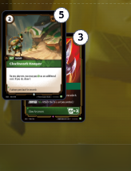
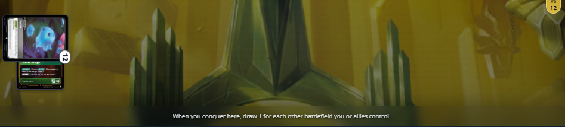
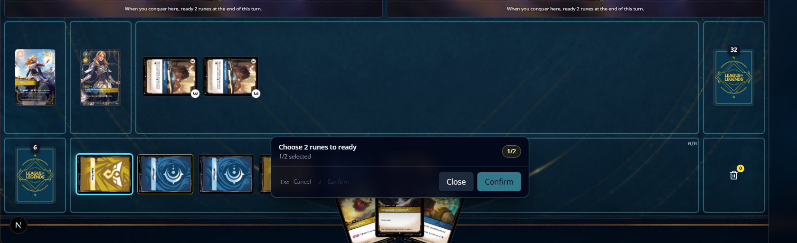
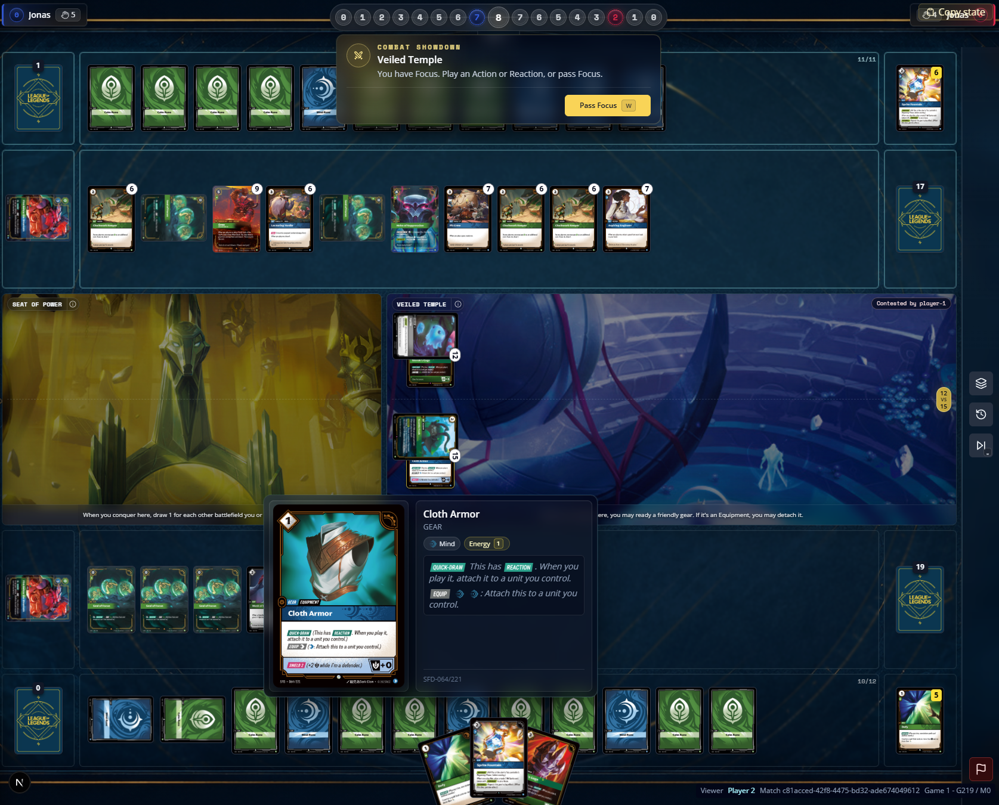
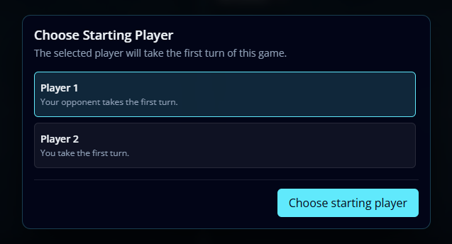
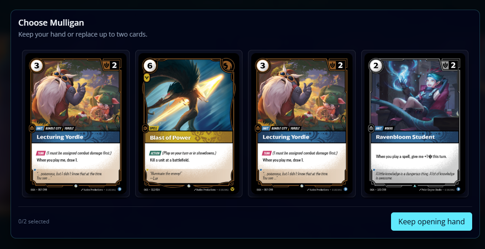

[x] the temporary zone should be an element that player can move its position around, sometimes the chain could be placed in top of something crucial and players would want to move it away from that position, every time the temp zone is closed and open again, it reset its position
[x] kbd should be more distingushiable in choose units prompt. the same is true for showdown prompts. 
[ ] Choices prompt in top of runes, can get in the way of players choices, make it movable as tempzone. 
[ ] Hovering cards are not showing the previews.
[ ] BF's zone should have a hightlight state, that way moving unit can highlight BF's

[x] Choose Order for trigger abilities, transform glass like and fix card orientation when showing BF's. 
[x] Choose Starting Player glass like. 
[x] choose mulligan make it glass like and remove layout shift. ](image-38.png)
