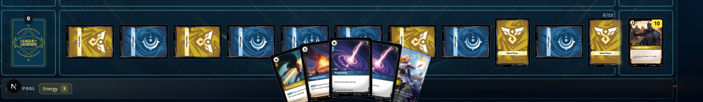
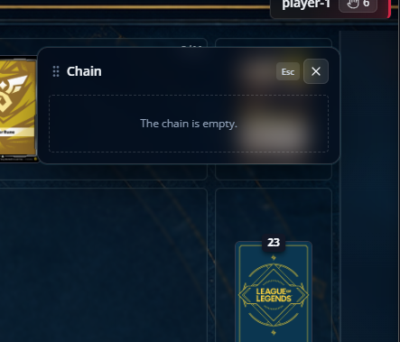
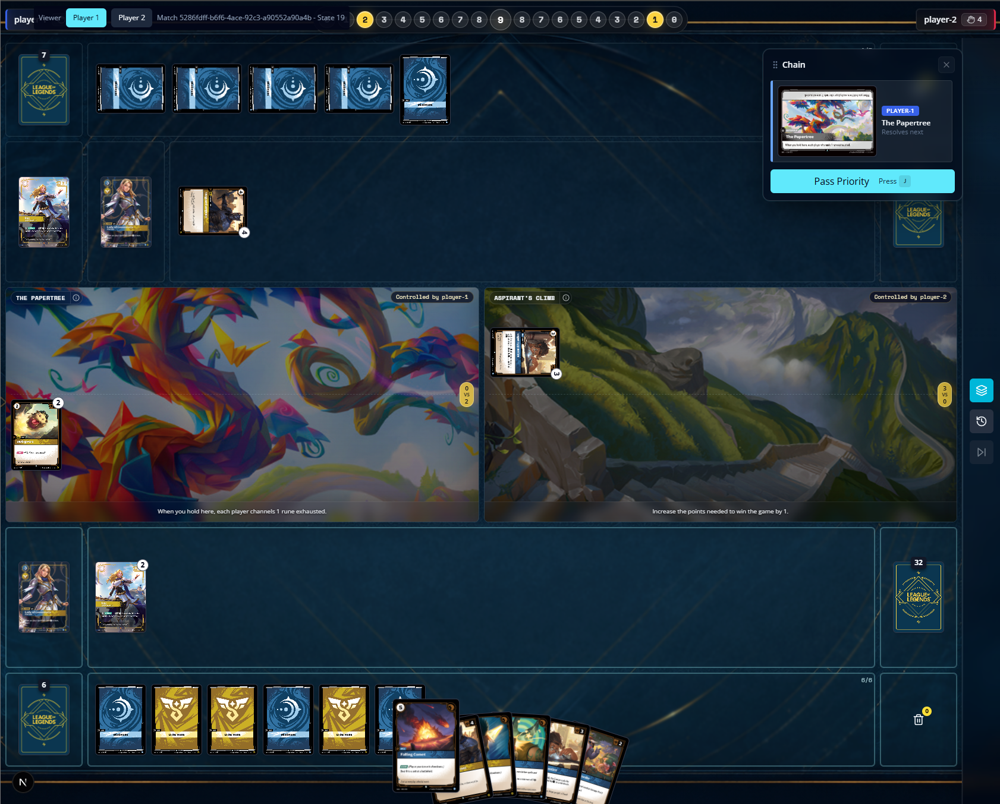

# Post-rebase Runtime Fixes

Baseline: `ca93632`

## Milestones

- [x] 0. Record the defects, screenshots, and execution order.
- [x] 1. Make printed spell cost drive "costs N or more" play triggers while
  payment continues to use the discounted cost.
- [x] 2. Keep the rune zone usable with more than seven runes.
- [ ] 3. Close the chain overlay when its final item resolves.
- [ ] 4. Pause start-of-turn progression for Hold triggers before Channel.
- [ ] 5. Run the complete regression gate and record the delivered commits.

Each implementation milestone receives one normal commit after its focused
tests and the project typecheck pass. The final milestone runs the full test,
typecheck, lint, and production-build gate. Resume by inspecting this document,
`git status --short`, and `git log --oneline -10`.

## Defects

- [x] Cost-discounted spells should still trigger Lux. Eager Apprentice reduces
  the Energy paid for a spell by 1 while at a battlefield. Playing a spell with
  printed cost 5, such as Falling Comet, costs the player 4 but must still
  satisfy Lux's "costs 5 or more" trigger.
- [x] Exhausting more than seven runes breaks the rune-zone spacing.
  
- [ ] When the last item leaves the chain, the chain overlay should close.
  
- [ ] The Papertree trigger is sequenced incorrectly. Hold happens during step
  B of the ABCD start-of-turn sequence, so its trigger must resolve before step
  C, Channel.
  

## Verification record

- Runtime reset required: no.
- Current milestone: 3.
