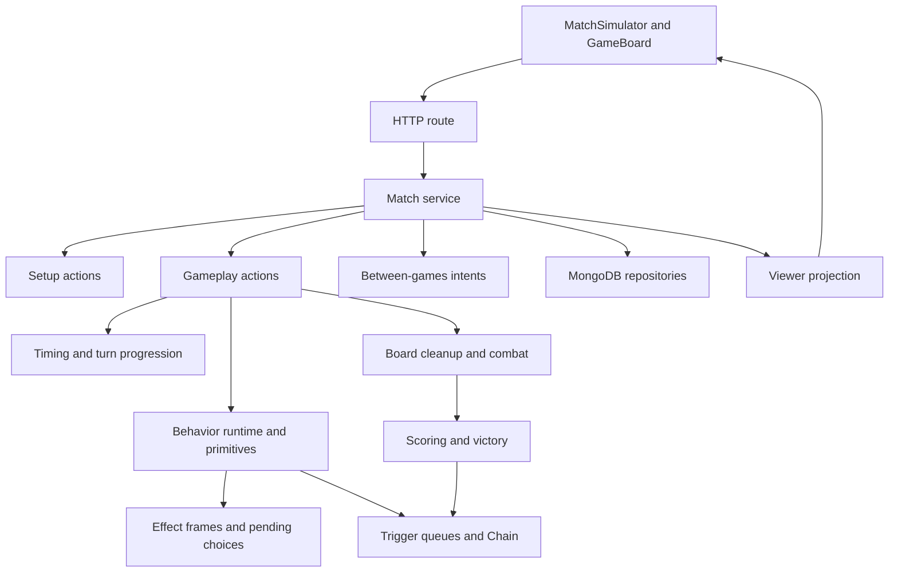
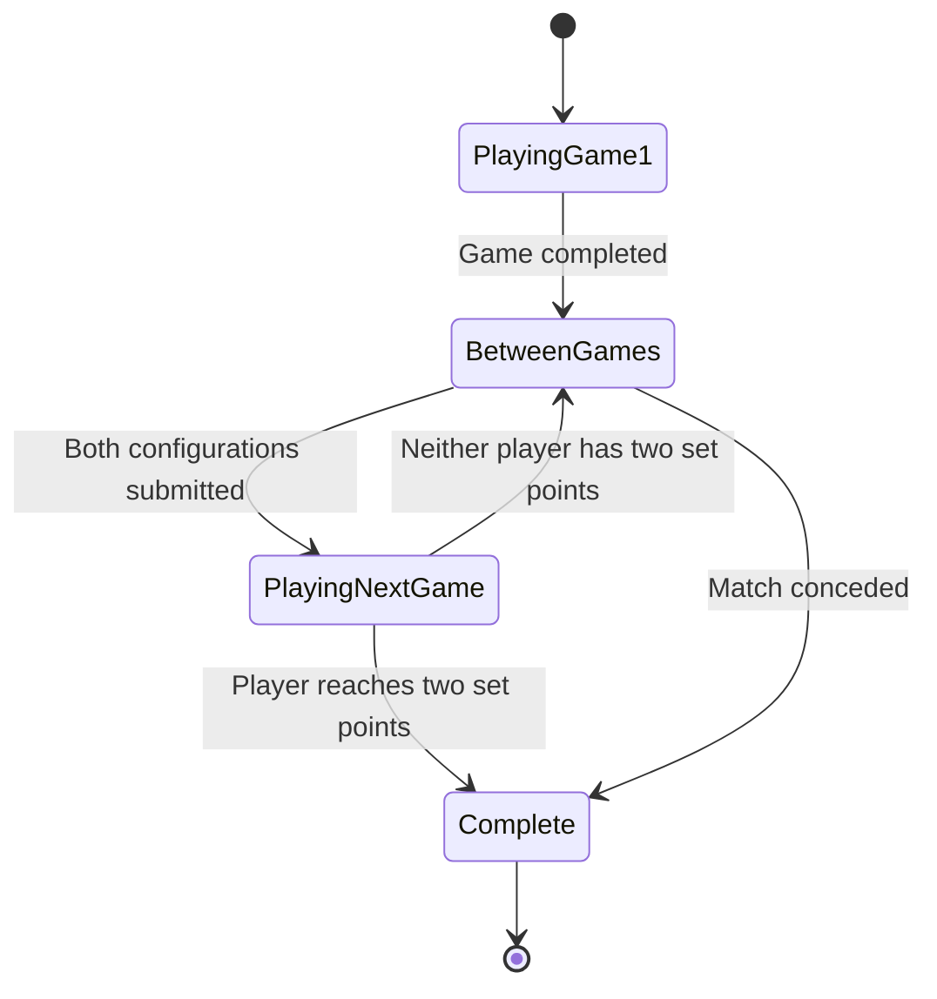

# Hextech Simulator: project context and planning handoff

Snapshot: 2026-09-05. Repository: `hextech-simulator`. Inspected HEAD: `848fdde`.

This is a standalone briefing for a planning chat that cannot inspect the repository. It explains the implemented product, game engine, subsystem ownership, development workflow, and constraints a useful task plan must respect. Paths are navigation hints for the eventual implementer; the explanations do not depend on opening them.

The snapshot describes the working tree, including a pre-existing uncommitted change in `src/server/game/match-service.ts`. It is not a certification of a deployed environment or database contents. No gameplay tests, database operations, or manual matches were run to produce this document. Implementation observations come from source inspection; historical acceptance and validation records are identified separately.

The older `docs/project-handoff.md` contains useful background but has obsolete statements about single-game matches and deck availability. Use this document for the current planning baseline. Older issue reports and milestone plans are evidence of past intent, not automatic proof that a defect remains open.

## Contents

1. [Product and current scope](#1-product-and-current-scope)
2. [Architecture and subsystem ownership](#2-architecture-and-subsystem-ownership)
3. [State, identity, and persistence](#3-state-identity-and-persistence)
4. [One action from browser to authoritative result](#4-one-action-from-browser-to-authoritative-result)
5. [Game engine lifecycle](#5-game-engine-lifecycle)
6. [Behavior primitives and resumable effects](#6-behavior-primitives-and-resumable-effects)
7. [Best-of-three and sideboarding](#7-best-of-three-and-sideboarding)
8. [Client orchestration and player decisions](#8-client-orchestration-and-player-decisions)
9. [Online rooms and synchronization](#9-online-rooms-and-synchronization)
10. [Card ingestion and deck publication](#10-card-ingestion-and-deck-publication)
11. [Development and validation workflow](#11-development-and-validation-workflow)
12. [Known limitations and planning risks](#12-known-limitations-and-planning-risks)
13. [How to plan future tasks](#13-how-to-plan-future-tasks)
14. [Source map and glossary](#14-source-map-and-glossary)
15. [Prompt for the next planning chat](#15-prompt-for-the-next-planning-chat)

## 1. Product and current scope

Hextech Simulator is a two-player, server-authoritative simulator for the Riftbound trading card game. It combines an automated rules engine, an interactive board, local play, online room matchmaking, a best-of-three match lifecycle, sideboarding, and an administrative card-modeling workflow.

The product automates legal actions, resource payment, card effects, response windows, combat, scoring, and state transitions. Players make choices the rules leave to them: cards to play, targets, movement groups, trigger order, damage allocation, token destinations, and deck reconfiguration between games.

There are three connected but distinct kinds of work:

- **Playing:** create or join a match, complete setup, play games, sideboard, and finish the match.
- **Expanding the rules corpus:** turn card source data into approved models that the engine can execute.
- **Improving the application:** refine board interaction, decisions, synchronization, persistence, and operational behavior.

### Current product surfaces

| Surface | Purpose |
| --- | --- |
| `/` and `/online` | Online room creation/joining and deck selection. |
| `/local` | Local simulator with both seats available and viewer switching. |
| `/matches/[matchId]` | Online match loaded using the current tab's player credentials. |
| `/admin/card-catalog` | Import card-set JSON, inspect suggestions, edit models, and approve canonical cards. |
| `/sideboarding-playground` | Isolated sideboarding UI development surface. |
| `/game-action-button-qa` | Action-button presentation development surface. |

Core deck IDs are `lux`, `annie`, `master-yi`, and `garen`. Sideboard validation variants are `lux-s`, `annie-s`, `master-yi-s`, and `garen-s`. The API exposes only decks whose persisted definitions and canonical card dependencies successfully load. A supported ID does not prove the current database contains a playable deck.

There are also Draven and Irelia deck text files, but those names are not in the selectable deck ID contract. Do not equate a deck file with an integrated playable deck.

The repository contains source set JSON for `OGS`, `OGN`, `SFD`, and `UNL`. Source data availability is broader than executable card support. Full-corpus implementation is an ongoing program, not an already completed capability.

## 2. Architecture and subsystem ownership

This is one fullstack Next.js application. It is not split into independent frontend and backend projects.

```text
server.ts                         Custom HTTP server: Next.js + Socket.IO
src/
  app/                            Routes, layouts, thin HTTP adapters
  features/                       Product UI and client workflows
  server/                         Backend domain logic and persistence
  shared/                         Transport contracts and generic UI/utilities
data/
  sets/                           Source card-set JSON
  decks/                          Deck text inputs and validation decks
  catalog/                        Generated MVP catalog
scripts/                          Build/sync/repair/reset utilities
tests/                            Node test-runner suites
docs/                             Rules, architecture, plans, audits, tracking
skills/                           Repository-specific working guidance
```

The architecture guide recommends services, repositories, and policies as backend responsibilities. The established game implementation groups most of these concerns under `src/server/game`, with its own service and repository modules. New work should respect these existing domain boundaries. A request for a card or UI change is not a reason to reorganize the entire server tree.

### Technical stack

The manifest declares Next.js 15, React 19, TypeScript 5.7, Tailwind CSS 4, the native MongoDB driver, Zod, Socket.IO, Motion, `@dnd-kit/core`, Radix primitives, Lucide icons, and `tsx`. Versions in `package.json` are dependency ranges; the lockfile determines installed versions.

TypeScript uses strict mode and aliases `@/*` to `src/*` and `@data/*` to `data/*`. React hooks and feature-local state manage the browser UI. Tests use Node's built-in test runner through `tsx`.

### Responsibility map

| Subsystem | Owner | Main responsibility |
| --- | --- | --- |
| HTTP transport | `src/app/api` | Parse/validate requests, call a service, format responses. |
| Match lifecycle | `server/game/match-service.ts` | Authenticate seats, load context, dispatch intents, persist transitions, advance BO3. |
| Match construction | `server/game/game-factory.ts` | Build fresh games from registered copies and accepted configurations. |
| Legal actions and dispatch | `server/game/actions.ts`, `setup.ts` | Enumerate available actions and execute accepted player choices. |
| Timing | `server/game/timing.ts`, parts of `actions.ts` | Focus, Priority, response windows, consecutive passes, Chain progression. |
| Turn progression | `server/game/turns.ts`, parts of `actions.ts` | Start/end checkpoints, resource resets, Hold, Channel, Draw, delayed effects. |
| Card interpretation | `server/game/behavior-runtime.ts` | Compile structured card models; evaluate triggers, conditions, selectors, effects. |
| Primitive execution | `server/game/primitive-handlers.ts` | Implement reusable card operations and build runtime lookup indexes. |
| Suspended decisions | `server/game/effect-resolution.ts` | Store and resume effect frames and player choices. |
| Trigger orchestration | `server/game/triggers.ts` | Gather triggered abilities, choose targets/order, queue Chain items and delayed work. |
| Resources | `server/game/payment.ts` | Plan and apply legal payment, including Energy, Power, discounts, and Deflect. |
| Board/combat | `server/game/board-rules.ts`, `combat.ts` | Cleanup, contest/control, combat participants, allocation, and resolution. |
| Numeric rules | `server/game/numeric-condition.ts`, `numeric-modifiers.ts` | Evaluate numeric conditions and derived values across cards and game rules. |
| Scoring/victory | `server/game/scoring.ts`, `victory.ts` | Conquer/Hold points, final-point handling, effective victory requirement. |
| Projection | `server/game/projection.ts`, `match-projection.ts` | Produce viewer-specific game and match contracts. |
| Board UI | `features/game-board` | View models, board rendering, interaction drafts, overlays, decision prompts. |
| Match UI | `features/match-simulator` | Creation/loading, credentials, polling, submission, setup/results, sideboarding host. |
| Sideboarding UI | `features/sideboarding` | Local deck draft, validation feedback, copy movement, final reconfiguration intent. |
| Matchmaking | `server/online-matchmaking`, `features/online-matchmaking` | Transient rooms, seats, socket events, match creation, tab credentials. |
| Card publication | `server/card-catalog`, `features/card-catalog` | Import/discovery, modeling review, behavior definitions, canonical publication. |
| Playable deck catalog | `server/services/deck-catalog-service.ts`, `server/game/catalog.ts` | Load persisted deck definitions and verify executable canonical dependencies. |
| Deck legality | `server/deck` | Parse text decks and validate registered deck configurations. |

### The orchestration model

There is no independent game loop ticking at a frame rate, ECS scheduler, or background rules worker. Gameplay advances through explicit server calls. Subsystems are TypeScript functions acting on a transition's working game document. Automatic work continues until the engine reaches a stable state, a response window, a required player decision, or game completion.



The diagram shows responsibility relationships, not a fixed execution order for every action. The action branch determines which cleanup, trigger, and continuation checkpoints run.

## 3. State, identity, and persistence

### Four different card identities

Keeping these separate is essential for card, sideboard, and BO3 tasks.

| Identity | Meaning | Lifetime |
| --- | --- | --- |
| Canonical definition / `cardCode` | The card's approved data and behavior model. Multiple copies can share it. | Catalog version/snapshot. |
| `registeredCardId` | One physical copy registered for a player in a match. Two identical cards still have different copy IDs. | Across all games of that match. |
| Runtime `instanceId` | The object participating in one particular game. | Fresh for each game. |
| `objectVersion` | Tracks object changes relevant to locked targeting when a card leaves/re-enters play. | Within a runtime instance's game history. |

Sideboarding submits registered copy IDs. Board actions target runtime IDs. A card name or card code is insufficient to identify which of several copies the user moved.

`game-factory.ts` reconstructs game-specific instances from the accepted configuration. It does not carry damage, exhaustion, targets, or temporary modifiers into the next game. The active Champion must come from the chosen registered copy in the current configuration, rather than being inferred forever from its original deck section.

### Match scope versus game scope

`MatchDocument` stores seats, token hashes, registered deck snapshot references, current configurations, current game ID, game IDs, completed game summaries, between-games submissions, and match completion.

`GameDocument` stores one game's number, version, status, winner, completion reason, and canonical rules state.

These documents have separate `stateVersion` counters. A game action uses the current game's version. A match-level sideboarding/readiness/concession intent uses the match version and the relevant `betweenGamesId`. Never substitute one version counter for the other.

Match status is `playing`, `between_games`, or `complete`. Game status supports `setup_pending`, `ready`, `in_progress`, and `complete`; the main setup path advances to `in_progress` when both mulligans are locked.

### What canonical game state contains

- Setup: two player IDs, starting-player chooser, selected starting player, Battlefield pools/choices, and mulligan locks.
- Players: points, Battlefields already scored this turn, Energy, conditional Energy, Power by domain, and zones.
- Zones: Legend, Champion, Main Deck, Rune Deck, Hand, Trash, Banishment, and Base. Battlefield Units live in the shared Battlefield records.
- Battlefields: selected-by player, current controller, contest marker, and Unit IDs.
- Runtime card state: exhaustion, marked damage, computed Might, object version, combat role, and replacement-related damage bookkeeping.
- Turn: number, active player, phase, and end-step continuation flags.
- Chain: ordered items, relevant players, current Priority holder, and pass sequence.
- Showdown: combat/non-combat kind, Battlefield, relevant players, Focus holder, and pass sequence.
- Combat: participants, assignment stage, Might totals, and both sides' allocations.
- Behavior state: numeric modifiers, ongoing effects, delayed effects, effect-resolution frames, one active pending choice, and queued trigger choices/items/events.
- Created instances/definitions: runtime-created objects such as tokens and their definitions.

This is serializable state. A pending choice is not a promise or callback left running on the server while the browser dialog is open.

### Persistence model

| Collection | Purpose |
| --- | --- |
| `matches` | Match lifecycle and registered configurations. |
| `games` | Authoritative per-game snapshots. |
| `gameEvents` | Accepted-action and selected state-change records, ordered per game. |
| `deckSnapshots` | Card definitions and registered copies captured for a match; utilities also distinguish non-match snapshots. |
| `deckDefinitions` | Permanent selectable deck source text, labels, hashes, and timestamps. |
| `canonicalCards` | Approved card data and structured behavior models. |
| `behaviors` | Persisted primitive definitions and parameter contracts. |

Additional catalog metadata/validation utilities exist. The table covers the principal runtime and ingestion stores, not every historical collection.

Repositories use application IDs as MongoDB `_id` values. Game and match updates have compare-and-set methods that match the expected `stateVersion`. Match creation and between-games operations use MongoDB sessions and transactions. This requires a MongoDB deployment that supports transactions; the example standalone localhost URI alone does not establish that capability.

The service also has process-local caches for match documents, game documents, and deck snapshots. These are significant for freshness and scaling work: persistent data is shared through MongoDB, but cache invalidation is not a distributed system.

The engine persists snapshots plus event records. This is not a demonstrated event-sourced replay engine. The log does not necessarily contain every intermediate primitive mutation or enough information to rebuild a game from events alone.

## 4. One action from browser to authoritative result

The primary contract is **projection -> player intent -> server transition -> new projection**.

1. `MatchSimulator` receives a `MatchProjection`, whose `currentGame` is a `GameProjection`.
2. The game projection includes the actions the viewer may attempt, with action IDs, availability, disabled reasons, legal target IDs, selection limits, and presentation/choice metadata.
3. `GameBoard` renders those actions and gathers any additional choices. It may hold a temporary movement or target-selection draft.
4. The client submits to `POST /api/matches/[matchId]/intents`.
5. The route validates the shared Zod request and calls `performMatchAction`.
6. The service loads the match/game/decks, verifies the supplied token against the seat hash, checks lifecycle/version constraints, and chooses setup, gameplay, or match-level dispatch.
7. For gameplay, the engine regenerates legal actions from current authoritative state. It rejects missing/disabled actions and illegal selections even if the browser previously displayed them.
8. `performGameplayAction` clones the incoming game, runs the action branch and its subsystem calls, then increments the game version. `performGameplayTransition` also produces transition event records.
9. The service persists the accepted state and events. If the game completed, it records the result and advances the match lifecycle.
10. The server projects the result for that viewer. The browser updates from this projection; online opponents learn about changes through polling.

Representative request shape; the action ID and version must come from the live projection:

```json
{
  "playerToken": "<seat token>",
  "stateVersion": 17,
  "intent": {
    "type": "game.performAction",
    "payload": {
      "actionId": "<server-projected action ID>",
      "selectedIds": ["<legal runtime target ID>"],
      "allocations": [],
      "tokenPlacements": []
    }
  }
}
```

Combat allocation uses `{ targetUnitId, amount }`; token allocation uses `{ destinationId, count }`. These are distinct payloads and should remain explicit.

Action IDs encode contextual information, including state version and action parameters. Treat them as server-issued handles in UI work. Some existing interaction helpers decode action kinds, but new UI features should reuse those helpers instead of inventing a second action protocol.

### Stale and duplicate submissions

Ordinary stale game actions fail with `state.gameVersionStale`, and the client refreshes its projection. The setup path has a specific exception: recognized setup action IDs can be rebased against a newer setup version and retried after rechecking legality. This accommodates independent setup submissions; it is not general permission to replay arbitrary stale gameplay actions.

`ActionSubmissionGuard` prevents overlapping browser submissions and keeps an old request's completion from clearing a newer request's busy state. Projection updates also account for current game identity, versions, and in-flight actions. Changes to polling or busy states must preserve these protections.

### Viewer projection is a data boundary

The viewer sees their Hand cards, public zones, public board state, and relevant choices. The opponent's Hand and both hidden decks expose counts rather than their card arrays. Battlefield selections remain private until the reveal condition. Vision reveals the required card only to the choosing viewer. Opponent-owned choices expose waiting information without their private option list.

`match-projection.ts` wraps this with match score, current game, result summaries, capabilities, and the viewer's sideboarding session. The opponent's submitted deck configuration should not become a public field merely to simplify a UI.

Hiding a component is not privacy enforcement. Any new projected field, log message, selection option, or API must be considered at this server boundary.

## 5. Game engine lifecycle

The following explains implemented behavior. It does not independently certify every rule against the full local rulebook.

### 5.1 Setup

Match creation loads executable deck snapshots and registers each player's physical copies. The first game's starting-player chooser is derived from a seed/hash. The game then runs these steps:

1. Each player locks a Battlefield from their available pool.
2. The choices are revealed after both are locked.
3. The designated chooser selects who starts.
4. Board and Hand initialization places the Legend and chosen Champion and deterministically orders decks using hashes derived from game/player identity.
5. Each player gets an opening Hand of four cards and may mulligan up to two.
6. Once both mulligans are locked, the engine starts the first turn.

The setup actions are projected only for the player eligible to make the corresponding choice. Later BO3 games change the chooser and available Battlefields, but reuse the setup machinery.

### 5.2 Start and end of turn

The stored turn phases are `awaken`, `beginning`, `channel`, `draw`, `action`, and `end`.

| Phase | Implemented responsibility |
| --- | --- |
| Awaken | Clear resource pools, reset the active player's scoring bookkeeping, ready their relevant cards. |
| Beginning | Apply Hold scoring and dispatch the associated triggers. |
| Channel | Move runes from Rune Deck to Base: normally two, with three on the non-starting player's first turn. |
| Draw | Draw one Main Deck card, then enter the action phase. |
| Action | Accept legal play, activation, movement, and end-turn choices, subject to timing/decisions. |
| End | Queue/resolve end triggers and delayed effects, perform cleanup, then start the other player's turn. |

Automatic start-of-turn processing pauses when a Chain or required choice exists. The phase checkpoint advances before Hold triggers are dispatched, so resumption continues at Channel without scoring Hold twice. A fix in `docs/post-rebase-runtime.md` explicitly protects this ordering.

End-of-turn processing likewise uses flags and continuation functions so queued effects are not repeated and the next turn does not start while required work remains.

### 5.3 Focus, Priority, Chain, and Showdown

These terms must not be merged into a generic "whose turn is it?" variable.

- **Active player:** owns the turn.
- **Focus:** identifies who can act in an open Showdown.
- **Priority:** identifies who may respond while a Chain is open.
- **Chain:** pending spells, permanents, activated abilities, or triggers, with the last item resolved first.
- **Showdown:** a response sequence associated with a contested Battlefield; it may be combat or non-combat.

`timing.ts` derives four contexts:

| Context | State | Main restriction |
| --- | --- | --- |
| `neutralOpen` | No Showdown and no Chain | Normal active-player action opportunities. |
| `neutralClosed` | Chain outside a Showdown | Priority holder uses eligible Reaction timing. |
| `showdownOpen` | Showdown without a Chain | Focus holder uses eligible Action/Reaction timing. |
| `showdownClosed` | Showdown with a Chain | Priority holder uses eligible Reaction timing. |

**Current deliberate rules override:** `ALLOW_ADD_ABILITIES_WHEN_PLAYER_HAS_PRIORITY` is `true` in `actions.ts`. It allows resource Add abilities through timing windows where the normal Action/Reaction qualification would otherwise be required. The code labels this non-standard. A future planner should preserve it unless changing that behavior is part of the request.

Passing Priority records a consecutive pass and hands Priority to the next relevant player. When everyone has passed, the top Chain item resolves. If more items remain, Priority/pass bookkeeping is reset for the next item. An empty Chain can return control to the Showdown's Focus sequence.

When everyone passes in an open Showdown, a non-combat Showdown resolves control/scoring, while a combat Showdown moves to combat damage. Playing or activating something can reset the pass sequence. One universal "pass means end turn" rule would break this model.

### 5.4 Playing cards and paying costs

Legal card actions combine timing, card type, destination eligibility, payable cost, and target availability. Current ordinary play-action enumeration handles Units and Spells. The catalog/validator can represent additional types such as Gear; this does not mean their complete play/equip runtime exists.

`payment.ts` builds a payment plan before payment is applied. It distinguishes pooled Energy, spell-only conditional Energy, available resource abilities, domain Power, and rune recycling. Effective cost can differ from printed cost because of numeric modifiers. Targeting may require additional Power for Deflect.

Printed cost and paid cost are intentionally separate. For example, a discounted spell with printed Energy cost five still needs to satisfy a trigger that checks printed cost five. Trigger event values carry printed and effective cost context; payment should not overwrite the printed value.

Selected targets are validated when the action is submitted. Chain items capture target object versions, and resolution filters against current legality and object identity. A Unit that left play and returned must not automatically count as the same locked target simply because a runtime ID can still be found.

Resource Add abilities resolve immediately through their handlers. Other activated abilities can become Chain items. Units and Spells use their corresponding play paths, destination handling, behavior clauses, and post-play trigger dispatch.

### 5.5 Movement, control, and cleanup

Movement uses projected single-Unit `move` actions or simultaneous `moveMany` actions. Server rules decide legal destinations and which ready Units can participate. Battlefield-to-Battlefield eligibility includes supported keyword behavior such as Ganking.

Entering a Battlefield can mark it contested and lead to a non-combat Showdown or combat depending on the occupants. Movement effects and ordinary moves must ultimately cooperate with the same cleanup/control rules.

`cleanupBoard` recomputes Might, handles lethal damage, and reconciles Battlefield metadata. Primitive helpers handle leaving board zones, clearing relevant card state, replacements, and token disappearance. Cleaning up only the rendered board cannot repair canonical contest/control state.

### 5.6 Combat

Combat is an orchestrated sequence:

```text
Opposing Units contest a Battlefield
  -> establish attacker/defender participants and combat roles
  -> collect attack/defend triggers and conduct the combat Showdown
  -> finish the response window
  -> compute surviving participants and combat Might
  -> obtain attacker and defender damage allocations when required
  -> apply the combat result, cleanup, control, scoring, and damage clearing
```

Assault and Shield affect combat Might in their applicable roles. Damage assignment uses each side's available total and legal targets. Tank requires lethal allocation before non-Tank targets; allocation ordering also enforces lethal damage before proceeding to another Unit. Some trivial assignments are handled automatically; genuine choices become `assignCombatDamage` pending choices.

Both sides' allocations are stored before final combat resolution. Do not implement combat as repeated UI-driven single-target damage clicks that kill Units between the two players' assignments.

### 5.7 Scoring and victory

The base victory requirement is eight points, with a numeric-modifier path for card effects that change it. Hold and Conquer are distinct scoring events. Per-player Battlefield bookkeeping prevents repeatedly scoring the same Battlefield in the relevant turn window.

The final-point Conquer rule has special handling: when the next point would win but the required all-Battlefields condition is not met, the implementation draws a card instead. It still records the scoring opportunity and dispatches the associated event.

Game victory updates the game winner/status. The match service then records the completed game and awards a set point. Game concession and match concession are separate operations with separate lifecycle consequences.

## 6. Behavior primitives and resumable effects

### 6.1 Why cards are data models

The long-term extension strategy is reusable primitives. The engine should not accumulate a switch statement for Lux, Annie, Garen, and every future card name.

An approved `GameCardDefinition` contains source card data, `cardCode`, a rules-text hash, and a `BehaviorModel`. That model has top-level play timings and ordered clauses. Each clause preserves its source/normalized text and has groups for:

```text
abilities, triggers, conditions, selectors, choices,
costs, timings, effects, keywords
```

A binding names a `behaviorId`, primitive parameters, confidence, and order. Confidence is modeling metadata; it is not permission to skip runtime validation.

For example, a conceptual "when played, deal damage to an enemy Unit" model combines an on-play trigger, an enemy-Unit selector, and a damage effect. A more complex card can add a numeric condition or a delayed timing binding. This is a conceptual illustration, not a complete importable JSON card model.

### 6.2 Compilation and execution

`compileBehaviorModel` checks clause IDs, sequence/order consistency, and handler availability, then sorts effect bindings. The handler registry supports operations such as:

- `validate`: check primitive parameters.
- `matches`: evaluate a trigger or condition.
- `targets`: derive a selection requirement from canonical state.
- `choice`: request an effect-specific decision.
- `execute`: mutate the transition's working state.

The execution context includes the game, source card, controller, triggering event, selected IDs, selections grouped by selector, and effect outcomes. Numeric condition/modifier helpers keep shared comparisons and derived values consistent across primitives.

Selector requirements distinguish explicit choices from automatic affected groups. An effect that affects all qualifying Units should not charge per-target targeting costs or prompt the player as though they individually targeted every Unit. Existing code uses a zero-selection requirement to represent certain automatic groups.

### 6.3 Supported primitive families

`runtime-coverage.ts` records the executable primitive baseline. It includes:

- Resource activation/recycling and Action/Reaction/delayed timing.
- On-play, move, attack, defend, end-turn, Conquer, and Hold triggers.
- Numeric comparison, effect-killed-target, and Unit-presence conditions.
- Unit, friendly/enemy Unit, card-zone, and Battlefield selectors.
- Draw, Vision, discard, ready, Channel, damage, fight, kill, return-to-Hand, movement, and token creation effects.
- Optional-cost draw, Channel-or-draw, numeric modifiers, play-destination changes, and enter-ready behavior.
- Assault, Shield, Tank, Deflect, Ganking, Vision, optional exhaust costs, and recall-on-next-death replacement behavior.

An `executable` marker means the runtime claims support for that primitive. It does not prove every parameter combination, source-text pattern, or newly imported card is correct. Primitive catalog metadata, persisted behavior definitions, approved card bindings, runtime handlers, and gameplay validation all need to agree.

### 6.4 Trigger queues are rules work

Game events such as a card being played, a Unit moving, or a Battlefield being held are dispatched to active sources. The engine compiles their behavior models, finds matching clauses, groups resulting items by controller, and queues them for targets/order and Chain insertion.

Multiple triggered abilities can require the controlling player to choose order. Target selection may also be required before queued items can proceed. The state contains queued trigger choices and Chain items because only one required choice is active at a time.

Delayed effects are stored with a timing point, source, controller, clause, and selected IDs. Reaching their timing point queues work through the same general resolution system. A delayed effect is not a `setTimeout` and should not depend on real elapsed time.

Internal `BehaviorEvent` objects drive rules. Persisted `GameEventDocument` records support logs/transition history. These are related concepts with different jobs; adding a visible log line does not itself trigger card behavior.

### 6.5 Pausing and resuming an effect

`effect-resolution.ts` stores a frame with the source, controller, clause, next effect index, initial selections, selections by binding, and any delayed/end-turn association.

```text
Begin resolution frame
  -> determine needed selectors/effect choices
  -> if input is required, persist pendingChoice and return
  -> project a decision for the owning player
  -> receive and validate submitChoice
  -> save the answer in the frame
  -> resume at the stored effect index
  -> remove the finished frame
  -> continue queued triggers, Showdowns, or turn progression as applicable
```

Canonical pending-choice variants are `orderTriggers`, `assignCombatDamage`, `effectSelection`, and `tokenPlacement`.

For Vision, the viewer privately inspects the relevant top card. Selecting it chooses the recycle action; an empty selection means keep it on top. Empty selection is therefore a meaningful successful answer, not automatically cancellation.

For multi-token placement, the player distributes a required quantity over server-projected destinations. The server validates the total and destinations, then creates individual token instances. Tokens need definitions, ownership, readiness, modifiers, placement, and board-leave handling; an icon or counter is insufficient.

Future multi-step effects must explicitly identify what context survives a pause. Do not assume all transient execution-context fields are serialized merely because the frame stores selections and an effect index.

## 7. Best-of-three and sideboarding

### 7.1 Match progression



A match supports at most three games. Match score is derived from completed-game summaries. Completing a game records its winner, loser, starting-player choices, used Battlefield registered IDs, completion reason, and time. Two set points complete the match; otherwise a unique between-games session is created.

The previous game's loser chooses the next starting player. Used Battlefields are excluded from future choices. Game two uses player choice among remaining Battlefields; game three automatically uses the final remaining Battlefield.

The same registered copy pool persists throughout the match, while every game gets fresh runtime objects. This is why a BO3 change touches both match identity and game construction, even when the board appearance is unchanged.

### 7.2 Enabled between-games mode

`BO3_MATCH_FEATURES` currently enables `sideboardingDeckReconfiguration` and disables `readyWithCurrentDeckConfiguration`. Exactly one mode must be enabled.

The contract still contains `match.readyForNextGame`, but the normal current UI uses `match.submitDeckReconfiguration`. Capabilities projected by the server determine which action the viewer may use. There is also `match.concedeMatch`, currently tied to the between-games session. During active gameplay, the exposed concession is game concession.

### 7.3 Sideboarding ownership

The sideboarding feature receives `SideboardingSessionInput` from its host. It owns a local draft of the chosen Champion, Main Deck, and Sideboard. It does not own BO3 advancement or directly mutate the current game.

Its main flow is:

```text
Server projects registered pool and accepted current configuration
  -> local draft reducer moves individual registered copies
  -> build full deck-validation request
  -> debounced POST /api/decks/validate
  -> display validation result for the exact current draft
  -> submit match.submitDeckReconfiguration
  -> server authenticates and validates again
  -> store the player's submission
  -> once both submissions exist, build the next game
```

Validation is debounced by 180 ms, supports aborting obsolete requests, and uses request/response fingerprints. The UI may submit only when the latest draft is validated as legal. A previous green result does not validate a newly edited draft.

### 7.4 Registered deck legality

The current validation service enforces a 40-card active configuration consisting of 39 Main Deck copies plus one chosen Champion, 12 Runes, three Battlefields, and a Sideboard capacity of eight. It also checks:

- Every submitted ID belongs to the registered deck.
- A copy is not assigned to two sections.
- Fixed Legend/Rune/Battlefield sections are preserved.
- Mutable copies form the required partition across Champion/Main Deck/Sideboard.
- Card type placement, Champion compatibility, domain identity, signature rules, and copy limits.

The submitted configuration contains IDs, not client-authored card stats. Validation uses the server's registered snapshot definitions. Match submission must rerun validation even when the advisory validation endpoint previously returned legal.

Changing the chosen Champion must move actual registered copies consistently. Game two/three construction must consume this accepted configuration, not reuse the original Champion choice or a cached earlier deck layout.

## 8. Client orchestration and player decisions

### 8.1 MatchSimulator is the host

`features/match-simulator/components/match-simulator.tsx` owns the loaded match and viewer, API orchestration, submission status/errors, setup prompts, result acknowledgement, sideboarding, and online polling.

Local mode receives both seats and allows viewpoint switching. Online mode operates with only that player's credentials. Shared board rendering does not imply identical credential or refresh behavior in the two modes.

### 8.2 GameBoard is a composition point

`game-board.tsx` combines feature modules rather than independently implementing every interaction:

| Module area | Responsibility |
| --- | --- |
| `board-view-model.ts` | Adapt transport projection into board-oriented data. |
| `board-model.ts` | Build player, Battlefield, zone, and card models. |
| `board-animation-model.ts` | Derive transfer placements/counts for visual transitions. |
| `interactions/*` | Action menu, Chain overlay, target selection, inspection, movement drafts, action orchestration. |
| `decisions/*` | Convert projected choices into requests, render prompts, return intents. |
| `drag-and-drop/*` | Register drag sources/drop locations and resolve legal projected move/play actions. |
| `components/*` | Render boards, cards, resource pools, zones, prompts, and overlays. |

The browser can own an unfinished selection, open panel, hovered location, or animation. It must not independently decide that damage happened, payment succeeded, control changed, or a card moved in canonical state.

### 8.3 Player Decision System

`use-player-decision-request.ts` maps the projection and active interaction into `PlayerDecisionRequest`. `PlayerDecisionHost` chooses the rendering component. The result is a `PlayerDecisionIntent` that enters the existing action submission path.

Request variants are `cardSelection`, `optionDecision`, `orderedDecision`, `combatDamage`, `tokenPlacement`, and `pendingDecision`.

This system covers visible-zone card selection, Vision, trigger ordering, damage assignment, token placement, and opponent waiting feedback. Combat remains specialized because an allocation is not a simple list of selected cards.

The consolidation is not absolute: setup uses shared card-selection prompts from the match host, specialized board targeting has dedicated prompts, and some destination choices still use choice dialogs. The option-decision renderer/type exists, but the current mapper does not produce that request variant. A future plan should distinguish extending the shared system from migrating these remaining cases.

Decision inspection lets users inspect permitted board/zone information while a decision is pending. Inspection is read-only and policy-controlled; it must not expose the opponent's hidden choices or clear the unresolved decision.

### 8.4 Drag and drop

Location drag/drop wraps existing projected actions:

```text
LocationDragProvider
  -> DraggableLocationCard source
  -> semantic destination resolution
  -> location-drag-actions helpers
  -> use-game-board-actions
  -> existing submitProjectedAction path
```

`CardTile` remains visual. `DraggableLocationCard` owns source registration. Droppable surfaces map to semantic game locations; the Base's separate visual surfaces can share the same semantic destination.

- Dragging an eligible Unit to Base can submit a projected single move.
- Dragging to a Battlefield can start a simultaneous movement draft with the dragged Unit preselected; additional Units are selected by click, then confirmed.
- Dragging the Champion-zone card uses an existing legal play action and any necessary target selection.
- An invalid drop submits nothing.

During a movement draft, cards remain in their current authoritative locations with staged visual feedback. The server moves them only after acceptance. Future spatial UI should reuse the same legality and submission path.

### 8.5 Presentation

`features/card-presentation` owns domain icons, resource notation, keyword assets, and card-text normalization/parsing. Changes to how a keyword is displayed do not establish its runtime support. Standard application controls use shared shadcn-style/Radix components; custom cards, fans, board spaces, and game animations live in their domain features.

## 9. Online rooms and synchronization

`server.ts` prepares Next.js and attaches Socket.IO to the same HTTP server. `npm run dev` starts this integrated server; `npm run next:dev` starts Next.js alone and does not wire the room socket handlers.

Online rooms are held in an in-memory `OnlineRoomRegistry`. The room service handles room codes, seat/session rules, joins/leaves, and disconnect behavior. Joining the second seat causes the server to create a persisted match through the existing match service.

Socket event names include `client:room:create`, `client:room:join`, `client:room:leave`, and server room/state/error/game-created notifications. Each player's game-created event receives only that seat's credentials.

The client saves match credentials in `sessionStorage`, then opens the match page. The display name is stored separately in `localStorage`.

**Gameplay synchronization is HTTP polling, not Socket.IO state broadcast.** Online `MatchSimulator` polls the viewer endpoint, scheduling the next request 1,500 ms after the previous one completes. Accepted local submissions update immediately from their returned projection. Polling stops when the match is complete.

This separates two systems that a future "realtime" request might mean:

- Room lifecycle and player presence before the match: Socket.IO.
- Authoritative gameplay state while playing/sideboarding: HTTP intents and viewer polling.

Rooms are not durable across process restarts, and in-memory room state is not shared across server instances. Browser refresh can recover a persisted online match if the tab still has its credentials; that is different from recovering a lost room, account-based login, or cross-device resume.

## 10. Card ingestion and deck publication

### 10.1 Five stages of availability

```text
Raw set JSON
  -> imported/discovered card and suggested clauses
  -> approved canonical behavior model
  -> executable runtime compilation
  -> persisted selectable deck and fresh match
```

A card may be present at one stage without reaching the next. Most ingestion planning mistakes come from treating these stages as equivalent.

### 10.2 Admin workflow

The import-preview service validates uploaded set JSON, normalizes card identity, analyzes rules text, suggests primitive assignments, and compares against existing canonical records. It distinguishes new cards, already persisted cards, and cards whose rules text changed.

The reviewer edits clauses and assignments in the catalog UI, resolves unsupported behavior, and approves the card. Publication validates schema, identity, rules-text hash, primitive assignments, parameters, and unresolved gaps, then writes the canonical document.

`primitive-catalog.ts` defines the available modeling vocabulary; `primitive-discovery.ts` and `behavior-suggestions.ts` analyze source text. Runtime handlers execute approved bindings. Suggestion recognition and runtime support are separate extension points.

### 10.3 Hashing and snapshot checks

`sourceTextHash` comes from normalized card rules text. It is a behavior-change gate, not a general metadata-diff system. Runtime deck loading rejects unapproved, malformed, stale, unsupported, or uncompileable canonical dependencies. It builds a catalog digest from the included definitions.

The current loader also has a minimum of 21 unique card definitions per deck. This is an implementation constraint inherited from the deck baseline, not a generic statement of game rules; account for it if adding unusual deck fixtures or formats.

Per-match deck snapshots capture definitions so an existing match does not silently switch card data after catalog publication. New tests of updated card models should start with fresh matches. Snapshots do not freeze the TypeScript engine implementation itself.

### 10.4 Permanent deck integration

Gameplay loads `deckDefinitions` from MongoDB; it does not read arbitrary text files on every match request. Deck sync validates the source against canonical cards before persisting it. The deck options API tries to build each supported deck, omits unavailable entries, and fails if none are playable.

Adding a selectable deck can require changes to the shared deck ID contract, server deck metadata/seeding, source files, synchronization, canonical dependency coverage, and gameplay validation. Merely adding `data/decks/example.dec.txt` is insufficient.

Generated MVP assets are `data/catalog/mvp.json` and `src/server/catalog/fixed-mvp-cards.generated.ts`. Use the generator/check command when changing their inputs; generated output is not the runtime MongoDB publication step.

### 10.5 Full-corpus program and its acceptance workflow

The latest full-corpus plan treats Lux, Annie, Master Yi, Garen, BO3, sideboarding, and permanent decks as existing foundations. The remaining set order is Origins (`OGN`), Spiritforged (`SFD`), Unleashed (`UNL`), then Vendetta (`VEN`).

Its workflow is:

1. Verify final set data and two user-provided validation decks.
2. Analyze all gameplay-distinct cards, primitive gaps, and token dependencies; propose implementation scope.
3. Intake the full set, including required cross-set token definitions and print-identity handling.
4. Implement/extend reusable primitives and approve complete card models.
5. Run a full-corpus completeness check; two successful validation decks are not proof the entire set is covered.
6. Integrate the two decks as permanent selectable decks.
7. Establish technical readiness and a brief runtime-size/latency sanity check.
8. Validate fresh full matches, including BO3/sideboarding where relevant.
9. Correct confirmed defects with focused checks and appropriate manual regression scope.
10. Await explicit user acceptance, update ledgers, and commit that accepted set before opening the next one.

Plan-specific constraints include:

- Use the local core rules reference and supplied card text. Request a local ruling when they are insufficient.
- Implement generic primitives rather than gameplay branches keyed by card name or set.
- Collapse equivalent print treatments into one gameplay definition while retaining needed presentation data.
- Inventory required tokens across the cumulative corpus; ask for missing token data instead of inventing it.
- Preserve rules-text-focused change detection unless the user requests a broader system.
- Within this ingestion program, changes that alter already accepted primitive behavior require a concrete impact/regression proposal and user approval before dependent implementation.
- Manual gameplay and explicit user acceptance are the completion gate; technical checks alone mean `Awaiting Manual Acceptance`.
- The program does not require compatibility with old persisted matches, and database cleanup belongs to the user.

These are scoped program rules, not a universal instruction to stop every project task for approval. The sideboarding plan, for example, explicitly uses a continuous implementation workflow with milestones as sequencing rather than intermediate approval gates. A future implementer must apply the current user request and relevant plan together.

The older ingestion tracker records Garen M1 as accepted and later full sets as not started. It predates the consolidated plan. At this snapshot, `ven.json` and `docs/full-ingestion-decks/` were absent. Reconcile the tracker, actual supplied inputs, and user acceptance before choosing the next milestone; do not infer that the entire Origins set is implemented because `ogn.json` exists.

## 11. Development and validation workflow

### 11.1 General implementation workflow

Repository history and plans use a practical loop:

```text
Understand request and current state
  -> consult architecture, relevant rules, and applicable plan
  -> reproduce or define expected behavior
  -> identify owning subsystem and affected contracts
  -> implement the smallest coherent change
  -> run focused checks
  -> validate the affected gameplay/UI manually
  -> record outcome, remaining uncertainty, and any scoped acceptance gate
```

Start by reading `AGENTS.md`, `docs/architecture.md`, `git status`, and relevant current plan/progress files. Preserve unrelated user edits. In this snapshot, `match-service.ts` already had such an edit.

For a rules task, identify the rule-backed expected behavior before modifying the engine. The repository's rules guidance designates `docs/riftbound_core_rules_reference.md` as the core rules authority and local set text for card-specific overrides. Existing behavior and historical summaries explain implementation, but do not override the rulebook. Planning should request the relevant local excerpts if the next chat cannot access them.

### 11.2 Code conventions

- Use `src/app`, `src/features`, `src/server`, and `src/shared`.
- Keep routes and pages thin; backend logic belongs in server domain modules/services.
- Keep database access in repositories and authorization in backend boundaries.
- Keep server modules independent of React/Next.js; a boundary test checks imports.
- Use kebab-case files, PascalCase components, camelCase variables/functions, and UPPER_CASE fixed constants.
- Prefer one meaningful exported component per file; extract private components when independently meaningful, reused, large, or client-only.
- Server Components are the default; isolate browser behavior to appropriate Client Components.
- Use absolute imports across root/feature boundaries and existing public feature exports when available.
- Keep feature-specific UI in its feature and generic controls in `shared`.
- Extract by responsibility, not merely to reduce file length. Do not create speculative abstraction layers.
- Preserve server-projected legal actions and the shared player-decision/intent path.

### 11.3 Local setup and commands

Use npm with the checked-in lockfile. The repository's Windows documentation uses `cmd /c npm ...` to avoid PowerShell execution-policy issues. `npm.cmd ...` is another direct Windows invocation.

Typical application startup:

```text
npm ci
# Configure local environment and a transaction-capable MongoDB deployment.
# Initialize behavior/canonical/deck data through the catalog workflow.
npm run dev
```

`.env.example` names `MONGODB_URI`, `MONGODB_DB_NAME`, `SOCKET_CORS_ORIGIN`, `NEXT_PUBLIC_APP_URL`, and `PLAYER_TOKEN_SECRET`. The DB name defaults to `hextech_simulator`; server port defaults to 3000 and can use `PORT`. The token code currently generates random tokens and hashes them directly; the example's reserved secret is not evidence of a signed-token system. Do not include real environment values in planning handoffs.

| Command | Effect |
| --- | --- |
| `npm run dev` | Integrated Next.js development server plus Socket.IO. |
| `npm run next:dev` | Next.js-only development server. |
| `npm run build` | Production Next.js build. |
| `npm start` | Integrated custom production server; requires a build. |
| `npm run typecheck` | TypeScript validation without emitting application JS. |
| `npm run lint` | ESLint checks. |
| `npm test` | Existing `tests/**/*.test.ts` suites using Node + `tsx`. |
| `npm run catalog:check-mvp` | Verify generated MVP catalog files against their inputs. |
| `npm run catalog:build-mvp` | Rewrite generated MVP catalog artifacts. |
| `npm run catalog:sync-behaviors` | Synchronize persisted behavior definitions. |
| `npm run catalog:sync-decks` | Validate/synchronize permanent core deck definitions. |
| `npm run catalog:sync-sideboard-decks` | Synchronize sideboard validation deck variants. |
| `npm run catalog:repair-garen-m1` | Targeted canonical-card repair utility. |

Database-writing scripts typically load `.env` explicitly. Their presence is not a reason to run them during unrelated work. Initial data provisioning is a dependency chain: behavior definitions, approved canonical cards, then validated permanent decks and fresh matches.

There are also destructive maintenance commands: `catalog:clear-validations`, `catalog:reset-canonical-cards`, and `game:reset-runtime`. The canonical reset deletes canonical cards; it does not rebuild them. Runtime reset deletes matches, games, events, and match-associated deck snapshots. Their package scripts already include `--confirm`, so invoking the npm script executes the operation rather than opening an interactive confirmation. They are not routine validation commands.

### 11.4 Testing philosophy

The project has substantial existing tests, but its working guidance favors stable contracts and confirmed regressions over broad new UI suites. The decision and ingestion workflows specifically discourage disposable tests that mirror temporary component trees.

Use the appropriate existing suites and add a narrow deterministic regression only when it protects meaningful behavior. Examples:

| Change | Relevant existing coverage |
| --- | --- |
| Setup, turn timing, legal actions | `game-setup`, `game-flow`, `showdown-characterization`. |
| Combat/control | `game-combat`, `game-triggered-behaviors`, related flow regressions. |
| Primitive/effect behavior | `game-behavior-runtime`, `game-direct-behaviors`, `game-zone-effects`, `game-token-placement`. |
| Deck/card ingestion | `catalog`, `mvp-card-catalog`, deck-specific catalog tests, `card-catalog-*`, `deck-definition-persistence`, `deck-validation`. |
| Decisions and drag/drop | `player-decision-system`, `location-drag-actions`, `battlefield-selection`, `action-submission-guard`. |
| Boundaries and persistence | `server-boundary`, `game-boundary`, `db-repository`, `online-matchmaking`. |

Names above refer to `tests/<name>.test.ts`. Test presence does not certify current runtime/database/browser behavior. There is no configured browser E2E framework in the inspected manifest.

A common larger-change gate is focused tests, typecheck, the full existing test suite, lint, production build, and `git diff --check`. For documentation-only work, source verification and document checks are appropriate; running gameplay suites would not validate prose accuracy.

Manual validation should match the change. For example, a delayed choice change may need reload/resume and opponent-visibility checks; a sideboard change needs game-two/three configuration persistence; a drag visual change needs accepted/rejected drops and canceled drafts. Avoid expanding every task into an all-card manual campaign.

### 11.5 Plans, commits, and rollback

Some completed fix plans use one commit per milestone after focused checks, then a final regression gate. The full-corpus program commits an accepted set after manual user acceptance. There is no single universal commit/approval cadence across every historical document.

Progress documents should record implemented work, technical validation, manual acceptance, remaining blockers, and reset/migration implications separately. A rollback plan may prescribe newest-first `git revert` commits for a contiguous milestone suffix. Do not copy an old reset requirement into a new change without checking whether the persisted contract actually changed.

## 12. Known limitations and planning risks

The following are observed boundaries or investigation targets, not a claim that all are active bugs requiring immediate work.

| Area | Current observation | Planning consequence |
| --- | --- | --- |
| Full card support | Source sets and modeling vocabulary exceed the implemented executable baseline. | Scope new cards by their primitive dependencies and full behavior, not just catalog presence. |
| Gear and future mechanics | Registered deck validation permits Gear; ordinary play enumeration currently handles Units/Spells. | Treat new card types/mechanics as end-to-end engine work when needed. |
| Rules timing override | Add abilities have an explicit non-standard timing override enabled. | Do not silently remove it during a cleanup or standardization task. |
| Transport | Gameplay uses polling; sockets handle rooms. | A realtime gameplay task needs transport, privacy, ordering, and recovery design. |
| Scaling/freshness | Rooms and match/game/deck caches are process-local. | Multi-instance deployment needs deliberate coordination and invalidation. |
| Persistence atomicity | `performGameAction` has a transactional branch when passed `db`, but current `performMatchAction` forwarding omits it for the game-action branch. | Do not describe every accepted action/result/event write as atomic. Inspect partial-write/concurrency behavior when planning persistence reliability work. |
| Admin access | Inspected card approval route has no admin-auth check. | Treat access control as separate unfinished product/operational work if deployment requires it. |
| Deck validation access | The advisory endpoint derives a snapshot from submitted registered identity without player-token authentication. | Include it in authorization/privacy review; match submission still performs authenticated validation. |
| Player credentials | Random seat tokens are hashed server-side; online clients store them per tab; viewer GET sends token in the query. | Account recovery, cross-device sessions, and credential transport hardening are separate capabilities. |
| Replay | Events record actions and selected deltas, not proven full replay semantics. | Replay/undo needs an explicit completeness and determinism design. |
| Old persisted games | Current ingestion policy allows fresh-match validation without old-schema compatibility. | Do not automatically add migrations, or automatically delete old data. Clarify scope if compatibility is requested. |
| Decision consolidation | Some prompts remain outside the common host. | Account for existing integration paths when adding a new decision type. |
| Large integration files | `actions.ts`, `primitive-handlers.ts`, `match-service.ts`, and the match host carry significant orchestration. | Read their callers/continuations before extracting logic; preserve ordering contracts. |
| Historical documentation | Plans, trackers, and prior handoffs use different dates and implementation baselines. | Revalidate open status; do not schedule already completed BO3/sideboard foundations again. |

The persistence forwarding observation is based on the inspected working tree and should be rechecked against the eventual implementation baseline, especially because that file already had an uncommitted change. This document does not modify or diagnose a live database.

Do not infer current performance, multiplayer reliability, full rules compliance, security readiness, or production deployment status from source inspection alone. Those are validation tasks if they matter to the user's next request.

## 13. How to plan future tasks

### 13.1 Route the request to the right owner

| User request | Begin with | Common dependent areas |
| --- | --- | --- |
| "This card resolves incorrectly" | Canonical behavior and applicable primitive | Trigger timing, effect frames, numeric rules, target identity, projection. |
| "Add a card/deck/set" | Ingestion analysis and executable dependency inventory | Primitive metadata/handlers, canonical publication, deck persistence, fresh-match validation. |
| "This button/choice is confusing" | Decision mapper/host or action presentation | Existing legal-action metadata, intent builder, inspection/overlay interactions. |
| "Allow a new move or target" | Server action generation and rule source | Destination/selector helpers, execution validation, projection, UI affordance. |
| "Improve drag and drop" | Location drag helpers and interaction hooks | Projected actions, movement drafts, semantic destinations, animations. |
| "Fix damage or Battlefield control" | Combat and board cleanup | Timing, replacement/death, triggers, scoring, numeric modifiers. |
| "Fix game two/three or Champion swaps" | Accepted configuration and game factory | Registered/runtime IDs, match lifecycle, projections, sideboard reducer/validation. |
| "Improve online responsiveness" | Polling and projection application | Stale/duplicate guards, cache freshness, server transaction boundaries, optional push transport. |
| "Add accounts, hosting, or recovery" | Identity/session and deployment requirements | Token authorization, custom Socket.IO server, durable rooms, DB transactions/caches. |
| "Refactor the engine" | One concrete ownership problem | Transition order, data contracts, effect continuation, focused characterization coverage. |

### 13.2 Produce task plans as vertical slices

A useful task includes the observable behavior and every layer necessary to make it work. For a new token-placement mechanic, for example:

1. Define the card-text/rule-backed placement behavior and required token data.
2. Extend the generic primitive and its parameter contract only as needed.
3. Persist any required decision/continuation state and validate allocation on submission.
4. Project only legal destinations and viewer-permitted information.
5. Reuse the token-placement decision UI or make a narrowly scoped extension.
6. Approve the card model, integrate the deck dependency, and validate a fresh match.

By contrast, "build a token dialog" alone is not a complete plan for a rules feature. Equally, a purely visual dialog refinement need not reopen primitive design if the contract already supports it.

### 13.3 Task specification template

```text
Task title:
User-visible problem or desired outcome:
Current behavior from this handoff:
Expected behavior and relevant local rules/card text:
Owning subsystem and likely files:
Dependencies and unresolved decisions:
Canonical state / schema changes:
Action or match intent changes:
Projection and hidden-information requirements:
Client interaction changes:
Persistence, concurrency, and fresh-match implications:
Acceptance scenarios, including failure/stale paths where relevant:
Smallest useful automated checks:
Manual verification scope:
Applicable milestone/user-acceptance requirement:
Out of scope:
```

Not every field needs a change. Explicitly identifying "existing contract is sufficient" keeps a small task small.

### 13.4 Suggested follow-up directions, subject to the next request

- Reconcile the ingestion tracking ledger with the consolidated plan and obtain missing full-set inputs before opening the next set.
- Continue corpus expansion by reusable mechanic families and token dependencies, preserving the full-set completeness gate.
- Validate BO3/sideboarding changes through fresh games two and three, especially Champion identity and registered-copy conservation.
- If multiplayer reliability is requested, investigate game-write atomicity, process-local cache freshness, polling races, and recovery before promising push updates alone will solve it.
- If deployment is requested, define authentication/admin access, credential handling, transaction-capable MongoDB, and the custom-server hosting model.
- If UI consistency is requested, extend the existing decision/inspection/interaction systems instead of creating a separate prompt framework.

These are planning candidates, not a newly approved backlog or a claim that the user has prioritized them.

## 14. Source map and glossary

### High-value source references

| Reference | What it establishes |
| --- | --- |
| `AGENTS.md`, `docs/architecture.md` | Repository layout, boundaries, naming, and component conventions. |
| `docs/riftbound_core_rules_reference.md` | Local core rules authority. |
| `docs/deck_validation.md` | Deck construction domain reference; compare with current registered validator. |
| `src/shared/game.ts` | Game/match intents, projected actions, projections, deck IDs, sideboarding contracts. |
| `src/shared/deck-validation.ts` | Registered validation request/response contract. |
| `src/server/game/state.ts` | Canonical game/match schemas and identity helpers. |
| `src/server/game/match-service.ts` | Actual persistence/lifecycle orchestration and version handling. |
| `src/server/game/game-factory.ts` | Fresh runtime game creation from registered configurations. |
| `src/server/game/actions.ts` | Main action legality, dispatch, Chain/timing/continuation integration. |
| `src/server/game/behavior-runtime.ts`, `effect-resolution.ts`, `triggers.ts` | Interpretation, queued work, and persisted suspension. |
| `src/server/game/primitive-handlers.ts`, `runtime-coverage.ts` | Executable primitive implementation and declared coverage. |
| `src/server/game/projection.ts`, `match-projection.ts` | Viewer data/choice boundaries. |
| `src/server/services/deck-catalog-service.ts`, `src/server/game/catalog.ts` | Permanent deck availability and canonical runtime validation. |
| `src/features/game-board/game-board.tsx` and feature subfolders | Board composition and UI interaction ownership. |
| `src/features/match-simulator/components/match-simulator.tsx` | Host, polling, intent submission, setup/results, sideboarding integration. |
| `src/features/sideboarding` | Registered-copy draft editor and validation/submission flow. |
| `server.ts`, `src/server/online-matchmaking` | Socket room lifecycle and integrated server requirements. |
| `docs/full-card-ingestion/plan.md` | Current full-corpus program, acceptance gates, regression policy, token scope. |
| `docs/full-card-ingestion/tracking.md` | Historical milestone/card/primitive tracking; reconcile with current plan. |
| `docs/bo3-implementation/plan.md`, `docs/sideboard-ui-implementation/plan.md` | Match/sideboarding design rationale and scoped execution rules. |
| `docs/post-rebase-runtime.md` | Completed printed-cost, rune-layout, Chain-overlay, and Hold-before-Channel fixes. |
| `skills/player-decision-system-SKILL.md`, `skills/minimal-testing-discipline-skill.md` | Decision architecture and focused testing guidance. |
| `skills/riftbound-local-rules-reference-SKILL.md`, `skills/shadcn-first-ui-development-SKILL.md` | Local rules workflow and UI reuse guidance. |

### Glossary

| Term | Meaning here |
| --- | --- |
| Intent | A player request the server must validate; it is not a client-authored next state. |
| Projection | The authorized viewer's transport representation of canonical state and available actions. |
| Primitive | A reusable parameterized rule operation used by many card models. |
| Clause | An ordered modeled portion of a card's text, with triggers/conditions/selectors/effects and related bindings. |
| Canonical card | An approved card definition persisted for runtime deck loading. |
| Registered copy | One immutable physical-copy identity in a player's match card pool. |
| Runtime instance | One game-specific object constructed from a registered copy or created by an effect. |
| Current configuration | The accepted partition of registered copies for the next/current game. |
| Pending choice | A required player decision stored in canonical state. |
| Resolution frame | Stored progress needed to resume a multi-step effect. |
| Chain | Ordered pending rules objects resolved from the top after passes. |
| Focus / Priority | Separate ownership of open Showdown action and Chain response opportunities. |
| Hold / Conquer | Different Battlefield scoring methods with corresponding behavior events. |
| Set point | One game win in the best-of-three match, distinct from in-game Battlefield points. |
| Technical readiness | Implementation/checks complete enough for manual validation. |
| Manual acceptance | The user's explicit completion gate where required by the applicable plan. |

## 15. Prompt for the next planning chat

Copy this document into the next chat, followed by a request such as:

```text
Use the attached Hextech Simulator project context as the implementation
baseline. You do not have repository access. Plan my following request:

[Describe the desired change or problem.]

First identify the relevant subsystem and the existing behavior it must preserve.
Then propose a concrete implementation plan with dependencies, affected
contracts, acceptance scenarios, and focused technical/manual verification.

Keep game rules and legal-action validation on the server. Reuse the existing
primitive, projection, player-decision, and intent systems. Preserve registered
copy identity versus per-game runtime identity and the separate match/game
versions. Do not plan BO3, sideboarding, or the four core decks as new foundations.

Separate facts from this snapshot, assumptions, and questions that need current
code or local rules/card excerpts. Ask only for missing information that changes
the plan. Do not claim to have inspected code or verified runtime behavior.

Apply full-corpus acceptance/regression gates only when this task falls under
that program or my instructions require them. Do not turn every task into a
global refactor, broad automated test campaign, or database reset.
```
