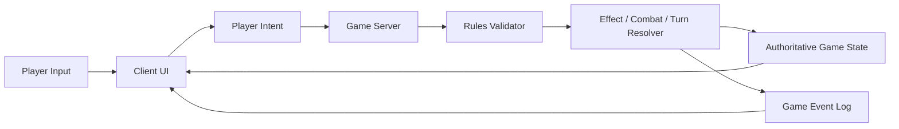
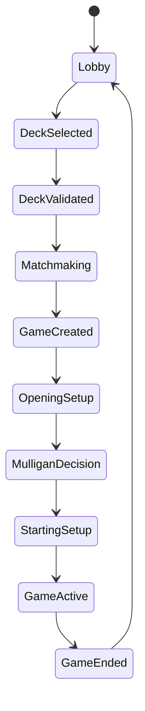
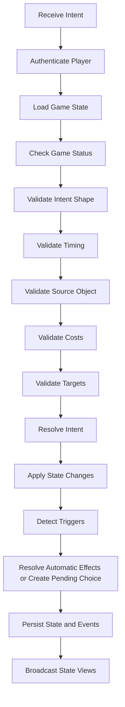
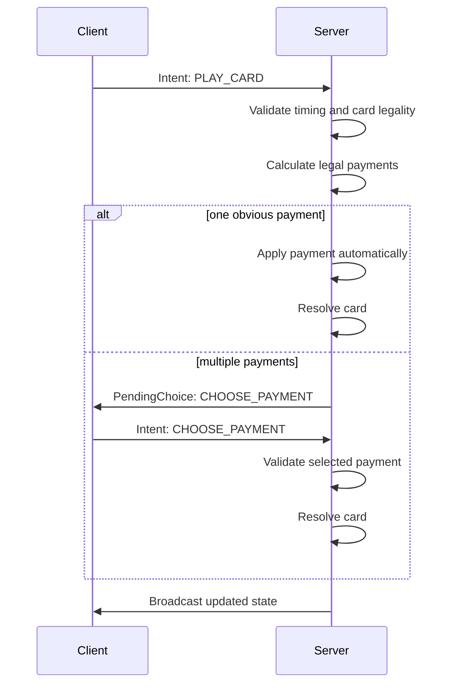
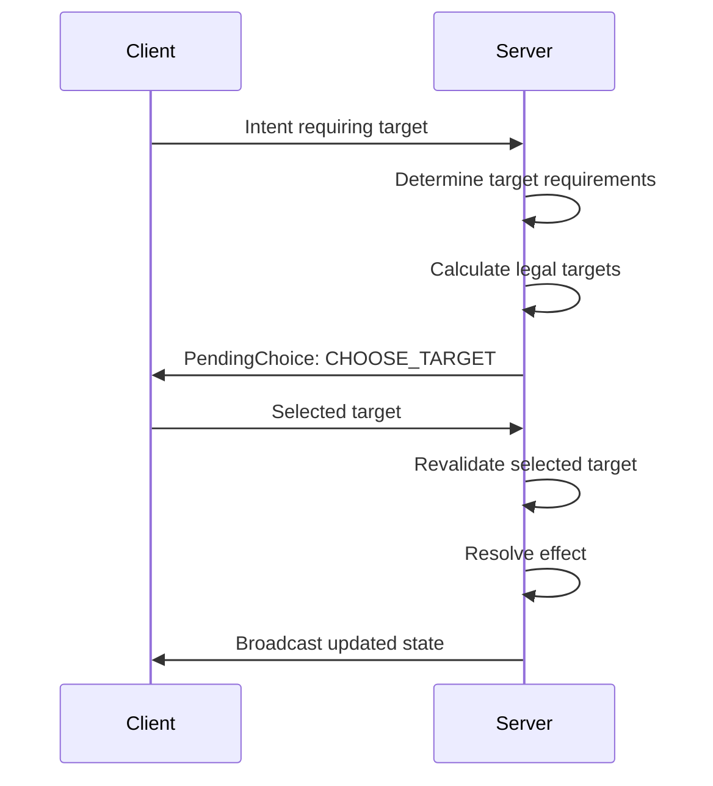

# Riftbound Automated Simulator — Implementation Support Document

## 1. Purpose

This document converts the observed behavior from a Riftbound semi-manual simulator video into implementation guidance for a fully automated digital game.

The source video shows a player using an existing simulator where many game actions are executed manually: moving cards, managing resources, selecting targets, updating board state, and resolving parts of the game flow. The goal of this document is to identify what should become automated and how to structure the implementation so the client only sends player intent while the server owns the authoritative game state and rules resolution.

This document is intended to support product and technical discovery before coding. It is not a replacement for the official Riftbound rules, card database, or card effect definitions.

---

## 2. Source Evidence

### 2.1 Source

- Source: uploaded gameplay video of a player using a Riftbound simulator.
- Video duration: approximately 1 hour, 16 minutes, 14 seconds.
- Observed simulator type: rules-light / semi-manual simulator.

### 2.2 What the video is useful for

The video is useful for identifying:

- The real player workflow during a match.
- Which game steps are currently manual.
- Which zones and board areas need to exist.
- Which client interactions are required.
- Which actions should become server-validated intents.
- Which pieces of game state must be authoritative and replayable.

### 2.3 What the video is not enough for

The video is not enough to fully define:

- Exact official turn structure.
- Complete card text behavior.
- Full timing/priority rules.
- All legal target rules.
- All replacement/prevention effects.
- Edge cases involving multiple simultaneous triggers.
- Complete victory/loss conditions.

Those items must come from the official rules document and card database.

---

## 3. Main Implementation Principle

The automated version should not allow the client to directly mutate the game board.

The client should send player intents, and the server should validate and resolve those intents according to the game rules and card effects.

### 3.1 Current semi-manual behavior

In the observed simulator, the player can manually perform actions such as:

- Moving cards between zones.
- Exhausting or readying resources.
- Selecting targets.
- Adjusting board state.
- Managing card placement.
- Progressing turns.
- Resolving card effects manually or semi-manually.

### 3.2 Desired automated behavior

In the automated game:

- The server owns the full game state.
- The client renders the state received from the server.
- The client shows legal actions available to the player.
- The player chooses an intent.
- The server validates the intent.
- The server applies rules and effects.
- The server emits a new state and a game event log.

### 3.3 Rule of thumb

If an action changes the truth of the game, it belongs to the server.

If an action only changes how the game is displayed, it belongs to the client.

---

## 4. High-Level Architecture



### 4.1 Client responsibilities

The client is responsible for:

- Rendering the board.
- Showing cards, zones, counters, and previews.
- Showing legal actions and legal targets.
- Collecting player decisions.
- Sending intents to the server.
- Displaying the event log.
- Animating state changes.
- Supporting spectators and replays through server state/events.

The client should not be responsible for:

- Deciding whether a move is legal.
- Applying damage.
- Paying costs.
- Resolving effects.
- Drawing cards without server command.
- Moving cards between zones without server command.
- Determining victory/loss conditions.

### 4.2 Server responsibilities

The server is responsible for:

- Match creation.
- Deck validation.
- Randomization/shuffle.
- Mulligan handling.
- Turn and phase progression.
- Legal action calculation.
- Cost validation and payment.
- Card play validation.
- Target validation.
- Combat resolution.
- Card effect resolution.
- Trigger detection and ordering.
- State mutation.
- Event log generation.
- Reconnect-safe state recovery.
- Replay/audit support.

---

## 5. Match Lifecycle

The video shows a flow that starts before the game and continues through at least one full match cycle. The implementation should represent the game as a state machine rather than assuming the game is always in an active turn.



### 5.1 Required match statuses

```ts
export type GameStatus =
  | "LOBBY"
  | "WAITING_FOR_OPPONENT"
  | "DECK_VALIDATION_FAILED"
  | "GAME_CREATED"
  | "MULLIGAN_DECISION"
  | "STARTING_SETUP"
  | "GAME_ACTIVE"
  | "GAME_ENDED";
```

### 5.2 Match lifecycle requirements

The implementation should support:

- Player selects deck.
- System validates deck legality.
- Opponent is found or assigned.
- Game instance is created.
- Decks are shuffled server-side.
- Starting hands are drawn server-side.
- Players make mulligan decisions.
- Initial board state is created.
- Active game begins.
- Turns progress until victory/loss/concession.
- Final result is persisted.

---

## 6. Core Zones

The video makes clear that the game requires multiple player-owned and shared zones.

### 6.1 Player zones

Each player should have:

- Deck.
- Hand.
- Discard or trash zone.
- Rune/resource zone.
- Legend/champion area.
- Units or permanents in play.
- Possibly a sideboard, depending on match format.

### 6.2 Shared zones

The match should have:

- Battlefield areas or lanes.
- Shared board positions.
- Pending effect/stack/queue area, if applicable by rules.
- Public game log.

### 6.3 Zone model

```ts
export type Zone =
  | "DECK"
  | "HAND"
  | "DISCARD"
  | "RUNE_ZONE"
  | "LEGEND_ZONE"
  | "CHAMPION_ZONE"
  | "BATTLEFIELD"
  | "IN_PLAY"
  | "STACK"
  | "EXILE"
  | "SIDEBOARD";
```

The exact zone names can change later, but the important implementation rule is that zone membership must be part of authoritative server state.

---

## 7. Card Identity and State

Every physical card in the match should be represented by a unique card instance. Two copies of the same printed card must still be different runtime objects.

### 7.1 Card instance model

```ts
export interface CardInstance {
  instanceId: string;
  cardCode: string;
  ownerPlayerId: string;
  controllerPlayerId: string;
  zone: Zone;
  visibility: CardVisibility;
  exhausted: boolean;
  damage: number;
  counters: CounterInstance[];
  attachments: string[];
  position?: BoardPosition;
  createdByEffectId?: string;
}

export type CardVisibility =
  | "PUBLIC"
  | "OWNER_ONLY"
  | "HIDDEN";

export interface CounterInstance {
  type: string;
  value: number;
}

export interface BoardPosition {
  battlefieldId?: string;
  slot?: number;
  row?: "FRONT" | "BACK";
}
```

### 7.2 Why unique instances are required

Unique card instances are required for:

- Correctly moving a specific copy between zones.
- Tracking damage on one unit but not another.
- Tracking attachments.
- Tracking temporary effects.
- Tracking ownership vs control changes.
- Supporting replays.
- Supporting reconnects.
- Debugging illegal actions.

---

## 8. Game State Model

The server should keep a complete authoritative game state.

```ts
export interface GameState {
  gameId: string;
  status: GameStatus;
  turnNumber: number;
  activePlayerId?: string;
  priorityPlayerId?: string;
  phase?: GamePhase;
  players: Record<string, PlayerState>;
  battlefields: BattlefieldState[];
  pendingChoice?: PendingChoice;
  effectQueue: PendingEffect[];
  eventLog: GameEvent[];
  winnerPlayerId?: string;
  lossReason?: string;
}
```

```ts
export interface PlayerState {
  playerId: string;
  displayName: string;
  deck: string[];
  hand: string[];
  discard: string[];
  runeZone: string[];
  legendZone: string[];
  championZone: string[];
  inPlay: string[];
  score: number;
  hasPassedPriority: boolean;
  hasPassedTurn: boolean;
}
```

```ts
export interface BattlefieldState {
  battlefieldId: string;
  cardInstanceId: string;
  controllerPlayerId?: string;
  units: string[];
  counters: CounterInstance[];
  status: "ACTIVE" | "CLAIMED" | "INACTIVE";
}
```

### 8.1 State visibility

The server may store full state, but the client should receive a player-specific projection.

A player should not receive hidden opponent hand information unless the rules or an effect reveal it.

```ts
export interface GameStateView {
  gameId: string;
  status: GameStatus;
  turnNumber: number;
  activePlayerId?: string;
  priorityPlayerId?: string;
  phase?: GamePhase;
  self: PlayerView;
  opponent: OpponentView;
  battlefields: BattlefieldView[];
  legalActions: LegalAction[];
  pendingChoice?: PendingChoiceView;
  eventLog: GameEventView[];
}
```

---

## 9. Turn and Phase Structure

The exact official turn structure must come from the rules document. However, the implementation should prepare for a structured phase engine.

### 9.1 Example phase model

```ts
export type GamePhase =
  | "START_OF_TURN"
  | "READY"
  | "DRAW"
  | "MAIN"
  | "COMBAT"
  | "END_OF_TURN";
```

The names above are placeholders. They should be aligned with the official Riftbound rules.

### 9.2 Phase engine requirements

The phase engine should:

- Know which player is active.
- Know what actions are legal in each phase.
- Automatically execute mandatory phase actions.
- Create pending choices for player decisions.
- Advance when all required decisions are complete.
- Emit events for each automatic transition.

### 9.3 Turn progression example

```ts
export const advanceTurn = (state: GameState): GameState => {
  const nextPlayerId = getNextPlayerId(state);

  return {
    ...state,
    turnNumber: state.turnNumber + 1,
    activePlayerId: nextPlayerId,
    priorityPlayerId: nextPlayerId,
    phase: "START_OF_TURN",
  };
};
```

---

## 10. Player Intents

The client should send structured player intents to the server.

An intent means: "The player wants to do this." It does not mean the action automatically happens.

The server decides whether the intent is legal and what actually happens.

### 10.1 Intent model

```ts
export type GameIntent =
  | KeepHandIntent
  | MulliganIntent
  | PlayCardIntent
  | ChoosePaymentIntent
  | ChooseTargetIntent
  | DeclareAttackIntent
  | ActivateAbilityIntent
  | PassPriorityIntent
  | PassTurnIntent
  | ConcedeIntent;
```

```ts
export interface BaseIntent {
  gameId: string;
  playerId: string;
  clientIntentId: string;
}
```

```ts
export interface KeepHandIntent extends BaseIntent {
  type: "KEEP_HAND";
}

export interface MulliganIntent extends BaseIntent {
  type: "MULLIGAN";
  cardInstanceIds: string[];
}

export interface PlayCardIntent extends BaseIntent {
  type: "PLAY_CARD";
  cardInstanceId: string;
  payment?: string[];
  targets?: string[];
  battlefieldId?: string;
}

export interface ChoosePaymentIntent extends BaseIntent {
  type: "CHOOSE_PAYMENT";
  runeInstanceIds: string[];
}

export interface ChooseTargetIntent extends BaseIntent {
  type: "CHOOSE_TARGET";
  targetIds: string[];
}

export interface DeclareAttackIntent extends BaseIntent {
  type: "DECLARE_ATTACK";
  attackerId: string;
  targetId: string;
}

export interface ActivateAbilityIntent extends BaseIntent {
  type: "ACTIVATE_ABILITY";
  sourceInstanceId: string;
  abilityId: string;
  payment?: string[];
  targets?: string[];
}

export interface PassPriorityIntent extends BaseIntent {
  type: "PASS_PRIORITY";
}

export interface PassTurnIntent extends BaseIntent {
  type: "PASS_TURN";
}

export interface ConcedeIntent extends BaseIntent {
  type: "CONCEDE";
}
```

### 10.2 Intent processing pipeline



---

## 11. Pending Choices

Many game actions cannot resolve immediately because the player must choose something.

Examples:

- Mulligan selection.
- Choosing targets.
- Choosing how to pay a cost.
- Choosing between optional effects.
- Ordering simultaneous triggers.
- Choosing cards from hand/deck/discard.

### 11.1 Pending choice model

```ts
export interface PendingChoice {
  choiceId: string;
  playerId: string;
  type: PendingChoiceType;
  sourceInstanceId?: string;
  effectId?: string;
  legalOptions: LegalOption[];
  minSelections: number;
  maxSelections: number;
  canDecline: boolean;
}

export type PendingChoiceType =
  | "MULLIGAN"
  | "CHOOSE_PAYMENT"
  | "CHOOSE_TARGET"
  | "CHOOSE_CARD"
  | "ORDER_TRIGGERS"
  | "OPTIONAL_EFFECT";
```

### 11.2 Pending choice rule

When a pending choice exists, only the required player should be able to answer it unless the rules explicitly allow another action.

This prevents board state from continuing while a mandatory decision is unresolved.

---

## 12. Rune and Cost Automation

The video shows rune/resource management as one of the most important manual responsibilities.

The automated game should make payment rule-driven.

### 12.1 Required behavior

The server should:

- Identify available runes.
- Calculate legal payment combinations.
- Validate selected payment.
- Exhaust or consume resources as required.
- Apply cost modifiers.
- Apply additional costs.
- Apply alternative costs.
- Reject illegal payments.

### 12.2 Payment flow



### 12.3 Payment model

```ts
export interface CostDefinition {
  generic?: number;
  colors?: Record<string, number>;
  additionalCosts?: AdditionalCost[];
  alternativeCosts?: AlternativeCost[];
}

export interface PaymentOption {
  paymentId: string;
  runeInstanceIds: string[];
  satisfies: CostDefinition;
}
```

---

## 13. Playing Cards

Playing a card should be fully server-validated.

### 13.1 Validation checklist

When a player tries to play a card, the server should validate:

- The game is active.
- The player is allowed to act.
- The card is in the correct zone.
- The card type is playable at the current timing.
- The player can pay the cost.
- The chosen battlefield or placement is legal.
- All required targets are legal.
- No rule or effect prevents the card from being played.

### 13.2 Resolution checklist

When the card resolves, the server should:

- Move the card to the correct zone.
- Apply payment.
- Apply immediate effects.
- Create pending choices if needed.
- Detect triggered abilities.
- Update event log.
- Recalculate legal actions.
- Broadcast new state views.

---

## 14. Targeting Automation

The video shows target lines and manual target selection. In a fully automated version, target legality should be calculated by the server.

### 14.1 Targeting flow



### 14.2 Target requirement model

```ts
export interface TargetRequirement {
  targetType: "UNIT" | "BATTLEFIELD" | "PLAYER" | "CARD" | "RUNE";
  controller?: "SELF" | "OPPONENT" | "ANY";
  zone?: Zone;
  minSelections: number;
  maxSelections: number;
  filters?: TargetFilter[];
}
```

### 14.3 Targeting rules

The server must validate targets both when options are shown and when the player submits the choice.

This is important because the board state may change between target selection and resolution.

---

## 15. Combat Automation

Combat appears to be one of the largest manual workflows in the observed simulator.

The automated game should eventually own combat end to end.

### 15.1 Combat responsibilities

The combat engine should handle:

- Legal attackers.
- Legal attack targets.
- Exhausting attackers.
- Blocking or defense steps, if applicable by rules.
- Damage assignment.
- Unit defeat/destruction.
- Battlefield progress or scoring.
- Combat-related triggers.
- End-of-combat cleanup.

### 15.2 Combat intent

```ts
export interface DeclareAttackIntent extends BaseIntent {
  type: "DECLARE_ATTACK";
  attackerId: string;
  targetId: string;
}
```

### 15.3 Combat resolution example

```ts
export const resolveAttack = (
  state: GameState,
  intent: DeclareAttackIntent,
): GameState => {
  const attacker = getCard(state, intent.attackerId);
  const target = getTarget(state, intent.targetId);

  validateAttack(state, attacker, target);

  let nextState = exhaustCard(state, attacker.instanceId);
  nextState = assignCombatDamage(nextState, attacker, target);
  nextState = destroyDefeatedUnits(nextState);
  nextState = detectCombatTriggers(nextState);

  return nextState;
};
```

The exact damage and scoring rules must come from the official rules.

---

## 16. Effect and Trigger Engine

A fully automated game requires a card effect engine. This should be data-driven as much as possible, but not every card has to be automated in the first implementation phase.

### 16.1 Effect categories

The engine should prepare for:

- Immediate effects.
- Activated abilities.
- Triggered abilities.
- Static effects.
- Replacement effects.
- Prevention effects.
- Optional effects.
- Continuous modifiers.
- Duration-based effects.

### 16.2 Effect definition model

```ts
export interface CardDefinition {
  cardCode: string;
  name: string;
  type: string;
  cost?: CostDefinition;
  abilities: AbilityDefinition[];
}

export interface AbilityDefinition {
  abilityId: string;
  type: "IMMEDIATE" | "ACTIVATED" | "TRIGGERED" | "STATIC" | "REPLACEMENT";
  timing?: TimingRestriction;
  cost?: CostDefinition;
  trigger?: TriggerDefinition;
  targets?: TargetRequirement[];
  effects: EffectStep[];
  optional?: boolean;
}

export interface EffectStep {
  type:
    | "DRAW"
    | "DAMAGE"
    | "MOVE_CARD"
    | "BUFF"
    | "DEBUFF"
    | "READY"
    | "EXHAUST"
    | "CREATE_TOKEN"
    | "GAIN_POINTS"
    | "SEARCH_DECK"
    | "DISCARD"
    | "CUSTOM";
  params: Record<string, unknown>;
}
```

### 16.3 Trigger detection

The server should detect triggers after relevant events.

Example events that may produce triggers:

- Card played.
- Unit enters play.
- Unit leaves play.
- Unit attacks.
- Unit takes damage.
- Unit is defeated.
- Battlefield is claimed.
- Player draws.
- Player discards.
- Turn starts.
- Turn ends.

### 16.4 Trigger ordering

If multiple triggers happen at the same time, the game may require ordering rules. If the rules allow the player to choose order, the server should create a pending choice.

```ts
export interface TriggeredAbilityInstance {
  triggerInstanceId: string;
  sourceInstanceId: string;
  abilityId: string;
  controllerPlayerId: string;
  createdByEventId: string;
}
```

---

## 17. Event Log and Replay

The observed simulator includes a visible game log. In the automated version, this should become a first-class technical feature.

### 17.1 Event log requirements

The game log should:

- Be generated by the server.
- Be ordered by sequence number.
- Include player-facing messages.
- Include machine-readable event types.
- Support replay reconstruction.
- Support debugging.
- Support spectator mode.
- Support reconnects.

### 17.2 Event model

```ts
export interface GameEvent {
  eventId: string;
  sequence: number;
  type: GameEventType;
  actorPlayerId?: string;
  payload: Record<string, unknown>;
  publicMessage: string;
  createdAt: string;
  resultingStateHash?: string;
}
```

```ts
export type GameEventType =
  | "GAME_CREATED"
  | "DECK_SHUFFLED"
  | "HAND_DRAWN"
  | "MULLIGAN_COMPLETED"
  | "TURN_STARTED"
  | "PHASE_CHANGED"
  | "CARD_DRAWN"
  | "CARD_PLAYED"
  | "COST_PAID"
  | "TARGET_CHOSEN"
  | "ABILITY_TRIGGERED"
  | "EFFECT_RESOLVED"
  | "ATTACK_DECLARED"
  | "DAMAGE_DEALT"
  | "CARD_DEFEATED"
  | "CARD_MOVED"
  | "POINTS_GAINED"
  | "TURN_ENDED"
  | "PLAYER_CONCEDED"
  | "GAME_ENDED";
```

### 17.3 Replay strategy

There are two possible replay strategies:

1. Event sourcing: rebuild the game state from the initial state and events.
2. Snapshot plus events: store periodic state snapshots and replay events after the latest snapshot.

For early implementation, snapshot plus events is safer and easier to debug.

---

## 18. Legal Actions API

The client should be able to ask the server what the current player can do.

### 18.1 Legal action model

```ts
export interface LegalAction {
  type: GameIntent["type"];
  label: string;
  sourceInstanceId?: string;
  legalTargets?: string[];
  requiresPayment?: boolean;
  requiresChoice?: boolean;
  disabledReason?: string;
}
```

### 18.2 Why legal actions matter

Legal actions help the client:

- Highlight playable cards.
- Disable illegal cards.
- Show valid targets.
- Avoid unnecessary failed requests.
- Guide new players through the game.

However, legal actions are only a convenience. The server must still validate every submitted intent.

---

## 19. Manual Simulator Actions and Automated Replacements

| Observed manual simulator behavior | Automated implementation replacement |
|---|---|
| Player manually keeps or changes opening hand | Server-owned mulligan state and intent |
| Player manually moves cards from hand to board | `PLAY_CARD` intent validated by server |
| Player manually exhausts runes/resources | Server payment validation and automatic exhaustion |
| Player manually selects targets with visual lines | Server target calculation and `CHOOSE_TARGET` pending choice |
| Player manually handles combat interactions | Server combat engine |
| Player manually updates damage/counters | Server damage/counter state mutation |
| Player manually advances parts of the game | Server phase and turn engine |
| Player manually resolves effects | Server effect resolver |
| Simulator displays action log | Server-generated event log |
| Player can visually manipulate board state | Client sends intents only; server returns state |

---

## 20. Implementation Phases

### Phase 1 — Automated Game Shell

Goal: create a stable server-authoritative game foundation.

Scope:

- Lobby and deck selection.
- Deck validation placeholder.
- Match creation.
- Server-side shuffle.
- Opening hand.
- Mulligan.
- Basic zones.
- Basic turn progression.
- Draw card.
- Pass turn.
- Event log.
- Reconnect-safe state snapshots.

Out of scope:

- Full card effects.
- Full combat automation.
- Complex trigger ordering.
- Full rules enforcement.

### Phase 2 — Resource and Play Validation

Goal: automate card play and resource payment.

Scope:

- Card cost model.
- Rune/resource availability.
- Legal payment generation.
- Playing cards from hand.
- Placement validation.
- Basic timing validation.
- Basic target requirements.

Out of scope:

- Complex replacement effects.
- Full card database automation.

### Phase 3 — Combat Engine

Goal: automate the most common board interaction.

Scope:

- Legal attackers.
- Legal attack targets.
- Attack declaration.
- Exhaust attacker.
- Damage assignment.
- Unit defeat.
- Battlefield scoring/progress, based on official rules.
- Combat event log.

Out of scope:

- Every card-specific combat replacement effect.

### Phase 4 — Effect Engine

Goal: support card text resolution.

Scope:

- Effect schema.
- Activated abilities.
- Triggered abilities.
- Immediate effects.
- Optional effects.
- Pending choices.
- Targeted effects.
- Common effect steps: draw, damage, move, ready, exhaust, buff, discard.

Out of scope:

- Rare edge-case effects that need custom handlers.

### Phase 5 — Full Rules and Card Database Integration

Goal: make the game fully automated and testable against official rules/card data.

Scope:

- Full rules JSON integration.
- Card database integration.
- Official card text mapping.
- Rule-specific validation.
- Replacement/prevention effects.
- Simultaneous trigger ordering.
- Victory/loss conditions.
- Replay-based regression tests.

---

## 21. Suggested Backend Modules

```text
src/
  game/
    game-state.ts
    game-state-view.ts
    game-status.ts
    game-phase.ts
  match/
    create-match.ts
    validate-deck.ts
    matchmaking.ts
  intents/
    intent-types.ts
    process-intent.ts
    validators/
      validate-turn.ts
      validate-card-play.ts
      validate-payment.ts
      validate-targets.ts
      validate-combat.ts
  rules/
    phase-engine.ts
    cost-engine.ts
    target-engine.ts
    combat-engine.ts
    effect-engine.ts
    trigger-engine.ts
    victory-engine.ts
  cards/
    card-definition.ts
    card-database.ts
    effect-definition.ts
  events/
    game-event.ts
    event-log.ts
    replay.ts
  persistence/
    game-repository.ts
    snapshot-repository.ts
  realtime/
    game-room.ts
    broadcast-state.ts
```

---

## 22. Suggested Frontend Modules

```text
src/
  game/
    components/
      GameBoard.tsx
      PlayerArea.tsx
      OpponentArea.tsx
      BattlefieldArea.tsx
      Card.tsx
      CardPreview.tsx
      Hand.tsx
      RuneZone.tsx
      EventLog.tsx
      PendingChoiceModal.tsx
    hooks/
      useGameState.ts
      useLegalActions.ts
      useSubmitIntent.ts
    state/
      local-ui-state.ts
    utils/
      card-visibility.ts
      board-position.ts
```

Frontend implementation should separate local UI state from authoritative game state.

Examples of local UI state:

- Hovered card.
- Selected card.
- Drag preview.
- Open card zoom.
- Animation state.
- Locally highlighted legal targets.

Examples of authoritative game state:

- Which zone a card is in.
- Whether a unit is exhausted.
- How much damage a unit has.
- How many cards are in hand/deck.
- Which player has priority.
- Which phase the game is in.

---

## 23. API Endpoints

### 23.1 Match endpoints

```http
POST /api/matches
POST /api/matches/{matchId}/join
GET  /api/matches/{matchId}
```

### 23.2 Game state endpoints

```http
GET /api/games/{gameId}/state
GET /api/games/{gameId}/events
GET /api/games/{gameId}/legal-actions
```

### 23.3 Intent endpoint

```http
POST /api/games/{gameId}/intents
```

Request:

```json
{
  "type": "PLAY_CARD",
  "clientIntentId": "intent_123",
  "cardInstanceId": "card_456",
  "payment": ["rune_1", "rune_2"],
  "targets": ["target_1"]
}
```

Response:

```json
{
  "accepted": true,
  "stateVersion": 42,
  "events": [],
  "pendingChoice": null
}
```

### 23.4 Real-time updates

The game should support real-time updates through WebSocket or a similar persistent channel.

Recommended events:

```text
game.state.updated
game.event.created
game.pending_choice.created
game.pending_choice.resolved
game.ended
player.connected
player.disconnected
```

---

## 24. State Versioning and Concurrency

The server should protect the game from stale or duplicated intents.

### 24.1 Recommended protections

- Every game state has a version number.
- Every submitted intent has a client intent ID.
- Duplicate client intent IDs are ignored or return the previous result.
- Intents submitted for old state versions can be rejected or revalidated.
- Only the expected player can answer a pending choice.

```ts
export interface VersionedGameState extends GameState {
  version: number;
  lastProcessedIntentIds: Record<string, string[]>;
}
```

---

## 25. Testing Strategy

### 25.1 Unit tests

Unit test core rule modules:

- Cost validation.
- Target validation.
- Card movement.
- Damage assignment.
- Trigger detection.
- Phase advancement.
- Legal action calculation.

### 25.2 Integration tests

Integration test complete player flows:

- Create game.
- Draw opening hand.
- Keep hand.
- Start game.
- Draw for turn.
- Play a card.
- Pay cost.
- Declare attack.
- Resolve combat.
- End turn.

### 25.3 Replay tests

Use real or manually authored game scripts to verify deterministic outcomes.

Example:

```json
[
  { "type": "KEEP_HAND", "playerId": "p1" },
  { "type": "KEEP_HAND", "playerId": "p2" },
  { "type": "PLAY_CARD", "playerId": "p1", "cardInstanceId": "card_1" },
  { "type": "PASS_TURN", "playerId": "p1" }
]
```

The test should assert:

- Final state.
- Event log sequence.
- No hidden information leaked.
- No illegal action accepted.

---

## 26. Product Definition Notes

The video suggests that the automated game should prioritize the following user needs:

1. Players should not need to manually maintain legal board state.
2. Players should be guided through legal actions.
3. The game should prevent illegal actions before they affect the match.
4. The game should resolve common actions automatically.
5. The game should keep a clear log of what happened.
6. The game should support reconnects without losing match truth.
7. The game should make manual overrides unnecessary in normal play.

---

## 27. Open Questions

These questions should be answered from the official Riftbound rules and card database before full automation.

### 27.1 Rules questions

- What is the exact official turn structure?
- Are there priority windows or response windows?
- When can each card type be played?
- How are battlefields selected, claimed, or scored?
- What are the exact combat steps?
- How is damage assigned and cleared?
- What are the exact victory/loss conditions?
- How are simultaneous triggers ordered?
- How are replacement and prevention effects handled?
- Are there hidden choices that need special information rules?

### 27.2 Card implementation questions

- Will card effects be stored as structured data?
- Which cards require custom code handlers?
- How will card errata or rules updates be versioned?
- How should tokens or generated objects be represented?
- How should temporary effects and duration tracking work?

### 27.3 Product questions

- Should players ever be allowed to request a manual judge override?
- Should the simulator support spectator mode in MVP?
- Should the simulator support replay export in MVP?
- Should unfinished matches be resumable?
- Should the first implementation support only one format/deck type?

---

## 28. Recommended Next Deliverables

After this document, the next useful artifacts are:

1. **Game Definition Document**  
   Defines what the automated simulator must do from the player perspective.

2. **Technical Definition Document**  
   Defines architecture, server modules, data contracts, state management, persistence, and real-time communication.

3. **Rules Mapping Document**  
   Maps official rules to implementation concepts: phases, actions, costs, targets, effects, triggers, and victory conditions.

4. **Card Effect Schema Document**  
   Defines how card text becomes structured executable behavior.

5. **MVP Scope Document**  
   Defines which parts of the game are automated first and which remain out of scope.

---

## 29. Summary

The observed simulator is a useful reference because it shows how players currently operate the game manually. The fully automated implementation should preserve the useful interface concepts — board layout, card preview, action log, visible zones, and player choices — while moving game truth into a server-owned rules engine.

The most important technical decision is to make the game server-authoritative. The client should submit intents, the server should validate and resolve them, and every state change should produce a structured event.

This foundation will make the game easier to test, replay, debug, reconnect, and eventually fully automate against the complete Riftbound rule set and card database.
