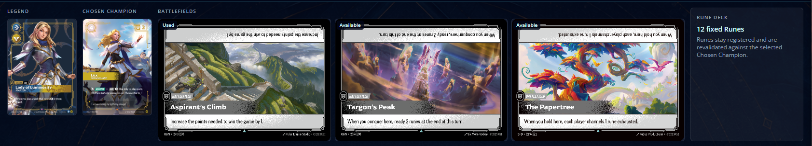
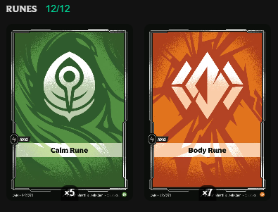
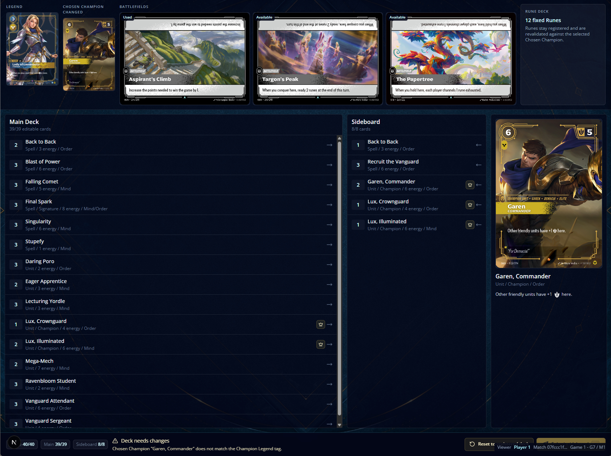
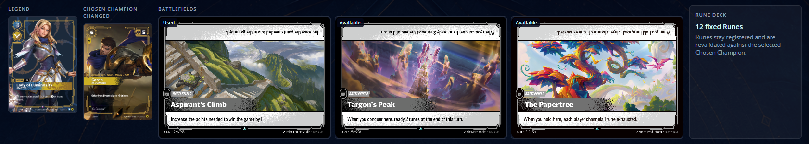
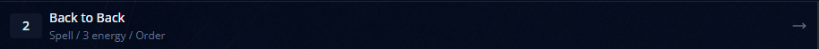
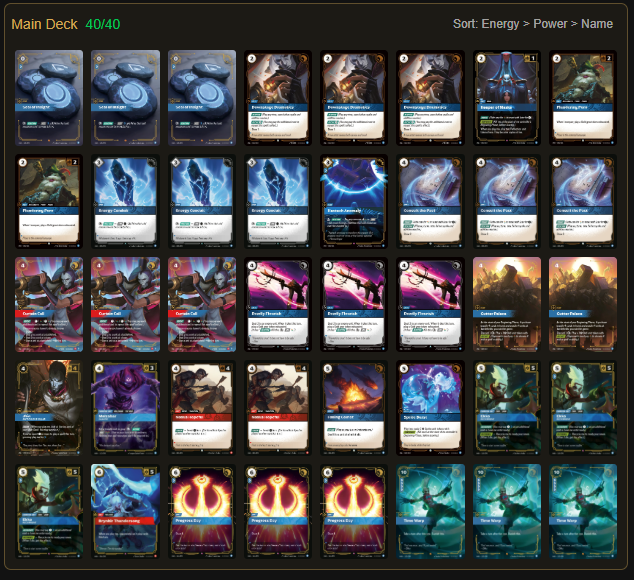
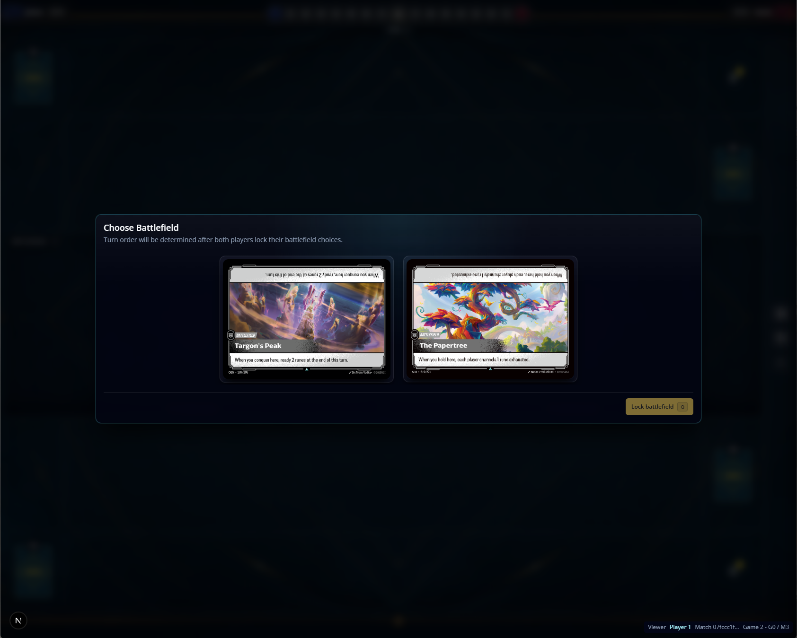

- if the deck has the right amount of cards, the sideboard screen do not allow to remove a card from the main deck;
- the runes decks part is not what I'm expecting, we could change this for the amout of runes the deck have.  
- is possible to change the choosen champion to invalid ones. the "change choosen champion" feature should only allow valid champions to be choosen. 
- the change choosen champion icon could use a tooltip to make it more explicit what the intention is
- the label "Chosen Champion changed" shifts the top of the card, and it shouldn't. 
- this card tiles should use game assets like domain icons. 
- the change view mode group tabs should be closer to the card listing, visual hierarchy matters.
- the "change choosen champion" button is almost unnoticeble on the grid view.
- I would like to implement a new view mode, where every card face shows individually, here is a benchmark. 
- the used battlefields should be shown on the next game screen as disabled. 
