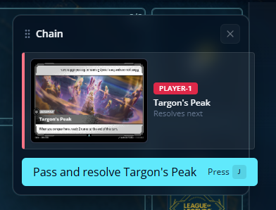
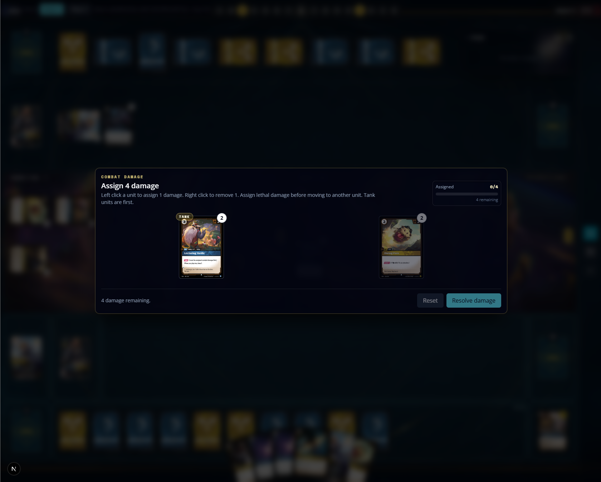
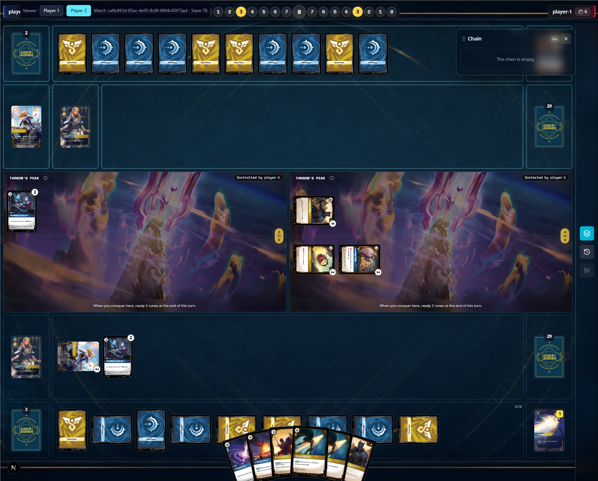
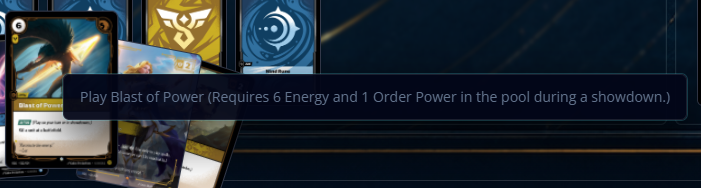
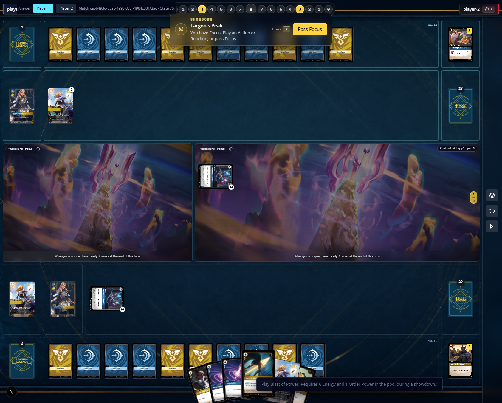
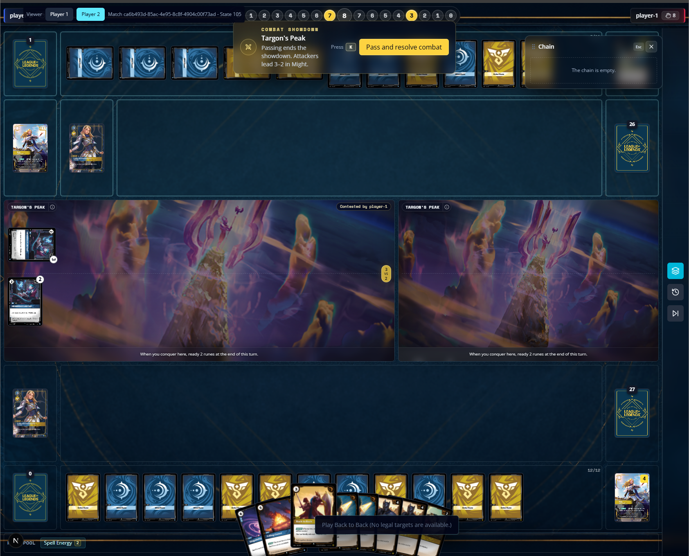
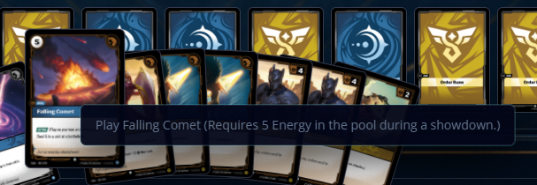

# Riftbound Simulator – UI and Gameplay Fix Notes

## 1. Chain resolve CTA should not repeat the card name

**Issue:** The Chain panel already shows the card currently resolving, including the card name and resolution context. Because of that, the button text repeating the card name creates duplicated information and makes the CTA longer than necessary, especially when card names are long.

**What should happen:** The Chain CTA should use action-only wording. When passing will resolve the current chain item, the button should say **“Pass and Resolve”**. The source card name should remain visible only in the chain item content, not inside the button.

---

## 3. Combat damage assignment needs waiting feedback for the non-actor player

**Issue:** When one player is assigning combat damage, the opponent keeps seeing the board but does not receive clear feedback that the game is waiting for the other player. This makes the board feel frozen or unresponsive, even though the game is correctly waiting for a pending combat damage choice.

**What should happen:** The non-actor player should see a top pending-choice banner while the board remains visible. The banner should explain that the opponent is assigning combat damage, for example: **“Combat Damage — Waiting for Player 2 to assign combat damage.”** The combat damage dialog should only appear for the player who is currently making the assignment.

---

## 4. Play context menu should not show detailed unavailable reasons

**Issue:** The play context menu currently shows long unavailable reasons, such as missing Energy, Power, targets, or showdown timing restrictions. These long messages make the menu too wide, visually noisy, and disruptive over the hand and board.

**What should happen:** When a card cannot currently be played, the context menu should show only **“Not playable”**. Detailed unavailable reasons should not be displayed in the menu or as a tooltip. The menu should stay compact and focused on the player’s available actions.

---

## 5. Action and Reaction cards should be playable during Showdown with automatic resource use

**Issue:** Action cards are currently not playable during Showdown even when they should be. The game is also showing unavailable play states that imply the player must manually add resources first, but the intended behavior is for the engine to auto-use available runes and resources during Showdown the same way it does during normal play.

**What should happen:** During Showdown Open, cards with **Action** or **Reaction** should be playable when the player has enough available runes/resources and legal targets. During Showdown Closed, only **Reaction** cards should be playable. The engine should automatically evaluate and use available resources instead of requiring the player to manually add Energy or Power before playing the card.

